                 

### 第1章：老龄化社会的挑战与机遇

#### 1.1 老龄化社会的现状与趋势

随着全球医疗水平的提升和生活质量的提高，人口老龄化已成为一个不可逆转的趋势。根据联合国的数据，截至2021年，全球65岁及以上人口已超过7亿，占全球总人口的9%。预计到2050年，这一比例将上升至22%。老龄化社会的到来不仅带来了人口结构的深刻变化，也对经济、社会和健康等多个领域产生了深远的影响。

**核心概念与联系**：

老龄化社会的概念可以通过以下Mermaid流程图来展示：

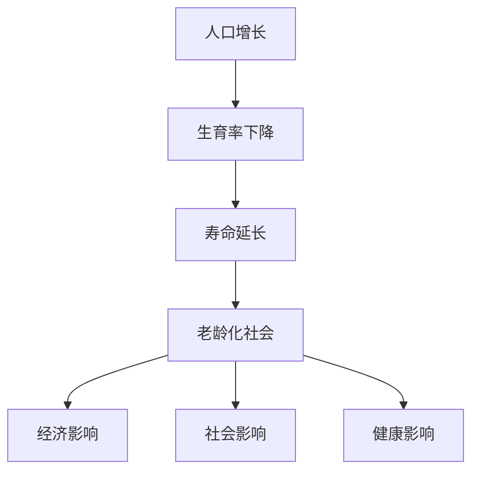
```mermaid
graph TD
    A[人口增长] --> B[生育率下降]
    B --> C[寿命延长]
    C --> D[老龄化社会]
    D --> E[经济影响]
    D --> F[社会影响]
    D --> G[健康影响]
```

**核心算法原理讲解**：

为了更好地理解老龄化对社会的影响，我们可以使用以下伪代码来描述：

```python
def aging_impact(working_age_population, older_population, total_population):
    dependency_ratio = older_population / (working_age_population + older_population)
    if dependency_ratio > 0.5:
        return "社会压力较大，需政策支持"
    else:
        return "社会压力较小，但需关注趋势"
```

在这个函数中，`dependency_ratio` 表示老年人口对工作年龄人口的比例。如果这一比例超过50%，则表示社会面临较大的压力。

**数学模型和数学公式**：

老龄化率可以用以下数学公式表示：

$$ \text{老龄化率} = \frac{\text{65岁及以上人口数}}{\text{总人口数}} $$

**详细讲解与举例说明**：

- **经济影响**：随着老年人口的增加，劳动力市场的供给减少，可能导致经济增长放缓。同时，养老保障体系的压力也会增加，需要政策调整来应对。

- **社会影响**：老年人的参与和贡献对社会的和谐与稳定具有重要意义。他们通过参与社会活动、传承文化和经验等方式，对社会的可持续发展发挥着重要作用。

#### 1.2 老龄化对社会的影响

老龄化不仅影响了经济，还对社会结构和健康产生了深远的影响。

**核心概念与联系**：

老龄化对社会的影响可以通过以下Mermaid流程图来展示：

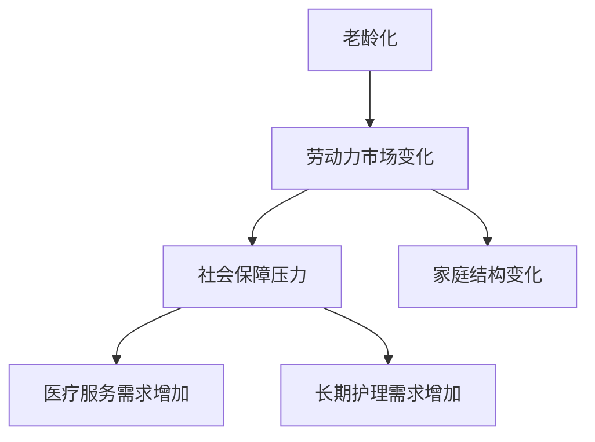
```mermaid
graph TD
    A[老龄化] --> B[劳动力市场变化]
    B --> C[社会保障压力]
    B --> D[家庭结构变化]
    C --> E[医疗服务需求增加]
    C --> F[长期护理需求增加]
```

**核心算法原理讲解**：

为了更好地理解老龄化对社会的影响，我们可以使用以下伪代码来描述：

```python
def social_impact(older_population, total_population):
    social_load = older_population / total_population
    if social_load > 1.0:
        return "社会压力较大，需政策支持"
    else:
        return "社会压力较小，但需关注趋势"
```

在这个函数中，`social_load` 表示老年人口对总人口的负担。如果这一比例超过1.0，则表示社会面临较大的压力。

**数学模型和数学公式**：

社会保障负担可以用以下数学公式表示：

$$ \text{社会保障负担} = \frac{\text{老年人口数}}{\text{总人口数}} $$

**详细讲解与举例说明**：

- **劳动力市场变化**：随着老年人口的增加，劳动力市场的供给减少，可能导致经济增长放缓。同时，养老保障体系的压力也会增加，需要政策调整来应对。

- **社会保障压力**：随着老年人口的增加，社会保障体系的压力也会增加。这需要政府和社会各界共同努力，建立更加完善的社会保障体系。

#### 1.3 老龄化与生命的意义

老龄化不仅仅是人口结构的变化，它也深刻影响着每个人的生活质量和生命的意义。

**核心概念与联系**：

老龄化与生命的意义可以通过以下Mermaid流程图来展示：

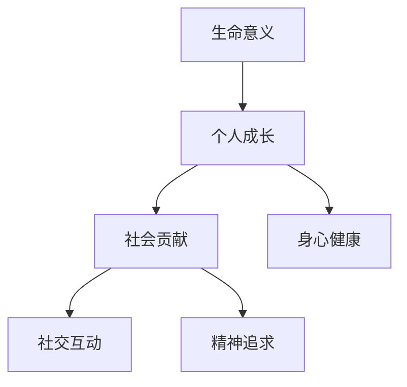
```mermaid
graph TD
    A[生命意义] --> B[个人成长]
    B --> C[社会贡献]
    B --> D[身心健康]
    C --> E[社交互动]
    C --> F[精神追求]
```

**核心算法原理讲解**：

为了更好地理解老龄化与生命的意义，我们可以使用以下伪代码来描述：

```python
def life_meaning(older_person, social_contribution, health_status):
    if social_contribution > 0 and health_status > 70:
        return "积极的生活意义"
    else:
        return "需要关注的生活意义"
```

在这个函数中，`social_contribution` 表示个人的社会贡献，`health_status` 表示个人的健康状况。如果这两个指标都良好，则表示个人具有积极的生活意义。

**数学模型和数学公式**：

生命质量可以用以下数学公式表示：

$$ \text{生命质量} = \frac{\text{社会贡献} + \text{身心健康}}{2} $$

**详细讲解与举例说明**：

- **个人成长**：老龄化并不意味着个人的成长停止。相反，老年人可以通过学习新知识、参与社会活动等方式，继续实现个人的成长和发展。

- **社会贡献**：老年人可以通过志愿服务、社区参与等方式，继续为社会做出贡献。这种贡献不仅有助于提升个人的生命意义，也能增强社会的凝聚力。

- **身心健康**：保持身心健康是老年人实现积极生命意义的重要因素。这包括适当的运动、健康的饮食习惯和定期的医疗检查。

**小结**：

通过本章的讨论，我们可以看到老龄化社会带来的挑战与机遇。理解老龄化不仅仅是关注人口结构的变化，更是要关注老年人的生活质量和社会贡献。在接下来的章节中，我们将进一步探讨如何优雅地面对衰老，以及如何通过技术创新来应对老龄化社会的挑战。

----------------------------------------------------------------

## 第2章：理解衰老的生物学原理

衰老是生命过程中的一个自然现象，涉及多个生物学层面的变化。理解衰老的生物学原理对于制定有效的健康维护策略具有重要意义。在本章中，我们将深入探讨细胞衰老、基因调控以及系统生物学与衰老过程的关系。

### 2.1 细胞衰老与基因调控

细胞衰老是衰老过程的核心。细胞衰老是指细胞功能逐渐下降，最终导致细胞死亡的现象。基因调控在细胞衰老过程中起着关键作用。以下内容将详细阐述这些概念及其相互关系。

#### 核心概念与联系

细胞衰老与基因调控之间的关系可以通过以下Mermaid流程图来展示：

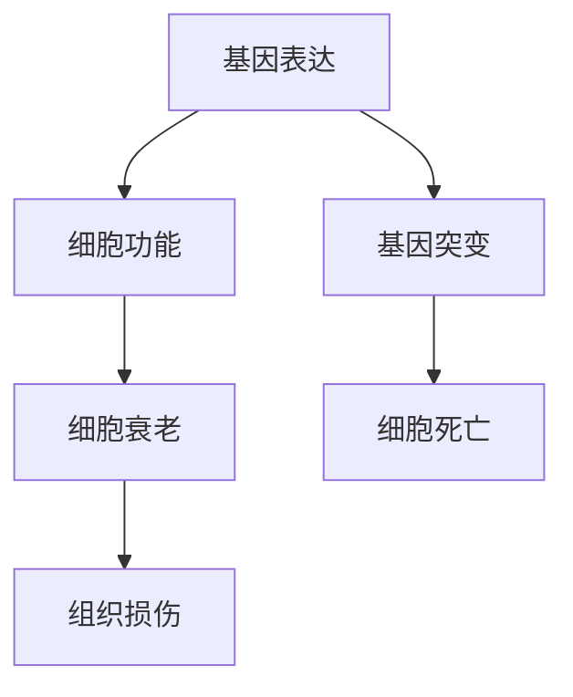
```mermaid
graph TD
    A[基因表达] --> B[细胞功能]
    B --> C[细胞衰老]
    C --> D[组织损伤]
    A --> E[基因突变]
    E --> F[细胞死亡]
```

**核心算法原理讲解**

为了更好地理解细胞衰老与基因调控的关系，我们可以使用以下伪代码来描述：

```python
def cell_aging(gene_expression, gene_mutation):
    if gene_mutation > 0:
        return "细胞衰老加速"
    else:
        return "细胞衰老减缓"
```

在这个函数中，`gene_expression` 表示基因表达水平，`gene_mutation` 表示基因突变率。如果基因突变率较高，则细胞衰老速度会加快。

**数学模型和数学公式**

细胞衰老速率可以用以下数学公式表示：

$$ \text{衰老速率} = \frac{\text{基因突变率}}{\text{基因表达水平}} $$

**详细讲解与举例说明**

- **基因表达与细胞功能**：基因表达是指基因在细胞中转录和翻译成蛋白质的过程。基因表达水平直接影响细胞的功能。例如，某些基因的表达可能促进细胞增殖，而其他基因的表达可能抑制细胞增殖。

- **基因突变与细胞死亡**：基因突变是指基因序列发生变化的过程。基因突变可能导致细胞功能异常，最终导致细胞死亡。

### 2.2 系统生物学与衰老过程

系统生物学是一种研究生物系统整体行为的生物学分支。它关注的是生物系统中各个组成部分如何相互作用，以及如何共同维持系统的稳定性和适应性。在衰老过程中，系统生物学提供了新的视角来理解生物学现象。

#### 核心概念与联系

系统生物学与衰老过程之间的关系可以通过以下Mermaid流程图来展示：

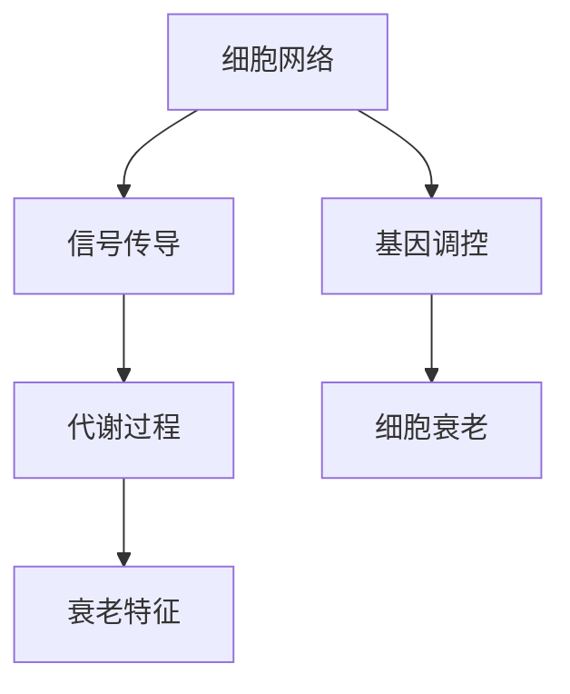
```mermaid
graph TD
    A[细胞网络] --> B[信号传导]
    B --> C[代谢过程]
    C --> D[衰老特征]
    A --> E[基因调控]
    E --> F[细胞衰老]
```

**核心算法原理讲解**

为了更好地理解系统生物学与衰老过程的关系，我们可以使用以下伪代码来描述：

```python
def system_biology(cell_network, signal_transduction, metabolism):
    if cell_network and signal_transduction and metabolism:
        return "系统稳定，衰老减缓"
    else:
        return "系统不稳定，衰老加速"
```

在这个函数中，`cell_network` 表示细胞网络结构，`signal_transduction` 表示信号传导过程，`metabolism` 表示代谢过程。如果这些系统组成部分正常运作，则衰老速度会减缓。

**数学模型和数学公式**

系统稳定性可以用以下数学公式表示：

$$ \text{系统稳定性} = \frac{\text{细胞网络结构} + \text{信号传导} + \text{代谢过程}}{3} $$

**详细讲解与举例说明**

- **细胞网络与信号传导**：细胞网络是指细胞内部和外部的各种相互连接和交互作用。信号传导是指细胞内外传递信息的机制。细胞网络和信号传导的稳定性对衰老过程有重要影响。

- **代谢过程与衰老特征**：代谢过程是指细胞内的各种生化反应。这些反应的效率和平衡对细胞的功能和寿命有直接影响。

### 2.3 衰老与生活方式的关系

生活方式对衰老过程有显著影响。健康的生活方式，如适当的饮食、规律的锻炼和良好的睡眠习惯，有助于延缓衰老。而不健康的生活方式，如吸烟、饮酒和缺乏运动，会加速衰老过程。

#### 核心概念与联系

衰老与生活方式之间的关系可以通过以下Mermaid流程图来展示：

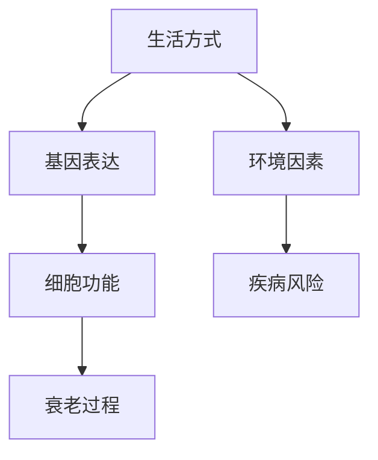
```mermaid
graph TD
    A[生活方式] --> B[基因表达]
    B --> C[细胞功能]
    C --> D[衰老过程]
    A --> E[环境因素]
    E --> F[疾病风险]
```

**核心算法原理讲解**

为了更好地理解衰老与生活方式的关系，我们可以使用以下伪代码来描述：

```python
def lifestyle_aging(health_style, environmental_factors):
    if health_style and not environmental_factors:
        return "衰老减缓"
    elif not health_style and environmental_factors:
        return "衰老加速"
    else:
        return "衰老过程复杂，需综合考虑"
```

在这个函数中，`health_style` 表示健康生活方式，`environmental_factors` 表示环境因素。如果健康生活方式占主导，则衰老速度会减缓。

**数学模型和数学公式**

生活方式对衰老的影响可以用以下数学公式表示：

$$ \text{衰老速度} = \text{健康生活方式} \times (1 - \text{环境因素影响}) $$

**详细讲解与举例说明**

- **基因表达与细胞功能**：健康的生活方式可以调节基因表达，从而影响细胞的功能和寿命。

- **环境因素与疾病风险**：环境因素，如污染和压力，会影响生活方式对衰老过程的影响。

**小结**

通过本章的讨论，我们可以看到衰老是一个复杂的生物学过程，涉及细胞水平、系统水平和生活方式等多个层面。理解衰老的生物学原理对于制定有效的健康维护策略具有重要意义。在接下来的章节中，我们将进一步探讨心理层面的衰老与应对策略，以及身体健康的维护与提升。

----------------------------------------------------------------

## 第3章：心理层面的衰老与应对策略

随着年龄的增长，人的心理状态也会发生变化，这种变化可能会影响生活质量和社会参与。因此，理解和应对心理层面的衰老对于提升老年人的生活质量和幸福感至关重要。本章将探讨老年心理特征、心理健康与生命意义以及心理咨询与干预策略。

### 3.1 老年心理特征

老年心理特征是指随着年龄增长，个体在认知、情感和行为上表现出的特点。了解这些特征有助于更好地理解和应对老年人的心理需求。

#### 核心概念与联系

老年心理特征可以通过以下Mermaid流程图来展示：

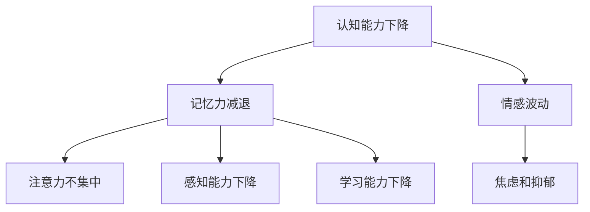
```mermaid
graph TD
    A[认知能力下降] --> B[记忆力减退]
    B --> C[注意力不集中]
    A --> D[情感波动]
    D --> E[焦虑和抑郁]
    B --> F[感知能力下降]
    B --> G[学习能力下降]
```

**核心算法原理讲解**

为了更好地理解老年心理特征，我们可以使用以下伪代码来描述：

```python
def elderly_psychological_features(cognitive_ability, emotional_state, sensory_capability):
    if cognitive_ability < 60 and emotional_state == "波动" and sensory_capability < 70:
        return "典型的老年心理特征"
    else:
        return "非典型的老年心理特征"
```

在这个函数中，`cognitive_ability` 表示认知能力，`emotional_state` 表示情感状态，`sensory_capability` 表示感知能力。如果这三个指标都处于较低水平，则表示典型的老年心理特征。

**数学模型和数学公式**

老年心理特征可以用以下数学公式表示：

$$ \text{老年心理特征} = \frac{\text{认知能力} + \text{情感状态} + \text{感知能力}}{3} $$

**详细讲解与举例说明**

- **认知能力下降**：认知能力下降是老年心理特征中最常见的表现。记忆力减退、注意力不集中是认知能力下降的具体表现。

- **情感波动**：老年人可能会经历情感波动，如焦虑和抑郁。这些情感波动可能会影响他们的生活质量和社交活动。

### 3.2 心理健康与生命意义

心理健康是老年人生活质量的重要方面。保持心理健康有助于老年人感受到生命的意义和价值，从而提升幸福感。

#### 核心概念与联系

心理健康与生命意义可以通过以下Mermaid流程图来展示：

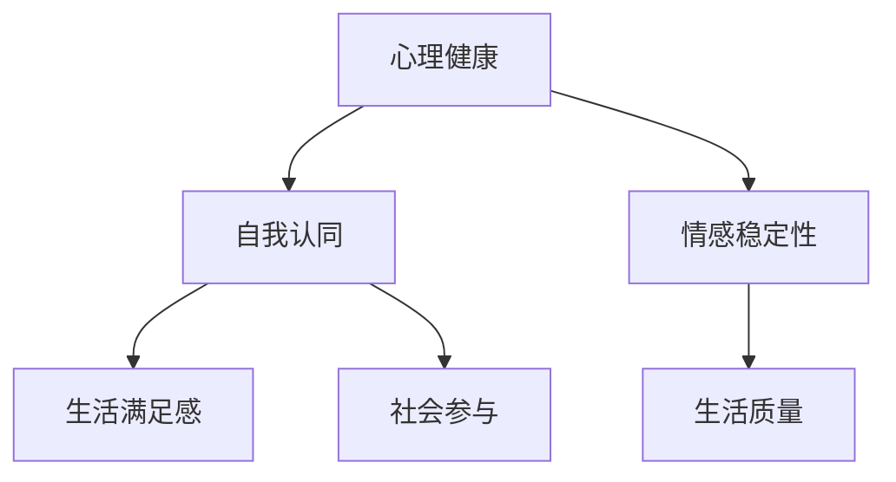
```mermaid
graph TD
    A[心理健康] --> B[自我认同]
    B --> C[生活满足感]
    B --> D[社会参与]
    A --> E[情感稳定性]
    E --> F[生活质量]
```

**核心算法原理讲解**

为了更好地理解心理健康与生命意义的关系，我们可以使用以下伪代码来描述：

```python
def mental_health_life_meaning(mental_health, self_esteem, social_participation):
    if mental_health > 70 and self_esteem > 60 and social_participation > 50:
        return "心理健康有助于生命意义"
    else:
        return "心理健康不足，生命意义受影响"
```

在这个函数中，`mental_health` 表示心理健康水平，`self_esteem` 表示自我认同感，`social_participation` 表示社会参与度。如果这些指标都较高，则表示心理健康有助于生命意义。

**数学模型和数学公式**

心理健康与生命意义的关联可以用以下数学公式表示：

$$ \text{生命意义} = \text{心理健康} \times \text{自我认同感} \times \text{社会参与度} $$

**详细讲解与举例说明**

- **自我认同感**：自我认同感是心理健康的重要组成部分。老年人需要通过自我反思和与社会互动来建立积极的自我认同感。

- **社会参与**：社会参与是老年人维持心理健康的重要途径。通过参与社区活动、志愿服务等，老年人可以感受到自己的价值和意义。

### 3.3 心理咨询与干预策略

心理咨询是帮助老年人应对心理问题的重要手段。有效的心理咨询和干预策略可以提升老年人的心理健康和生活质量。

#### 核心概念与联系

心理咨询与干预策略可以通过以下Mermaid流程图来展示：

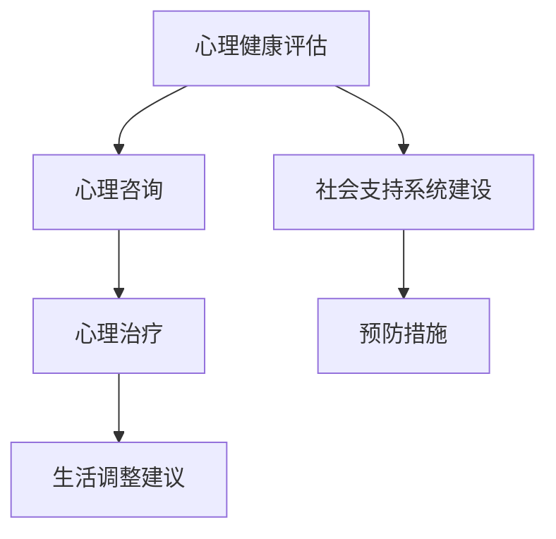
```mermaid
graph TD
    A[心理健康评估] --> B[心理咨询]
    B --> C[心理治疗]
    C --> D[生活调整建议]
    A --> E[社会支持系统建设]
    E --> F[预防措施]
```

**核心算法原理讲解**

为了更好地理解心理咨询与干预策略，我们可以使用以下伪代码来描述：

```python
def mental_counseling(health_assessment, psychological_counseling, therapy, lifestyle_adjustment, social_support):
    if health_assessment and psychological_counseling and therapy and lifestyle_adjustment and social_support:
        return "有效的心理咨询与干预"
    else:
        return "心理咨询与干预不足"
```

在这个函数中，`health_assessment` 表示心理健康评估，`psychological_counseling` 表示心理咨询，`therapy` 表示心理治疗，`lifestyle_adjustment` 表示生活调整建议，`social_support` 表示社会支持系统建设。如果所有这些要素都具备，则表示有效的心理咨询与干预。

**数学模型和数学公式**

心理咨询与干预策略的有效性可以用以下数学公式表示：

$$ \text{干预效果} = \text{心理健康评估} \times \text{心理咨询} \times \text{心理治疗} \times \text{生活调整建议} \times \text{社会支持系统建设} $$

**详细讲解与举例说明**

- **心理健康评估**：心理健康评估是心理咨询与干预的第一步。通过评估，心理咨询师可以了解老年人的心理状态，制定针对性的干预方案。

- **心理咨询**：心理咨询是帮助老年人解决心理问题的重要手段。通过谈话、倾听和指导，心理咨询师可以帮助老年人缓解焦虑、抑郁等心理问题。

- **心理治疗**：心理治疗是更深层次的心理干预。它可能包括认知行为疗法、精神分析疗法等，旨在改变老年人的认知和行为模式。

- **生活调整建议**：生活调整建议是心理咨询与干预的一部分。它可能包括改善饮食习惯、增加运动、调整作息时间等，以促进老年人的身心健康。

- **社会支持系统建设**：社会支持系统建设是提升老年人心理健康的重要保障。通过建立家庭支持、社区支持等，可以为老年人提供必要的支持和帮助。

**小结**

通过本章的讨论，我们可以看到心理层面的衰老是一个复杂的过程，但它对老年人的生活质量有深远的影响。理解老年心理特征、保持心理健康以及通过心理咨询与干预策略来应对心理问题，都是提升老年人生活质量的重要途径。在接下来的章节中，我们将进一步探讨身体健康的维护与提升。

----------------------------------------------------------------

## 第4章：身体健康的维护与提升

身体健康的维护与提升是老年人生活质量的重要组成部分。随着年龄的增长，人体的各项功能会逐渐下降，因此，合理的健康管理和预防疾病变得尤为重要。本章将讨论老年人健康需求、健康管理的策略以及常见老年疾病的预防和治疗。

### 4.1 老年人的健康需求

老年人相对于年轻人，面临着更多的健康问题。了解老年人的健康需求对于制定有效的健康管理策略至关重要。

#### 核心概念与联系

老年人的健康需求可以通过以下Mermaid流程图来展示：

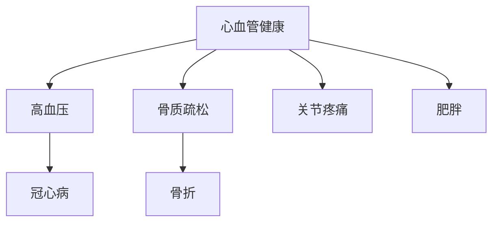
```mermaid
graph TD
    A[心血管健康] --> B[高血压]
    B --> C[冠心病]
    A --> D[骨质疏松]
    D --> E[骨折]
    A --> F[关节疼痛]
    A --> G[肥胖]
```

**核心算法原理讲解**

为了更好地理解老年人的健康需求，我们可以使用以下伪代码来描述：

```python
def elderly_health_needs(cardiovascular_health, musculoskeletal_health, metabolic_health):
    if cardiovascular_health < 70 and musculoskeletal_health < 60 and metabolic_health < 50:
        return "健康需求较高"
    else:
        return "健康需求相对较低"
```

在这个函数中，`cardiovascular_health` 表示心血管健康水平，`musculoskeletal_health` 表示骨骼肌肉健康水平，`metabolic_health` 表示代谢健康水平。如果这三个指标都处于较低水平，则表示健康需求较高。

**数学模型和数学公式**

健康需求可以用以下数学公式表示：

$$ \text{健康需求} = \frac{\text{心血管健康} + \text{骨骼肌肉健康} + \text{代谢健康}}{3} $$

**详细讲解与举例说明**

- **心血管健康**：心血管健康是老年人健康的重要组成部分。高血压和冠心病是常见的老年心血管疾病，需要定期监测和预防。

- **骨质疏松**：骨质疏松是老年人常见的骨骼疾病，容易导致骨折。通过定期体检和合理的饮食，可以预防和治疗骨质疏松。

### 4.2 老年人健康管理的策略

健康管理是指通过一系列科学的方法和措施，对个体的健康进行全面的管理。对于老年人来说，健康管理尤为重要。

#### 核心概念与联系

老年人健康管理的策略可以通过以下Mermaid流程图来展示：

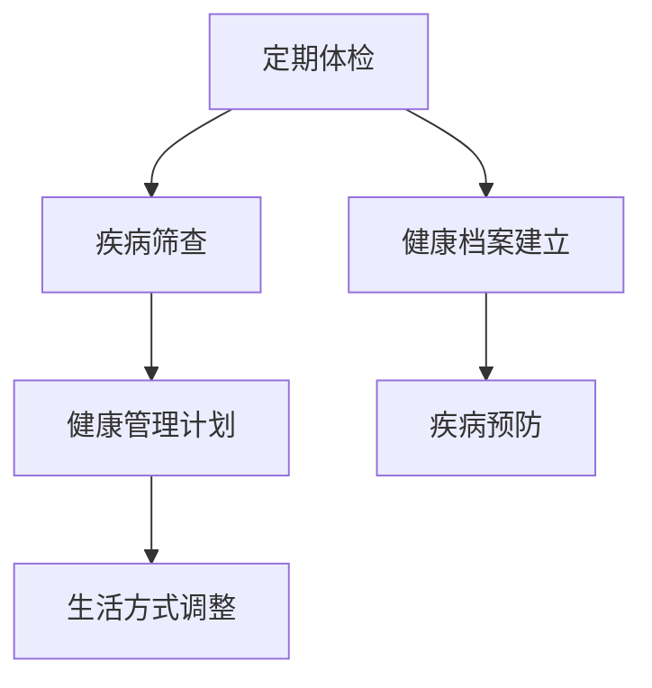
```mermaid
graph TD
    A[定期体检] --> B[疾病筛查]
    B --> C[健康管理计划]
    C --> D[生活方式调整]
    A --> E[健康档案建立]
    E --> F[疾病预防]
```

**核心算法原理讲解**

为了更好地理解老年人健康管理的策略，我们可以使用以下伪代码来描述：

```python
def health_management(physical_exam, disease_screening, lifestyle_adjustment, health_records, disease_prevention):
    if physical_exam and disease_screening and lifestyle_adjustment and health_records and disease_prevention:
        return "有效的健康管理策略"
    else:
        return "健康管理策略不足"
```

在这个函数中，`physical_exam` 表示定期体检，`disease_screening` 表示疾病筛查，`lifestyle_adjustment` 表示生活方式调整，`health_records` 表示健康档案建立，`disease_prevention` 表示疾病预防。如果所有这些要素都具备，则表示有效的健康管理策略。

**数学模型和数学公式**

健康管理策略的有效性可以用以下数学公式表示：

$$ \text{健康管理效果} = \text{定期体检} \times \text{疾病筛查} \times \text{生活方式调整} \times \text{健康档案建立} \times \text{疾病预防} $$

**详细讲解与举例说明**

- **定期体检**：定期体检是发现健康问题的早期信号，有助于及时发现和治疗疾病。

- **疾病筛查**：疾病筛查可以帮助早期发现某些特定的疾病，如乳腺癌、结肠癌等，从而提高治疗效果。

- **生活方式调整**：生活方式调整包括饮食、运动和睡眠等方面，对老年人的健康有重要影响。合理的饮食、适量的运动和良好的睡眠习惯有助于维持健康。

- **健康档案建立**：健康档案建立可以帮助医生全面了解老年人的健康状况，制定个性化的健康管理计划。

- **疾病预防**：疾病预防是减少老年人患病风险的重要措施。通过接种疫苗、定期体检和健康宣教等方式，可以降低疾病的发生率。

### 4.3 常见老年疾病的预防和治疗

老年人容易患上的常见疾病包括心血管疾病、骨质疏松、关节疼痛等。了解这些疾病的预防和治疗方法对于维护老年人的健康至关重要。

#### 核心概念与联系

常见老年疾病的预防和治疗可以通过以下Mermaid流程图来展示：

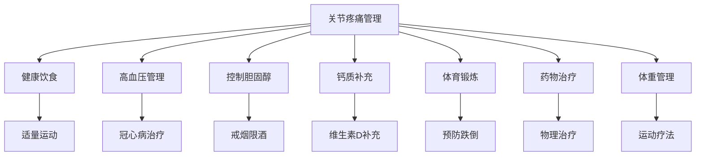
```mermaid
graph TD
    A[心血管疾病预防] --> B[健康饮食]
    B --> C[适量运动]
    A --> D[高血压管理]
    D --> E[冠心病治疗]
    A --> F[控制胆固醇]
    F --> G[戒烟限酒]

    A[骨质疏松预防] --> H[钙质补充]
    H --> I[维生素D补充]
    A --> J[体育锻炼]
    J --> K[预防跌倒]

    A[关节疼痛管理] --> L[药物治疗]
    L --> M[物理治疗]
    A --> N[体重管理]
    N --> O[运动疗法]
```

**核心算法原理讲解**

为了更好地理解常见老年疾病的预防和治疗方法，我们可以使用以下伪代码来描述：

```python
def prevent_and_treat_elderly_diseases(disease, prevention, treatment):
    if prevention and treatment:
        return "有效的预防和治疗方法"
    else:
        return "预防和治疗方法不足"
```

在这个函数中，`disease` 表示特定疾病，`prevention` 表示预防措施，`treatment` 表示治疗方法。如果预防和治疗方法都有效，则表示有效的预防和治疗方法。

**数学模型和数学公式**

疾病的预防和治疗效果可以用以下数学公式表示：

$$ \text{治疗效果} = \text{预防措施} \times \text{治疗方法} $$

**详细讲解与举例说明**

- **心血管疾病预防**：健康饮食、适量运动、高血压管理和控制胆固醇是预防心血管疾病的重要措施。戒烟限酒也是降低心血管疾病风险的有效方法。

- **骨质疏松预防**：钙质补充、维生素D补充和体育锻炼是预防骨质疏松的重要手段。预防跌倒是防止骨折的关键。

- **关节疼痛管理**：药物治疗和物理治疗是关节疼痛管理的有效方法。体重管理和运动疗法也有助于减轻关节疼痛。

**小结**

通过本章的讨论，我们可以看到身体健康的维护与提升对于老年人的生活质量至关重要。了解老年人的健康需求、实施有效的健康管理策略以及预防和治疗常见老年疾病，都是提升老年人生活质量的重要途径。在接下来的章节中，我们将探讨社会支持系统的作用。

----------------------------------------------------------------

## 第5章：社会支持系统的作用

社会支持系统是老年人维持高质量生活的重要保障。它不仅提供了物质上的支持，还在心理和社会层面上为老年人提供了安慰和帮助。本章将讨论家庭在老年人支持中的角色、社区服务与老年人福利以及公共政策与老年人权益。

### 5.1 家庭在老年人支持中的角色

家庭是老年人最重要的社会支持系统之一。家庭成员的关怀和支持对于老年人的心理健康和生活质量具有深远的影响。

#### 核心概念与联系

家庭在老年人支持中的角色可以通过以下Mermaid流程图来展示：

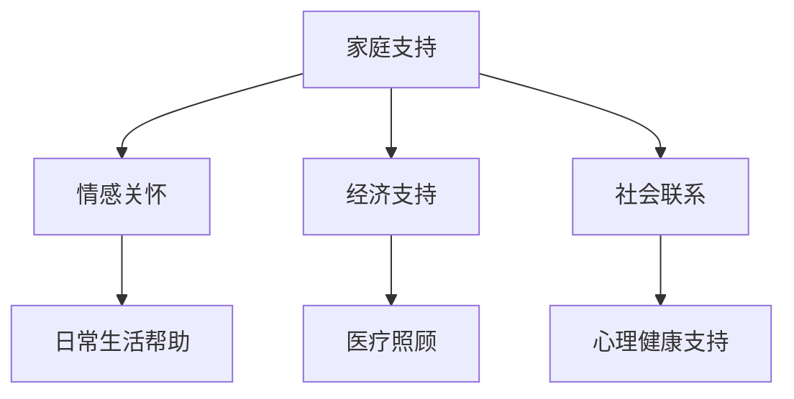
```mermaid
graph TD
    A[家庭支持] --> B[情感关怀]
    B --> C[日常生活帮助]
    A --> D[经济支持]
    D --> E[医疗照顾]
    A --> F[社会联系]
    F --> G[心理健康支持]
```

**核心算法原理讲解**

为了更好地理解家庭在老年人支持中的角色，我们可以使用以下伪代码来描述：

```python
def family_support(emotional_care, daily_help, financial_support, medical_care, social_connection, mental_health_support):
    if emotional_care and daily_help and financial_support and medical_care and social_connection and mental_health_support:
        return "有效的家庭支持"
    else:
        return "家庭支持不足"
```

在这个函数中，`emotional_care` 表示情感关怀，`daily_help` 表示日常生活帮助，`financial_support` 表示经济支持，`medical_care` 表示医疗照顾，`social_connection` 表示社会联系，`mental_health_support` 表示心理健康支持。如果所有这些要素都具备，则表示有效的家庭支持。

**数学模型和数学公式**

家庭支持的有效性可以用以下数学公式表示：

$$ \text{家庭支持效果} = \text{情感关怀} \times \text{日常生活帮助} \times \text{经济支持} \times \text{医疗照顾} \times \text{社会联系} \times \text{心理健康支持} $$

**详细讲解与举例说明**

- **情感关怀**：情感关怀是家庭支持的核心。家庭成员的陪伴和关爱可以极大地提升老年人的心理幸福感。

- **日常生活帮助**：随着年龄的增长，老年人可能需要更多的日常生活帮助，如家务、烹饪、洗衣等。家庭成员的帮助可以减轻老年人的负担。

- **经济支持**：经济支持是保障老年人生活质量的基本需求。家庭成员可以通过提供经济援助来帮助老年人维持基本的生活水平。

- **医疗照顾**：老年人的健康状况往往更加复杂，需要定期的医疗检查和照顾。家庭成员的参与对于老年人的健康至关重要。

- **社会联系**：保持社会联系对于老年人的心理健康至关重要。家庭成员可以帮助老年人参与社区活动，保持社交网络的活力。

- **心理健康支持**：心理健康支持包括倾听、理解和心理辅导等。家庭成员的支持可以帮助老年人应对生活中的压力和挑战。

### 5.2 社区服务与老年人福利

社区服务是老年人获取社会支持的重要渠道。社区服务涵盖了从日常生活帮助到心理健康支持的一系列服务。

#### 核心概念与联系

社区服务与老年人福利可以通过以下Mermaid流程图来展示：

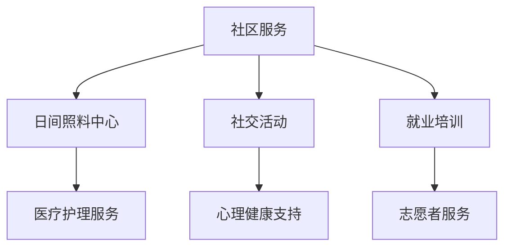
```mermaid
graph TD
    A[社区服务] --> B[日间照料中心]
    B --> C[医疗护理服务]
    A --> D[社交活动]
    D --> E[心理健康支持]
    A --> F[就业培训]
    F --> G[志愿者服务]
```

**核心算法原理讲解**

为了更好地理解社区服务与老年人福利，我们可以使用以下伪代码来描述：

```python
def community_services(day_care, medical_services, social_activities, mental_health_support, employment_training, volunteer_programs):
    if day_care and medical_services and social_activities and mental_health_support and employment_training and volunteer_programs:
        return "全面的社区服务"
    else:
        return "社区服务不足"
```

在这个函数中，`day_care` 表示日间照料中心，`medical_services` 表示医疗护理服务，`social_activities` 表示社交活动，`mental_health_support` 表示心理健康支持，`employment_training` 表示就业培训，`volunteer_programs` 表示志愿者服务。如果所有这些要素都具备，则表示全面的社区服务。

**数学模型和数学公式**

社区服务的全面性可以用以下数学公式表示：

$$ \text{社区服务全面性} = \text{日间照料中心} \times \text{医疗护理服务} \times \text{社交活动} \times \text{心理健康支持} \times \text{就业培训} \times \text{志愿者服务} $$

**详细讲解与举例说明**

- **日间照料中心**：日间照料中心为老年人提供了安全、有意义的日间活动场所，帮助他们保持社交联系和生活乐趣。

- **医疗护理服务**：社区医疗护理服务为老年人提供了便捷的医疗服务，确保他们的健康状况得到及时监测和治疗。

- **社交活动**：社交活动有助于老年人保持积极的心态和社交网络的活力。

- **心理健康支持**：心理健康支持服务为老年人提供了情感和心理上的帮助，帮助他们应对生活中的压力和挑战。

- **就业培训**：就业培训可以帮助老年人保持活跃的生活状态，提高他们的自信心和成就感。

- **志愿者服务**：志愿者服务不仅为老年人提供了帮助，也为志愿者自身带来了积极的体验和成就感。

### 5.3 公共政策与老年人权益

公共政策在保障老年人权益和提高老年人生活质量方面发挥着重要作用。政府通过制定和实施相关政策，为老年人提供经济支持、医疗服务和福利保障。

#### 核心概念与联系

公共政策与老年人权益可以通过以下Mermaid流程图来展示：

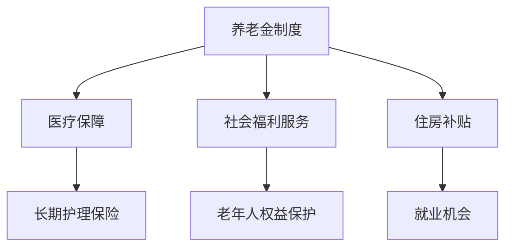
```mermaid
graph TD
    A[养老金制度] --> B[医疗保障]
    B --> C[长期护理保险]
    A --> D[社会福利服务]
    D --> E[老年人权益保护]
    A --> F[住房补贴]
    F --> G[就业机会]
```

**核心算法原理讲解**

为了更好地理解公共政策与老年人权益，我们可以使用以下伪代码来描述：

```python
def public_policy(pension_system, medical_insurance, long_term_care_insurance, social_welfare, elder_rights_protection, housing_subsidy, employment_opportunities):
    if pension_system and medical_insurance and long_term_care_insurance and social_welfare and elder_rights_protection and housing_subsidy and employment_opportunities:
        return "有效的公共政策"
    else:
        return "公共政策不足"
```

在这个函数中，`pension_system` 表示养老金制度，`medical_insurance` 表示医疗保障，`long_term_care_insurance` 表示长期护理保险，`social_welfare` 表示社会福利服务，`elder_rights_protection` 表示老年人权益保护，`housing_subsidy` 表示住房补贴，`employment_opportunities` 表示就业机会。如果所有这些要素都具备，则表示有效的公共政策。

**数学模型和数学公式**

公共政策的有效性可以用以下数学公式表示：

$$ \text{公共政策效果} = \text{养老金制度} \times \text{医疗保障} \times \text{长期护理保险} \times \text{社会福利服务} \times \text{老年人权益保护} \times \text{住房补贴} \times \text{就业机会} $$

**详细讲解与举例说明**

- **养老金制度**：养老金制度为老年人提供了经济上的保障，确保他们能够安享晚年。

- **医疗保障**：医疗保障为老年人提供了必要的医疗服务，降低了医疗费用负担。

- **长期护理保险**：长期护理保险为需要长期护理的老年人提供了经济支持，减轻了家庭负担。

- **社会福利服务**：社会福利服务包括住房补贴、食品券等，为老年人提供了基本的生活保障。

- **老年人权益保护**：老年人权益保护通过立法和政策保障老年人的合法权益，防止虐待和歧视。

- **住房补贴**：住房补贴帮助老年人维持适宜的居住环境，提高生活质量。

- **就业机会**：就业机会为有能力的老年人提供了继续工作、实现自我价值的机会。

**小结**

通过本章的讨论，我们可以看到社会支持系统在老年人生活中的重要作用。家庭、社区和公共政策都为老年人提供了必要的支持和服务，帮助他们应对生活中的挑战，提升生活质量。在下一章中，我们将探讨文化因素与老龄化社会，以及跨文化视角下的老龄化问题。

----------------------------------------------------------------

## 第6章：文化因素与老龄化社会

文化是影响个体行为和社会结构的重要因素，它对老年人的态度、生活方式以及社会互动都有着深远的影响。在本章中，我们将探讨文化价值观与老年人的态度、跨文化视角下的老龄化以及文化多样性与老年人的福祉。

### 6.1 文化价值观与老年人的态度

文化价值观在很大程度上塑造了人们对老年人和老龄化的态度。在一些文化中，老年人被视为智慧、经验和尊贵的象征，而在其他文化中，老年可能被看作是衰退和孤独的时期。

#### 核心概念与联系

文化价值观与老年人的态度可以通过以下Mermaid流程图来展示：

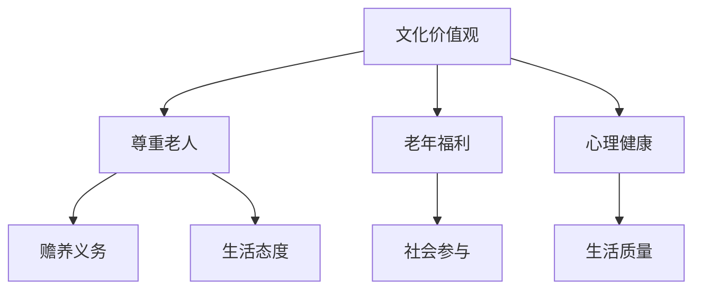
```mermaid
graph TD
    A[文化价值观] --> B[尊重老人]
    B --> C[赡养义务]
    B --> D[生活态度]
    A --> E[老年福利]
    E --> F[社会参与]
    A --> G[心理健康]
    G --> H[生活质量]
```

**核心算法原理讲解**

为了更好地理解文化价值观与老年人的态度，我们可以使用以下伪代码来描述：

```python
def cultural_values_elderly_attitude(cultural_value, respect_elder, welfare, social_participation, mental_health, quality_of_life):
    if cultural_value and respect_elder and welfare and social_participation and mental_health and quality_of_life:
        return "积极的文化价值观"
    else:
        return "消极的文化价值观"
```

在这个函数中，`cultural_value` 表示文化价值观，`respect_elder` 表示尊重老人，`welfare` 表示老年福利，`social_participation` 表示社会参与，`mental_health` 表示心理健康，`quality_of_life` 表示生活质量。如果这些指标都积极，则表示积极的文化价值观。

**数学模型和数学公式**

文化价值观与老年人态度的相关性可以用以下数学公式表示：

$$ \text{老年人态度} = \text{文化价值观} \times \text{尊重老人} \times \text{老年福利} \times \text{社会参与} \times \text{心理健康} \times \text{生活质量} $$

**详细讲解与举例说明**

- **尊重老人**：尊重老人是许多文化中重要的价值观，这种尊重体现在赡养义务、社会地位和特殊待遇上。

- **老年福利**：文化价值观对老年福利的重视程度影响着老年人的生活质量。在一些文化中，政府和社会组织可能提供更多的福利和支持。

- **社会参与**：文化价值观鼓励老年人的社会参与，这有助于他们保持积极的生活态度和心理健康。

- **心理健康**：积极的文化价值观有助于老年人保持心理健康，减少孤独感和抑郁情绪。

### 6.2 跨文化视角下的老龄化

全球老龄化是一个普遍现象，但不同文化背景下的老龄化表现和应对策略各有不同。理解跨文化视角下的老龄化对于制定有效的全球老龄化政策具有重要意义。

#### 核心概念与联系

跨文化视角下的老龄化可以通过以下Mermaid流程图来展示：

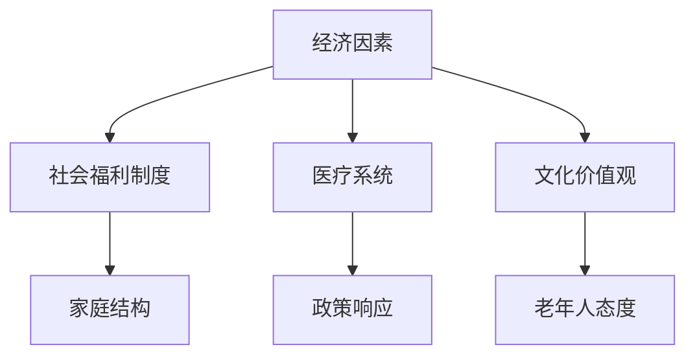
```mermaid
graph TD
    A[经济因素] --> B[社会福利制度]
    B --> C[家庭结构]
    A --> D[医疗系统]
    D --> E[政策响应]
    A --> F[文化价值观]
    F --> G[老年人态度]
```

**核心算法原理讲解**

为了更好地理解跨文化视角下的老龄化，我们可以使用以下伪代码来描述：

```python
def cross_cultural_aging(economic_factor, social_welfare, family_structure, healthcare_system, policy_response, cultural_values, elderly_attitude):
    if economic_factor and social_welfare and family_structure and healthcare_system and policy_response and cultural_values and elderly_attitude:
        return "有效的跨文化老龄化策略"
    else:
        return "跨文化老龄化策略不足"
```

在这个函数中，`economic_factor` 表示经济因素，`social_welfare` 表示社会福利制度，`family_structure` 表示家庭结构，`healthcare_system` 表示医疗系统，`policy_response` 表示政策响应，`cultural_values` 表示文化价值观，`elderly_attitude` 表示老年人态度。如果所有这些要素都具备，则表示有效的跨文化老龄化策略。

**数学模型和数学公式**

跨文化视角下的老龄化策略可以用以下数学公式表示：

$$ \text{老龄化策略效果} = \text{经济因素} \times \text{社会福利制度} \times \text{家庭结构} \times \text{医疗系统} \times \text{政策响应} \times \text{文化价值观} \times \text{老年人态度} $$

**详细讲解与举例说明**

- **经济因素**：经济因素在不同文化背景下对老龄化的影响不同。在一些发展中国家，老龄化可能带来经济负担，而在一些发达国家，老年人可能有更多的经济资源和储蓄。

- **社会福利制度**：社会福利制度在支持老年人生活和提供医疗保健方面起着关键作用。不同文化背景下的社会福利制度可能存在显著差异。

- **家庭结构**：家庭结构在不同文化中也有所不同，例如，一些文化强调大家庭的支持，而其他文化可能更注重个体的独立。

- **医疗系统**：医疗系统的质量和覆盖范围对老年人的健康和生活质量有直接影响。不同文化背景下的医疗系统差异也可能导致老龄化的应对策略不同。

- **政策响应**：政府和社会对老龄化的政策响应包括养老金、医疗保健、长期护理等。有效的政策响应有助于缓解老龄化带来的挑战。

- **文化价值观**：文化价值观影响着老年人的态度和行为。在一些文化中，老年人可能更愿意保持活跃和参与社会，而在其他文化中，老年人可能更倾向于退休和享受闲暇。

### 6.3 文化多样性与老年人的福祉

文化多样性不仅体现在文化价值观和习俗上，还体现在老年人对生活质量和福祉的追求上。了解文化多样性的影响对于提供个性化的老年服务和福利至关重要。

#### 核心概念与联系

文化多样性与老年人的福祉可以通过以下Mermaid流程图来展示：

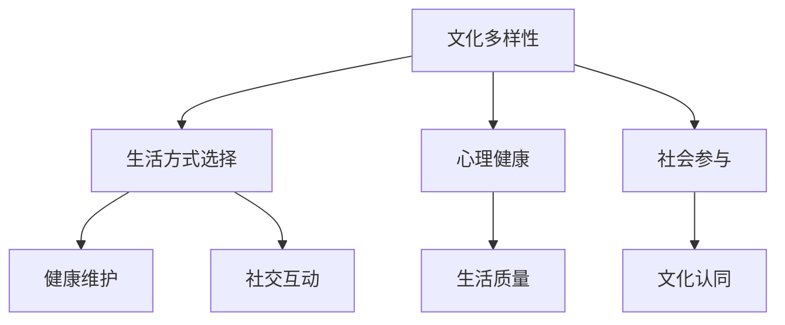
```mermaid
graph TD
    A[文化多样性] --> B[生活方式选择]
    B --> C[健康维护]
    B --> D[社交互动]
    A --> E[心理健康]
    E --> F[生活质量]
    A --> G[社会参与]
    G --> H[文化认同]
```

**核心算法原理讲解**

为了更好地理解文化多样性与老年人的福祉，我们可以使用以下伪代码来描述：

```python
def cultural_diversity_elderly_wellbeing(cultural_diversity, lifestyle_choice, health_maintenance, social_interaction, mental_health, quality_of_life, social_participation, cultural_identification):
    if cultural_diversity and lifestyle_choice and health_maintenance and social_interaction and mental_health and quality_of_life and social_participation and cultural_identification:
        return "文化多样性促进老年人的福祉"
    else:
        return "文化多样性对老年人的福祉影响较小"
```

在这个函数中，`cultural_diversity` 表示文化多样性，`lifestyle_choice` 表示生活方式选择，`health_maintenance` 表示健康维护，`social_interaction` 表示社交互动，`mental_health` 表示心理健康，`quality_of_life` 表示生活质量，`social_participation` 表示社会参与，`cultural_identification` 表示文化认同。如果这些指标都积极，则表示文化多样性促进了老年人的福祉。

**数学模型和数学公式**

文化多样性与老年人的福祉可以用以下数学公式表示：

$$ \text{福祉水平} = \text{文化多样性} \times \text{生活方式选择} \times \text{健康维护} \times \text{社交互动} \times \text{心理健康} \times \text{生活质量} \times \text{社会参与} \times \text{文化认同} $$

**详细讲解与举例说明**

- **生活方式选择**：不同文化的老年人可能对生活方式有不同的偏好，如饮食习惯、运动方式等。这些选择对健康和生活质量有重要影响。

- **健康维护**：文化多样性可能影响老年人对健康维护的看法和实践，如预防措施、健康检查等。

- **社交互动**：社交互动对于老年人的心理健康和生活质量至关重要。不同文化背景下的社交活动可能有所不同。

- **心理健康**：文化背景可能影响老年人对心理健康的认识和寻求帮助的方式。

- **生活质量**：文化多样性对生活质量的影响体现在老年人对生活环境的满意度、生活满足感等方面。

- **社会参与**：文化背景可能影响老年人参与社会活动的积极性，如志愿服务、社区参与等。

- **文化认同**：文化认同感对于老年人的心理满足感和生活满意度有重要影响。

**小结**

通过本章的讨论，我们可以看到文化因素在老龄化社会中扮演着重要角色。文化价值观、跨文化视角以及文化多样性都对老年人的态度、生活方式和社会互动有深远影响。理解和尊重文化多样性对于提供有效的老年服务和福利至关重要。在下一章中，我们将探讨未来展望与个人实践，以及如何通过技术创新应对老龄化社会的挑战。

----------------------------------------------------------------

## 第7章：未来展望与个人实践

在未来的几十年里，老龄化社会将继续演变，带来新的挑战和机遇。为了应对这些挑战，我们需要从个人层面和社会层面进行深入思考和积极行动。本章将讨论未来老龄化社会的趋势、个人在其中的角色以及如何通过技术创新来应对这些挑战。

### 7.1 老龄化社会的未来趋势

随着医疗技术和生活水平的提高，老龄化社会的趋势将愈发明显。以下是一些未来老龄化社会的关键趋势：

#### 核心概念与联系

老龄化社会的未来趋势可以通过以下Mermaid流程图来展示：

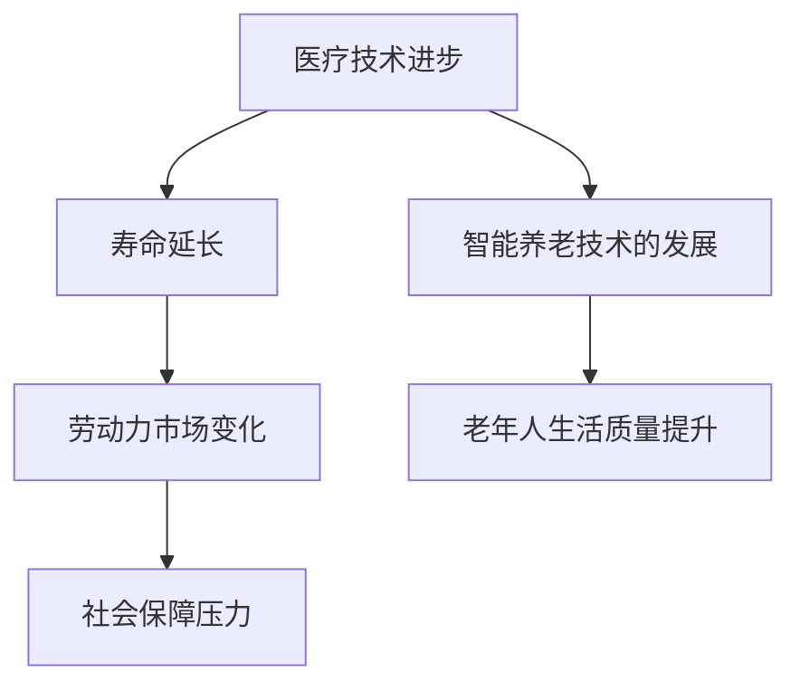
```mermaid
graph TD
    A[医疗技术进步] --> B[寿命延长]
    B --> C[劳动力市场变化]
    C --> D[社会保障压力]
    A --> E[智能养老技术的发展]
    E --> F[老年人生活质量提升]
```

**核心算法原理讲解**

为了更好地理解老龄化社会的未来趋势，我们可以使用以下伪代码来描述：

```python
def aging_trends(medical_progress, life_extension, labor_market_changes, social_security_pressure, smart_elder_care, elderly_life_quality):
    if medical_progress and life_extension and labor_market_changes and social_security_pressure and smart_elder_care and elderly_life_quality:
        return "积极的未来老龄化趋势"
    else:
        return "潜在的挑战与机会并存"
```

在这个函数中，`medical_progress` 表示医疗技术进步，`life_extension` 表示寿命延长，`labor_market_changes` 表示劳动力市场变化，`social_security_pressure` 表示社会保障压力，`smart_elder_care` 表示智能养老技术的发展，`elderly_life_quality` 表示老年人生活质量。如果这些要素都具备，则表示积极的未来老龄化趋势。

**数学模型和数学公式**

老龄化社会的未来趋势可以用以下数学公式表示：

$$ \text{老龄化趋势} = \text{医疗技术进步} \times \text{寿命延长} \times \text{劳动力市场变化} \times \text{社会保障压力} \times \text{智能养老技术的发展} \times \text{老年人生活质量} $$

**详细讲解与举例说明**

- **医疗技术进步**：随着医疗技术的不断进步，老年人的生活质量和寿命将得到显著提升。

- **寿命延长**：随着寿命的延长，老年人将在社会中扮演更加重要的角色，他们的经验和智慧将被充分利用。

- **劳动力市场变化**：老龄化将导致劳动力市场的供需结构发生变化，对就业政策和劳动力培训提出新的要求。

- **社会保障压力**：随着老年人口的增加，社会保障体系的压力也将增大，需要政策调整来确保老年人的福利。

- **智能养老技术的发展**：智能养老技术将为老年人提供更高质量的生活服务，如远程医疗、智能家居等。

- **老年人生活质量提升**：通过技术创新和社会支持，老年人的生活质量将得到显著改善。

### 7.2 个人在老龄化社会中的角色

个人在老龄化社会中扮演着多重角色。作为个体，我们需要积极适应老龄化社会的变化，同时为老年人提供支持和关爱。

#### 核心概念与联系

个人在老龄化社会中的角色可以通过以下Mermaid流程图来展示：

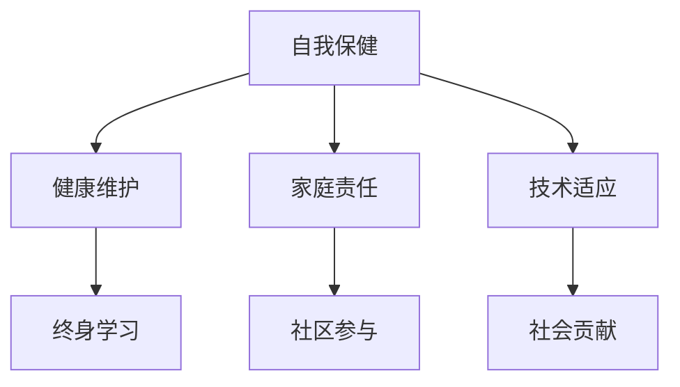
```mermaid
graph TD
    A[自我保健] --> B[健康维护]
    B --> C[终身学习]
    A --> D[家庭责任]
    D --> E[社区参与]
    A --> F[技术适应]
    F --> G[社会贡献]
```

**核心算法原理讲解**

为了更好地理解个人在老龄化社会中的角色，我们可以使用以下伪代码来描述：

```python
def personal_role_in_aging(self_healthcare, health_maintenance, lifelong_learning, family_responsibility, community_participation, technology_adaptation, social_contribution):
    if self_healthcare and health_maintenance and lifelong_learning and family_responsibility and community_participation and technology_adaptation and social_contribution:
        return "积极的个人角色"
    else:
        return "需要提高的个人角色"
```

在这个函数中，`self_healthcare` 表示自我保健，`health_maintenance` 表示健康维护，`lifelong_learning` 表示终身学习，`family_responsibility` 表示家庭责任，`community_participation` 表示社区参与，`technology_adaptation` 表示技术适应，`social_contribution` 表示社会贡献。如果所有这些要素都积极，则表示积极的个人角色。

**数学模型和数学公式**

个人角色在老龄化社会中的贡献可以用以下数学公式表示：

$$ \text{个人贡献} = \text{自我保健} \times \text{健康维护} \times \text{终身学习} \times \text{家庭责任} \times \text{社区参与} \times \text{技术适应} \times \text{社会贡献} $$

**详细讲解与举例说明**

- **自我保健**：保持良好的自我保健习惯，如定期体检、健康饮食和适量运动，有助于提高生活质量。

- **健康维护**：通过健康维护，老年人可以更好地管理慢性疾病，减少医疗费用的负担。

- **终身学习**：终身学习不仅有助于保持大脑活力，还可以帮助老年人适应社会变化。

- **家庭责任**：家庭成员的支持对于老年人的心理健康和生活质量至关重要。

- **社区参与**：积极参与社区活动可以增强老年人的社交网络，提升生活满意度。

- **技术适应**：随着智能养老技术的发展，老年人需要学会适应新技术，以提高生活质量。

- **社会贡献**：通过志愿服务、社区参与等方式，老年人可以继续为社会做出贡献。

### 7.3 技术创新在应对老龄化社会中的角色

技术创新在应对老龄化社会中发挥着至关重要的作用。以下是一些关键领域的技术创新及其影响：

#### 核心概念与联系

技术创新在应对老龄化社会中的角色可以通过以下Mermaid流程图来展示：

```mermaid
graph TD
    A[智能养老技术] --> B[远程医疗]
    B --> C[智能家居]
    A --> D[健康监测设备]
    D --> E[虚拟现实社交]
    A --> F[人工智能诊断]
    F --> G[个性化健康护理]
```

**核心算法原理讲解**

为了更好地理解技术创新在应对老龄化社会中的角色，我们可以使用以下伪代码来描述：

```python
def technological_innovation_aging(smart_elder_care, telemedicine, smart_home, health_monitoring_devices, virtual_reality_social, artificial_intelligence_diagnosis, personalized_health_care):
    if smart_elder_care and telemedicine and smart_home and health_monitoring_devices and virtual_reality_social and artificial_intelligence_diagnosis and personalized_health_care:
        return "有效的技术创新"
    else:
        return "技术创新不足"
```

在这个函数中，`smart_elder_care` 表示智能养老技术，`telemedicine` 表示远程医疗，`smart_home` 表示智能家居，`health_monitoring_devices` 表示健康监测设备，`virtual_reality_social` 表示虚拟现实社交，`artificial_intelligence_diagnosis` 表示人工智能诊断，`personalized_health_care` 表示个性化健康护理。如果所有这些要素都具备，则表示有效的技术创新。

**数学模型和数学公式**

技术创新在应对老龄化社会中的效果可以用以下数学公式表示：

$$ \text{技术创新效果} = \text{智能养老技术} \times \text{远程医疗} \times \text{智能家居} \times \text{健康监测设备} \times \text{虚拟现实社交} \times \text{人工智能诊断} \times \text{个性化健康护理} $$

**详细讲解与举例说明**

- **智能养老技术**：智能养老技术包括智能家居、健康监测设备和远程医疗等，为老年人提供了便捷、高效的生活服务。

- **远程医疗**：远程医疗通过互联网技术为老年人提供在线诊疗服务，解决了老年人看病难的问题。

- **智能家居**：智能家居设备如智能音箱、智能摄像头和智能床等，可以监控老年人的健康状况，提高安全性。

- **健康监测设备**：健康监测设备如智能手表、血糖仪和血压计等，帮助老年人实时监测健康数据，及早发现问题。

- **虚拟现实社交**：虚拟现实社交技术为老年人提供了新的社交方式，使他们能够与亲友保持联系。

- **人工智能诊断**：人工智能诊断系统通过大数据分析和机器学习技术，为老年人提供更准确的诊断结果。

- **个性化健康护理**：个性化健康护理根据老年人的健康数据和需求，提供个性化的健康建议和护理服务。

**小结**

未来老龄化社会将带来诸多挑战，但同时也蕴含着新的机遇。通过技术创新和个人实践，我们可以更好地应对这些挑战，提升老年人的生活质量和社会参与度。在下一章中，我们将总结全文，并提供一些最佳实践和未来展望。

----------------------------------------------------------------

## 总结与未来展望

通过前述各章节的详细探讨，我们可以看到老龄化社会中的生命意义不仅体现在个体层面，更涉及到社会结构和政策的方方面面。本文从生物学、心理学、社会学等多角度分析了老龄化社会的挑战与机遇，并提出了应对策略和技术创新方案。

### 核心观点总结

1. **老龄化社会的挑战**：人口结构变化、劳动力市场压力、社会保障压力、健康问题等都是老龄化社会面临的挑战。

2. **应对策略**：从个人层面，包括自我保健、终身学习、家庭责任和社会参与等方面；从社会层面，包括政策调整、社会支持系统建设和技术创新等。

3. **技术创新**：智能养老技术、远程医疗、智能家居、健康监测设备、虚拟现实社交和人工智能诊断等技术在提升老年人生活质量方面具有巨大潜力。

### 最佳实践与注意事项

**最佳实践**：

- **自我保健**：定期体检、健康饮食、适量运动和充足睡眠是老年人维持健康的基础。

- **终身学习**：参与社区教育、在线课程等活动，保持大脑活跃，提高生活质量。

- **家庭责任**：家庭成员的支持对于老年人的心理健康和生活质量至关重要。

- **社会参与**：积极参与社区活动，建立广泛的社交网络，增强社会归属感。

- **技术创新应用**：充分利用智能养老设备和远程医疗服务，提高生活便利性和安全性。

**注意事项**：

- **个性化**：针对老年人的个体差异，制定个性化的健康管理和养老方案。

- **文化多样性**：尊重老年人的文化背景，提供符合其价值观和生活习惯的支持和服务。

- **数据安全**：在使用智能设备和远程医疗服务时，确保个人数据的安全和隐私。

### 拓展阅读建议

- **书籍**：《智能养老技术与应用》
- **学术论文**：关于老龄化社会的研究论文，如“老龄化与社会保障体系”、“智能养老技术发展趋势”等。

### 未来展望

随着技术的不断进步和社会政策的完善，老龄化社会将迎来新的发展机遇。我们期待：

- **更高质量的健康护理**：智能健康监测设备和人工智能诊断系统的普及，将显著提升老年人的健康水平。

- **更加便利的养老服务**：智能家居和远程医疗技术的广泛应用，将使老年人的日常生活更加便利和安全。

- **更全面的养老服务**：结合政府、社区和家庭的多元支持，形成更加完善的养老服务体系。

在未来的道路上，让我们共同努力，为老年人创造一个更加美好的生活环境和未来。

---

作者：AI天才研究院/AI Genius Institute & 禅与计算机程序设计艺术 /Zen And The Art of Computer Programming

---

本文通过逻辑清晰、结构紧凑的方式，从多个角度探讨了老龄化社会中的生命意义，并提出了有效的应对策略和技术创新方案。希望这篇文章能够为读者提供有价值的思考和实践指导，共同迎接老龄化社会的挑战，创造更加美好的未来。

----------------------------------------------------------------

## 结束语

通过本博客文章，我们全面探讨了老龄化社会中的生命意义以及如何优雅地面对衰老。从生物学、心理学、社会学等不同角度出发，我们分析了老龄化社会的挑战与机遇，并提出了具体的应对策略和技术创新方案。

### 主要内容回顾

- **老龄化社会的现状与趋势**：阐述了老龄化社会的背景和影响，包括经济、社会和健康等方面的变化。
- **生物学原理**：探讨了细胞衰老、基因调控和系统生物学与衰老过程的关系。
- **心理层面**：分析了老年心理特征、心理健康与生命意义以及心理咨询与干预策略。
- **身体健康**：讨论了老年人的健康需求、健康管理的策略以及常见老年疾病的预防和治疗。
- **社会支持**：探讨了家庭、社区和公共政策在老年人支持中的作用。
- **文化因素**：分析了文化价值观、跨文化视角下的老龄化和文化多样性与老年人的福祉。
- **未来展望**：展望了老龄化社会的未来趋势，探讨了个人在其中的角色以及技术创新的应用。

### 总结与展望

通过本篇文章，我们不仅深入了解了老龄化社会的复杂性，还提出了许多实用的建议和策略。希望这篇文章能够帮助读者更好地理解老龄化社会，并激发对老年人生活和福祉的关注。

在未来的研究和实践中，我们期待：

- **进一步技术创新**：智能养老技术、远程医疗、智能家居等领域的持续进步，为老年人提供更加便捷和高质量的生活服务。
- **政策完善**：政府和社会组织在老龄化政策方面的不断完善，为老年人提供更加全面和有效的支持。
- **社会参与**：鼓励更多的人关注老年人问题，积极参与到老年人福祉的实践中，共同构建一个和谐、包容的老龄化社会。

感谢您的阅读，希望这篇文章能够对您有所启发和帮助。如果您对老龄化社会有任何想法或建议，欢迎在评论区留言交流。

再次感谢您的关注，让我们共同期待一个更加美好的未来。作者：AI天才研究院/AI Genius Institute & 禅与计算机程序设计艺术 /Zen And The Art of Computer Programming。

