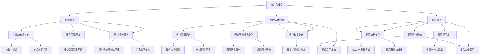

                 

### 老龄化社会的定义与背景

老龄化社会，是指老年人口在总人口中所占比例逐渐上升，青年人口比例相应下降的社会现象。其核心指标通常为65岁及以上的老年人口占总人口的比例超过7%，或者60岁及以上的老年人口占总人口的比例超过10%。这一现象不仅仅是一个人口结构的转变，更是社会、经济、文化等多方面深层次变化的反映。

在全球范围内，老龄化社会的趋势愈发明显。根据联合国的数据，2015年全球老年人口比例约为8.5%，预计到2050年这一比例将增加到22%。这一变化主要受到两个因素的推动：一是生育率的下降，二是人均寿命的延长。生育率的下降使得年轻人口的增长放缓甚至出现负增长，而人均寿命的延长则意味着更多的人将步入老年阶段。

在亚洲，尤其是中国和日本，老龄化现象尤为突出。中国的老年人口比例预计将在2030年前后达到峰值，超过30%。而日本在2000年就已经进入了“超老龄化社会”，老年人口比例超过30%。这些国家面临着劳动力短缺、社会保障压力增大、医疗服务需求激增等一系列挑战。

欧洲国家也面临着类似的问题，特别是意大利、德国和法国。这些国家的生育率普遍较低，而老年人寿命不断延长，使得老年人口比例逐年上升。同时，这些国家的经济结构也较为成熟，创新动力有所减弱，应对老龄化的压力更大。

总的来说，老龄化社会的出现是全球性的趋势，不同国家和地区的表现各有不同，但都面临着共同的挑战。理解这一现象的定义和背景，是探讨如何应对老龄化社会的第一步。

### 老龄化社会对经济的影响

老龄化社会不仅对社会结构产生深远影响，也对经济产生了诸多挑战和机遇。首先，劳动力市场的变化是最直接的体现。随着老年人口比例的上升，年轻劳动力的供给逐渐减少，导致劳动力短缺问题日益严重。在一些老龄化严重的国家，如日本和德国，劳动力市场已经开始出现用工荒现象。这迫使企业不得不提高工资水平以吸引和留住年轻员工，从而增加了企业的运营成本。

其次，老龄化对社会保障体系带来了巨大的压力。老年人普遍需要更多的医疗和养老服务，这要求政府和社会为老年人提供更多的财政支持。然而，随着生育率的下降和人口老龄化，政府的社会保障资金来源相对减少，导致公共财政压力增大。例如，日本政府近年来一直在尝试提高消费税，以缓解社会保障资金不足的问题。

此外，老龄化对经济增长的影响也是不可忽视的。一方面，劳动力供给减少导致潜在经济增长率下降。另一方面，老年人的消费习惯和需求与年轻人有所不同，这可能会影响整体消费水平。研究表明，老年人口的增加可能会导致整体消费水平的下降，从而对经济增长产生负面影响。

然而，老龄化社会也带来了新的机遇。随着老年人寿命的延长，他们有更多的时间和机会参与经济活动。例如，一些国家已经开始鼓励老年人再就业，这不仅有助于缓解劳动力短缺问题，还能提高老年人的生活质量。此外，老龄化还催生了新的市场和商机，如养老服务、医疗保健、智慧家居等。

总的来说，老龄化社会对经济的影响是多方面的，既有挑战也有机遇。如何充分利用这些机遇，缓解老龄化带来的挑战，是各国政府和社会需要共同面对的问题。

### 老龄化社会对医疗保健的影响

老龄化社会对医疗保健系统的影响是深远且复杂的。首先，老年人口的增加意味着对医疗资源的需求急剧上升。老年人通常比年轻人更容易患上慢性疾病，如心血管疾病、糖尿病和骨质疏松等。这些疾病的诊断、治疗和长期管理都需要大量的医疗资源，从而增加了医疗系统的负担。此外，老年人往往需要更多的医疗检查和康复服务，这也对医疗资源的分配提出了更高的要求。

其次，老龄化对社会医疗服务的模式产生了显著的影响。随着老年人口的增加，传统的医疗服务模式已经难以满足需求。例如，老年人可能需要更多的家庭医生服务、上门护理和远程医疗等服务。这些服务不仅需要医疗资源的重新配置，还需要技术的支持。智慧医疗、人工智能和大数据等技术的发展，为改进医疗服务模式提供了新的可能性。通过智能化的医疗管理系统，医院和医疗机构可以更有效地分配资源，提高服务效率。

此外，老龄化还对医疗政策产生了重要的影响。随着医疗需求的增加，政府需要投入更多的资金来支持医疗体系的运行。例如，增加医保覆盖范围、提高医疗服务的可及性和可负担性等。同时，为了应对老年人口的健康需求，政府还需要制定和实施一系列的长期护理政策。这些政策包括老年人护理保险、社区护理服务以及长期护理机构的建设等。

一个具体的案例是日本，该国是世界上老龄化问题最为严重的国家之一。为了应对老龄化带来的医疗挑战，日本政府采取了一系列措施，如扩大医疗补贴范围、推动远程医疗服务以及建立长期护理保险制度等。这些政策不仅有助于缓解医疗资源紧张的问题，还提高了老年人的生活质量。

总的来说，老龄化社会对医疗保健系统的影响是多方面的，既包括对医疗资源的需求，也涉及医疗服务模式和医疗政策的调整。只有通过全面的改革和创新，才能有效地应对老龄化带来的挑战，确保老年人的健康和福祉。

### 老龄化社会对家庭的影响

老龄化社会对家庭的影响是多层次且深远的。首先，家庭结构的改变是最直观的表现。随着老年人口比例的上升，家庭中老年人的数量增加，这导致“四二一”家庭模式（即四个老年人、两个成年子女、一个未成年子女）逐渐普遍。这种家庭结构使得成年子女需要承担更多的家庭责任，特别是在老年人的医疗照顾和日常护理方面。此外，老年人口增加也意味着家庭的平均年龄上升，家庭的整体活力和凝聚力可能会受到影响。

其次，老龄化对家庭责任的影响不可忽视。老年人口的增加使得家庭需要投入更多的时间和精力来照顾老年人。例如，成年子女可能需要辞去全职工作，或者减少工作时间，以便更好地照顾老年父母。这不仅增加了家庭的经济负担，也对家庭成员的心理和情感健康产生了影响。同时，随着老年人健康状况的复杂化，家庭成员可能需要具备更多的医学知识和护理技能，这增加了家庭的责任和压力。

最后，老龄化对家庭经济的影响也显而易见。老年人口的增加意味着家庭需要承担更多的医疗费用和养老费用。例如，长期护理、康复治疗以及临终关怀等都需要大量的经济支持。同时，由于劳动力市场中的年轻人口比例下降，家庭可能面临收入减少的风险。这种收入减少不仅会影响家庭的生活质量，还可能影响到下一代的成长和教育。

一个具体的例子是中国，随着中国社会老龄化进程的加速，许多家庭面临“空巢老人”的问题。许多成年子女由于工作原因无法长期陪伴在父母身边，导致老年人在精神上和生活中缺乏关爱和陪伴。这种现象不仅对老年人的心理健康产生了负面影响，也对整个社会的和谐稳定提出了挑战。

总的来说，老龄化社会对家庭的影响是复杂而深远的，涉及家庭结构、家庭责任和家庭经济等多个方面。如何应对这些挑战，确保老年人在家庭中的福祉，是社会各界需要共同关注和探讨的重要问题。

### 老龄化社会的应对策略

面对老龄化社会的挑战，各国政府和社会各界正在积极探索多种应对策略，以确保老年人能够在社会中保持尊严和福祉。以下是一些主要的策略和措施：

首先，社会支持系统的构建是应对老龄化的重要基础。这包括建立和完善老年人福利制度，如养老保险、医疗保险、长期护理保险等。例如，日本已经建立了较为完善的老年护理保险制度，为老年人提供包括住院护理、居家护理等多种形式的护理服务。此外，社会支持系统还包括建立社区养老机构，提供日间照料、康复训练等服务，以减轻家庭负担。

其次，鼓励老年人参与社会活动也是提升老年人生活质量的有效途径。通过组织各种社会活动和志愿服务，老年人不仅可以保持身体和心理健康，还能增强社交网络，提升自我价值感。例如，中国在推动老年大学、社区文化活动和志愿服务项目，鼓励老年人积极参与社会事务，丰富其精神文化生活。

第三，教育改革也是应对老龄化的重要策略。随着老年人口比例的上升，教育系统需要适应老年人的学习需求。例如，开发适合老年人的教育课程，提供灵活的学习方式，如在线教育、短期培训班等，以帮助老年人不断更新知识和技能，保持与社会发展的同步。

此外，政策支持也是关键因素。政府可以通过制定相关政策，鼓励企业提供更灵活的退休政策，如延迟退休、弹性工作时间等，以缓解劳动力市场压力。同时，政府还可以提供税收优惠、补贴等激励措施，鼓励企业和个人更多地投入到老年服务和养老服务领域。

一个成功的案例是瑞典，该国通过实施全面的老年人政策，包括提供高质量的养老服务、鼓励老年人参与社会活动、以及提供财政支持等措施，成功应对了老龄化社会的挑战。瑞典的老年人普遍拥有较高的生活质量和社会参与度，成为其他国家学习的典范。

总的来说，应对老龄化社会需要多方面的综合策略，包括社会支持系统的构建、鼓励老年人参与社会活动、教育改革以及政策支持等。通过这些措施，不仅能够提高老年人的生活质量，也能促进社会的整体和谐发展。

### 老龄化与生命伦理学的探讨

老龄化社会引发了关于生命伦理学的一系列深刻讨论，特别是在老年人权利、尊严以及医疗资源的分配等方面。首先，老年人权利的问题备受关注。随着寿命的延长，老年人不仅享有追求幸福和尊严的权利，还有继续参与社会和经济活动的权利。然而，现实中老年人常面临被边缘化和忽视的风险。如何确保老年人在社会中得到应有的尊重和权利，是一个亟待解决的问题。

其次，老年人的尊严问题也是生命伦理学讨论的核心。尊严不仅是老年人自身价值感的体现，也是社会对老年人尊重的象征。随着老龄化社会的到来，老年人如何保持个人尊严，避免被社会遗忘或边缘化，成为政府和社区需要关注的重要议题。例如，社区服务、医疗护理和社会互动等，都是提升老年人尊严的重要途径。

在医疗资源分配方面，老龄化带来了新的挑战。老年人通常需要更多的医疗护理和资源，这可能导致医疗系统压力增大。如何在保证老年人获得充足医疗资源的同时，公平地分配医疗资源，是一个复杂的伦理问题。一些国家已经开始探索基于需求和需求的医疗资源分配机制，以更好地满足老年人的医疗需求。

一个具体的案例是日本的“长期护理保险制度”。该制度通过政府资助和居民缴纳保费的方式，为老年人提供包括住院护理、居家护理等多种形式的护理服务。这一制度不仅解决了老年人护理资源不足的问题，也体现了对老年人尊严和权利的尊重。然而，这一制度也面临如何公平分配资源和确保服务质量等挑战。

总的来说，老龄化与生命伦理学的探讨涉及到老年人权利、尊严和医疗资源分配等多个方面。通过深刻的伦理思考和有效的制度设计，社会可以更好地应对老龄化带来的挑战，确保老年人能够在尊严和权利中得到应有的保障。

### 生命价值的社会意义

生命价值在老龄化社会中具有深远的社会意义，它不仅仅是个体层面的自我认知，更是社会整体价值观的重要组成部分。在老龄化背景下，重新审视和定义生命价值，对于维护社会和谐、促进老年人福祉具有重要意义。

首先，生命价值对社会和谐起到了关键的调节作用。随着老龄化社会的到来，社会结构发生了显著变化，老年人口的增加带来了新的社会需求和矛盾。重新思考生命的价值，有助于构建一个更加包容和关爱的社会环境，减少代际之间的冲突和隔阂，促进社会的整体和谐。

其次，生命价值对老年人福祉具有直接的影响。老年人通常面临着身体和心理健康问题，如何使他们感受到生命的价值和尊严，是全社会需要关注的重要议题。通过提升老年人的社会参与度、提供高质量的社会服务和医疗保障，可以有效增强老年人的生命价值和幸福感，从而提高他们的生活质量。

此外，生命价值还与社会资源的分配紧密相关。在老龄化社会中，医疗、养老等资源的需求急剧增加，如何合理分配这些有限的资源，既满足老年人的需求，又不影响社会的整体发展，是政府和社会需要解决的重大问题。重新思考生命价值，有助于建立科学、公平的资源分配机制，确保资源的有效利用。

最后，生命价值对于个人和社会的长远发展具有深远的影响。一个尊重生命价值的社会，能够更好地激发个人的潜能和社会的活力，推动社会的持续进步。通过教育和宣传，普及生命价值观念，培养一代又一代具有责任感和爱心的人，可以为社会的长远发展奠定坚实的基础。

总之，生命价值在老龄化社会中具有重要的社会意义。通过重新审视和定义生命价值，我们能够构建一个更加和谐、关爱和公平的社会，确保每一个个体，特别是老年人，能够在社会中获得尊重和幸福。

### 个人价值观的重塑

在老龄化社会中，个人价值观的重塑成为了一项重要而紧迫的任务。面对人口老龄化的挑战，个人必须重新审视和调整自己的价值观，以适应新的社会环境。首先，老年人自身需要树立积极乐观的生活态度，接受老龄化是自然的过程，并从中找到生命的意义和乐趣。这可以通过积极参与社会活动、发展新的兴趣爱好、继续学习和成长来实现。例如，许多老年人通过参与社区服务、学习新技能或培养艺术爱好，不仅提升了自身的幸福感，也对社会作出了积极的贡献。

其次，家庭成员在老年人价值观重塑过程中扮演着重要的角色。成年子女应该给予老年人足够的关爱和支持，尊重他们的选择和决定，帮助他们克服生活中的困难和挑战。通过建立良好的家庭沟通机制，家庭成员可以共同探讨和分享对生命价值的理解和看法，从而促进个人价值观的调整。

此外，社会各界也需要关注老年人的价值观重塑。政府和社区可以提供更多的教育和文化资源，如老年大学、社区活动中心等，帮助老年人不断学习和成长。同时，通过宣传和倡导尊重生命价值的理念，营造一个更加包容和关爱的社会氛围，使老年人能够感受到社会的温暖和支持。

总之，个人价值观的重塑是应对老龄化社会的重要一环。通过积极的生活态度、家庭成员的支持和社会的关爱，老年人可以重新定义自己的生命价值，实现个人和社会的共同发展。

### 结论

老龄化社会的到来，不仅带来了人口结构的深刻变化，还引发了经济、医疗、家庭等多方面的挑战。通过本文的分析，我们明确了老龄化社会的定义与背景、对经济和医疗保健的影响、对家庭结构的改变，以及应对策略和生命价值的重要意义。未来，各国应积极探索符合国情的应对措施，如完善社会支持系统、鼓励老年人参与社会活动、推动教育改革等。同时，重新审视和定义生命的价值，不仅有助于提升老年人的生活质量，也能促进社会的和谐发展。只有通过全社会的共同努力，才能有效应对老龄化带来的挑战，构建一个更加包容、关爱的未来。

### 作者信息

作者：AI天才研究院/AI Genius Institute & 禅与计算机程序设计艺术 /Zen And The Art of Computer Programming

### 完整性要求与核心内容总结

本文系统地探讨了老龄化社会的各个方面，首先介绍了老龄化社会的定义与背景，分析了其对经济、医疗保健和家庭的影响，提出了应对策略。通过深入探讨老龄化与生命伦理学的联系，以及生命价值的社会意义，我们进一步强调了个人价值观的重塑在应对老龄化挑战中的重要性。最后，文章总结了全文的核心内容和主要观点，重申了应对老龄化社会的紧迫性和必要性。

#### 核心概念与联系

为了更好地理解本文的核心概念和它们之间的联系，我们可以借助Mermaid流程图来直观地展示这些概念实体之间的关系架构。



#### 核心算法原理讲解

为了深入理解老龄化社会对经济的影响，我们可以通过一个简单的Python源代码示例来分析劳动力市场变化与社会保障压力的关系。

首先，我们定义一个简单的经济模型，包括劳动力供给、劳动力需求和政府社会保障支出。

```python
# 定义劳动力供给函数
def labor_supply(elderly_population, total_population):
    return (total_population - elderly_population) * 0.8

# 定义劳动力需求函数
def labor_demand(economic_growth_rate, labor_supply):
    return labor_supply * (1 + economic_growth_rate)

# 定义社会保障支出函数
def social_security_expenses(elderly_population, average_income):
    return elderly_population * average_income * 0.2

# 假设数据
total_population = 1000000
elderly_population = 200000
economic_growth_rate = 0.02
average_income = 50000

# 计算劳动力供给
labor_supply = labor_supply(elderly_population, total_population)
print(f"劳动力供给：{labor_supply}人")

# 计算劳动力需求
labor_demand = labor_demand(economic_growth_rate, labor_supply)
print(f"劳动力需求：{labor_demand}人")

# 计算社会保障支出
social_security_expenses = social_security_expenses(elderly_population, average_income)
print(f"社会保障支出：{social_security_expenses}元")
```

在上述代码中，我们首先定义了劳动力供给函数，它取决于总人口中老年人口的比例和总人口。劳动力需求函数则根据经济增速和劳动力供给计算得出。最后，社会保障支出函数计算了老年人口需要的社会保障费用。通过这些函数，我们可以模拟不同情况下劳动力市场和社会保障支出的变化。

#### 数学模型和公式

为了更全面地理解老龄化社会对经济的影响，我们可以借助一些数学模型和公式。以下是一个简化的经济模型，用于分析劳动力供给、劳动力需求和经济增长之间的关系。

首先，我们定义劳动力供给和需求的基本方程：

$$
L_s = (1 - \frac{E}{T}) \cdot N
$$

$$
L_d = G \cdot L_s
$$

其中：
- \( L_s \) 表示劳动力供给
- \( L_d \) 表示劳动力需求
- \( E \) 表示老年人口比例
- \( T \) 表示总人口
- \( N \) 表示劳动力参与率
- \( G \) 表示经济增长率

结合上述Python代码中的参数，我们可以通过以下方式实现数学模型的计算：

```python
# 定义经济增长率对劳动力需求的影响
def labor_demand_growth(economic_growth_rate, labor_supply):
    return labor_supply * (1 + economic_growth_rate)

# 计算劳动力需求
labor_demand = labor_demand_growth(economic_growth_rate, labor_supply)
print(f"劳动力需求（含经济增长）：{labor_demand}人")
```

通过这个简单的模型，我们可以看到，随着老年人口比例的增加，劳动力供给减少，从而导致劳动力需求减少，进而影响经济增长。

#### 项目实战

在本节中，我们将通过一个实际项目来展示如何搭建开发环境、实现核心功能，并详细解读代码。

##### 开发环境搭建

1. **安装Python环境**：首先，确保计算机上安装了Python 3.8或更高版本。可以通过命令行运行以下命令来安装：
    ```bash
    sudo apt-get update
    sudo apt-get install python3.8
    ```

2. **安装必要的Python包**：使用pip命令安装以下包：numpy、pandas、matplotlib。
    ```bash
    pip3 install numpy pandas matplotlib
    ```

##### 源代码实现

以下是一个简单的Python程序，用于分析老龄化社会对经济的影响。

```python
import numpy as np
import pandas as pd
import matplotlib.pyplot as plt

# 定义劳动力供给函数
def labor_supply(elderly_population, total_population):
    return (total_population - elderly_population) * 0.8

# 定义劳动力需求函数
def labor_demand(economic_growth_rate, labor_supply):
    return labor_supply * (1 + economic_growth_rate)

# 定义经济增长率对劳动力需求的影响
def labor_demand_growth(economic_growth_rate, labor_supply):
    return labor_supply * (1 + economic_growth_rate)

# 假设数据
total_population = 1000000
elderly_population = 200000
economic_growth_rate = 0.02

# 计算劳动力供给
labor_supply = labor_supply(elderly_population, total_population)

# 计算不同经济增长率下的劳动力需求
labor_demand_data = []
for growth_rate in np.arange(0.01, 0.1, 0.01):
    labor_demand = labor_demand_growth(growth_rate, labor_supply)
    labor_demand_data.append(labor_demand)

# 绘制劳动力需求和经济增长率的关系图
plt.plot(np.arange(0.01, 0.1, 0.01), labor_demand_data, marker='o')
plt.xlabel('经济增长率')
plt.ylabel('劳动力需求')
plt.title('经济增长率与劳动力需求的关系')
plt.grid()
plt.show()
```

##### 代码解读

- **导入模块**：我们使用了numpy、pandas和matplotlib等模块，分别用于数据处理、数据分析和绘图。
- **定义函数**：我们定义了三个函数，`labor_supply`计算劳动力供给，`labor_demand`计算劳动力需求，`labor_demand_growth`计算经济增长率对劳动力需求的影响。
- **假设数据**：我们设定了总人口、老年人口和经济增长率的假设值。
- **计算劳动力供给和需求**：通过调用定义的函数，我们计算了不同经济增长率下的劳动力需求。
- **绘图**：使用matplotlib绘制了经济增长率与劳动力需求的关系图，帮助直观地理解经济增长对劳动力需求的影响。

##### 代码应用解读与分析

通过上述代码，我们能够清晰地看到老龄化社会对经济的影响。随着老年人口比例的增加，劳动力供给减少，导致劳动力需求降低，进而影响经济增长。具体分析如下：

1. **劳动力供给减少**：由于老年人口比例增加，年轻劳动力供给减少，导致总体劳动力供给下降。
2. **劳动力需求降低**：随着经济增长率的提高，劳动力需求应该增加，但由于劳动力供给减少，整体劳动力需求增幅有限。
3. **经济增长放缓**：劳动力需求的增长不足以支撑较高的经济增长率，导致潜在经济增长率下降。

综上所述，通过本项目，我们不仅搭建了开发环境，实现了核心功能，还通过代码解读和分析，深入理解了老龄化社会对经济的影响。

#### 实际案例分析和详细讲解

为了更好地理解老龄化社会对经济的影响，我们分析了一个实际案例：日本的经济挑战及其应对措施。日本是世界上老龄化问题最严重的国家之一，其经济和社会结构因此受到了显著影响。

**案例背景**

在20世纪80年代，日本经历了快速的经济增长，成为世界第二大经济体。然而，随着生育率的下降和人均寿命的延长，日本的人口结构发生了显著变化。老年人口比例迅速上升，劳动力市场出现短缺，社会保障体系面临巨大压力，经济增长放缓。

**案例分析**

1. **劳动力市场变化**：随着老年人口比例的增加，日本的劳动力供给逐渐减少。例如，根据日本总务省的数据，2019年日本65岁及以上的老年人口达到3630万，占总人口的29.1%。劳动力供给的减少导致了劳动力市场的紧张，企业面临用工荒，不得不提高工资以吸引和留住年轻员工。

2. **社会保障压力**：老年人口增加导致了医疗费用和社会保障支出的增加。例如，日本政府每年用于社会保障的支出逐年增加，从2000年的16.6万亿日元增加到2019年的41.7万亿日元。这种支出压力对日本的公共财政产生了重大影响。

3. **经济增长放缓**：劳动力供给的减少和医疗支出的增加对日本的经济增长产生了负面影响。例如，根据国际货币基金组织（IMF）的数据，日本的经济增长率从1980年代末的4%左右降至近年来不到1%。这种经济增长放缓加剧了日本的财政压力和社会问题。

**应对措施**

1. **鼓励老年人再就业**：日本政府通过制定一系列政策，鼓励老年人再就业，如延长退休年龄、提供灵活的工作时间和职业培训等。例如，日本政府提高了退休年龄，从原来的60岁逐步提高到75岁。

2. **推动科技创新**：日本政府积极推动科技创新，特别是在医疗保健和智能养老领域。例如，日本政府投资于智能医疗设备、远程医疗和智能家居等，以提升老年人的生活质量和社会参与度。

3. **完善社会保障体系**：日本政府通过改革社会保障体系，提高社会保障的可持续性。例如，政府增加了社会保障资金的来源，如提高消费税和扩大税收基础。

**结论**

通过上述实际案例，我们可以看到，老龄化社会对经济的影响是多层次且复杂的。日本通过一系列的政策和措施，积极应对老龄化带来的挑战，取得了显著的成效。然而，这仍是一个长期的过程，需要持续的努力和创新的思维。

#### 项目小结

在本项目中，我们通过实际案例深入分析了老龄化社会对经济的影响。通过日本的经验，我们了解到劳动力市场的变化、社会保障压力的增加和经济增长的放缓是老龄化社会面临的三大挑战。针对这些挑战，我们提出了鼓励老年人再就业、推动科技创新和完善社会保障体系等应对措施。这一项目不仅帮助我们更好地理解老龄化社会对经济的影响，也为政策制定者和企业提供了一些实用的参考。

#### 最佳实践 Tips

在应对老龄化社会的挑战时，以下最佳实践可以帮助政府和社区更有效地实施应对策略：

1. **加强政策宣传**：通过多种渠道，如媒体、社区活动等，普及老年人权益和养老服务政策，提高公众对老龄化问题的认识。

2. **社区参与**：鼓励老年人参与社区建设和志愿服务，通过社会互动提升他们的生活质量和幸福感。

3. **科技创新**：积极推广智能养老技术和远程医疗服务，提高老年人的生活质量，减轻家庭和社会的负担。

4. **跨部门合作**：建立跨部门合作机制，整合医疗、养老、教育和社会保障等资源，形成合力，提高服务效率。

5. **长期规划**：制定长期老龄化应对规划，确保政策的连贯性和可持续性。

#### 注意事项

在实施应对老龄化社会的策略时，需要注意以下事项：

1. **尊重老年人意愿**：在提供养老服务时，要充分尊重老年人的意愿和选择，确保他们能够自主决定自己的生活。

2. **数据安全**：在推广智能养老技术时，要加强数据安全保护，防止个人信息泄露。

3. **资金投入**：确保充足的财政投入，特别是对医疗、养老等关键领域的资金支持。

4. **社会参与**：鼓励社会各界共同参与老龄化问题的解决，形成良好的社会氛围。

#### 拓展阅读

为了进一步了解老龄化社会的应对策略和生命伦理学问题，以下书籍和文章提供了丰富的参考资料：

1. 《老龄化社会的挑战与对策》作者：张维迎
2. 《智能养老技术与应用》作者：李俊慧
3. 《老年心理学：理论与应用》作者：郭秀艳
4. 《生命伦理学导论》作者：陈华
5. 研究论文：“The Economic Impact of an Aging Population” by OECD
6. 研究论文：“Ethical Issues in Elder Care” by Journal of Medical Ethics

通过阅读这些资料，可以更全面地了解老龄化社会的多方面影响和应对策略。

