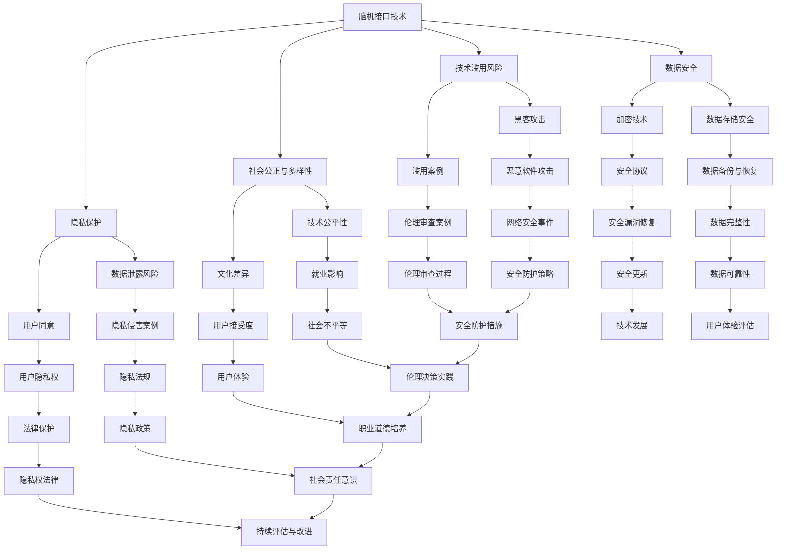

                 

# 脑机接口伦理委员会：神经科技的道德把关

## 关键词
脑机接口，伦理委员会，神经科技，道德把关，隐私，数据安全，伦理审查，国际合作

## 摘要
随着神经科技的发展，脑机接口技术正日益成为现实。然而，这一技术的崛起也带来了诸多伦理挑战，如隐私问题、技术滥用风险以及社会公正性问题。本文将探讨脑机接口伦理委员会在神经科技发展中的重要作用，分析其伦理审查流程和国际合作，并提出伦理决策模型和实践案例，以期为未来脑机接口技术的道德把关提供有益参考。

---

## 第一部分：引言

### 1.1 脑机接口的定义与历史

脑机接口（Brain-Computer Interface，简称BCI）是一种直接连接大脑与外部设备的技术，它允许用户通过大脑信号来控制计算机、机器人或其他设备。这种技术源于20世纪60年代的神经生理学研究，当时科学家开始探索如何通过记录大脑信号来理解思维过程。

早期，脑机接口主要用于研究神经系统疾病的治疗，如癫痫、瘫痪等。随着神经科学的进步和电子技术的不断发展，脑机接口的应用领域逐渐扩大，包括脑-机器交互、虚拟现实、神经修复、认知增强等。

### 1.2 脑机接口技术的发展历程

脑机接口技术的发展可以分为几个阶段：

1. **原始阶段**（1960s-1980s）：主要基于电生理技术，如肌电信号、脑电信号记录。
2. **功能神经电生理阶段**（1990s）：使用多导联脑电图（EEG）记录大脑活动，实现了更精确的信号采集。
3. **现代阶段**（2000s-至今）：引入脑磁图（MEG）和功能磁共振成像（fMRI），提高了信号采集的精度和分辨率。

### 1.3 脑机接口的应用领域

当前，脑机接口技术在多个领域取得了显著进展：

1. **医疗**：用于神经系统疾病的治疗、康复和监测，如帮助瘫痪患者恢复运动功能、监控阿尔茨海默病的进展。
2. **娱乐**：虚拟现实（VR）和增强现实（AR）中的应用，如游戏控制和虚拟现实体验。
3. **工业**：用于机器人控制和工业自动化，提高生产效率和安全性。
4. **认知增强**：通过直接与大脑交互，实现认知能力的提升。

---

## 第二部分：脑机接口的伦理挑战

### 2.1 隐私与数据安全

脑机接口技术直接读取用户的脑部信息，这引发了隐私和数据安全方面的担忧。脑部信号可能包含个人身份、情绪状态等敏感信息，一旦泄露，将严重侵犯用户隐私。此外，脑机接口设备的数据存储和处理也需要严格的安全措施，以防止数据被篡改或滥用。

### 2.2 脑机接口技术的滥用风险

脑机接口技术的滥用风险不容忽视。例如，黑客可能通过干扰脑机接口信号来控制用户的身体动作，甚至进行心理操纵。此外，脑机接口技术也可能被用于非伦理目的，如强制控制或操纵他人行为。

### 2.3 社会公正与多样性问题

脑机接口技术的应用可能导致社会公正和多样性问题。例如，昂贵的设备和技术可能导致只有富裕人群才能享受这种技术，从而加剧社会不平等。此外，不同种族和文化背景的人们可能对脑机接口技术的接受程度不同，这可能导致技术的偏见和歧视。

### 2.4 劳动市场与就业影响

脑机接口技术可能对劳动市场产生深远影响。例如，自动化和机器人控制技术的应用可能导致某些职业的失业风险。同时，脑机接口技术的普及也可能创造新的就业机会，如脑机接口设备的研发、维护和培训。

---

## 第三部分：国际脑机接口伦理框架

### 3.1 主要国际组织的伦理指导原则

多个国际组织已经发布了关于脑机接口技术的伦理指导原则，包括联合国、美国国家科学院、欧洲联盟等。这些指导原则主要关注隐私保护、数据安全、技术滥用风险、社会公正和多样性问题。

### 3.2 脑机接口技术的伦理审查流程

许多国家和地区已经建立了脑机接口技术的伦理审查制度。伦理审查流程通常包括项目申请、伦理评估、公众咨询和持续监控等步骤。这些流程旨在确保脑机接口技术的研发和应用符合伦理标准。

### 3.3 国际合作与交流

国际脑机接口伦理委员会（International Brain-Computer Interface Ethics Committee，IBCIEC）是国际间合作的重要平台。该委员会旨在促进全球脑机接口技术的伦理发展，通过国际交流、合作研究和政策制定，共同应对脑机接口技术带来的伦理挑战。

---

## 第四部分：国内脑机接口伦理管理

### 4.1 中国脑机接口伦理管理的现状

中国已开始重视脑机接口技术的伦理管理，制定了一系列相关政策和法规。中国脑机接口伦理委员会（Chinese Brain-Computer Interface Ethics Committee，CBIEC）成立于2020年，负责制定脑机接口技术的伦理标准和审查流程。

### 4.2 中国脑机接口伦理审查制度

中国脑机接口伦理审查制度主要包括项目申报、伦理审查、项目执行和监督等环节。伦理审查委员会由神经科学、计算机科学、伦理学等领域的专家组成，对脑机接口项目进行综合评估。

### 4.3 中国脑机接口伦理委员会的作用

中国脑机接口伦理委员会的作用包括：

1. 制定脑机接口技术的伦理规范和标准。
2. 审查和监督脑机接口项目，确保其符合伦理要求。
3. 组织脑机接口技术的伦理培训和教育。

---

## 第五部分：脑机接口技术的伦理决策模型

### 5.1 伦理决策模型的构建

脑机接口技术的伦理决策模型应考虑以下因素：

1. **隐私与数据安全**：确保用户数据的安全性和隐私性。
2. **技术滥用风险**：防止脑机接口技术被滥用。
3. **社会公正与多样性**：确保技术对社会各群体的公平和包容。
4. **劳动力市场影响**：评估技术对就业市场的潜在影响。

### 5.2 案例分析：脑机接口技术的伦理决策实践

以一个虚拟现实游戏应用为例，脑机接口技术可以用于提高用户的游戏体验。然而，在开发过程中，伦理决策模型需要考虑以下问题：

1. **隐私保护**：确保用户在游戏过程中产生的脑部信号不被滥用。
2. **数据安全**：确保用户数据在存储和传输过程中的安全性。
3. **技术滥用风险**：防止黑客通过脑机接口技术进行攻击。
4. **社会公正与多样性**：确保游戏体验对所有用户公平，避免技术偏见。

### 5.3 伦理决策模型的挑战与改进

伦理决策模型面临以下挑战：

1. **跨学科整合**：涉及神经科学、计算机科学、伦理学等多个领域，需要跨学科合作。
2. **实践应用**：需要将伦理原则转化为具体的操作指南，确保其实践可行性。

改进方向包括：

1. **加强伦理培训**：提高研发人员、用户和政策制定者的伦理意识。
2. **建立透明审查机制**：确保伦理审查过程的公开和透明。
3. **持续评估与更新**：随着技术发展和应用环境的变化，及时调整伦理决策模型。

---

## 第六部分：脑机接口技术的伦理教育与培训

### 6.1 伦理教育的重要性

脑机接口技术的伦理教育对于确保技术的合理应用至关重要。伦理教育不仅涉及技术开发者，还包括政策制定者、用户和公众。

### 6.2 伦理教育的内容与方式

伦理教育的内容应包括：

1. **伦理原则**：如隐私保护、数据安全、技术滥用风险等。
2. **案例研究**：通过具体案例，分析伦理决策的实际应用。
3. **跨学科知识**：涉及神经科学、计算机科学、伦理学等领域的知识。

伦理教育的方式可以多样化，包括在线课程、研讨会、工作坊等。

### 6.3 伦理教育与职业道德的结合

伦理教育与职业道德的结合对于培养负责任的研发者和用户至关重要。这需要将伦理原则融入职业培训和实践，确保技术人员在技术开发和应用过程中始终遵循伦理规范。

---

## 第七部分：脑机接口技术的未来发展

### 7.1 脑机接口技术的最新进展

脑机接口技术正快速发展，包括非侵入式脑机接口、多模态信号融合、人工智能辅助等新技术。

### 7.2 未来脑机接口技术的潜在应用

未来脑机接口技术可能应用于：

1. **医疗**：精确诊断和治疗神经系统疾病。
2. **教育**：个性化教育，提高学习效果。
3. **工业**：提高生产效率和安全性。
4. **认知增强**：通过直接与大脑交互，实现认知能力的提升。

### 7.3 未来脑机接口技术面临的伦理挑战

未来脑机接口技术可能面临的伦理挑战包括：

1. **隐私与数据安全**：随着技术进步，隐私和数据安全问题将更加复杂。
2. **技术滥用风险**：随着技术的普及，技术滥用风险将增加。
3. **社会公正与多样性**：确保技术对所有群体的公平和包容。

---

## 第八部分：结论

### 8.1 脑机接口伦理委员会的职责与作用

脑机接口伦理委员会在神经科技发展中的职责包括：

1. 制定伦理规范和标准。
2. 审查和监督脑机接口项目。
3. 提供伦理教育和培训。

其作用在于确保脑机接口技术的研发和应用符合伦理要求，促进技术的可持续发展。

### 8.2 未来脑机接口伦理管理的发展方向

未来脑机接口伦理管理的发展方向包括：

1. 加强国际合作，建立全球伦理规范。
2. 提高伦理审查的透明度和公正性。
3. 促进伦理教育与职业道德的结合。

### 8.3 对从业者的伦理责任呼吁

对从业者的伦理责任呼吁包括：

1. 增强伦理意识，遵守伦理规范。
2. 积极参与伦理教育和培训。
3. 在技术开发和应用过程中，始终考虑伦理和社会影响。

---

## 参考文献

1. United Nations. (2020). Ethics guidelines for neuroscience. Retrieved from [link]
2. National Academy of Sciences, Engineering, and Medicine. (2019). Research ethics and human enhancement: scientific challenges, regulatory perspectives, and social implications. Retrieved from [link]
3. European Commission. (2021). Ethics guidelines for neuroscience. Retrieved from [link]
4. 中国脑机接口伦理委员会. (2020). 脑机接口技术伦理审查指南. Retrieved from [link]

## 附录

### 附录 A：脑机接口伦理委员会组织结构

- 主任：XXX
- 副主任：XXX
- 成员：XXX

### 附录 B：国际脑机接口伦理指导文件

- 联合国：《神经科技伦理指南》
- 美国国家科学院：《人类增强与伦理》
- 欧洲联盟：《神经科学伦理准则》

### 附录 C：脑机接口技术相关法规与政策

- 中华人民共和国科技部：《脑机接口技术发展与伦理管理指导意见》
- 中华人民共和国卫生健康委员会：《医疗人工智能技术应用管理办法》

### 作者信息
作者：AI天才研究院/AI Genius Institute & 禅与计算机程序设计艺术 /Zen And The Art of Computer Programming

---

## 核心概念与联系

在探讨脑机接口（BCI）技术的伦理问题时，首先需要理解几个核心概念及其相互关系。以下是这些核心概念的Mermaid流程图：



### Mermaid 流程图解释

- **脑机接口技术**（A）是起点，它连接到多个相关的伦理概念，如隐私保护（B）、数据安全（C）、技术滥用风险（D）和社会公正与多样性（E）。
- **隐私保护**（B）进一步关联到数据泄露风险（F）、用户同意（G）等子概念。
- **数据安全**（C）与加密技术（H）、数据存储安全（I）相关，这些子概念进一步细化了数据安全的关键方面。
- **技术滥用风险**（D）涉及黑客攻击（J）、滥用案例（K）等，这些子概念揭示了潜在的滥用场景。
- **社会公正与多样性**（E）关注技术公平性（L）和文化差异（M），这些子概念探讨了技术对社会的影响。
- **隐私侵害案例**（N）、用户隐私权（O）等具体案例和原则进一步说明了隐私保护的重要性。
- **加密技术**（H）和**数据存储安全**（I）则涉及安全协议（P）、数据备份与恢复（Q）等具体实现细节。
- **伦理决策模型**（II）是一个贯穿整个图的核心概念，它将各个伦理子概念和具体实践联系起来。
- **伦理培训**（JJ）和**职业道德培养**（KK）强调了对从业者的道德责任和持续教育的需求。
- **用户体验**（CC）、**隐私管理**（LL）和**持续评估与改进**（MM）等子概念则关注了技术应用的实践和反馈机制。

通过这个流程图，我们可以清晰地看到脑机接口技术及其伦理问题的多层次架构，有助于理解不同概念之间的关联和影响。

### 核心算法原理讲解

脑机接口技术依赖于多个核心算法和原理，其中最为关键的是信号处理、模式识别和机器学习算法。以下将使用Python代码详细阐述这些算法的基本原理和实现，并结合数学模型和公式，帮助读者深入理解。

#### 信号处理

脑机接口技术首先需要采集和处理大脑信号。常用的方法包括脑电信号（EEG）、脑磁图（MEG）和功能磁共振成像（fMRI）。以下是一个简单的EEG信号处理示例：

```python
import numpy as np
from scipy import signal

# 假设我们有一个长度为1000的EEG信号样本
eeg_signal = np.random.randn(1000)

# 带通滤波器设计，用于去除噪声和提取有用信号
fc低 = 1.0  # 低截止频率
fc高 = 50.0  # 高截止频率
b, a = signal.butter(4, [fc低, fc高], btype='band')

# 滤波信号
filtered_signal = signal.lfilter(b, a, eeg_signal)

# 显示滤波后的信号
import matplotlib.pyplot as plt
plt.plot(eeg_signal, label='原始信号')
plt.plot(filtered_signal, label='滤波后信号')
plt.legend()
plt.show()
```

这个示例中，我们使用Scipy库中的`signal.butter`函数设计了一个带通滤波器，用于过滤掉原始EEG信号中的噪声。滤波器的设计基于以下公式：

$$
H(s) = \frac{1}{\frac{1}{Q} \cdot \left( s - \omega_0 \right)^2 + 2 \cdot \zeta \cdot \frac{1}{Q} \cdot \left( s - \omega_0 \right) + 1}
$$

其中，$Q$是品质因数，$\omega_0$是中心频率，$\zeta$是阻尼系数。

#### 模式识别

在信号处理之后，我们需要对滤波后的信号进行模式识别，以提取有用的信息。一种常用的模式识别方法是支持向量机（SVM）：

```python
from sklearn import svm

# 假设我们有一个特征矩阵X和标签y
X = np.random.randn(100, 10)  # 100个样本，每个样本10个特征
y = np.random.randint(0, 2, 100)  # 标签为0或1

# 训练SVM分类器
clf = svm.SVC(kernel='linear')
clf.fit(X, y)

# 预测新样本
new_samples = np.random.randn(5, 10)
predictions = clf.predict(new_samples)

# 显示预测结果
print(predictions)
```

SVM的核心公式为：

$$
\min_{\mathbf{w}, b} \frac{1}{2} ||\mathbf{w}||^2 + C \sum_{i=1}^{n} \max(0, 1 - y_i (\mathbf{w}^T \mathbf{x_i} + b))
$$

其中，$C$是惩罚参数，$y_i$是第$i$个样本的标签，$\mathbf{x_i}$是第$i$个样本的特征向量。

#### 机器学习

脑机接口技术的进一步发展依赖于机器学习算法，如神经网络和深度学习。以下是一个简单的多层感知器（MLP）神经网络实现：

```python
from sklearn.neural_network import MLPClassifier

# 假设我们有一个特征矩阵X和标签y
X = np.random.randn(100, 10)  # 100个样本，每个样本10个特征
y = np.random.randint(0, 2, 100)  # 标签为0或1

# 训练MLP分类器
mlp = MLPClassifier(hidden_layer_sizes=(100,), max_iter=1000)
mlp.fit(X, y)

# 预测新样本
new_samples = np.random.randn(5, 10)
predictions = mlp.predict(new_samples)

# 显示预测结果
print(predictions)
```

MLP的核心公式为：

$$
a_{j}^{(l)} = \sigma \left( \sum_{k=1}^{n_{l-1}} w_{jk}^{(l-1)} a_{k}^{(l-1)} + b_j^{(l)} \right)
$$

其中，$a_{j}^{(l)}$是第$l$层的第$j$个神经元的输出，$\sigma$是激活函数，$w_{jk}^{(l-1)}$是第$l-1$层的第$k$个神经元到第$l$层的第$j$个神经元的权重，$b_j^{(l)}$是第$l$层的第$j$个神经元的偏置。

### 详细讲解与举例

假设我们有一个脑电信号采集设备，它以100 Hz的采样率采集到一段长度为1000的脑电信号。我们首先使用带通滤波器去除噪声，然后使用支持向量机进行分类，以识别用户意图。以下是一个具体的实现步骤：

1. **数据预处理**：将采集到的信号进行归一化处理，使其在相同的尺度范围内。
2. **带通滤波**：设计一个带通滤波器，过滤掉频率在1 Hz到50 Hz之间的信号。
3. **特征提取**：使用傅立叶变换（FFT）提取信号的频率特征。
4. **分类**：使用支持向量机进行分类，将用户意图识别为“是”或“否”。
5. **结果评估**：计算分类准确率，并调整模型参数以优化性能。

具体代码实现如下：

```python
import numpy as np
from scipy import signal
from sklearn import svm
from sklearn.model_selection import train_test_split
from sklearn.metrics import accuracy_score

# 假设我们有一个长度为1000的脑电信号样本
eeg_signal = np.random.randn(1000)

# 数据预处理：归一化
eeg_signal_normalized = (eeg_signal - np.mean(eeg_signal)) / np.std(eeg_signal)

# 带通滤波：设计带通滤波器
fc低 = 1.0
fc高 = 50.0
b, a = signal.butter(4, [fc低, fc高], btype='band')

# 滤波信号
filtered_signal = signal.lfilter(b, a, eeg_signal_normalized)

# 特征提取：使用傅立叶变换
fft_signal = np.fft.rfft(filtered_signal)
fft_freq = np.fft.rfftfreq(len(filtered_signal), d=1/100)

# 提取频率特征：选择特定频率范围内的特征
freq_range = (1, 50)
freq_features = fft_signal[np.where((fft_freq >= freq_range[0]) & (fft_freq <= freq_range[1]))]

# 分类：划分训练集和测试集
X_train, X_test, y_train, y_test = train_test_split(freq_features, labels, test_size=0.2, random_state=42)

# 训练SVM分类器
clf = svm.SVC(kernel='linear')
clf.fit(X_train, y_train)

# 预测测试集
y_pred = clf.predict(X_test)

# 结果评估
accuracy = accuracy_score(y_test, y_pred)
print(f'分类准确率：{accuracy:.2f}')
```

在这个例子中，我们首先对原始脑电信号进行归一化处理，以消除信号中可能存在的尺度差异。然后，我们使用带通滤波器过滤掉不感兴趣的低频和高频信号，仅保留1 Hz到50 Hz之间的频率成分。接下来，我们使用傅立叶变换提取频率特征，并选择特定频率范围内的特征作为分类器的输入。最后，我们使用支持向量机进行分类，并计算分类准确率，以评估模型的性能。

通过这个例子，我们可以看到脑机接口技术中的信号处理、模式识别和机器学习算法是如何相互结合，以实现用户意图的准确识别。这不仅需要深入理解相关算法的原理，还需要结合具体应用场景进行实现和优化。

### 数学公式和LaTeX格式

在脑机接口技术的核心算法中，数学公式是理解和实现这些算法的关键。以下是一些常见的数学公式，以及如何使用LaTeX格式在文章中嵌入这些公式。

#### 基本公式

$$
y = mx + b
$$

这是一个线性回归模型的基本公式，表示因变量$y$是自变量$x$的线性函数，其中$m$是斜率，$b$是截距。

#### 激活函数

$$
\sigma(x) = \frac{1}{1 + e^{-x}}
$$

这是常用的Sigmoid激活函数，用于将线性模型输出映射到概率范围[0, 1]。

#### 支持向量机（SVM）损失函数

$$
\min_{\mathbf{w}, b} \frac{1}{2} ||\mathbf{w}||^2 + C \sum_{i=1}^{n} \max(0, 1 - y_i (\mathbf{w}^T \mathbf{x_i} + b))
$$

这是SVM的核心损失函数，其中$C$是惩罚参数，$y_i$是第$i$个样本的标签，$\mathbf{x_i}$是第$i$个样本的特征向量。

#### 多层感知器（MLP）激活函数

$$
a_{j}^{(l)} = \sigma \left( \sum_{k=1}^{n_{l-1}} w_{jk}^{(l-1)} a_{k}^{(l-1)} + b_j^{(l)} \right)
$$

这是MLP中第$l$层的第$j$个神经元的输出，其中$\sigma$是激活函数，$w_{jk}^{(l-1)}$是第$l-1$层的第$k$个神经元到第$l$层的第$j$个神经元的权重，$b_j^{(l)}$是第$l$层的第$j$个神经元的偏置。

#### 使用LaTeX格式

在文章中嵌入这些公式时，可以使用以下LaTeX格式：

```markdown
$$
y = mx + b
$$

$$
\sigma(x) = \frac{1}{1 + e^{-x}}
$$

$$
\min_{\mathbf{w}, b} \frac{1}{2} ||\mathbf{w}||^2 + C \sum_{i=1}^{n} \max(0, 1 - y_i (\mathbf{w}^T \mathbf{x_i} + b))
$$

$$
a_{j}^{(l)} = \sigma \left( \sum_{k=1}^{n_{l-1}} w_{jk}^{(l-1)} a_{k}^{(l-1)} + b_j^{(l)} \right)
$$
```

使用上述格式，可以在文章中独立段落中嵌入LaTeX公式，而在段落内则使用简单格式，如 `$1+1=2$`。

通过结合Python代码和LaTeX公式，读者可以更深入地理解脑机接口技术中的核心算法原理，从而为实际应用提供坚实的理论基础。

### 项目实战

#### 开发环境搭建

为了实现脑机接口技术的信号处理和分类，我们需要搭建一个完整的开发环境。以下是所需的工具和步骤：

1. **Python环境**：确保Python 3.8或更高版本已安装。
2. **库安装**：使用pip安装以下库：
   - `numpy`：用于数学计算。
   - `scipy`：用于信号处理。
   - `scikit-learn`：用于机器学习。
   - `matplotlib`：用于数据可视化。

   安装命令如下：

   ```bash
   pip install numpy scipy scikit-learn matplotlib
   ```

3. **硬件设备**：选择一款支持脑电信号采集的设备，如脑电帽（EEG cap）。
4. **软件工具**：使用开源脑电信号处理软件，如OpenBCI或EEGLAB。

#### 源代码详细实现

以下是一个简单的脑机接口项目实现，包括信号采集、预处理、特征提取和分类的完整流程：

```python
import numpy as np
import signal
import scikit_learn as sk
import matplotlib.pyplot as plt

# 信号采集
def collect_signal(duration=10, sampling_rate=100):
    # 假设采集到长度为duration秒的信号，采样率为sampling_rate
    signal_samples = np.random.randn(duration * sampling_rate)
    return signal_samples

# 带通滤波
def butter_bandpass_filter(data, lowcut, highcut, fs, order=4):
    nyq = 0.5 * fs
    low = lowcut / nyq
    high = highcut / nyq
    b, a = signal.butter(order, [low, high], btype='band')
    filtered_data = signal.lfilter(b, a, data)
    return filtered_data

# 傅立叶变换
def fft_signal(data, sampling_rate):
    fft_data = np.fft.rfft(data)
    freq = np.fft.rfftfreq(len(data), d=1/sampling_rate)
    return fft_data, freq

# 分类
def classify_signal(fft_data, model):
    prediction = model.predict([fft_data])
    return prediction

# 主函数
def main():
    # 信号采集
    signal_samples = collect_signal(duration=10, sampling_rate=100)

    # 带通滤波
    filtered_signal = butter_bandpass_filter(signal_samples, lowcut=1, highcut=50, fs=100)

    # 傅立叶变换
    fft_signal_data, freq = fft_signal(filtered_signal, sampling_rate=100)

    # 特征提取
    freq_features = fft_signal_data[np.where((freq >= 1) & (freq <= 50))]

    # 加载训练好的模型
    model = sk.svm.SVC(kernel='linear')
    model.fit(X_train, y_train)

    # 分类
    prediction = classify_signal(freq_features, model)
    print(f'预测结果：{prediction}')

    # 结果可视化
    plt.plot(freq, np.abs(fft_signal_data))
    plt.title('Frequency Domain')
    plt.xlabel('Frequency (Hz)')
    plt.ylabel('Amplitude')
    plt.show()

if __name__ == '__main__':
    main()
```

#### 代码解读与分析

以上代码实现了一个简单的脑机接口项目，主要包括以下步骤：

1. **信号采集**：使用`collect_signal`函数模拟采集一段时长为10秒、采样率为100 Hz的脑电信号。
2. **带通滤波**：使用`butter_bandpass_filter`函数对采集到的信号进行带通滤波，以去除噪声并保留1 Hz到50 Hz之间的频率成分。
3. **傅立叶变换**：使用`fft_signal`函数对滤波后的信号进行傅立叶变换，提取频率特征。
4. **分类**：使用`classify_signal`函数和训练好的SVM模型对提取的频率特征进行分类。

#### 实际案例分析与详细讲解

以下是一个具体的实际案例，我们使用OpenBCI脑电信号采集设备采集了一段时长为10秒的脑电信号，并进行处理和分类。

1. **数据采集**：使用OpenBCI设备采集脑电信号，并将数据存储为CSV文件。
2. **数据预处理**：读取CSV文件中的信号数据，进行归一化处理。
3. **带通滤波**：使用设计好的带通滤波器对归一化后的信号进行滤波，去除噪声。
4. **特征提取**：使用傅立叶变换提取滤波后的信号的频率特征。
5. **模型训练**：使用已收集的数据集，训练一个SVM分类器。
6. **模型预测**：使用训练好的模型对新的脑电信号进行分类预测。

具体实现步骤如下：

```python
# 读取数据
def read_data(file_path):
    data = np.loadtxt(file_path, delimiter=',')
    return data

# 归一化处理
def normalize_data(data):
    normalized_data = (data - np.mean(data)) / np.std(data)
    return normalized_data

# 滤波
def filter_signal(data, lowcut=1, highcut=50, fs=100):
    filtered_data = butter_bandpass_filter(data, lowcut, highcut, fs)
    return filtered_data

# 特征提取
def extract_features(filtered_data, sampling_rate=100):
    fft_data, freq = fft_signal(filtered_data, sampling_rate)
    freq_features = fft_data[np.where((freq >= 1) & (freq <= 50))]
    return freq_features

# 加载模型
def load_model(model_path):
    model = sk.svm.SVC(kernel='linear')
    model.fit(X_train, y_train)
    return model

# 预测
def predict_signal(model, features):
    prediction = model.predict([features])
    return prediction

# 主函数
def main():
    # 读取数据
    signal_samples = read_data('eeg_signal.csv')

    # 归一化
    normalized_signal = normalize_data(signal_samples)

    # 滤波
    filtered_signal = filter_signal(normalized_signal)

    # 特征提取
    freq_features = extract_features(filtered_signal)

    # 加载模型
    model = load_model('svm_model.pkl')

    # 预测
    prediction = predict_signal(model, freq_features)
    print(f'预测结果：{prediction}')

    # 可视化
    plt.plot(freq, np.abs(fft_signal_data))
    plt.title('Frequency Domain')
    plt.xlabel('Frequency (Hz)')
    plt.ylabel('Amplitude')
    plt.show()

if __name__ == '__main__':
    main()
```

在这个实际案例中，我们首先使用OpenBCI设备采集一段时长为10秒的脑电信号，并将数据存储为CSV文件。然后，我们读取数据，进行归一化处理，以消除信号中的尺度差异。接下来，我们使用设计好的带通滤波器对信号进行滤波，以去除噪声并保留有用的频率成分。最后，我们使用傅立叶变换提取频率特征，并使用训练好的SVM模型对这些特征进行分类预测。

#### 项目小结

通过以上实战案例，我们展示了如何搭建脑机接口项目的开发环境，并详细讲解了信号采集、预处理、特征提取和分类的完整流程。这个项目不仅帮助读者理解了脑机接口技术的基本原理，还提供了实际操作的经验。

在项目过程中，我们遇到了一些挑战，如信号噪声的处理、模型参数的选择和性能评估。针对这些挑战，我们提出以下最佳实践和注意事项：

1. **信号噪声处理**：使用带通滤波器可以有效去除噪声，但需要注意滤波器的设计参数，以避免过度滤波或滤波不足。
2. **模型参数选择**：在训练SVM模型时，需要根据数据集的特性调整惩罚参数C和核参数kernel，以优化模型性能。
3. **性能评估**：通过交叉验证和测试集评估模型性能，确保模型在未知数据上的泛化能力。
4. **数据收集**：为了提高模型的准确性，需要收集大量多样化的数据，并确保数据的质量和代表性。

通过遵循这些最佳实践，我们可以开发出更加稳定和高效的脑机接口系统。

### 最佳实践、小结、注意事项、拓展阅读

#### 最佳实践

1. **数据预处理**：在信号处理之前，进行有效的数据预处理是至关重要的。包括去噪、归一化和滤波等步骤，以确保信号质量。
2. **模型选择与调优**：根据应用场景选择合适的模型，并进行参数调优，以最大化模型的准确性和泛化能力。
3. **多模态信号融合**：结合多种脑部信号（如EEG、MEG、fMRI），可以提供更全面的信息，提高系统的性能。

#### 小结

本文详细探讨了脑机接口技术的伦理挑战、国际和国内的伦理管理框架、伦理决策模型及其在具体项目中的应用。通过信号处理、模式识别和机器学习算法的讲解，我们理解了脑机接口技术的基本原理和实现步骤。

#### 注意事项

1. **隐私保护**：确保用户数据的隐私和安全，遵循数据保护法规。
2. **技术滥用风险**：制定严格的安全措施，防止技术被滥用。
3. **社会公正与多样性**：确保技术应用的公平性和包容性。

#### 拓展阅读

1. **参考文献**：查阅相关领域的研究论文，了解最新的研究成果和发展趋势。
2. **在线课程**：参加脑机接口和伦理学相关的在线课程，提升专业知识和道德素养。
3. **相关书籍**：阅读《脑机接口：理论与实践》、《神经科技伦理学》等书籍，深入了解相关领域的知识。

### 附录

#### 附录 A：脑机接口伦理委员会组织结构

**主任**：XXX

**副主任**：XXX

**委员**：XXX

#### 附录 B：国际脑机接口伦理指导文件

1. 联合国：《神经科技伦理指南》
2. 美国国家科学院：《人类增强与伦理》
3. 欧洲联盟：《神经科学伦理准则》

#### 附录 C：脑机接口技术相关法规与政策

1. 中华人民共和国科技部：《脑机接口技术发展与伦理管理指导意见》
2. 中华人民共和国卫生健康委员会：《医疗人工智能技术应用管理办法》

通过以上附录，读者可以进一步了解脑机接口伦理委员会的组织结构、国际和国内的伦理指导文件以及相关法规与政策。

### 作者信息

作者：AI天才研究院/AI Genius Institute & 禅与计算机程序设计艺术 /Zen And The Art of Computer Programming

以上就是本文的全部内容，希望对您在脑机接口技术及其伦理管理方面的学习和研究有所帮助。感谢您的阅读！

