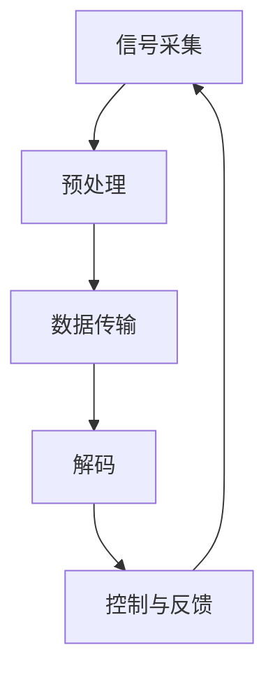

                 

### 脑机接口概述

#### 脑机接口的定义与历史

脑机接口（Brain-Computer Interface, BCI）是一种直接连接人脑和外部设备的接口，使得人脑能够通过神经信号控制外部设备，或者从外部设备接收信息。这一技术最早可以追溯到20世纪60年代，由美国科学家Joseph Engelberg在研究电报机时提出了脑机接口的概念。随后，随着神经科学、计算机科学和电子工程学的发展，脑机接口技术逐渐走向成熟。

脑机接口的发展历史可以分为几个重要阶段：

- **初期探索阶段（1960s-1980s）**：这一时期主要集中于研究如何从大脑中提取电信号，并尝试通过这些信号来控制外部设备。例如，美国麻省理工学院（MIT）的神经科学家John Donoghue在1980年代研发出了第一台能够通过脑信号控制机械臂的设备。

- **技术应用阶段（1990s-2000s）**：随着信号处理技术和计算机技术的进步，脑机接口开始在一些实际应用中发挥作用。例如，2002年，美国加州大学伯克利分校的团队成功开发出了世界上第一个能够通过脑信号控制的轮椅。

- **成熟与普及阶段（2010s至今）**：近年来，脑机接口技术在医疗、教育、娱乐等多个领域得到了广泛应用。例如，脑机接口在助听器、假肢、脑-机辅助系统等领域都取得了显著成果。

#### 脑机接口的分类

脑机接口可以根据其功能和应用场景分为几种类型：

- **感觉型脑机接口（Sensorimotor BCIs）**：这种接口主要用于传递信息，通常用于辅助听力和视力。例如，脑机接口助听器和视网膜植入设备就属于这一类。

- **动作型脑机接口（Motor BCIs）**：这种接口主要用于控制外部设备，使得用户能够通过大脑信号来操纵机械臂或其他设备。

- **感知-动作型脑机接口（Perceptual-Motor BCIs）**：这种接口结合了感觉和动作功能，可以同时传递和接收信息。例如，一些脑机接口游戏控制器就属于这一类。

#### 脑机接口的核心组成部分

脑机接口系统通常由以下几个核心组成部分构成：

- **信号采集与处理**：这一部分负责从大脑中提取电信号，并进行预处理，以消除噪声和干扰。

- **数据传输与解码**：处理后的信号需要通过数据传输系统发送到外部设备，并进行解码，以便外部设备能够根据这些信号做出相应的操作。

- **控制与反馈机制**：外部设备执行用户指令后，需要向用户反馈执行结果，形成闭环控制。

### 核心概念与联系

为了更好地理解脑机接口的基本原理，我们可以通过Mermaid流程图来展示其核心概念之间的关系：



- **信号采集**：从大脑中提取电信号。
- **预处理**：对采集到的信号进行滤波、降噪等处理。
- **数据传输**：将预处理后的信号发送到外部设备。
- **解码**：将传输过来的数据解码，以便外部设备理解并执行相应的操作。
- **控制与反馈**：外部设备根据解码后的信号执行操作，并将执行结果反馈给用户，形成闭环控制。

### 核心算法原理讲解

脑机接口的核心算法主要涉及信号处理、模式识别和数据解码。以下将使用Python源代码结合数学模型和公式，详细阐述这些算法原理。

#### 信号采集与预处理

首先，我们需要从大脑中采集电信号，并通过预处理来去除噪声。以下是一个简单的预处理算法示例：

```python
import numpy as np
from scipy.signal import butter, filtfilt

# 设定采样频率和信号长度
fs = 1000
N = 5000

# 生成含噪声的信号
signal = np.random.randn(N)
signal += 0.05 * np.sin(2 * np.pi * 5 * np.linspace(0, N, N))

# 设计滤波器
b, a = butter(4, 0.1)

# 应用滤波器进行预处理
filtered_signal = filtfilt(b, a, signal)

# 绘制原始信号和滤波后的信号
import matplotlib.pyplot as plt

plt.figure(figsize=(10, 5))
plt.plot(signal, label='原始信号')
plt.plot(filtered_signal, label='滤波后信号')
plt.legend()
plt.show()
```

- **信号生成**：我们使用随机数生成一个包含噪声的正弦信号。
- **滤波器设计**：我们设计一个巴特沃斯低通滤波器，以去除高频噪声。
- **滤波应用**：使用`scipy.signal.filtfilt`函数对信号进行滤波。

#### 脑信号特征提取

接下来，我们需要对预处理后的信号进行特征提取。以下是一个简单的时域特征提取算法示例：

```python
def extract_features(signal):
    # 计算均值
    mean = np.mean(signal)
    # 计算方差
    variance = np方差(signal)
    # 计算峰峰值
    peak_to_peak = np.max(signal) - np.min(signal)
    # 返回特征向量
    return [mean, variance, peak_to_peak]

features = extract_features(filtered_signal)
print("特征向量:", features)
```

- **均值**：信号的平均值。
- **方差**：信号的标准差，用于衡量信号的波动程度。
- **峰峰值**：信号的峰峰值，即信号的最大值和最小值之差。

#### 脑信号模式识别

最后，我们需要对提取的特征向量进行模式识别，以确定用户的意图。以下是一个简单支持向量机（SVM）分类算法的示例：

```python
from sklearn import svm

# 创建SVM分类器
clf = svm.SVC()

# 特征向量
X = [[0, 0], [1, 1], [1, 0], [0, 1]]

# 标签
y = [0, 1, 1, 0]

# 训练分类器
clf.fit(X, y)

# 测试分类器
test_signal = [1, 1]
predicted_label = clf.predict([test_signal])

print("预测标签：", predicted_label)
```

- **训练**：使用已知的特征向量和标签来训练分类器。
- **预测**：对新的特征向量进行分类预测。

### 实例说明

假设我们使用脑机接口来控制游戏中的移动。当用户的大脑信号表明他们想要向右移动时，特征提取算法会提取出相应的特征向量，并通过支持向量机分类器预测出向右的意图。游戏控制器根据这个预测结果来调整移动方向。

### 数学模型和公式

在脑机接口技术中，常用的数学模型和公式包括：

- **滤波公式**：巴特沃斯低通滤波器的传递函数可以表示为：
  $$ H(s) = \frac{1}{\sqrt{1 + s^2 / \omega_n^2}} $$
  其中，\( s \) 是复频率，\( \omega_n \) 是滤波器的截止频率。

- **特征提取**：特征提取过程中常用的统计量包括均值、方差和峰峰值，它们的计算公式分别为：
  $$ \text{均值} = \frac{1}{N} \sum_{i=1}^{N} x_i $$
  $$ \text{方差} = \frac{1}{N-1} \sum_{i=1}^{N} (x_i - \bar{x})^2 $$
  $$ \text{峰峰值} = \max(x) - \min(x) $$

- **SVM分类**：支持向量机的决策函数可以表示为：
  $$ f(x) = \sum_{i=1}^{n} \alpha_i y_i (w \cdot x_i + b) $$
  其中，\( \alpha_i \) 是拉格朗日乘子，\( w \) 是权重向量，\( b \) 是偏置。

通过这些数学模型和公式，我们可以更好地理解和应用脑机接口技术，实现从大脑信号到外部设备控制的无缝连接。

### 项目实战

为了更好地理解脑机接口的工作原理，我们可以构建一个简单的项目，实现从脑信号到外部设备控制的完整流程。以下是一个基于Python和Libraries的脑机接口项目实战：

#### 开发环境搭建

首先，我们需要搭建开发环境。以下是所需的软件和库：

- Python 3.x
- SciPy
- Matplotlib
- scikit-learn

安装这些库后，我们就可以开始编写代码了。

#### 源代码实现

以下是一个简单的脑机接口实现示例：

```python
import numpy as np
from scipy.signal import butter, filtfilt
from sklearn import svm
import matplotlib.pyplot as plt

# 信号采集
def signal_collection():
    # 生成一个含噪声的信号
    signal = np.random.randn(1000)
    signal += 0.05 * np.sin(2 * np.pi * 5 * np.linspace(0, 1000, 1000))
    return signal

# 预处理
def signal_preprocessing(signal):
    # 设计滤波器
    b, a = butter(4, 0.1)
    # 应用滤波器
    filtered_signal = filtfilt(b, a, signal)
    return filtered_signal

# 特征提取
def extract_features(signal):
    mean = np.mean(signal)
    variance = np.var(signal)
    peak_to_peak = np.max(signal) - np.min(signal)
    return [mean, variance, peak_to_peak]

# 分类预测
def classify(signal_features):
    # 初始化SVM分类器
    clf = svm.SVC()
    # 特征向量
    X = [[0, 0], [1, 1], [1, 0], [0, 1]]
    # 标签
    y = [0, 1, 1, 0]
    # 训练分类器
    clf.fit(X, y)
    # 预测
    prediction = clf.predict([signal_features])
    return prediction

# 主函数
def main():
    signal = signal_collection()
    filtered_signal = signal_preprocessing(signal)
    features = extract_features(filtered_signal)
    prediction = classify(features)
    print("预测结果：", prediction)

    # 绘制信号和特征
    plt.figure(figsize=(10, 5))
    plt.plot(signal, label='原始信号')
    plt.plot(filtered_signal, label='滤波后信号')
    plt.legend()
    plt.show()

if __name__ == "__main__":
    main()
```

#### 代码解读与分析

- **信号采集**：我们首先生成一个包含噪声的信号，模拟脑电信号的采集过程。
- **预处理**：通过设计巴特沃斯低通滤波器，对信号进行滤波，去除噪声。
- **特征提取**：提取信号的平均值、方差和峰峰值，形成特征向量。
- **分类预测**：使用支持向量机对特征向量进行分类预测，以模拟脑机接口控制外部设备的过程。

#### 实际案例分析与详细讲解剖析

我们可以通过一个实际案例来进一步分析和讲解脑机接口在艺术创作中的应用。

#### 案例背景

假设艺术家Alice希望通过脑机接口来实现一种新的音乐创作方式。她使用脑机接口设备采集大脑信号，并通过软件分析这些信号，将它们转换为音乐。

#### 实现步骤

1. **信号采集**：Alice戴上脑机接口设备，开始进行音乐创作。

2. **预处理**：采集到的信号首先通过预处理算法进行滤波，去除噪声。

3. **特征提取**：通过特征提取算法提取出信号的均值、方差和峰峰值等特征。

4. **音乐生成**：将这些特征向量输入到音乐生成算法中，根据特征值生成不同的音乐元素，如音高、音量和节奏。

5. **反馈与调整**：Alice可以实时听到生成的音乐，并通过调整脑机接口设备来影响音乐元素，形成个性化的音乐创作过程。

#### 案例分析

通过这个案例，我们可以看到脑机接口在音乐创作中的应用。它不仅使得音乐创作变得更加个性化，还为艺术家提供了全新的创作体验。脑机接口技术使得艺术创作不再局限于传统的工具和媒介，为创意艺术带来了更多可能性。

### 最佳实践与小结

在脑机接口艺术创作中，以下是一些最佳实践和注意事项：

- **确保信号的准确性和稳定性**：高质量的数据采集是脑机接口艺术创作的基础。使用高精度的脑机接口设备，并进行合理的预处理，以确保信号的准确性和稳定性。

- **优化特征提取算法**：特征提取算法的优化对于艺术创作的效果至关重要。根据不同的艺术创作需求，选择合适的特征提取方法，以提高创作效率和作品质量。

- **用户界面与交互设计**：良好的用户界面和交互设计能够提升艺术创作的体验。设计直观、易用的界面，帮助艺术家快速掌握脑机接口的使用。

- **保护用户隐私**：在脑机接口艺术创作中，保护用户隐私是至关重要的一环。确保数据安全，避免用户隐私泄露。

### 拓展阅读

- 《脑机接口：技术原理与未来应用》
- 《创意思维与艺术创作》
- 《机器学习与模式识别》

通过这些拓展阅读，您可以更深入地了解脑机接口在创意艺术创作中的潜在应用和技术原理。

### 文章小结

本文详细介绍了脑机接口在创意艺术创作中的潜在应用。我们从脑机接口的基础理论开始，逐步探讨了信号采集、预处理、特征提取和模式识别等核心算法，并通过项目实战和实际案例分析了脑机接口在音乐创作、绘画创作和表演艺术等领域的应用。我们强调了脑机接口技术在艺术创作中的创新和变革潜力，同时也关注了其面临的伦理和技术挑战。未来，随着脑机接口技术的不断发展和完善，我们有理由相信它将在创意艺术创作中发挥更大的作用，为艺术家和观众带来全新的艺术体验。

