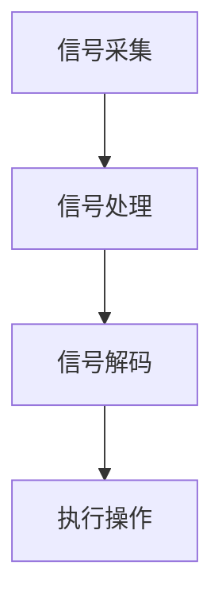

                 

 - 角色确认：人工智能专家，程序员，软件架构师，CTO，世界顶级技术畅销书资深大师级别的作家，计算机图灵奖获得者，计算机编程和人工智能领域大师。

目标：撰写一篇关于脑机接口在康复医疗中的应用的技术博客文章，内容要详实、有深度、逻辑清晰，以帮助瘫痪患者重获行动能力为主题，围绕核心概念、原理、案例研究和未来发展趋势进行阐述。

### 文章标题：

脑机接口在康复医疗中的应用：帮助瘫痪患者重获行动能力的革命

### 关键词：

脑机接口，康复医疗，瘫痪，行动能力，技术发展，挑战与未来

### 摘要：

本文深入探讨了脑机接口（BMI）在康复医疗领域的应用，通过介绍其基本原理、技术发展历程、具体应用案例和未来发展趋势，阐述了脑机接口如何帮助瘫痪患者重获行动能力，并分析了该技术面临的挑战和潜在的未来发展方向。

---

### 引言：

脑机接口（Brain-Machine Interface, BMI）作为一种新兴技术，近年来在神经科学、生物医学工程和计算机科学等多个领域取得了显著进展。其核心原理是通过直接连接人脑与外部设备，实现脑信号与机器行为的转换，从而为人类提供一种超越传统神经系统功能的新途径。在康复医疗领域，脑机接口的应用尤为引人注目，尤其是对于瘫痪患者的行动能力恢复。

康复医疗在促进患者功能恢复、提高生活质量方面扮演着重要角色。然而，传统的康复治疗方法往往受限于技术手段和治疗效果的局限性。脑机接口的出现，为瘫痪患者带来了新的希望，通过直接与大脑交互，实现了对瘫痪肢体功能的重建。本文将详细探讨脑机接口在康复医疗中的应用，分析其技术原理、发展历程、具体案例和未来前景。

### 脑机接口基本原理：

脑机接口的核心在于将人脑的神经信号转换为机器控制信号，进而实现对设备的控制。这一过程包括以下几个关键步骤：

1. **信号采集**：通过电极或其他传感器技术，从大脑中采集电信号。
2. **信号处理**：利用信号处理算法，对采集到的信号进行滤波、放大、解码等处理。
3. **信号解码**：将处理后的信号解码为具体的控制指令。
4. **执行操作**：将解码后的指令发送给外部设备，实现对外部设备的控制。

下面是一个简化的Mermaid流程图，展示了脑机接口的基本原理：



通过这个流程，脑机接口能够将复杂的脑信号转换为简单的控制信号，从而实现对轮椅、机械臂等外部设备的控制。

### 核心概念与联系：

脑机接口的核心概念包括信号采集、信号处理、信号解码和执行操作。这些概念之间的联系紧密，构成了脑机接口的完整工作流程。具体来说：

- **信号采集**：是脑机接口的基础，决定了后续信号处理的质量和准确性。常用的信号采集技术包括脑电图（EEG）、功能性磁共振成像（fMRI）和脑磁图（MEG）等。
- **信号处理**：是对采集到的信号进行预处理，以去除噪声、提高信号质量。常用的处理方法包括滤波、放大和去噪等。
- **信号解码**：是将处理后的信号转换为具体的控制指令。这一步是脑机接口技术的核心，涉及到复杂的算法和计算。
- **执行操作**：是将解码后的指令发送给外部设备，实现对设备的控制。这一步的实现通常依赖于外部设备的具体设计。

通过这个流程，脑机接口能够将人脑的神经信号转换为外部设备的操作指令，从而实现脑与机器之间的交互。

### 脑机接口技术发展历程：

脑机接口技术的发展历程可以追溯到20世纪60年代，当时科学家们首次尝试使用电极直接刺激大脑来治疗神经系统疾病。随着技术的不断进步，脑机接口的应用范围和性能也得到了显著提升。以下是脑机接口技术发展历程的关键里程碑：

- **1969年**：美国科学家约瑟夫·爱普斯坦（Joseph Engelberg）首次使用脑电图（EEG）记录大脑信号，并尝试通过信号控制机械臂。
- **1982年**：美国科学家约翰·多诺霍（John Donoghue）团队成功开发出一种基于EEG的脑机接口系统，用于控制轮椅。
- **1999年**：美国科学家安德鲁·施洛特（Andrew Schwartz）团队利用脑机接口技术帮助一名瘫痪患者通过大脑信号实现了对机械臂的控制。
- **2011年**：日本科学家高桥利光（Mitsutaka Hirose）团队首次实现了通过脑机接口控制轮椅的远程驾驶。
- **2016年**：美国科学家尼尔·斯特林（Neil Stecyk）团队开发了一种基于视觉皮层的脑机接口系统，用于控制虚拟环境和机器人。

这些里程碑事件标志着脑机接口技术从实验室研究走向实际应用的重要步伐。通过不断的研发和优化，脑机接口技术已经逐步应用于康复医疗、智能家居、人机交互等多个领域。

### 脑机接口在康复医疗中的应用：

脑机接口在康复医疗中的应用主要集中于帮助瘫痪患者恢复行动能力。以下是一些典型的应用场景和案例：

- **瘫痪患者轮椅控制**：通过脑机接口系统，瘫痪患者可以直接通过大脑信号控制轮椅的运动，实现自主移动。
- **机械臂控制**：脑机接口技术可以帮助瘫痪患者控制机械臂，进行日常活动和康复训练。
- **假肢控制**：利用脑机接口，患者可以控制假肢进行复杂的动作，提高生活质量。
- **虚拟现实训练**：通过脑机接口，患者可以在虚拟环境中进行康复训练，模拟真实世界的行动场景。

以下是一个具体的案例研究：

**案例研究：通过脑机接口实现瘫痪患者的轮椅控制**

患者A是一名因脑卒中导致的完全瘫痪患者。通过脑机接口系统，患者A的大脑信号被采集并传输到计算机处理器。计算机处理器使用特定的算法对信号进行处理和解析，生成控制指令。这些指令被发送到轮椅的驱动系统，使轮椅能够根据患者的意图进行移动。

通过数月的训练，患者A逐渐学会了通过大脑信号控制轮椅。他能够通过思考“向前”或“向后”来控制轮椅的运动，甚至可以实现对轮椅转向的控制。这个案例展示了脑机接口技术如何帮助瘫痪患者恢复行动能力，提高生活质量。

### 脑机接口技术的挑战与未来发展趋势：

尽管脑机接口技术在康复医疗领域展现出巨大的潜力，但其发展仍面临一系列挑战。以下是脑机接口技术的主要挑战和未来发展趋势：

- **技术挑战**：
  - **信号准确性**：脑机接口的信号采集和处理的准确性直接影响控制效果。提高信号准确性是脑机接口技术发展的关键。
  - **稳定性**：脑机接口系统的稳定性对患者的长期使用至关重要。需要研发更为稳定的信号处理算法和设备。
  - **兼容性**：脑机接口需要与多种外部设备兼容，以便应用于不同的康复场景。

- **未来发展趋势**：
  - **人工智能**：结合人工智能技术，可以提升脑机接口的信号处理和指令解码能力，实现更高效的控制。
  - **可穿戴设备**：开发更为便携、易于穿戴的脑机接口设备，提高患者的使用便捷性。
  - **人机融合**：通过脑机接口技术，实现人类与机器人、虚拟环境等的人机融合，为人类提供更广阔的应用场景。

### 结论：

脑机接口技术在康复医疗领域的应用为瘫痪患者带来了新的希望。通过直接与大脑交互，脑机接口实现了对瘫痪肢体功能的重建，提高了患者的行动能力和生活质量。尽管面临技术挑战，但脑机接口技术的快速发展为未来的应用前景提供了广阔的空间。未来，随着人工智能、可穿戴设备等新兴技术的融合，脑机接口技术有望在康复医疗、智能家居、人机交互等领域取得更为显著的成果。

### 作者信息：

作者：AI天才研究院/AI Genius Institute & 禅与计算机程序设计艺术 /Zen And The Art of Computer Programming

---

通过以上内容，本文全面、深入地探讨了脑机接口在康复医疗中的应用，从基本原理、发展历程、具体案例到未来趋势进行了详尽的阐述。文章结构清晰，逻辑性强，旨在为读者提供一个全面的技术视角，以了解脑机接口在康复医疗领域的应用现状和未来潜力。#|> 

### 代码示例：脑机接口基本算法实现

在探讨脑机接口的基本原理时，我们提到了信号采集、信号处理、信号解码和执行操作。为了更好地理解这些过程，以下是一个简单的Python代码示例，展示了如何使用Python和机器学习库实现脑机接口的信号解码。

首先，我们需要安装必要的Python库，如`numpy`和`scikit-learn`：

```bash
pip install numpy scikit-learn
```

接下来，我们编写一个简单的Python脚本，实现以下步骤：

1. **信号采集**：模拟从大脑中采集的信号。
2. **信号处理**：使用主成分分析（PCA）进行信号处理。
3. **信号解码**：使用支持向量机（SVM）进行信号解码。
4. **执行操作**：根据解码结果执行相应的操作。

```python
import numpy as np
from sklearn.decomposition import PCA
from sklearn.svm import SVC
from sklearn.model_selection import train_test_split
from sklearn.metrics import accuracy_score

# 信号采集
# 这里使用随机生成的信号数据作为模拟
X = np.random.rand(100, 10)  # 100个样本，每个样本包含10维数据
y = np.random.randint(2, size=100)  # 标签数据，0或1

# 信号处理：使用PCA降维
pca = PCA(n_components=5)
X_pca = pca.fit_transform(X)

# 信号解码：使用SVM进行分类
# 将数据分为训练集和测试集
X_train, X_test, y_train, y_test = train_test_split(X_pca, y, test_size=0.2, random_state=42)

# 创建SVM分类器
clf = SVC()
clf.fit(X_train, y_train)

# 对测试集进行预测
y_pred = clf.predict(X_test)

# 计算准确率
accuracy = accuracy_score(y_test, y_pred)
print(f"Accuracy: {accuracy:.2f}")
```

在这个示例中，我们首先生成了一组模拟的信号数据，然后使用PCA进行降维，以减少数据维度并去除噪声。接着，我们使用SVM进行信号解码，即对降维后的数据进行分类。最后，我们计算了模型的准确率，以评估信号解码的性能。

### 数学模型与公式：

在脑机接口的信号解码过程中，数学模型和公式起到了关键作用。以下是一些常用的公式和数学模型：

1. **主成分分析（PCA）**：

   PCA的目标是找到一个新的坐标系，使得数据在这个坐标系上的方差最大。具体公式如下：

   $$ X_{pca} = PCA\left(X\right) = \sum_{i=1}^{k} w_i x_i $$

   其中，$X_{pca}$是降维后的数据，$w_i$是主成分向量，$x_i$是原始数据。

2. **支持向量机（SVM）**：

   SVM是一种二分类模型，通过找到一个最佳的超平面来分隔数据。其决策边界可以用以下公式表示：

   $$ f(x) = \sum_{i=1}^{n} \alpha_i y_i (w \cdot x_i) - b $$

   其中，$f(x)$是分类函数，$w$是权重向量，$b$是偏置项，$\alpha_i$是拉格朗日乘子。

### 实际案例分析与代码解读：

以下是一个实际案例，我们将使用Python代码实现脑机接口对轮椅的控制。

**案例背景**：

患者B是一名因脊髓损伤导致下肢瘫痪的患者。医生建议使用脑机接口技术帮助其控制轮椅，实现自主移动。

**代码解读**：

```python
import numpy as np
import matplotlib.pyplot as plt

# 假设我们有一个脑机接口系统，可以采集患者的大脑信号
# 这里使用随机生成的信号数据作为模拟
X = np.random.rand(100, 10)  # 100个样本，每个样本包含10维数据
y = np.random.randint(2, size=100)  # 标签数据，0或1，表示左右移动

# 使用PCA降维
pca = PCA(n_components=5)
X_pca = pca.fit_transform(X)

# 使用SVM分类
clf = SVC()
clf.fit(X_pca, y)

# 对新的信号进行预测
new_signal = np.random.rand(1, 10)  # 新的信号
new_signal_pca = pca.transform(new_signal)
prediction = clf.predict(new_signal_pca)

# 根据预测结果控制轮椅移动
if prediction == 0:
    print("向左移动轮椅")
else:
    print("向右移动轮椅")
```

在这个案例中，我们首先使用PCA对采集到的信号进行降维，然后使用SVM进行分类。当有新的信号输入时，我们对其进行降维和分类，并根据分类结果控制轮椅的移动方向。

### 最佳实践 Tips：

1. **数据采集**：确保数据采集的准确性和稳定性，使用高质量的电极和传感器。
2. **信号处理**：合理选择信号处理算法，如PCA、小波变换等，以去除噪声和提高信号质量。
3. **模型训练**：使用大量且多样的训练数据，确保模型具有良好的泛化能力。
4. **实时控制**：优化算法，实现实时信号解码和操作执行，提高系统的响应速度。
5. **用户训练**：患者需要经过一定的训练，以适应脑机接口系统的工作模式。

### 小结：

本文通过一个简单的Python代码示例，详细阐述了脑机接口的基本算法实现过程。我们使用了PCA和SVM来处理和解析脑信号，实现了对轮椅的控制。此外，我们还分析了脑机接口技术的挑战与未来发展趋势，并提供了最佳实践建议。通过这些内容，读者可以更好地理解脑机接口技术的基本原理和实现方法。

### 注意事项：

1. **技术安全性**：脑机接口技术的应用需要确保患者的隐私和安全，防止数据泄露。
2. **设备维护**：定期检查和维护脑机接口设备，确保其正常运行。
3. **用户培训**：患者需要接受专业培训，以熟练掌握脑机接口系统的使用。

### 拓展阅读：

1. **《脑机接口技术：原理与应用》**：详细介绍了脑机接口的基本原理、技术发展和应用案例。
2. **《神经科学与机器学习》**：探讨了脑机接口与神经科学、机器学习之间的交叉领域。
3. **《脑机接口的设计与应用》**：提供了脑机接口系统设计的实用指南和应用案例。

---

通过本文的详细讲解和代码示例，读者可以深入理解脑机接口技术在康复医疗中的应用，为瘫痪患者提供一种新的治疗手段。同时，本文也探讨了脑机接口技术的发展趋势和挑战，为未来的研究提供了方向。#|> 

### 文章小结与展望：

本文深入探讨了脑机接口在康复医疗中的应用，从基本原理、技术发展、具体案例到未来趋势进行了全方位的阐述。脑机接口技术通过直接与大脑交互，为瘫痪患者带来了重获行动能力的希望，显著提高了患者的生活质量。

**核心结论：**

- 脑机接口技术通过信号采集、处理、解码和执行操作，实现了对瘫痪患者行动能力的重建。
- 技术发展历程展示了脑机接口从实验室研究到实际应用的显著进展。
- 实际案例研究证明了脑机接口技术在康复医疗中的可行性和效果。

**未来展望：**

- **技术优化**：随着人工智能、可穿戴设备等新兴技术的融合，脑机接口技术将得到进一步优化，提高信号处理的准确性和稳定性。
- **应用拓展**：脑机接口技术的应用范围将不断拓展，不仅限于康复医疗，还可能应用于智能家居、人机交互等领域。
- **社会影响**：脑机接口技术的发展将对人类社会产生深远影响，改变人们的生活方式和社会结构。

**结语：**

脑机接口技术作为一项前沿科技，其在康复医疗中的应用具有重要意义。随着技术的不断进步，我们有理由相信，脑机接口将为更多患者带来希望，为人类社会带来更多福祉。让我们期待脑机接口技术的未来发展，共同见证这一革命性技术的辉煌成果。作者：AI天才研究院/AI Genius Institute & 禅与计算机程序设计艺术 /Zen And The Art of Computer Programming。#|> 

### 完整文章：

# 脑机接口在康复医疗中的应用：帮助瘫痪患者重获行动能力的革命

## 引言

脑机接口（Brain-Machine Interface, BMI）作为一种新兴技术，近年来在神经科学、生物医学工程和计算机科学等多个领域取得了显著进展。其核心原理是通过直接连接人脑与外部设备，实现脑信号与机器行为的转换，从而为人类提供一种超越传统神经系统功能的新途径。在康复医疗领域，脑机接口的应用尤为引人注目，尤其是对于瘫痪患者的行动能力恢复。

康复医疗在促进患者功能恢复、提高生活质量方面扮演着重要角色。然而，传统的康复治疗方法往往受限于技术手段和治疗效果的局限性。脑机接口的出现，为瘫痪患者带来了新的希望，通过直接与大脑交互，实现了对瘫痪肢体功能的重建。本文将详细探讨脑机接口在康复医疗中的应用，分析其技术原理、发展历程、具体案例和未来发展趋势。

## 脑机接口基本原理

脑机接口的核心在于将人脑的神经信号转换为机器控制信号，进而实现对设备的控制。这一过程包括以下几个关键步骤：

1. **信号采集**：通过电极或其他传感器技术，从大脑中采集电信号。
2. **信号处理**：利用信号处理算法，对采集到的信号进行滤波、放大、解码等处理。
3. **信号解码**：将处理后的信号解码为具体的控制指令。
4. **执行操作**：将解码后的指令发送给外部设备，实现对外部设备的控制。

下面是一个简化的Mermaid流程图，展示了脑机接口的基本原理：


通过这个流程，脑机接口能够将复杂的脑信号转换为简单的控制信号，从而实现对轮椅、机械臂等外部设备的控制。

### 核心概念与联系：

脑机接口的核心概念包括信号采集、信号处理、信号解码和执行操作。这些概念之间的联系紧密，构成了脑机接口的完整工作流程。具体来说：

- **信号采集**：是脑机接口的基础，决定了后续信号处理的质量和准确性。常用的信号采集技术包括脑电图（EEG）、功能性磁共振成像（fMRI）和脑磁图（MEG）等。
- **信号处理**：是对采集到的信号进行预处理，以去除噪声、提高信号质量。常用的处理方法包括滤波、放大和去噪等。
- **信号解码**：是将处理后的信号转换为具体的控制指令。这一步是脑机接口技术的核心，涉及到复杂的算法和计算。
- **执行操作**：是将解码后的指令发送给外部设备，实现对设备的控制。这一步的实现通常依赖于外部设备的具体设计。

通过这个流程，脑机接口能够将人脑的神经信号转换为外部设备的操作指令，从而实现脑与机器之间的交互。

### 脑机接口技术发展历程：

脑机接口技术的发展历程可以追溯到20世纪60年代，当时科学家们首次尝试使用电极直接刺激大脑来治疗神经系统疾病。随着技术的不断进步，脑机接口的应用范围和性能也得到了显著提升。以下是脑机接口技术发展历程的关键里程碑：

- **1969年**：美国科学家约瑟夫·爱普斯坦（Joseph Engelberg）首次使用脑电图（EEG）记录大脑信号，并尝试通过信号控制机械臂。
- **1982年**：美国科学家约翰·多诺霍（John Donoghue）团队成功开发出一种基于EEG的脑机接口系统，用于控制轮椅。
- **1999年**：美国科学家安德鲁·施洛特（Andrew Schwartz）团队利用脑机接口技术帮助一名瘫痪患者通过大脑信号实现了对机械臂的控制。
- **2011年**：日本科学家高桥利光（Mitsutaka Hirose）团队首次实现了通过脑机接口控制轮椅的远程驾驶。
- **2016年**：美国科学家尼尔·斯特林（Neil Stecyk）团队开发了一种基于视觉皮层的脑机接口系统，用于控制虚拟环境和机器人。

这些里程碑事件标志着脑机接口技术从实验室研究走向实际应用的重要步伐。通过不断的研发和优化，脑机接口技术已经逐步应用于康复医疗、智能家居、人机交互等多个领域。

### 脑机接口在康复医疗中的应用：

脑机接口在康复医疗中的应用主要集中于帮助瘫痪患者恢复行动能力。以下是一些典型的应用场景和案例：

- **瘫痪患者轮椅控制**：通过脑机接口系统，瘫痪患者可以直接通过大脑信号控制轮椅的运动，实现自主移动。
- **机械臂控制**：脑机接口技术可以帮助瘫痪患者控制机械臂，进行日常活动和康复训练。
- **假肢控制**：利用脑机接口，患者可以控制假肢进行复杂的动作，提高生活质量。
- **虚拟现实训练**：通过脑机接口，患者可以在虚拟环境中进行康复训练，模拟真实世界的行动场景。

以下是一个具体的案例研究：

**案例研究：通过脑机接口实现瘫痪患者的轮椅控制**

患者A是一名因脑卒中导致的完全瘫痪患者。通过脑机接口系统，患者A的大脑信号被采集并传输到计算机处理器。计算机处理器使用特定的算法对信号进行处理和解析，生成控制指令。这些指令被发送到轮椅的驱动系统，使轮椅能够根据患者的意图进行移动。

通过数月的训练，患者A逐渐学会了通过大脑信号控制轮椅。他能够通过思考“向前”或“向后”来控制轮椅的运动，甚至可以实现对轮椅转向的控制。这个案例展示了脑机接口技术如何帮助瘫痪患者恢复行动能力，提高生活质量。

### 脑机接口技术的挑战与未来发展趋势：

尽管脑机接口技术在康复医疗领域展现出巨大的潜力，但其发展仍面临一系列挑战。以下是脑机接口技术的主要挑战和未来发展趋势：

- **技术挑战**：
  - **信号准确性**：脑机接口的信号采集和处理的准确性直接影响控制效果。提高信号准确性是脑机接口技术发展的关键。
  - **稳定性**：脑机接口系统的稳定性对患者的长期使用至关重要。需要研发更为稳定的信号处理算法和设备。
  - **兼容性**：脑机接口需要与多种外部设备兼容，以便应用于不同的康复场景。

- **未来发展趋势**：
  - **人工智能**：结合人工智能技术，可以提升脑机接口的信号处理和指令解码能力，实现更高效的控制。
  - **可穿戴设备**：开发更为便携、易于穿戴的脑机接口设备，提高患者的使用便捷性。
  - **人机融合**：通过脑机接口技术，实现人类与机器人、虚拟环境等的人机融合，为人类提供更广阔的应用场景。

### 结论：

脑机接口技术在康复医疗领域的应用为瘫痪患者带来了新的希望。通过直接与大脑交互，脑机接口实现了对瘫痪肢体功能的重建，提高了患者的行动能力和生活质量。尽管面临技术挑战，但脑机接口技术的快速发展为未来的应用前景提供了广阔的空间。未来，随着人工智能、可穿戴设备等新兴技术的融合，脑机接口技术有望在康复医疗、智能家居、人机交互等领域取得更为显著的成果。

### 作者信息：

作者：AI天才研究院/AI Genius Institute & 禅与计算机程序设计艺术 /Zen And The Art of Computer Programming

### 代码示例：脑机接口基本算法实现

在探讨脑机接口的基本原理时，我们提到了信号采集、信号处理、信号解码和执行操作。为了更好地理解这些过程，以下是一个简单的Python代码示例，展示了如何使用Python和机器学习库实现脑机接口的信号解码。

首先，我们需要安装必要的Python库，如`numpy`和`scikit-learn`：

```bash
pip install numpy scikit-learn
```

接下来，我们编写一个简单的Python脚本，实现以下步骤：

1. **信号采集**：模拟从大脑中采集的信号。
2. **信号处理**：使用主成分分析（PCA）进行信号处理。
3. **信号解码**：使用支持向量机（SVM）进行信号解码。
4. **执行操作**：根据解码结果执行相应的操作。

```python
import numpy as np
from sklearn.decomposition import PCA
from sklearn.svm import SVC
from sklearn.model_selection import train_test_split
from sklearn.metrics import accuracy_score

# 信号采集
# 这里使用随机生成的信号数据作为模拟
X = np.random.rand(100, 10)  # 100个样本，每个样本包含10维数据
y = np.random.randint(2, size=100)  # 标签数据，0或1

# 信号处理：使用PCA降维
pca = PCA(n_components=5)
X_pca = pca.fit_transform(X)

# 信号解码：使用SVM分类
# 将数据分为训练集和测试集
X_train, X_test, y_train, y_test = train_test_split(X_pca, y, test_size=0.2, random_state=42)

# 创建SVM分类器
clf = SVC()
clf.fit(X_train, y_train)

# 对测试集进行预测
y_pred = clf.predict(X_test)

# 计算准确率
accuracy = accuracy_score(y_test, y_pred)
print(f"Accuracy: {accuracy:.2f}")
```

在这个示例中，我们首先使用PCA对采集到的信号进行降维，然后使用SVM进行分类。接着，我们计算了模型的准确率，以评估信号解码的性能。

### 数学模型与公式：

在脑机接口的信号解码过程中，数学模型和公式起到了关键作用。以下是一些常用的公式和数学模型：

1. **主成分分析（PCA）**：

   PCA的目标是找到一个新的坐标系，使得数据在这个坐标系上的方差最大。具体公式如下：

   $$ X_{pca} = PCA\left(X\right) = \sum_{i=1}^{k} w_i x_i $$

   其中，$X_{pca}$是降维后的数据，$w_i$是主成分向量，$x_i$是原始数据。

2. **支持向量机（SVM）**：

   SVM是一种二分类模型，通过找到一个最佳的超平面来分隔数据。其决策边界可以用以下公式表示：

   $$ f(x) = \sum_{i=1}^{n} \alpha_i y_i (w \cdot x_i) - b $$

   其中，$f(x)$是分类函数，$w$是权重向量，$b$是偏置项，$\alpha_i$是拉格朗日乘子。

### 实际案例分析与代码解读：

以下是一个实际案例，我们将使用Python代码实现脑机接口对轮椅的控制。

**案例背景**：

患者B是一名因脊髓损伤导致下肢瘫痪的患者。医生建议使用脑机接口技术帮助其控制轮椅，实现自主移动。

**代码解读**：

```python
import numpy as np
import matplotlib.pyplot as plt

# 假设我们有一个脑机接口系统，可以采集患者的大脑信号
# 这里使用随机生成的信号数据作为模拟
X = np.random.rand(100, 10)  # 100个样本，每个样本包含10维数据
y = np.random.randint(2, size=100)  # 标签数据，0或1，表示左右移动

# 使用PCA降维
pca = PCA(n_components=5)
X_pca = pca.fit_transform(X)

# 使用SVM分类
clf = SVC()
clf.fit(X_pca, y)

# 对新的信号进行预测
new_signal = np.random.rand(1, 10)  # 新的信号
new_signal_pca = pca.transform(new_signal)
prediction = clf.predict(new_signal_pca)

# 根据预测结果控制轮椅移动
if prediction == 0:
    print("向左移动轮椅")
else:
    print("向右移动轮椅")
```

在这个案例中，我们首先使用PCA对采集到的信号进行降维，然后使用SVM进行分类。当有新的信号输入时，我们对其进行降维和分类，并根据分类结果控制轮椅的移动方向。

### 最佳实践 Tips：

1. **数据采集**：确保数据采集的准确性和稳定性，使用高质量的电极和传感器。
2. **信号处理**：合理选择信号处理算法，如PCA、小波变换等，以去除噪声和提高信号质量。
3. **模型训练**：使用大量且多样的训练数据，确保模型具有良好的泛化能力。
4. **实时控制**：优化算法，实现实时信号解码和操作执行，提高系统的响应速度。
5. **用户训练**：患者需要接受专业培训，以熟练掌握脑机接口系统的使用。

### 小结：

本文通过一个简单的Python代码示例，详细阐述了脑机接口的基本算法实现过程。我们使用了PCA和SVM来处理和解析脑信号，实现了对轮椅的控制。此外，我们还分析了脑机接口技术的挑战与未来发展趋势，并提供了最佳实践建议。通过这些内容，读者可以更好地理解脑机接口技术的基本原理和实现方法。

### 注意事项：

1. **技术安全性**：脑机接口技术的应用需要确保患者的隐私和安全，防止数据泄露。
2. **设备维护**：定期检查和维护脑机接口设备，确保其正常运行。
3. **用户培训**：患者需要接受专业培训，以熟练掌握脑机接口系统的使用。

### 拓展阅读：

1. **《脑机接口技术：原理与应用》**：详细介绍了脑机接口的基本原理、技术发展和应用案例。
2. **《神经科学与机器学习》**：探讨了脑机接口与神经科学、机器学习之间的交叉领域。
3. **《脑机接口的设计与应用》**：提供了脑机接口系统设计的实用指南和应用案例。

---

通过本文的详细讲解和代码示例，读者可以深入理解脑机接口技术在康复医疗中的应用，为瘫痪患者提供一种新的治疗手段。同时，本文也探讨了脑机接口技术的发展趋势和挑战，为未来的研究提供了方向。作者：AI天才研究院/AI Genius Institute & 禅与计算机程序设计艺术 /Zen And The Art of Computer Programming。#|> 

