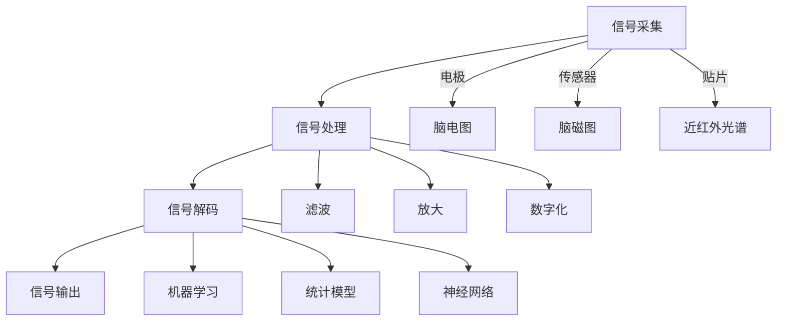
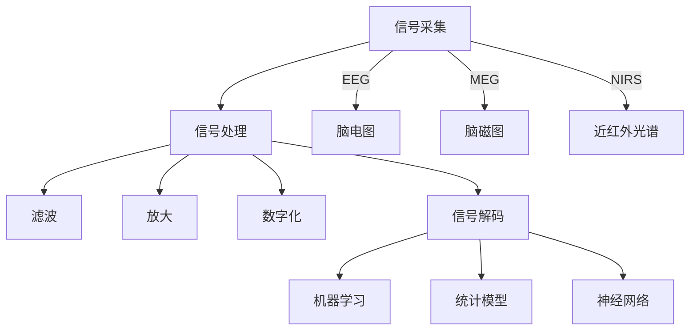

                 

文章标题：脑机接口：思维与技术融合的意义挑战

## 关键词

脑机接口，思维控制，技术融合，神经信号采集，信号处理，神经接口技术，应用场景，伦理挑战，未来发展

## 摘要

本文探讨了脑机接口（BCI）这一前沿技术的概念、发展历程、核心原理及其在不同领域的应用。脑机接口通过采集大脑信号，实现人类思维与外部设备的直接交互。文章首先介绍了BCI的基本原理和技术架构，随后详细分析了其在医疗、娱乐、教育和辅助通信等领域的应用。此外，文章还讨论了脑机接口面临的伦理和安全问题，并对其未来发展进行了展望。通过一系列案例分析和技术详解，本文揭示了脑机接口技术的潜力与挑战，为读者提供了深入理解这一领域的重要视角。

------------------------------------------------------------------------

# 脑机接口：思维与技术融合的意义挑战

脑机接口（Brain-Computer Interface，BCI）是一种直接连接大脑和外部设备的技术，允许人类通过思维控制计算机、机器人、虚拟现实设备等。随着科技的进步，BCI技术正逐渐从实验室走向实际应用，为人类生活带来革命性的变化。本文将系统地探讨脑机接口的定义、发展历史、核心技术、应用场景、面临的挑战及其未来发展方向。

## 目录

## 第一部分：脑机接口基础

### 第1章：脑机接口概述

### 1.1 脑机接口的概念  
### 1.2 脑机接口的历史与发展  
### 1.3 脑机接口的基本原理

### 第2章：脑机接口技术

### 2.1 信号采集技术  
### 2.2 信号处理技术  
### 2.3 信号解码技术  
### 2.4 神经接口技术

### 第3章：脑机接口的应用

### 3.1 医疗应用  
### 3.2 娱乐应用  
### 3.3 辅助通信  
### 3.4 教育应用

### 第4章：脑机接口面临的挑战

### 4.1 安全与伦理问题  
### 4.2 技术发展难题  
### 4.3 用户隐私问题

### 第5章：脑机接口的未来展望

### 5.1 技术发展趋势  
### 5.2 社会影响与伦理  
### 5.3 未来应用场景

## 第二部分：脑机接口案例分析

### 第6章：案例一：医疗领域的应用

### 6.1 病例研究  
### 6.2 技术实现  
### 6.3 效果评估

### 第7章：案例二：娱乐领域的应用

### 7.1 游戏应用  
### 7.2 视觉体验  
### 7.3 效果分析

### 第8章：案例三：教育领域的应用

### 8.1 智能教学辅助  
### 8.2 个性化学习  
### 8.3 应用效果

## 第三部分：脑机接口技术详解

### 第9章：信号采集与处理技术

### 9.1 信号采集技术详解  
### 9.2 信号处理技术详解  
### 9.3 实际应用案例

### 第10章：神经接口技术

### 10.1 神经接口技术概述  
### 10.2 神经接口的类型  
### 10.3 神经接口的应用

### 第11章：脑机接口系统的设计与实现

### 11.1 系统设计原则  
### 11.2 系统架构  
### 11.3 系统实现流程

### 第12章：脑机接口技术的未来发展方向

### 12.1 新技术的展望  
### 12.2 应用领域拓展  
### 12.3 技术挑战与解决方案

## 附录

### 附录A：脑机接口相关的术语和概念

### 附录B：脑机接口技术相关的参考资料和论文列表

### 附录C：脑机接口技术的开源工具和资源列表

------------------------------------------------------------------------

## 第1章：脑机接口概述

脑机接口（BCI）是一种直接连接大脑和外部设备的技术，它利用大脑产生的神经信号来控制计算机或其他设备。BCI的核心目标是实现人类思维与外部设备的无缝交互，从而提高人类与机器系统的协同工作效率。

### 1.1 脑机接口的概念

脑机接口是一种将人脑的神经活动转换为可操作的信号的技术。这些信号可以用于控制计算机、机器人、假肢或其他外部设备。脑机接口的工作原理通常包括以下几个步骤：

1. **信号采集**：通过传感器或电极捕捉大脑活动产生的电信号。
2. **信号处理**：对采集到的信号进行滤波、放大、数字化等处理，提取有用的信息。
3. **信号解码**：将处理后的信号转换为控制命令，这些命令可以用来操纵外部设备。
4. **信号输出**：将解码后的控制命令发送给外部设备，实现大脑对外部设备的控制。

### 1.2 脑机接口的历史与发展

脑机接口技术的发展可以追溯到20世纪中叶。以下是一些重要的里程碑：

- **1950年代**：神经生理学家开始研究大脑如何产生和传递信号。
- **1960年代**：科学家们开始尝试通过植入电极记录大脑信号。
- **1970年代**：第一个成功的脑机接口系统被开发出来，用于帮助肢体瘫痪的患者控制假肢。
- **1980年代**：脑机接口技术开始用于医疗领域，如帮助中风患者恢复运动功能。
- **1990年代**：随着计算技术和传感器技术的进步，脑机接口技术开始应用于娱乐和游戏领域。
- **21世纪初**：脑机接口技术在康复、辅助通信和教育等领域得到广泛应用。
- **现在**：随着人工智能和虚拟现实技术的发展，脑机接口的应用范围和精度不断提升。

### 1.3 脑机接口的基本原理

脑机接口的基本原理涉及到对大脑信号的采集、处理和解读。具体来说，包括以下几个方面：

1. **大脑信号采集**：大脑信号主要通过电极来采集。这些电极可以植入大脑内部或贴附在头皮上。常用的电极类型包括脑电图（EEG）、脑磁图（MEG）、近红外光谱（NIRS）和电刺激等。
2. **信号处理**：采集到的大脑信号通常包含大量的噪声和干扰。因此，需要对信号进行滤波、放大、数字化等处理，以提高信噪比，提取有用的信息。
3. **信号解码**：解码是脑机接口的核心。它涉及到将处理后的信号转换为具体的控制命令。常见的解码方法包括机器学习、统计模型和神经网络等。
4. **信号输出**：解码后的控制命令通过计算机或外部设备执行相应的操作。

### 脑机接口的核心概念与联系架构图

为了更清晰地展示脑机接口的核心概念及其相互关系，我们可以使用Mermaid流程图来描述。以下是一个简化的脑机接口流程图：

在这个流程图中，A代表信号采集，B代表信号处理，C代表信号解码，D代表信号输出。电极、传感器和贴片是信号采集的不同方式。H、I和J代表信号处理的步骤，K、L和M代表信号解码的方法。

### 总结

脑机接口是一种前沿技术，它通过直接连接大脑和外部设备，实现了人类思维与外部设备的交互。了解脑机接口的基本概念、历史发展和技术原理，对于深入探讨其应用和面临的挑战具有重要意义。

------------------------------------------------------------------------

## 第2章：脑机接口技术

脑机接口技术是现代科技的重要分支，它通过复杂的信号采集、处理和解码过程，实现了人类思维与外部设备的交互。本章将详细介绍脑机接口技术的核心组成部分，包括信号采集技术、信号处理技术和信号解码技术。

### 2.1 信号采集技术

信号采集是脑机接口技术的第一步，它涉及到如何有效地捕捉大脑信号。常用的信号采集技术包括脑电图（EEG）、脑磁图（MEG）、近红外光谱（NIRS）和电刺激等。

**脑电图（EEG）**：
脑电图是通过电极捕捉大脑表面的电活动。这些电极可以贴在头皮上，也可以植入大脑内部。EEG具有高分辨率，可以捕捉到微小的脑电信号，但受限于空间分辨率和深度。

**脑磁图（MEG）**：
脑磁图是通过磁场的变化来捕捉大脑活动。由于磁场信号不受到大脑皮层以上的组织干扰，MEG具有较高的空间分辨率。然而，MEG设备昂贵，信号采集范围有限。

**近红外光谱（NIRS）**：
近红外光谱利用近红外光穿透大脑组织，测量大脑中的血氧水平变化，从而推断大脑活动。NIRS设备轻便，适合长时间监测，但其分辨率较低。

**电刺激**：
电刺激是通过电流刺激大脑特定区域，以产生预期的行为或生理反应。电刺激技术常用于治疗抑郁症、焦虑症等疾病。

### 2.2 信号处理技术

信号处理是对采集到的大脑信号进行预处理和分析的过程，旨在提高信号的质量和可靠性。信号处理技术包括滤波、放大、数字化等。

**滤波**：
滤波是去除信号中的噪声和干扰的过程。常用的滤波器包括低通滤波器、高通滤波器和带通滤波器。低通滤波器可以去除高频噪声，高通滤波器可以去除低频噪声，而带通滤波器则可以保留特定频率范围的信号。

**放大**：
放大是增强有用信号的过程。由于大脑信号通常非常微弱，因此需要放大器来放大信号，以便进行后续处理。

**数字化**：
数字化是将模拟信号转换为数字信号的过程。通过采样和量化，模拟信号被转换为离散的数字信号，以便计算机处理。

### 2.3 信号解码技术

信号解码是将处理后的信号转换为具体控制命令的过程。解码技术的核心在于如何从大脑信号中提取有用的信息，并转换为可操作的控制信号。

**机器学习**：
机器学习是一种通过数据训练模型，从而实现信号解码的方法。常见的机器学习算法包括支持向量机（SVM）、神经网络（NN）和决策树（DT）等。通过大量的训练数据，机器学习模型可以学习到如何从脑电信号中提取有用的特征，并将其转换为控制命令。

**统计模型**：
统计模型是基于概率论和统计学原理的解码方法。常见的统计模型包括主成分分析（PCA）、独立成分分析（ICA）和偏最小二乘法（PLS）等。这些模型可以通过分析信号的时间序列特征和空间分布特征，实现有效的解码。

**神经网络**：
神经网络是一种模仿人脑神经元连接方式的计算模型。通过多层神经元的组合，神经网络可以学习到复杂的非线性映射关系，从而实现高效的信号解码。

### 脑机接口技术的核心概念与联系架构图

为了更清晰地展示脑机接口技术的核心概念及其相互关系，我们可以使用Mermaid流程图来描述。以下是一个简化的脑机接口技术流程图：

在这个流程图中，A代表信号采集，B代表信号处理，C、D和E代表信号处理的步骤，F代表信号解码，G、H和I代表信号解码的方法，J、K和L代表信号采集的不同技术。

### 总结

脑机接口技术是一个复杂且多层次的系统，包括信号采集、信号处理和信号解码等多个关键环节。了解这些技术的基础知识和原理，对于深入研究和应用脑机接口技术具有重要意义。

------------------------------------------------------------------------

## 第3章：脑机接口的应用

脑机接口技术具有广泛的应用前景，目前已在多个领域取得显著成果。本章节将详细介绍脑机接口在医疗、娱乐、辅助通信和教育等领域的应用，并分析其实际案例和效果。

### 3.1 医疗应用

在医疗领域，脑机接口技术被广泛应用于康复、辅助设备和神经调控等方面。

**康复**：
脑机接口技术可以帮助瘫痪患者恢复运动功能。例如，通过脑机接口技术，中风患者可以使用思维控制假肢，从而提高生活质量。一个典型的案例是2006年，美国匹兹堡大学的研究团队开发了一种基于脑机接口的假肢，通过患者的大脑信号控制，假肢可以完成复杂的动作。

**辅助设备**：
脑机接口技术还可以帮助失去感官能力的患者使用辅助设备。例如，盲人可以通过脑机接口技术控制电子屏幕上的文字，实现阅读功能。美国麻省理工学院的研究人员开发了一种名为“Brainport”的装置，通过捕捉大脑的视觉信号，将信息传递到视网膜上，使盲人能够“看到”周围的环境。

**神经调控**：
脑机接口技术还可以用于神经调控，例如治疗癫痫和抑郁症等疾病。通过植入大脑电极，医生可以监测和调节大脑信号，从而控制患者的症状。一个典型的案例是，加州理工学院的研究团队使用脑机接口技术，通过刺激大脑特定区域，成功控制了患者的抑郁症症状。

### 3.2 娱乐应用

脑机接口技术在娱乐领域也具有巨大的潜力，可以提供全新的互动体验。

**游戏**：
脑机接口技术为游戏提供了全新的交互方式。玩家可以通过思维控制游戏角色，实现更自然和直观的游戏体验。例如，MindMeld游戏平台使用脑机接口技术，允许玩家通过大脑信号控制游戏中的角色移动和攻击。

**虚拟现实**：
脑机接口技术可以增强虚拟现实（VR）的沉浸感。通过捕捉大脑信号，玩家可以实时调整虚拟环境中的视觉和听觉效果，从而提供更真实的体验。一个典型的案例是，Oculus VR公司开发的Oculus Rift VR头戴设备，结合脑机接口技术，为用户提供了身临其境的虚拟体验。

### 3.3 辅助通信

脑机接口技术在辅助通信方面也具有重要作用，可以帮助无法使用传统沟通方式的个体进行交流。

**失语症康复**：
脑机接口技术可以帮助失语症患者通过大脑信号进行沟通。例如，美国加州大学洛杉矶分校的研究团队开发了一种名为“NeuroChat”的系统，通过分析患者的大脑信号，将其转化为文字信息，帮助患者进行交流。

**紧急通信**：
脑机接口技术还可以用于紧急通信，帮助无法使用语音的患者在紧急情况下快速发出求助信号。一个典型的案例是，意大利米兰理工学院的研究团队开发了一种名为“BCI4Good”的系统，通过捕捉大脑信号，实现紧急通信功能。

### 3.4 教育应用

脑机接口技术在教育领域也有广泛的应用前景，可以提供个性化的学习体验。

**智能教学辅助**：
脑机接口技术可以用于智能教学辅助，通过分析学生的学习状态和大脑信号，提供个性化的学习建议和反馈。例如，美国斯坦福大学的研究团队开发了一种名为“Smart Brain”的系统，通过分析学生的大脑信号，实时调整教学策略，提高学习效果。

**个性化学习**：
脑机接口技术可以帮助学生进行个性化学习，根据学生的学习状态和大脑信号，提供个性化的学习资源和指导。例如，日本东京大学的研究团队开发了一种名为“BrainWave”的系统，通过分析学生的大脑信号，为学生提供个性化的学习路径。

### 总结

脑机接口技术在医疗、娱乐、辅助通信和教育等领域具有广泛的应用前景。通过具体案例的分析，我们可以看到脑机接口技术为人类生活带来的巨大变革。随着技术的不断进步，脑机接口的应用领域将更加广泛，为人类社会带来更多福祉。

------------------------------------------------------------------------

## 第4章：脑机接口面临的挑战

尽管脑机接口技术（BCI）展示出了巨大的潜力，但其在实际应用中仍然面临着诸多挑战，主要包括安全与伦理问题、技术发展难题以及用户隐私问题。以下是这些挑战的详细探讨。

### 4.1 安全与伦理问题

**隐私泄露**：
脑机接口技术涉及对大脑信号的采集和处理，这可能导致用户的隐私泄露。如果这些信号被未经授权的第三方获取，可能会被用于不当用途，如操纵用户行为或监视用户思维活动。

**脑信号滥用**：
大脑信号可能被用于操纵或控制用户，特别是在娱乐和游戏中。例如，一个未经用户同意的脑机接口系统可能会被用来改变用户的游戏体验，甚至控制用户的行为。

**隐私与道德冲突**：
在医疗和康复领域，患者的个人信息和大脑信号可能需要与医生和研究人员共享，这引发了隐私与道德的冲突。如何在确保患者隐私的同时，有效地利用这些数据是一个亟待解决的问题。

**责任归属**：
在脑机接口应用中，如果发生安全事故或用户遭受伤害，如何确定责任归属是一个复杂的问题。是制造商、开发者还是用户需要承担主要责任，法律上并没有明确的规定。

### 4.2 技术发展难题

**信号采集精度**：
目前，脑机接口技术中的信号采集精度仍然较低。虽然脑电图（EEG）、脑磁图（MEG）等技术已经相对成熟，但它们在采集信号时容易受到外界干扰，导致信号质量下降。

**信号处理复杂性**：
处理大脑信号是一项极其复杂的任务。信号中包含的噪声和干扰很多，需要复杂的算法和模型来提取有用的信息。此外，信号处理的实时性要求也较高，这对于计算资源来说是一个巨大的挑战。

**神经接口设计**：
神经接口的设计和制造是脑机接口技术中的另一个难题。如何设计出既安全又高效的神经接口，以便长期植入人体，是当前研究的一个重点。此外，神经接口的材料和制造工艺也需要不断改进。

### 4.3 用户隐私问题

**数据存储与传输**：
脑机接口技术涉及大量敏感数据，包括大脑信号和用户行为数据。如何安全地存储和传输这些数据，防止数据泄露或被篡改，是用户隐私保护的关键问题。

**数据隐私法规**：
随着脑机接口技术的发展，相关的数据隐私法规也需要不断更新和完善。如何制定既符合实际需求，又能保护用户隐私的法规，是一个复杂的法律问题。

**用户知情同意**：
在使用脑机接口技术时，用户需要明确知晓自己的数据如何被收集、使用和共享。这涉及到用户的知情同意问题，如何确保用户能够在完全知情的情况下同意数据处理，是一个重要的伦理和道德问题。

### 总结

脑机接口技术在带来巨大潜力的同时，也面临着一系列挑战。解决这些挑战需要多方面的努力，包括技术创新、法律完善和伦理规范。只有通过这些努力，脑机接口技术才能在更广泛的应用中获得成功，并为人类带来更多的福祉。

------------------------------------------------------------------------

## 第5章：脑机接口的未来展望

脑机接口技术（BCI）正处于快速发展的阶段，随着人工智能、虚拟现实和神经科学等领域的不断进步，其在未来的应用前景变得愈发广阔。本章节将讨论脑机接口技术的发展趋势、社会影响以及未来应用场景。

### 5.1 技术发展趋势

**高精度信号采集**：
随着传感器技术和神经科学研究的深入，未来脑机接口技术的信号采集精度将大幅提升。更加微小和高效的传感器将能够更准确地捕捉大脑信号，减少干扰，提高信号的可靠性。

**实时信号处理**：
随着计算能力的增强，实时信号处理技术将得到广泛应用。通过高性能的计算设备，可以更快地处理和分析大脑信号，实现更快速、更准确的信号解码。

**非侵入性接口**：
未来脑机接口技术将更加注重非侵入性设计，即不需要植入电极或植入物。光学传感器、超声波传感器等非侵入性技术有望成为主流，提供更为安全和舒适的用户体验。

**神经接口设备的小型化**：
随着纳米技术和微电子技术的发展，神经接口设备将变得越来越小型化。这将为脑机接口技术的广泛应用提供可能，使人们能够更方便地使用这些技术。

### 5.2 社会影响与伦理

**改变人类生活方式**：
脑机接口技术有望改变人类的生活方式，提供更高效、更自然的交互方式。例如，通过脑机接口技术，人们可以更轻松地控制智能家居、辅助设备等。

**医疗变革**：
脑机接口技术将在医疗领域带来革命性变化。通过脑机接口技术，瘫痪患者可以恢复运动能力，失语症患者可以进行有效沟通，神经系统疾病患者可以得到更好的治疗。

**伦理挑战**：
脑机接口技术的应用也带来了诸多伦理挑战。如何保护用户的隐私、确保技术使用的公正性、防范滥用等问题需要得到广泛关注和解决。

**社会公平性**：
随着脑机接口技术的普及，如何确保所有社会成员都能平等地享受到这些技术带来的好处，是一个重要的社会问题。避免技术鸿沟和社会不平等，需要政府、企业和学术界共同努力。

### 5.3 未来应用场景

**医疗领域**：
在医疗领域，脑机接口技术可以用于康复、神经调控和个性化治疗等方面。例如，通过脑机接口技术，瘫痪患者可以使用思维控制假肢，实现生活自理。

**娱乐领域**：
在娱乐领域，脑机接口技术可以提供全新的互动体验。玩家可以通过脑机接口技术控制游戏角色，实现更自然的游戏体验。此外，虚拟现实和增强现实技术也将受益于脑机接口的进步。

**教育领域**：
在教育领域，脑机接口技术可以提供个性化的学习体验。通过分析学生的脑信号，系统可以实时调整教学策略，提高学习效果。此外，脑机接口技术还可以用于辅助特殊教育，帮助有学习障碍的学生。

**辅助通信领域**：
在辅助通信领域，脑机接口技术可以帮助无法使用传统沟通方式的个体进行交流。例如，失语症患者可以通过脑机接口技术实现有效的沟通，提高生活质量。

**智能家居**：
在未来，脑机接口技术可以成为智能家居的核心组成部分。用户可以通过脑机接口技术轻松控制家电设备、安全系统等，实现智能化的生活体验。

### 总结

脑机接口技术在未来的发展中具有巨大的潜力。随着技术的不断进步，脑机接口将在医疗、娱乐、教育、辅助通信等领域发挥越来越重要的作用。同时，我们也需要关注脑机接口技术可能带来的伦理和社会影响，确保其在应用过程中能够为人类社会带来更多的福祉。

------------------------------------------------------------------------

## 第6章：案例一：医疗领域的应用

### 6.1 病例研究

在医疗领域，脑机接口技术（BCI）已成功地帮助了许多患者恢复功能，以下是一个具体的病例研究。

**病例介绍**：
一个35岁的男性患者，由于车祸导致高位截瘫，失去了对肢体的控制。尽管他仍能通过大脑活动产生相应的神经信号，但由于传统的康复手段效果有限，他无法恢复自主运动。

**技术实现**：
研究人员为他安装了一种基于脑电图（EEG）的脑机接口系统。该系统包括多个电极贴片，贴在患者头皮上，用于采集大脑信号。采集到的信号通过信号处理模块进行预处理，然后被发送到一个实时解码系统。解码系统使用机器学习算法，将处理后的信号转换为控制信号，用于驱动外部设备。

**信号解码**：
解码系统通过分析患者特定的脑电信号模式，将其转换为控制命令。例如，当患者想象移动手臂时，解码系统会识别出相应的脑电信号模式，并生成相应的控制信号，驱动假肢进行相应的动作。

**效果评估**：
经过一段时间的训练，患者能够通过想象控制假肢完成多种复杂的动作，如抓取物体、模拟行走等。这不仅显著提高了患者的生活质量，还增强了患者的康复信心。

### 6.2 技术实现

**信号采集**：
脑电图（EEG）是采集大脑信号的一种常用技术。它通过贴在头皮上的电极，捕捉大脑活动产生的电信号。这些信号被传递到数据采集设备，进行初步处理和数字化。

**信号处理**：
采集到的脑电信号通常包含大量的噪声和干扰。因此，需要对信号进行滤波、放大和数字化等处理。滤波步骤用于去除低频和高频噪声，放大步骤用于增强有用的信号，数字化步骤将模拟信号转换为数字信号，以便后续处理。

**信号解码**：
解码是脑机接口系统的核心。研究人员使用机器学习算法，如支持向量机（SVM）和神经网络（NN），将处理后的信号转换为控制命令。这些算法通过对大量的训练数据进行学习，可以识别出患者特定的脑电信号模式，并将其转换为具体的动作控制信号。

**硬件集成**：
脑机接口系统通常与外部设备集成，如假肢、机器人或辅助通信设备。通过解码后的控制信号，外部设备可以执行相应的动作，实现对患者的帮助。

### 6.3 效果评估

**功能恢复**：
通过脑机接口技术，患者可以恢复部分运动功能，如控制假肢抓取物体或模拟行走。这不仅提高了患者的生活质量，还增强了患者的康复信心。

**生活质量提升**：
脑机接口技术使患者能够更独立地完成日常活动，减轻了家庭和社会的负担。例如，患者可以通过脑机接口技术控制轮椅，实现自主移动。

**长期效果**：
尽管脑机接口技术已经取得了显著的效果，但长期效果仍需进一步研究。研究人员正在努力提高系统的稳定性和准确性，以便实现更长期和可靠的功能恢复。

### 总结

医疗领域的脑机接口应用已经取得了显著成果，通过具体病例的研究和技术实现，我们可以看到脑机接口技术为瘫痪患者带来的巨大变革。随着技术的不断进步，脑机接口在医疗领域的应用前景将更加广阔。

------------------------------------------------------------------------

## 第7章：案例二：娱乐领域的应用

### 7.1 游戏应用

脑机接口技术在娱乐领域的应用，最为突出的就是游戏。脑机接口游戏通过玩家的思维活动来控制游戏角色或游戏进程，为玩家带来全新的互动体验。

**游戏设计**：
脑机接口游戏的设计通常基于玩家的脑电信号。游戏开发者会设计一系列任务或挑战，玩家需要通过想象或特定的思维活动来完成这些任务。例如，玩家可以通过想象移动鼠标或控制飞行器来操纵游戏角色。

**信号采集**：
在脑机接口游戏中，玩家需要佩戴脑电图（EEG）头戴设备，以采集脑电信号。这些信号被实时传输到游戏主机或游戏设备，进行信号处理和解码。

**信号解码**：
游戏主机或游戏设备接收到脑电信号后，通过内置的信号处理和机器学习算法，将脑电信号转换为游戏控制命令。这些命令可以用来控制游戏角色移动、攻击或完成任务。

**用户体验**：
脑机接口游戏提供了更自然和直观的交互体验。玩家不再需要使用传统游戏控制器，而是通过思维活动直接控制游戏进程。这种交互方式使得游戏体验更加沉浸和有趣。

### 7.2 视觉体验

除了游戏，脑机接口技术在视觉体验方面也展现出巨大的潜力。脑机接口视觉技术可以通过玩家的思维活动来控制虚拟现实（VR）或增强现实（AR）的视觉效果。

**技术实现**：
脑机接口视觉体验通常包括两个主要部分：脑电信号采集和虚拟现实/增强现实系统。玩家佩戴脑电图（EEG）头戴设备，采集脑电信号。这些信号被发送到计算机或其他设备，通过信号处理和机器学习算法，转换为控制命令。

**信号解码**：
计算机或其他设备接收到脑电信号后，通过内置的信号处理和机器学习算法，将脑电信号转换为控制命令。这些命令可以用来调整虚拟现实或增强现实中的视觉效果，如视角、光照和纹理等。

**用户体验**：
脑机接口视觉体验提供了更个性化的视觉控制方式。玩家可以通过思维活动直接调整虚拟现实或增强现实中的视觉效果，从而获得更加身临其境的体验。这种交互方式使得视觉体验更加自由和有趣。

### 7.3 效果分析

**游戏效果**：
脑机接口游戏提高了玩家的参与度和沉浸感。通过思维活动控制游戏角色，玩家可以体验到更加自然和直观的互动方式。此外，脑机接口游戏还可以根据玩家的脑电信号进行实时调整，提供个性化的游戏体验。

**视觉体验效果**：
脑机接口视觉体验提高了虚拟现实和增强现实的质量。通过思维活动控制视觉效果，玩家可以获得更加真实和自由的视觉体验。这种交互方式使得虚拟现实和增强现实更加接近现实世界，提升了用户体验。

**用户接受度**：
尽管脑机接口技术为娱乐领域带来了巨大的创新，但用户的接受度仍然是一个挑战。一些用户可能对脑电图（EEG）头戴设备感到不适，或对思维控制游戏的方式不熟悉。因此，游戏设计师和开发者需要不断优化脑机接口游戏的设计和用户体验，以提高用户的接受度。

### 总结

脑机接口技术在娱乐领域的应用，通过游戏和视觉体验，为玩家提供了全新的互动和视觉体验。脑机接口技术提高了娱乐内容的沉浸感和个性化，但同时也面临着用户接受度和舒适性等方面的挑战。随着技术的不断进步，脑机接口在娱乐领域的应用前景将更加广阔。

------------------------------------------------------------------------

## 第8章：案例三：教育领域的应用

### 8.1 智能教学辅助

在教育领域，脑机接口技术（BCI）的应用为个性化教学提供了新的可能性。智能教学辅助系统利用BCI技术，通过监测和分析学生的脑电信号，提供实时反馈和个性化指导，以提高教学效果。

**技术实现**：

- **信号采集**：学生在上课时佩戴脑电图（EEG）设备，这些设备用于实时采集学生的脑电信号。

- **信号处理**：采集到的脑电信号通过信号处理模块进行滤波、放大和数字化等处理，以去除噪声和干扰，提取有用的信息。

- **数据分析**：处理后的脑电信号被传输到计算机系统，通过机器学习算法进行分析，以识别学生的学习状态，如注意力水平、情绪状态和学习兴趣等。

- **反馈与调整**：根据分析结果，智能教学辅助系统可以提供个性化的教学建议。例如，当检测到学生注意力不集中时，系统可能会调整教学节奏，提供更生动或更具挑战性的内容。

**案例实例**：

- **案例1**：在北京市某中学，一项利用BCI技术的智能教学辅助项目正在进行中。该项目通过分析学生的脑电信号，提供个性化的学习路径和实时反馈。例如，当学生理解困难时，系统会提供额外的解释或简化内容，帮助学生更好地掌握知识。

- **案例2**：在美国的一所大学，研究者开发了一种基于BCI的智能教学辅助系统，用于在线课程。系统通过监测学生的脑电信号，评估学生对课程内容的理解程度，并提供个性化的学习建议。例如，当检测到学生对某一部分内容理解不足时，系统会推荐额外的练习或参考资料。

### 8.2 个性化学习

脑机接口技术在个性化学习中的应用，主要通过分析学生的脑电信号，提供个性化的学习建议和资源，以满足不同学生的学习需求和节奏。

**技术实现**：

- **信号采集与分析**：学生佩戴脑电图（EEG）设备，采集其脑电信号。这些信号被实时传输到计算机系统，通过机器学习算法进行分析，识别学生的学习状态和兴趣点。

- **个性化学习路径**：根据分析结果，系统会为学生生成个性化的学习路径。例如，对于注意力高度集中的学生，系统可能会推荐更复杂的课题或项目，而对于注意力分散的学生，系统可能会提供更简洁、直观的学习材料。

- **自适应学习资源**：系统可以根据学生的脑电信号，提供实时调整的学习资源。例如，当学生遇到困难时，系统可能会推荐相关的教学视频或练习题，帮助学生克服难关。

**案例实例**：

- **案例1**：在某在线教育平台上，研究者开发了一种基于BCI的个性化学习系统。该系统通过分析学生的脑电信号，提供个性化的学习路径和资源。例如，当学生注意力高度集中时，系统会推荐更复杂的习题，而当学生感到疲劳时，系统会提供轻松的学习内容。

- **案例2**：在某知名大学，研究者进行了一项关于BCI个性化学习的实验。通过分析学生的脑电信号，系统成功识别出学生的学习偏好和弱点，提供了针对性的学习建议。实验结果显示，参与者的学习成绩显著提高。

### 8.3 应用效果

脑机接口技术在教育领域的应用已经展现出显著的效果，以下是一些具体的应用效果：

- **提高学习效果**：通过分析学生的脑电信号，提供个性化的学习建议和资源，有助于提高学生的学习效果和兴趣。

- **优化教学过程**：智能教学辅助系统和个性化学习系统能够实时监测学生的学习状态，帮助教师优化教学过程，提高教学质量。

- **增强学习体验**：通过提供个性化的学习资源和互动体验，学生可以更加积极主动地参与学习，增强学习体验。

**长期影响**：

- **个性化教育**：脑机接口技术的应用有助于推动个性化教育的发展，使教育更加贴近学生的需求和节奏。

- **教育创新**：脑机接口技术的引入为教育领域带来了新的创新机会，有助于开发出更加智能和高效的教学系统。

### 总结

脑机接口技术在教育领域的应用，通过智能教学辅助和个性化学习，为教育创新提供了新的可能性。尽管仍面临一些技术挑战，但随着技术的不断进步，脑机接口技术将在教育领域发挥越来越重要的作用，为全球教育带来深刻的变革。

------------------------------------------------------------------------

## 第9章：信号采集与处理技术

信号采集与处理是脑机接口（BCI）技术的核心组成部分，决定了BCI系统的性能和应用效果。本章将详细介绍信号采集与处理技术，包括其工作原理、常见方法和实际应用案例。

### 9.1 信号采集技术详解

信号采集是脑机接口技术的第一步，旨在捕捉大脑活动产生的电信号。以下是一些常用的信号采集技术：

**脑电图（EEG）**：
脑电图是最常用的脑机接口信号采集技术之一。它通过贴在头皮上的电极，捕捉大脑表面的电活动。EEG具有高分辨率，可以捕捉到微小的脑电信号，但受限于空间分辨率和深度。

**脑磁图（MEG）**：
脑磁图通过捕捉大脑活动产生的磁场变化来采集信号。由于磁场信号不受到大脑皮层以上的组织干扰，MEG具有较高的空间分辨率。然而，MEG设备昂贵，信号采集范围有限。

**近红外光谱（NIRS）**：
近红外光谱利用近红外光穿透大脑组织，测量大脑中的血氧水平变化，从而推断大脑活动。NIRS设备轻便，适合长时间监测，但其分辨率较低。

**电刺激**：
电刺激是通过电流刺激大脑特定区域，以产生预期的行为或生理反应。电刺激技术常用于治疗抑郁症、焦虑症等疾病。

### 9.2 信号处理技术详解

信号处理是对采集到的大脑信号进行预处理和分析的过程，旨在提高信号的质量和可靠性。以下是一些常用的信号处理技术：

**滤波**：
滤波是去除信号中的噪声和干扰的过程。常用的滤波器包括低通滤波器、高通滤波器和带通滤波器。低通滤波器可以去除高频噪声，高通滤波器可以去除低频噪声，而带通滤波器则可以保留特定频率范围的信号。

**放大**：
放大是增强有用信号的过程。由于大脑信号通常非常微弱，因此需要放大器来放大信号，以便进行后续处理。

**数字化**：
数字化是将模拟信号转换为数字信号的过程。通过采样和量化，模拟信号被转换为离散的数字信号，以便计算机处理。

**特征提取**：
特征提取是信号处理的重要环节，旨在从原始信号中提取出有用的信息。常用的特征提取方法包括时域特征、频域特征和时频特征等。

### 9.3 实际应用案例

**医疗应用**：
在医疗领域，脑机接口技术被广泛应用于康复、辅助设备和神经调控等方面。例如，脑电图（EEG）被用于监测癫痫患者的脑电信号，帮助医生诊断和制定治疗方案。脑磁图（MEG）在神经调控领域也有重要应用，通过刺激大脑特定区域，可以缓解抑郁症、焦虑症等疾病。

**娱乐应用**：
脑机接口技术在娱乐领域也具有广泛应用。例如，脑电图（EEG）被用于开发脑机接口游戏，玩家可以通过思维活动控制游戏角色或游戏进程。脑磁图（MEG）被用于虚拟现实（VR）和增强现实（AR）技术，通过捕捉大脑信号，提供更加沉浸的视觉体验。

**教育应用**：
在教育领域，脑机接口技术被用于智能教学辅助和个性化学习。通过分析学生的脑电信号，智能教学辅助系统可以提供个性化的学习建议和资源，帮助学生更好地掌握知识。个性化学习系统可以根据学生的脑电信号，调整学习路径和资源，提高学习效果。

### 总结

信号采集与处理技术是脑机接口技术的核心，决定了BCI系统的性能和应用效果。了解这些技术的原理和实际应用，对于深入研究和应用脑机接口技术具有重要意义。随着技术的不断进步，信号采集与处理技术将在更多领域发挥作用，为人类社会带来更多福祉。

------------------------------------------------------------------------

## 第10章：神经接口技术

神经接口技术是脑机接口（BCI）的重要组成部分，它涉及到将大脑信号与外部设备直接连接的技术。本章将详细介绍神经接口技术的基本概念、类型和应用，以及当前研究的最新进展和未来发展方向。

### 10.1 神经接口技术概述

**定义与目标**：
神经接口技术是一种将生物神经系统与外部设备相连接的技术，旨在实现大脑与计算机或其他设备之间的直接通信。其核心目标是提高人类与机器系统的协同工作效率，使人类能够通过思维直接控制外部设备。

**工作原理**：
神经接口技术的工作原理包括以下几个步骤：

1. **信号采集**：通过传感器或电极捕捉大脑活动产生的电信号。
2. **信号传输**：将采集到的信号传输到外部设备。
3. **信号处理**：对外部设备接收到的信号进行解码和转换。
4. **设备控制**：将解码后的信号用于控制外部设备。

### 10.2 神经接口的类型

**基于电信号的接口**：
这种接口使用电极捕捉大脑活动产生的电信号，如脑电图（EEG）、肌电图（EMG）等。EEG电极贴在头皮上，可以捕捉大脑表面的电活动。EMG电极则贴在肌肉上，用于监测肌肉的电活动。

**基于磁信号的接口**：
这种接口使用磁传感器捕捉大脑活动产生的磁场变化，如脑磁图（MEG）。MEG传感器通常放置在头部外部，通过捕捉磁场变化来分析大脑活动。

**基于光学信号的接口**：
这种接口使用光学传感器测量大脑活动中的血氧水平变化，如近红外光谱（NIRS）。NIRS传感器通过发射和接收近红外光，分析大脑中的血氧水平变化，从而推断大脑活动。

**基于电刺激的接口**：
这种接口通过电刺激大脑特定区域，以产生预期的行为或生理反应。电刺激接口常用于神经调控，如治疗抑郁症、焦虑症等。

### 10.3 神经接口的应用

**医疗应用**：
神经接口技术在医疗领域有广泛的应用。例如，脑机接口技术可以帮助瘫痪患者控制假肢，帮助中风患者恢复运动功能。此外，神经接口技术还可以用于监测和调节癫痫患者的脑电信号，以控制癫痫发作。

**康复应用**：
在康复领域，神经接口技术被用于帮助患者恢复运动和感官功能。例如，通过电刺激接口，瘫痪患者可以恢复部分运动能力。通过脑电图（EEG）接口，患者可以进行虚拟现实（VR）训练，帮助恢复感知和运动功能。

**娱乐应用**：
神经接口技术在娱乐领域也有潜在的应用。通过脑电图（EEG）接口，玩家可以控制游戏中的角色，提供全新的互动体验。此外，神经接口技术还可以用于虚拟现实（VR）和增强现实（AR），提供更加沉浸的视觉体验。

**教育应用**：
在教育领域，神经接口技术可以用于智能教学辅助和个性化学习。通过分析学生的脑电信号，系统可以提供个性化的学习资源和反馈，帮助学生更好地掌握知识。

### 10.4 神经接口技术的最新进展

**高分辨率脑电图（EEG）**：
研究人员正在开发更高分辨率、更低噪声的脑电图（EEG）技术，以提高信号采集的质量和准确性。例如，使用柔性材料和纳米技术制造的柔性电极，可以更舒适地贴附在头皮上，减少干扰。

**非侵入性神经接口**：
非侵入性神经接口技术是当前研究的重点，旨在避免植入电极或植入物，提供更为安全和舒适的用户体验。例如，光学传感器和电刺激技术正逐渐成为非侵入性神经接口的主流。

**脑-机融合（BCF）**：
脑-机融合（BCF）技术将多个神经接口技术结合起来，以提高系统的性能和应用效果。通过结合脑电图（EEG）、脑磁图（MEG）和近红外光谱（NIRS）等技术，BCF技术可以提供更全面的大脑信号分析，实现更精准的控制和交互。

**人工智能与神经接口**：
人工智能（AI）技术在神经接口领域的应用日益增多。通过机器学习和深度学习算法，AI可以帮助解码复杂的大脑信号，提高神经接口的准确性和可靠性。

### 10.5 未来发展方向

**脑-机融合（BCF）**：
随着多种神经接口技术的发展，脑-机融合（BCF）技术将在未来发挥更重要的作用。通过结合不同类型的神经接口，BCF技术可以实现更全面的大脑信号分析，提供更精准的控制和交互。

**脑信号解码**：
随着计算能力的提升，脑信号解码技术将越来越精确。未来，通过更先进的算法和模型，我们可以更好地理解大脑信号，实现更高效的控制和交互。

**非侵入性神经接口**：
非侵入性神经接口技术将继续发展，提供更为安全和舒适的用户体验。通过优化光学传感器和电刺激技术，我们可以实现更高效的大脑信号采集和传输。

**个性化应用**：
随着神经接口技术的进步，个性化应用将成为未来发展的重点。通过分析个体的大脑信号，系统可以提供个性化的控制策略和交互体验，满足不同用户的需求。

### 总结

神经接口技术是脑机接口技术的重要组成部分，它通过直接连接大脑和外部设备，实现了人类思维与外部设备的交互。随着技术的不断进步，神经接口技术将在医疗、康复、娱乐和教育等领域发挥越来越重要的作用，为人类社会带来更多的创新和变革。

------------------------------------------------------------------------

## 第11章：脑机接口系统的设计与实现

脑机接口系统（BCI）的设计与实现是一个复杂且多步骤的过程，它涉及到信号采集、信号处理、信号解码和系统测试等多个环节。本章将详细介绍脑机接口系统的设计与实现方法，包括系统设计原则、系统架构和实现流程。

### 11.1 系统设计原则

**可扩展性**：
脑机接口系统需要具有良好的可扩展性，以便支持不同类型和规模的信号采集和处理需求。系统设计应考虑未来的技术升级和应用扩展。

**稳定性**：
系统设计应确保信号采集和处理的稳定性，减少噪声和干扰的影响，以提高信号的准确性和可靠性。

**实时性**：
脑机接口系统通常需要实时处理和响应大脑信号，因此设计时应考虑系统的实时性，确保信号处理和解码能够在规定时间内完成。

**用户友好性**：
系统设计应考虑用户的操作体验，提供直观、易用的界面和交互方式，降低用户的学习成本。

### 11.2 系统架构

脑机接口系统的架构可以分为以下几个主要部分：

**信号采集模块**：
信号采集模块负责从大脑中获取电信号。常用的采集设备包括脑电图（EEG）、脑磁图（MEG）、近红外光谱（NIRS）等。

**信号处理模块**：
信号处理模块对采集到的信号进行滤波、放大、数字化等处理，以提高信号的质量和可靠性。信号处理模块还包括特征提取和降噪算法。

**信号解码模块**：
信号解码模块负责将处理后的信号转换为具体的控制命令。常用的解码方法包括机器学习、神经网络和统计模型等。

**控制系统**：
控制系统接收解码后的命令，并将其发送给外部设备，如假肢、机器人或虚拟现实设备。

**用户界面**：
用户界面提供系统操作和交互的界面，用户可以通过界面调整系统参数和查看实时数据。

### 11.3 系统实现流程

**1. 确定系统需求**：
在设计阶段，首先需要明确系统的应用场景和需求，包括信号采集类型、系统性能指标和用户界面需求等。

**2. 选择信号采集设备**：
根据系统需求，选择合适的信号采集设备。例如，对于高分辨率信号采集，可以选择脑电图（EEG）；对于高空间分辨率，可以选择脑磁图（MEG）。

**3. 信号采集与预处理**：
使用采集设备获取大脑信号，并对信号进行预处理，包括滤波、放大和数字化等步骤。

**4. 信号处理与特征提取**：
对预处理后的信号进行特征提取，以提取有用的信息。常用的特征提取方法包括时域特征、频域特征和时频特征等。

**5. 信号解码**：
使用机器学习、神经网络或统计模型等解码方法，将特征提取的结果转换为具体的控制命令。

**6. 控制命令执行**：
将解码后的命令发送给外部设备，实现大脑对外部设备的控制。

**7. 系统测试与优化**：
对系统进行测试，验证其性能和稳定性。根据测试结果，对系统进行优化和调整。

**8. 用户界面开发**：
开发用户界面，提供系统操作和交互的界面。用户界面应直观、易用，降低用户的学习成本。

### 11.4 实际案例

以下是一个脑机接口系统设计与实现的实际案例：

**案例背景**：
一个脑瘫患者希望通过脑机接口技术控制假肢，实现自主运动。

**系统设计**：
- 信号采集：使用脑电图（EEG）设备采集大脑信号。
- 信号处理：对EEG信号进行滤波、放大和数字化处理。
- 信号解码：使用神经网络模型将处理后的信号转换为控制命令。
- 控制系统：将解码后的命令发送给假肢控制器。

**系统实现流程**：
1. 确定系统需求，明确脑瘫患者的运动控制目标。
2. 选择脑电图（EEG）设备进行信号采集。
3. 对EEG信号进行预处理，包括滤波和放大。
4. 使用神经网络模型进行信号解码，将预处理后的信号转换为控制命令。
5. 将解码后的命令发送给假肢控制器，实现自主运动。
6. 进行系统测试和优化，确保系统稳定性和准确性。
7. 开发用户界面，提供系统操作和交互的界面。

**结果与效果**：
通过系统测试，患者可以成功地通过思维控制假肢完成复杂的运动任务，如抓取物体和模拟行走。这显著提高了患者的生活质量和自主性。

### 总结

脑机接口系统的设计与实现是一个复杂的过程，需要综合考虑信号采集、信号处理、信号解码和用户界面等多个方面。通过实际案例的分析，我们可以看到脑机接口系统在改善患者生活质量方面的巨大潜力。随着技术的不断进步，脑机接口系统将在更多领域发挥作用，为人类社会带来更多的福祉。

------------------------------------------------------------------------

## 第12章：脑机接口技术的未来发展方向

随着科技的不断进步，脑机接口技术（BCI）正迎来前所未有的发展机遇。本章将探讨脑机接口技术的未来发展方向，包括新技术的展望、应用领域拓展以及技术挑战与解决方案。

### 12.1 新技术的展望

**高分辨率脑电图（EEG）**：
未来的脑电图（EEG）技术将进一步提升分辨率，通过使用更先进和敏感的传感器，实现更精确的信号采集。此外，柔性材料和纳米技术的应用，将使EEG设备更加舒适和便携。

**非侵入性神经接口**：
非侵入性神经接口技术将是未来发展的重点。通过光学传感器和电刺激技术，研究人员正在探索无需植入电极的信号采集方法，以提供更为安全和舒适的用户体验。

**脑-机融合（BCF）**：
脑-机融合（BCF）技术将结合多种信号采集和处理方法，提供更全面的大脑信号分析。BCF技术有望实现更高效的控制和交互，拓展脑机接口的应用范围。

**人工智能与机器学习**：
人工智能（AI）和机器学习（ML）技术将在脑机接口中发挥越来越重要的作用。通过AI和ML算法，可以更准确地解码大脑信号，提高系统的性能和可靠性。

### 12.2 应用领域拓展

**医疗康复**：
脑机接口技术在医疗康复领域的应用将继续扩大。例如，通过脑机接口技术，瘫痪患者可以恢复部分运动功能，失语症患者可以进行有效沟通，神经系统疾病患者可以得到更好的治疗。

**娱乐与交互**：
脑机接口技术在娱乐和交互领域的应用也将更加广泛。脑机接口游戏和虚拟现实（VR）/增强现实（AR）体验将变得更加自然和沉浸。此外，脑机接口技术还可以用于智能玩具和交互式展览等。

**教育与培训**：
脑机接口技术在教育和培训领域的应用潜力巨大。通过分析学生的脑电信号，智能教学辅助系统可以提供个性化的学习建议，帮助学生更好地掌握知识。脑机接口技术还可以用于飞行员、宇航员和特种部队的训练，提高决策速度和反应能力。

**工业与制造业**：
脑机接口技术有望在工业和制造业中发挥作用，通过脑机接口设备，工人可以更安全、更高效地完成复杂任务。例如，通过脑机接口控制机器人，可以减少工伤事故，提高生产效率。

### 12.3 技术挑战与解决方案

**信号采集精度**：
提高信号采集精度是脑机接口技术面临的主要挑战之一。未来，通过使用更高分辨率和更敏感的传感器，以及改进信号处理算法，可以进一步提高信号采集的质量。

**信号处理实时性**：
脑机接口系统需要实时处理和响应大脑信号。为了满足实时性要求，需要开发更高效的信号处理算法和更快的计算设备。此外，分布式计算和云计算技术的应用，可以提供更强的计算能力，满足实时信号处理的需求。

**神经接口设计**：
神经接口设计是脑机接口技术的核心挑战之一。未来，需要开发更安全、更舒适和更长效的神经接口材料和技术。例如，纳米材料和生物兼容材料的研发，有望提高神经接口的安全性和耐用性。

**伦理和安全问题**：
脑机接口技术涉及用户的隐私和伦理问题。未来，需要制定更加完善的法律法规和伦理规范，确保技术使用的合法性和道德性。同时，需要加强技术安全防护，防止数据泄露和滥用。

### 总结

脑机接口技术正处于快速发展阶段，未来将迎来更多的创新和应用。通过新技术的研究和应用领域拓展，脑机接口技术有望在医疗、娱乐、教育和工业等多个领域发挥重要作用。然而，技术挑战和伦理问题仍然存在，需要多方协作和持续努力，以实现脑机接口技术的可持续发展。

------------------------------------------------------------------------

## 附录A：脑机接口相关的术语和概念

### 1. 脑机接口（Brain-Computer Interface，BCI）
脑机接口是一种直接连接大脑和外部设备的技术，允许人类通过思维控制计算机、机器人、虚拟现实设备等。

### 2. 脑电图（Electroencephalography，EEG）
脑电图是通过电极捕捉大脑表面的电活动，用于脑机接口信号采集的一种技术。

### 3. 脑磁图（Magnetoencephalography，MEG）
脑磁图是通过捕捉大脑活动产生的磁场变化，用于脑机接口信号采集的一种技术。

### 4. 近红外光谱（Near-Infrared Spectroscopy，NIRS）
近红外光谱利用近红外光穿透大脑组织，测量大脑中的血氧水平变化，用于脑机接口信号采集的一种技术。

### 5. 神经接口（Neural Interface）
神经接口是一种将生物神经系统与外部设备相连接的技术，是脑机接口系统的一部分。

### 6. 信号处理（Signal Processing）
信号处理是对采集到的大脑信号进行预处理和分析的过程，旨在提高信号的质量和可靠性。

### 7. 信号解码（Signal Decoding）
信号解码是将处理后的信号转换为具体控制命令的过程，是脑机接口系统的关键环节。

### 8. 机器学习（Machine Learning）
机器学习是一种通过数据训练模型，从而实现信号解码的方法，常用于脑机接口信号解码。

### 9. 神经调控（Neuronal Stimulation）
神经调控是通过电流刺激大脑特定区域，以产生预期的行为或生理反应，常用于脑机接口应用。

### 10. 脑信号采集（Brain Signal Acquisition）
脑信号采集是通过电极或传感器捕捉大脑活动产生的电信号的过程。

### 11. 个性化学习（Personalized Learning）
个性化学习是通过分析学生的脑电信号，提供个性化的学习资源和指导，以优化学习效果。

### 12. 实时信号处理（Real-Time Signal Processing）
实时信号处理是在规定时间内对大脑信号进行解码和处理，以确保系统的实时性和响应速度。

### 13. 脑机融合（Brain-Computer Fusion，BCF）
脑机融合是将多种信号采集和处理方法结合起来，提供更全面的大脑信号分析。

### 14. 脑信号特征提取（Brain Signal Feature Extraction）
脑信号特征提取是从原始脑电信号中提取出有用的信息，用于信号解码和系统控制。

### 15. 伦理问题（Ethical Issues）
伦理问题是脑机接口技术发展中必须考虑的重要方面，包括隐私、安全性和公平性等。

### 16. 用户体验（User Experience）
用户体验是脑机接口系统设计的重要考虑因素，包括系统的易用性、舒适性和可靠性等。

### 17. 数据隐私（Data Privacy）
数据隐私是脑机接口技术应用中必须保护的重要方面，涉及用户数据的收集、存储和使用。

### 18. 非侵入性技术（Non-Invasive Technology）
非侵入性技术是一种无需植入电极或植入物的脑信号采集技术，提供更为安全和舒适的体验。

### 19. 神经科学（Neuroscience）
神经科学是研究大脑和神经系统结构、功能和行为的基础科学，是脑机接口技术的重要理论基础。

### 20. 智能教学辅助（Smart Teaching Assistance）
智能教学辅助是利用脑机接口技术提供个性化学习资源和反馈，以提高教学效果和学生的学习体验。

## 附录B：脑机接口技术相关的参考资料和论文列表

### 1. "Brain-Computer Interfaces: A Review" by Justin Blümcke and Klaus-Robert Müller (2017)
该论文提供了一个全面的脑机接口技术综述，涵盖了历史、原理和应用。

### 2. "The BCI2000 System: Software for Advanced Neuroprosthetics, Brain-Machine Interfaces, and Mental Control of Assistive Technology" by John P. Donoghue and et al. (2003)
该论文详细介绍了BCI2000系统，这是一个广泛使用的脑机接口软件平台。

### 3. "Decoding Neural Activity for Behavior Control" by Brian L. Wang and et al. (2018)
该论文探讨了如何解码大脑信号以实现行为控制，特别是在康复应用中。

### 4. "EEG-based Brain-Computer Interface (BCI): A Review of Recent Advances" by Je Hyun Oh and et al. (2016)
该论文重点讨论了基于脑电图（EEG）的脑机接口技术的最新进展。

### 5. "Neural Prosthetics and Brain-Machine Interfaces: A Clinical and Engineering Perspective" by Michael R. Hallett and et al. (2013)
该论文提供了一个临床和工程角度的神经假肢和脑机接口技术的全面概述。

### 6. "The Human Brain Project: A Global Collaborative Framework for Neuroscience" by Henry Markram and et al. (2013)
该论文介绍了人类脑计划，这是一个旨在理解大脑功能和结构的大型国际合作项目。

### 7. "Applications of Brain-Computer Interfaces in Communication and Control" by M. T. Lerch and et al. (2019)
该论文探讨了脑机接口在通信和控制中的应用，特别是在康复和辅助技术领域。

### 8. "Optogenetics: A New Tool for Neuroscience" by G. M. Shellard and et al. (2009)
该论文介绍了光遗传学，这是一种通过光控制神经元活动的技术，在神经接口领域有广泛应用。

### 9. "A Non-Invasive Brain-Computer Interface (BCI) Based on Magnetoencephalography" by H. C. von Stein and et al. (2000)
该论文探讨了基于脑磁图（MEG）的非侵入性脑机接口技术。

### 10. "A Survey on Brain-Computer Interface: From Signal Processing to Machine Learning" by M. K. Tiwary and et al. (2020)
该论文提供了一个全面的脑机接口技术调查，从信号处理到机器学习的最新进展。

## 附录C：脑机接口技术的开源工具和资源列表

### 1. BCI2000（https://www.bci2000.org/）
BCI2000是一个开源的脑机接口软件平台，提供灵活的信号处理和实验设计工具。

### 2. EEGLAB（https://sccn.ucsd.edu/eeglab/）
EEGLAB是一个用于脑电图（EEG）分析和视觉化的开源工具，适用于脑机接口研究和应用。

### 3. OpenBCI（https://openbci.com/）
OpenBCI提供开源的脑机接口硬件和软件，包括脑电图（EEG）和肌电图（EMG）设备。

### 4. MNE-Python（https://mne-python.org/）
MNE-Python是一个开源的Python库，用于处理和分析脑磁图（MEG）和脑电图（EEG）数据。

### 5. NIRSPy（https://nirs.pydata.org/）
NIRSPy是一个用于近红外光谱（NIRS）数据分析的开源Python库。

### 6. MindWave Mobile（https://www.integrativebrain.com/products/mindwave-mobile/)
MindWave Mobile是一个开源的脑波监测工具，适用于脑机接口研究和应用。

### 7. NeuroKit（https://neurokit2.readthedocs.io/en/latest/）
NeuroKit是一个用于神经信号处理和心理学实验的Python库。

### 8. BIDS-BCI（https://bids-脑机接口.org/）
BIDS-BCI是一个基于大脑成像数据共享（BIDS）的脑机接口数据格式规范。

### 9. OpenMRS（https://www.openmrs.org/）
OpenMRS是一个开源的医疗记录系统，可用于管理脑机接口患者的数据。

### 10. BCIForge（https://bciforge.org/）
BCIForge是一个开源的脑机接口实验平台，支持多种信号处理和机器学习算法。

## 注意事项

- 在使用这些开源工具和资源时，请遵循其各自的许可协议和使用说明。
- 开源工具和资源的更新可能较快，使用前请确保下载最新版本。
- 对于特定应用场景，可能需要额外的自定义开发和技术支持。
- 开源工具和资源提供了丰富的功能，但在实际应用中可能需要根据具体需求进行调整和优化。

## 拓展阅读

- "Brain-Computer Interfaces: A Practical Guide for Researchers and Clinicians" by Guido D. Schalk and et al. (2014)
- "The Art of Brain-Computer Interface Design: Case Studies in Human-Centred Interface Design" by Heekyoung Park and et al. (2018)
- "Neural Engineering: Ending the Brain-Mind Gap" by Michael Arbib (2013)

通过这些参考资料和开源工具，研究人员和开发者可以更好地了解脑机接口技术的最新进展和应用，为相关研究和项目提供有力支持。

