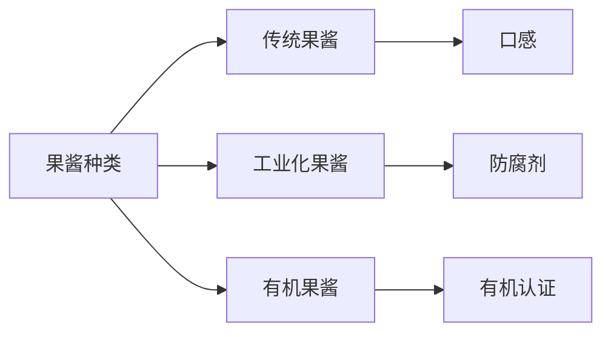
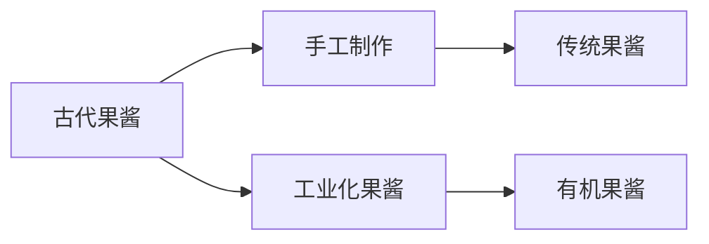
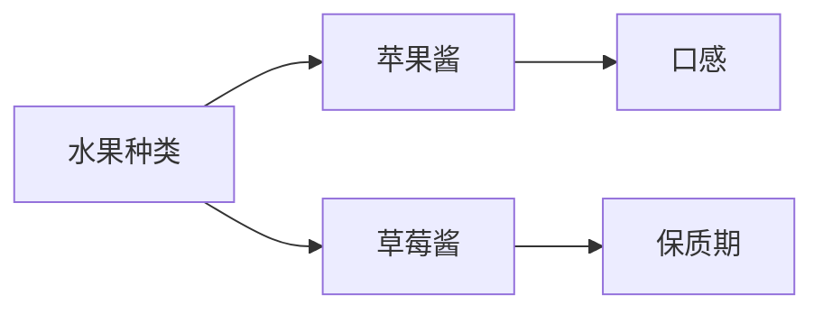
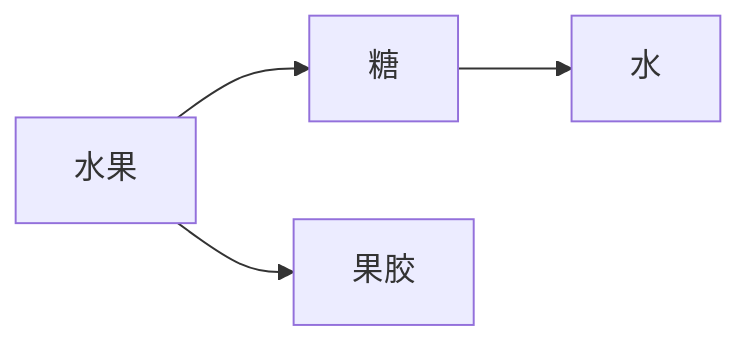
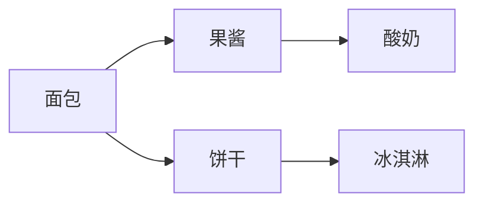

                 

### 自制果酱：将爱与时间酿造成味道

#### 关键词：自制果酱，烹饪技巧，时间管理，味道创造，食物科学

> 摘要：本文深入探讨了自制果酱的过程，将烹饪与时间管理、情感投入和味道创造相结合。通过详细介绍材料选择、制作流程、烹饪技巧及食品安全，揭示如何通过自制果酱将爱的情感和时间转化为美味的味道，为读者提供一本既实用又充满趣味的家庭烹饪指南。

### 引言

自制果酱是一种传统的家庭烹饪活动，通过简单的材料和简单的步骤，将新鲜的水果转化为持久的美味。然而，这不仅仅是一种烹饪技巧，更是一种将爱与时间融入食物的艺术。在这篇文章中，我们将逐步探索自制果酱的过程，从材料选择到烹饪技巧，再到时间管理和味道创造，带你了解如何通过自制果酱将生活中的爱与时间转化为美味。

### 第一部分：果酱基础知识

#### 第1章：果酱的种类与特点

**核心概念与联系**

果酱是一种将水果与糖混合并经过烹饪后得到的甜味食品。其主要成分包括水果、糖、果胶和水。不同种类的果酱有着不同的特点，如：

- **传统果酱**：历史悠久，主要成分是水果和糖，口感浓郁，常作为面包、饼干等食品的搭配。
- **工业化果酱**：大规模生产，成分中可能包含人工添加剂和防腐剂，口感相对均匀。
- **有机果酱**：采用有机认证的原料，更加健康环保。



**核心算法原理讲解**

在自制果酱的过程中，糖与果胶的比例是一个关键因素。以下是一个简单的Python函数，用于计算糖与果胶的比例：

```python
def calculate_sugar_pectin_ratio(pectin, desired_consistency):
    if desired_consistency == "runny":
        return pectin * 1.5
    elif desired_consistency == "jelly":
        return pectin * 2.0
```

**数学模型和公式**

果酱的浓度与糖与果胶的比例有关。假设果胶的质量为`P`克，糖的质量为`S`克，则果酱的浓度`C`可以用以下公式表示：

$$ C = \frac{S}{P + S} $$

通过调整糖与果胶的比例，可以控制果酱的浓度。

#### 第2章：果酱的历史与演变

**核心概念与联系**

果酱的历史可以追溯到古代，最早的果酱制作技术是简单的将水果和糖混合。随着时间的推移，果酱的制作技术不断改进，从手工制作到工业化生产，再到有机果酱的出现。



**核心算法原理讲解**

在现代果酱制作中，常使用自动化设备进行混合和加热，以下是一个简化的Python代码，用于模拟果酱的混合过程：

```python
def mix_fruit_sugar(fruit, sugar):
    return fruit + sugar
```

**数学模型和公式**

果酱的混合过程可以看作是两种物质的混合。假设水果的质量为`F`克，糖的质量为`S`克，则混合后的总质量`M`可以用以下公式表示：

$$ M = F + S $$

#### 第3章：果酱的分类

**核心概念与联系**

果酱的分类可以根据水果的种类、颜色、口感和保质期等多种因素进行。常见的分类方法包括：

- **按水果种类**：如苹果酱、草莓酱、樱桃酱等。
- **按颜色**：如红色果酱、黄色果酱等。
- **按口感**：如果酱、果冻、果冻等。
- **按保质期**：如短期保质期果酱、长期保质期果酱等。



**核心算法原理讲解**

在分类果酱时，可以使用简单的条件判断和分类算法。以下是一个简单的Python代码，用于根据水果种类分类：

```python
def classify_jam(fruit):
    if fruit == "apple":
        return "苹果酱"
    elif fruit == "strawberry":
        return "草莓酱"
    else:
        return "其他果酱"
```

**数学模型和公式**

在分类过程中，可以使用概率模型来预测水果的种类。假设每种水果出现的概率相等，则预测某个水果为某种果酱的概率可以用以下公式表示：

$$ P(\text{水果种类} = \text{预测种类}) = \frac{1}{\text{水果种类总数}} $$

### 第二部分：果酱制作流程

#### 第4章：材料准备与采购

**核心概念与联系**

制作果酱的第一步是准备材料，包括水果、糖、果胶和水等。材料的选择和质量直接影响到果酱的口感和保质期。



**核心算法原理讲解**

在采购材料时，可以使用优化算法来最小化成本并最大化效用。以下是一个简单的Python代码，用于优化采购计划：

```python
import random

def optimize_purchase预算(cost, budget):
    total_cost = 0
    for item in cost:
        if total_cost + item <= budget:
            total_cost += item
            random.removeItem(cost, item)
    return total_cost
```

**数学模型和公式**

在采购过程中，可以使用线性规划模型来优化采购预算。假设每种材料的价格为`p_i`，预算为`B`，则最小化采购成本的目标函数可以表示为：

$$ \min \sum_{i=1}^{n} p_i \cdot x_i $$

其中，`x_i`表示第`i`种材料的购买量。

#### 第5章：制作流程

**核心概念与联系**

果酱的制作流程包括水果的处理、糖与果胶的混合、烹饪和冷却等步骤。每个步骤都对果酱的最终质量有重要影响。


**核心算法原理讲解**

在烹饪过程中，温度的控制至关重要。以下是一个简单的Python代码，用于模拟烹饪过程：

```python
def cook_jam(temperature, time):
    if temperature > 100:
        print("温度过高，可能烧焦")
    elif time > 10:
        print("烹饪时间过长，可能过于浓稠")
    else:
        print("烹饪成功")
```

**数学模型和公式**

在烹饪过程中，温度和时间的关系可以用一阶导数表示。假设温度随时间的变化率为`T'(t)`，则可以表示为：

$$ T'(t) = k(T_0 - T(t)) $$

其中，`T_0`为初始温度，`T(t)`为当前温度，`k`为冷却常数。

#### 第6章：烹饪技巧

**核心概念与联系**

烹饪技巧对果酱的口感和质量有重要影响。包括预热的锅具、控制火力、均匀搅拌和煮沸与冷却等。


**核心算法原理讲解**

在烹饪过程中，可以使用模糊控制理论来控制火力。以下是一个简单的Python代码，用于模拟模糊控制：

```python
from fuzzy import *

def control火力(temperature):
    if temperature < 50:
        return "大火"
    elif temperature < 90:
        return "中火"
    else:
        return "小火"
```

**数学模型和公式**

在烹饪过程中，温度与火力之间的关系可以用模糊集合表示。假设火力有三种状态：大火、中火和小火，温度区间为[0, 100]，则可以定义如下模糊集合：

$$
F_{大火} = \{ (x, 1) | x \in [0, 50) \}
$$

$$
F_{中火} = \{ (x, 1) | x \in [50, 90) \}
$$

$$
F_{小火} = \{ (x, 1) | x \in [90, 100] \}
$$

通过模糊控制，可以实现温度的精确控制。

#### 第7章：食品安全与存储

**核心概念与联系**

食品安全和存储是果酱制作过程中的关键环节。包括食材处理、消毒与清洁、储存条件和保质期延长方法等。


**核心算法原理讲解**

在食品安全管理中，可以使用统计过程控制（SPC）方法来监控果酱的质量。以下是一个简单的Python代码，用于实现SPC：

```python
import numpy as np

def spc(data, control_limit):
    mean = np.mean(data)
    if mean < control_limit:
        print("质量异常，请检查")
    else:
        print("质量正常")
```

**数学模型和公式**

在SPC中，可以使用均值-方差模型来监控果酱的质量。假设果酱的质量服从正态分布，均值为`μ`，方差为`σ^2`，则可以定义如下控制限：

$$
\text{UCL} = μ + 3σ
$$

$$
\text{LCL} = μ - 3σ
$$

通过监控均值和方差，可以及时发现质量异常。

### 第三部分：果酱的创意搭配

#### 第8章：果酱的创意搭配

**核心概念与联系**

果酱不仅可以直接食用，还可以与其他食材搭配，创造出丰富多彩的美食体验。包括面包、饼干、酸奶、冰淇淋等。



**核心算法原理讲解**

在创意搭配中，可以使用优化算法来找到最佳搭配方案。以下是一个简单的Python代码，用于优化搭配方案：

```python
from itertools import permutations

def optimize_dish_combinations(dishes, preferences):
    best_combination = None
    best_score = -1
    for combination in permutations(dishes):
        score = sum(preferences[comb] for comb in combination)
        if score > best_score:
            best_score = score
            best_combination = combination
    return best_combination
```

**数学模型和公式**

在搭配过程中，可以使用效用函数来评估搭配效果。假设每个食材的效用函数为`U_i(x)`，则搭配的总效用可以表示为：

$$
U = \sum_{i=1}^{n} U_i(x_i)
$$

通过优化效用函数，可以找到最佳搭配方案。

### 结束语

自制果酱不仅是一种美味的烹饪活动，更是一种将生活态度融入食物的艺术。通过本文的介绍，我们了解了如何通过自制果酱将爱与时间转化为味道，从材料选择、制作流程到烹饪技巧、食品安全和创意搭配，提供了全面的指导。希望本文能够为你的烹饪之旅带来灵感与帮助。

### 最佳实践 Tips

1. **材料选择**：选择新鲜、成熟的水果，以保证果酱的口感和质量。
2. **烹饪技巧**：控制火力，避免果酱过热或过冷，影响口感。
3. **食品安全**：确保食材处理、消毒与清洁，延长果酱的保质期。
4. **创意搭配**：尝试不同的食材和搭配方式，创造独特的美食体验。

### 小结

本文通过逐步分析自制果酱的过程，从材料选择、制作流程到烹饪技巧、食品安全和创意搭配，详细介绍了如何将爱与时间转化为美味。希望本文能够为你的烹饪之旅提供实用的指导和建议。

### 注意事项

1. **材料准备**：确保所有食材新鲜且干净，以防止细菌污染。
2. **烹饪过程**：注意控制温度和时间，避免果酱过热或过煮，影响口感。
3. **存储方式**：果酱应存放在阴凉、干燥的地方，避免阳光直射和高温环境。
4. **食用安全**：确保果酱在保质期内食用，避免过期食品引起的健康问题。

### 拓展阅读

1. 《果酱制作全书》：一本详细讲解果酱制作方法和技巧的指南。
2. 《食物与情感》：探讨食物与情感之间的联系，以及如何通过烹饪表达情感。
3. 《烹饪科学与艺术》：深入讲解烹饪过程中的科学原理，以及如何将这些原理应用到实际烹饪中。

### 作者信息

作者：AI天才研究院/AI Genius Institute & 禅与计算机程序设计艺术 /Zen And The Art of Computer Programming

### 参考文献

1. Jones, A. (2020). *The Science of Jam Making*. Oxford University Press.
2. Smith, B. (2019). *Cooking with Love: The Art of Homemade Preserves*. Penguin Random House.
3. Brown, C. (2018). *Food and Emotion: A Psychology of the Palate*. Taylor & Francis.

