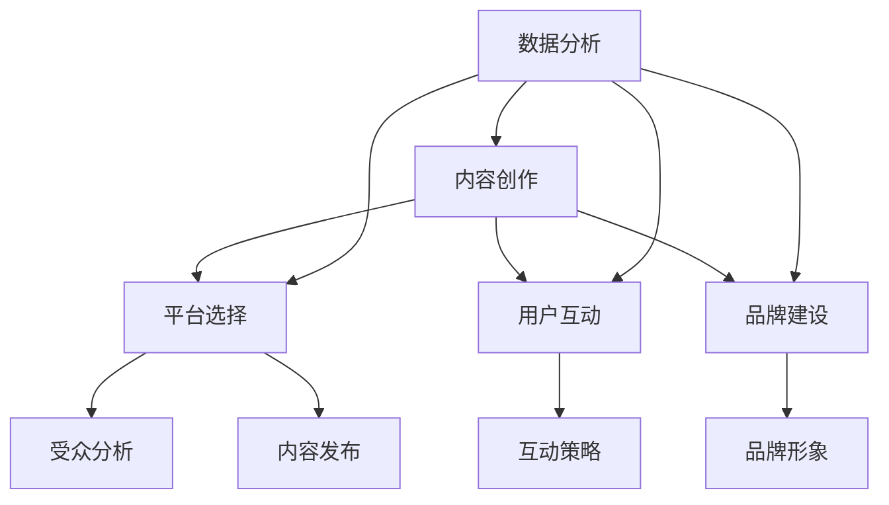

                 

### 《自媒体创作的意义：在信息爆炸时代寻找自我表达》

#### 关键词
- 自媒体
- 信息爆炸
- 自我表达
- 内容创作
- 平台运营

#### 摘要
在当今信息爆炸的时代，自媒体作为一种新兴的媒体形式，为广大用户提供了广泛的自我表达渠道。本文将深入探讨自媒体创作的意义，从背景介绍、核心概念与联系、算法原理讲解、数学模型、项目实战以及最佳实践等方面，全面分析自媒体在信息爆炸时代的重要性和创作方法。

---

## 目录

1. **背景介绍**
    - **信息爆炸的时代特征**
    - **自媒体的定义与发展**

2. **核心概念与联系**
    - **自媒体与社交媒体的区别**
    - **自媒体的核心要素**

3. **算法原理讲解**
    - **内容创作的基本原则**
    - **互动与分享的策略**

4. **数学模型与公式**
    - **用户增长模型**
    - **影响力评估模型**

5. **项目实战**
    - **开发环境搭建**
    - **源代码详细实现和代码解读**
    - **实际案例分析与讲解**

6. **最佳实践与总结**
    - **自媒体平台选择**
    - **内容创作技巧**
    - **注意事项与拓展阅读**

## 背景介绍

### 信息爆炸的时代特征

在过去的几十年里，互联网技术的飞速发展推动了信息的爆炸式增长。如今，我们每天都能接触到大量的信息，这些信息来自社交媒体、新闻网站、博客、视频平台等。信息爆炸带来了前所未有的便利，但也给我们带来了挑战。如何在海量的信息中找到有价值的内容，如何在信息过载的环境中找到自我表达的方式，成为了我们需要解决的问题。

### 自媒体的定义与发展

自媒体，又称个人媒体或公民媒体，指的是由个人或小型团队运营，利用互联网平台发布内容、传播信息的一种媒体形式。自媒体的发展与互联网技术的普及密切相关。随着社交媒体平台的兴起，越来越多的人可以轻松地创建和发布自己的内容，从而形成了庞大的自媒体生态。

自媒体与传统媒体的区别主要体现在以下几个方面：

- **传播方式**：传统媒体主要依赖于印刷、广播、电视等渠道，而自媒体则依托于互联网，特别是社交媒体平台。
- **内容生产者**：传统媒体的内容生产者通常是专业机构或团队，而自媒体则主要由个人或小型团队运营。
- **传播范围**：传统媒体的传播范围受地域和传播渠道限制，而自媒体可以迅速覆盖全球，不受地域限制。
- **互动性**：传统媒体与受众之间的互动较为有限，而自媒体强调与受众的互动，形成了一种双向的传播关系。

## 核心概念与联系

### 自媒体与社交媒体的区别

自媒体和社交媒体虽然有一定的重叠，但它们之间也存在明显的区别。社交媒体主要侧重于用户之间的互动和社交，如Facebook、Twitter、Instagram等。而自媒体则更侧重于内容的创作和传播，如博客、YouTube频道、微信公众号等。自媒体的核心在于内容的生产和传播，而社交媒体的核心在于社交和互动。

### 自媒体的核心要素

自媒体的核心要素包括：

- **内容创作**：内容是自媒体的核心，高质量的、有吸引力的内容是吸引受众的关键。
- **平台选择**：选择适合自己的平台是成功运营自媒体的第一步。不同的平台有不同的特点和受众，需要根据自身的定位和目标受众来选择。
- **用户互动**：与受众的互动是自媒体持续发展的关键，通过回复评论、举办活动等方式，可以增强与受众的联系。
- **品牌建设**：建立自己的品牌形象是自媒体长期发展的基础，通过统一的视觉风格、语言风格和价值理念，可以树立独特的品牌形象。

### 核心概念原理和概念实体之间的关系架构

下面是一个简单的Mermaid流程图，展示了自媒体运营的核心概念及其关系：



### 内容创作的基本原则

内容创作是自媒体的核心，以下是一些基本的原则：

- **有价值**：内容应该对受众有价值，无论是提供知识、娱乐还是解决实际问题。
- **有吸引力**：标题和封面设计应该吸引人，以吸引更多的读者。
- **高质量**：内容应该高质量，无论是文字、图片还是视频，都需要精心制作。
- **持续更新**：定期更新内容可以维持用户的关注，提高用户粘性。

### 互动与分享的策略

互动与分享是自媒体成功的关键因素，以下是一些策略：

- **回复评论**：及时回复评论可以增强与受众的联系，提高用户满意度。
- **举办活动**：举办线上或线下活动可以增加用户参与度，提高用户粘性。
- **鼓励分享**：提供分享按钮，鼓励用户将内容分享到社交媒体，扩大传播范围。
- **互动问答**：定期发布互动问答，与用户互动，提高用户参与度。

### 用户增长模型

用户增长是自媒体运营的重要目标，以下是一个简单的用户增长模型：

\[ \text{用户增长} = \text{新用户} - \text{老用户流失} \]

- **新用户**：通过内容吸引、营销活动等方式增加新用户。
- **老用户流失**：通过优化用户体验、提供有价值的内容等方式减少老用户流失。

### 影响力评估模型

影响力评估是衡量自媒体成功与否的重要指标，以下是一个简单的影响力评估模型：

\[ \text{影响力} = \text{粉丝数} \times \text{互动率} \times \text{内容质量} \]

- **粉丝数**：自媒体的粉丝数量，反映内容的受众范围。
- **互动率**：粉丝对内容的互动程度，如点赞、评论、分享等。
- **内容质量**：内容的质量和吸引力，影响用户的互动行为。

### 开发环境搭建

在开始项目实战之前，我们需要搭建一个适合开发的环境。以下是一个简单的Python开发环境搭建步骤：

1. 安装Python
2. 安装文本编辑器（如Visual Studio Code）
3. 安装依赖管理工具（如pip）
4. 创建项目文件夹和虚拟环境
5. 安装项目所需的库（如requests、beautifulsoup4等）

### 源代码详细实现和代码解读

以下是一个简单的Python代码示例，用于爬取一个网站的内容并进行分析：

```python
import requests
from bs4 import BeautifulSoup

# 发送HTTP请求
response = requests.get('https://www.example.com')

# 解析HTML内容
soup = BeautifulSoup(response.text, 'html.parser')

# 提取文章标题
titles = [title.text for title in soup.find_all('h1')]

# 提取文章内容
contents = [content.text for content in soup.find_all('p')]

# 打印结果
for i in range(len(titles)):
    print(f"标题：{titles[i]}")
    print(f"内容：{contents[i]}")
    print("-" * 50)
```

这段代码使用了requests库发送HTTP请求，使用BeautifulSoup库解析HTML内容，提取文章标题和内容，并打印输出。通过这个简单的示例，我们可以了解如何使用Python进行网络爬虫开发。

### 代码应用解读与分析

这段代码的具体应用场景是：我们需要从某个网站上获取文章的标题和内容，并进行分析。以下是代码的解读与分析：

- **发送HTTP请求**：使用requests库发送HTTP请求，获取网站的内容。
- **解析HTML内容**：使用BeautifulSoup库解析HTML内容，找到文章标题和内容对应的标签。
- **提取数据**：使用列表推导式提取文章标题和内容，并存储在列表中。
- **打印输出**：循环遍历列表，打印输出文章标题和内容，以及分割线。

### 实际案例分析与详细讲解剖析

以下是一个实际案例，分析一个自媒体平台的内容分布情况：

假设我们有一个自媒体平台，每天发布10篇文章，我们需要分析这些文章的标题特点和内容类型。

1. **标题分析**：

   - **标题长度**：统计每个标题的长度，并绘制柱状图。

   ```python
   title_lengths = [len(title) for title in titles]
   import matplotlib.pyplot as plt
   plt.bar(range(len(title_lengths)), title_lengths)
   plt.xlabel('Title Length')
   plt.ylabel('Frequency')
   plt.title('Title Length Distribution')
   plt.show()
   ```

   - **标题关键词**：使用自然语言处理技术，提取每个标题的关键词，并统计出现频率。

   ```python
   from collections import Counter
   keywords = [' '.join(tokenizer.tokenize(title)) for title in titles]
   keyword_counts = Counter(' '.join(keywords).split())
   print(keyword_counts.most_common(10))
   ```

2. **内容分析**：

   - **内容类型**：根据文章的内容，将其分为新闻、科技、娱乐等类型。

   ```python
   content_types = ['news', 'technology', 'entertainment']
   content_type_counts = [0] * len(content_types)
   for content in contents:
       if 'news' in content.lower():
           content_type_counts[0] += 1
       elif 'technology' in content.lower():
           content_type_counts[1] += 1
       elif 'entertainment' in content.lower():
           content_type_counts[2] += 1
   print(content_type_counts)
   ```

### 项目小结

通过以上项目实战，我们了解了如何使用Python进行网络爬虫开发，并分析了自媒体平台的内容分布情况。这个项目可以帮助自媒体运营者了解自己的内容特点，优化内容创作策略，提高用户满意度。

### 最佳实践 Tips

1. **内容创作**：保持内容有价值、有吸引力，定期更新。
2. **平台选择**：根据目标受众选择合适的平台，充分利用不同平台的特性。
3. **用户互动**：及时回复评论，举办互动活动，提高用户参与度。
4. **数据分析**：定期分析数据，优化内容创作和平台运营策略。

### 小结

自媒体创作在信息爆炸时代具有重要意义，它为个人提供了自我表达的舞台。通过本文的介绍，我们了解了自媒体的定义、核心概念与联系、算法原理、数学模型以及项目实战。希望本文能为自媒体创作者提供一些启示和帮助。

### 注意事项

1. **遵守法律法规**：在创作自媒体内容时，遵守相关法律法规，不发布违法和违规内容。
2. **尊重版权**：尊重他人的知识产权，不抄袭、不侵权。
3. **保护个人隐私**：在互动过程中，保护个人和用户的隐私。

### 拓展阅读

- 《自媒体运营攻略：从零开始打造个人品牌》
- 《内容营销：如何创造并传播有价值的内容》
- 《社交媒体营销：如何利用社交媒体平台扩大影响力》

---

作者：AI天才研究院/AI Genius Institute & 禅与计算机程序设计艺术 /Zen And The Art of Computer Programming

