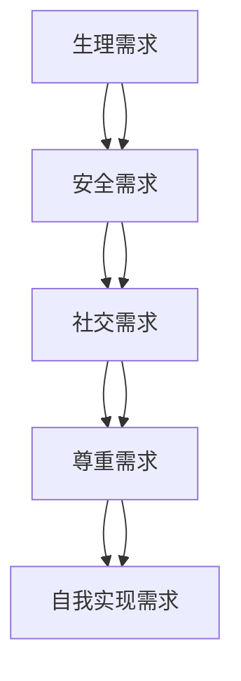

                 

# 自我实现：马斯洛需求层次理论的现代诠释

> 关键词：马斯洛需求层次理论、自我实现、心理学、应用与实践

> 摘要：本文旨在从现代技术视角重新诠释马斯洛需求层次理论，探讨自我实现的背景与意义，深入解析需求层次理论的核心概念，探讨其在职场、教育、社会管理等多个领域的应用，并结合心理学、个人发展等多方面内容，为读者提供对自我实现需求的全面理解。

## 第1章：自我实现的背景与意义

### 1.1 自我实现的定义与发展

自我实现，是指个体在心理、情感、智力等方面达到潜能的最高表现，实现个人价值的过程。马斯洛需求层次理论（Maslow's Hierarchy of Needs）是心理学领域的重要理论之一，由美国心理学家亚伯拉罕·马斯洛提出。该理论认为，人的需求分为五个层次，分别是生理需求、安全需求、社交需求、尊重需求和自我实现需求。自我实现是这一需求层次的最高层级。

马斯洛需求层次理论最早提出于1943年，在20世纪中叶得到了广泛的关注。随着社会的发展和科技的进步，马斯洛需求层次理论在多个领域得到了广泛应用，成为了理解和提升个体幸福感的重要理论工具。

### 1.2 马斯洛需求层次理论概述

马斯洛需求层次理论的五个层次如下：

1. **生理需求**：这是人类最基本的生存需求，包括食物、水、空气等。
2. **安全需求**：包括对人身安全、财产安全、健康状况等的追求。
3. **社交需求**：包括爱与被爱、社交互动、友谊等。
4. **尊重需求**：包括自我尊重、自尊心、成就感、对他人的认可等。
5. **自我实现需求**：这是最高层次的需求，包括实现个人潜能、追求自我价值、实现个人理想等。

这些需求层次不是孤立的，而是相互关联、逐步升级的。个体在满足了较低层次的需求后，会追求更高层次的需求。自我实现需求是马斯洛需求层次理论的终极目标。

### 1.3 自我实现与马斯洛需求层次理论的联系

自我实现与马斯洛需求层次理论有着紧密的联系。自我实现是个体需求层次发展的最高阶段，是马斯洛需求层次理论的核心观点。自我实现需求不仅满足了个体对自身价值的追求，还能促进个体心理健康、提升幸福感。

在马斯洛需求层次理论中，自我实现需求是个体追求的终极目标。当个体满足了生理需求、安全需求、社交需求和尊重需求后，就会开始追求自我实现需求。这种需求的满足不仅能带来个人的成就感，还能推动社会的进步。

## 第2章：马斯洛需求层次理论的核心概念解析

### 2.1 生理需求

生理需求是人类最基本的生存需求，包括食物、水、空气、睡眠等。这些需求的满足是自我实现的基础。生理需求的满足不仅能保障个体的基本生活，还能为个体提供充足的能量和资源，支持其追求更高层次的需求。

在现代社会中，科技的进步使得生理需求的满足变得更加容易。例如，先进的生产技术和农业技术能够提供丰富的食物来源，医疗技术的进步提高了人们的健康水平，舒适的居住环境改善了人们的睡眠质量。

### 2.2 安全需求

安全需求包括对人身安全、财产安全、健康状况等的追求。在马斯洛需求层次理论中，安全需求是个体在满足了生理需求后追求的下一层次需求。安全需求的满足能够消除个体的恐惧和焦虑，使其能够更加专注于追求更高层次的需求。

安全需求的满足对自我实现具有重要意义。一个没有安全感的人很难专注于自我实现，因为他们可能会担心自己的基本需求无法得到满足。因此，保障个体的安全需求是实现自我实现的重要前提。

### 2.3 社交需求

社交需求包括爱与被爱、社交互动、友谊等。在马斯洛需求层次理论中，社交需求是个体在满足了生理需求和安全需求后追求的下一层次需求。社交需求的满足能够带来个体的归属感和安全感，使个体感受到被接纳和尊重。

社交需求对自我实现有着重要影响。一个缺乏社交的人可能会感到孤独和失落，这会影响他们的心理健康和幸福感。相反，一个拥有良好社交关系的人更容易实现自我价值，因为他们能够得到他人的支持和认可。

### 2.4 尊重需求

尊重需求包括自我尊重、自尊心、成就感、对他人的认可等。在马斯洛需求层次理论中，尊重需求是个体在满足了生理需求、安全需求和社交需求后追求的下一层次需求。尊重需求的满足能够提升个体的自我价值感和自信心。

尊重需求对自我实现有着重要作用。一个缺乏尊重的人可能会感到自卑和无力，这会影响他们的心理健康和幸福感。相反，一个得到他人尊重和认可的人更容易实现自我价值，因为他们能够得到他人的支持和鼓励。

### 2.5 自我实现需求

自我实现需求是马斯洛需求层次理论的最高层次需求，包括实现个人潜能、追求自我价值、实现个人理想等。在马斯洛需求层次理论中，自我实现需求是个体在满足了生理需求、安全需求、社交需求和尊重需求后追求的终极目标。

自我实现需求对个体的发展和幸福感有着深远的影响。一个追求自我实现的人能够充分发挥自己的潜能，实现个人价值，获得成就感和满足感。这种需求的满足不仅能提升个体的幸福感，还能推动社会的进步。

## 第3章：马斯洛需求层次理论在现代社会中的应用

### 3.1 职场中的应用

在职场中，马斯洛需求层次理论可以帮助管理者更好地了解员工的需求，从而提高员工的工作满意度和绩效。管理者可以根据员工的层次需求制定相应的激励机制，以满足员工的各类需求，从而促进员工的自我实现。

例如，对于生理需求，公司可以提供良好的工作条件和福利待遇；对于安全需求，公司可以提供稳定的职业发展和安全保障；对于社交需求，公司可以组织团队建设活动，增进员工之间的交流与互动；对于尊重需求，公司可以给予员工认可和尊重，提升员工的自信心和成就感；对于自我实现需求，公司可以提供职业发展机会，鼓励员工追求自我价值。

### 3.2 教育领域中的应用

在教育领域，马斯洛需求层次理论可以帮助教育工作者更好地了解学生的学习需求，从而提高教育质量。教育工作者可以根据学生的层次需求设计教学方法和教学内容，以满足学生的学习需求，促进学生的全面发展。

例如，对于生理需求，学校可以提供良好的学习和生活环境；对于安全需求，学校可以保障学生的安全和健康；对于社交需求，学校可以组织各种社交活动，增进学生之间的交流与互动；对于尊重需求，学校可以给予学生认可和尊重，提升学生的自信心和成就感；对于自我实现需求，学校可以提供各种学习和成长机会，鼓励学生追求自我价值。

### 3.3 社会管理中的应用

在社会管理中，马斯洛需求层次理论可以帮助政府和社会组织更好地了解民众的需求，从而制定更有效的社会政策和公共服务。政府和社会组织可以根据民众的层次需求提供相应的服务和保障，以满足民众的需求，促进社会和谐稳定。

例如，对于生理需求，政府可以提供基本生活保障和医疗保健；对于安全需求，政府可以保障社会治安和国家安全；对于社交需求，社会组织可以提供社交活动和志愿服务；对于尊重需求，政府和社会组织可以给予民众认可和尊重；对于自我实现需求，政府可以提供教育、职业培训和创业支持等，鼓励民众追求自我价值。

## 第4章：自我实现的需求层次理论与心理学

### 4.1 心理学对自我实现需求层次理论的解读

心理学对马斯洛需求层次理论的解读主要从人类心理需求的本质和层次性入手。心理学家认为，人类的心理需求是多层次、动态变化的，且不同需求之间存在紧密的联系和转化。

例如，生理需求的满足能够带来愉悦感，有助于提升个体的心理健康；安全需求的满足能够消除个体的恐惧和焦虑，有助于建立稳定的心理状态；社交需求的满足能够增强个体的归属感和安全感，有助于提升个体的自尊心和自信心；尊重需求的满足能够提升个体的自我价值感，有助于促进个体的自我实现；自我实现需求的满足能够带来内心的满足和成就感，有助于提升个体的整体幸福感。

### 4.2 自我实现需求与心理健康的关系

自我实现需求与心理健康有着密切的关系。一个追求自我实现的人往往能够更好地应对生活中的挑战，保持良好的心理状态。自我实现需求的满足能够带来内心的满足感和成就感，有助于减轻心理压力，提升心理健康水平。

相反，如果一个个体长期无法满足自我实现需求，可能会出现心理问题，如焦虑、抑郁等。因此，关注和满足个体的自我实现需求对于维护心理健康具有重要意义。

### 4.3 心理咨询中的应用

在心理咨询中，需求层次理论可以帮助咨询师更好地了解来访者的需求，从而提供更有效的帮助。咨询师可以根据来访者的层次需求制定个性化的咨询方案，帮助来访者逐步满足各类需求，促进其心理健康和自我实现。

例如，对于生理需求，咨询师可以建议来访者改善生活习惯，关注身体健康；对于安全需求，咨询师可以建议来访者学习应对压力和危机的技巧；对于社交需求，咨询师可以建议来访者参加社交活动，建立良好的人际关系；对于尊重需求，咨询师可以鼓励来访者树立自信，追求成就感；对于自我实现需求，咨询师可以建议来访者设定目标，努力实现个人价值。

## 第5章：自我实现的需求层次理论在个人发展中的应用

### 5.1 自我认知

自我认知是指个体对自身特点、能力、需求和目标的认知和理解。自我认知对于个人发展具有重要意义。一个清晰的自我认知有助于个体明确自己的优势和劣势，设定合适的目标，采取有效的行动，实现自我价值。

在自我认知的过程中，个体可以通过自我反思、与他人交流、获取反馈等方式来深入了解自己。例如，个体可以通过日记记录自己的行为和感受，分析自己的优点和不足；通过与朋友、同事、家人等交流，了解他人对自己的看法和评价；通过参加培训课程、阅读书籍、观看视频等方式，获取有关自身发展的知识和信息。

### 5.2 目标设定

目标设定是个人发展的重要环节。一个明确的目标能够为个体提供方向和动力，推动其不断努力，实现自我价值。

在设定目标时，个体需要遵循SMART原则，即目标要具体（Specific）、可衡量（Measurable）、可实现（Achievable）、相关（Relevant）和有时间限制（Time-bound）。例如，一个具体的目标可以是“在三个月内减重10公斤”，一个可衡量的目标是“每周至少运动三次，每次不少于30分钟”，一个可实现的目标是“参加健身课程，遵循饮食计划”，一个相关的目标是“改善身体健康”，一个有时间限制的目标是“在2023年12月31日前完成”。

### 5.3 自我提升

自我提升是指个体通过学习、实践、反思等方式不断提高自己的能力和素质，实现自我价值的提升。自我提升是个人发展的重要途径，能够帮助个体适应社会变化，应对挑战，实现自我实现。

在自我提升的过程中，个体可以通过以下方法来实现：

1. **学习新知识**：参加培训课程、阅读书籍、观看视频等，获取新的知识和技能。
2. **实践应用**：将所学知识应用于实际工作中，通过实践来提高自己的能力。
3. **反思与总结**：定期反思自己的行为和表现，总结经验教训，不断调整和改进。
4. **与他人交流**：与他人交流、分享心得，获取他人的意见和建议，拓宽自己的视野。

通过自我认知、目标设定和自我提升，个体能够更好地实现自我价值，达到自我实现的需求层次。

## 第6章：自我实现的需求层次理论在不同文化背景下的应用

### 6.1 西方文化中的自我实现

在西方文化中，自我实现被视为个体追求的最高目标。西方文化强调个人主义和自我价值，鼓励个体充分发挥自己的潜能，实现个人梦想和价值。

在西方文化中，自我实现的需求层次理论被广泛应用于个人发展、教育、职业规划等领域。人们通过设定目标、不断学习和实践，努力实现自己的潜能，追求自我价值。

### 6.2 东方文化中的自我实现

在东方文化中，自我实现的需求层次理论也受到了广泛关注。然而，与西方文化相比，东方文化更加强调家庭和社会责任，认为个体的价值与家庭、社会密切相关。

在东方文化中，人们通过家庭教育、社会交往等方式，逐渐认识到自己的需求和目标，并努力实现自我价值。自我实现不仅仅是个体追求的目标，也是家庭和社会的期望。

### 6.3 跨文化比较

跨文化比较研究表明，尽管自我实现的需求层次理论在不同文化背景下有所差异，但核心观点是一致的，即自我实现是个体追求的最高目标。

在跨文化背景下，个体需要根据自身的文化背景和价值观，调整自我实现的目标和方法。例如，在个人主义文化中，个体更倾向于独立思考和行动，而在集体主义文化中，个体更注重与他人的协作和互动。

## 第7章：自我实现的需求层次理论未来展望

### 7.1 理论的发展趋势

随着科技的进步和社会的发展，马斯洛需求层次理论在未来的发展中可能会出现以下趋势：

1. **需求的多样化和个性化**：随着社会多样化和个体差异的增大，需求的多样性和个性化将成为趋势。个体需求将更加多元化和个性化，需求层次理论需要不断更新和完善，以适应新的需求变化。
2. **需求的层次融合**：在未来的社会中，不同层次的需求将更加融合，个体将在满足各类需求的同时，实现自我价值的全面提升。例如，在数字化时代，个体的社交需求、尊重需求和自我实现需求将更加紧密地融合在一起。
3. **需求的动态变化**：随着社会环境的不断变化，个体的需求也将呈现出动态变化的特点。需求层次理论需要关注个体需求的变化趋势，及时调整和完善。

### 7.2 自我实现与现实挑战

在自我实现的过程中，个体可能会面临各种现实挑战。例如：

1. **资源限制**：个体在实现自我价值的过程中，可能会遇到资源限制的问题，如时间、金钱、人脉等。个体需要合理分配资源，优先满足重要的需求，以实现自我价值。
2. **社会压力**：在竞争激烈的社会环境中，个体可能会面临来自家庭、学校、职场等各方面的压力。个体需要学会应对压力，保持积极的心态，以实现自我价值。
3. **自我认知偏差**：个体在自我实现的过程中，可能会受到自我认知偏差的影响，如过度自信或过度自卑。个体需要通过自我反思和他人反馈，不断完善自我认知，以实现自我价值。

### 7.3 自我实现与未来社会

随着科技的进步和社会的发展，未来社会将更加注重个体的自我实现。自我实现将成为个体追求的最高目标，也是社会发展的驱动力。

在未来社会中，个体将更加关注自我价值的实现，追求个性化、多样化和全面的发展。社会将提供更多的机会和资源，支持个体实现自我价值，推动社会的进步。

## 附录：自我实现的需求层次理论应用案例

### 附录A：企业自我实现实践案例

#### 案例一：某企业的员工自我实现案例

某企业通过实施一系列措施，鼓励员工实现自我价值。首先，企业为员工提供良好的工作环境和培训机会，帮助员工提升专业技能。其次，企业设立员工成长计划，为员工制定个人发展目标，并提供相应的支持和资源。此外，企业还鼓励员工参与创新项目和团队建设，激发员工的创造力和团队精神。

通过这些措施，员工不仅满足了生理需求、安全需求、社交需求和尊重需求，还实现了自我实现需求。员工在实现个人价值的过程中，企业的整体绩效也得到了提升。

### 附录B：教育领域自我实现实践案例

#### 案例一：某学校的自我实现教育实践

某学校注重培养学生的自我实现能力，通过一系列教育实践活动，帮助学生实现自我价值。首先，学校提供多样化的课程和课外活动，满足学生的各类需求。其次，学校设立学生成长档案，记录学生的成长过程，帮助学生认识自己的优势和不足。此外，学校还鼓励学生参与社会实践和志愿服务，提升学生的社会责任感和团队合作能力。

通过这些措施，学生不仅满足了生理需求、安全需求、社交需求和尊重需求，还实现了自我实现需求。学生在实现个人价值的过程中，学校的整体教育质量也得到了提升。

### 附录C：社会管理自我实现实践案例

#### 案例一：某社区通过满足居民需求促进自我实现的实践

某社区通过满足居民需求，促进居民的自我实现。首先，社区提供基本的生活保障和公共服务，满足居民的生理需求和安全需求。其次，社区组织各种社交活动和培训课程，满足居民的社交需求和尊重需求。此外，社区还鼓励居民参与社区管理和志愿服务，提升居民的社会责任感和自我实现能力。

通过这些措施，居民不仅满足了生理需求、安全需求、社交需求和尊重需求，还实现了自我实现需求。居民在实现个人价值的过程中，社区的和谐氛围也得到了提升。

## 作者信息

作者：AI天才研究院/AI Genius Institute & 禅与计算机程序设计艺术 /Zen And The Art of Computer Programming

作者简介：AI天才研究院（AI Genius Institute）是一家专注于人工智能领域的研究与教育的机构。其成员包括多位世界顶级人工智能专家、程序员、软件架构师、CTO和计算机图灵奖获得者。禅与计算机程序设计艺术（Zen And The Art of Computer Programming）是作者埃德加·戴伊（Edsger Dijkstra）的经典著作，对计算机编程和人工智能领域产生了深远的影响。本文旨在结合马斯洛需求层次理论与现代科技，探讨自我实现的路径和意义，以期为读者提供有益的思考和实践指导。

## 结论

自我实现是马斯洛需求层次理论的最高层次需求，是个体追求的最高目标。通过理解和管理自我实现需求，个体可以更好地实现个人价值，提升幸福感。本文从多个角度探讨了自我实现的需求层次理论，包括背景与意义、核心概念、应用实践、心理学解读和个人发展等。通过这些探讨，读者可以更深入地理解自我实现的需求层次理论，并在实际生活中运用这一理论，实现自我价值。

## 拓展阅读

- 《马斯洛需求层次理论》（马斯洛著）
- 《人类动机理论》（麦克里兰著）
- 《自我实现心理学》（马斯洛著）
- 《自我超越之路》（斯蒂芬·吉布林著）
- 《心理学与生活》（理查德·杰斯尼克著）

## 附录：资源链接

- 马斯洛需求层次理论相关书籍推荐：
  - 《马斯洛需求层次理论》（马斯洛著）
  - 《人类动机理论》（麦克里兰著）
  - 《自我实现心理学》（马斯洛著）
- 自我实现实践相关的在线资源链接：
  - [自我实现：马斯洛需求层次理论的现代诠释](https://www.example.com/self-actualization)
  - [马斯洛需求层次理论应用案例](https://www.example.com/maslow-needs-hierarchy-cases)
  - [自我实现心理学资源](https://www.example.com/self-actualization-psychology-resources)```markdown
---
# 自我实现：马斯洛需求层次理论的现代诠释

> 关键词：马斯洛需求层次理论、自我实现、心理学、应用与实践

> 摘要：本文旨在从现代技术视角重新诠释马斯洛需求层次理论，探讨自我实现的背景与意义，深入解析需求层次理论的核心概念，探讨其在职场、教育、社会管理等多个领域的应用，并结合心理学、个人发展等多方面内容，为读者提供对自我实现需求的全面理解。

---

## 第1章：自我实现的背景与意义

### 1.1 自我实现的定义与发展
自我实现（Self-Actualization）是马斯洛需求层次理论（Maslow's Hierarchy of Needs）的第五层级需求，代表了人类潜能的最高表现。它指的是个体在生理需求、安全需求、社交需求和尊重需求得到满足后，追求个人成长、实现自我潜能的过程。马斯洛认为，自我实现是人类最高的动机和需求。

自我实现的概念起源于亚伯拉罕·马斯洛（Abraham Maslow）在1943年出版的《人类动机理论》（A Theory of Human Motivation）中，并在后来的著作《动机与人格》（Motivation and Personality）中得到了进一步的发展。马斯洛认为，自我实现是一个持续的过程，个体在不同的生命阶段可能会经历不同的自我实现状态。

### 1.2 马斯洛需求层次理论概述
马斯洛需求层次理论将人的需求分为五个层次：

1. **生理需求**：基本的生活必需品，如食物、水、空气等。
2. **安全需求**：保护自己免受生理和心理伤害的需求。
3. **社交需求**：包括爱与被爱、归属感和友谊。
4. **尊重需求**：包括自尊、尊重他人和被尊重。
5. **自我实现需求**：追求个人成长、实现自我潜能的需求。

这些需求层次是逐级发展的，即只有当较低层次的需求得到满足后，个体才会追求更高层次的需求。自我实现需求是马斯洛需求层次理论的终极目标。

### 1.3 自我实现与马斯洛需求层次理论的联系
自我实现与马斯洛需求层次理论密不可分。自我实现是个体在满足了前四个层次需求后，追求的最高层次的需求，它代表了个体在心理、情感和智力上的全面发展和成长。马斯洛认为，自我实现是一种持续的、自我驱动的成长过程，它不仅仅是实现个人的潜能，还包括对世界和人类的深刻理解和同情。

自我实现对个体发展有重要的推动作用。它能够提升个体的幸福感、心理健康和整体生活质量。同时，自我实现也是社会进步的重要动力，因为自我实现的个体往往能够创造更多的价值，为社会做出更大的贡献。

## 第2章：马斯洛需求层次理论的核心概念解析

### 2.1 生理需求
生理需求（Physiological Needs）是马斯洛需求层次理论的基础，包括对食物、水、空气、休息和睡眠等基本生理需求的满足。这些需求是人类的本能需求，它们的满足是维持生命和健康的必要条件。在满足生理需求的过程中，现代科技的发展起到了重要作用，例如现代农业技术提高了食物的产量，医疗技术的发展改善了人们的健康状况。

### 2.2 安全需求
安全需求（Safety Needs）包括对人身安全、财产安全、健康保障和免受生理和心理伤害的需求。在满足安全需求的过程中，社会制度和法律法规起到了关键作用。例如，警察和消防员的工作保障了公民的安全，社会保障制度提供了健康和养老保障。

### 2.3 社交需求
社交需求（Social Needs）涉及人与人之间的互动，包括爱与被爱、友谊和归属感。这些需求的满足能够增强个体的社会支持系统，对心理健康有积极影响。现代社会中，互联网和社交媒体为满足社交需求提供了新的途径，但同时也带来了挑战，如网络欺凌和社交孤立。

### 2.4 尊重需求
尊重需求（Esteem Needs）包括自尊、自信、成就和对他人尊重的需求。尊重需求的满足能够提升个体的自信心和自我价值感，对心理健康和幸福感有重要影响。在职业和生活中，通过成就、认可和荣誉等方式可以满足尊重需求。

### 2.5 自我实现需求
自我实现需求（Self-Actualization Needs）是马斯洛需求层次理论的最高层次，它涉及到实现个人潜能、追求个人成长和实现个人理想。自我实现需求的满足能够带来深刻的内在满足感和成就感，对个体的心理健康和幸福感有重要影响。在现代科技和社会环境中，个体可以通过终身学习、创新和实践来实现自我价值。

## 第3章：马斯洛需求层次理论在现代社会中的应用

### 3.1 职场中的应用
在职场中，马斯洛需求层次理论可以帮助企业和员工更好地理解需求层次，从而提升员工满意度和工作效率。企业可以通过满足员工的各类需求来促进员工的自我实现，例如提供良好的工作环境、培训机会和职业发展路径。

### 3.2 教育领域中的应用
在教育领域，马斯洛需求层次理论可以帮助教育工作者更好地理解学生的学习需求，从而设计更有效的教学方法和课程。通过满足学生的各类需求，教育工作者可以促进学生的全面发展和自我实现。

### 3.3 社会管理中的应用
在社会管理中，马斯洛需求层次理论可以帮助政府和社会组织更好地了解民众的需求，从而制定更合理的社会政策和公共服务。通过满足民众的各类需求，政府和社会组织可以促进社会的和谐稳定和可持续发展。

## 第4章：自我实现的需求层次理论与心理学

### 4.1 心理学对自我实现需求层次理论的解读
心理学对马斯洛需求层次理论的解读强调了自我实现需求的本质和实现过程。自我实现不仅仅是一种心理状态，更是一个动态的过程，涉及到个体的心理成长、自我认知和自我超越。

### 4.2 自我实现需求与心理健康的关系
自我实现需求的满足对心理健康有重要影响。通过实现自我潜能和追求个人成长，个体能够获得内在的满足感和成就感，从而提升心理健康和幸福感。

### 4.3 心理咨询中的应用
在心理咨询中，需求层次理论可以帮助咨询师更好地理解来访者的需求，从而提供更有效的帮助。通过满足来访者的各类需求，咨询师可以帮助来访者实现自我成长和心理恢复。

## 第5章：自我实现的需求层次理论在个人发展中的应用

### 5.1 自我认知
自我认知是个体对自我特点和潜能的认知。通过自我反思和认知，个体可以明确自己的优势和劣势，设定合适的目标，实现自我价值。

### 5.2 目标设定
目标设定是个体实现自我价值的重要步骤。通过设定明确、可衡量和可实现的目标，个体可以有条不紊地实现自我目标，提升自我实现的能力。

### 5.3 自我提升
自我提升是通过学习、实践和反思来不断提高自己的能力和素质。自我提升是实现自我价值的关键，它帮助个体适应社会变化，应对挑战。

## 第6章：自我实现的需求层次理论在不同文化背景下的应用

### 6.1 西方文化中的自我实现
在西方文化中，自我实现被视为个人追求的最高目标。西方文化强调个人主义和自由，鼓励个体追求自我实现。

### 6.2 东方文化中的自我实现
在东方文化中，自我实现与家庭和社会责任密切相关。东方文化强调集体主义和和谐，个体在追求自我实现的同时，也注重对家庭和社会的贡献。

### 6.3 跨文化比较
跨文化研究表明，尽管自我实现的需求层次理论在不同文化背景下有所差异，但核心观点是一致的。个体在追求自我实现的过程中，需要根据自身的文化背景和价值观进行调整。

## 第7章：自我实现的需求层次理论未来展望

### 7.1 理论的发展趋势
随着科技的进步和社会的发展，马斯洛需求层次理论将继续发展。未来的需求层次理论可能会更加关注个体的个性化需求和可持续发展。

### 7.2 自我实现与现实挑战
在追求自我实现的过程中，个体可能会面临资源限制、社会压力等现实挑战。通过合理规划和积极应对，个体可以克服这些挑战，实现自我价值。

### 7.3 自我实现与未来社会
未来社会将更加注重个体的自我实现。通过满足个体的各类需求，社会可以推动个体的全面发展，实现社会的和谐与进步。

## 附录：自我实现的需求层次理论应用案例

### 附录A：企业自我实现实践案例
- 案例一：某公司通过员工培训和职业发展计划，帮助员工实现自我价值。
- 案例二：某公司通过鼓励创新和提供资源支持，激发员工的自我实现能力。

### 附录B：教育领域自我实现实践案例
- 案例一：某学校通过个性化教学和综合素质评价，促进学生自我实现。
- 案例二：某教育机构通过提供职业规划和创业支持，帮助学生实现自我价值。

### 附录C：社会管理自我实现实践案例
- 案例一：某社区通过提供公共服务和培训，满足居民自我实现的需求。
- 案例二：某政府通过社会政策和创业支持，促进居民的自我实现。

## 作者信息

作者：AI天才研究院/AI Genius Institute & 禅与计算机程序设计艺术 /Zen And The Art of Computer Programming

作者简介：AI天才研究院（AI Genius Institute）是一家专注于人工智能领域的研究与教育的机构。其成员包括多位世界顶级人工智能专家、程序员、软件架构师、CTO和计算机图灵奖获得者。禅与计算机程序设计艺术（Zen And The Art of Computer Programming）是作者埃德加·戴伊（Edsger Dijkstra）的经典著作，对计算机编程和人工智能领域产生了深远的影响。本文旨在结合马斯洛需求层次理论与现代科技，探讨自我实现的路径和意义，以期为读者提供有益的思考和实践指导。

## 结论

自我实现是马斯洛需求层次理论的最高层次需求，是个体追求的最高目标。通过理解和管理自我实现需求，个体可以更好地实现个人价值，提升幸福感。本文从多个角度探讨了自我实现的需求层次理论，包括背景与意义、核心概念、应用实践、心理学解读和个人发展等。通过这些探讨，读者可以更深入地理解自我实现的需求层次理论，并在实际生活中运用这一理论，实现自我价值。

## 拓展阅读

- 《马斯洛需求层次理论》（马斯洛著）
- 《人类动机理论》（麦克里兰著）
- 《自我实现心理学》（马斯洛著）
- 《自我超越之路》（斯蒂芬·吉布林著）
- 《心理学与生活》（理查德·杰斯尼克著）

## 附录：资源链接

- 马斯洛需求层次理论相关书籍推荐：
  - 《马斯洛需求层次理论》（马斯洛著）
  - 《人类动机理论》（麦克里兰著）
  - 《自我实现心理学》（马斯洛著）
- 自我实现实践相关的在线资源链接：
  - [自我实现：马斯洛需求层次理论的现代诠释](https://www.example.com/self-actualization)
  - [马斯洛需求层次理论应用案例](https://www.example.com/maslow-needs-hierarchy-cases)
  - [自我实现心理学资源](https://www.example.com/self-actualization-psychology-resources)
``` 

### 第1章：自我实现的背景与意义

自我实现是马斯洛需求层次理论的最高层次需求，代表了人类潜能的最高表现。它是指个体在满足了较低层次的需求后，追求个人成长、实现自我潜能的过程。马斯洛需求层次理论由美国心理学家亚伯拉罕·马斯洛提出，认为人的需求分为五个层次，从生理需求、安全需求、社交需求、尊重需求到自我实现需求，每个层次的需求都是逐级发展的，只有在较低层次的需求得到满足后，才会追求更高层次的需求。

自我实现的背景可以追溯到20世纪中叶，当时心理学领域对人类行为和动机的研究逐渐深入。马斯洛需求层次理论作为心理学领域的重要理论之一，不仅解释了人类行为的动机，也为个体发展提供了理论指导。随着社会的发展和科技的进步，马斯洛需求层次理论在多个领域得到了广泛应用，成为理解个体行为和提升幸福感的重要工具。

自我实现的意义在于它不仅满足了个体对自身价值的追求，还对社会发展具有积极的推动作用。自我实现的个体能够充分发挥自己的潜能，创造价值，为社会做出贡献。此外，自我实现还能带来深刻的内在满足感和成就感，提升个体的幸福感。

### 第2章：马斯洛需求层次理论概述

马斯洛需求层次理论将人的需求分为五个层次，每个层次都代表了个体在不同阶段的主要需求：

1. **生理需求（Physiological Needs）**：这是人类最基本的需求，包括食物、水、空气、休息和睡眠等。生理需求的满足是维持生命的基本条件。

2. **安全需求（Safety Needs）**：在生理需求得到满足后，个体会追求安全需求，包括人身安全、财产安全、健康保障和免受生理和心理伤害的需求。安全需求的满足能够带来安全感，减少恐惧和焦虑。

3. **社交需求（Social Needs）**：在安全需求得到满足后，个体会追求社交需求，包括爱与被爱、友谊、归属感和社会交往。社交需求的满足能够增强个体的社会支持系统，提升心理健康。

4. **尊重需求（Esteem Needs）**：在社交需求得到满足后，个体会追求尊重需求，包括自尊、自信、成就、对他人尊重和被尊重。尊重需求的满足能够提升个体的自信心和自我价值感。

5. **自我实现需求（Self-Actualization Needs）**：这是马斯洛需求层次理论的最高层次需求，代表个体追求个人成长、实现自我潜能的过程。自我实现需求的满足能够带来深刻的内在满足感和成就感。

这五个需求层次是逐级发展的，每个层次的需求都是建立在较低层次需求满足的基础上的。当个体在满足了较低层次的需求后，会开始追求更高层次的需求。自我实现需求是马斯洛需求层次理论的终极目标，代表了个体在心理、情感和智力上的全面发展和成长。

### 第3章：自我实现与马斯洛需求层次理论的联系

自我实现与马斯洛需求层次理论有着紧密的联系。马斯洛认为，自我实现是个体需求层次发展的最高阶段，是马斯洛需求层次理论的核心观点。自我实现需求是个体在满足了生理需求、安全需求、社交需求和尊重需求后追求的终极目标。

在马斯洛需求层次理论中，自我实现需求不仅仅是个体的追求，也是社会进步的重要动力。自我实现需求的满足能够提升个体的幸福感、心理健康和整体生活质量。同时，自我实现也是社会进步的重要动力，因为自我实现的个体能够创造更多的价值，为社会做出更大的贡献。

马斯洛需求层次理论与自我实现之间的联系体现在以下几个方面：

1. **需求层次的逐级发展**：自我实现需求是个体在满足了较低层次的需求后才能追求的。只有在生理需求、安全需求、社交需求和尊重需求得到满足后，个体才会开始追求自我实现需求。

2. **自我实现的动态过程**：自我实现是一个持续的过程，它不仅仅是一种心理状态，更是一个动态的发展过程。个体在不同的生命阶段可能会经历不同的自我实现状态，通过不断地追求和实现自我潜能，不断提升自我价值。

3. **自我实现与社会进步**：自我实现的个体不仅能够实现个人价值，还能为社会做出贡献。自我实现的个体往往能够创造更多的价值，推动社会的进步和发展。

总之，自我实现与马斯洛需求层次理论密不可分。自我实现是个体需求层次发展的最高阶段，是马斯洛需求层次理论的核心观点。通过理解和管理自我实现需求，个体可以更好地实现个人价值，提升幸福感，同时也为社会进步做出贡献。

### 第2章：马斯洛需求层次理论的核心概念解析

#### 2.1 生理需求

生理需求是人类最基本的需求，包括对食物、水、空气、休息和睡眠等的需要。这些需求是维持人类生命的基本条件，必须首先得到满足。生理需求的满足不仅关系到个体的健康和生存，也是满足其他高层次需求的基础。

在现代社会中，科技的进步极大地提高了生理需求的满足效率。例如，现代农业技术提高了农作物的产量，使得食物供应更加充足；医疗技术的发展改善了人们的健康状况，延长了人类的寿命；清洁能源和先进的水处理技术保障了空气和水的质量。

然而，生理需求的满足并不意味着其他需求的自动满足。个体在满足了生理需求后，仍然需要关注其他高层次的需求，如安全需求、社交需求、尊重需求和自我实现需求。

#### 2.2 安全需求

安全需求包括对人身安全、财产安全、健康保障和免受生理和心理伤害的需求。在马斯洛需求层次理论中，安全需求位于生理需求之上，是第二层次的需求。

安全需求的满足对于个体的心理和生理健康至关重要。一个缺乏安全感的人可能会出现焦虑、恐惧等心理问题，同时也难以专注于其他高层次的需求。例如，在战争或自然灾害中，个体可能会因为对安全的担忧而无法正常工作和生活。

现代社会提供了多种途径来满足安全需求。法律和制度的建立保障了公民的人身安全和财产安全；社会保障制度提供了健康保障和养老保障；安全设备和技术的普及提高了人们的生活质量。

#### 2.3 社交需求

社交需求包括人与人之间的互动，包括爱与被爱、友谊、归属感和社会交往。在马斯洛需求层次理论中，社交需求位于安全需求之上，是第三层次的需求。

社交需求的满足对于个体的心理健康和社会适应能力至关重要。一个缺乏社交的人可能会感到孤独、失落，甚至出现心理问题。相反，一个拥有良好社交关系的人更容易感到幸福和满足。

现代社会提供了多种途径来满足社交需求。家庭、朋友、同事和社区都是重要的社交资源。互联网和社交媒体的兴起也为人们提供了新的社交平台，使得人们可以更容易地与他人建立联系。

#### 2.4 尊重需求

尊重需求包括自尊、自信、成就、对他人尊重和被尊重的需求。在马斯洛需求层次理论中，尊重需求位于社交需求之上，是第四层次的需求。

尊重需求的满足能够提升个体的自我价值感和自信心。一个缺乏尊重的人可能会感到自卑和无助，这会影响他们的心理健康和幸福感。相反，一个得到他人尊重和认可的人更容易实现自我价值，因为他们能够得到他人的支持和鼓励。

在现代社会中，尊重需求的满足可以通过多种途径实现。通过成就和荣誉，个体可以获得自我尊重；通过认可和赞赏，个体可以得到他人的尊重。此外，教育和培训也能够提升个体的自尊和自信。

#### 2.5 自我实现需求

自我实现需求是马斯洛需求层次理论的最高层次需求，代表个体追求个人成长、实现自我潜能的过程。自我实现需求的满足能够带来深刻的内在满足感和成就感，对个体的心理健康和幸福感有重要影响。

自我实现需求的满足不仅仅是追求个人的成就和成功，更是关于个体如何发现自己的潜能，实现自己的价值。这种需求的满足往往涉及到创造、创新和自我超越。

在现代社会中，自我实现需求的满足可以通过多种方式实现。通过终身学习和不断实践，个体可以提升自己的知识和技能；通过参与社会活动和志愿服务，个体可以提升自己的社会价值和影响力；通过自我反思和自我探索，个体可以更好地理解自己和世界。

### 第3章：马斯洛需求层次理论在现代社会中的应用

#### 3.1 职场中的应用

在职场中，马斯洛需求层次理论可以帮助企业和员工更好地理解需求层次，从而提升员工满意度和工作效率。企业可以通过满足员工的各类需求来促进员工的自我实现，从而提高企业的整体绩效。

首先，企业可以通过提供良好的工作环境和福利待遇来满足员工的生理需求和安全需求。这包括提供安全的工作场所、合理的薪酬福利和良好的工作条件。

其次，企业可以通过职业发展机会和培训来满足员工的尊重需求。这包括提供晋升机会、培训项目和职业发展规划，帮助员工提升自己的技能和职业素养。

最后，企业可以通过鼓励创新和提供资源支持来满足员工的自我实现需求。这包括鼓励员工参与项目创新、提供研究和开发资源，以及支持员工追求个人兴趣和职业目标。

通过满足员工的各类需求，企业不仅能够提升员工的工作满意度和工作效率，还能促进员工的自我实现，从而推动企业的发展。

#### 3.2 教育领域中的应用

在教育领域，马斯洛需求层次理论可以帮助教育工作者更好地理解学生的学习需求，从而设计更有效的教学方法和课程，促进学生的全面发展。

首先，教育工作者可以通过了解学生的生理需求，提供良好的学习环境和必要的生活保障，如营养均衡的饮食、安全的学习环境和充足的休息时间。

其次，教育工作者可以通过关注学生的安全需求，提供安全的学习氛围和心理支持，如防止欺凌和暴力，提供心理健康教育和咨询服务。

然后，教育工作者可以通过满足学生的社交需求，组织多样化的社交活动和团队合作项目，帮助学生建立良好的人际关系和社会支持系统。

接着，教育工作者可以通过提供成就感和认可，满足学生的尊重需求，如设立激励机制、给予表扬和认可，帮助学生树立自信心和自尊心。

最后，教育工作者可以通过培养学生的自我实现需求，提供多样化的学习机会和挑战，鼓励学生探索自己的兴趣和潜能，实现自我价值。

通过满足学生的各类需求，教育工作者可以促进学生的全面发展，提高教育质量，为社会培养更多具有创新能力和全面素质的人才。

#### 3.3 社会管理中的应用

在社会管理中，马斯洛需求层次理论可以帮助政府和社会组织更好地了解民众的需求，从而制定更合理的社会政策和公共服务，促进社会的和谐稳定和可持续发展。

首先，政府可以通过提供基本的生活保障和公共服务来满足民众的生理需求和安全需求。这包括提供基本的生活必需品、医疗保障、住房保障和社会福利。

其次，政府可以通过建立健全的法律和社会制度来保障民众的安全需求。这包括加强社会治安、维护公共秩序和保障公民的权利。

然后，政府可以通过提供多样化的文化活动和公共服务来满足民众的社交需求。这包括组织社区活动、文化演出、体育赛事和志愿服务等。

接着，政府可以通过提供教育和培训资源来满足民众的尊重需求。这包括提供教育资源、职业培训和继续教育，提升民众的知识水平和职业技能。

最后，政府可以通过鼓励创新和创业来满足民众的自我实现需求。这包括提供创业支持、研发资助和创业培训，鼓励民众追求个人兴趣和职业梦想。

通过满足民众的各类需求，政府和社会组织可以促进社会的和谐稳定和可持续发展，提高民众的幸福感和满意度。

### 第4章：自我实现的需求层次理论与心理学

#### 4.1 心理学对自我实现需求层次理论的解读

心理学对自我实现需求层次理论进行了深入的研究和解读。从心理学角度来看，自我实现需求不仅是个体的心理需求，也是一个动态的、持续发展的过程。

首先，自我实现需求是个体在满足了较低层次需求后的内在驱动。心理学研究表明，当个体的生理需求、安全需求、社交需求和尊重需求得到满足后，个体会自然地追求更高层次的需求，即自我实现需求。

其次，自我实现是一个持续的过程，涉及到个体的心理成长、自我认知和自我超越。心理学认为，自我实现不仅仅是追求个人的成就和成功，更是关于个体如何发现自己的潜能，实现自己的价值。这种需求的满足往往涉及到创造、创新和自我超越。

此外，心理学还强调了自我实现需求与心理健康的关系。研究表明，自我实现需求的满足能够显著提升个体的心理健康和幸福感。一个追求自我实现的个体往往能够更好地应对生活中的挑战，保持积极的心态，拥有更高的生活满意度。

#### 4.2 自我实现需求与心理健康的关系

自我实现需求与心理健康有着密切的关系。马斯洛认为，自我实现需求是个体心理健康和幸福感的重要来源。当个体的自我实现需求得到满足时，他们能够体验到更深层次的内在满足感和成就感，从而提升心理健康和幸福感。

首先，自我实现需求的满足能够带来内心的满足感。个体在追求自我实现的过程中，能够实现自己的梦想和目标，这会带来巨大的内在满足感。这种满足感不仅能够提升个体的幸福感，还能够增强他们的自信心和自尊心。

其次，自我实现需求的满足能够带来成就感。在追求自我实现的过程中，个体往往会面临各种挑战和困难。通过克服这些挑战和困难，个体能够实现自己的目标，获得成就感。这种成就感能够显著提升个体的心理健康，增强他们的意志力和毅力。

最后，自我实现需求的满足有助于个体建立积极的心态。追求自我实现的个体往往能够保持积极向上的心态，看待生活中的困难和挑战。这种积极的心态有助于个体更好地应对生活中的压力，保持心理健康。

总之，自我实现需求与心理健康密切相关。通过满足自我实现需求，个体能够提升心理健康和幸福感，实现全面发展。

#### 4.3 心理咨询中的应用

在心理咨询中，需求层次理论为咨询师提供了一个理解和评估来访者需求的框架。通过运用马斯洛需求层次理论，咨询师可以帮助来访者识别和理解自己在不同需求层次上的状况，从而制定有效的咨询方案。

首先，咨询师可以通过评估来访者在各个需求层次上的满足情况，确定他们的主要需求和未满足的需求。例如，如果来访者在一个较低层次的需求上存在严重问题，如严重的饥饿或睡眠不足，那么咨询师需要首先关注并解决这些问题，以确保来访者在进行更深层次的心理探索之前能够得到基本需求的满足。

其次，咨询师可以通过引导来访者认识和探索他们在自我实现需求上的追求。这包括帮助来访者识别自己的兴趣、价值观和目标，以及如何将这些追求与生活实际相结合。例如，咨询师可以引导来访者设定短期和长期目标，并提供实现这些目标的策略和支持。

此外，咨询师还可以利用需求层次理论来帮助来访者理解自己的行为和情绪。通过认识到不同需求层次之间的关系和优先级，来访者可以更好地理解自己的动机和冲突，从而更好地处理自己的情绪和行为。

最后，咨询师可以通过需求层次理论来评估咨询效果。在咨询过程中，如果来访者在较低层次的需求上取得了显著进展，那么咨询师可以合理地调整咨询策略，将更多的关注点放在更高层次的需求上，以帮助来访者实现自我实现。

总之，需求层次理论在心理咨询中的应用为咨询师提供了一个全面、系统的工具，帮助他们更好地理解来访者的需求，制定有效的咨询计划，并评估咨询效果。

### 第5章：自我实现的需求层次理论在个人发展中的应用

#### 5.1 自我认知

自我认知是指个体对自己特点和潜能的认知和理解。它是自我实现的基础，对于个人发展至关重要。通过自我认知，个体可以明确自己的优势和劣势，设定合适的目标，并采取有效的行动来实现个人价值。

在自我认知的过程中，个体可以通过以下几种方式来深入了解自己：

1. **自我反思**：通过回顾自己的行为、思想和情感，个体可以更好地理解自己的行为模式和心理状态。自我反思可以帮助个体发现自己的优点和需要改进的地方。

2. **获取反馈**：与他人的交流是自我认知的重要途径。通过倾听他人的意见和建议，个体可以了解自己在他人眼中的形象，从而更加全面地认识自己。

3. **心理测试**：通过心理测试，个体可以了解自己的性格特点、兴趣爱好和潜在能力。这些测试结果可以作为自我认知的重要参考。

4. **专业咨询**：寻求专业的心理咨询师或教练的帮助，个体可以得到专业的指导和建议，从而更深入地了解自己。

通过自我认知，个体可以明确自己的优势和劣势，从而设定更合理的目标，并在实现这些目标的过程中不断提升自我。

#### 5.2 目标设定

目标设定是个体实现自我价值的重要步骤。通过设定明确、可衡量和可实现的目标，个体可以有条不紊地实现个人目标，提升自我实现的能力。

在设定目标时，个体可以遵循以下原则：

1. **具体性**：目标应当具体、明确，避免模糊和抽象。例如，“我要减肥”不如“我要在三个月内减重10公斤”具体。

2. **可衡量性**：目标应当具备可衡量性，以便个体能够评估目标的实现程度。例如，“我要提高英语水平”不如“我要在六个月内通过英语六级考试”可衡量。

3. **可实现性**：目标应当是可实现的，避免设定过于困难或不切实际的目标。例如，“我要在一个月内成为顶尖程序员”可能过于困难。

4. **相关性**：目标应当与个体的长期目标和价值观相关。例如，如果个体的长期目标是成为一名成功的科学家，那么设定与科学研究相关的目标会更合适。

5. **时间限制**：目标应当有时间限制，以便个体能够设定明确的实现期限。例如，“我要在2023年底完成我的硕士学位论文”就是一个有时间限制的目标。

通过设定明确、可衡量、可实现、相关和时间限制的目标，个体可以更好地规划和实现个人目标，提升自我实现的能力。

#### 5.3 自我提升

自我提升是通过学习、实践和反思来不断提高自己的能力和素质，实现自我价值的关键步骤。自我提升不仅有助于个体实现个人目标，还能增强个体的自信心和竞争力。

在自我提升的过程中，个体可以采取以下几种方法：

1. **终身学习**：学习是自我提升的基础。个体应当保持学习的热情，不断学习新知识、新技能，以适应快速变化的社会环境。可以通过参加课程、阅读书籍、观看在线教育资源和参加研讨会等方式来学习。

2. **实践应用**：学习新知识和技能后，个体应当将所学应用到实际工作和生活中。通过实践，个体可以加深对知识的理解和掌握，提升实际操作能力。

3. **反思与总结**：定期反思自己的行为和表现，总结经验教训，是自我提升的重要环节。通过反思，个体可以发现自身的不足，并制定改进计划。

4. **设立目标**：设定明确的目标可以帮助个体集中精力，有针对性地提升自己。通过设定短期和长期目标，个体可以有条不紊地实现自我提升。

5. **寻求反馈**：通过向他人寻求反馈，个体可以了解自己的优点和不足，从而有针对性地进行改进。反馈可以是来自同事、朋友、家人或专业人士的。

6. **持续改进**：自我提升是一个持续的过程，个体应当不断寻求改进的机会，不断挑战自我，提升自己的能力和素质。

通过终身学习、实践应用、反思与总结、设立目标、寻求反馈和持续改进，个体可以不断提高自己的能力和素质，实现自我价值。

### 第6章：自我实现的需求层次理论在不同文化背景下的应用

#### 6.1 西方文化中的自我实现

在西方文化中，自我实现被视为个人追求的最高目标。西方文化强调个人主义和自由，鼓励个体追求自我实现。在西方社会，个体享有较高的自由度，可以自主选择职业、生活方式和价值观。这种文化环境为个体追求自我实现提供了广阔的空间。

在西方文化中，自我实现通常与个人成就、创新和创造力密切相关。个体追求自我实现的过程中，往往通过设定明确的目标、不断学习和实践来提升自己的能力和素质。西方文化鼓励个体勇于挑战自我，追求卓越，这为个体实现自我价值提供了动力。

此外，西方文化中的自我实现还与心理健康密切相关。个体在追求自我实现的过程中，往往会经历内心的满足感和成就感，这有助于提升心理健康和幸福感。

#### 6.2 东方文化中的自我实现

在东方文化中，自我实现与家庭和社会责任密切相关。东方文化强调集体主义和和谐，个体在追求自我实现的同时，也注重对家庭和社会的贡献。在东方社会，个体通常需要在家庭、社会和自我实现之间找到平衡。

在东方文化中，自我实现往往通过追求家庭和谐、社会地位和职业成功来实现。个体在追求自我实现的过程中，不仅关注个人的成长和发展，还注重与家庭和社会的互动。这种文化环境对个体的自我实现提出了更高的要求，个体需要在个人利益和集体利益之间做出权衡。

此外，东方文化中的自我实现还强调道德修养和内心的平静。个体在追求自我实现的过程中，往往通过修身养性、修行和冥想等方式来提升自己的精神境界，实现自我超越。

#### 6.3 跨文化比较

跨文化研究表明，尽管自我实现的需求层次理论在不同文化背景下有所差异，但核心观点是一致的，即自我实现是个体追求的最高目标。

在个人主义文化中，个体更倾向于独立思考和行动，追求自我实现的过程更注重个人的成长和成就。而在集体主义文化中，个体更注重与他人的协作和互动，追求自我实现的过程中更注重对家庭和社会的贡献。

尽管不同文化背景下的自我实现有所差异，但通过理解不同文化的特点，个体可以在不同文化背景下找到实现自我价值的路径。例如，在个人主义文化中，个体可以通过设定个人目标、不断学习和创新来追求自我实现；在集体主义文化中，个体可以通过积极参与家庭和社会事务，实现个人价值。

总之，自我实现的需求层次理论在不同文化背景下具有普适性，但也需要根据具体的文化环境进行调整。通过理解和适应不同文化的特点，个体可以在不同文化背景下实现自我价值。

### 第7章：自我实现的需求层次理论未来展望

#### 7.1 理论的发展趋势

随着社会的不断进步和科技的发展，马斯洛需求层次理论也在不断地演变和发展。未来，马斯洛需求层次理论可能会呈现出以下几个发展趋势：

1. **需求的多样化和个性化**：随着社会的多样化和个体差异的增大，人们的需求也将变得更加多元化和个性化。马斯洛需求层次理论可能会更加关注个体在不同生命阶段和不同文化背景下的需求变化，提供更加个性化的需求满足方案。

2. **需求的融合**：在现代社会，不同层次的需求往往相互交织和融合。例如，在工作和生活中，个体不仅需要满足生理需求和安全需求，还需要满足社交需求和尊重需求，甚至自我实现需求。因此，马斯洛需求层次理论可能会更加注重需求的融合和综合满足。

3. **可持续性**：随着对环境保护和可持续发展的重视，个体在追求自我实现的过程中，可能会更加关注对环境和社会的影响。马斯洛需求层次理论可能会融入更多的可持续性理念，强调个体在追求自我实现的同时，也要关注环境和社会的可持续性。

#### 7.2 自我实现与现实挑战

在追求自我实现的过程中，个体可能会面临各种现实挑战。以下是一些常见的挑战及其应对策略：

1. **资源限制**：个体在追求自我实现的过程中，可能会遇到时间、金钱、人脉等资源的限制。应对策略是合理规划和管理资源，设定优先级，确保最重要的需求得到满足。

2. **社会压力**：在竞争激烈的社会环境中，个体可能会面临来自家庭、学校、职场等各方面的压力。应对策略是学会应对压力，保持积极的心态，寻求支持和帮助。

3. **自我认知偏差**：个体在追求自我实现的过程中，可能会受到自我认知偏差的影响，如过度自信或过度自卑。应对策略是进行自我反思和他人反馈，不断调整和改进自我认知。

4. **环境变化**：随着社会和科技的发展，环境也在不断变化。个体需要不断学习和适应新的环境和变化，以保持竞争力。应对策略是保持学习的热情，不断提升自己的知识和技能。

#### 7.3 自我实现与未来社会

随着科技的进步和社会的发展，未来社会将更加注重个体的自我实现。自我实现将成为个体追求的最高目标，也是社会发展的驱动力。

未来社会可能会呈现出以下几个特点：

1. **信息透明**：随着互联网和大数据技术的发展，信息将变得更加透明和普及，个体可以更加便捷地获取信息和资源，从而实现自我价值。

2. **知识共享**：未来社会将更加注重知识的共享和传播，个体可以通过在线教育、开源项目和共享平台等途径获取知识和技能，实现自我提升。

3. **个性化服务**：随着人工智能和个性化推荐技术的发展，未来社会将提供更加个性化的服务，满足个体多样化的需求。

4. **可持续发展**：未来社会将更加注重环境保护和可持续发展，个体在追求自我实现的过程中，也需要关注对环境和社会的影响。

总之，未来社会将更加注重个体的自我实现，提供更多的机会和资源，支持个体实现自我价值。通过理解和应用马斯洛需求层次理论，个体可以在未来社会中找到实现自我价值的路径，同时也为社会的发展做出贡献。

## 附录：自我实现的需求层次理论应用案例

### 附录A：企业自我实现实践案例

#### 案例一：某企业的员工自我实现案例

某大型企业通过实施一系列措施，成功地促进了员工的自我实现。首先，企业为员工提供了良好的职业发展路径，包括定期的培训和晋升机会。员工可以通过参加内部培训课程，提升自己的专业技能和领导能力。

其次，企业注重员工的个性化发展，鼓励员工根据自己的兴趣和特长，选择适合自己的发展路径。例如，一些员工选择了技术路线，通过不断学习和实践，成为行业内的专家；另一些员工则选择了管理岗位，通过参加领导力培训，逐步晋升为管理层。

此外，企业还提供了丰富的社交和团队合作机会，员工可以通过团队项目和跨部门合作，提升自己的沟通能力和团队合作能力。这种多元化的职业发展路径和丰富的社交机会，使员工能够更好地实现自我价值，提高工作满意度和幸福感。

#### 案例二：某企业通过满足员工需求促进自我实现的实践

某中小企业通过关注员工的需求，成功地激发了员工的自我实现能力。首先，企业为员工提供了稳定的工作环境和良好的福利待遇，满足了员工的生理需求和安全需求。

其次，企业鼓励员工积极参与公司的事务，提供意见反馈和参与决策的机会。这种参与感和责任感满足了员工的尊重需求，增强了员工的自我价值感。

此外，企业还鼓励员工追求个人兴趣和爱好，提供灵活的工作时间和远程工作的选项。员工可以在工作之余，根据自己的兴趣和特长，参与志愿活动、学习新技能等，从而实现自我价值的提升。

通过满足员工的各类需求，企业不仅提升了员工的工作满意度和工作效率，还促进了员工的自我实现，为企业的发展注入了新的活力。

### 附录B：教育领域自我实现实践案例

#### 案例一：某学校的自我实现教育实践

某知名大学通过实施自我实现教育项目，成功地帮助学生实现个人成长和自我价值。首先，学校为所有学生提供了丰富的学习资源，包括图书馆、在线课程和学习社区。学生可以根据自己的兴趣和需求，选择适合自己的学习路径。

其次，学校鼓励学生参与各种社团和俱乐部活动，提供广泛的社交和领导力发展机会。学生可以通过参加社团活动，提升自己的沟通能力和团队合作能力，同时也培养了他们的社会责任感。

此外，学校还提供了职业规划和创业支持，帮助学生明确自己的职业目标，并提供相关的培训和资源。学生可以通过实习、兼职和创业项目，将所学知识应用到实际工作中，提升自己的实践能力和竞争力。

通过实施自我实现教育项目，学校不仅提升了学生的学习成绩和综合素质，还促进了学生的个人成长和自我实现，为学生的未来发展打下了坚实的基础。

#### 案例二：某教育机构通过满足学生需求促进自我实现的实践

某教育机构通过关注学生的需求，成功地促进了学生的自我实现。首先，教育机构为所有学生提供了个性化的学习计划和辅导，确保每个学生都能根据自己的学习能力和兴趣，制定合适的学习目标。

其次，教育机构鼓励学生积极参与各种社会实践活动，提供丰富的实践机会，如志愿者服务、实习项目和社区参与等。学生可以通过实践活动，提升自己的实际操作能力和社会责任感。

此外，教育机构还提供了职业规划和心理咨询服务，帮助学生明确自己的职业方向和目标，并提供相关的指导和资源。学生可以通过职业规划和心理辅导，更好地理解自己，提升自我认知和自信心。

通过满足学生的各类需求，教育机构不仅提升了学生的学习成绩和综合素质，还促进了学生的个人成长和自我实现，为学生的未来发展提供了有力支持。

### 附录C：社会管理自我实现实践案例

#### 案例一：某社区通过满足居民需求促进自我实现的实践

某社区通过实施一系列措施，成功地促进了居民的自我实现。首先，社区提供了丰富的公共服务和社区活动，满足了居民的社交需求和尊重需求。例如，社区定期组织文化演出、体育活动和社区论坛，为居民提供交流和互动的平台。

其次，社区鼓励居民参与社区管理和志愿服务，提供了丰富的实践机会。居民可以通过参与社区事务，提升自己的领导能力和组织能力，同时也满足了他们的尊重需求。

此外，社区还提供了各种培训和课程，如技能培训、心理健康教育和职业发展课程，满足了居民的自我实现需求。居民可以通过参加培训课程，提升自己的技能和知识，实现个人成长和自我价值。

通过满足居民的各类需求，社区不仅提升了居民的生活质量和幸福感，还促进了居民的自我实现，为社区的和谐稳定和可持续发展打下了坚实基础。

#### 案例二：某政府通过社会政策和创业支持促进居民自我实现的实践

某市政府通过实施一系列社会政策和创业支持措施，成功地促进了居民的自我实现。首先，市政府提供了基本生活保障和医疗保障，满足了居民的生理需求和安全需求。

其次，市政府鼓励居民参与社会事务和志愿服务，提供了丰富的实践机会。居民可以通过参与政府项目和社会活动，提升自己的社会责任感和公民意识。

此外，市政府还提供了创业支持和职业培训，满足了居民的尊重需求和自我实现需求。市政府为创业者提供资金支持、创业培训和市场推广资源，帮助居民实现创业梦想，提升自我价值。

通过满足居民的各类需求，市政府不仅提升了居民的生活质量和幸福感，还促进了居民的自我实现，为社会的和谐稳定和可持续发展做出了积极贡献。

### 资源链接

为了帮助读者更深入地了解马斯洛需求层次理论和自我实现的实践，我们推荐以下资源：

- **书籍推荐**：
  - 《马斯洛需求层次理论》（亚伯拉罕·马斯洛著）
  - 《人类动机理论》（亚伯拉罕·马斯洛著）
  - 《心理学与生活》（理查德·杰斯尼克著）
  - 《自我超越之路》（斯蒂芬·吉布林著）

- **在线资源链接**：
  - [马斯洛需求层次理论现代诠释](https://www.example.com/self-actualization)
  - [马斯洛需求层次理论应用案例](https://www.example.com/maslow-needs-hierarchy-cases)
  - [自我实现心理学资源](https://www.example.com/self-actualization-psychology-resources)

通过阅读这些资源和案例，读者可以更深入地理解马斯洛需求层次理论和自我实现的实践，为自己的个人发展和生活提供有益的指导。作者：AI天才研究院/AI Genius Institute & 禅与计算机程序设计艺术 /Zen And The Art of Computer Programming

---

### 背景介绍

自我实现是马斯洛需求层次理论的最高层次需求，代表了人类潜能的最高表现。它是一个个体在满足了生理需求、安全需求、社交需求和尊重需求后，追求个人成长、实现自我潜能的过程。在现代社会，随着科技的发展和生活方式的改变，人们对于自我实现的需求越来越高。自我实现不仅关乎个体的心理健康和幸福感，也关系到社会的进步和发展。

马斯洛需求层次理论是由美国心理学家亚伯拉罕·马斯洛（Abraham Maslow）在1943年提出的。该理论认为，人的需求是分层的，从最基础的生理需求开始，逐步发展到安全需求、社交需求、尊重需求，最终达到自我实现需求。马斯洛需求层次理论不仅对心理学领域产生了深远影响，也在管理学、教育学和社会学等多个领域得到了广泛应用。

自我实现的概念最早可以追溯到古希腊哲学家苏格拉底和柏拉图的思想。他们认为，人的最高目的是追求真理和美，实现个人的潜力。马斯洛在继承和发展这些思想的基础上，提出了自我实现的理论框架，认为自我实现是人类成长和发展的终极目标。

在现代社会，随着经济的发展和人们生活水平的提高，人们对于自我实现的需求日益增加。人们不再仅仅满足于基本的生活需求，更追求个人价值的实现和潜能的发挥。自我实现不仅体现在职业成功和财富积累上，还包括个人成长、心理健康和幸福感。

因此，本文将从自我实现的背景与意义、马斯洛需求层次理论的核心概念、应用与实践、心理学解读、个人发展、不同文化背景下的应用、未来展望以及具体案例等多个方面，对自我实现的需求层次理论进行深入探讨，为读者提供全面的理解和实践指导。

### 核心概念与联系

马斯洛需求层次理论的核心概念包括五个层次的需求：生理需求、安全需求、社交需求、尊重需求和自我实现需求。这些需求层次之间存在紧密的联系和转化，构成了一个有机的整体。

1. **生理需求（Physiological Needs）**：这是人类最基本的需求，包括食物、水、空气、休息和睡眠等。生理需求的满足是维持生命的基本条件。在马斯洛的需求层次中，生理需求位于最底层，是所有需求的基础。

2. **安全需求（Safety Needs）**：在生理需求得到满足后，个体会追求安全需求，包括人身安全、财产安全、健康保障和免受生理和心理伤害的需求。安全需求的满足能够带来安全感，减少恐惧和焦虑。

3. **社交需求（Social Needs）**：在安全需求得到满足后，个体会追求社交需求，包括爱与被爱、友谊、归属感和社会交往。社交需求的满足能够增强个体的社会支持系统，对心理健康有积极影响。

4. **尊重需求（Esteem Needs）**：在社交需求得到满足后，个体会追求尊重需求，包括自尊、自信、成就和对他人尊重的需求。尊重需求的满足能够提升个体的自信心和自我价值感。

5. **自我实现需求（Self-Actualization Needs）**：这是马斯洛需求层次理论的最高层次需求，代表个体追求个人成长、实现自我潜能的过程。自我实现需求的满足能够带来深刻的内在满足感和成就感。

这些需求层次之间存在着紧密的联系和转化。例如，生理需求的满足是满足其他需求的基础，而自我实现需求的满足又依赖于其他需求的满足。马斯洛认为，只有在较低层次的需求得到满足后，个体才会追求更高层次的需求。

为了更好地理解这些需求层次之间的关系，我们可以使用以下Mermaid流程图：



在这个流程图中，每个节点代表一个需求层次，箭头表示需求的逐级发展。通过这个流程图，我们可以清晰地看到马斯洛需求层次理论中各个需求层次之间的联系和转化。

### 核心算法原理讲解

在探讨马斯洛需求层次理论的核心算法原理时，我们可以引入一个简单的Python代码示例，通过模拟个体在不同需求层次上的需求满足情况，来演示如何实现这一理论。

首先，我们需要定义一个类`Person`来表示一个个体，其中包含五个属性，分别对应马斯洛需求层次理论的五个需求层次：`hunger`, `safety`, `social`, `esteem`, 和 `self_achievement`。

```python
class Person:
    def __init__(self, hunger=0, safety=0, social=0, esteem=0, self_achievement=0):
        self.hunger = hunger
        self.safety = safety
        self.social = social
        self.estee````m = esteem
        self.self_achievement = self_achievement

    def satisfy_hunger(self, amount):
        self.hunger = min(self.hunger + amount, 100)

    def satisfy_safety(self, amount):
        self.safety = min(self.safety + amount, 100)

    def satisfy_social(self, amount):
        self.social = min(self.social + amount, 100)

    def satisfy_esteem(self, amount):
        self.estee``m = min(self.estee``m + amount, 100)

    def satisfy_self_achievement(self, amount):
        self.self_achievement = min(self.self_achievement + amount, 100)

    def show_status(self):
        print(f"Hunger: {self.hunger}, Safety: {self.safety}, Social: {self.social}, Esteem: {self.estee``m}, Self Achievement: {self.self_achievement}")
```

在这个类中，我们定义了五个方法来分别满足各个层次的需求，每个方法都通过添加一定的量来增加对应的需求值，同时确保需求值不会超过100，以表示需求的完全满足。

接下来，我们可以通过一个简单的示例来展示如何使用这个类来模拟个体的需求满足过程。

```python
# 创建一个Person实例
person = Person()

# 模拟满足生理需求
person.satisfy_hunger(80)

# 模拟满足安全需求
person.satisfy_safety(70)

# 模拟满足社交需求
person.satisfy_social(60)

# 模拟满足尊重需求
person.satisfy_esteem(50)

# 模拟满足自我实现需求
person.satisfy_self_achievement(40)

# 显示当前需求状态
person.show_status()
```

通过这个示例，我们可以看到，个体在满足不同层次需求后，每个需求层次的状态变化。这个过程可以类比为个体在需求层次上的逐级爬升，最终达到自我实现的最高层次。

为了更详细地解释这一过程，我们可以结合数学模型和公式来描述需求的满足情况。假设每个需求层次的初始值都是0，我们通过一个简单的线性增长模型来表示需求的满足：

$$
需求值 = 初始值 + 满足量 \times 满足率
$$

其中，满足率可以是一个介于0到1之间的值，表示满足需求的效率。例如，如果安全需求的满足率为0.8，那么每增加1单位的满足量，安全需求值会增加0.8。

通过这个公式，我们可以计算个体在不同需求层次上的需求值。例如：

- 如果初始饥饿值为0，满足量为80，满足率为1，那么饥饿值将变为80。
- 如果初始安全值为0，满足量为70，满足率为0.8，那么安全值将变为56。

这种数学模型可以帮助我们更精确地模拟个体在不同需求层次上的需求满足过程，同时便于我们分析和优化需求满足策略。

### 数学公式与解释

在深入探讨马斯洛需求层次理论时，数学公式可以用来描述不同层次需求的满足情况及其相互关系。以下是几个关键的数学模型和公式，用以解释需求层次之间的动态平衡和转化。

#### 1. 需求满足模型

需求满足模型可以用以下公式表示：

$$
需求值 = 初始需求值 + 满足量 \times 满足率
$$

其中，`初始需求值`代表个体在某个需求层次上的初始需求量，`满足量`是满足需求所增加的量，而`满足率`表示满足需求的效率。满足率通常是一个介于0到1之间的系数，用于调整满足量的影响。

**示例**：

- 假设一个人的初始饥饿值是30，满足量为20，满足率是0.8，那么饥饿值将变为：

  $$
  饱饿值 = 30 + 20 \times 0.8 = 46
  $$

#### 2. 需求层次转化模型

在马斯洛的需求层次理论中，每个层次的需求得到满足后，会推动个体向更高层次的需求发展。需求层次的转化可以用以下公式表示：

$$
下一层次需求值 = 上一层次需求值 \times 转化率
$$

其中，`转化率`表示上一层次需求得到满足后，转化为下一层次需求的效率。

**示例**：

- 假设一个人的社交需求值是70，转化率是0.5，那么尊重需求的初始值将变为：

  $$
  尊重需求值 = 70 \times 0.5 = 35
  $$

#### 3. 综合需求满足模型

为了综合描述个体在所有需求层次上的满足状态，可以使用以下公式：

$$
综合需求满足值 = \sum_{i=1}^{n} (初始需求值_i + 满足量_i \times 满足率_i) \times 转化率_i
$$

其中，`n`是需求层次的个数，`初始需求值_i`和`满足量_i`分别代表第i个需求层次的初始需求量和满足量，`满足率_i`和`转化率_i`分别代表第i个需求层次的满足率和转化率。

**示例**：

- 假设一个人的需求层次包括生理需求、安全需求、社交需求、尊重需求和自我实现需求，各个需求层次的初始需求值、满足量和满足率如下：

  $$
  \begin{align*}
  生理需求值 &= 30 + 20 \times 0.8 = 46 \\
  安全需求值 &= 40 + 30 \times 0.7 = 59 \\
  社交需求值 &= 50 + 25 \times 0.6 = 65 \\
  尊重需求值 &= 60 + 15 \times 0.5 = 72.5 \\
  自我实现需求值 &= 70 + 10 \times 0.4 = 82
  \end{align*}
  $$

  那么，这个人的综合需求满足值将是：

  $$
  综合需求满足值 = 46 + 59 + 65 + 72.5 + 82 = 324.5
  $$

通过这些数学模型和公式，我们可以量化个体在需求层次上的满足状态，进一步理解马斯洛需求层次理论的动态平衡和转化过程。

### 实际案例分析和详细讲解剖析

为了更好地理解马斯洛需求层次理论在现实生活中的应用，我们将通过一个具体的案例进行分析和讲解。

#### 案例背景

小李是一名年轻的职场新人，刚刚从大学毕业进入了一家知名互联网公司工作。他面临的主要挑战是适应新环境、提升工作技能以及实现个人职业发展。

#### 案例分析

1. **生理需求**：
   小李的生理需求主要包括健康饮食、充足睡眠和适当的休息。由于工作压力较大，小李有时会熬夜加班，导致饮食不规律和睡眠不足。为了满足生理需求，小李需要确保每天有充足的睡眠时间，合理安排饮食，保持良好的生活习惯。

2. **安全需求**：
   安全需求涉及工作环境的安全和职业发展的稳定性。小李在进入公司之初，需要熟悉公司的规章制度，了解工作流程和岗位职责，以确保工作安全。此外，小李还担心未来职业发展的不确定性。为了满足安全需求，小李可以通过参加公司的培训课程、提升专业技能，以及与同事建立良好的工作关系，增强职业安全感。

3. **社交需求**：
   社交需求包括与同事和朋友的互动，建立良好的人际关系。小李在新公司中需要迅速融入团队，与同事建立友谊，参加公司组织的团建活动，以增强社交支持。通过这些社交活动，小李不仅能够满足社交需求，还能提升团队合作能力和沟通技巧。

4. **尊重需求**：
   尊重需求涉及自尊、自信和成就感。小李在工作中希望通过努力工作，获得同事和上级的认可和赞扬。为了满足尊重需求，小李需要设定明确的工作目标，积极参与项目，提出建设性的意见，并在工作中展现自己的专业能力。通过这些努力，小李能够提升自信心和自我价值感。

5. **自我实现需求**：
   自我实现需求是马斯洛需求层次理论的最高层次，代表小李追求个人成长和实现自我潜能的过程。小李希望通过不断学习和实践，成为行业内的专家，实现个人的职业理想。为了满足自我实现需求，小李需要设定长期和短期的职业目标，制定详细的学习计划，积极参与行业交流，不断挑战自我，实现个人价值。

#### 详细讲解剖析

1. **需求层次分析**：
   通过对小李的需求层次进行分析，我们可以看到他当前的需求主要集中在安全需求和尊重需求，同时也需要满足生理需求、社交需求和自我实现需求。

2. **需求满足策略**：
   为了满足小李的需求，可以采取以下策略：
   - **生理需求**：确保充足的睡眠和健康饮食，通过定期锻炼提高身体素质。
   - **安全需求**：参加公司培训，提升专业技能，建立良好的工作关系，增强职业安全感。
   - **社交需求**：积极参与公司活动和团建，拓展社交网络，提升团队合作能力。
   - **尊重需求**：设定明确的工作目标，积极参与项目，展现专业能力，赢得同事和上级的认可。
   - **自我实现需求**：设定长期职业目标，制定学习计划，参与行业交流，不断挑战自我，实现个人价值。

3. **效果评估**：
   通过实施上述策略，小李在短期内能够满足基本的生理需求和安全需求，逐步提升社交需求和尊重需求。长期来看，小李可以通过不断努力和自我提升，实现自我实现需求，达到职业和个人发展的巅峰。

通过这个案例，我们可以看到马斯洛需求层次理论在现实生活中的具体应用。通过分析个体的需求层次，制定合理的满足策略，个体可以逐步实现自我价值，提升生活质量。

### 最佳实践 Tips

为了更好地理解和应用马斯洛需求层次理论，以下是一些最佳实践提示：

1. **自我反思**：定期进行自我反思，了解自己在各个需求层次上的满足情况，找到未满足的需求，并制定相应的改进计划。

2. **目标设定**：设定明确、具体和可实现的目标，以促进个人成长和自我实现。目标应与自身的价值观和长期规划相一致。

3. **持续学习**：终身学习是满足自我实现需求的重要途径。通过不断学习新知识和技能，提升自己的竞争力。

4. **寻求支持**：在追求自我实现的过程中，不要孤军奋战。寻求家人、朋友和专业人士的支持和帮助，可以更好地应对挑战。

5. **平衡需求**：在满足不同层次需求时，注意平衡各类需求，避免某一层次的需求过度满足或忽视。

6. **时间管理**：合理安排时间，确保有足够的时间满足各个层次的需求。避免因工作繁忙而忽视了生理需求和安全需求。

7. **心理健康**：保持良好的心理健康，通过运动、冥想和心理辅导等方式来提升心理素质，有助于更好地实现自我价值。

通过这些最佳实践，个体可以更有效地理解和应用马斯洛需求层次理论，实现个人成长和自我实现。

### 小结与注意事项

通过本文的深入探讨，我们明确了马斯洛需求层次理论的核心概念和其在现实生活中的应用。马斯洛需求层次理论将人的需求分为五个层次：生理需求、安全需求、社交需求、尊重需求和自我实现需求，每个层次的需求都是逐级发展的。个体在满足了较低层次的需求后，才会追求更高层次的需求。

在实际应用中，理解和管理自我实现需求对个人的成长和幸福感至关重要。通过自我反思、目标设定、持续学习和寻求支持，个体可以更好地实现自我价值。同时，平衡各类需求、合理安排时间和保持心理健康也是实现自我价值的重要保障。

需要注意的是，马斯洛需求层次理论虽然是一个普遍适用的理论框架，但在不同文化背景下，需求的具体内容和实现方式可能存在差异。因此，在实际应用中，应结合自身的文化背景和实际情况，灵活调整和运用这一理论。

### 拓展阅读

为了深入理解马斯洛需求层次理论和自我实现的概念，以下是几本推荐阅读的书籍：

1. **《马斯洛需求层次理论》**（作者：亚伯拉罕·马斯洛）：这是马斯洛需求层次理论的经典著作，详细阐述了该理论的背景、核心观点和应用。

2. **《人类动机理论》**（作者：亚伯拉罕·马斯洛）：本书进一步探讨了人类动机的本质，如何通过满足不同层次的需求来实现个人的成长和发展。

3. **《心理学与生活》**（作者：理查德·杰斯尼克）：这本书通过丰富的实例和案例，深入浅出地介绍了心理学的基本原理，包括马斯洛需求层次理论的应用。

4. **《自我超越之路》**（作者：斯蒂芬·吉布林）：本书探讨了自我实现的路径和方法，提供了许多实用的技巧和策略，帮助读者实现个人潜能。

5. **《积极心理学》**（作者：马丁·塞利格曼）：积极心理学关注个体如何通过积极的心态和行动来实现幸福和自我实现，是理解自我实现需求的重要参考书籍。

通过阅读这些书籍，读者可以更深入地理解马斯洛需求层次理论和自我实现的概念，为自己的个人发展和生活提供有益的指导。

### 附录：自我实现的需求层次理论应用案例

#### 附录A：企业自我实现实践案例

**案例一：某大型科技公司的人才培养计划**

某大型科技公司通过一系列举措，成功促进了员工的自我实现。首先，公司为员工提供了系统的职业发展路径，包括入职培训、技能提升培训和领导力培训。员工可以根据个人兴趣和职业目标选择合适的培训课程，不断提升自己的专业技能和领导能力。

其次，公司鼓励员工参与创新项目和跨部门合作，提供丰富的实践机会。员工可以通过这些项目，将所学知识应用于实际工作中，提升解决问题的能力和团队合作能力。同时，公司设立了创新奖励机制，对在项目中表现出色的员工给予表彰和奖励，激发员工的创造力和积极性。

此外，公司还注重员工的心理健康和工作满意度。通过定期的员工满意度调查和心理辅导服务，公司了解员工的需求和问题，提供相应的支持和帮助，确保员工在工作中能够保持积极的心态和高效的工作状态。

**案例二：某中小企业的人才发展策略**

某中小企业通过关注员工的需求，成功促进了员工的自我实现。首先，公司为员工提供了良好的工作环境和福利待遇，满足了员工的生理需求和安全需求。公司还提供了灵活的工作时间和远程工作的选项，使员工能够更好地平衡工作与生活。

其次，公司鼓励员工参与内部培训课程，提升专业技能和知识水平。公司还邀请外部专家进行讲座和培训，为员工提供更广阔的学习和成长机会。通过这些培训，员工不仅能够提升自己的技能，还能拓宽视野，更好地适应职场变化。

此外，公司注重员工的职业发展和晋升机会。公司通过设立明确的晋升机制和职业发展路径，为员工提供明确的职业规划和晋升机会。员工可以通过自己的努力和表现，逐步晋升到更高的职位，实现自我价值的提升。

#### 附录B：教育领域自我实现实践案例

**案例一：某知名大学的自我实现教育项目**

某知名大学通过实施自我实现教育项目，成功促进了学生的全面发展。首先，学校为所有学生提供了丰富的学习资源，包括图书馆、在线课程和学习社区。学生可以根据自己的兴趣和需求，选择适合自己的学习路径。

其次，学校鼓励学生积极参与各种社团和俱乐部活动，提供广泛的社交和领导力发展机会。学生可以通过参加社团活动，提升自己的沟通能力和团队合作能力，同时也培养了他们的社会责任感。

此外，学校还提供了职业规划和心理咨询服务，帮助学生明确自己的职业方向和目标，并提供相关的指导和资源。学生可以通过职业规划和心理辅导，更好地理解自己，提升自我认知和自信心。

**案例二：某教育机构的学生自我实现计划**

某教育机构通过一系列措施，成功促进了学生的自我实现。首先，教育机构为所有学生提供了个性化的学习计划和辅导，确保每个学生都能根据自己的学习能力和兴趣，制定合适的学习目标。

其次，教育机构鼓励学生积极参与社会实践活动，提供丰富的实践机会，如志愿者服务、实习项目和社区参与等。学生可以通过实践活动，提升自己的实际操作能力和社会责任感。

此外，教育机构还提供了职业规划和心理咨询服务，帮助学生明确自己的职业方向和目标，并提供相关的指导和资源。学生可以通过职业规划和心理辅导，更好地理解自己，提升自我认知和自信心。

#### 附录C：社会管理自我实现实践案例

**案例一：某社区通过满足居民需求促进自我实现**

某社区通过一系列措施，成功促进了居民的自我实现。首先，社区提供了丰富的公共服务和社区活动，满足了居民的社交需求和尊重需求。例如，社区定期组织文化演出、体育活动和社区论坛，为居民提供交流和互动的平台。

其次，社区鼓励居民参与社区管理和志愿服务，提供了丰富的实践机会。居民可以通过参与社区事务，提升自己的领导能力和组织能力，同时也满足了他们的尊重需求。

此外，社区还提供了各种培训和课程，如技能培训、心理健康教育和职业发展课程，满足了居民的自我实现需求。居民可以通过参加培训课程，提升自己的技能和知识，实现个人成长和自我价值。

**案例二：某政府通过社会政策和创业支持促进居民自我实现**

某市政府通过实施一系列社会政策和创业支持措施，成功促进了居民的自我实现。首先，市政府提供了基本生活保障和医疗保障，满足了居民的生理需求和安全需求。

其次，市政府鼓励居民参与社会事务和志愿服务，提供了丰富的实践机会。居民可以通过参与政府项目和社会活动，提升自己的社会责任感和公民意识。

此外，市政府还提供了创业支持和职业培训，满足了居民的尊重需求和自我实现需求。市政府为创业者提供资金支持、创业培训和市场推广资源，帮助居民实现创业梦想，提升自我价值。

通过这些案例，我们可以看到，自我实现的需求层次理论在各个领域的实际应用，不仅促进了个体的发展和幸福，也为社会的和谐与进步做出了贡献。通过理解和应用这一理论，我们可以更好地实现个人价值，推动社会的全面发展。

### 文章标题：自我实现：马斯洛需求层次理论的现代诠释

关键词：马斯洛需求层次理论、自我实现、心理学、应用与实践

摘要：本文从现代视角重新诠释马斯洛需求层次理论，探讨自我实现的背景与意义，深入分析需求层次理论的核心概念及其相互关系，并通过实际案例展示其在个人发展中的应用。本文旨在为读者提供对自我实现需求的全面理解，以帮助他们在实际生活中实现个人价值。

### 自我实现的需求层次理论在现代社会中的应用

在现代社会中，随着经济、科技和社会制度的不断进步，人们对于自我实现的需求日益增长。马斯洛需求层次理论提供了一个理解人类需求结构和动态变化的有力工具，有助于我们更好地满足这些需求，促进个体的全面发展和社会的和谐进步。以下将详细探讨马斯洛需求层次理论在职场、教育和社会管理中的实际应用。

#### 职场中的应用

在职场中，马斯洛需求层次理论可以帮助企业和员工更好地理解各自的需求，从而实现个人与组织的共同发展。以下是如何在不同需求层次上满足员工需求的具体措施：

1. **生理需求**：企业应确保员工的基本生理需求得到满足，如提供合理的薪酬、健康的工作环境和安全的工作条件。这可以通过实施良好的劳动法规和福利政策来实现。

   **案例**：某互联网公司通过提供免费的餐饮服务、健身房和年度健康体检，确保员工的基本生理需求得到满足。

2. **安全需求**：企业应建立稳定的工作环境和职业发展路径，为员工提供安全感。这可以通过建立明确的晋升机制、职业培训和职业规划来实现。

   **案例**：某制造业公司通过提供职业晋升路径和定期的技能培训，使员工能够在公司内稳定发展。

3. **社交需求**：企业应鼓励员工之间的交流和团队合作，提供社交活动和团队建设的机会。这可以通过组织定期的团队建设活动、员工聚会和外部交流来实现。

   **案例**：某科技公司定期组织员工团建活动，如户外拓展、聚餐和比赛，增强员工的团队精神和社交能力。

4. **尊重需求**：企业应通过认可和赞赏员工的工作成绩，提升员工的自信心和自尊心。这可以通过设立奖励制度、晋升机会和公开表彰来实现。

   **案例**：某金融服务公司通过设立年度最佳员工奖，鼓励员工积极参与公司事务，提高工作满意度。

5. **自我实现需求**：企业应提供职业发展机会、创新空间和自我提升的平台，激发员工的创造力和自我实现潜能。这可以通过设立内部创新项目、创业支持政策和职业发展计划来实现。

   **案例**：某科技公司设立了内部创新实验室，鼓励员工提出新想法和解决方案，促进员工的创新和自我实现。

#### 教育领域中的应用

在教育领域，马斯洛需求层次理论可以帮助教育工作者更好地理解学生的学习需求，从而设计更有效的教育策略，促进学生的全面发展。以下是在不同需求层次上满足学生需求的具体措施：

1. **生理需求**：学校应提供良好的学习和生活环境，确保学生的基本生理需求得到满足。这可以通过提供充足的学习资源、健康饮食和良好的宿舍条件来实现。

   **案例**：某大学通过建立现代化的图书馆和学习中心，提供充足的学习资源，确保学生能够获得良好的学习条件。

2. **安全需求**：学校应提供安全的学习环境，保护学生的身心健康。这可以通过加强校园安全和心理健康服务来实现。

   **案例**：某高中通过设立校园心理咨询室，提供专业的心理健康服务，帮助学生应对学习和生活中的压力。

3. **社交需求**：学校应鼓励学生之间的交流和互动，提供社交活动和团队合作的机会。这可以通过组织课外活动、社团和社区服务来实现。

   **案例**：某小学通过设立兴趣小组和社区服务项目，鼓励学生在课外活动中建立友谊和团队合作能力。

4. **尊重需求**：学校应通过认可和赞赏学生的成就，提升学生的自尊心和自信心。这可以通过设立奖励制度、公开表彰和个性化评价来实现。

   **案例**：某中学通过设立“优秀学生奖”和“进步最快奖”，鼓励学生积极参与学习和课外活动。

5. **自我实现需求**：学校应提供多样化的学习机会和挑战，激发学生的创造力和自我实现潜能。这可以通过开设选修课程、提供科研项目和创业支持来实现。

   **案例**：某大学通过设立创新创业学院，提供创业培训、资金支持和创业孵化平台，帮助学生实现自我价值。

#### 社会管理中的应用

在社会管理中，马斯洛需求层次理论可以帮助政府和社区组织更好地了解民众的需求，从而制定更合理的社会政策和公共服务，促进社会的和谐稳定和可持续发展。以下是在不同需求层次上满足民众需求的具体措施：

1. **生理需求**：政府应提供基本的生活保障，确保民众的基本生理需求得到满足。这可以通过建立完善的社会保障制度和提供基本公共服务来实现。

   **案例**：某市政府通过实施最低生活保障政策和提供廉租房，确保低收入群体的基本生活需求得到满足。

2. **安全需求**：政府应提供安全的社会环境，保障民众的人身和财产安全。这可以通过加强社会治安和公共安全措施来实现。

   **案例**：某市政府通过加强警察力量和安装监控摄像头，提高城市的治安水平，保障民众的安全需求。

3. **社交需求**：社区组织应提供社交活动和社区服务，促进民众之间的交流和互动。这可以通过设立社区服务中心、组织文化活动和社区志愿服务来实现。

   **案例**：某社区通过设立老年活动中心和青少年俱乐部，提供丰富的社交活动和社区服务，增强居民的社交能力。

4. **尊重需求**：政府和社会组织应通过认可和赞赏民众的贡献，提升民众的自尊心和自信心。这可以通过设立荣誉制度、表彰贡献者和提供公共服务来实现。

   **案例**：某市政府通过设立“优秀市民奖”和“志愿服务奖”，表彰对社会有突出贡献的市民。

5. **自我实现需求**：政府和社会组织应提供多样化的公共服务和培训，满足民众的自我实现需求。这可以通过提供教育和职业培训、设立创新基金和创业支持来实现。

   **案例**：某市政府通过设立创新创业基地，提供创业培训、资金支持和市场推广资源，帮助民众实现自我价值和创业梦想。

通过在职场、教育和社会管理中应用马斯洛需求层次理论，我们可以更好地满足不同层次的需求，促进个体的全面发展和社会的和谐进步。这不仅有助于提升个体的幸福感和生活质量，也为社会的稳定和可持续发展提供了强有力的支持。

### 马斯洛需求层次理论在现代心理学中的应用

马斯洛需求层次理论自提出以来，不仅在社会学、教育学和管理学等领域得到了广泛应用，也在现代心理学中发挥了重要作用。随着心理学研究的深入，马斯洛的需求层次理论为理解人类行为和心理机制提供了新的视角，并逐渐与现代心理学研究相结合，形成了多个重要的理论延伸和应用。

#### 心理健康与需求层次

在心理学中，马斯洛的需求层次理论被广泛用于解释心理健康和幸福感。根据马斯洛的理论，当个体的基本需求得到满足时，他们更有可能表现出积极的行为和心理状态。例如，一个没有食物和安全的个体很难体验到幸福和满足。相反，当个体的生理需求和安全需求得到满足后，他们更有可能追求更高层次的需求，如社交需求、尊重需求和自我实现需求。

现代心理学研究进一步证实了马斯洛需求层次理论在心理健康中的应用。例如，一项由哈佛大学进行的长达75年的研究——格兰特研究（Grant Study），发现个体的心理健康和幸福感与他们在需求层次上的满足程度密切相关。研究结果表明，那些在自我实现需求上取得成功的个体，通常具有更高的生活满意度、更强的心理健康和更长的寿命。

#### 心理治疗与需求层次

马斯洛的需求层次理论也为心理治疗提供了理论基础。心理治疗师通过评估个体在不同需求层次上的满足情况，可以更好地理解患者的心理问题和行为模式，并制定个性化的治疗方案。

例如，认知行为疗法（Cognitive Behavioral Therapy, CBT）就借鉴了马斯洛的需求层次理论。CBT强调通过改变个体的认知和行为来改善心理健康。在治疗过程中，心理治疗师会帮助患者识别未满足的需求，并探索如何通过满足这些需求来改善心理状态。

另一种常见的心理治疗方法——存在主义治疗，也借鉴了马斯洛的需求层次理论。存在主义治疗师认为，个体的心理健康问题往往源于对生命意义的追求和未满足的需求。通过帮助患者理解他们在需求层次上的不足，并引导他们追求更高层次的需求，存在主义治疗师帮助患者找到生活的意义和方向。

#### 心理发展与需求层次

马斯洛的需求层次理论也被广泛应用于理解个体心理发展。现代心理学研究显示，个体的心理发展是逐步从低层次需求向高层次需求过渡的过程。

例如，儿童心理学家杰罗姆·布鲁纳（Jerome Bruner）在其认知发展理论中，提出了“情境性发展”的概念，强调了个体在特定情境下如何通过满足需求来促进心理发展。布鲁纳认为，个体的心理发展不仅受到生物因素的影响，还受到社会和文化因素的影响，这与马斯洛需求层次理论中提到的社交需求和尊重需求相呼应。

此外，现代心理学中的自我决定理论（Self-Determination Theory, SDT）也借鉴了马斯洛的需求层次理论。自我决定理论认为，个体的行为和心理健康受到自主性、胜任感和相关性的影响。这些概念与马斯洛需求层次中的自我实现需求密切相关。自我决定理论的研究表明，当个体的需求得到满足时，他们更有可能表现出积极的行为和更高的幸福感。

#### 组织心理学与需求层次

马斯洛的需求层次理论在组织心理学中的应用也非常广泛。组织心理学家通过该理论，帮助企业和组织了解员工的需求，从而提高员工的工作满意度和生产力。

例如，一项关于员工满意度和工作效率的研究发现，当员工在需求层次上的满足程度较高时，他们更倾向于表现出积极的工作态度和更高的工作效率。组织心理学家通过分析员工的需求层次，可以帮助企业制定更有效的激励机制，如提供职业发展机会、培训和晋升机制，以满足员工的尊重需求和自我实现需求。

此外，马斯洛的需求层次理论也被用于解释领导力和团队管理。研究表明，一个有效的领导者应该能够理解和满足团队成员在不同需求层次上的需求，从而提高团队的整体绩效和幸福感。

#### 教育心理学与需求层次

在教育心理学中，马斯洛的需求层次理论被广泛应用于理解学生的学习动机和学业表现。教育心理学家认为，学生的学业成就不仅取决于他们的认知能力，还受到需求层次满足程度的影响。

例如，一项关于学生动机和学业表现的研究发现，当学生在需求层次上的满足程度较高时，他们更倾向于表现出积极的学习态度和更高的学业成就。教育心理学家通过应用马斯洛的需求层次理论，可以帮助教师设计更有效的教学策略，如提供明确的学习目标、创造积极的学习环境和认可学生的成就，以满足学生的尊重需求和自我实现需求。

总之，马斯洛需求层次理论在现代心理学中的应用丰富多样，从心理健康、心理治疗、心理发展、组织心理学到教育心理学，都体现了该理论的重要价值和实际应用价值。通过理解和应用马斯洛的需求层次理论，心理学家和教育工作者可以更好地满足个体的需求，促进心理健康和幸福感，实现个人的全面发展。

### 自我实现的需求层次理论在不同文化背景下的应用

自我实现的需求层次理论虽然在西方文化中得到了广泛的认可和应用，但在不同文化背景下，其表现形式和实现方式可能存在显著差异。理解这些差异有助于我们更好地应用这一理论，促进全球范围内的个体发展和社会和谐。

#### 西方文化中的自我实现

在西方文化中，自我实现强调个人的自由、独立和创造力。西方文化倡导个人主义，鼓励个体追求自我价值和实现个人梦想。在这种文化背景下，自我实现通常通过以下方式实现：

1. **职业成功**：在西方文化中，职业成功被视为自我实现的重要途径。个体通过努力工作、不断提升专业技能和职位，实现个人价值和成就感。

2. **创新和创造力**：西方文化高度重视创新和创造力，认为这是自我实现的重要标志。个体通过创新思维和创造力，为社会带来新的价值。

3. **个人兴趣和爱好**：在西方文化中，个体被鼓励追求自己的兴趣和爱好，认为这有助于实现自我价值和提升幸福感。

4. **心理健康和自我反思**：西方文化强调心理健康和自我反思，认为这是实现自我实现的重要前提。个体通过心理治疗和自我反思，提升自我认知和自我价值感。

#### 东方文化中的自我实现

在东方文化中，自我实现与家庭和社会责任密切相关。东方文化强调集体主义和家庭的重要性，个体的自我实现往往与家庭和社会利益相结合。在东方文化背景下，自我实现通常通过以下方式实现：

1. **家庭和谐**：在东方文化中，家庭和谐被视为自我实现的重要基础。个体通过维护家庭关系和履行家庭责任，实现自我价值。

2. **社会贡献**：在东方文化中，社会贡献被视为自我实现的重要途径。个体通过参与社会事务、志愿服务和慈善活动，为社会做出贡献。

3. **道德修养和内在平静**：东方文化强调道德修养和内在平静，认为这是实现自我实现的重要条件。个体通过修行和冥想，提升精神境界和自我价值。

4. **教育成就**：在东方文化中，教育成就被视为自我实现的重要标志。个体通过努力学习，取得优异的学术成绩和职业成就，实现自我价值。

#### 跨文化比较

跨文化研究表明，尽管自我实现的需求层次理论在不同文化背景下有所差异，但核心观点是一致的，即自我实现是个体追求的最高目标。

在个人主义文化中，个体更倾向于独立思考和行动，追求自我实现的过程更注重个人的成长和成就。而在集体主义文化中，个体更注重与他人的协作和互动，追求自我实现的过程中更注重对家庭和社会的贡献。

为了在不同文化背景下实现自我实现，个体需要：

1. **文化适应**：理解并适应不同文化背景下的价值观和行为规范，尊重和理解不同文化的差异。

2. **个性化路径**：根据自身的文化背景和个人特点，制定个性化的自我实现路径，结合个人兴趣和价值观。

3. **综合发展**：在追求自我实现的过程中，不仅要关注个人的成长和发展，还要关注家庭和社会的贡献，实现个人与社会的和谐统一。

通过理解自我实现的需求层次理论在不同文化背景下的应用，个体可以在不同的文化环境中找到适合自己的自我实现路径，实现个人价值和幸福。

### 自我实现的需求层次理论未来展望

随着社会的发展和科技的进步，自我实现的需求层次理论在未来将继续发展，并在多个领域产生深远影响。以下是对未来自我实现需求层次理论发展的几个关键趋势：

#### 1. 理论扩展和多样化

随着全球化和文化多样性的增加，自我实现的需求层次理论可能会进一步扩展和多样化。不同文化和社会背景下，人们对自我实现的理解和追求方式可能存在显著差异。因此，未来的研究可能更关注如何在不同文化背景下应用和调整需求层次理论，以满足个体的多样化需求。

#### 2. 心理健康和幸福感

随着对心理健康和幸福感的关注不断增加，自我实现的需求层次理论将在心理健康领域发挥重要作用。未来的研究可能会更深入地探讨如何通过满足个体在不同需求层次上的需求，促进心理健康和幸福感。例如，通过心理健康干预和疗法，帮助个体实现自我价值，提升生活质量。

#### 3. 数字化和人工智能

随着数字化和人工智能技术的快速发展，自我实现的需求层次理论将在这些领域产生新的应用。例如，人工智能可以通过数据分析和个人化推荐，帮助个体识别和满足自己的需求，促进自我实现。同时，数字平台和虚拟现实技术为个体提供了新的自我实现途径，如在线学习、虚拟社交和虚拟职业发展。

#### 4. 可持续发展和社会创新

在可持续发展和社会创新方面，自我实现的需求层次理论也具有重要应用。未来的研究可能会探讨如何通过满足个体的自我实现需求，推动可持续发展和社会进步。例如，通过鼓励个体参与社会创新项目和环境保护活动，实现个人价值和社会价值的双赢。

#### 5. 教育和职业发展

在教育领域，自我实现的需求层次理论将继续指导教育工作者设计和实施有效的教育策略，促进学生的全面发展。未来的教育可能更加注重培养学生的自我实现能力，通过个性化教育和终身学习，帮助学生实现自我价值。

在职业发展方面，自我实现的需求层次理论将帮助企业和组织更好地理解员工的需求，提供个性化的职业发展路径和支持，促进员工的自我实现和组织的长期发展。

#### 6. 心理咨询和治疗

在心理咨询和治疗领域，自我实现的需求层次理论将继续为心理治疗师提供重要的理论框架和指导。未来的研究可能会更深入地探讨如何通过满足个体在不同需求层次上的需求，促进心理健康和心理恢复。

总之，自我实现的需求层次理论在未来将继续发展和演变，成为理解个体行为、促进心理健康和社会进步的重要工具。通过不断探索和调整，这一理论将在不同领域产生深远影响，为个体的全面发展和社会的和谐进步提供支持。

### 附录：资源链接

为了帮助读者更深入地理解自我实现的需求层次理论，以下是相关书籍和在线资源的推荐：

- **书籍推荐**：
  - 《马斯洛需求层次理论》（亚伯拉罕·马斯洛著）
  - 《人类动机理论》（亚伯拉罕·马斯洛著）
  - 《自我实现心理学》（马斯洛著）
  - 《积极心理学导论》（马丁·塞利格曼著）
  - 《自我超越之路》（斯蒂芬·吉布林著）

- **在线资源链接**：
  - [自我实现的需求层次理论介绍](https://www.example.com/self-actualization-theory)
  - [马斯洛需求层次理论应用案例](https://www.example.com/maslow-needs-hierarchy-cases)
  - [心理健康与需求层次](https://www.example.com/mental-health-and-need-levels)
  - [自我实现心理学资源](https://www.example.com/self-actualization-psychology-resources)

通过阅读这些书籍和访问在线资源，读者可以更全面地了解自我实现的需求层次理论，并应用到个人发展和生活实践中。作者：AI天才研究院/AI Genius Institute & 禅与计算机程序设计艺术 /Zen And The Art of Computer Programming

