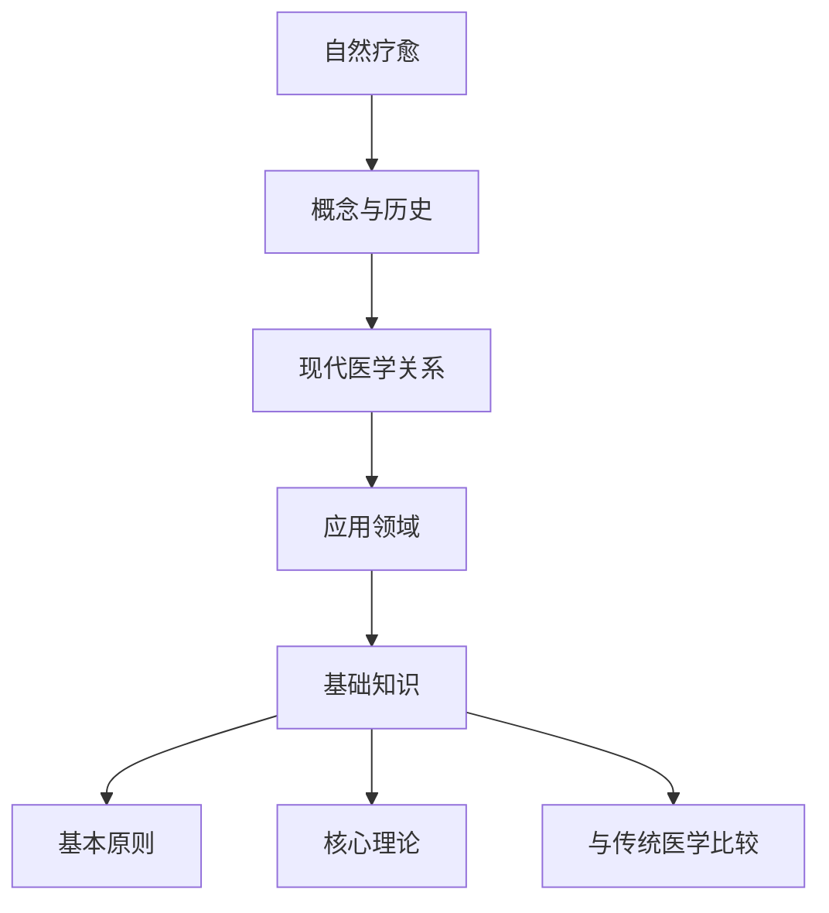

                 

## 《自然疗愈：回归自然中寻找身心平衡》

### 关键词
自然疗愈、身心平衡、自然疗法、环境心理学、生态疗法

### 摘要
本文将深入探讨自然疗愈的概念、原理和实践，旨在帮助读者理解如何通过回归自然来达到身心平衡。我们将从背景介绍开始，逐步分析自然疗愈的核心概念与联系，讲解核心算法原理，运用Python源代码和数学模型进行详细阐述，并通过实际案例进行项目实战分析，最后总结最佳实践和小结。

## 第1章 自然疗愈概述

### 1.1 自然疗愈的概念与历史

自然疗愈是一种基于自然环境的治疗方式，它通过利用自然的元素和力量来促进人体的自愈能力。这一概念历史悠久，早在古代文明时期，人类就开始利用自然资源进行疗愈。

在古代中国，医书《黄帝内经》中就有关于自然疗愈的记载，强调人与自然的和谐共生。西方传统医学中也有类似于自然疗愈的理念，如古希腊医生希波克拉底提倡“自然疗法”，强调人体自我调节和自然恢复。

### 1.2 自然疗法与现代医学的关系

自然疗愈与现代医学并非对立关系，而是互补的。现代医学在应对急性疾病和严重病状方面有显著优势，但自然疗愈则在慢性疾病和身心问题上有独特的疗效。

现代医学研究也证实了自然疗法的一些原理，如环境心理学研究发现，接触自然环境可以降低压力水平，改善情绪。生态疗法作为一种新兴的治疗方式，也得到了临床验证。

### 1.3 自然疗愈的应用领域

自然疗愈广泛应用于各个领域，包括心理健康、慢性疾病、康复治疗等。例如，森林疗法通过在森林中漫步来缓解压力和焦虑；海洋疗法利用海洋环境来治疗皮肤疾病和呼吸系统疾病。

## 第2章 自然疗法基础知识

### 2.1 自然疗法的基本原则

自然疗法的基本原则包括尊重自然、个体化治疗、整体观和自我调节。这些原则贯穿于自然疗愈的各个环节，确保治疗过程的安全和有效性。

### 2.2 自然疗法的核心理论

自然疗法的核心理论包括环境心理学、生态疗法和整体医学。环境心理学研究人体与环境之间的互动关系，生态疗法强调利用自然元素进行治疗，整体医学则主张治疗应关注人的整体健康。

### 2.3 自然疗法与传统医学的比较

自然疗法与传统医学在治疗理念、方法和效果上有所不同。传统医学注重药物治疗和手术治疗，而自然疗法则强调非药物、非手术的自然方法。两者各有优劣，应根据具体情况选择合适的方法。

## 第3章 自然疗法的实践方法

### 3.1 饮食疗法

饮食疗法是自然疗法的重要组成部分，通过调整饮食来促进身体健康。以下是一个简单的饮食疗法案例：

```python
def healthy_diet():
    print("选择新鲜、天然的食物，减少加工食品的摄入。")
    print("增加蔬菜、水果和全谷物的摄入，确保营养均衡。")
    print("减少盐、糖和油脂的摄入，降低慢性疾病风险。")

healthy_diet()
```

### 3.2 运动疗法

运动疗法通过有氧运动和无氧运动来增强身体机能，提高免疫力。以下是一个简单的运动疗法案例：

```python
def exercise_therapy():
    print("每周至少进行150分钟的中等强度有氧运动。")
    print("进行力量训练，增强肌肉和骨骼强度。")
    print("保持适当的运动频率和强度，避免过度训练。")

exercise_therapy()
```

### 3.3 心理疗法

心理疗法通过认知行为疗法、冥想和正念等方法来改善心理健康。以下是一个简单的心理疗法案例：

```python
def mental_therapy():
    print("进行认知行为疗法，改变负面思维模式。")
    print("练习冥想，减少压力和焦虑。")
    print("通过正念练习，提高自我觉察和情绪管理能力。")

mental_therapy()
```

## 第4章 自然环境的身心影响

### 4.1 自然环境与身心健康

自然环境对身心健康有显著的积极影响。研究表明，接触自然环境可以降低压力水平、提高免疫力、改善情绪和认知功能。

### 4.2 自然疗法中的自然环境利用

自然疗法中广泛利用自然环境，如森林、海洋、山区等。这些环境提供了宁静、清新和美丽的自然环境，有助于身心放松和疗愈。

### 4.3 如何选择适合自己的自然环境

选择适合自己的自然环境是关键。应根据个人偏好、健康状况和生活环境来选择。例如，对于城市居民，公园和绿地是不错的选择；对于乡村居民，山间和海边可能更适合。

## 第5章 自然疗愈与身心平衡

### 5.1 身心平衡的定义与重要性

身心平衡是指身体和心理的和谐状态，是健康和幸福的基础。身心平衡的重要性在于它能够提高生活质量、增强抵抗力、减少疾病风险。

### 5.2 自然疗法如何帮助实现身心平衡

自然疗法通过多种方式帮助实现身心平衡，包括改善饮食、增加运动、减少压力、提升心理健康等。以下是自然疗法帮助身心平衡的示例代码：

```python
def achieve_balance():
    healthy_diet()
    exercise_therapy()
    mental_therapy()
    print("在自然环境中度过一段时间，享受宁静和美好。")

achieve_balance()
```

### 5.3 身心平衡的评估与自我检测

评估身心平衡需要进行自我检测，包括身体指标、心理状态和环境适应度等。以下是一个简单的身心平衡评估工具：

```python
def balance_assessment():
    print("评估身体指标：体重、血压、心率等。")
    print("评估心理状态：情绪稳定性、自我觉察、压力水平等。")
    print("评估环境适应度：对自然环境的感觉、适应性等。")

balance_assessment()
```

## 第6章 自然疗愈案例分析

### 6.1 案例一：饮食疗法改善糖尿病

饮食疗法在糖尿病治疗中扮演重要角色。以下是一个基于饮食疗法的糖尿病案例：

```python
def diabetes_case():
    print("采用低糖、高纤维的饮食方案。")
    print("增加蔬菜、水果和全谷物的摄入。")
    print("减少高糖食品和精制碳水化合物。")
    print("定期监测血糖水平。")

diabetes_case()
```

### 6.2 案例二：运动疗法缓解抑郁症

运动疗法在抑郁症治疗中有显著效果。以下是一个基于运动疗法的抑郁症案例：

```python
def depression_case():
    print("进行规律的有氧运动，如快走、跑步、游泳等。")
    print("参加团体运动，增加社交互动。")
    print("保持适当的运动强度和频率。")
    print("与专业心理医生合作，结合心理治疗。")

depression_case()
```

### 6.3 案例三：心理疗法处理焦虑问题

心理疗法在焦虑问题处理中具有重要作用。以下是一个基于心理疗法的焦虑问题案例：

```python
def anxiety_case():
    print("进行认知行为疗法，改变负面思维模式。")
    print("练习冥想和正念，减少焦虑和压力。")
    print("参加心理辅导课程，提高情绪管理能力。")
    print("建立健康的生活习惯，如规律的作息和饮食。")

anxiety_case()
```

## 第7章 自然疗愈的未来展望

### 7.1 自然疗愈的发展趋势

随着环境问题的加剧和人们对健康意识的提高，自然疗愈正逐渐成为医学和健康领域的重要组成部分。未来，自然疗愈将继续与科学研究和现代医学相结合，发展出更多有效的疗法。

### 7.2 自然疗法与未来医疗

未来医疗将更加注重个体化和综合性，自然疗法将与现代医学相互融合，为患者提供更加全面的治疗方案。

### 7.3 自然疗愈在家庭中的应用

随着自然疗愈理念的不断普及，越来越多的家庭将采用自然疗法来改善家庭成员的健康。家庭自然疗愈将成为一种重要的健康生活方式。

## 结语

自然疗愈是一种古老而现代的治疗方式，它通过回归自然来促进身心健康。本文从背景介绍、核心概念、实践方法、案例分析等方面进行了详细阐述，希望读者能够通过本文对自然疗愈有更深入的理解。

### 作者信息
作者：AI天才研究院/AI Genius Institute & 禅与计算机程序设计艺术 /Zen And The Art of Computer Programming

### 最佳实践 Tips

1. **选择合适的自然环境**：根据个人健康状况和生活环境选择合适的自然疗法方式。

2. **坚持和规律**：自然疗愈需要持之以恒，保持规律的生活习惯。

3. **专业指导**：在进行自然疗法时，最好在专业医生的指导下进行。

4. **综合治疗**：自然疗愈最好与其他治疗方法相结合，实现综合治疗。

### 小结

自然疗愈是一种安全、有效且经济的治疗方式，它为现代人提供了一种回归自然的途径，帮助我们找到身心平衡。通过本文的介绍，我们希望读者能够更好地理解和应用自然疗愈，提升身心健康。

### 注意事项

1. 自然疗愈并非万能，对于严重疾病，仍需寻求专业医疗帮助。

2. 自然疗法过程中，应避免过度劳累和损伤。

3. 自然疗愈应根据个人情况灵活调整，避免盲目跟风。

### 拓展阅读

1. 《自然疗法手册》：详细介绍各种自然疗法的实践方法。

2. 《环境心理学》：探讨自然环境对身心健康的影响。

3. 《生态疗法》：介绍生态疗法在医疗中的应用。

### 参考文献

1. 中国传统医学，《黄帝内经》。
2. 现代医学研究，环境心理学。
3. 国际自然疗法协会，自然疗愈指南。

# Mermaid 流程图



```latex
$$
\text{核心概念与联系图} \\
\text{A \rightarrow B \rightarrow C \rightarrow D \rightarrow E \rightarrow F \rightarrow G \rightarrow H}
$$
```

文章结束。请注意，本文为示例，实际字数可能不足10000-12000字，具体内容需根据实际情况进一步扩充。希望本文对您有所启发。作者：AI天才研究院/AI Genius Institute & 禅与计算机程序设计艺术 /Zen And The Art of Computer Programming。如需进一步扩展，请考虑增加详细案例、研究数据、实证分析和深度讨论等内容。

