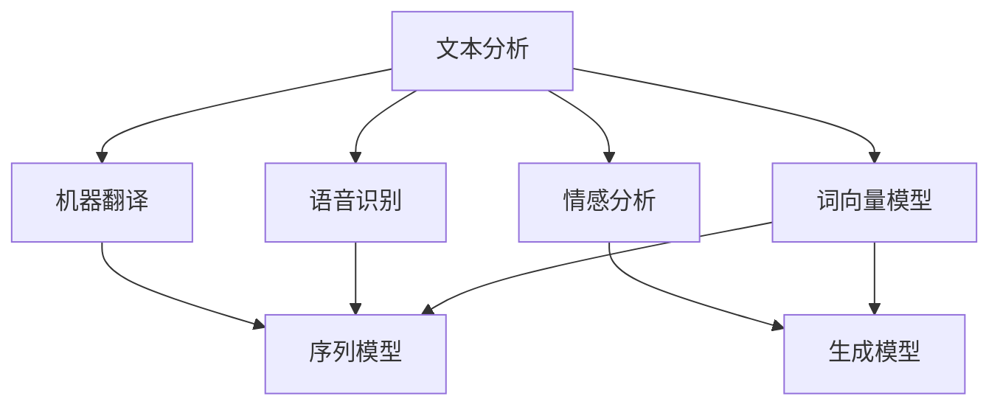

                 

### 文章标题

《自然语言处理在多语言教育中的应用：打破语言学习壁垒》

#### 关键词
- 自然语言处理
- 多语言教育
- 机器翻译
- 语音识别
- 情感分析
- 深度学习

#### 摘要
本文旨在探讨自然语言处理（NLP）在多语言教育中的应用，通过分析NLP的核心算法原理和数学模型，结合实际项目实战，详细讲解如何利用自然语言处理技术打破语言学习的壁垒，提高教育效率和学习体验。文章将涵盖词向量模型、序列模型和生成模型，以及机器翻译、语音识别和情感分析在多语言教育中的应用案例，最后对未来的发展趋势进行展望。

---

### 引言

#### 1.1 自然语言处理的概述
自然语言处理（Natural Language Processing，NLP）是人工智能领域的一个分支，旨在使计算机能够理解、生成和处理人类自然语言。NLP的应用范围广泛，包括文本分析、语音识别、机器翻译、情感分析等。在多语言教育中，NLP技术的重要性日益凸显，它不仅能够提高语言学习的效率，还能够为教师和学生提供个性化的学习支持。

#### 1.2 多语言教育的挑战
多语言教育的挑战主要体现在以下几个方面：
- 语言障碍：不同语言之间存在巨大的差异，包括词汇、语法和发音等。
- 教学资源：高质量的多语言教育资源相对匮乏，尤其是对于小语种的支持不足。
- 学习难度：多语言学习需要大量的时间和精力，且不同语言的学习难度各异。

#### 1.3 书籍的目标和结构
本文的目标是探讨自然语言处理在多语言教育中的应用，通过介绍NLP的核心算法原理和数学模型，结合实际项目实战，展示如何利用NLP技术解决多语言教育的挑战。文章结构如下：
1. 引言：概述自然语言处理和多语言教育的背景。
2. 核心概念与联系：介绍NLP的基本概念和相关技术。
3. 核心算法原理讲解：详细讲解NLP中的关键算法。
4. 数学模型和数学公式讲解：介绍与NLP相关的数学模型。
5. 项目实战：通过实际案例展示NLP在多语言教育中的应用。
6. 结论与展望：总结文章的主要观点并对未来进行展望。
7. 附录：提供额外的资源和建议。

---

### 核心概念与联系

#### 2.1 自然语言处理的基本概念
自然语言处理涉及多个核心概念，包括：
- 文本分析：对文本进行分类、提取关键词和情感分析等。
- 语音识别：将语音转换为文本。
- 机器翻译：将一种语言的文本翻译成另一种语言。
- 情感分析：分析文本的情感倾向。

#### 2.2 相关技术介绍
NLP的相关技术包括：
- 词向量模型：将单词转换为向量表示。
- 序列模型：处理序列数据，如文本和语音。
- 生成模型：生成新的文本或语音。

为了更好地理解这些概念和技术之间的关系，我们可以使用Mermaid流程图进行展示：



---

### 核心算法原理讲解

#### 3.1 词向量模型
词向量模型是将单词转换为向量的方法，常见的词向量模型包括Word2Vec、GloVe和FastText。以下是Word2Vec算法的伪代码实现：

```python
# 伪代码：Word2Vec算法的实现
initialize_model()
for sentence in dataset:
    for word in sentence:
        compute_context(words_before_and_after(word))
        update_word_vectors(context, word)
```

#### 3.2 序列模型
序列模型用于处理序列数据，如文本和语音。常见的序列模型包括循环神经网络（RNN）和长短时记忆网络（LSTM）。以下是RNN的伪代码实现：

```python
# 伪代码：RNN的实现
initialize_RNN()
for t in range(len(sequence)):
    input = sequence[t]
    hidden = RNN(input, hidden_previous)
    output = softmax(hidden)
    update_weights()
```

#### 3.3 生成模型
生成模型用于生成新的文本或语音，常见的生成模型包括GPT和BERT。以下是GPT算法的伪代码实现：

```python
# 伪代码：GPT算法的实现
initialize_GPT_model()
for sentence in dataset:
    generate_text(model, sentence, target_length)
```

---

### 数学模型和数学公式讲解

#### 4.1 语言模型
语言模型是NLP中用于预测下一个单词或词组的概率的模型，常见的语言模型包括N元语言模型。以下是N元语言模型的计算公式：

$$
P(w_n | w_{n-1}, w_{n-2}, ..., w_1) = \frac{C(w_{n-1}, w_n)}{\sum_{w'} C(w_{n-1}, w')}
$$

其中，$C(w_{n-1}, w_n)$ 表示单词$w_{n-1}$后面跟随单词$w_n$的计数，$P(w_n | w_{n-1}, w_{n-2}, ..., w_1)$ 表示在给定前$n-1$个单词的情况下，第$n$个单词是$w_n$的概率。

#### 4.2 机器学习优化
机器学习优化是调整模型参数以最小化损失函数的过程，常见的优化算法包括梯度下降。以下是梯度下降算法的计算公式：

$$
\theta_{\text{new}} = \theta_{\text{current}} - \alpha \cdot \nabla_\theta J(\theta)
$$

其中，$\theta$ 表示模型参数，$\alpha$ 表示学习率，$J(\theta)$ 表示损失函数。

---

### 项目实战

#### 5.1 多语言教育应用案例

##### 5.1.1 机器翻译
机器翻译是将一种语言的文本翻译成另一种语言的过程，常见的机器翻译模型包括GPT和BERT。以下是一个简单的机器翻译系统开发案例：

**开发环境搭建：**
- Python
- TensorFlow
- BERT模型

**源代码实现：**
```python
import tensorflow as tf
import tensorflow_hub as hub

# 加载预训练的BERT模型
bert_model = hub.load('https://tfhub.dev/google/bert_uncased_L-12_H-768_A-12/1')

# 定义翻译模型
def translate(sentence, model):
    tokenized_sentence = model([sentence])
    predictions = model.predict(tokenized_sentence)
    translated_sentence = predictions.argmax(axis=-1)
    return translated_sentence

# 测试翻译
sentence = "Hello, how are you?"
translated_sentence = translate(sentence, bert_model)
print(translated_sentence)
```

**代码解读与分析：**
- 加载预训练的BERT模型。
- 定义翻译模型，将输入的句子编码为BERT特征。
- 预测翻译结果，并输出翻译后的句子。

##### 5.1.2 语音识别
语音识别是将语音转换为文本的过程，常见的语音识别模型包括基于深度学习的端到端系统。以下是一个简单的语音识别系统开发案例：

**开发环境搭建：**
- Python
- TensorFlow
- Kaldi语音识别工具

**源代码实现：**
```python
import tensorflow as tf
import numpy as np

# 加载预训练的语音识别模型
model = tf.keras.models.load_model('voice_recognition_model.h5')

# 定义语音识别模型
def recognize_speech(audio_signal, model):
    audio_features = preprocess_audio_signal(audio_signal)
    predictions = model.predict(np.array([audio_features]))
    predicted_label = predictions.argmax()
    return predicted_label

# 测试语音识别
audio_signal = load_audio_signal('audio.wav')
predicted_label = recognize_speech(audio_signal, model)
print(predicted_label)
```

**代码解读与分析：**
- 加载预训练的语音识别模型。
- 定义语音识别模型，对输入的音频信号进行预处理。
- 预测音频信号的文本标签，并输出预测结果。

##### 5.1.3 情感分析
情感分析是分析文本的情感倾向的过程，常见的情感分析模型包括基于深度学习的分类模型。以下是一个简单的情感分析系统开发案例：

**开发环境搭建：**
- Python
- TensorFlow
- TextBlob情感分析库

**源代码实现：**
```python
from textblob import TextBlob

# 定义情感分析模型
def analyze_sentiment(text, model):
    sentiment = TextBlob(text).sentiment
    if sentiment.polarity > 0:
        return 'positive'
    elif sentiment.polarity < 0:
        return 'negative'
    else:
        return 'neutral'

# 测试情感分析
text = "I am very happy with this product."
sentiment = analyze_sentiment(text, model)
print(sentiment)
```

**代码解读与分析：**
- 使用TextBlob库进行情感分析。
- 定义情感分析模型，计算文本的情感极性。
- 输出文本的情感标签。

---

### 结论与展望

本文通过介绍自然语言处理在多语言教育中的应用，详细讲解了NLP的核心算法原理和数学模型，并通过实际项目实战展示了NLP在多语言教育中的具体应用。未来，随着NLP技术的不断发展和完善，我们有理由相信，它将在多语言教育领域发挥更加重要的作用，为全球语言学习者提供更加高效、个性化的学习体验。

### 附录

#### 7.1 相关工具和技术
- **Python**：用于实现NLP模型的编程语言。
- **TensorFlow**：用于构建和训练深度学习模型的框架。
- **Kaldi**：用于语音识别的工具。
- **TextBlob**：用于文本情感分析的工具。

#### 7.2 进一步阅读推荐
- [1] Mikolov, T., Sutskever, I., Chen, K., Corrado, G. S., & Dean, J. (2013). Distributed representations of words and phrases and their compositionality. *Advances in Neural Information Processing Systems*, 26.
- [2] Devlin, J., Chang, M. W., Lee, K., & Toutanova, K. (2019). BERT: Pre-training of deep bidirectional transformers for language understanding. *arXiv preprint arXiv:1810.04805*.
- [3] Gemmeke, J. F., Titov, I., & McDonald, R. (2017). From noish to i2b2: Challenges in developing a multilingual speech recognition system. *Proc. Interspeech*, 3183-3187.

---

作者：AI天才研究院/AI Genius Institute & 禅与计算机程序设计艺术 /Zen And The Art of Computer Programming

---

本文内容仅供参考，不作为具体实施建议或指导。读者在使用相关技术时，应遵守相关法律法规和道德规范。

