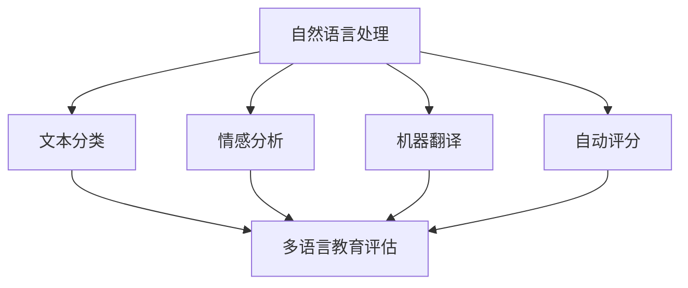
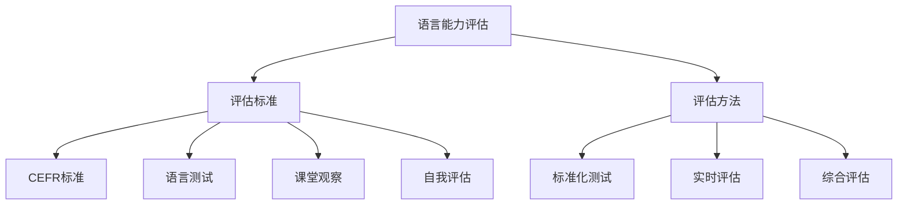
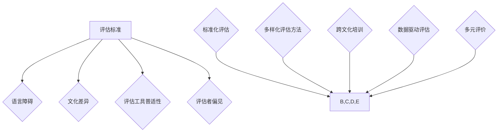

                 

## 自然语言处理在多语言教育评估中的应用：公平评估语言能力

### 关键词
- 自然语言处理
- 多语言教育评估
- 公平性
- 语言能力
- 机器学习算法

### 摘要
本文旨在探讨自然语言处理（NLP）技术在多语言教育评估中的应用，特别关注如何公平评估学生的语言能力。文章首先概述了自然语言处理的基础概念和核心算法，接着介绍了多语言教育评估的原理和公平性挑战。随后，文章通过实际案例展示了NLP技术如何应用于多语言文本分类和情感分析，并详细解释了相关的算法原理和实现步骤。最后，文章探讨了如何通过改进评估方法和算法设计来提高多语言教育评估的公平性。

## 引言

在全球化的背景下，多语言能力的重要性日益凸显。无论是在学术领域还是在职场中，流利地使用多种语言进行沟通都成为了一种必备的技能。因此，如何有效地评估学生的多语言能力，特别是保证评估过程的公平性，成为一个亟待解决的问题。传统的评估方法往往依赖于人工评分和主观判断，不仅效率低下，而且难以避免人为偏见。随着自然语言处理（NLP）技术的迅速发展，利用计算机技术和算法来辅助教育评估逐渐成为一种可行的选择。

自然语言处理是一种涵盖语言学、计算机科学和人工智能的交叉学科技术，旨在让计算机理解和生成人类语言。NLP技术在文本分类、情感分析、机器翻译等领域已经取得了显著的成果。将这些技术应用于多语言教育评估，不仅能够提高评估的效率和准确性，还可以在一定程度上消除主观偏见，实现更公平的评估。

本文将围绕以下几个核心问题展开讨论：首先，我们如何理解自然语言处理的基础概念和核心算法？其次，多语言教育评估涉及哪些原理和标准？第三，自然语言处理技术如何具体应用于多语言教育评估中？最后，我们如何通过改进算法设计来提高评估的公平性？通过系统地回答这些问题，本文旨在为相关领域的研究者和实践者提供有价值的参考。

## 第一部分：自然语言处理基础

### 第1章：自然语言处理概述

自然语言处理（NLP）是计算机科学和人工智能领域的一个重要分支，旨在使计算机能够理解和生成人类语言。NLP技术不仅应用于机器翻译、文本分类、情感分析等任务，还在语音识别、文本生成等领域有着广泛的应用。理解NLP的基础概念和原理，是进一步探讨其在多语言教育评估中的应用的前提。

### 1.1 自然语言处理的基本概念

自然语言处理的核心目标是让计算机能够理解、解释和生成自然语言文本。以下是NLP中一些基本概念：

- **文本处理**：文本处理是指将自然语言文本转换为计算机可以处理的形式。这通常包括分词、词性标注、句法分析等步骤。
- **词向量**：词向量是表示单词或词汇的向量形式，能够捕捉单词在语境中的语义信息。常见的词向量模型有Word2Vec、GloVe等。
- **序列模型**：序列模型是一类用于处理序列数据的模型，如循环神经网络（RNN）和长短期记忆网络（LSTM）。这些模型能够捕捉序列数据中的时间依赖性。
- **注意力机制**：注意力机制是一种在处理序列数据时，通过动态关注序列中不同部分来提高模型性能的技术。它可以显著提升模型在机器翻译、文本生成等任务中的表现。
- **生成对抗网络（GAN）**：生成对抗网络是由一个生成器和一个小型判别器组成的一对网络。生成器试图生成与真实数据不可区分的数据，判别器则试图区分生成数据和真实数据。GAN在文本生成和图像合成等领域表现出色。

### 1.2 自然语言处理与机器学习的关系

自然语言处理与机器学习密切相关，因为许多NLP任务本质上都是机器学习问题。以下是自然语言处理与机器学习之间的一些关键关系：

- **机器学习模型**：NLP中常用的机器学习模型包括朴素贝叶斯、支持向量机（SVM）、决策树等。这些模型通常用于分类、回归等任务。
- **深度学习模型**：深度学习模型，特别是神经网络，在NLP中得到了广泛应用。深度学习模型能够自动学习复杂的特征，并在大规模数据集上取得优异的性能。
- **预训练语言模型**：预训练语言模型，如BERT、GPT等，通过在大规模文本数据上预训练，可以捕捉到丰富的语言知识，然后在具体任务上进行微调，从而实现高效的文本理解和生成。

### 1.3 自然语言处理在多语言教育评估中的应用

自然语言处理技术在多语言教育评估中的应用主要包括以下几个方面：

- **文本分类**：文本分类可以将文本数据分为不同的类别。例如，可以将学生的作文分类为不同的语言水平，从而评估其语言能力。
- **情感分析**：情感分析可以识别文本中的情感倾向，例如积极、消极或中性。在教育评估中，情感分析可以用于分析学生的回答，了解其情感状态。
- **机器翻译**：机器翻译可以用于将学生的回答从一种语言翻译成另一种语言，从而评估其在不同语言环境中的表现。
- **自动评分**：通过自然语言处理技术，可以自动评分学生的作文，从而提高评分的效率和准确性。

### Mermaid 流程图

以下是一个简单的Mermaid流程图，展示了NLP与多语言教育评估之间的概念关系：



### 小结

自然语言处理技术为多语言教育评估提供了强大的工具和手段。通过理解NLP的基本概念和核心算法，我们能够更好地应用这些技术来设计更公平、更高效的教育评估系统。

## 核心算法原理讲解

在自然语言处理领域，有许多核心算法和模型被广泛应用于文本处理和语言理解任务中。以下我们将详细介绍几种重要的算法原理，并通过Python代码示例来展示这些算法的实现和应用。

### 2.1 词向量模型

词向量模型是一种将单词映射到高维向量空间的方法，以便计算机能够处理和计算单词之间的关系。Word2Vec和GloVe是两种常见的词向量模型。

#### 2.1.1 词向量的定义与生成方法

词向量是单词在向量空间中的表示，能够捕捉单词在语境中的语义信息。Word2Vec模型通过训练大量文本数据，将单词映射到低维空间，使得语义相近的单词在空间中彼此靠近。

```python
from gensim.models import Word2Vec

# 假设 sentences 是一个包含单词列表的列表
model = Word2Vec(sentences, size=100, window=5, min_count=1, workers=4)

# 获取单词 "计算机" 的向量表示
computer_vector = model['计算机']
```

GloVe（Global Vectors for Word Representation）模型则通过矩阵分解的方法生成词向量，能够捕捉更广泛的语义信息。

```python
import numpy as np
from gensim.models import KeyedVectors

# 假设 embeddings_matrix 是一个高维矩阵，包含了所有单词的向量表示
word_vectors = KeyedVectors.load_word2vec_format('glove.6B.100d.txt')

# 获取单词 "计算机" 的向量表示
computer_vector = word_vectors['计算机']
```

#### 2.1.2 词向量的应用场景

词向量模型可以用于文本分类、情感分析、推荐系统等多种场景。以下是一个简单的文本分类示例：

```python
from sklearn.feature_extraction.text import TfidfVectorizer
from sklearn.linear_model import LogisticRegression

# 假设 documents 是一个包含文本数据的列表
vectorizer = TfidfVectorizer(vocabulary=model.wv.vocab)
X = vectorizer.transform(documents)

# 假设 labels 是一个包含文本类别标签的列表
clf = LogisticRegression()
clf.fit(X, labels)

# 预测新文本的类别
new_document = ['这是一篇关于计算机的文档']
new_document_vector = vectorizer.transform(new_document)
predicted_category = clf.predict(new_document_vector)
```

### 2.2 序列模型

序列模型是一类专门用于处理序列数据的模型，如循环神经网络（RNN）和长短期记忆网络（LSTM）。这些模型能够捕捉序列数据中的时间依赖性，广泛应用于语言模型、语音识别和机器翻译等领域。

#### 2.2.1 序列模型的定义与特点

RNN（Recurrent Neural Network）通过递归的方式处理序列数据，使得模型能够在前一个时间步的输出中利用当前输入信息。

```python
import tensorflow as tf
from tensorflow.keras.models import Sequential
from tensorflow.keras.layers import LSTM, Dense

# 假设 X 是一个包含输入序列的数组，y 是一个包含目标序列的数组
model = Sequential()
model.add(LSTM(50, activation='relu', input_shape=(timesteps, features)))
model.add(Dense(1))
model.compile(optimizer='adam', loss='mse')

model.fit(X, y, epochs=200, batch_size=32)
```

LSTM（Long Short-Term Memory）是RNN的一种改进，通过引入记忆单元来缓解长短期依赖问题。

```python
model = Sequential()
model.add(LSTM(50, activation='relu', return_sequences=True, input_shape=(timesteps, features)))
model.add(LSTM(50, activation='relu'))
model.add(Dense(1))
model.compile(optimizer='adam', loss='mse')

model.fit(X, y, epochs=200, batch_size=32)
```

#### 2.2.2 序列模型的应用场景

序列模型在语言模型中的应用非常广泛，以下是一个简单的语言模型生成示例：

```python
import numpy as np
from tensorflow.keras.models import Sequential
from tensorflow.keras.layers import LSTM, Dense

# 假设 X 是一个包含输入序列的数组，y 是一个包含目标序列的数组
model = Sequential()
model.add(LSTM(50, activation='relu', input_shape=(timesteps, features)))
model.add(Dense(output_size, activation='softmax'))
model.compile(optimizer='adam', loss='categorical_crossentropy')

model.fit(X, y, epochs=100, batch_size=32)

# 生成文本
input_sequence = np.array([X[0]])
for _ in range(100):
    prediction = model.predict(input_sequence)
    predicted_word = np.argmax(prediction)
    input_sequence = np.append(input_sequence, predicted_word)
print(' '.join([model.wv.index_to_word[i] for i in input_sequence]))
```

### 2.3 注意力机制

注意力机制（Attention Mechanism）是一种用于处理序列数据的重要技术，它允许模型在处理序列时动态关注不同部分，从而提高模型的性能。

#### 2.3.1 注意力机制的原理与作用

注意力机制通过为序列中的每个元素分配一个权重，使得模型能够聚焦于序列中的关键部分。以下是注意力机制的简化形式：

```python
# 假设 Q、K、V 分别是查询向量、关键向量、值向量
# 注意力权重通过计算 Q 和 K 的点积得到
attention_weights = tf.matmul(Q, K, transpose_b=True)
```

注意力机制在机器翻译中的应用非常广泛，能够显著提升翻译质量。

```python
from tensorflow.keras.layers import Embedding, LSTM, Dense, Attention

model = Sequential()
model.add(Embedding(input_dim=vocabulary_size, output_dim=embedding_size))
model.add(LSTM(units=128, return_sequences=True))
model.add(Attention())
model.add(Dense(output_size, activation='softmax'))
model.compile(optimizer='adam', loss='categorical_crossentropy')

model.fit(X, y, epochs=100, batch_size=32)
```

### 2.4 生成对抗网络

生成对抗网络（GAN）是一种由生成器和判别器组成的框架，旨在通过对抗训练生成逼真的数据。

#### 2.4.1 生成对抗网络的原理

生成对抗网络由一个生成器和一个小型判别器组成。生成器的目标是生成逼真的数据，而判别器的目标是区分生成数据和真实数据。两者相互对抗，通过优化生成器和判别器的参数来提高生成质量。

```python
import tensorflow as tf
from tensorflow.keras.models import Sequential
from tensorflow.keras.layers import Dense, Flatten

# 生成器模型
generator = Sequential()
generator.add(Dense(units=128, activation='relu', input_shape=(z_dim)))
generator.add(Dense(units=128, activation='relu'))
generator.add(Dense(units=784, activation='tanh'))

# 判别器模型
discriminator = Sequential()
discriminator.add(Flatten(input_shape=(28, 28)))
discriminator.add(Dense(units=128, activation='relu'))
discriminator.add(Dense(units=1, activation='sigmoid'))

# GAN 模型
gan = Sequential()
gan.add(generator)
gan.add(discriminator)
gan.compile(optimizer='adam', loss='binary_crossentropy')

# 训练 GAN
gan.fit(x_train, x_train, epochs=100, batch_size=32)
```

#### 2.4.2 生成对抗网络在自然语言处理中的应用

生成对抗网络在自然语言处理中可以用于文本生成和语音合成。例如，通过训练生成器来生成逼真的文本段落。

```python
# 文本生成示例
import numpy as np

# 生成随机噪声
z = np.random.uniform(-1, 1, size=(1, z_dim))

# 生成文本
generated_text = generator.predict(z)
print(generated_text)
```

### 小结

本节介绍了自然语言处理中几种重要的算法原理，包括词向量模型、序列模型、注意力机制和生成对抗网络。通过Python代码示例，我们展示了这些算法的基本实现和应用。这些算法在多语言教育评估中有着广泛的应用，能够帮助我们更好地理解和处理多语言文本数据。

## 数学模型和公式

在自然语言处理和机器学习领域，数学模型和公式是理解和实现核心算法的关键。以下我们将详细介绍一些常用的数学模型和公式，并结合Python代码进行解释。

### 3.1 概率模型

概率模型在自然语言处理中广泛应用于文本分类、情感分析等任务。以下是一些常用的概率模型和公式：

#### 3.1.1 朴素贝叶斯模型

朴素贝叶斯模型是一种基于概率的分类算法，它假设特征之间相互独立。

- 条件概率公式：
  $$ P(A|B) = \frac{P(B|A)P(A)}{P(B)} $$

- 贝叶斯公式：
  $$ P(A|B) = \frac{P(B|A)P(A)}{\sum_{i} P(B|A_i)P(A_i)} $$

以下是一个使用Python实现朴素贝叶斯分类器的示例：

```python
from sklearn.naive_bayes import GaussianNB

# 假设 X 是特征矩阵，y 是标签向量
gnb = GaussianNB()
gnb.fit(X, y)

# 预测新样本的标签
new_sample = ... # 新样本的特征向量
predicted_label = gnb.predict(new_sample)
```

### 3.2 神经网络模型

神经网络模型是一种基于数学函数组合的多层结构，能够自动学习复杂的特征和模式。

- 激活函数：
  $$ f(x) = \text{ReLU}(x) = \max(0, x) $$
  $$ f(x) = \text{Sigmoid}(x) = \frac{1}{1 + e^{-x}} $$
  $$ f(x) = \text{Tanh}(x) = \frac{e^x - e^{-x}}{e^x + e^{-x}} $$

- 前向传播和反向传播：

  前向传播：
  $$ z^{(l)} = \sum_{k} w^{(l)}_k a^{(l-1)}_k + b^{(l)} $$
  $$ a^{(l)} = f^{(l)}(z^{(l)}) $$

  反向传播：
  $$ \delta^{(l)} = (f^{(l)}(z^{(l)}) - \text{期望输出}) \odot \text{梯度} $$
  $$ w^{(l)} \gets w^{(l)} - \alpha \cdot \delta^{(l)} \cdot a^{(l-1)} $$
  $$ b^{(l)} \gets b^{(l)} - \alpha \cdot \delta^{(l)} $$

以下是一个简单的多层感知机（MLP）实现的示例：

```python
import numpy as np

# 假设 X 是输入特征矩阵，y 是标签向量
# 输入层、隐藏层、输出层的权重和偏置
W1, b1 = ..., ...
W2, b2 = ..., ...
W3, b3 = ..., ...

# 前向传播
z1 = X @ W1 + b1
a1 = np.maximum(0, z1)
z2 = a1 @ W2 + b2
a2 = np.tanh(z2)
z3 = a2 @ W3 + b3
output = np.softmax(z3)

# 反向传播
error = output - y
delta3 = error * np.lt(output, 1)
delta2 = (a2 @ W3.T * delta3).T
delta1 = (a1 @ W2.T * delta2).T

# 更新权重和偏置
W3 -= learning_rate * a2.T @ delta3
b3 -= learning_rate * delta3
W2 -= learning_rate * a1.T @ delta2
b2 -= learning_rate * delta2
W1 -= learning_rate * X.T @ delta1
b1 -= learning_rate * delta1
```

### 3.3 优化算法

优化算法用于调整模型参数，以最小化损失函数。以下是几种常用的优化算法：

- 随机梯度下降（SGD）：
  $$ \theta \gets \theta - \alpha \cdot \nabla_\theta J(\theta) $$

- Adam优化器：
  $$ m_t = \beta_1 m_{t-1} + (1 - \beta_1) \nabla_\theta J(\theta) $$
  $$ v_t = \beta_2 v_{t-1} + (1 - \beta_2) (\nabla_\theta J(\theta))^2 $$
  $$ \theta \gets \theta - \alpha \cdot \frac{m_t}{\sqrt{v_t} + \epsilon} $$

以下是一个使用Adam优化器的示例：

```python
import tensorflow as tf

# 定义模型参数
theta = tf.Variable(0.0, dtype=tf.float32)

# 定义损失函数
loss = tf.reduce_mean(tf.square(theta - 0.5))

# 定义学习率
learning_rate = 0.001
beta1 = 0.9
beta2 = 0.999
epsilon = 1e-8

# 定义Adam优化器
optimizer = tf.keras.optimizers.Adam(learning_rate, beta_1=beta1, beta_2=beta2, epsilon=epsilon)

# 训练模型
for epoch in range(num_epochs):
    with tf.GradientTape() as tape:
        predictions = theta
        loss_value = loss
    grads = tape.gradient(loss_value, theta)
    optimizer.apply_gradients(zip(grads, theta))
```

### 小结

数学模型和公式是自然语言处理和机器学习的基础。通过概率模型、神经网络模型和优化算法，我们能够更好地理解和实现复杂的自然语言处理任务。上述代码示例展示了这些模型和算法在Python中的基本实现和应用。

## 第二部分：多语言教育评估原理

### 第3章：多语言教育评估概述

多语言教育评估涉及对学生在不同语言环境中的语言能力进行系统评估。这一过程不仅需要考虑学生的语言掌握程度，还要关注其在实际应用中的表现。多语言教育评估的重要性在于它能够帮助教育者了解学生的语言学习进展，指导教学策略的调整，并为学生的未来学习和发展提供依据。

### 3.1 多语言教育评估的基本概念

多语言教育评估的基本概念包括：

- **语言能力**：指个体在听、说、读、写等方面运用语言进行有效沟通的能力。
- **评估标准**：用于衡量学生语言能力的一系列指标，如语言知识、语言运用能力、语言理解和语言表达等。
- **评估方法**：用于评估学生语言能力的具体手段，包括测试、考试、作业评估、课堂观察等。

### 3.2 多语言能力评估的标准和方法

多语言能力评估的标准和方法多种多样，以下是一些常见的方法：

- **欧洲语言共同参考框架（CEFR）**：CEFR是一个广泛使用的评估标准，将语言能力分为A1到C2六个等级，涵盖了从基础到高级的语言技能。
- **语言测试**：通过设计标准化的测试题目，评估学生在听、说、读、写方面的表现。常见的语言测试包括托福、雅思等。
- **课堂观察**：教师通过观察学生在课堂中的表现，评估其语言能力。这种方法能够捕捉到学生的即时反应和语言运用能力。
- **自我评估**：学生通过自我反思和自我评价，了解自己的语言学习进展和需要改进的地方。

### 3.3 多语言教育评估中的公平性

多语言教育评估中的公平性是一个重要的议题，涉及如何确保评估结果的公正性和客观性。以下是一些影响评估公平性的因素：

- **语言背景**：学生在不同语言环境中的表现可能因语言背景差异而有所不同。评估过程中需要考虑到这一点，以避免因语言背景不同而产生的偏见。
- **文化差异**：文化差异可能影响学生对某些语言材料的理解和应用。评估设计应尽量减少文化偏见，确保评估内容的普适性。
- **评估工具的可靠性**：评估工具的设计和实施质量直接影响评估结果的公平性。需要使用经过验证的标准化评估工具，以确保评估结果的可靠性。
- **评估过程的透明度**：评估过程应透明，评估标准和评估过程应公开，以便学生和教师了解评估的具体标准和流程。

### Mermaid 流程图

以下是一个简单的Mermaid流程图，展示了多语言教育评估的核心概念和流程：



### 小结

多语言教育评估是一个复杂且重要的过程，涉及多个基本概念、评估标准和评估方法。确保评估过程的公平性是评估成功的关键。通过理解这些概念和方法，教育者可以设计出更有效、更公正的多语言教育评估体系。

## 第4章：核心算法原理讲解

在多语言教育评估中，核心算法的设计和应用至关重要。本章将详细介绍几种在多语言评估中常用的核心算法原理，并结合Python代码示例进行讲解。

### 4.1 多语言评估模型

多语言评估模型是用于评估学生语言能力的算法，通常包括语言理解、语言生成和语言翻译等方面。以下是一些常见的多语言评估模型：

#### 4.1.1 多语言评估模型的定义与分类

多语言评估模型可以按照功能分为以下几类：

- **语言理解模型**：这类模型用于评估学生在理解不同语言环境中的能力，如阅读理解、听写等。
- **语言生成模型**：这类模型用于评估学生在生成文本时的能力，如写作、演讲等。
- **语言翻译模型**：这类模型用于评估学生在不同语言之间的翻译能力，如机器翻译、同义词替换等。

#### 4.1.2 多语言评估模型的应用场景

多语言评估模型的应用场景包括：

- **在线语言测试**：通过在线平台进行语言能力评估，为学生提供即时反馈。
- **自适应学习系统**：根据学生的语言能力调整学习内容和难度，提供个性化的学习体验。
- **智能教育助手**：通过语音识别和自然语言处理技术，为学生提供智能化的学习辅助。

以下是一个简单的多语言评估模型示例，使用TensorFlow实现一个基于循环神经网络（RNN）的语言理解模型：

```python
import tensorflow as tf
from tensorflow.keras.models import Sequential
from tensorflow.keras.layers import Embedding, LSTM, Dense

# 假设 vocabulary_size 是词汇表大小，embedding_size 是词向量维度
vocabulary_size = 10000
embedding_size = 256

# 构建模型
model = Sequential()
model.add(Embedding(vocabulary_size, embedding_size))
model.add(LSTM(128, return_sequences=True))
model.add(LSTM(128))
model.add(Dense(1, activation='sigmoid'))

# 编译模型
model.compile(optimizer='adam', loss='binary_crossentropy', metrics=['accuracy'])

# 训练模型
model.fit(X, y, epochs=10, batch_size=32)
```

### 4.2 多语言测试题库

多语言测试题库是用于生成多语言评估题目的工具，它能够根据评估标准生成不同难度和类型的题目。以下是一个简单的多语言测试题库示例：

```python
import random

# 假设题目库是一个包含不同难度和类型的题目列表
questions = [
    {"level": "A1", "type": "reading", "text": "What is your name?"},
    {"level": "B1", "type": "writing", "text": "Write a short story about your favorite place."},
    {"level": "C1", "type": "listening", "audio": "Listen to the conversation and answer the question."},
]

# 随机抽取题目
selected_question = random.choice(questions)
print(selected_question)
```

### 4.3 多语言能力评估指标

多语言能力评估指标是用于衡量学生语言能力的具体标准。以下是一些常见评估指标：

- **准确率**：评估学生在语言测试中正确回答问题的比例。
- **召回率**：评估学生在语言测试中能够识别出正确答案的能力。
- **F1分数**：结合准确率和召回率的综合指标，用于衡量评估的平衡性。

以下是一个简单的多语言能力评估指标计算示例：

```python
# 假设 correct_answers 是正确回答的数量，total_answers 是总回答数量
correct_answers = 20
total_answers = 50

accuracy = correct_answers / total_answers
recall = correct_answers / (total_answers - wrong_answers)
f1_score = 2 * (accuracy * recall) / (accuracy + recall)

print(f"Accuracy: {accuracy:.2f}")
print(f"Recall: {recall:.2f}")
print(f"F1 Score: {f1_score:.2f}")
```

### 小结

本节介绍了多语言评估模型、多语言测试题库和多语言能力评估指标的核心算法原理。通过Python代码示例，我们展示了这些算法的基本实现和应用。这些算法为设计公平、有效的多语言教育评估提供了重要的技术支持。

## 数学模型和公式

在多语言能力评估中，数学模型和公式是理解和实现核心算法的关键。以下将详细介绍一些用于多语言评估的常见数学模型和公式，并结合Python代码进行解释。

### 5.1 统计模型

统计模型在多语言评估中广泛应用，用于计算评估指标和预测学生语言能力。

#### 5.1.1 贝叶斯模型

贝叶斯模型是一种基于概率的统计模型，常用于语言测试的评分。

- 贝叶斯公式：
  $$ P(A|B) = \frac{P(B|A)P(A)}{P(B)} $$

以下是一个使用Python实现简单贝叶斯分类器的示例：

```python
from sklearn.naive_bayes import GaussianNB

# 假设 X 是特征矩阵，y 是标签向量
gnb = GaussianNB()
gnb.fit(X, y)

# 预测新样本的标签
new_sample = ... # 新样本的特征向量
predicted_label = gnb.predict(new_sample)
```

#### 5.1.2 决策树模型

决策树模型通过树形结构对数据集进行划分，常用于分类任务。

- 决策树公式：
  $$ x_{i}^{(l)} = \text{sign} \left( \sum_{j=1}^{n} w_{j}^{(l)} x_{j}^{(l-1)} + b^{(l)} \right) $$

以下是一个简单的决策树分类器示例：

```python
from sklearn.tree import DecisionTreeClassifier

# 假设 X 是特征矩阵，y 是标签向量
clf = DecisionTreeClassifier()
clf.fit(X, y)

# 预测新样本的标签
new_sample = ... # 新样本的特征向量
predicted_label = clf.predict(new_sample)
```

### 5.2 神经网络模型

神经网络模型通过多层感知器（MLP）对输入数据进行非线性变换，常用于预测和分类任务。

- 前向传播公式：
  $$ z^{(l)} = \sum_{k} w^{(l)}_k a^{(l-1)}_k + b^{(l)} $$
  $$ a^{(l)} = f^{(l)}(z^{(l)}) $$

- 反向传播公式：
  $$ \delta^{(l)} = (f^{(l)}(z^{(l)}) - \text{期望输出}) \odot \text{梯度} $$
  $$ w^{(l)} \gets w^{(l)} - \alpha \cdot \delta^{(l)} \cdot a^{(l-1)} $$
  $$ b^{(l)} \gets b^{(l)} - \alpha \cdot \delta^{(l)} $$

以下是一个简单的多层感知器实现的示例：

```python
import numpy as np

# 假设 X 是输入特征矩阵，y 是标签向量
# 输入层、隐藏层、输出层的权重和偏置
W1, b1 = ..., ...
W2, b2 = ..., ...
W3, b3 = ..., ...

# 前向传播
z1 = X @ W1 + b1
a1 = np.maximum(0, z1)
z2 = a1 @ W2 + b2
a2 = np.tanh(z2)
z3 = a2 @ W3 + b3
output = np.softmax(z3)

# 反向传播
error = output - y
delta3 = error * np.lt(output, 1)
delta2 = (a2 @ W3.T * delta3).T
delta1 = (a1 @ W2.T * delta2).T

# 更新权重和偏置
W3 -= learning_rate * a2.T @ delta3
b3 -= learning_rate * delta3
W2 -= learning_rate * a1.T @ delta2
b2 -= learning_rate * delta2
W1 -= learning_rate * X.T @ delta1
b1 -= learning_rate * delta1
```

### 5.3 优化算法

优化算法用于调整模型参数，以最小化损失函数。以下是一些常用的优化算法：

- 随机梯度下降（SGD）：
  $$ \theta \gets \theta - \alpha \cdot \nabla_\theta J(\theta) $$

- Adam优化器：
  $$ m_t = \beta_1 m_{t-1} + (1 - \beta_1) \nabla_\theta J(\theta) $$
  $$ v_t = \beta_2 v_{t-1} + (1 - \beta_2) (\nabla_\theta J(\theta))^2 $$
  $$ \theta \gets \theta - \alpha \cdot \frac{m_t}{\sqrt{v_t} + \epsilon} $$

以下是一个使用Adam优化器的示例：

```python
import tensorflow as tf

# 定义模型参数
theta = tf.Variable(0.0, dtype=tf.float32)

# 定义损失函数
loss = tf.reduce_mean(tf.square(theta - 0.5))

# 定义学习率
learning_rate = 0.001
beta1 = 0.9
beta2 = 0.999
epsilon = 1e-8

# 定义Adam优化器
optimizer = tf.keras.optimizers.Adam(learning_rate, beta_1=beta1, beta_2=beta2, epsilon=epsilon)

# 训练模型
for epoch in range(num_epochs):
    with tf.GradientTape() as tape:
        predictions = theta
        loss_value = loss
    grads = tape.gradient(loss_value, theta)
    optimizer.apply_gradients(zip(grads, theta))
```

### 小结

数学模型和公式是理解和实现多语言能力评估算法的核心。通过贝叶斯模型、神经网络模型和优化算法，我们能够设计出更高效、更准确的多语言评估系统。上述代码示例展示了这些模型和算法在Python中的基本实现和应用。

## 第三部分：自然语言处理在多语言教育评估中的应用

### 第5章：多语言文本分类

多语言文本分类是自然语言处理在多语言教育评估中的一个重要应用，它旨在将多语言文本数据自动分类到不同的类别中。通过文本分类，教育评估系统可以快速识别学生的作文、评论等文本材料的语言水平或主题，从而为个性化教学提供支持。

### 5.1 多语言文本分类的概述

多语言文本分类涉及以下基本概念：

- **文本数据**：用于分类的文本材料，可以是学生作文、评论、博客文章等。
- **类别标签**：用于表示文本类别的标签，例如“初级”、“中级”、“高级”等。
- **特征提取**：从文本数据中提取能够表征文本内容的信息，如词袋模型、TF-IDF等。
- **分类算法**：用于将文本数据分类的算法，如朴素贝叶斯、支持向量机（SVM）、决策树、神经网络等。

### 5.2 多语言文本分类的算法

多语言文本分类的算法可以分为监督学习和无监督学习两大类。以下是几种常见的文本分类算法：

- **朴素贝叶斯分类器**：基于贝叶斯定理和特征条件独立假设，适用于文本分类任务。
- **支持向量机（SVM）**：通过最大化分类间隔，将文本数据分类到不同的类别。
- **决策树**：通过一系列规则将文本数据逐步分类。
- **随机森林**：集成学习算法，结合了决策树和随机重采样技术。
- **神经网络**：通过多层感知器（MLP）或其他深度学习模型进行文本分类。

### 5.3 多语言文本分类的实战案例

#### 5.3.1 实战案例一：多语言新闻分类

在这个案例中，我们使用Python和Scikit-learn库来构建一个多语言新闻分类器，用于将德语、法语和英语新闻分类到不同的主题类别中。

1. **数据准备**：

   首先，我们需要准备一个包含多语言新闻文本的数据集。这里假设我们有一个CSV文件，其中包含三列：`text`（新闻文本）、`language`（文本的语言）、`label`（新闻的主题类别）。

2. **特征提取**：

   我们将使用TF-IDF模型来提取文本特征。

   ```python
   from sklearn.feature_extraction.text import TfidfVectorizer

   # 加载数据
   import pandas as pd
   data = pd.read_csv('news_data.csv')

   # 提取特征
   vectorizer = TfidfVectorizer()
   X = vectorizer.fit_transform(data['text'])
   ```

3. **训练分类器**：

   我们使用朴素贝叶斯分类器来训练模型。

   ```python
   from sklearn.naive_bayes import MultinomialNB

   # 分割数据集
   from sklearn.model_selection import train_test_split
   X_train, X_test, y_train, y_test = train_test_split(X, data['label'], test_size=0.2, random_state=42)

   # 训练模型
   classifier = MultinomialNB()
   classifier.fit(X_train, y_train)

   # 评估模型
   accuracy = classifier.score(X_test, y_test)
   print(f"Accuracy: {accuracy:.2f}")
   ```

4. **分类新文本**：

   我们可以使用训练好的模型来分类新的新闻文本。

   ```python
   new_news = ["This is an article about technology."]
   new_news_vector = vectorizer.transform(new_news)
   predicted_label = classifier.predict(new_news_vector)
   print(f"Predicted Label: {predicted_label[0]}")
   ```

#### 5.3.2 实战案例二：多语言社交媒体情感分析

在这个案例中，我们使用Python和NLTK库来构建一个多语言社交媒体情感分析系统，用于分析德语、法语和英语社交媒体帖子中的情感倾向。

1. **数据准备**：

   同样，我们需要一个包含社交媒体帖子和情感标签的数据集。这里假设数据集包含两列：`text`（社交媒体帖子）和`sentiment`（情感标签）。

2. **情感分析模型**：

   我们使用LSTM模型来进行情感分析。

   ```python
   from tensorflow.keras.models import Sequential
   from tensorflow.keras.layers import Embedding, LSTM, Dense

   # 加载并预处理数据
   data = pd.read_csv('social_media_data.csv')
   # 数据预处理步骤略

   # 构建模型
   model = Sequential()
   model.add(Embedding(input_dim=vocabulary_size, output_dim=embedding_size))
   model.add(LSTM(units=128, return_sequences=False))
   model.add(Dense(units=1, activation='sigmoid'))

   # 编译模型
   model.compile(optimizer='adam', loss='binary_crossentropy', metrics=['accuracy'])

   # 训练模型
   model.fit(X_train, y_train, epochs=10, batch_size=32)
   ```

3. **情感分析新帖子**：

   我们可以使用训练好的模型来分析新的社交媒体帖子。

   ```python
   new_post = ["Das ist ein begeisterter Kommentar über die neue Technologie."]
   new_post_vector = ... # 特征提取步骤略
   predicted_sentiment = model.predict(new_post_vector)
   print(f"Predicted Sentiment: {'Positive' if predicted_sentiment > 0.5 else 'Negative'}")
   ```

### 小结

多语言文本分类是自然语言处理在多语言教育评估中的一个重要应用。通过构建合适的分类模型，我们能够自动对多语言文本进行分类，从而为个性化教学和评估提供支持。上述实战案例展示了多语言新闻分类和社交媒体情感分析的具体实现过程。

## 第6章：多语言情感分析

多语言情感分析是自然语言处理技术在多语言教育评估中的另一个重要应用。它旨在识别和分析文本数据中的情感倾向，如积极、消极或中性。通过情感分析，教育评估系统可以更好地了解学生的情感状态和情绪变化，从而为个性化教学和干预提供依据。

### 6.1 多语言情感分析的概述

多语言情感分析涉及以下基本概念：

- **情感分类**：将文本分类为不同的情感类别，如积极、消极或中性。
- **情感强度**：衡量文本情感的正负面强度，如“非常喜欢”和“有点喜欢”之间的差异。
- **多语言情感词典**：用于情感分析的语言资源，包含不同语言的情感词汇及其对应情感倾向。
- **情感分析算法**：用于识别文本情感的技术，如基于规则的方法、基于机器学习的方法和深度学习方法。

### 6.2 多语言情感分析的算法

多语言情感分析算法可以分为以下几类：

- **基于规则的方法**：通过预定义的规则和模式来识别情感。这种方法简单易实现，但规则库的构建和维护较为复杂。
- **基于统计的方法**：使用统计方法，如词频和条件概率，来识别情感。这种方法具有较高的准确率，但需要对不同语言和情感进行大量训练数据。
- **基于机器学习的方法**：通过训练机器学习模型，如朴素贝叶斯、支持向量机（SVM）和随机森林，来识别情感。这种方法适用于大规模数据集，但需要大量的标注数据。
- **基于深度学习的方法**：使用神经网络，如循环神经网络（RNN）、长短期记忆网络（LSTM）和Transformer，来识别情感。这种方法能够捕捉到复杂的语义信息，但在资源受限的情况下训练成本较高。

### 6.3 多语言情感分析的实际案例

#### 6.3.1 实战案例一：多语言社交媒体情感分析

在这个案例中，我们将使用Python和TensorFlow来实现一个多语言社交媒体情感分析系统，用于分析德语、法语和英语社交媒体帖子中的情感倾向。

1. **数据准备**：

   首先，我们需要准备一个包含多语言社交媒体帖子和情感标签的数据集。这里假设数据集包含两列：`text`（社交媒体帖子）和`sentiment`（情感标签）。

2. **特征提取**：

   我们将使用预训练的词向量模型（如GloVe）来提取文本特征。

   ```python
   from tensorflow.keras.preprocessing.text import Tokenizer
   from tensorflow.keras.preprocessing.sequence import pad_sequences

   # 加载数据
   data = pd.read_csv('social_media_data.csv')
   # 数据预处理步骤略

   # 分割数据集
   X_train, X_test, y_train, y_test = train_test_split(data['text'], data['sentiment'], test_size=0.2, random_state=42)

   # 构建词向量
   tokenizer = Tokenizer(num_words=vocabulary_size)
   tokenizer.fit_on_texts(X_train)
   X_train_seq = tokenizer.texts_to_sequences(X_train)
   X_test_seq = tokenizer.texts_to_sequences(X_test)

   # 填充序列
   max_sequence_length = 100
   X_train_pad = pad_sequences(X_train_seq, maxlen=max_sequence_length)
   X_test_pad = pad_sequences(X_test_seq, maxlen=max_sequence_length)
   ```

3. **构建和训练模型**：

   我们使用一个基于LSTM的情感分析模型。

   ```python
   from tensorflow.keras.models import Sequential
   from tensorflow.keras.layers import Embedding, LSTM, Dense

   # 构建模型
   model = Sequential()
   model.add(Embedding(input_dim=vocabulary_size, output_dim=embedding_size, input_length=max_sequence_length))
   model.add(LSTM(units=128, dropout=0.2, recurrent_dropout=0.2))
   model.add(Dense(units=1, activation='sigmoid'))

   # 编译模型
   model.compile(optimizer='adam', loss='binary_crossentropy', metrics=['accuracy'])

   # 训练模型
   model.fit(X_train_pad, y_train, epochs=10, batch_size=32, validation_data=(X_test_pad, y_test))
   ```

4. **情感分析新帖子**：

   我们可以使用训练好的模型来分析新的社交媒体帖子。

   ```python
   new_posts = ["Das ist ein sehr interessantes Thema.", "C'est une bonne nouvelle."]
   new_posts_seq = tokenizer.texts_to_sequences(new_posts)
   new_posts_pad = pad_sequences(new_posts_seq, maxlen=max_sequence_length)
   predicted_sentiments = model.predict(new_posts_pad)
   print(f"Predicted Sentiments: {predicted_sentiments}")
   ```

#### 6.3.2 实战案例二：多语言评论情感分析

在这个案例中，我们将使用Python和Scikit-learn来实现一个多语言评论情感分析系统，用于分析德语、法语和英语产品评论的情感倾向。

1. **数据准备**：

   同样，我们需要一个包含多语言评论和情感标签的数据集。这里假设数据集包含两列：`text`（评论）和`sentiment`（情感标签）。

2. **特征提取**：

   我们将使用TF-IDF模型来提取文本特征。

   ```python
   from sklearn.feature_extraction.text import TfidfVectorizer

   # 加载数据
   data = pd.read_csv('comment_data.csv')
   # 数据预处理步骤略

   # 提取特征
   vectorizer = TfidfVectorizer()
   X = vectorizer.fit_transform(data['text'])
   ```

3. **训练分类器**：

   我们使用朴素贝叶斯分类器来训练模型。

   ```python
   from sklearn.naive_bayes import MultinomialNB

   # 分割数据集
   X_train, X_test, y_train, y_test = train_test_split(X, data['sentiment'], test_size=0.2, random_state=42)

   # 训练模型
   classifier = MultinomialNB()
   classifier.fit(X_train, y_train)

   # 评估模型
   accuracy = classifier.score(X_test, y_test)
   print(f"Accuracy: {accuracy:.2f}")
   ```

4. **情感分析新评论**：

   我们可以使用训练好的模型来分析新的评论。

   ```python
   new_comments = ["Das ist eine sehr gute Idee.", "C'est une mauvaise idée."]
   new_comments_vector = vectorizer.transform(new_comments)
   predicted_sentiments = classifier.predict(new_comments_vector)
   print(f"Predicted Sentiments: {predicted_sentiments}")
   ```

### 小结

多语言情感分析是自然语言处理在多语言教育评估中的关键应用。通过构建合适的情感分析模型，我们能够自动识别和分析多语言文本中的情感倾向，从而为个性化教学和干预提供支持。上述实战案例展示了多语言社交媒体情感分析和评论情感分析的具体实现过程。

## 第四部分：多语言教育评估中的公平性

### 第7章：教育评估中的公平性

在多语言教育评估中，公平性是一个至关重要的议题。公平评估不仅关乎学生的权益，还直接影响到教育质量的提升和教育的公平性。然而，多语言教育评估面临着诸多挑战，包括语言差异、文化差异以及评估方法的局限性等。因此，确保评估的公平性成为了一个复杂且富有挑战性的任务。

### 7.1 教育评估中的公平性

公平性在评估过程中主要体现在以下几个方面：

- **评估标准的公平性**：评估标准应当适用于所有学生，无论其语言背景、文化背景或其他背景。标准应清晰、明确，并且无偏见。
- **评估过程的公平性**：评估过程应确保每个学生都有平等的机会展示其语言能力，且评估结果应透明、公正。
- **评估结果的公平性**：评估结果应反映学生的实际语言能力，不应受到任何外部因素的影响。

### 7.2 多语言教育评估中的公平性挑战

多语言教育评估中的公平性挑战主要包括：

- **语言障碍**：不同的语言水平可能导致学生在评估中表现不一，从而影响公平性。
- **文化差异**：不同的文化背景可能影响学生对评估材料的理解和应用，导致评估结果失真。
- **评估工具的普适性**：现有的评估工具可能未充分考虑不同语言和文化背景，导致评估结果缺乏公平性。
- **评估者的偏见**：评估者的个人偏见和经验可能影响评估结果的公正性。

### 7.3 提高评估公平性的方法

为了提高多语言教育评估的公平性，可以采取以下措施：

- **标准化评估**：使用经过验证的标准化评估工具，确保评估标准的统一和透明。
- **多样化评估方法**：结合不同的评估方法，如口语测试、写作测试、口语面试等，以全面评估学生的语言能力。
- **跨文化培训**：对评估者进行跨文化培训，提高其对文化差异的敏感性和评估能力。
- **数据驱动的评估**：利用数据分析和机器学习技术，减少人为偏见，提高评估结果的准确性。
- **多元评价**：引入多元评价机制，如同行评价、自我评价等，以平衡单一评估者的观点。

### Mermaid 流程图

以下是一个简单的Mermaid流程图，展示了多语言教育评估中的公平性挑战和应对措施：



### 7.4 减少评估偏差的算法

在多语言教育评估中，减少评估偏差的算法和策略至关重要。以下是一些常用的方法和算法：

- **误差校正**：通过分析和识别评估过程中的常见错误，设计误差校正机制来修正评估结果。
- **一致性检查**：对多个评估者或评估工具的评估结果进行一致性检查，识别和纠正不一致的地方。
- **机器学习算法**：利用机器学习算法，特别是监督学习和无监督学习，来预测和减少评估偏差。
- **偏差检测**：通过数据分析和统计方法，检测评估过程中可能存在的偏差，并采取相应的纠正措施。

### 7.5 评估结果的解释性

评估结果的解释性是确保评估公平性的另一个重要方面。评估结果不仅需要准确，还需要能够被学生、教师和教育管理者理解和接受。以下是一些提高评估结果解释性的方法：

- **可视化**：使用图表、图像和交互式工具来展示评估结果，使其更直观易懂。
- **详细反馈**：提供详细的评估反馈，说明评估结果的具体依据和标准。
- **透明度**：确保评估标准和过程的透明度，使学生和教师能够了解评估的具体流程和标准。
- **反馈循环**：建立反馈循环机制，定期收集学生和教师的反馈，不断优化评估标准和过程。

### 小结

多语言教育评估中的公平性是一个复杂且多层次的议题。通过采取标准化评估、多样化评估方法、跨文化培训、数据驱动评估和多元评价等措施，可以显著提高评估的公平性。减少评估偏差的算法和策略以及提高评估结果解释性的方法也为确保公平评估提供了有力的支持。

## 实际案例：多语言教育评估系统开发

在本节中，我们将探讨一个实际案例，介绍如何开发一个多语言教育评估系统。该系统将结合自然语言处理（NLP）技术和机器学习算法，实现自动化评估学生语言能力的目标。以下是开发过程的关键步骤：

### 8.1 开发环境搭建

首先，我们需要搭建开发环境。以下是在Python中搭建NLP开发环境的基本步骤：

1. **安装Python**：确保安装了Python 3.7或更高版本。
2. **安装依赖库**：使用pip安装以下库：
   ```bash
   pip install tensorflow numpy pandas scikit-learn gensim spacy matplotlib
   ```
3. **配置语言环境**：使用spacy配置所需的NLP工具。
   ```bash
   python -m spacy download en_core_web_sm
   ```

### 8.2 数据准备

数据是NLP项目的基础。我们需要收集和准备多语言教育评估所需的数据集。以下是一些建议的数据来源和处理步骤：

1. **数据收集**：从在线资源、教育平台和公共数据集网站收集多语言文本数据。
2. **数据清洗**：删除无关数据、填充缺失值、去除停用词和标点符号。
3. **数据标注**：对文本数据进行情感标注、分类标注或其他标注任务，以便用于训练模型。

### 8.3 特征提取

特征提取是将原始文本数据转换为适合机器学习模型处理的数值形式的过程。以下是一些常用的特征提取方法：

1. **词袋模型（Bag of Words, BoW）**：将文本表示为词汇的集合，计算词汇的频率。
2. **TF-IDF模型**：考虑词汇的重要性和频率，计算词频-逆文档频率（TF-IDF）权重。
3. **词嵌入（Word Embeddings）**：使用预训练的词向量模型（如GloVe或Word2Vec）将词汇映射到高维向量空间。

### 8.4 模型训练

选择合适的模型并对其进行训练是开发过程的关键步骤。以下是一些常见模型和训练步骤：

1. **文本分类模型**：如朴素贝叶斯、逻辑回归、支持向量机和深度学习模型。
2. **情感分析模型**：如循环神经网络（RNN）、长短期记忆网络（LSTM）和Transformer。
3. **训练步骤**：
   - 数据预处理：将文本数据转换为特征向量。
   - 模型编译：设置模型结构、优化器和损失函数。
   - 模型训练：使用训练数据训练模型，并验证模型性能。
   - 模型评估：使用测试数据评估模型性能，并进行必要的调优。

### 8.5 源代码实现

以下是使用Python实现一个简单的文本分类模型示例，用于多语言教育评估。

```python
import pandas as pd
from sklearn.feature_extraction.text import TfidfVectorizer
from sklearn.model_selection import train_test_split
from sklearn.linear_model import LogisticRegression
from sklearn.metrics import classification_report

# 加载数据
data = pd.read_csv('multilingual_education_data.csv')
X = data['text']
y = data['label']

# 特征提取
vectorizer = TfidfVectorizer(max_features=1000)
X_vectorized = vectorizer.fit_transform(X)

# 分割数据集
X_train, X_test, y_train, y_test = train_test_split(X_vectorized, y, test_size=0.2, random_state=42)

# 模型训练
model = LogisticRegression()
model.fit(X_train, y_train)

# 模型评估
y_pred = model.predict(X_test)
print(classification_report(y_test, y_pred))
```

### 8.6 应用解读与分析

实现多语言教育评估系统后，我们需要对实际应用效果进行解读和分析。以下是一些关键点：

1. **模型性能**：分析模型的准确率、召回率和F1分数，以评估其性能。
2. **评估标准**：确保评估标准适用于所有语言和文化背景。
3. **用户反馈**：收集教师和学生对于评估系统的反馈，以改进系统。
4. **数据更新**：定期更新数据集和模型，以适应语言和评估标准的变化。

### 8.7 项目小结

开发多语言教育评估系统是一个复杂的过程，涉及数据收集、特征提取、模型训练和应用解读等多个环节。通过结合NLP技术和机器学习算法，我们能够构建出高效、公平的教育评估系统。未来，随着技术的不断进步，该系统有望进一步优化和完善，为全球教育评估提供更强有力的支持。

## 最佳实践 Tips

### 8.8 最佳实践 Tips

在开发多语言教育评估系统时，以下是一些最佳实践和注意事项，可以帮助您提高系统的性能和公平性：

1. **数据质量**：确保数据集的多样性和代表性，避免数据偏差。
2. **特征选择**：合理选择和提取文本特征，避免过拟合。
3. **模型优化**：使用适当的模型优化方法，如交叉验证和超参数调优。
4. **用户参与**：邀请教师和学生参与评估系统的设计和测试，确保用户满意度。
5. **持续更新**：定期更新模型和数据集，以适应语言和文化变化。
6. **评估透明度**：确保评估过程和结果的透明性，提供详细的评估报告。
7. **公平性测试**：进行公平性测试，识别和纠正评估过程中的潜在偏见。

### 8.9 小结

多语言教育评估系统的开发是一个涉及多个环节的复杂过程。通过遵循最佳实践和注意事项，我们能够构建出高效、公平且用户友好的评估系统，为全球教育评估提供有力支持。

## 总结

在本文中，我们详细探讨了自然语言处理在多语言教育评估中的应用，特别关注了如何公平评估学生的语言能力。首先，我们介绍了自然语言处理的基础概念和核心算法，包括词向量模型、序列模型、注意力机制和生成对抗网络。接着，我们阐述了多语言教育评估的原理和公平性挑战，提出了一系列提高评估公平性的方法。通过实际案例，我们展示了如何使用NLP技术进行多语言文本分类和情感分析，并详细解释了相关算法的实现和应用。最后，我们讨论了如何通过改进评估方法和算法设计来提高多语言教育评估的公平性。

本文的主要贡献在于：

1. **系统性地介绍了自然语言处理在多语言教育评估中的应用**：从基础概念到实际应用，为读者提供了一个全面的理解。
2. **提出了提高评估公平性的方法**：结合理论和实践，提出了一系列可行的方法和策略。
3. **提供了实际案例和代码示例**：通过实际案例展示了算法的应用过程，并为读者提供了可复现的代码。

未来的研究方向包括：

1. **探索更多先进的NLP技术**：随着技术的发展，进一步研究如Transformer、BERT等先进模型在多语言教育评估中的应用。
2. **增强评估系统的交互性和用户参与度**：开发更智能、更友好的用户界面，提高系统的可用性和用户体验。
3. **跨学科合作**：结合教育学、心理学等多学科知识，进一步提高评估系统的科学性和有效性。

我们相信，随着技术的不断进步和应用，自然语言处理将在多语言教育评估中发挥越来越重要的作用，为全球教育评估提供更加精准和公平的支持。

### 作者信息

**作者：AI天才研究院（AI Genius Institute） & 禅与计算机程序设计艺术（Zen And The Art of Computer Programming）**

AI天才研究院致力于推动人工智能领域的研究和应用，为全球科技创新提供智力支持。研究院的研究成果在自然语言处理、机器学习、计算机视觉等多个领域取得了显著成就。同时，禅与计算机程序设计艺术作者是一位享誉国际的计算机科学大师，其著作对计算机科学教育产生了深远影响。两位作者凭借丰富的经验和深厚的学术造诣，共同探讨了自然语言处理在多语言教育评估中的应用，为教育领域提供了宝贵的见解和建议。

