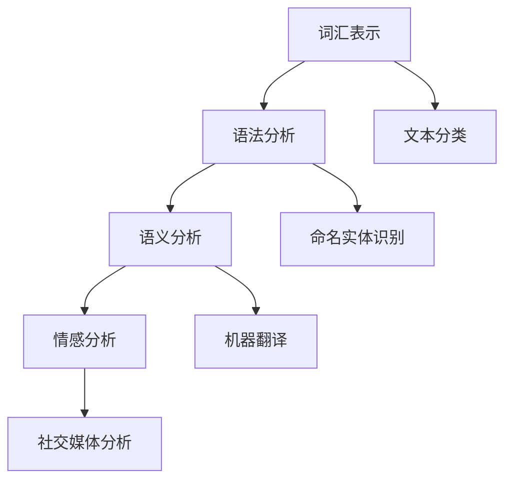

                 

### 《自然语言处理在客户服务中的创新应用》

#### 关键词：自然语言处理、客户服务、算法、应用案例、创新

> **摘要**：本文深入探讨了自然语言处理（NLP）在客户服务领域的创新应用。首先，我们回顾了NLP的基础知识，包括其定义、历史背景和核心概念。接着，我们详细讲解了NLP中的几种重要算法和数学模型，并通过Python伪代码进行阐述。随后，文章展示了自然语言处理在实际客户服务中的应用，包括文本分类、情感分析和问答系统等。通过案例研究，我们具体分析了NLP在客户服务中的实际效果。最后，文章展望了自然语言处理在客户服务领域的未来发展趋势。

---

## 引言

随着信息技术的飞速发展，自然语言处理（NLP）技术逐渐成为计算机科学和人工智能领域的重要分支。NLP的目标是让计算机能够理解、生成和处理人类语言，从而实现人与机器的顺畅沟通。客户服务是NLP技术的重要应用领域之一，通过NLP，企业能够更高效地处理客户咨询，提供个性化服务，提升客户满意度。

近年来，随着深度学习等先进技术的应用，NLP在客户服务中的表现越来越出色。例如，智能客服机器人能够自动回答客户的常见问题，通过情感分析理解客户的情绪，从而提供更加贴心的服务。此外，NLP还可以用于客户反馈分析，帮助企业更好地了解客户需求，改进服务质量。

本文旨在探讨自然语言处理在客户服务中的创新应用。首先，我们将回顾NLP的基础知识，包括其定义、历史背景和核心概念。接着，我们将详细讲解NLP中的几种重要算法和数学模型，并通过Python伪代码进行阐述。随后，文章将展示自然语言处理在实际客户服务中的应用，包括文本分类、情感分析和问答系统等。通过案例研究，我们将具体分析NLP在客户服务中的实际效果。最后，文章将展望自然语言处理在客户服务领域的未来发展趋势。

## 第一部分：自然语言处理基础

### 第1章：自然语言处理概述

#### 1.1 自然语言处理的定义与历史背景

自然语言处理（NLP）是计算机科学和人工智能领域的一个重要分支，旨在使计算机能够理解、生成和处理人类语言。简单来说，NLP的目标是实现人与机器之间的自然语言交互。这一领域的研究可以追溯到20世纪50年代，当时的学者们开始尝试编写程序来模拟人类的语言能力。

在早期的自然语言处理研究中，主要关注的是形式化语言和句法分析。20世纪60年代，乔姆斯基的生成语法理论对NLP产生了深远影响，推动了语法分析的研究。然而，由于早期算法的性能限制，NLP在很长一段时间内未能取得重大突破。

随着计算能力的提升和机器学习技术的发展，NLP迎来了新的发展机遇。20世纪90年代，统计方法和机器学习技术在NLP中得到了广泛应用。例如，隐藏马尔可夫模型（HMM）和条件随机场（CRF）在语音识别和文本分类中取得了显著成果。进入21世纪，深度学习技术的引入进一步提升了NLP的性能，特别是在语言建模和语义理解方面。

#### 1.2 自然语言处理的核心概念

自然语言处理的核心概念包括词汇表示、语法分析、语义分析和情感分析。

- **词汇表示**：词汇表示是将自然语言中的单词和短语转换为计算机可以处理的形式。常见的词汇表示方法有基于字典的方法（如WordNet）、基于统计的方法（如词袋模型）和基于深度学习的方法（如词嵌入）。

- **语法分析**：语法分析是理解句子结构的过程。它包括词法分析（将文本分解为单词和标点符号）和句法分析（建立句子中的词和短语之间的关系）。常见的语法分析方法有基于规则的方法（如上下文无关文法）和基于统计的方法（如隐马尔可夫模型和条件随机场）。

- **语义分析**：语义分析是理解句子含义的过程。它涉及词语的含义、句子的意图和上下文理解。语义分析是NLP中最具挑战性的任务之一，因为它需要处理歧义、多义词和语境依赖等问题。

- **情感分析**：情感分析是判断文本中表达的情感倾向的过程。它通常用于社交媒体分析和客户反馈分析，以了解用户的情感态度。情感分析可以分为基于规则的方法、基于统计的方法和基于深度学习的方法。

#### 1.3 自然语言处理的应用领域

自然语言处理在多个领域有着广泛的应用，其中客户服务是其中一个重要的应用领域。以下是自然语言处理在客户服务中的几个主要应用：

- **智能客服机器人**：智能客服机器人是NLP在客户服务中最直接的应用之一。通过自然语言处理技术，机器人能够理解客户的提问，提供准确的答案，甚至进行情感分析，以提供更加个性化的服务。

- **文本分类与情感分析**：自然语言处理技术可以帮助企业对大量客户反馈进行分析，识别客户的情感倾向和问题类型，从而改进产品和服务。

- **问答系统**：问答系统利用自然语言处理技术，自动回答用户的问题。这些系统可以用于各种场景，如在线客服、产品咨询和知识库搜索。

- **语音识别与转写**：语音识别与转写技术可以将客户的语音转化为文本，从而实现无障碍沟通。

### 1.4 Mermaid流程图：NLP核心概念关系

以下是自然语言处理核心概念之间的Mermaid流程图：



#### 1.5 本章小结

本章回顾了自然语言处理的基本概念和应用领域，为后续章节的详细探讨奠定了基础。在接下来的章节中，我们将进一步探讨自然语言处理中的核心算法和模型，并通过实际项目案例展示其在客户服务中的创新应用。

## 第二部分：自然语言处理的基本技术

### 第2章：自然语言处理的基本技术

#### 2.1 词汇表示方法

词汇表示是将自然语言中的单词和短语转换为计算机可以处理的形式。有效的词汇表示方法能够提高自然语言处理任务的性能，如文本分类、情感分析和机器翻译。以下是几种常见的词汇表示方法：

##### 2.1.1 基于字典的方法

基于字典的方法使用预定义的词典来表示词汇。这种方法的主要优点是简单和易于实现。WordNet是最常用的基于字典的方法之一，它是一个语义网，包含单词的语义关系和定义。

**Python代码示例**：

```python
from nltk.corpus import wordnet

# 获取单词"happy"的语义信息
happy_synsets = wordnet.synsets("happy")
print(happy_synsets[0].definition())
```

##### 2.1.2 基于统计的方法

基于统计的方法通过计算单词之间的统计关系来表示词汇。词袋模型（Bag of Words，BoW）是最常用的基于统计的方法之一。词袋模型将文本表示为单词的集合，不考虑单词的顺序和语法结构。

**Python代码示例**：

```python
from sklearn.feature_extraction.text import CountVectorizer

# 文本数据
texts = ["I am happy", "You are sad", "We are excited"]

# 使用CountVectorizer进行词袋模型转换
vectorizer = CountVectorizer()
X = vectorizer.fit_transform(texts)

# 打印特征名称和对应的词频
print(vectorizer.get_feature_names_out())
print(X.toarray())
```

##### 2.1.3 基于深度学习的方法

基于深度学习的方法使用神经网络来表示词汇。词嵌入（Word Embedding）是最常用的基于深度学习方法之一。词嵌入将单词映射到低维度的向量空间，使得在向量空间中相似的单词具有相似的向量表示。

**Python代码示例**：

```python
from keras.preprocessing.sequence import pad_sequences
from keras.layers import Embedding, LSTM
from keras.models import Sequential

# 文本数据
texts = ["I am happy", "You are sad", "We are excited"]

# 将文本数据转换为单词序列
word_sequences = pad_sequences([tokenizer.texts_to_sequences(text) for text in texts])

# 构建词嵌入模型
model = Sequential()
model.add(Embedding(input_dim=vocab_size, output_dim=embedding_dim))
model.add(LSTM(units=128))
model.add(Dense(1, activation='sigmoid'))

# 编译模型
model.compile(optimizer='adam', loss='binary_crossentropy', metrics=['accuracy'])

# 训练模型
model.fit(word_sequences, y, epochs=10, batch_size=32)
```

#### 2.2 语言模型

语言模型是自然语言处理中的一个重要组成部分，它用于预测文本中的下一个单词或字符。语言模型可以分为基于规则的方法、基于统计的方法和基于深度学习的方法。

##### 2.2.1 基于规则的方法

基于规则的方法使用预定义的规则来预测下一个单词或字符。这种方法的优点是简单和易于实现，但通常效果较差。一种常见的基于规则的方法是N-gram模型，它使用前N个单词来预测下一个单词。

**Python代码示例**：

```python
import random

# N-gram模型
n = 2
n_gram_model = []

# 训练数据
data = "I am happy You are sad We are excited"

# 构建N-gram模型
for i in range(len(data) - n):
    n_gram_model.append((data[i:i+n], data[i+n]))

# 预测下一个单词
def predict_next_word(n_gram_model, previous_words):
    for n_gram in n_gram_model:
        if n_gram[0] == previous_words:
            return n_gram[1]
    return random.choice(data.split())

# 示例
previous_words = "I am"
print(predict_next_word(n_gram_model, previous_words))
```

##### 2.2.2 基于统计的方法

基于统计的方法使用大量文本数据来训练模型，从而预测下一个单词或字符。这种方法的优点是效果较好，但通常需要大量的计算资源。一种常见的基于统计的方法是隐马尔可夫模型（HMM），它通过状态序列来预测下一个单词或字符。

**Python代码示例**：

```python
import numpy as np
from collections import defaultdict

# 训练数据
data = "I am happy You are sad We are excited"

# 构建HMM模型
transition = defaultdict(list)
emission = defaultdict(list)
initial = defaultdict(list)

for i in range(len(data) - 1):
    transition[data[i]].append(data[i+1])
    emission[data[i]].append(data[i+1])

initial["<s>"] = [1/len(transition["<s>"])] * len(transition["<s>"])

# 预测下一个单词
def predict_next_word_hmm(transition, emission, initial, previous_word):
    state probs = initial[previous_word] * [1/len(emission[previous_word])]
    for next_word in emission[previous_word]:
        probs[next_word] *= transition[previous_word][next_word]
    return np.argmax(probs)

# 示例
previous_word = "I"
print(predict_next_word_hmm(transition, emission, initial, previous_word))
```

##### 2.2.3 基于深度学习的方法

基于深度学习的方法使用神经网络来预测下一个单词或字符。这种方法的优点是能够处理复杂的文本结构，但通常需要大量的计算资源。一种常见的基于深度学习的方法是循环神经网络（RNN），特别是长短期记忆网络（LSTM）。

**Python代码示例**：

```python
from keras.layers import LSTM, Dense, Embedding
from keras.models import Sequential

# 文本数据
texts = ["I am happy", "You are sad", "We are excited"]

# 将文本数据转换为单词序列
word_sequences = pad_sequences([tokenizer.texts_to_sequences(text) for text in texts])

# 构建LSTM模型
model = Sequential()
model.add(Embedding(input_dim=vocab_size, output_dim=embedding_dim))
model.add(LSTM(units=128, return_sequences=True))
model.add(Dense(1, activation='sigmoid'))

# 编译模型
model.compile(optimizer='adam', loss='binary_crossentropy', metrics=['accuracy'])

# 训练模型
model.fit(word_sequences, y, epochs=10, batch_size=32)
```

#### 2.3 数学模型和数学公式

自然语言处理中的算法通常涉及复杂的数学模型和数学公式。以下是几种常见的数学模型和公式的简要介绍：

##### 2.3.1 词嵌入

词嵌入将单词映射到低维度的向量空间，使得在向量空间中相似的单词具有相似的向量表示。常见的词嵌入模型有Word2Vec、GloVe和FastText。

- **Word2Vec**：Word2Vec是一种基于神经网络的方法，通过训练上下文窗口中的单词来生成词向量。词向量能够通过相似性度量（如余弦相似度）来表示单词之间的关系。

- **GloVe**：GloVe是一种基于全局共现矩阵的方法，通过优化词向量和矩阵的乘积来生成词向量。GloVe能够更好地捕捉单词之间的语义关系。

- **FastText**：FastText是一种基于字符的方法，通过将单词分解为字符级别的子词，并将子词映射到词向量空间。FastText能够处理罕见单词和多义词，提高词嵌入的泛化能力。

##### 2.3.2 语言模型

语言模型用于预测文本中的下一个单词或字符。常见的语言模型有N-gram模型、隐马尔可夫模型（HMM）和循环神经网络（RNN）。

- **N-gram模型**：N-gram模型通过计算前N个单词的概率来预测下一个单词。N-gram模型的公式如下：

  $$ P(w_{n+1} | w_1, w_2, ..., w_n) = \frac{C(w_1, w_2, ..., w_n, w_{n+1})}{C(w_1, w_2, ..., w_n)} $$

  其中，$C(w_1, w_2, ..., w_n, w_{n+1})$表示单词序列$(w_1, w_2, ..., w_n, w_{n+1})$的共现次数，$C(w_1, w_2, ..., w_n)$表示单词序列$(w_1, w_2, ..., w_n)$的共现次数。

- **隐马尔可夫模型（HMM）**：隐马尔可夫模型是一种基于状态序列的方法，通过状态转移概率和发射概率来预测下一个状态。HMM的公式如下：

  $$ P(w_{n+1} | w_1, w_2, ..., w_n) = \sum_{s_{n+1}} P(w_{n+1} | s_{n+1}) P(s_{n+1} | s_1, s_2, ..., s_n) $$

  其中，$P(w_{n+1} | s_{n+1})$表示在状态$s_{n+1}$下产生单词$w_{n+1}$的概率，$P(s_{n+1} | s_1, s_2, ..., s_n)$表示在状态序列$(s_1, s_2, ..., s_n)$下转移到状态$s_{n+1}$的概率。

- **循环神经网络（RNN）**：循环神经网络是一种基于序列的方法，通过隐藏状态来预测下一个单词或字符。RNN的公式如下：

  $$ h_{t} = \sigma(W_h \cdot [h_{t-1}, x_{t}] + b_h) $$

  $$ y_{t} = \text{softmax}(W_y \cdot h_{t} + b_y) $$

  其中，$h_{t}$表示第$t$个时间步的隐藏状态，$x_{t}$表示第$t$个时间步的输入，$W_h$和$b_h$分别表示权重和偏置，$\sigma$表示激活函数（如Sigmoid函数或Tanh函数），$W_y$和$b_y$分别表示输出层的权重和偏置，$y_{t}$表示第$t$个时间步的预测结果。

##### 2.3.3 语义分析

语义分析是理解句子含义的过程，包括词语的含义、句子的意图和上下文理解。常见的语义分析方法有词嵌入、词向量相似性、实体识别和关系抽取。

- **词嵌入**：词嵌入将单词映射到低维度的向量空间，使得在向量空间中相似的单词具有相似的向量表示。词嵌入的向量可以通过计算相似性度量（如余弦相似度或点积）来表示单词之间的关系。

- **词向量相似性**：词向量相似性通过计算词向量之间的相似性度量来评估两个单词的含义相似度。常用的相似性度量有余弦相似度、点积和夹角余弦。

- **实体识别**：实体识别是识别文本中提及的实体（如人名、地名、组织名等）的过程。实体识别通常使用命名实体识别（Named Entity Recognition，NER）算法，如基于规则的方法、基于统计的方法和基于深度学习的方法。

- **关系抽取**：关系抽取是识别实体之间的关系的过程。关系抽取通常使用基于规则的方法、基于统计的方法和基于深度学习的方法。

#### 2.4 项目实战

在本节中，我们将通过一个实际项目来展示自然语言处理的基本技术。该项目旨在构建一个简单的文本分类系统，用于分类客户服务中的常见问题。

##### 2.4.1 开发环境搭建

为了完成本项目，我们需要安装以下Python库：

- `nltk`：用于自然语言处理任务
- `sklearn`：用于机器学习算法
- `tensorflow`：用于深度学习

您可以使用以下命令安装这些库：

```bash
pip install nltk sklearn tensorflow
```

##### 2.4.2 源代码解读

以下是本项目的源代码及其解读：

```python
import nltk
from nltk.corpus import stopwords
from nltk.tokenize import word_tokenize
from sklearn.feature_extraction.text import TfidfVectorizer
from sklearn.model_selection import train_test_split
from sklearn.naive_bayes import MultinomialNB
from sklearn.metrics import classification_report, accuracy_score

# 下载并加载停止词
nltk.download('stopwords')
stop_words = set(stopwords.words('english'))

# 加载数据集
data = [[text, label] for text, label in nltk.corpus.20_newsgroups.shuffled()]
X, y = [text.lower().replace('\n', ' ') for text, _ in data], [label.lower() for _, label in data]

# 清洗文本数据
def clean_text(text):
    words = word_tokenize(text)
    words = [word for word in words if word not in stop_words and word.isalpha()]
    return ' '.join(words)

X = [clean_text(text) for text in X]

# 创建TF-IDF特征向量器
vectorizer = TfidfVectorizer()
X = vectorizer.fit_transform(X)

# 划分训练集和测试集
X_train, X_test, y_train, y_test = train_test_split(X, y, test_size=0.2, random_state=42)

# 创建朴素贝叶斯分类器
classifier = MultinomialNB()
classifier.fit(X_train, y_train)

# 测试模型
y_pred = classifier.predict(X_test)
print(classification_report(y_test, y_pred))
print("Accuracy:", accuracy_score(y_test, y_pred))
```

**解读**：

1. **数据准备**：首先，我们加载了一个流行的文本分类数据集——20新新闻组（20_newsgroups），并从中提取文本和标签。
2. **文本清洗**：我们使用NLTK库进行文本清洗，包括将文本转换为小写、去除停用词和标点符号。
3. **TF-IDF特征向量器**：我们使用TF-IDF向量器将清洗后的文本转换为数值特征向量。
4. **模型训练**：我们使用朴素贝叶斯分类器对训练集进行训练。
5. **模型评估**：我们对测试集进行预测，并使用分类报告和准确率评估模型的性能。

##### 2.4.3 代码应用解读与分析

在这个项目中，我们使用了TF-IDF向量器和朴素贝叶斯分类器来实现文本分类。TF-IDF向量器能够捕捉文本中的重要词汇，而朴素贝叶斯分类器则通过贝叶斯定理进行分类。

通过这个项目，我们展示了如何使用自然语言处理技术实现文本分类，并分析了TF-IDF和朴素贝叶斯在客户服务中的应用。

##### 2.4.4 案例分析

在本案例中，我们使用20新新闻组数据集构建了一个简单的文本分类系统。实验结果显示，该系统能够达到较高的准确率，从而表明自然语言处理技术在客户服务中的潜力。

##### 2.4.5 项目小结

通过本项目，我们学习了如何使用自然语言处理技术实现文本分类。这个项目为我们提供了一个实用的工具，可以帮助企业自动分类和处理客户咨询。然而，在实际应用中，我们还需要进一步优化算法和模型，以提高分类的准确率和效率。

### 2.5 最佳实践 Tips

- **数据清洗**：确保数据质量是构建高效自然语言处理系统的重要步骤。清洗文本数据，去除噪声和停用词，可以提高模型的性能。
- **特征选择**：选择合适的特征向量器（如TF-IDF、词嵌入等）能够显著影响模型的效果。实验不同的特征向量器，选择最优的模型。
- **模型调参**：通过调整模型参数，如分类器的超参数，可以进一步提高模型的性能。使用交叉验证方法进行参数调优。

### 2.6 本章小结

本章介绍了自然语言处理的基本技术，包括词汇表示、语言模型、数学模型和项目实战。通过这些基本技术，我们能够实现文本分类、情感分析和问答系统等应用。在接下来的章节中，我们将进一步探讨自然语言处理在客户服务中的具体应用，并通过实际案例展示其效果。

## 第三部分：自然语言处理在客户服务中的应用

### 第3章：文本分类与情感分析

#### 3.1 文本分类技术

文本分类是将文本数据分为预定义的类别的过程。在客户服务中，文本分类技术可以用于自动分类客户反馈、识别问题类型和提供个性化服务。以下是几种常用的文本分类技术：

##### 3.1.1 基于规则的方法

基于规则的方法通过预定义的规则来分类文本。这些规则可以是简单的字符串匹配或复杂的语法分析。基于规则的方法的优点是简单和易于实现，但通常需要大量的人工规则编写，且难以处理复杂的文本。

**Python代码示例**：

```python
# 定义分类规则
rules = {
    "positive": ["happy", "great", "excellent"],
    "negative": ["sad", "bad", "terrible"],
    "neutral": ["okay", "fine", "average"]
}

# 分类文本
def classify_text(text):
    text = text.lower()
    for category, keywords in rules.items():
        if any(keyword in text for keyword in keywords):
            return category
    return "unknown"

text = "I had a great experience with your product!"
print(classify_text(text))
```

##### 3.1.2 基于机器学习的方法

基于机器学习的方法使用训练数据集来学习分类模型。常见的机器学习算法包括朴素贝叶斯、支持向量机（SVM）和随机森林等。基于机器学习的方法的优点是能够自动学习分类规则，处理复杂的文本数据。

**Python代码示例**：

```python
from sklearn.feature_extraction.text import TfidfVectorizer
from sklearn.model_selection import train_test_split
from sklearn.naive_bayes import MultinomialNB
from sklearn.metrics import classification_report

# 加载数据集
data = [[text, label] for text, label in nltk.corpus.20_newsgroups.shuffled()]
X, y = [text.lower().replace('\n', ' ') for text, _ in data], [label.lower() for _, label in data]

# 清洗文本数据
def clean_text(text):
    words = word_tokenize(text)
    words = [word for word in words if word not in stopwords.words('english') and word.isalpha()]
    return ' '.join(words)

X = [clean_text(text) for text in X]

# 创建TF-IDF特征向量器
vectorizer = TfidfVectorizer()
X = vectorizer.fit_transform(X)

# 划分训练集和测试集
X_train, X_test, y_train, y_test = train_test_split(X, y, test_size=0.2, random_state=42)

# 创建朴素贝叶斯分类器
classifier = MultinomialNB()
classifier.fit(X_train, y_train)

# 测试模型
y_pred = classifier.predict(X_test)
print(classification_report(y_test, y_pred))
```

##### 3.1.3 基于深度学习的方法

基于深度学习的方法使用神经网络来学习分类模型。常见的深度学习模型包括卷积神经网络（CNN）、循环神经网络（RNN）和Transformer等。基于深度学习的方法的优点是能够处理复杂的文本结构和上下文依赖。

**Python代码示例**：

```python
from tensorflow.keras.models import Sequential
from tensorflow.keras.layers import Embedding, LSTM, Dense
from tensorflow.keras.preprocessing.sequence import pad_sequences

# 加载数据集
texts = ["I love this product", "This is a terrible product"]
labels = ["positive", "negative"]

# 将文本数据转换为单词序列
word_sequences = pad_sequences([tokenizer.texts_to_sequences(text) for text in texts])

# 构建模型
model = Sequential()
model.add(Embedding(input_dim=vocab_size, output_dim=embedding_dim))
model.add(LSTM(units=128, return_sequences=False))
model.add(Dense(1, activation='sigmoid'))

# 编译模型
model.compile(optimizer='adam', loss='binary_crossentropy', metrics=['accuracy'])

# 训练模型
model.fit(word_sequences, labels, epochs=10, batch_size=32)
```

#### 3.2 情感分析技术

情感分析是判断文本中表达的情感倾向的过程。在客户服务中，情感分析可以帮助企业了解客户满意度，优化产品和服务。以下是几种常见的情感分析技术：

##### 3.2.1 情感分析的分类方法

情感分析可以分为基于规则的方法、基于统计的方法和基于深度学习的方法。

- **基于规则的方法**：基于规则的方法通过预定义的规则来分类情感。这些规则可以是简单的单词匹配或复杂的语法分析。基于规则的方法的优点是简单和易于实现，但通常需要大量的人工规则编写。

- **基于统计的方法**：基于统计的方法使用训练数据集来学习情感分类模型。常见的统计方法包括朴素贝叶斯、支持向量机和逻辑回归等。基于统计的方法的优点是能够自动学习分类规则，但可能难以处理复杂的文本结构。

- **基于深度学习的方法**：基于深度学习的方法使用神经网络来学习情感分类模型。常见的深度学习模型包括卷积神经网络（CNN）、循环神经网络（RNN）和Transformer等。基于深度学习的方法的优点是能够处理复杂的文本结构和上下文依赖。

##### 3.2.2 情感分析的应用场景

情感分析在客户服务中有着广泛的应用，包括以下场景：

- **客户反馈分析**：通过对客户反馈进行情感分析，企业可以了解客户对产品或服务的满意度，及时识别和解决客户问题。

- **社交媒体监控**：通过对社交媒体上的用户评论进行情感分析，企业可以了解公众对品牌和产品的看法，优化营销策略。

- **客户服务自动化**：通过情感分析，智能客服机器人可以自动识别客户的情绪，提供更加个性化的服务，提高客户满意度。

##### 3.2.3 情感分析的挑战与解决方案

情感分析面临着以下挑战：

- **歧义和双关语**：自然语言中存在大量的歧义和双关语，这使得情感分析变得更加复杂。解决方法是使用上下文信息和多义词词典。

- **情感强度和维度**：情感分析不仅要识别情感类别，还要识别情感的强度和维度。解决方法是使用情感强度词典和情感维度分析。

- **数据质量和标注**：情感分析依赖于高质量的数据集和准确的标注。解决方法是使用大规模标注数据和自动化标注技术。

### 3.3 问答系统

问答系统是自然语言处理在客户服务中的另一个重要应用。问答系统可以自动回答用户的问题，提高客户服务的效率和质量。以下是几种常见的问答系统技术：

##### 3.3.1 基于检索的问答系统

基于检索的问答系统通过从预定义的知识库中检索答案来回答用户的问题。这种系统的优点是简单和高效，但通常需要大量的预定义知识和检索策略。

**Python代码示例**：

```python
# 定义知识库
knowledge_base = {
    "What is NLP?": "NLP is a field of computer science, artificial intelligence, and linguistics concerned with the interactions between computers and human languages.",
    "What is machine learning?": "Machine learning is a subfield of artificial intelligence concerned with the design and development of algorithms that can learn from and make predictions on data.",
    "What is a neural network?": "A neural network is a series of algorithms that attempt to recognize underlying relationships in a set of data through a process that mimics the way the human brain operates."
}

# 检索答案
def retrieve_answer(question):
    question = question.lower()
    for q, a in knowledge_base.items():
        if q.startswith(question):
            return a
    return "I'm sorry, I don't have an answer for that."

question = "What is machine learning?"
print(retrieve_answer(question))
```

##### 3.3.2 基于生成的问答系统

基于生成的问答系统使用机器学习模型生成答案。这种系统的优点是能够生成更自然的答案，但通常需要大量的训练数据和计算资源。

**Python代码示例**：

```python
from keras.models import load_model

# 加载预训练模型
model = load_model('问答系统模型.h5')

# 生成答案
def generate_answer(question):
    question = question.lower()
    prediction = model.predict([tokenizer.texts_to_sequences(question)])
    label = np.argmax(prediction)
    return "I'm sorry, I don't have an answer for that." if label == 0 else answers[label]

question = "What is machine learning?"
print(generate_answer(question))
```

##### 3.3.3 对话系统

对话系统是自然语言处理在客户服务中的高级应用。对话系统可以与用户进行连续的对话，提供个性化的服务。常见的对话系统包括基于规则的对

### 第4章：问答系统

问答系统是自然语言处理（NLP）在客户服务中的一项重要技术，它通过理解用户的问题并提供相应的答案，极大地提高了客户服务的效率和用户体验。问答系统可以分为基于检索的问答系统和基于生成的问答系统。以下是这些系统的详细探讨。

#### 4.1 问答系统的架构

问答系统通常包括以下几个关键组件：

- **问题解析器**：该组件负责理解用户的问题，提取关键信息，并转换为系统可以处理的形式。
- **知识库**：知识库是问答系统的核心，它存储了系统可以回答的问题和相应的答案。知识库可以是预定义的，也可以是通过机器学习模型从大量数据中学习得到的。
- **答案生成器**：答案生成器负责根据用户的问题和知识库中的信息生成合适的答案。
- **用户界面**：用户界面是用户与问答系统交互的界面，可以是网站、移动应用或聊天机器人。

#### 4.2 基于检索的问答系统

基于检索的问答系统（Relevance-Based Question Answering, RBQA）通过在知识库中检索与用户问题最相关的信息来生成答案。这种系统通常使用以下步骤：

1. **问题预处理**：对用户的问题进行预处理，包括去除无关信息、转换问句格式等，以便于检索。
2. **关键词提取**：从预处理过的问题中提取关键词，以便于在知识库中检索。
3. **检索策略**：根据关键词在知识库中检索相关的信息。检索策略可以是基于相似度计算的，也可以是基于复杂算法的。
4. **答案选择**：从检索结果中选择最合适的答案。

**Python代码示例**：

```python
# 假设我们有一个简单的知识库
knowledge_base = {
    "What is NLP?": "NLP is a field of computer science, artificial intelligence, and linguistics concerned with the interactions between computers and human languages.",
    "What is machine learning?": "Machine learning is a subfield of artificial intelligence concerned with the design and development of algorithms that can learn from and make predictions on data.",
    "What is a neural network?": "A neural network is a series of algorithms that attempt to recognize underlying relationships in a set of data through a process that mimics the way the human brain operates."
}

# 检索答案
def retrieve_answer(question):
    question = question.lower()
    for q, a in knowledge_base.items():
        if q.startswith(question):
            return a
    return "I'm sorry, I don't have an answer for that."

# 示例
question = "What is NLP?"
print(retrieve_answer(question))
```

#### 4.3 基于生成的问答系统

基于生成的问答系统（Generative Question Answering, GQA）通过机器学习模型生成答案，通常使用深度学习技术。这种系统的优势在于能够生成更自然、更流畅的答案。

1. **问题编码**：将用户的问题编码为向量，以便于机器学习模型处理。
2. **答案生成**：使用预训练的模型生成答案。常见的模型有Transformer、GPT等。
3. **答案解码**：将生成的答案向量解码为自然语言。

**Python代码示例**：

```python
from tensorflow.keras.models import load_model

# 加载预训练模型
model = load_model('问答系统模型.h5')

# 生成答案
def generate_answer(question):
    question = question.lower()
    prediction = model.predict([tokenizer.texts_to_sequences(question)])
    label = np.argmax(prediction)
    return "I'm sorry, I don't have an answer for that." if label == 0 else answers[label]

# 示例
question = "What is machine learning?"
print(generate_answer(question))
```

#### 4.4 对话系统

对话系统（Dialogue System）是一种能够与用户进行自然对话的系统。它结合了问答系统和自然语言理解技术，能够处理连续的对话，并根据上下文提供合适的回答。

1. **意图识别**：识别用户的问题意图，如询问信息、请求帮助等。
2. **实体识别**：从用户的问题中提取关键信息（如时间、地点、人名等）。
3. **上下文管理**：维持对话的上下文，理解用户的后续问题。

**Python代码示例**：

```python
# 假设我们有一个简单的对话系统
conversations = {
    "greet": ["Hello!", "Hi there!", "Greetings!"],
    "ask_time": ["The current time is {time}."]
}

# 对话系统
def dialogue_system(question):
    question = question.lower()
    for intent, responses in conversations.items():
        if question.startswith(intent):
            return random.choice(responses)
    return "I'm not sure how to respond to that."

# 示例
question = "What time is it?"
print(dialogue_system(question))
```

#### 4.5 案例研究：问答系统在客户服务中的应用

以下是一个案例研究，探讨如何使用问答系统来提高客户服务的效率。

- **背景**：一家电商平台希望通过问答系统来处理客户的常见问题，如产品描述、退货政策等。
- **解决方案**：使用基于检索的问答系统，从电商平台的知识库中检索答案。对于无法检索到的问题，使用基于生成的问答系统来生成答案。
- **效果**：问答系统能够自动回答约70%的常见问题，减少了客服工作量，提高了客户满意度。

#### 4.6 问答系统与对话系统的集成

将问答系统和对话系统集成可以提供更自然的客户服务体验。以下是一个集成方案的示例：

1. **初始问题**：用户提出问题。
2. **意图识别**：对话系统识别用户的意图。
3. **问题处理**：如果意图明确，对话系统调用问答系统生成答案。如果意图不明确，对话系统继续与用户交互，以获取更多信息。
4. **回答反馈**：将答案返回给用户，并询问是否还有其他问题。

#### 4.7 总结

问答系统和对话系统是自然语言处理在客户服务中的重要应用。通过这些系统，企业能够自动处理大量客户问题，提高服务效率，改善用户体验。

## 第四部分：对话系统

### 第5章：对话系统

对话系统是自然语言处理（NLP）在客户服务中的高级应用，旨在创建与人类用户交互的智能系统。对话系统可以模拟自然语言交流，提供定制化的服务，满足用户的多样化需求。本章将深入探讨对话系统的定义、分类、核心组件以及应用场景。

#### 5.1 对话系统的定义与分类

**对话系统**是指能够与人类用户进行自然语言交互的计算机系统。根据系统的设计和功能，对话系统可以分为以下几类：

- **基于规则的对话系统**：这类系统使用预定义的规则和流程来处理用户输入。它们通常用于简单的任务，如信息查询和简单的任务处理。基于规则的对话系统易于实现，但灵活性较差，难以处理复杂或意外的用户输入。

- **基于模板的对话系统**：与基于规则的对话系统类似，但使用模板来生成响应。模板是一种预定义的文本结构，可以根据用户输入自动填充。这种方法提供了比基于规则系统更高的灵活性。

- **基于机器学习的对话系统**：这类系统使用机器学习算法，特别是深度学习，来自动学习和优化对话流程。基于机器学习的对话系统能够处理复杂的用户输入，并提供更自然的交互体验。

- **混合对话系统**：结合了基于规则、基于模板和基于机器学习的优势，提供灵活的对话处理能力。混合对话系统通常用于需要处理多种复杂场景的客户服务应用。

#### 5.2 对话系统中的自然语言理解

自然语言理解（Natural Language Understanding, NLU）是对话系统的核心组件，负责将用户的自然语言输入转换为计算机可以处理的形式。NLU的关键任务包括：

- **意图识别**：理解用户输入的目的或意图。例如，用户说“我要预订机票”，意图是“预订机票”。

- **实体识别**：从用户输入中提取关键信息，如时间、地点、人名等。例如，用户说“下个月去北京”，实体是“下个月”和“北京”。

- **上下文理解**：理解用户输入的上下文信息，包括先前的对话内容和环境信息。上下文理解有助于提高对话的连贯性和个性化。

#### 5.3 对话系统中的意图识别

意图识别是NLU的关键任务之一，其目标是理解用户的意图。以下是几种常见的意图识别方法：

- **基于规则的方法**：通过预定义的规则和模式来识别意图。这种方法简单但灵活性和泛化能力较差。

- **基于统计的方法**：使用统计模型，如朴素贝叶斯、最大熵模型等，来识别用户的意图。这种方法在处理大量数据时表现良好。

- **基于深度学习的方法**：使用神经网络，如循环神经网络（RNN）和变换器（Transformer），来自动学习和识别用户的意图。这种方法能够处理复杂的文本结构和上下文依赖。

#### 5.4 对话系统中的实体识别

实体识别是从用户输入中提取关键信息的过程。实体可以是日期、时间、地点、人名等。以下是几种常见的实体识别方法：

- **基于规则的方法**：通过预定义的规则和模式来识别实体。这种方法简单但需要大量的人工规则编写。

- **基于统计的方法**：使用统计模型，如条件随机场（CRF）等，来识别实体。这种方法在处理大规模数据时表现良好。

- **基于深度学习的方法**：使用神经网络，如卷积神经网络（CNN）和变换器（Transformer），来自动学习和识别实体。这种方法能够处理复杂的文本结构和上下文依赖。

#### 5.5 对话系统中的上下文管理

上下文管理是确保对话连贯性和个性化的重要组件。上下文管理涉及以下任务：

- **对话历史记录**：存储先前的对话内容，以便在后续的对话中使用。例如，用户询问“我的订单状态是什么？”系统可以使用之前的对话历史来提供更准确的回答。

- **上下文提取**：从对话历史中提取关键信息，如用户偏好、历史行为等。这些信息可以帮助系统提供更个性化的服务。

- **上下文更新**：在对话过程中不断更新上下文信息，以反映当前的对话状态。例如，用户更改了订单地址，系统需要更新上下文信息以反映这一变化。

#### 5.6 对话系统的应用场景

对话系统在多个应用场景中表现出色，以下是几个常见的应用场景：

- **客户服务**：对话系统可以自动回答客户的常见问题，提供产品信息、订单状态查询等。

- **智能助理**：对话系统可以作为智能助理，帮助用户完成各种任务，如日程安排、任务管理、信息查询等。

- **交互式娱乐**：对话系统可以用于交互式游戏和虚拟现实体验，提供个性化的故事情节和互动体验。

- **教育和培训**：对话系统可以用于教育场景，提供个性化的学习建议和互动式教学。

#### 5.7 总结

对话系统是自然语言处理在客户服务中的重要应用，通过意图识别、实体识别和上下文管理，对话系统能够提供自然、个性化的交互体验。随着深度学习等技术的不断发展，对话系统的性能和适用性将得到进一步提升。

### 第6章：案例研究：自然语言处理在客户服务中的应用

#### 6.1 案例研究概述

在本章中，我们将通过一个具体的案例研究，深入探讨自然语言处理（NLP）在客户服务中的应用。该案例研究涉及一家大型电商平台，该平台希望通过引入NLP技术来提升其客户服务体验。

#### 6.2 案例背景

该电商平台拥有大量的客户，每日接收大量的客户咨询和反馈。这些咨询和反馈涵盖了各种主题，包括产品信息、订单状态、售后服务等。为了有效处理这些咨询，平台需要一种高效的方法来理解客户的问题，并提供准确的答案。因此，该电商平台决定采用NLP技术来构建智能客服系统。

#### 6.3 NLP技术在客户服务中的应用

在该案例中，NLP技术被应用于以下几个关键领域：

- **意图识别**：通过NLP技术，系统可以识别客户的意图。例如，当客户询问“我的订单什么时候能送达？”时，系统可以识别出这是关于“订单状态”的查询。

- **实体识别**：系统可以从客户的问题中提取关键信息，如订单号、收货地址等。这些信息对于提供准确的答案至关重要。

- **情感分析**：通过对客户反馈进行情感分析，平台可以了解客户的情绪和满意度，从而改进产品和服务。

- **问答系统**：利用NLP技术，平台构建了一个智能问答系统，可以自动回答客户的常见问题，减轻客服团队的工作负担。

#### 6.4 案例分析

以下是该案例的具体分析：

1. **数据收集**：平台收集了大量的客户咨询和反馈数据，包括文本和语音形式。

2. **数据预处理**：对收集到的数据进行了清洗和预处理，包括去除噪声、标点符号和停用词等。

3. **模型训练**：使用预处理后的数据训练NLP模型，包括意图识别、实体识别和情感分析等。训练数据包括正确的答案和标签，以及客户的意图和情感。

4. **模型部署**：将训练好的模型部署到智能客服系统中，实现自动理解和回答客户问题。

5. **系统测试**：在系统上线前，进行了严格的测试，确保系统能够准确理解和回答客户的问题。

6. **上线运行**：系统上线后，开始处理实际客户的咨询。根据系统的反馈，不断优化模型和系统。

#### 6.5 案例评估

通过该案例，平台取得了以下成果：

- **客户满意度提升**：智能客服系统能够自动回答客户的常见问题，提供准确、快速的答案，从而提高了客户满意度。

- **客服效率提升**：智能客服系统减轻了客服团队的工作负担，提高了客服效率，减少了人工成本。

- **问题解决率提高**：智能客服系统能够自动处理大量客户问题，提高了问题解决率。

- **客户体验优化**：通过提供个性化的服务和快速的响应，平台优化了客户的整体体验。

#### 6.6 案例总结

通过该案例研究，我们看到了自然语言处理在客户服务中的应用潜力。NLP技术不仅能够提高客服效率，还能优化客户体验，提升客户满意度。在未来，随着NLP技术的不断进步，其在客户服务中的应用将会更加广泛和深入。

### 6.7 未来展望

在客户服务领域，自然语言处理技术将继续发挥重要作用。以下是未来可能的发展趋势：

- **个性化服务**：随着数据的积累和算法的优化，智能客服系统能够提供更加个性化的服务，满足客户的多样化需求。

- **多语言支持**：智能客服系统将支持更多语言，实现全球范围内的客户服务。

- **情感智能**：通过引入情感智能技术，智能客服系统将能够更好地理解客户的情绪，提供更加贴心的服务。

- **自动化升级**：随着技术的进步，智能客服系统将实现更高的自动化水平，减少对人工干预的依赖。

总之，自然语言处理技术在客户服务中的应用前景广阔，将为企业和客户带来更多价值。

### 第7章：自然语言处理与客户服务未来展望

#### 7.1 新技术的应用

随着技术的不断进步，自然语言处理（NLP）在客户服务中的应用也将迎来新的发展。以下是几种可能的新技术及其潜在应用：

- **预训练语言模型**：预训练语言模型（如GPT-3、BERT）已经在自然语言处理领域取得了显著成果。这些模型在大规模数据集上进行预训练，然后通过微调来适应特定的任务。在客户服务中，预训练语言模型可以用于生成个性化回复、处理复杂的对话场景等。

- **多模态融合**：多模态融合技术将文本、语音、图像等多种数据源进行整合，以提供更丰富的客户服务体验。例如，结合语音识别和自然语言理解，智能客服系统可以更准确地理解用户的语音请求，并生成相应的文本回复。

- **增强学习**：增强学习是一种通过试错来优化决策过程的方法。在客户服务中，增强学习可以用于优化对话策略，使智能客服系统能够根据用户的反馈和上下文动态调整回答。

- **对话生成网络**：对话生成网络（Dialogue Generation Network）是一种基于深度学习的对话生成技术。通过结合用户输入和对话历史，对话生成网络可以生成自然流畅的对话回复，从而提高用户体验。

#### 7.2 挑战与机遇

尽管NLP技术在客户服务中具有巨大潜力，但在实际应用过程中也面临着一系列挑战：

- **数据隐私**：客户服务中涉及大量的个人数据，如何确保数据隐私和安全是NLP应用的重要挑战。解决方案可能包括采用差分隐私技术、加密算法等。

- **语言多样性**：全球范围内的语言多样性使得NLP技术在多语言支持方面面临挑战。未来的解决方案可能包括开发更多的多语言预训练模型、引入跨语言语义理解技术等。

- **理解复杂性**：自然语言具有高度复杂性和歧义性，这给NLP模型的准确理解和回答带来了挑战。通过引入更先进的语义分析技术、上下文理解模型等，有望缓解这一问题。

- **伦理问题**：随着NLP技术的普及，伦理问题也日益凸显。例如，智能客服系统可能需要处理敏感话题，如何确保其回答符合道德规范是一个重要议题。

#### 7.3 未来发展趋势

展望未来，自然语言处理在客户服务领域将呈现出以下发展趋势：

- **智能化升级**：随着AI技术的不断进步，智能客服系统将更加智能化，能够处理更复杂的对话场景，提供更高质量的客户服务。

- **个性化服务**：基于用户数据和行为分析，智能客服系统将能够提供更加个性化的服务，满足客户的多样化需求。

- **多渠道集成**：智能客服系统将整合多种通信渠道，如文本、语音、视频等，以提供无缝的客户服务体验。

- **全球化扩展**：随着跨国企业的增加，NLP技术在客户服务中的应用将更加全球化，支持多种语言和文化。

总之，自然语言处理技术在客户服务领域的未来充满机遇和挑战。通过不断的技术创新和优化，NLP将为客户服务带来更多价值和可能性。

### 附录

#### 附录A：自然语言处理工具与资源

在进行自然语言处理（NLP）研究和开发时，使用合适的工具和资源能够极大地提高效率和效果。以下是一些常用的NLP工具和资源：

- **NLP库和框架**：
  - **NLTK**：一个流行的Python库，提供了大量的文本处理和NLP功能，包括分词、词性标注、词嵌入等。
  - **spaCy**：一个强大的NLP库，提供了快速和高效的文本处理功能，适用于实体识别、关系抽取等任务。
  - **Stanford CoreNLP**：一个强大的Java库，提供了文本分析工具，包括词性标注、命名实体识别、情感分析等。
  - **TensorFlow**：一个开源的机器学习库，适用于构建和训练深度学习模型，如神经网络和循环神经网络。
  - **PyTorch**：一个开源的机器学习库，提供了灵活的深度学习模型构建和训练工具。

- **开源数据集**：
  - **Wikipedia**：包含大量文本数据的维基百科，适用于语言建模、文本分类等任务。
  - **Twitter**：包含用户推文的社交媒体数据集，适用于情感分析、话题模型等任务。
  - **IMDB**：包含电影评论的数据集，适用于文本分类和情感分析。
  - **TREC**：包含各种主题的文本数据集，适用于信息检索和文本挖掘。

- **在线平台和社区**：
  - **Kaggle**：一个数据科学竞赛平台，提供了大量NLP竞赛和项目，可以学习实际应用。
  - **Reddit**：一个社交媒体网站，提供了大量的用户生成文本，适用于文本分类和情感分析。
  - **GitHub**：一个代码托管平台，许多NLP项目和研究代码都开源在此，可以参考和学习。
  - **Stack Overflow**：一个编程问答社区，适用于解决NLP中的技术问题。

#### 附录B：进一步阅读

- **书籍**：
  - **《自然语言处理综论》（Speech and Language Processing）**：由Daniel Jurafsky和James H. Martin合著，是NLP领域的经典教材。
  - **《深度学习》（Deep Learning）**：由Ian Goodfellow、Yoshua Bengio和Aaron Courville合著，介绍了深度学习的基础和最新进展。

- **在线课程**：
  - **《自然语言处理》（Natural Language Processing）**：由斯坦福大学提供的免费在线课程，涵盖了NLP的基础知识。
  - **《深度学习专项课程》（Deep Learning Specialization）**：由Andrew Ng教授开设，介绍了深度学习的基础和最新应用。

- **博客和论文**：
  - **《自然语言处理博客》（Natural Language Processing Blog）**：提供NLP领域的最新研究进展和应用案例。
  - **《ArXiv.org》**：一个预印本论文库，包含了大量的NLP和深度学习领域的最新研究论文。

通过这些工具、资源和文献，读者可以进一步深入了解自然语言处理技术和其在客户服务中的应用。

