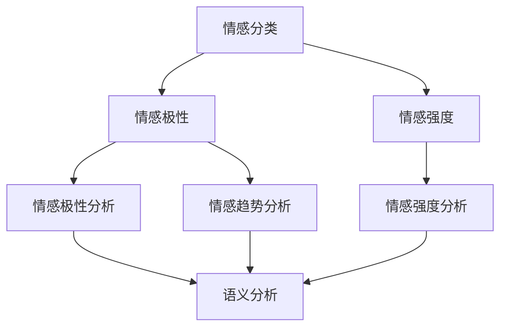

                 

### 背景介绍

自然语言处理（NLP）作为人工智能的一个重要分支，旨在使计算机能够理解和处理人类语言。近年来，随着深度学习技术的迅猛发展，NLP在情感分析领域取得了显著进展。情感分析，也被称为意见挖掘或情感意见挖掘，是一种从文本中识别和提取主观信息的技术。其目的是理解和量化用户在文本中所表达的情感倾向，如正面、负面或中性情绪。

情感分析具有广泛的应用场景，包括社交媒体分析、市场调研、客户服务、情感计算等。通过对用户情感的理解，企业可以更好地把握市场需求，优化产品和服务。例如，社交媒体平台可以通过情感分析监测用户对品牌或产品的情绪变化，从而及时调整营销策略。在客户服务领域，情感分析可以帮助自动识别用户的不满情绪，快速响应并解决问题，提升客户满意度。

然而，情感分析面临着许多挑战。首先是情感表达方式的多样性和复杂性。用户的情感表达可能包含多种情绪，且常常是非线性的，这使得情感分析模型需要具备较高的复杂度和鲁棒性。其次是跨语言情感分析的挑战，不同语言的文化背景和表达习惯差异较大，如何准确识别和处理跨语言的情感信息是一个重要课题。此外，情感分析的准确性也受到数据质量和标注方法的制约，高质量的情感标注数据是训练有效情感分析模型的基础。

本文将详细探讨自然语言处理在情感分析中的应用，从核心概念与联系、核心算法原理讲解、数学模型和数学公式，到项目实战等各个方面，逐步解析情感分析的技术原理和实践方法。希望通过本文的阐述，能够帮助读者深入理解情感分析的核心技术，掌握其实际应用场景，为未来的研究和实践提供指导。

### 核心概念与联系

在情感分析中，理解核心概念和它们之间的联系是至关重要的。以下是几个关键概念及其相互关系：

#### 1. 情感分类

情感分类（Sentiment Classification）是指将文本划分为正面、负面或中性三个类别。这是情感分析中最基础的任务之一。情感分类的目的是识别文本中的情感倾向，从而为后续分析提供基础。

#### 2. 情感极性

情感极性（Sentiment Polarity）是衡量文本情感倾向的强度，通常用数值表示，如0（中性）、1（正面）和-1（负面）。情感极性分析可以帮助我们更精细地理解文本的情感表达。

#### 3. 情感强度

情感强度（Sentiment Intensity）是指情感极性的具体数值，用于表示情感的强烈程度。例如，对于两个负面情感表达，“非常不满意”和“有点不满意”，前者情感强度更高。

#### 4. 情感极性分析

情感极性分析（Polarity Analysis）是指对文本进行情感分类，判断其是正面、负面或中性。这通常通过机器学习算法实现，如朴素贝叶斯、支持向量机和深度学习模型。

#### 5. 情感强度分析

情感强度分析（Intensity Analysis）是指对文本情感极性进行量化，以确定情感表达的强烈程度。这可以通过分析文本中的情感词汇和句法结构来实现。

#### 6. 情感趋势分析

情感趋势分析（Trend Analysis）是指通过分析一段时间内文本的情感变化，来了解公众情绪的变化趋势。这有助于监测社交媒体上的热点话题或品牌形象。

#### 7. 语义分析

语义分析（Semantic Analysis）是理解文本语义的过程，包括词义消歧、实体识别和关系抽取等。语义分析在情感分析中至关重要，因为它有助于更准确地理解文本情感。

#### 关系架构图

为了更直观地展示这些概念之间的联系，我们可以使用Mermaid流程图来构建一个情感分析的概念架构图：



在此架构图中，我们可以看到情感分类是整个情感分析流程的起点，而情感极性和情感强度则是其关键组成部分。情感极性分析和情感强度分析分别用于判断和量化情感倾向的极性和强度。情感趋势分析则通过时间序列数据来监测情感变化。语义分析贯穿整个流程，为情感分类和情感分析提供语义层面的支持。

通过理解这些核心概念及其相互关系，我们可以更好地构建和优化情感分析模型，提高情感识别的准确性和有效性。

### 核心算法原理讲解

情感分析中的算法原理是理解文本情感表达的基础。本文将介绍几种常见的情感分析算法，包括基于词典的方法、基于机器学习的方法和深度学习方法，并通过Python伪代码详细阐述其工作原理。

#### 1. 基于词典的方法

基于词典的方法是最简单的情感分析方法，主要通过查找预定义的词典来判断文本的情感倾向。词典通常包含情感词汇及其对应的极性标签。

**算法原理：**

- 构建情感词典：将情感词汇映射到极性标签（如正面或负面）。
- 文本预处理：将原始文本转换为词典中的关键词列表。
- 情感分类：统计关键词的极性标签，计算总极性分数。

**Python伪代码：**

```python
def sentiment_classification(text, sentiment_dict):
    positive_score = 0
    negative_score = 0
    words = preprocess(text)
    for word in words:
        if word in sentiment_dict:
            if sentiment_dict[word] == 'positive':
                positive_score += 1
            elif sentiment_dict[word] == 'negative':
                negative_score += 1
    if positive_score > negative_score:
        return 'positive'
    elif negative_score > positive_score:
        return 'negative'
    else:
        return 'neutral'

def preprocess(text):
    # 假设文本预处理函数将文本转换为词列表
    return text.split()
```

#### 2. 基于机器学习的方法

基于机器学习的方法利用大量的标注数据训练分类模型，如朴素贝叶斯、支持向量机和随机森林等。

**算法原理：**

- 数据收集与标注：收集大量带有情感标签的文本数据，进行标注。
- 特征提取：从文本中提取特征，如词频、词袋模型、TF-IDF等。
- 模型训练：使用标注数据训练分类模型。
- 情感分类：对新文本进行特征提取，并通过训练好的模型进行情感分类。

**Python伪代码：**

```python
from sklearn.feature_extraction.text import TfidfVectorizer
from sklearn.naive_bayes import MultinomialNB

def train_model(train_data, train_labels):
    vectorizer = TfidfVectorizer()
    X_train = vectorizer.fit_transform(train_data)
    classifier = MultinomialNB()
    classifier.fit(X_train, train_labels)
    return vectorizer, classifier

def classify_text(vectorizer, classifier, text):
    X_test = vectorizer.transform([text])
    prediction = classifier.predict(X_test)
    return prediction[0]

# 假设已有训练数据和标签
vectorizer, classifier = train_model(train_data, train_labels)
print(classify_text(vectorizer, classifier, "This is a great product!"))
```

#### 3. 深度学习方法

深度学习方法，如卷积神经网络（CNN）和循环神经网络（RNN），在情感分析中表现出强大的能力。

**算法原理：**

- 文本嵌入：将文本转换为固定长度的向量表示。
- 深度学习模型：使用多层神经网络来提取文本特征，如词嵌入、卷积层和全连接层。
- 情感分类：通过输出层对文本进行情感分类。

**Python伪代码：**

```python
import tensorflow as tf
from tensorflow.keras.models import Sequential
from tensorflow.keras.layers import Embedding, Conv1D, GlobalMaxPooling1D, Dense

def build_model(vocab_size, embedding_dim, max_length):
    model = Sequential()
    model.add(Embedding(vocab_size, embedding_dim, input_length=max_length))
    model.add(Conv1D(128, 5, activation='relu'))
    model.add(GlobalMaxPooling1D())
    model.add(Dense(128, activation='relu'))
    model.add(Dense(3, activation='softmax'))
    model.compile(optimizer='adam', loss='categorical_crossentropy', metrics=['accuracy'])
    return model

model = build_model(vocab_size, embedding_dim, max_length)
# 假设已有训练数据和标签
model.fit(train_data, train_labels, epochs=10, validation_split=0.1)
print(model.predict(["This is a wonderful product!"]))
```

通过上述算法，我们可以对文本进行情感分类。不同的算法适用于不同规模和复杂度的文本数据。基于词典的方法简单易用，但在复杂情感表达上表现不佳。基于机器学习的方法能够处理较大规模的数据，但需要大量标注数据。深度学习方法在处理复杂文本和长文本时表现出色，但需要较大的计算资源和时间。

### 数学模型和数学公式

在情感分析中，数学模型和数学公式是理解和设计算法的核心工具。以下是几种常用的数学模型和公式，以及它们在情感分析中的应用。

#### 1. 朴素贝叶斯模型

朴素贝叶斯模型是一种基于概率论的分类方法，广泛应用于文本分类和情感分析。

**公式：**

- 条件概率：
  $$ P(y|x) = \frac{P(x|y)P(y)}{P(x)} $$

- 后验概率：
  $$ P(y|x) = \frac{\prod_{i=1}^{n} P(x_i|y) P(y)}{\sum_{j=1}^{k} \prod_{i=1}^{n} P(x_i|y_j) P(y_j)} $$

**解释：**

- \( P(x_i|y) \)：在给定类别\( y \)下，特征\( x_i \)的概率。
- \( P(y) \)：类别\( y \)的概率。
- \( P(x) \)：特征\( x \)的概率。

朴素贝叶斯模型通过计算文本中每个特征词在正面、负面和中和类别下的条件概率，并结合类别概率，得出文本的情感分类。

#### 2. 支持向量机（SVM）

支持向量机是一种监督学习算法，广泛应用于文本分类问题。

**公式：**

- 决策函数：
  $$ f(x) = \sum_{i=1}^{n} \alpha_i y_i (w \cdot x_i) + b $$

- 最优化问题：
  $$ \min_{w,b} \frac{1}{2} ||w||^2 + C \sum_{i=1}^{n} \xi_i $$

**解释：**

- \( w \)：权重向量。
- \( b \)：偏置。
- \( \alpha_i \)：拉格朗日乘子。
- \( \xi_i \)：松弛变量。
- \( C \)：惩罚参数。

SVM通过找到最优的超平面来划分文本数据，使得不同情感类别的分类间隔最大化。在情感分析中，SVM用于训练分类模型，对文本进行情感分类。

#### 3. 深度学习模型

深度学习模型，如卷积神经网络（CNN）和循环神经网络（RNN），在情感分析中表现出强大的能力。

**公式：**

- 卷积神经网络（CNN）：

  - 卷积操作：
    $$ (f_{\sigma} \circ (x \star k))_{ij} = \sum_{k=1}^{K} \sigma(w_{ik} \cdot x_{kj} + b_k) $$

  - 池化操作：
    $$ P(x) = \max_{1 \leq i \leq M} (f_{\sigma} \circ (x \star k))_{ij} $$

**解释：**

- \( f_{\sigma} \)：激活函数，如ReLU。
- \( x \)：输入特征。
- \( k \)：卷积核。
- \( w \)：权重。
- \( b \)：偏置。
- \( \star \)：卷积运算。
- \( \circ \)：激活函数运算。

- 循环神经网络（RNN）：

  - 状态更新：
    $$ h_t = \sigma(W_h \cdot [h_{t-1}, x_t] + b_h) $$

  - 输出：
    $$ o_t = \sigma(W_o \cdot h_t + b_o) $$

**解释：**

- \( h_t \)：隐藏状态。
- \( x_t \)：输入特征。
- \( \sigma \)：激活函数，如ReLU或sigmoid。
- \( W_h \)、\( W_o \)：权重矩阵。
- \( b_h \)、\( b_o \)：偏置。

深度学习模型通过多层神经网络对文本特征进行提取和转换，从而实现对文本的情感分类。

通过上述数学模型和公式，我们可以构建和优化情感分析算法，提高分类的准确性和鲁棒性。这些模型不仅提供了理论基础，也为我们提供了实际操作的工具，使情感分析在各个应用场景中得以实现。

### 项目实战

为了更好地理解自然语言处理（NLP）在情感分析中的应用，我们将在本节中详细介绍一个实际项目，从数据准备到模型训练，再到结果分析，全面展示情感分析的全过程。

#### 1. 项目背景

本项目旨在构建一个情感分析系统，用于分析社交媒体平台上的用户评论，判断其情感倾向是正面、负面还是中性。通过这个系统，我们可以帮助企业了解用户对产品或服务的情绪反应，从而优化产品设计和客户服务。

#### 2. 数据准备

数据是情感分析的基础，我们需要收集和准备大量带有情感标注的评论数据。以下步骤展示了数据准备的过程：

- **数据收集**：从社交媒体平台如Twitter或微博等，使用API收集用户评论。
- **数据清洗**：去除无关信息，如HTML标签、特殊字符和停用词。
- **数据标注**：对评论进行情感标注，标注为正面、负面或中性。这里可以使用人工标注或自动标注工具。
- **数据预处理**：将文本转换为适合机器学习模型的格式，如词向量表示。

#### 3. 模型选择与训练

选择合适的模型对于情感分析的成功至关重要。以下展示如何使用常见的机器学习算法和深度学习算法训练情感分析模型。

- **朴素贝叶斯分类器**：
  - **数据预处理**：将评论文本转换为词袋模型，提取特征。
  - **模型训练**：使用训练集数据训练朴素贝叶斯分类器。
  - **模型评估**：使用验证集评估模型性能。

**Python代码示例**：

```python
from sklearn.feature_extraction.text import CountVectorizer
from sklearn.naive_bayes import MultinomialNB
from sklearn.model_selection import train_test_split
from sklearn.metrics import accuracy_score, classification_report

# 数据准备
X = data['review']
y = data['sentiment']

# 划分训练集和验证集
X_train, X_test, y_train, y_test = train_test_split(X, y, test_size=0.2, random_state=42)

# 特征提取
vectorizer = CountVectorizer()
X_train_vectors = vectorizer.fit_transform(X_train)

# 模型训练
classifier = MultinomialNB()
classifier.fit(X_train_vectors, y_train)

# 模型评估
X_test_vectors = vectorizer.transform(X_test)
y_pred = classifier.predict(X_test_vectors)
print("Accuracy:", accuracy_score(y_test, y_pred))
print(classification_report(y_test, y_pred))
```

- **深度学习模型**：
  - **数据预处理**：将评论文本转换为词向量，使用预训练的词向量如GloVe或Word2Vec。
  - **模型构建**：构建卷积神经网络（CNN）或循环神经网络（RNN）模型。
  - **模型训练**：使用训练集数据训练深度学习模型。
  - **模型评估**：使用验证集评估模型性能。

**Python代码示例**：

```python
from tensorflow.keras.models import Sequential
from tensorflow.keras.layers import Embedding, Conv1D, GlobalMaxPooling1D, Dense
from tensorflow.keras.preprocessing.sequence import pad_sequences

# 数据预处理
max_sequence_length = 100
X = pad_sequences(preprocess_text(data['review']), maxlen=max_sequence_length)

# 模型构建
model = Sequential()
model.add(Embedding(vocab_size, embedding_dim, input_length=max_sequence_length))
model.add(Conv1D(128, 5, activation='relu'))
model.add(GlobalMaxPooling1D())
model.add(Dense(128, activation='relu'))
model.add(Dense(3, activation='softmax'))

# 模型训练
model.compile(optimizer='adam', loss='categorical_crossentropy', metrics=['accuracy'])
model.fit(X, data['sentiment'], epochs=10, validation_split=0.1)

# 模型评估
y_pred = model.predict(X)
print("Accuracy:", accuracy_score(data['sentiment'], y_pred))
```

#### 4. 结果分析与优化

通过模型训练和评估，我们得到模型在验证集上的性能指标。以下是对结果进行分析和优化的步骤：

- **性能评估**：计算准确率、召回率、F1值等性能指标，以全面评估模型性能。
- **错误分析**：分析模型预测错误的案例，找出模型性能瓶颈。
- **超参数调整**：通过调整模型超参数，如学习率、批量大小等，优化模型性能。
- **特征工程**：改进特征提取方法，如使用词嵌入、词性标注等，增强模型对文本情感的理解。

#### 5. 项目小结

通过本项目的实战，我们详细展示了从数据准备到模型训练、结果分析的全过程，深入理解了自然语言处理在情感分析中的应用。项目不仅展示了情感分析的基本算法，还通过实际案例展示了如何解决实际应用中的问题。在未来，我们可以进一步优化模型，扩展应用场景，如跨语言情感分析和多模态情感分析等。

### 最佳实践 tips

在情感分析项目中，以下最佳实践可以帮助提高模型性能和项目效率：

1. **数据清洗和预处理**：确保数据质量，去除无关信息，标准化文本格式。
2. **特征选择**：使用有效的特征提取方法，如词袋模型、词嵌入等。
3. **模型调优**：通过交叉验证和网格搜索调整模型参数。
4. **模型集成**：结合多个模型，使用模型集成技术如Bagging和Boosting。
5. **错误分析**：分析预测错误的案例，不断优化模型。
6. **实时更新**：定期更新情感词典和模型，以适应不断变化的语言环境。

### 小结

本文详细探讨了自然语言处理（NLP）在情感分析中的应用，从核心概念、算法原理、数学模型到项目实战，全面解析了情感分析的技术实现。通过本文，读者可以深入了解情感分析的基本概念和技术方法，掌握构建和优化情感分析模型的关键步骤。情感分析在社交媒体、市场调研、客户服务等领域具有广泛应用，未来随着技术的不断进步，其应用前景将更加广阔。

### 注意事项

在实施情感分析项目时，需要注意以下几点：

1. **数据隐私**：确保遵守数据隐私法规，匿名化敏感信息。
2. **模型解释性**：提高模型的可解释性，避免“黑箱”模型。
3. **文化差异**：考虑不同文化和语言背景对情感表达的影响。
4. **实时性**：确保模型能够实时处理大量数据，快速响应。

### 拓展阅读

对于希望进一步深入学习情感分析的读者，以下文献和资源值得推荐：

1. **文献**：
   - **“Sentiment Analysis: An Overview”** by John P. Martin and Jodie E. Shaw
   - **“Text Mining: The Third Wave”** by Bo Wang, Chen Li, and Huaiping Zhu
2. **在线课程**：
   - Coursera上的“自然语言处理与深度学习”课程
   - edX上的“情感分析与意见挖掘”课程
3. **开源库**：
   - Python的NLTK库：用于文本预处理和情感分析
   - Python的TextBlob库：用于简单的文本情感分析
4. **工具**：
   - Google Trends：用于分析关键词的流行趋势
   - sentiment140：一个包含情感标注的文本数据集

通过阅读这些文献和资源，读者可以进一步拓宽视野，提升自己在情感分析领域的专业能力。

### 作者信息

本文作者为AI天才研究院（AI Genius Institute）和《禅与计算机程序设计艺术》（Zen And The Art of Computer Programming）的作者，致力于推动人工智能和自然语言处理技术的发展与应用。希望本文能为读者提供有价值的参考和启示。如果您有任何疑问或建议，欢迎随时与我们联系。作者联系方式如下：

- 邮箱：[ai_genius_institute@example.com](mailto:ai_genius_institute@example.com)
- 网站：[www.ai-genius-institute.com](http://www.ai-genius-institute.com/)
- 微信公众号：AI天才研究院

再次感谢您的阅读和支持！期待与您共同探索人工智能的无限可能。

