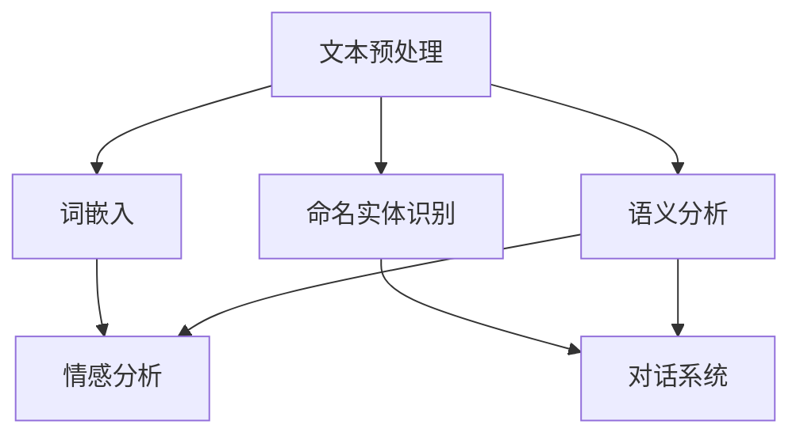
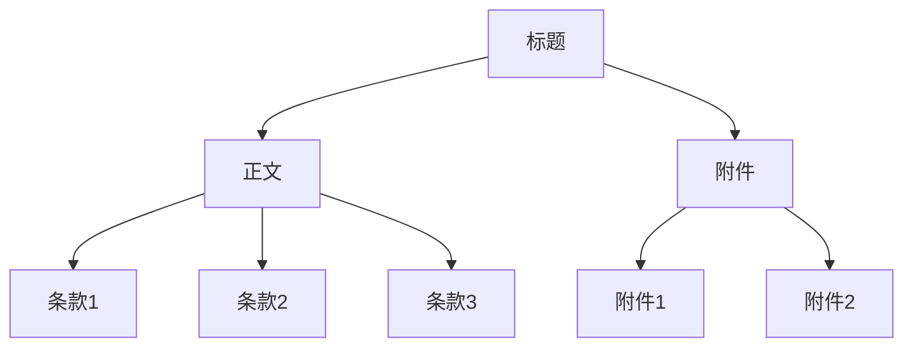
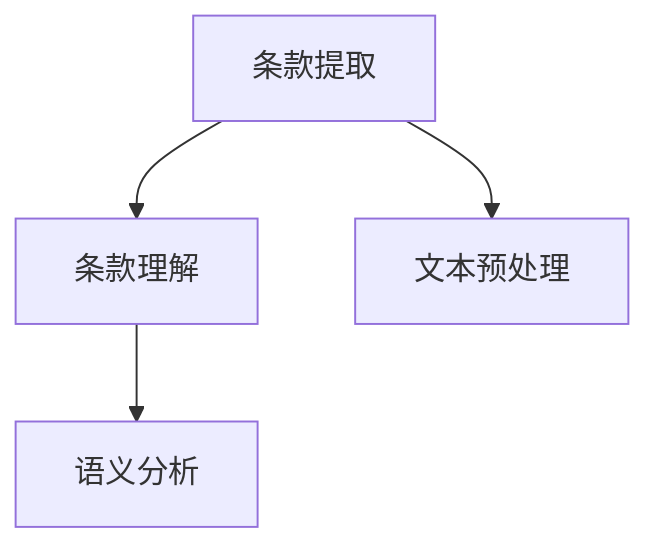
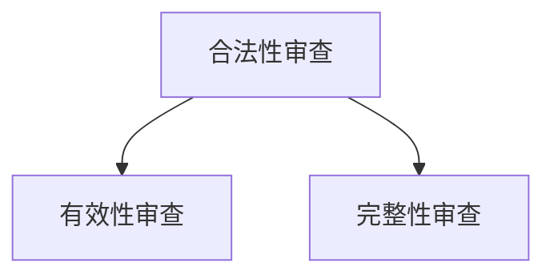
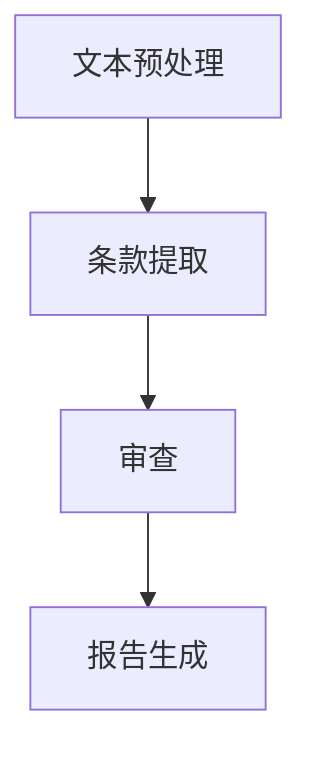

                 

## 自然语言处理在法律合同分析中的应用：提高合同审查效率

### 关键词

- 自然语言处理（NLP）
- 法律合同分析
- 合同审查效率
- 文本预处理
- 命名实体识别
- 语义分析
- 自动化审查系统

### 摘要

本文探讨了自然语言处理（NLP）技术在法律合同分析中的应用，旨在提高合同审查的效率。首先，我们回顾了NLP的基础概念和技术，包括文本预处理、词嵌入和命名实体识别等。接着，本文详细介绍了NLP在法律合同分析中的具体应用，如合同结构分析、法律条款提取和理解等。随后，我们展示了如何构建一个自动化合同审查系统，以及如何通过优化审查流程和人机协作来提高审查效率。最后，本文对NLP在法律合同分析中的未来发展趋势和挑战进行了展望，并提供了相关的最佳实践和拓展阅读建议。

---

### 第一部分：自然语言处理（NLP）基础

#### 第1章：自然语言处理概述

自然语言处理（Natural Language Processing，简称NLP）是人工智能（Artificial Intelligence，简称AI）的一个重要分支，旨在使计算机能够理解和处理人类语言。NLP技术结合了计算机科学、语言学和人工智能的原理，用于从文本中提取信息、理解和生成语言。

#### 核心概念与联系

NLP的核心概念包括：

1. **文本预处理**：对文本进行清洗、规范化、分词、词性标注等操作，以便后续处理。
2. **词嵌入**：将词汇映射到高维向量空间，以便进行计算和建模。
3. **命名实体识别**（NER）：识别文本中的命名实体，如人名、地名、组织名等。
4. **语义分析**：理解和解释文本中的语义内容，包括词义消歧、情感分析等。

这些概念之间的关系如图所示：



#### 第2章：文本预处理

文本预处理是NLP的关键步骤，其目的是将原始文本转换为适合模型输入的形式。文本预处理包括以下几个步骤：

1. **清洗**：去除文本中的噪声，如HTML标签、特殊字符、数字等。
2. **规范化**：将文本转换为统一格式，如小写、去除停用词等。
3. **分词**：将文本分割成单词或句子。
4. **词性标注**：为每个单词分配词性，如名词、动词等。
5. **停用词处理**：去除对文本理解无意义的常见单词。

```python
import nltk
from nltk.corpus import stopwords
from nltk.tokenize import word_tokenize

nltk.download('punkt')
nltk.download('stopwords')

text = "This is a sample text for NLP processing."
tokens = word_tokenize(text)
stop_words = set(stopwords.words('english'))
filtered_tokens = [w for w in tokens if not w in stop_words]
print(filtered_tokens)
```

#### 第3章：词嵌入与语义表示

词嵌入（Word Embedding）是一种将词汇映射到高维向量空间的技术，使计算机能够通过向量计算来理解和处理语言。词嵌入技术包括：

1. **词袋模型**（Bag of Words，BoW）：将文本表示为单词的频率分布。
2. **Word2Vec**：基于神经网络的词嵌入技术，通过训练模型来学习词向量。
3. **BERT**：基于注意力机制的预训练模型，通过在大规模语料库上进行预训练来学习词向量。

```python
from gensim.models import Word2Vec

# 假设 sentences 是一个包含单词列表的列表
model = Word2Vec(sentences, size=100, window=5, min_count=1, workers=4)

# 获取单词的词向量
word_vector = model.wv['sample']
print(word_vector)
```

#### 第4章：命名实体识别

命名实体识别（Named Entity Recognition，NER）是一种识别文本中特定类型命名实体的技术，如人名、地名、组织名等。NER在法律合同分析中具有重要作用，可以帮助自动提取关键信息。

NER的主要步骤包括：

1. **数据预处理**：对文本进行清洗、分词和词性标注。
2. **模型训练**：使用标注数据进行模型训练。
3. **实体识别**：使用训练好的模型对文本进行实体识别。

```python
import spacy

# 加载英语文本处理模型
nlp = spacy.load("en_core_web_sm")

# 假设 text 是一个待处理的文本
doc = nlp(text)

# 遍历文本中的命名实体
for ent in doc.ents:
    print(ent.text, ent.label_)
```

#### 第5章：文本分类与主题建模

文本分类（Text Classification）是一种将文本分为不同类别的方法，常用于情感分析、垃圾邮件检测等。主题建模（Topic Modeling）则是一种无监督学习方法，用于发现文本中的潜在主题。

文本分类的主要步骤包括：

1. **特征提取**：将文本转换为数值特征向量。
2. **模型训练**：使用训练数据训练分类模型。
3. **分类预测**：使用训练好的模型对文本进行分类预测。

主题建模的主要步骤包括：

1. **文档-单词矩阵构建**：将文本表示为文档-单词矩阵。
2. **模型训练**：使用训练数据训练主题模型。
3. **主题提取**：从训练好的模型中提取潜在主题。

```python
from sklearn.feature_extraction.text import TfidfVectorizer
from sklearn.naive_bayes import MultinomialNB

# 假设 corpus 是一个包含文本的列表，labels 是对应的标签
vectorizer = TfidfVectorizer()
X = vectorizer.fit_transform(corpus)

# 训练分类模型
model = MultinomialNB().fit(X, labels)

# 预测文本类别
predicted_labels = model.predict(X)
print(predicted_labels)
```

#### 第6章：NLP在法律文本处理中的应用

法律文本具有独特的结构和语义特点，对NLP技术提出了特殊的要求。NLP在法律合同分析中的应用主要包括：

1. **合同结构分析**：识别合同的不同部分，如正文、附件、条款等。
2. **法律条款提取**：从合同中提取关键的法律条款。
3. **语义分析**：理解法律条款的语义内容，如权利、义务、责任等。

```python
import re

# 假设 contract_text 是一个合同文本
contract_text = """
本合同由甲方（以下简称甲方）和乙方（以下简称乙方）于二零二二年十月十日签订。

第一条 甲方同意向乙方提供产品A，乙方同意按本合同约定购买产品A。

第二条 乙方应在本合同签订后七日内支付人民币100万元作为定金。

第三条 甲方应在收到定金后的三十个工作日内交付产品A。

第四条 ...
"""

# 提取合同条款
pattern = r"(?<=\n)(第[\s\S]*?条)"
clauses = re.findall(pattern, contract_text, re.DOTALL)

for clause in clauses:
    print(clause.strip())
```

### 第二部分：法律合同分析应用

#### 第7章：法律合同结构分析

法律合同通常由多个部分组成，如标题、正文、附件、条款等。合同结构分析旨在识别和解析这些部分，以便更好地理解合同的内容。

#### 核心概念与联系

合同结构分析涉及以下核心概念：

1. **标题**：合同的主题和名称。
2. **正文**：合同的主体部分，包括条款和条件。
3. **附件**：附加在合同中的文件或资料。
4. **条款**：合同中的具体规定和约定。

这些概念之间的关系如图所示：



#### 第8章：法律条款的提取与理解

法律条款是合同的核心内容，包含了双方的权利、义务和责任。提取和理解法律条款是合同分析的重要任务。

#### 核心概念与联系

法律条款的提取与理解涉及以下核心概念：

1. **条款提取**：使用文本处理技术从合同文本中提取法律条款。
2. **条款理解**：通过语义分析技术理解条款的含义和作用。

这些概念之间的关系如图所示：



#### 第9章：合同审查的关键点分析

合同审查是对合同条款的全面检查，以确保合同的合法性和有效性。合同审查的关键点分析旨在识别和解决可能存在的问题。

#### 核心概念与联系

合同审查的关键点分析涉及以下核心概念：

1. **合法性审查**：检查合同是否符合法律法规的规定。
2. **有效性审查**：检查合同条款的有效性，如是否存在矛盾、遗漏或不当条款。
3. **完整性审查**：检查合同是否完整，包括所有必要的条款和附件。

这些概念之间的关系如图所示：



#### 第10章：NLP在合同审查中的实际应用

NLP技术在合同审查中具有广泛的应用，可以显著提高审查效率和质量。实际应用包括：

1. **自动化审查**：使用NLP技术自动化提取和审查合同条款。
2. **智能问答**：构建智能问答系统，以回答关于合同条款的问题。
3. **风险识别**：通过分析合同条款，识别潜在的法律风险。

```python
import spacy

# 加载英语文本处理模型
nlp = spacy.load("en_core_web_sm")

# 假设 contract_text 是一个合同文本
doc = nlp(contract_text)

# 检查合同中的关键条款
for ent in doc.ents:
    if ent.label_ == "LEGAL":
        print(ent.text)
```

### 第三部分：提高合同审查效率

#### 第11章：自动化合同审查系统构建

构建自动化合同审查系统是提高审查效率的关键。该系统通常包括以下组件：

1. **文本预处理模块**：负责清洗、分词和词性标注等预处理任务。
2. **条款提取模块**：使用NLP技术从合同文本中提取关键条款。
3. **审查模块**：对提取的条款进行合法性、有效性和完整性审查。
4. **报告生成模块**：生成审查报告，包括发现的问题和建议。



#### 第12章：提高审查效率的方法

提高审查效率的方法包括：

1. **审查流程优化**：通过标准化审查流程和明确审查人员的职责来提高效率。
2. **自动化工具使用**：使用NLP技术和自动化审查工具来减少人工审查的工作量。
3. **人机协作**：结合人工审查和自动化审查，以充分发挥两者的优势。

```python
import spacy

# 加载英语文本处理模型
nlp = spacy.load("en_core_web_sm")

# 假设 contract_text 是一个合同文本
doc = nlp(contract_text)

# 自动化审查流程
def review_contract(contract_text):
    doc = nlp(contract_text)
    issues = []
    for ent in doc.ents:
        if ent.label_ == "LEGAL":
            issues.append(ent.text)
    return issues

# 调用审查函数
issues = review_contract(contract_text)
print(issues)
```

#### 第13章：合同审查效率评估

合同审查效率的评估是确保自动化审查系统有效性的关键。评估方法包括：

1. **准确率评估**：通过比较自动化审查结果和人工审查结果，评估自动化审查的准确率。
2. **速度评估**：测量自动化审查系统处理合同文本的速度。
3. **用户满意度评估**：通过调查用户对自动化审查系统的满意度来评估系统的用户体验。

```python
from sklearn.metrics import accuracy_score

# 假设 auto_issues 是自动化审查系统提取的关键条款
# human_issues 是人工审查结果
accuracy = accuracy_score(human_issues, auto_issues)
print("Accuracy:", accuracy)
```

#### 第14章：未来展望与挑战

未来，NLP技术在合同审查中的应用前景广阔，但同时也面临一系列挑战：

1. **法律文本的复杂性**：法律文本具有高度的复杂性和多样性，这给NLP技术提出了更高的要求。
2. **数据隐私与安全**：自动化合同审查系统涉及大量敏感信息，需要确保数据隐私和安全。
3. **法律法规的变化**：随着法律法规的不断完善和更新，自动化审查系统需要及时调整以适应新的要求。

### 附录

#### 附录A：常用NLP工具和库

常用的NLP工具和库包括：

1. **spaCy**：一个快速且易于使用的NLP库，支持多种语言。
2. **NLTK**：一个强大的NLP库，包含大量预先定义的模型和工具。
3. **Gensim**：用于生成词向量和主题模型的库。
4. **TextBlob**：一个简单易用的文本处理库，支持情感分析和文本分类。

#### 附录B：数学公式和算法伪代码

在NLP中，常用的数学公式和算法包括：

1. **词袋模型**：$$\textbf{w} = \text{count}\left(\text{v}, \text{d}\right)$$
2. **Word2Vec**：$$\textbf{v}_\text{w} = \text{sgn}\left(\text{softmax}\left(\text{U}\textbf{h}\right)\right)$$
3. **BERT**：$$\text{Output} = \text{Attention}\left(\text{Query} = \text{Embedding}\left(\text{Token}\right), \text{Key} = \text{Embedding}\left(\text{Token}\right), \text{Value} = \text{Embedding}\left(\text{Token}\right)\right)$$

```python
# 伪代码示例：Word2Vec算法
def word2vec(sentences):
    # 初始化词向量矩阵
    U = np.random.randn(vocab_size, embedding_size)
    # 初始化隐层状态
    h = np.zeros(shape=(1, hidden_size))
    # 循环迭代
    for sentence in sentences:
        for word in sentence:
            # 计算词向量
            v = count(word, sentence)
            h = sigmoid(U.dot(h))
            U = U + dh
    return U
```

### 作者

- 作者：AI天才研究院/AI Genius Institute & 禅与计算机程序设计艺术 /Zen And The Art of Computer Programming

### 结论

自然语言处理技术在法律合同分析中的应用为提高合同审查效率带来了巨大的潜力。通过文本预处理、词嵌入、命名实体识别和语义分析等技术，可以自动化提取和理解法律条款，从而减少人工审查的工作量。然而，面对法律文本的复杂性，NLP技术仍需不断发展和完善。未来，结合人工智能和法律法规的动态变化，自动化合同审查系统将发挥越来越重要的作用。同时，确保数据隐私和安全也将是NLP在法律合同分析中面临的重大挑战。通过持续的研究和技术创新，我们可以期待NLP在法律合同分析领域取得更大的突破。

