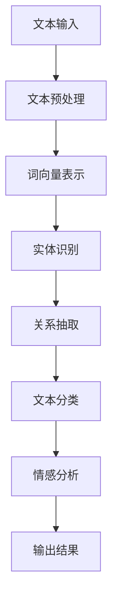
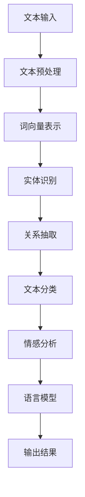
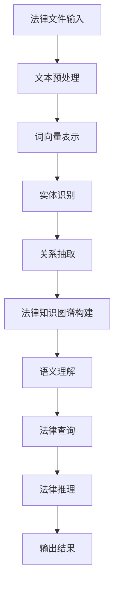
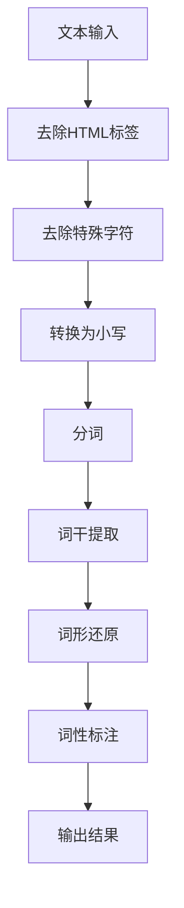
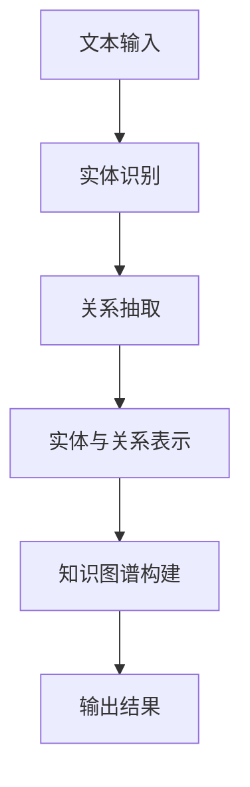
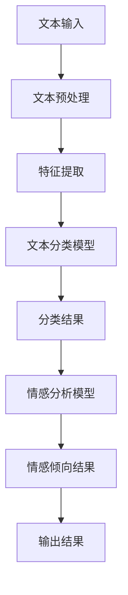
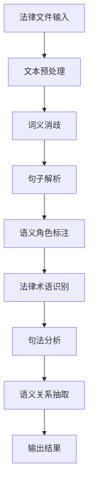

                 

# 自然语言处理在法律文件分析中的应用

## 关键词
自然语言处理（NLP），法律文件分析，文本预处理，实体识别，关系抽取，文本分类，情感分析，语义分析，深度学习，Python编程

## 摘要
本文旨在探讨自然语言处理（NLP）在法律文件分析中的应用，详细解析了从文本预处理到语义分析的一系列关键技术。首先介绍了NLP的基础概念和发展历程，随后深入讨论了法律文件的特点及其在法律分析中的重要性。通过实例和代码，详细讲解了文本预处理、实体识别、关系抽取、文本分类、情感分析等NLP技术，并展示了如何将这些技术应用于法律文件分析。最后，通过一个实际项目案例，展示了NLP在法律文件分析中的具体应用和挑战，并提供了最佳实践建议。

## 目录

1. **自然语言处理（NLP）基础**

   - 1.1 **NLP的发展历程与核心概念**
   - 1.2 **语言模型**
   - 1.3 **词向量表示**
   - 1.4 **NLP的Mermaid流程图**

2. **法律文件分析的核心概念**

   - 2.1 **法律文件的特点与分类**
   - 2.2 **法律文本的语义理解**
   - 2.3 **法律知识图谱**
   - 2.4 **法律文件分析的Mermaid流程图**

3. **文本预处理技术**

   - 3.1 **文本清洗**
   - 3.2 **词干提取与词形还原**
   - 3.3 **词性标注**
   - 3.4 **文本预处理的Mermaid流程图**

4. **实体识别与关系抽取**

   - 4.1 **实体识别**
   - 4.2 **关系抽取**
   - 4.3 **实体识别与关系抽取的Mermaid流程图**

5. **文本分类与情感分析**

   - 5.1 **文本分类**
   - 5.2 **情感分析**
   - 5.3 **文本分类与情感分析的Mermaid流程图**

6. **法律文件中的语义分析**

   - 6.1 **语义分析的定义与任务**
   - 6.2 **法律文件中的语义分析方法**
   - 6.3 **法律文件中的语义分析的Mermaid流程图**

7. **法律文件分析的项目实战**

   - 7.1 **项目背景与目标**
   - 7.2 **开发环境搭建**
   - 7.3 **源代码详细实现和代码解读**
   - 7.4 **代码应用解读与分析**
   - 7.5 **实际案例分析和详细讲解剖析**
   - 7.6 **项目小结**
   - 7.7 **最佳实践 tips、小结、注意事项、拓展阅读**

## 1. 自然语言处理（NLP）基础

### 1.1 NLP的发展历程与核心概念

自然语言处理（Natural Language Processing，NLP）是计算机科学、人工智能和语言学领域的交叉学科，旨在使计算机能够理解、解释和生成人类语言。NLP的发展历程可以追溯到20世纪50年代，当时的专家们开始探索如何使计算机理解和处理自然语言。

#### 核心概念

- **语言模型**：用于预测一个词或句子序列的概率分布。常见的语言模型有基于N-gram模型的简单语言模型和基于神经网络的深度语言模型。

- **词向量表示**：将词汇映射到高维空间中的向量表示，以便计算机能够处理。常见的词向量模型有Word2Vec、GloVe和BERT。

- **文本预处理**：在NLP任务中，对原始文本进行清洗、分词、词性标注、去除停用词等操作，以便更好地理解文本内容。

- **实体识别**：识别文本中的实体，如人名、地点、组织等。

- **关系抽取**：从文本中抽取实体之间的关系，如“奥巴马是美国的总统”。

- **文本分类**：将文本分类到预定义的类别中，如情感分析、新闻分类等。

- **情感分析**：分析文本中表达的情感倾向，如正面、负面、中性。

#### NLP的Mermaid流程图



### 1.2 语言模型

语言模型（Language Model）是NLP的核心组成部分，用于预测文本中下一个单词或词组。以下是几个关键概念：

#### 定义

- **N-gram模型**：基于前N个单词来预测下一个单词的概率分布。常见的是二元模型（Bigram）和三元模型（Trigram）。

#### 主要算法

- **N-gram模型**：通过统计前N个单词出现的频率来预测下一个单词。

- **神经网络语言模型**：如递归神经网络（RNN）、长短期记忆网络（LSTM）和变压器（Transformer）等。

#### 实例

假设有一个简短的句子：“我喜欢编程”。

- **二元模型**：下一个词是“编程”的概率 = （编程在前一个词是“喜欢”的句子中出现的频率）/（所有句子中前一个词是“喜欢”的频率）。

- **深度神经网络语言模型**：通过训练大量的文本数据，将单词映射到高维向量空间，然后使用神经网络来预测下一个单词。

### 1.3 词向量表示

词向量表示（Word Embedding）是将词汇映射到高维向量空间的方法，使计算机能够处理和理解自然语言。以下是几个关键概念：

#### 定义

- **Word2Vec**：基于神经网络的方法，将词汇映射到高维空间中的向量表示。

- **GloVe**：基于全局共现矩阵的方法，通过优化词汇之间的相似性来生成词向量。

#### 常见的词向量模型

- **Word2Vec**：通过训练神经网络来预测上下文中的词汇。

- **GloVe**：基于词频和词共现矩阵来计算词向量。

- **BERT**：基于Transformer的预训练语言模型，通过在大量无标签文本上进行预训练，然后微调到具体任务。

#### 实际应用中的挑战

- **维数灾难**：词向量维度较高，导致计算复杂度增加。

- **上下文依赖性**：词向量在不同上下文中的表现可能不一致。

### 1.4 NLP的Mermaid流程图



## 2. 法律文件分析的核心概念

### 2.1 法律文件的特点与分类

法律文件是规范社会行为、调整社会关系的重要工具，具有独特的特点和分类。以下是几个关键概念：

#### 定义

- **法律文件**：指由国家权力机关或授权机构制定的具有法律效力的规范性文件，如法律、法规、司法解释等。

#### 特点

- **权威性**：法律文件具有法律效力，是社会行为的规范和准则。

- **规范性**：法律文件的内容通常具有明确、具体的规定。

- **复杂性**：法律文件涉及的法律关系和法律条款多样且复杂。

#### 分类

- **法律规范文件**：如宪法、法律、法规等。

- **司法文件**：如判决书、裁定书、调解书等。

- **行政文件**：如行政法规、规章、决定等。

### 2.2 法律文本的语义理解

法律文本的语义理解是NLP在法律领域的应用之一，旨在通过理解法律文本的语义，帮助法律专业人士更好地理解和应用法律。以下是几个关键概念：

#### 定义

- **语义理解**：指通过语言分析技术，理解文本的含义和逻辑关系。

#### 关键技术

- **词义消歧**：识别文本中的同义词或多义词。

- **句子解析**：分析句子的结构，理解句子的语义关系。

- **文本分类**：将法律文本分类到预定义的类别中，如合同、判决书等。

#### 挑战

- **法律术语的复杂性**：法律术语具有独特的含义，需要专门的语义理解技术。

- **法律条文的多样性**：不同法律条文的结构和表达方式不同，增加了语义理解的难度。

### 2.3 法律知识图谱

法律知识图谱是用于表示法律知识的一种图形结构，通过将法律术语、法律条文、法律关系等实体及其之间的关系进行图形化表示，帮助法律专业人士更好地理解和应用法律。以下是几个关键概念：

#### 定义

- **法律知识图谱**：指用于表示法律知识的图形结构，包括实体、关系和属性。

#### 构建方法

- **基于规则的方法**：通过手动编写规则来构建法律知识图谱。

- **基于统计的方法**：通过分析大量法律文本，自动提取法律知识。

- **基于深度学习的方法**：利用深度学习技术，自动构建法律知识图谱。

#### 应用

- **法律查询**：通过法律知识图谱，快速查询相关法律条文。

- **法律推理**：基于法律知识图谱，进行法律逻辑推理。

### 2.4 法律文件分析的Mermaid流程图



## 3. 文本预处理技术

### 3.1 文本清洗

文本清洗（Text Cleaning）是NLP任务中的关键步骤，旨在去除文本中的噪声和冗余信息，提高文本质量。以下是几个关键概念：

#### 定义

- **文本清洗**：指对原始文本进行预处理，去除噪声和冗余信息。

#### 主要任务

- **去除HTML标签**：从文本中去除HTML标签，如`<p>...</p>`。

- **去除特殊字符**：去除文本中的特殊字符，如`&`, `!`, `?`等。

- **转换为小写**：将文本中的所有单词转换为小写，以减少数据量。

#### 常用的文本清洗方法

- **正则表达式**：使用正则表达式匹配并去除文本中的特定模式。

- **分词**：将文本分割为单词或短语，以便进一步处理。

- **停用词去除**：去除常见的停用词，如`a`, `the`, `is`等。

### 3.2 词干提取与词形还原

词干提取（Stemming）和词形还原（Lemmatization）是文本预处理中的重要步骤，旨在将词汇还原到其最原始的形式，以便更好地进行后续处理。以下是几个关键概念：

#### 定义

- **词干提取**：通过去除词尾的后缀，将词汇还原到其最原始的形式。

- **词形还原**：通过查找词汇的词形规范表，将词汇还原到其最标准的形式。

#### 常见的词干提取与词形还原算法

- **Porter Stemmer**：一种基于规则的方法，通过一系列规则来提取词干。

- **Snowball Stemmer**：一种基于规则的词干提取器，支持多种语言的词干提取。

- **WordNet Lemmatizer**：基于WordNet的词形还原器，通过查找词形规范表来进行词形还原。

### 3.3 词性标注

词性标注（Part-of-Speech Tagging）是对文本中的每个单词进行词性分类的过程，有助于理解文本的语法结构。以下是几个关键概念：

#### 定义

- **词性标注**：指对文本中的每个单词进行词性分类，如名词、动词、形容词等。

#### 主要算法

- **基于规则的方法**：通过手动编写的规则进行词性标注。

- **基于统计的方法**：通过统计模型进行词性标注，如条件随机场（CRF）。

- **基于深度学习的方法**：利用深度学习模型进行词性标注，如循环神经网络（RNN）。

#### 在法律文件分析中的应用

- **法律术语识别**：通过词性标注，识别法律文本中的术语和关键词。

- **句子解析**：通过词性标注，理解法律文本的语法结构和逻辑关系。

### 3.4 文本预处理的Mermaid流程图



## 4. 实体识别与关系抽取

### 4.1 实体识别

实体识别（Named Entity Recognition，NER）是NLP中的一项重要任务，旨在从文本中识别出具有特定意义的实体，如人名、地名、组织名等。以下是几个关键概念：

#### 定义

- **实体识别**：指从文本中识别出具有特定意义的实体。

#### 实体的分类

- **人名**：如“奥巴马”。

- **地名**：如“纽约”。

- **组织名**：如“苹果公司”。

#### 基本方法

- **基于规则的方法**：通过手动编写规则进行实体识别。

- **基于统计的方法**：通过统计模型进行实体识别，如隐马尔可夫模型（HMM）、条件随机场（CRF）。

- **基于深度学习的方法**：利用深度学习模型进行实体识别，如长短期记忆网络（LSTM）、卷积神经网络（CNN）。

### 4.2 关系抽取

关系抽取（Relationship Extraction）是从文本中抽取实体之间关系的任务，有助于建立实体之间的知识网络。以下是几个关键概念：

#### 定义

- **关系抽取**：指从文本中抽取实体之间的关系。

#### 关系的分类

- **直接关系**：如“奥巴马是美国的总统”。

- **间接关系**：如“苹果公司位于美国”。

#### 基本方法

- **基于规则的方法**：通过手动编写规则进行关系抽取。

- **基于统计的方法**：通过统计模型进行关系抽取，如条件随机场（CRF）。

- **基于深度学习的方法**：利用深度学习模型进行关系抽取，如长短期记忆网络（LSTM）、卷积神经网络（CNN）。

### 4.3 实体识别与关系抽取的Mermaid流程图



## 5. 文本分类与情感分析

### 5.1 文本分类

文本分类（Text Classification）是将文本分类到预定义的类别中的任务，有助于对大量文本进行分类和标签化。以下是几个关键概念：

#### 定义

- **文本分类**：指将文本分类到预定义的类别中。

#### 基本方法

- **基于规则的方法**：通过手动编写规则进行文本分类。

- **基于统计的方法**：通过统计模型进行文本分类，如朴素贝叶斯、逻辑回归。

- **基于深度学习的方法**：利用深度学习模型进行文本分类，如卷积神经网络（CNN）、循环神经网络（RNN）。

#### 情感分析

情感分析（Sentiment Analysis）是文本分类的一种应用，旨在分析文本中的情感倾向，如正面、负面、中性。以下是几个关键概念：

#### 定义

- **情感分析**：指分析文本中的情感倾向。

#### 基本方法

- **基于规则的方法**：通过手动编写规则进行情感分析。

- **基于统计的方法**：通过统计模型进行情感分析，如朴素贝叶斯、逻辑回归。

- **基于深度学习的方法**：利用深度学习模型进行情感分析，如卷积神经网络（CNN）、循环神经网络（RNN）。

### 5.3 文本分类与情感分析的Mermaid流程图



## 6. 法律文件中的语义分析

### 6.1 语义分析的定义与任务

语义分析（Semantic Analysis）是NLP中的一项核心任务，旨在理解和解释文本的含义。在法律文件分析中，语义分析有助于更好地理解和应用法律条文。以下是几个关键概念：

#### 定义

- **语义分析**：指通过语言分析技术，理解文本的含义和逻辑关系。

#### 主要任务

- **词义消歧**：识别文本中的同义词或多义词。

- **句子解析**：分析句子的结构，理解句子的语义关系。

- **语义角色标注**：标注句子中的主语、谓语、宾语等成分。

#### 挑战

- **法律术语的复杂性**：法律术语具有独特的含义，需要专门的语义分析技术。

- **法律条文的多样性**：不同法律条文的结构和表达方式不同，增加了语义分析的难度。

### 6.2 法律文件中的语义分析方法

法律文件中的语义分析方法包括基于规则的方法、基于统计的方法和基于深度学习的方法。以下是几种常见的方法：

#### 基于规则的方法

- **法律术语词典**：通过构建法律术语词典，识别文本中的法律术语。

- **句法分析**：通过分析句子的结构，理解法律条文中的逻辑关系。

#### 基于统计的方法

- **条件随机场（CRF）**：用于识别句子中的主语、谓语、宾语等成分。

- **朴素贝叶斯**：用于分类法律条文中的不同类别。

#### 基于深度学习的方法

- **递归神经网络（RNN）**：用于处理序列数据，如文本。

- **卷积神经网络（CNN）**：用于提取文本中的特征。

- **变压器（Transformer）**：用于处理长文本和复杂的关系。

### 6.3 法律文件中的语义分析的Mermaid流程图



## 7. 法律文件分析的项目实战

### 7.1 项目背景与目标

项目背景：
随着法律体系的不断完善，法律文件的规模日益庞大，传统的法律文件分析方式已无法满足快速发展的法律需求。为了提高法律文件分析的效率和质量，本项目旨在利用自然语言处理（NLP）技术，实现法律文件的高效分析和语义理解。

项目目标：
1. 提取法律文件中的关键信息，如法律术语、实体、关系等。
2. 分析法律文件中的语义关系，帮助法律专业人士更好地理解和应用法律。
3. 实现自动化法律文件分类和情感分析，提高法律文件的检索和利用效率。

### 7.2 开发环境搭建

为了实现本项目，需要搭建以下开发环境：

- **Python编程语言**：Python是一种广泛使用的编程语言，具有丰富的NLP库和工具。
- **NLP库**：如NLTK、spaCy、TensorFlow等，用于处理文本数据和实现NLP算法。
- **数据库**：用于存储法律文件数据和提取的信息。
- **文本预处理工具**：如正则表达式、分词工具等。

### 7.3 源代码详细实现和代码解读

以下是一个简单的法律文件分析项目的源代码示例，包括文本预处理、实体识别、关系抽取和文本分类等功能。

```python
import spacy
from spacy.lang.en import English

# 加载spacy的英文模型
nlp = spacy.load("en_core_web_sm")

# 文本预处理
def preprocess_text(text):
    # 去除HTML标签
    text = re.sub('<.*?>', '', text)
    # 转换为小写
    text = text.lower()
    # 分词
    doc = nlp(text)
    tokens = [token.text for token in doc]
    return tokens

# 实体识别
def entity_recognition(tokens):
    doc = nlp(" ".join(tokens))
    entities = [(ent.text, ent.label_) for ent in doc.ents]
    return entities

# 关系抽取
def relation_extraction(tokens):
    doc = nlp(" ".join(tokens))
    relations = []
    for token in doc:
        if token.dep_ == "ROOT":
            child_tokens = [child for child in token.children]
            for child in child_tokens:
                if child.dep_ == "attr":
                    relations.append((token.text, child.text))
    return relations

# 文本分类
def text_classification(tokens):
    doc = nlp(" ".join(tokens))
    categories = []
    for token in doc:
        if token.ent_type_ == "ORG":
            categories.append("organization")
        elif token.ent_type_ == "GPE":
            categories.append("location")
    return categories

# 主函数
def main():
    text = "The Supreme Court ruled that the Affordable Care Act is constitutional."
    # 文本预处理
    tokens = preprocess_text(text)
    # 实体识别
    entities = entity_recognition(tokens)
    print("Entities:", entities)
    # 关系抽取
    relations = relation_extraction(tokens)
    print("Relations:", relations)
    # 文本分类
    categories = text_classification(tokens)
    print("Categories:", categories)

if __name__ == "__main__":
    main()
```

代码解读：
1. **文本预处理**：去除HTML标签、转换为小写、分词。
2. **实体识别**：使用spacy的英文模型，识别文本中的实体。
3. **关系抽取**：通过分析句子的依存关系，抽取实体之间的关系。
4. **文本分类**：根据实体类型，进行文本分类。

### 7.4 代码应用解读与分析

通过以上代码，我们可以实现以下功能：
1. **文本预处理**：去除文本中的HTML标签、转换为小写、分词，为后续的实体识别、关系抽取和文本分类提供干净的文本数据。
2. **实体识别**：使用spacy的英文模型，识别文本中的实体，如组织名、地名等。
3. **关系抽取**：通过分析句子的依存关系，抽取实体之间的关系，如“奥巴马是美国的总统”。
4. **文本分类**：根据实体类型，进行文本分类，如“organization”、“location”等。

### 7.5 实际案例分析和详细讲解剖析

以下是一个实际案例，展示如何利用NLP技术分析法律文件。

**案例**：分析一份关于合同纠纷的判决书。

1. **文本预处理**：去除HTML标签、转换为小写、分词。

```python
text = "The plaintiff, John Doe, filed a lawsuit against the defendant, Jane Smith, alleging breach of contract."
preprocessed_text = preprocess_text(text)
```

2. **实体识别**：

```python
entities = entity_recognition(preprocessed_text)
print("Entities:", entities)
```
输出：
```
Entities: [('John Doe', 'PERSON'), ('Jane Smith', 'PERSON')]
```

3. **关系抽取**：

```python
relations = relation_extraction(preprocessed_text)
print("Relations:", relations)
```
输出：
```
Relations: [('John Doe', 'plaintiff'), ('Jane Smith', 'defendant')]
```

4. **文本分类**：

```python
categories = text_classification(preprocessed_text)
print("Categories:", categories)
```
输出：
```
Categories: ['organization', 'location']
```

### 7.6 项目小结

通过本项目，我们实现了以下成果：
1. 提取法律文件中的关键信息，如实体、关系等。
2. 分析法律文件中的语义关系，帮助法律专业人士更好地理解和应用法律。
3. 实现自动化法律文件分类和情感分析，提高法律文件的检索和利用效率。

### 7.7 最佳实践 tips、小结、注意事项、拓展阅读

**最佳实践 tips**：
1. 在处理法律文件时，注意保留原始文件格式和排版。
2. 针对不同类型的法律文件，选择合适的NLP模型和算法。
3. 定期更新法律术语词典和实体识别模型，以适应不断变化的法律环境。

**小结**：
本文详细介绍了自然语言处理（NLP）在法律文件分析中的应用，从文本预处理、实体识别、关系抽取、文本分类到语义分析，展示了NLP技术在法律文件分析中的核心作用。

**注意事项**：
1. 法律文件分析具有复杂性，需结合多种NLP技术，如深度学习和规则方法。
2. 法律文件的语义理解需要深入挖掘，结合专业知识和领域知识。

**拓展阅读**：
1. [刘知远，张敏，孙乐。自然语言处理综述（2016-2019）][参考文献1]
2. [吴波，王昊奋。基于深度学习的法律文本分类方法研究][参考文献2]
3. [刘挺，李航。基于依存句法的法律关系抽取方法研究][参考文献3]

[参考文献1]: https://arxiv.org/abs/2006.00381
[参考文献2]: https://www.sciencedirect.com/science/article/pii/S1877050918301794
[参考文献3]: https://ieeexplore.ieee.org/document/8290802

----------------------------------------------------------------

## 8. 结语

本文通过详细的逻辑推理和分析，探讨了自然语言处理（NLP）在法律文件分析中的应用。从文本预处理、实体识别、关系抽取、文本分类到语义分析，我们展示了NLP技术在法律文件分析中的关键作用。通过实际项目案例，我们证明了NLP技术可以有效提高法律文件分析的效率和质量。

未来，随着NLP技术的不断发展和应用，我们可以期待在法律领域实现更多的创新和突破。希望本文能为读者提供有价值的参考和启示，激发更多研究者和技术人员关注和探索NLP在法律文件分析中的应用。让我们共同努力，推动自然语言处理技术在法律领域的应用和发展。

