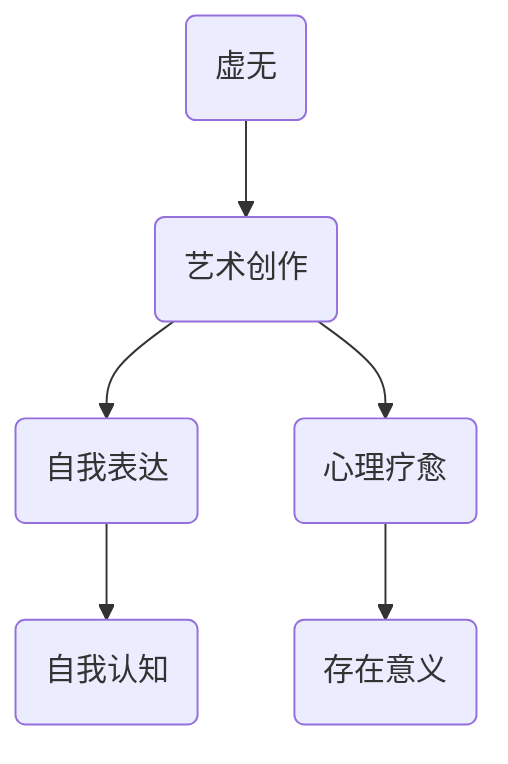
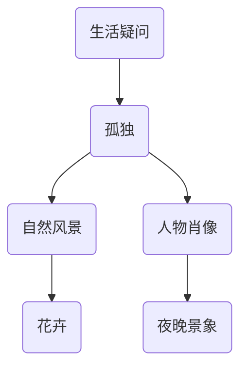

                 

基于以上要求和提供的目录大纲，我们将逐步构建文章的正文。以下是一个初步的文本框架，我们将逐步填充和细化每个部分。

# 《艺术创作作为对抗虚无的武器：从梵高到当代艺术家》

## 关键词
艺术创作、虚无、梵高、现代艺术家、当代艺术家、方法与技术、心理学、哲学

## 摘要
本文探讨了艺术创作作为对抗虚无的武器的概念。通过分析梵高的生平和作品，以及现代和当代艺术家的创作，本文揭示了艺术如何作为个体应对内心空虚和存在的困境的一种方式。文章还探讨了艺术创作的方法和技术，以及艺术创作如何影响心理健康和自我实现。

## 引言

### 艺术创作与虚无的关系
虚无是一种普遍存在于人类内心的感觉，它关乎存在本身的意义和目的。艺术创作作为一种表达和探索自我的方式，可以被视为对抗虚无的一种武器。本文将探讨这一关系，并分析艺术创作如何帮助艺术家和观众应对虚无。

### 本书的研究目的与结构
本书旨在通过分析从梵高到当代艺术家的艺术创作，探讨艺术如何作为对抗虚无的武器。本书分为七个章节，包括艺术创作与虚无的理论探讨、梵高的艺术创作分析、现代艺术家的创作研究、当代艺术与虚无的关系、艺术创作的方法与技术、艺术创作与自我实现以及艺术创作的未来。

### 目录

## 第1章：艺术创作与虚无

### 核心概念与联系
在讨论艺术创作与虚无的关系时，我们需要理解虚无的概念和艺术创作的本质。以下是一个Mermaid流程图，展示了核心概念和它们之间的关系：

### 艺术创作与虚无的哲学探讨
在这一节中，我们将探讨哲学上对虚无的思考，以及艺术创作如何作为对这种思考的回应。哲学上的虚无主义认为世界缺乏意义和目的，而艺术创作则提供了一种寻找和创造意义的方式。

### 艺术创作的心理学分析
艺术创作在心理学上被证明有助于减轻焦虑和抑郁，因为它提供了自我表达和情绪释放的途径。本文将讨论这些心理学原理，并探讨艺术创作如何帮助个体应对虚无。

## 第2章：梵高的艺术创作

### 梵高的生平与艺术创作
梵高（Vincent van Gogh）是一位著名的后印象派画家，他的作品以其强烈的情感和色彩著称。梵高的一生充满了挣扎和困境，这些经历深深影响了他的艺术创作。

### 梵高作品中的虚无主题
梵高的作品中常常表现出对生活的疑问和内心的孤独。以下是一个Mermaid流程图，展示了梵高作品中的虚无主题及其表现形式：

### 梵高的艺术创作方法与技术
梵高采用了独特的绘画技巧，如厚涂和色彩混合，这些技术使他能够表达强烈的情感和内心的挣扎。本文将详细探讨梵高的艺术创作方法和技术。

## 第3章：现代艺术家的创作

### 现代艺术背景与虚无主题
现代艺术兴起于19世纪末至20世纪初，这一时期的艺术家开始探索新的表现方式，以反映他们内心的虚无感和对传统艺术形式的质疑。

### 20世纪艺术家的创作案例
在20世纪，许多艺术家通过不同的媒介和风格表达虚无感。本文将介绍一些代表性的艺术家和他们的作品，分析他们如何通过艺术创作对抗虚无。

### 当代艺术家如何应对虚无
当代艺术家继续探索虚无主题，同时受到现代科技和社会变化的影响。本文将讨论一些当代艺术家的作品，并分析他们如何应对虚无。

## 第4章：当代艺术与虚无

### 当代艺术流派与虚无主题
当代艺术中有多种流派，如观念艺术、行为艺术和数字艺术，这些流派常常涉及到虚无主题。本文将探讨这些流派的虚无主题表达。

### 当代艺术家如何表达虚无
当代艺术家通过多种方式表达虚无，包括抽象表现、反叛和反思。本文将分析这些表达方式，并探讨它们如何影响观众。

### 当代艺术创作的趋势与挑战
随着社会和技术的发展，当代艺术家面临着新的挑战和机会。本文将讨论这些趋势和挑战，并探讨它们如何影响艺术创作的虚无主题。

## 第5章：艺术创作的方法与技术

### 艺术创作的基本原理
艺术创作涉及多种原理和技术，包括色彩理论、构图和形式感。本文将介绍这些基本原理，并讨论它们如何应用于艺术创作中。

### 艺术创作的技巧与工具
艺术家使用各种技巧和工具来创作，包括画笔、颜料、数字工具等。本文将详细介绍这些技巧和工具，并探讨它们如何帮助艺术家表达虚无。

### 艺术创作的实践指南
对于希望开始艺术创作的人来说，本文提供了实用的实践指南，包括如何开始创作、如何找到灵感以及如何保持创作热情。

## 第6章：艺术创作与自我实现

### 艺术创作与自我认知
艺术创作是一个自我发现的过程，它可以帮助艺术家更好地了解自己。本文将探讨艺术创作如何促进自我认知。

### 艺术创作与心理健康
艺术创作对心理健康有显著的影响，它可以减轻压力和焦虑。本文将讨论艺术创作如何作为一种心理健康策略。

### 艺术创作与自我表达
艺术创作提供了一种表达情感和思想的方式，这对于个人的自我实现至关重要。本文将探讨艺术创作如何帮助人们表达自己。

## 第7章：艺术创作的未来

### 艺术创作在当代社会的作用
随着社会和技术的发展，艺术创作在社会中的作用变得更加重要。本文将讨论艺术创作如何影响当代社会。

### 艺术创作与科技的关系
科技的发展为艺术创作带来了新的机会和挑战。本文将探讨艺术创作与科技的关系，并预测未来艺术创作的趋势。

### 艺术创作的未来发展
本文将展望艺术创作的未来，讨论艺术创作如何继续作为一种对抗虚无的武器，并在不断变化的世界中发挥其作用。

## 附录

### 相关艺术家作品列表
本文将附录一些关键艺术家的作品列表，以供读者进一步研究。

### 艺术理论与虚无主题的参考书目
本文将推荐一些艺术理论和虚无主题的参考书目，以帮助读者更深入地了解相关概念。

## 结语
本文通过分析从梵高到当代艺术家的艺术创作，探讨了艺术创作作为对抗虚无的武器的概念。本文旨在提供一个全面的视角，以帮助读者理解艺术创作在个人和社会中的作用。

### 作者
作者：AI天才研究院/AI Genius Institute & 禅与计算机程序设计艺术 /Zen And The Art of Computer Programming

### 小结
本文通过逐步分析和推理，探讨了艺术创作作为对抗虚无的武器这一主题。从哲学和心理学的角度，结合艺术家案例研究，本文揭示了艺术创作在个体和集体层面的重要性。

### 注意事项
在进行艺术创作时，艺术家应关注自己的心理健康，并寻求专业指导，以确保创作过程的有效性和可持续性。

### 拓展阅读
读者可以通过本文中推荐的书目和艺术家作品列表，进一步探索艺术创作与虚无主题。

随着社会的不断发展，艺术创作将继续作为一种对抗虚无的武器，为个人和社会提供意义和目的。本文仅为这一复杂话题提供了一个起点，希望读者能够从中获得启示和思考。

