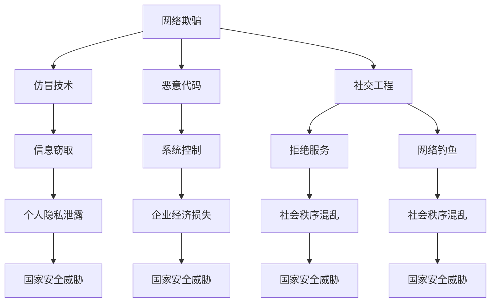

                 

### 虚假信息安全技术的概述

#### 1.1 虚假信息安全技术的概念与定义

虚假信息安全技术，顾名思义，是指通过欺骗、伪造等手段，对信息安全进行恶意破坏的技术。它主要包括但不限于网络欺骗、仿冒技术、恶意代码、社交工程等。虚假信息技术的特点在于其隐蔽性强、攻击方式多样、难以检测和防御。以下是几种常见的虚假信息安全技术的定义：

- **网络欺骗**：通过伪装成合法的网络通信，欺骗接收者进行非法操作或泄露敏感信息。
- **仿冒技术**：模仿合法用户或实体，以达到非法获取信息、控制资源的目的。
- **恶意代码**：包括病毒、蠕虫、木马等，专门设计用来破坏、窃取或篡改计算机系统中的信息。
- **社交工程**：利用人的心理弱点，通过诱骗手段获取信息或控制目标系统。

#### 1.2 虚假信息安全技术的来源与特点

虚假信息安全技术的来源多样，包括黑客组织、恐怖分子、有组织的犯罪团伙，以及一些为了谋取经济利益的个人。以下是其主要来源和特点：

- **黑客组织**：专业的黑客团体，拥有丰富的技术储备和协作能力，目标是获取经济利益、揭露系统漏洞或进行政治宣传。
- **恐怖分子**：利用虚假信息安全技术进行网络攻击，以达到恐吓公众、破坏社会秩序的目的。
- **有组织的犯罪团伙**：利用虚假信息安全技术进行非法活动，如网络诈骗、信息窃取、网络盗窃等。
- **个人行为**：部分个体出于个人兴趣或经济利益，进行虚假信息安全技术的开发和利用。

虚假信息安全技术的特点如下：

- **隐蔽性强**：虚假安全技术往往伪装成合法的通信或操作，使得检测和防御难度增加。
- **攻击方式多样**：从网络层、应用层到社交层，虚假安全技术可以采用多种方式进行攻击。
- **难以检测和防御**：由于虚假安全技术的隐蔽性和多样性，传统的安全防护手段往往难以有效防御。

#### 1.3 虚假信息安全技术的分类

根据攻击目的和手段，虚假信息安全技术可以大致分为以下几类：

- **信息窃取类**：通过虚假安全技术获取用户的敏感信息，如个人身份信息、账户密码等。
- **系统控制类**：通过控制目标系统的操作权限，实现对系统的非法控制。
- **拒绝服务类**：通过虚假安全技术使目标系统无法正常提供服务，如DDoS攻击。
- **网络钓鱼类**：通过虚假安全技术诱骗用户输入个人信息，从而实现非法利益。
- **恶意传播类**：通过虚假安全技术传播恶意代码或信息，如病毒邮件、恶意链接等。

#### 1.4 虚假信息安全技术的危害

虚假信息安全技术的危害严重，不仅影响个人和企业信息的安全，还对整个社会的稳定和发展造成威胁。以下是虚假信息安全技术的主要危害：

- **个人隐私泄露**：虚假安全技术可以轻易窃取用户的个人信息，如身份证号、银行账户等，导致严重的隐私泄露问题。
- **企业经济损失**：企业面临虚假安全技术的攻击时，可能导致系统瘫痪、数据丢失，从而造成巨大的经济损失。
- **社会秩序混乱**：虚假安全技术会导致网络诈骗、网络犯罪等案件频发，影响社会秩序的稳定。
- **国家安全威胁**：虚假安全技术可能被用于攻击关键基础设施，如电力系统、交通系统等，威胁国家安全。

#### 1.5 虚假信息安全技术的发展趋势

随着技术的不断进步，虚假信息安全技术也在不断进化。以下是虚假信息安全技术的发展趋势：

- **智能化**：虚假安全技术逐渐采用人工智能技术，提高其隐蔽性和攻击效率。
- **多样化**：虚假安全技术的攻击手段越来越多样化，从网络层到应用层，从计算机系统到移动设备，攻击范围不断扩展。
- **高级持续性威胁**（APT）：APT攻击具有长期隐蔽、目标明确、攻击手段复杂等特点，成为虚假信息安全技术的重点发展方向。
- **区块链应用**：区块链技术的应用为虚假信息安全技术提供了新的攻击和防御手段。

#### 1.6 虚假信息安全技术的应用现状

虚假信息安全技术在全球范围内广泛应用，尤其在金融、医疗、政府等关键领域。以下是虚假信息安全技术的应用现状：

- **金融领域**：虚假信息安全技术常用于网络钓鱼、金融诈骗等，导致大量经济损失。
- **医疗领域**：虚假信息安全技术可窃取患者隐私，影响医疗服务质量。
- **政府领域**：虚假信息安全技术可能用于攻击政府机构，影响国家安全。
- **移动设备**：随着移动互联网的发展，虚假信息安全技术在移动设备上的应用也越来越广泛。

#### 1.7 虚假信息安全技术的影响与挑战

虚假信息安全技术对个人、企业和整个社会带来了深远的影响和挑战。以下是虚假信息安全技术的影响和挑战：

- **信息安全意识提升**：虚假信息安全技术的威胁使得个人和企业更加关注信息安全，提升安全意识。
- **技术创新**：虚假信息安全技术的威胁促使安全技术的发展，推动信息安全领域的技术创新。
- **法律监管**：虚假信息安全技术的威胁使得各国政府加强对网络安全的监管，制定相关法律法规。
- **国际合作**：虚假信息安全技术的跨国特性要求各国加强合作，共同应对安全威胁。

### 总结

虚假信息安全技术作为一种高隐蔽性、高威胁性的安全技术，正越来越受到关注。了解其概念、来源、特点、分类、危害、发展趋势和应用现状，有助于我们更好地应对这一挑战。在接下来的章节中，我们将进一步探讨虚假信息安全技术的核心概念、历史背景、核心算法原理，以及防范和对策。

---

**核心概念与联系：虚假信息安全技术核心概念之间的关系架构图**

---

通过上述章节，我们对虚假信息安全技术有了初步的了解。在接下来的章节中，我们将深入探讨虚假信息安全技术的发展历程、核心概念与原理，以及相关技术与方法。同时，我们将分析虚假信息安全技术的风险和对策，并结合实际案例进行详细讲解。希望通过本文，读者能够全面了解虚假信息安全技术的本质和应对策略。

---

**作者：AI天才研究院/AI Genius Institute & 禅与计算机程序设计艺术 /Zen And The Art of Computer Programming**

