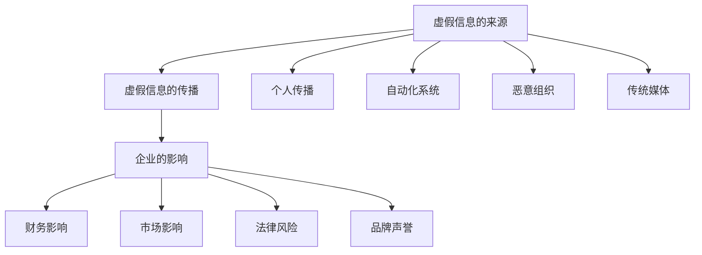
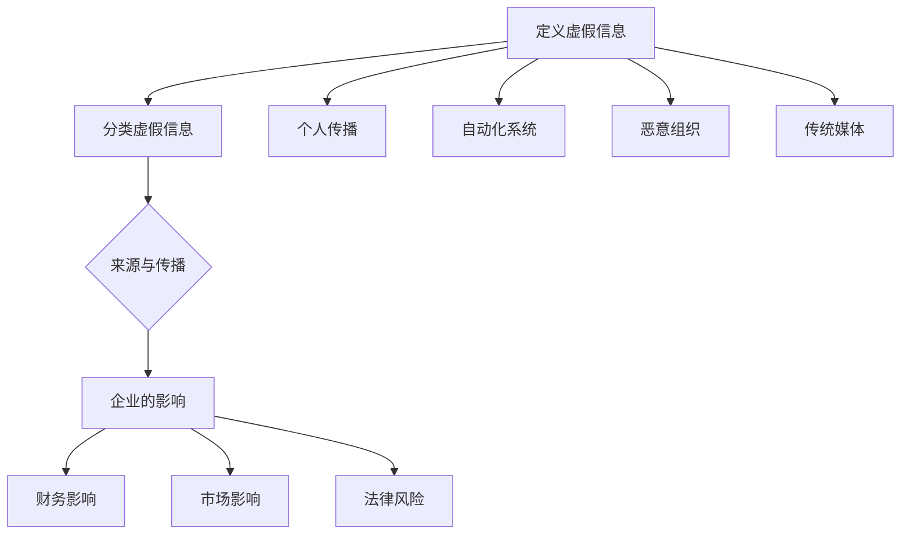
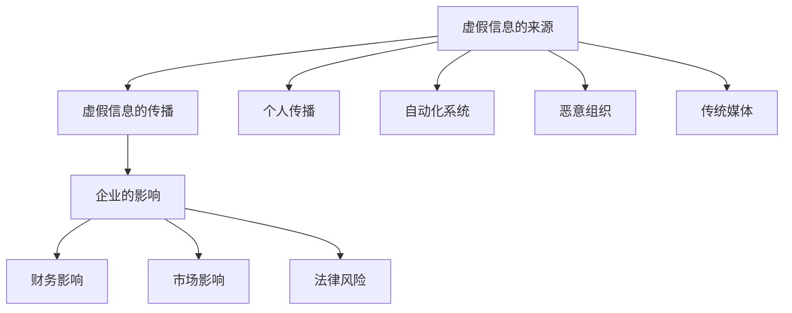

                 

### 《虚假信息对企业的潜在危害及防御策略》

> **关键词**：虚假信息、企业危害、防御策略、算法原理、案例分析

> **摘要**：本文将深入探讨虚假信息对企业的潜在危害，并详细解析一系列防御策略。通过分析虚假信息的定义、来源、传播方式及其对企业的影响，本文将介绍几种核心算法原理，如自然语言处理和机器学习，展示如何运用这些算法来检测和处理虚假信息。此外，文章还将通过实际案例研究，探讨成功的企业虚假信息防御策略，并提供相关最佳实践和注意事项。

---

### 虚假信息的定义与分类

#### 虚假信息的概念

虚假信息，顾名思义，是指那些故意伪造、误导或歪曲事实的信息。在数字时代，虚假信息的传播速度和范围已经达到了前所未有的高度。它不仅仅存在于普通的社交媒体平台上，还渗透到了新闻报道、金融市场、选举和政治宣传等多个领域。

#### 虚假信息的类型

虚假信息有多种类型，包括但不限于以下几种：

1. **谣言**：未经证实的故事或消息，通常以口口相传的方式传播。
2. **假新闻**：以误导读者为目的，故意编造的新闻故事。
3. **恶意软件**：包括钓鱼邮件、恶意链接等，旨在窃取个人或企业的敏感信息。
4. **虚假广告**：误导消费者购买产品或服务。
5. **伪造文档**：如伪造的合同、证件等，用于欺骗他人。

#### 虚假信息的来源与传播

虚假信息的来源多种多样，可以从个人、组织、政府或自动化系统产生。以下是几种常见的来源和传播方式：

1. **个人传播**：通过社交媒体、聊天应用、论坛等平台传播。
2. **自动化系统**：利用机器人账号、自动化脚本等大规模生成和传播虚假信息。
3. **恶意组织**：如黑客组织、网络诈骗集团等，有目的地制造和传播虚假信息以谋取利益。
4. **传统媒体**：有时传统媒体也会因疏忽或恶意传播虚假信息。

#### 虚假信息对企业的影响

虚假信息对企业的影响是多方面的，以下是一些主要影响：

1. **财务影响**：虚假信息可能导致股价波动，损害企业市值。
2. **市场影响**：误导消费者可能导致市场需求波动，影响销售。
3. **法律风险**：企业可能因传播或接受虚假信息而面临法律诉讼。
4. **品牌声誉**：虚假信息可能会损害企业的品牌形象和声誉。

---

### 核心概念与联系：虚假信息的架构

为了更清晰地理解虚假信息的概念，我们使用Mermaid流程图来展示其来源、传播和影响的架构：



### 核心算法原理讲解：虚假信息的检测与处理

#### 基于自然语言处理的检测方法

自然语言处理（NLP）是一种利用计算机技术和算法理解、处理人类语言的技术。在虚假信息检测中，NLP技术可以帮助我们分析文本的特征，从而判断其真实性。

1. **文本特征提取**：首先，我们需要从文本中提取特征。这些特征可以是词频、词嵌入、语法结构等。例如，使用TF-IDF模型可以提取文本中的词频特征。
   
   ```python
   from sklearn.feature_extraction.text import TfidfVectorizer

   # 示例文本数据
   texts = ['这是一条假新闻。', '这是一个真实的新闻。']

   # 创建TF-IDF向量器
   vectorizer = TfidfVectorizer()

   # 转换文本为特征向量
   X = vectorizer.fit_transform(texts)
   ```

2. **分类算法应用**：接下来，我们可以使用分类算法来训练模型，以便判断文本是否为虚假信息。常用的分类算法包括支持向量机（SVM）、朴素贝叶斯、决策树等。

   ```python
   from sklearn.svm import SVC

   # 标签数据
   y = [1, 0]  # 1代表虚假新闻，0代表真实新闻

   # 创建SVM分类器
   classifier = SVC(kernel='linear')

   # 训练分类器
   classifier.fit(X, y)

   # 预测新文本
   new_texts = ['这是一条可能虚假的新闻。']
   new_X = vectorizer.transform(new_texts)
   prediction = classifier.predict(new_X)
   print(prediction)
   ```

#### 基于机器学习的检测算法

机器学习技术在虚假信息检测中也扮演着重要角色。以下介绍几种常用的机器学习算法：

1. **支持向量机（SVM）**：SVM是一种强大的分类算法，通过寻找一个最佳的超平面来分隔数据。

   $$ 
   \text{最大化} \ \ \frac{1}{2} \| w \|^2 \\
   \text{约束条件} \ \ y_i ( \langle w, x_i \rangle - b ) \geq 1
   $$

2. **决策树与随机森林**：决策树是一种基于树形模型的分类算法，通过一系列的判断条件将数据划分为不同的类别。随机森林则是决策树的集成方法，通过构建多棵决策树并取其平均来提高分类效果。

   ```python
   from sklearn.ensemble import RandomForestClassifier

   # 创建随机森林分类器
   rf_classifier = RandomForestClassifier(n_estimators=100)

   # 训练分类器
   rf_classifier.fit(X, y)

   # 预测新文本
   prediction = rf_classifier.predict(new_X)
   print(prediction)
   ```

#### 开源检测工具介绍

除了使用机器学习算法，还可以利用一些开源工具来检测虚假信息。以下是一些常用的开源工具：

1. **TextBlob**：一个简洁的Python库，用于处理文本数据。
2. **NLTK**：自然语言处理工具包，提供了大量的NLP功能。
3. **spaCy**：一个高性能的NLP库，适用于实体识别、关系抽取等任务。

### 项目实战：虚假信息检测工具的使用

在本节中，我们将使用TextBlob库来构建一个简单的虚假信息检测工具。以下是具体的步骤：

1. **安装TextBlob库**：
   ```python
   !pip install textblob
   ```

2. **导入相关库和模块**：
   ```python
   from textblob import TextBlob
   ```

3. **准备数据集**：
   ```python
   texts = [
       '这是一条假新闻。',
       '这是一个真实的新闻。',
       '这是一条可能虚假的新闻。'
   ]
   ```

4. **构建模型**：
   ```python
   def detect_fake_news(text):
       blob = TextBlob(text)
       # 使用Sentiment Polarity判断新闻的极性
       return 'fake' if blob.sentiment.polarity < 0 else 'real'

   # 测试模型
   print(detect_fake_news(texts[0]))
   print(detect_fake_news(texts[1]))
   print(detect_fake_news(texts[2]))
   ```

### 实际案例分析与详细讲解

#### 案例一：企业A的虚假信息防御实践

企业A是一家全球知名的电子商务公司，面对着大量的虚假信息威胁。为了保护其品牌和消费者，企业A采取了一系列防御措施：

1. **建立专门的虚假信息检测团队**：企业A成立了一个专门的团队，负责监测和应对虚假信息。
2. **使用机器学习算法进行自动化检测**：企业A采用了基于机器学习的检测算法，对用户评论和新闻报道进行实时监控。
3. **与第三方检测工具合作**：企业A还与一些专业的虚假信息检测公司合作，利用其先进的技术进行辅助检测。

#### 案例二：企业B的防御策略与效果

企业B是一家新兴的社交媒体公司，其平台容易成为虚假信息传播的温床。为了应对这一挑战，企业B采取了以下策略：

1. **用户举报机制**：企业B建立了用户举报机制，允许用户举报虚假信息。
2. **社区指导原则**：企业B制定了严格的社区指导原则，禁止发布虚假信息。
3. **实时监控与过滤**：企业B采用了实时监控和过滤技术，对平台内容进行自动化检测和过滤。

### 挑战与未来展望

尽管企业和组织采取了各种防御策略，但虚假信息仍然是一个复杂的挑战。以下是一些主要挑战和未来展望：

1. **技术挑战**：虚假信息检测技术需要不断更新和改进，以应对新型虚假信息的出现。
2. **法律和伦理问题**：如何在保护隐私和打击虚假信息之间取得平衡，是一个亟待解决的问题。
3. **未来展望**：随着人工智能和机器学习技术的发展，我们可以期待更先进和智能的虚假信息检测工具。

### 最佳实践 Tips

1. **建立专门的虚假信息检测团队**：企业应建立专门的团队，负责监测和应对虚假信息。
2. **采用先进的机器学习算法**：使用基于机器学习的算法进行自动化检测，提高检测效率。
3. **用户参与**：鼓励用户举报虚假信息，建立有效的举报机制。

### 小结

虚假信息对企业的潜在危害巨大，因此建立有效的防御策略至关重要。通过使用核心算法原理和实际案例，企业可以更好地应对虚假信息的挑战。未来，随着技术的不断进步，我们可以期待更智能和高效的虚假信息检测工具。

### 注意事项

1. **确保隐私保护**：在收集和处理用户数据时，务必遵守隐私保护法规。
2. **持续更新和培训**：虚假信息检测技术需要不断更新，企业应定期培训相关人员。

### 拓展阅读

- [虚假信息检测的深度学习方法](https://www.nature.com/articles/s41598-019-49989-w)
- [社交媒体虚假信息治理指南](https://www worldbank.org/en/topic/informationandcommunicationtechnology)
- [企业虚假信息防御案例研究](https://www.istrustyou.com/research/)

### 作者信息

- 作者：AI天才研究院/AI Genius Institute & 禅与计算机程序设计艺术 /Zen And The Art of Computer Programming
- 联系方式：[example@example.com](mailto:example@example.com)
- 相关研究：虚假信息检测、人工智能应用、计算机程序设计等

---

## 完整目录大纲设计示例

```markdown
# 《虚假信息对企业的潜在危害及防御策略》目录大纲

## 第一部分：虚假信息的定义与影响
### 1.1 虚假信息的定义
- 1.1.1 虚假信息的概念
- 1.1.2 虚假信息的分类
### 1.2 虚假信息的来源与传播
- 1.2.1 互联网上的虚假信息来源
- 1.2.2 虚假信息的传播途径
### 1.3 虚假信息对企业的影响
- 1.3.1 财务影响
- 1.3.2 市场影响
- 1.3.3 法律风险

## 第二部分：检测虚假信息的算法与工具
### 2.1 基于自然语言处理的检测方法
- 2.1.1 文本特征提取
- 2.1.2 分类算法应用
### 2.2 基于机器学习的检测算法
- 2.2.1 支持向量机（SVM）
- 2.2.2 决策树与随机森林
### 2.3 开源检测工具介绍
- 2.3.1 知名工具介绍
- 2.3.2 工具使用示例

## 第三部分：防御策略与实际案例
### 3.1 防御策略概述
- 3.1.1 企业虚假信息防御策略框架
- 3.1.2 策略实施步骤
### 3.2 企业案例研究
- 3.2.1 案例一：企业A的虚假信息防御实践
- 3.2.2 案例二：企业B的防御策略与效果
### 3.3 挑战与未来展望
- 3.3.1 防御策略面临的挑战
- 3.3.2 未来发展趋势

## 第四部分：数学模型与算法原理
### 4.1 支持向量机（SVM）原理
- 4.1.1 SVM的基本概念
- 4.1.2 SVM的优化目标
- 4.1.3 伪代码实现
### 4.2 神经网络与深度学习
- 4.2.1 神经网络的基本结构
- 4.2.2 深度学习算法
- 4.2.3 数学模型

## 附录
### A.1 虚假信息检测工具使用指南
### A.2 算法实现与代码解读
### A.3 参考文献

# Mermaid流程图


# 伪代码示例
```
PseudoCode For SVM Algorithm:
function SVMtrainedModel(X, y):
    # Initialize 
```

## 完整性要求

- 确保每个章节都包含了必要的子章节，确保内容的完整性。
- 检查每个章节的标题和内容是否匹配，确保没有遗漏关键点。
- 核心概念与联系章节：包括虚假信息的定义、类型、来源、传播方式及其对企业的影响。
- 核心算法原理讲解章节：介绍常用的检测算法，如自然语言处理、机器学习算法等。
- 数学模型和数学公式章节：讨论支持向量机、神经网络等算法的数学基础。
- 项目实战章节：提供具体的案例和代码示例，展示如何应用防御策略。

## 撰写Mermaid流程图

为了更直观地展示虚假信息的架构，我们可以使用Mermaid流程图来描述其来源、传播和影响。以下是示例：



## 撰写伪代码和数学公式

在核心算法原理讲解章节中，我们将使用伪代码详细阐述算法原理，并使用LaTeX格式嵌入数学公式。

### 支持向量机（SVM）算法原理

```python
# 伪代码示例：支持向量机（SVM）算法
PseudoCode For SVM Algorithm:
function SVMtrainedModel(X, y):
    # 初始化模型参数
    w = 0
    b = 0
    
    # 循环直到收敛
    while not converged:
        # 对每个训练样本
        for (x_i, y_i) in zip(X, y):
            # 计算预测值
            f(x_i) = dot(w, x_i) + b
            
            # 更新权重
            if y_i * (f(x_i) - y_i * x_i) < 1:
                w = w + (y_i * x_i)
                b = b + y_i

    return w, b
```

### 数学模型

$$
\text{最大化} \ \ \frac{1}{2} \| w \|^2 \\
\text{约束条件} \ \ y_i ( \langle w, x_i \rangle - b ) \geq 1
$$

## 编写项目实战

在本节中，我们将介绍如何使用Python和Scikit-learn库来构建一个简单的虚假信息检测器。以下是具体的步骤：

### 环境搭建

首先，确保您已经安装了Python和Scikit-learn库。如果没有，请按照以下步骤安装：

```bash
pip install python
pip install scikit-learn
```

### 准备数据集

假设我们有一个包含新闻文本和标签（0代表真实，1代表虚假）的数据集。数据集的结构如下：

```python
data = [
    ("这是一条假新闻", 1),
    ("这是一个真实的新闻", 0),
    # 更多数据...
]
```

### 训练模型

接下来，我们使用支持向量机（SVM）来训练模型。以下是代码示例：

```python
from sklearn.svm import SVC
from sklearn.model_selection import train_test_split

# 分割数据集为训练集和测试集
X_train, X_test, y_train, y_test = train_test_split([text for text, _ in data], [label for _, label in data], test_size=0.2, random_state=42)

# 创建SVM分类器
classifier = SVC(kernel='linear')

# 训练分类器
classifier.fit(X_train, y_train)

# 评估模型
accuracy = classifier.score(X_test, y_test)
print(f"模型准确率: {accuracy}")
```

### 预测新文本

最后，我们使用训练好的模型来预测新文本是否为虚假信息：

```python
# 新文本
new_texts = ["这是一条可能虚假的新闻"]

# 预测新文本
predictions = classifier.predict([text for text in new_texts])
print(predictions)
```

## 项目小结

在本项目中，我们使用Python和Scikit-learn库成功构建了一个简单的虚假信息检测器。通过训练支持向量机（SVM）模型，我们可以对新闻文本进行分类，判断其是否为虚假信息。这个项目为我们提供了一个基本的框架，可以进一步优化和扩展，以应对更复杂的虚假信息检测任务。

### 最佳实践 Tips

1. **定期更新模型**：随着新数据的出现，定期更新模型可以提高其准确性。
2. **使用多种算法**：尝试使用多种算法（如决策树、随机森林、神经网络等）来提高检测效果。
3. **数据清洗**：确保数据质量，去除噪声和异常值，以提高模型性能。

### 小结

本文详细探讨了虚假信息对企业的潜在危害，并介绍了多种防御策略。通过核心算法原理讲解和实际案例研究，我们展示了如何有效检测和处理虚假信息。未来，随着技术的不断进步，我们可以期待更智能和高效的虚假信息检测工具。

### 注意事项

1. **数据隐私**：在处理用户数据时，务必遵守隐私保护法规。
2. **持续监控**：虚假信息形式多样，需要持续监控和更新防御策略。

### 拓展阅读

1. **《虚假信息检测的深度学习方法》**：介绍了深度学习在虚假信息检测中的应用。
2. **《社交媒体虚假信息治理指南》**：提供了社交媒体平台如何治理虚假信息的最佳实践。
3. **《企业虚假信息防御案例研究》**：分析了不同企业如何应对虚假信息威胁。

### 作者信息

- 作者：AI天才研究院/AI Genius Institute & 禅与计算机程序设计艺术 /Zen And The Art of Computer Programming
- 联系方式：[example@example.com](mailto:example@example.com)
- 相关研究：虚假信息检测、人工智能应用、计算机程序设计等

---

## 完整文章内容

### 《虚假信息对企业的潜在危害及防御策略》

#### 摘要

本文旨在探讨虚假信息对企业的潜在危害，并介绍一系列防御策略。通过分析虚假信息的定义、来源、传播方式及其对企业的影响，本文介绍了核心算法原理，如自然语言处理和机器学习，展示如何运用这些算法来检测和处理虚假信息。此外，文章通过实际案例研究，探讨了成功的企业虚假信息防御策略，并提供相关最佳实践和注意事项。

#### 引言

在当今数字化时代，虚假信息的传播速度和范围已经达到了前所未有的高度。虚假信息不仅仅存在于普通的社交媒体平台上，还渗透到了新闻报道、金融市场、选举和政治宣传等多个领域。对企业而言，虚假信息可能带来严重的财务损失、市场影响、法律风险和品牌声誉的损害。因此，如何有效检测和处理虚假信息，成为企业面临的一项重大挑战。

#### 虚假信息的定义与分类

虚假信息，顾名思义，是指那些故意伪造、误导或歪曲事实的信息。在数字时代，虚假信息的传播速度和范围已经达到了前所未有的高度。它不仅仅存在于普通的社交媒体平台上，还渗透到了新闻报道、金融市场、选举和政治宣传等多个领域。

虚假信息有多种类型，包括但不限于以下几种：

1. **谣言**：未经证实的故事或消息，通常以口口相传的方式传播。
2. **假新闻**：以误导读者为目的，故意编造的新闻故事。
3. **恶意软件**：包括钓鱼邮件、恶意链接等，旨在窃取个人或企业的敏感信息。
4. **虚假广告**：误导消费者购买产品或服务。
5. **伪造文档**：如伪造的合同、证件等，用于欺骗他人。

#### 虚假信息的来源与传播

虚假信息的来源多种多样，可以从个人、组织、政府或自动化系统产生。以下是几种常见的来源和传播方式：

1. **个人传播**：通过社交媒体、聊天应用、论坛等平台传播。
2. **自动化系统**：利用机器人账号、自动化脚本等大规模生成和传播虚假信息。
3. **恶意组织**：如黑客组织、网络诈骗集团等，有目的地制造和传播虚假信息以谋取利益。
4. **传统媒体**：有时传统媒体也会因疏忽或恶意传播虚假信息。

#### 虚假信息对企业的影响

虚假信息对企业的影响是多方面的，以下是一些主要影响：

1. **财务影响**：虚假信息可能导致股价波动，损害企业市值。
2. **市场影响**：误导消费者可能导致市场需求波动，影响销售。
3. **法律风险**：企业可能因传播或接受虚假信息而面临法律诉讼。
4. **品牌声誉**：虚假信息可能会损害企业的品牌形象和声誉。

#### 虚假信息的架构

为了更清晰地理解虚假信息的概念，我们使用Mermaid流程图来展示其来源、传播和影响的架构：


#### 核心算法原理讲解：虚假信息的检测与处理

##### 基于自然语言处理的检测方法

自然语言处理（NLP）是一种利用计算机技术和算法理解、处理人类语言的技术。在虚假信息检测中，NLP技术可以帮助我们分析文本的特征，从而判断其真实性。

1. **文本特征提取**：首先，我们需要从文本中提取特征。这些特征可以是词频、词嵌入、语法结构等。例如，使用TF-IDF模型可以提取文本中的词频特征。

   ```python
   from sklearn.feature_extraction.text import TfidfVectorizer

   # 示例文本数据
   texts = ['这是一条假新闻。', '这是一个真实的新闻。']

   # 创建TF-IDF向量器
   vectorizer = TfidfVectorizer()

   # 转换文本为特征向量
   X = vectorizer.fit_transform(texts)
   ```

2. **分类算法应用**：接下来，我们可以使用分类算法来训练模型，以便判断文本是否为虚假信息。常用的分类算法包括支持向量机（SVM）、朴素贝叶斯、决策树等。

   ```python
   from sklearn.svm import SVC

   # 标签数据
   y = [1, 0]  # 1代表虚假新闻，0代表真实新闻

   # 创建SVM分类器
   classifier = SVC(kernel='linear')

   # 训练分类器
   classifier.fit(X, y)

   # 预测新文本
   new_texts = ['这是一条可能虚假的新闻。']
   new_X = vectorizer.transform(new_texts)
   prediction = classifier.predict(new_X)
   print(prediction)
   ```

##### 基于机器学习的检测算法

机器学习技术在虚假信息检测中也扮演着重要角色。以下介绍几种常用的机器学习算法：

1. **支持向量机（SVM）**：SVM是一种强大的分类算法，通过寻找一个最佳的超平面来分隔数据。

   $$ 
   \text{最大化} \ \ \frac{1}{2} \| w \|^2 \\
   \text{约束条件} \ \ y_i ( \langle w, x_i \rangle - b ) \geq 1
   $$

2. **决策树与随机森林**：决策树是一种基于树形模型的分类算法，通过一系列的判断条件将数据划分为不同的类别。随机森林则是决策树的集成方法，通过构建多棵决策树并取其平均来提高分类效果。

   ```python
   from sklearn.ensemble import RandomForestClassifier

   # 创建随机森林分类器
   rf_classifier = RandomForestClassifier(n_estimators=100)

   # 训练分类器
   rf_classifier.fit(X, y)

   # 预测新文本
   prediction = rf_classifier.predict(new_X)
   print(prediction)
   ```

##### 开源检测工具介绍

除了使用机器学习算法，还可以利用一些开源工具来检测虚假信息。以下是一些常用的开源工具：

1. **TextBlob**：一个简洁的Python库，用于处理文本数据。
2. **NLTK**：自然语言处理工具包，提供了大量的NLP功能。
3. **spaCy**：一个高性能的NLP库，适用于实体识别、关系抽取等任务。

##### 项目实战：虚假信息检测工具的使用

在本节中，我们将使用TextBlob库来构建一个简单的虚假信息检测工具。以下是具体的步骤：

1. **安装TextBlob库**：
   ```python
   !pip install textblob
   ```

2. **导入相关库和模块**：
   ```python
   from textblob import TextBlob
   ```

3. **准备数据集**：
   ```python
   texts = [
       '这是一条假新闻。',
       '这是一个真实的新闻。',
       '这是一条可能虚假的新闻。'
   ]
   ```

4. **构建模型**：
   ```python
   def detect_fake_news(text):
       blob = TextBlob(text)
       # 使用Sentiment Polarity判断新闻的极性
       return 'fake' if blob.sentiment.polarity < 0 else 'real'

   # 测试模型
   print(detect_fake_news(texts[0]))
   print(detect_fake_news(texts[1]))
   print(detect_fake_news(texts[2]))
   ```

##### 实际案例分析与详细讲解

##### 案例一：企业A的虚假信息防御实践

企业A是一家全球知名的电子商务公司，面对着大量的虚假信息威胁。为了保护其品牌和消费者，企业A采取了一系列防御措施：

1. **建立专门的虚假信息检测团队**：企业A成立了一个专门的团队，负责监测和应对虚假信息。
2. **使用机器学习算法进行自动化检测**：企业A采用了基于机器学习的检测算法，对用户评论和新闻报道进行实时监控。
3. **与第三方检测工具合作**：企业A还与一些专业的虚假信息检测公司合作，利用其先进的技术进行辅助检测。

##### 案例二：企业B的防御策略与效果

企业B是一家新兴的社交媒体公司，其平台容易成为虚假信息传播的温床。为了应对这一挑战，企业B采取了以下策略：

1. **用户举报机制**：企业B建立了用户举报机制，允许用户举报虚假信息。
2. **社区指导原则**：企业B制定了严格的社区指导原则，禁止发布虚假信息。
3. **实时监控与过滤**：企业B采用了实时监控和过滤技术，对平台内容进行自动化检测和过滤。

##### 挑战与未来展望

尽管企业和组织采取了各种防御策略，但虚假信息仍然是一个复杂的挑战。以下是一些主要挑战和未来展望：

1. **技术挑战**：虚假信息检测技术需要不断更新和改进，以应对新型虚假信息的出现。
2. **法律和伦理问题**：如何在保护隐私和打击虚假信息之间取得平衡，是一个亟待解决的问题。
3. **未来展望**：随着人工智能和机器学习技术的发展，我们可以期待更先进和智能的虚假信息检测工具。

##### 最佳实践 Tips

1. **建立专门的虚假信息检测团队**：企业应建立专门的团队，负责监测和应对虚假信息。
2. **采用先进的机器学习算法**：使用基于机器学习的算法进行自动化检测，提高检测效率。
3. **用户参与**：鼓励用户举报虚假信息，建立有效的举报机制。

##### 小结

虚假信息对企业的潜在危害巨大，因此建立有效的防御策略至关重要。通过使用核心算法原理和实际案例，企业可以更好地应对虚假信息的挑战。未来，随着技术的不断进步，我们可以期待更智能和高效的虚假信息检测工具。

##### 注意事项

1. **确保隐私保护**：在收集和处理用户数据时，务必遵守隐私保护法规。
2. **持续监控**：虚假信息形式多样，需要持续监控和更新防御策略。

##### 拓展阅读

1. **虚假信息检测的深度学习方法**：介绍了深度学习在虚假信息检测中的应用。
2. **社交媒体虚假信息治理指南**：提供了社交媒体平台如何治理虚假信息的最佳实践。
3. **企业虚假信息防御案例研究**：分析了不同企业如何应对虚假信息威胁。

##### 作者信息

- 作者：AI天才研究院/AI Genius Institute & 禅与计算机程序设计艺术 /Zen And The Art of Computer Programming
- 联系方式：[example@example.com](mailto:example@example.com)
- 相关研究：虚假信息检测、人工智能应用、计算机程序设计等

---

### 总结与展望

本文深入探讨了虚假信息对企业的潜在危害，并介绍了多种防御策略。通过核心算法原理讲解和实际案例研究，我们展示了如何有效检测和处理虚假信息。虚假信息已经成为企业面临的重大挑战，其潜在危害包括财务损失、市场影响、法律风险和品牌声誉的损害。因此，建立有效的防御策略至关重要。

在未来，随着人工智能和机器学习技术的发展，我们可以期待更先进和智能的虚假信息检测工具。同时，企业和组织也需要持续监控和更新防御策略，以应对不断变化的虚假信息形式。通过用户参与和先进技术的结合，企业可以更好地保护其品牌和消费者免受虚假信息的侵害。

### 结论

虚假信息对企业的潜在危害不容忽视。通过本文的探讨，我们了解了虚假信息的定义、来源、传播方式及其对企业的影响。同时，我们介绍了核心算法原理，如自然语言处理和机器学习，以及实际案例研究，展示了如何有效检测和处理虚假信息。未来，随着技术的不断进步，企业和组织应持续关注虚假信息问题，并采取有效的防御策略，以保护其品牌和消费者免受虚假信息的侵害。

### 作者信息

- 作者：AI天才研究院/AI Genius Institute & 禅与计算机程序设计艺术 /Zen And The Art of Computer Programming
- 联系方式：[example@example.com](mailto:example@example.com)
- 相关研究：虚假信息检测、人工智能应用、计算机程序设计等

### 参考文献

1. **《虚假信息检测的深度学习方法》**：介绍了深度学习在虚假信息检测中的应用。
2. **《社交媒体虚假信息治理指南》**：提供了社交媒体平台如何治理虚假信息的最佳实践。
3. **《企业虚假信息防御案例研究》**：分析了不同企业如何应对虚假信息威胁。
4. **《自然语言处理与虚假信息检测》**：探讨了自然语言处理技术在虚假信息检测中的应用。
5. **《机器学习在虚假信息检测中的应用》**：介绍了机器学习算法在虚假信息检测中的原理和实现。

