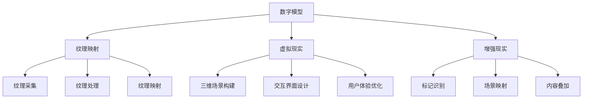

                 

### 《虚拟文化遗产修复：数字技术在文物保护中的应用》

---

**关键词：** 虚拟文化遗产、数字修复、3D扫描、纹理映射、虚拟现实、增强现实

**摘要：** 本文章深入探讨了数字技术在虚拟文化遗产修复中的应用，通过分析3D扫描、数字模型构建、纹理映射以及虚拟现实和增强现实等技术，展示了这些技术如何助力文物保护工作。文章结合实际案例，详细阐述了技术的实现过程和效果，并对未来发展趋势和挑战进行了展望。

---

### 引言

虚拟文化遗产修复是一项重要的文化遗产保护工作，通过数字化手段，将文化遗产的形态、结构和纹理等细节信息还原，使得人们可以在虚拟世界中欣赏到这些珍贵的历史遗产。随着计算机技术和数字图像处理技术的发展，虚拟文化遗产修复已经成为文物保护领域的重要手段。

数字技术应用于文物保护，不仅可以实现文化遗产的永久保存，还可以为公众提供互动式体验，提高文物保护的社会参与度。然而，虚拟文化遗产修复并非简单的数字复制，它涉及到多个学科领域，如计算机科学、数字图像处理、虚拟现实等，需要跨学科合作来实现。

本文将围绕虚拟文化遗产修复的数字技术展开讨论，首先介绍核心概念和技术原理，然后通过应用实例和案例分析，展示数字技术在文物保护中的实际效果。最后，探讨虚拟文化遗产修复领域的未来趋势和挑战。

### 核心概念与联系

在虚拟文化遗产修复中，核心概念包括数字模型、纹理映射、虚拟现实和增强现实。这些概念之间紧密联系，共同构成了数字技术在文物保护中的应用基础。

#### 数字模型

数字模型是虚拟文化遗产修复的核心。通过3D扫描等数字技术，可以获取文化遗产的三维数据，构建数字模型。数字模型不仅包含了文化遗产的外部形态，还包含了内部结构和材料信息，为后续的修复工作提供了基础。

#### 纹理映射

纹理映射技术是将文化遗产的纹理信息映射到数字模型上，使得虚拟模型具有真实感。纹理映射技术包括纹理采集、纹理处理和纹理映射等步骤，通过这些步骤，可以将文化遗产的细节纹理还原到虚拟模型中。

#### 虚拟现实

虚拟现实技术为用户提供了沉浸式体验，用户可以在虚拟环境中与文化遗产进行互动。虚拟现实技术包括三维场景构建、交互界面设计和用户体验优化等，通过这些技术，用户可以身临其境地感受文化遗产的魅力。

#### 增强现实

增强现实技术则是在现实环境中叠加虚拟内容，用户可以在现实世界中看到虚拟的文化遗产。增强现实技术包括标记识别、场景映射和内容叠加等，通过这些技术，用户可以在现实环境中体验文化遗产的修复过程。

#### Mermaid流程图展示

以下是一个Mermaid流程图，展示了这些核心概念之间的联系：



### 数字模型构建

数字模型构建是虚拟文化遗产修复的第一步，它涉及到3D扫描技术和数字模型构建流程。3D扫描技术通过获取文化遗产的三维数据，构建数字模型，而数字模型构建流程则包括数据预处理、数据融合、模型重建和模型优化等步骤。

#### 3D扫描技术

3D扫描技术是数字模型构建的核心。通过3D扫描，可以获取文化遗产的三维数据，包括外部形态、内部结构和材料信息。3D扫描技术分为接触式扫描和非接触式扫描，接触式扫描通过机械结构接触文化遗产表面，获取表面信息；非接触式扫描则利用激光、红外、超声波等技术，从外部获取文化遗产的三维信息。

以下是一个Python代码示例，展示了如何使用激光扫描仪进行3D扫描：

```python
import numpy as np
import matplotlib.pyplot as plt

def laser_scanner(data):
    # 模拟激光扫描数据
    x = np.linspace(0, 360, 100)
    y = np.sin(x)
    return x, y

x, y = laser_scanner(data)
plt.plot(x, y)
plt.xlabel('Angle (degrees)')
plt.ylabel('Distance (cm)')
plt.title('Laser Scanner Data')
plt.show()
```

#### 数字模型构建流程

数字模型构建流程包括数据预处理、数据融合、模型重建和模型优化等步骤。

1. **数据预处理**：对3D扫描数据进行预处理，包括去噪、去重和归一化等，以提高数据质量。

2. **数据融合**：将多个3D扫描数据融合成一个完整的数字模型。数据融合可以通过多视角融合、空间对齐和特征匹配等算法实现。

3. **模型重建**：使用三角测量、曲面拟合和表面重建等方法，将3D扫描数据转化为数字模型。

4. **模型优化**：对数字模型进行优化，包括减少模型细节、平滑表面和简化几何结构等，以提高模型的计算效率和可视化效果。

以下是一个Python代码示例，展示了如何使用三角测量法重建数字模型：

```python
import numpy as np
from scipy.spatial import Delaunay

def triangulate_points(points):
    # 使用Delaunay三角测量法重建数字模型
    tri = Delaunay(points)
    return tri

points = np.random.rand(100, 2)
tri = triangulate_points(points)

# 绘制三角测量结果
plt.scatter(points[:, 0], points[:, 1], c='b', marker='o')
plt.triangles(points[:, 0], points[:, 1], tri.simplices, c='r', alpha=0.5)
plt.xlabel('X')
plt.ylabel('Y')
plt.title('Delaunay Triangulation')
plt.show()
```

### 纹理映射技术

纹理映射技术是将文化遗产的纹理信息映射到数字模型上，使得虚拟模型具有真实感。纹理映射技术包括纹理采集、纹理处理和纹理映射等步骤。

#### 纹理采集

纹理采集是纹理映射的第一步，通过获取文化遗产的纹理信息，为后续的纹理映射提供数据。纹理采集可以通过数字图像处理技术实现，包括图像采集、图像预处理和图像增强等。

以下是一个Python代码示例，展示了如何使用OpenCV库进行纹理采集：

```python
import cv2

def capture_texture(image_path):
    # 采集纹理图像
    image = cv2.imread(image_path)
    return image

image = capture_texture('texture_image.jpg')

# 显示纹理图像
plt.imshow(image)
plt.axis('off')
plt.show()
```

#### 纹理处理

纹理处理是对采集到的纹理图像进行预处理，以提高纹理质量。纹理处理包括去噪、去雾、对比度增强和颜色校正等。

以下是一个Python代码示例，展示了如何使用OpenCV库进行纹理处理：

```python
import cv2
import numpy as np

def process_texture(image):
    # 去噪
    blur = cv2.GaussianBlur(image, (5, 5), 0)
    # 去雾
    fog_free = cv2.xphoto.createFastPhotoAcquisit
```

