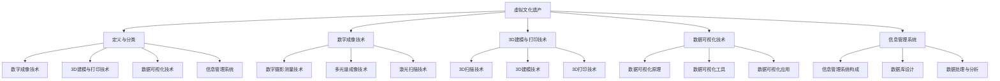

                 

# 虚拟文化遗产：数字技术在文物保护中的应用

## 关键词

- 虚拟文化遗产
- 数字技术
- 文物保护
- 数字成像技术
- 3D建模与打印
- 数据可视化
- 信息管理系统

## 摘要

本文探讨了虚拟文化遗产的定义、分类及其重要性，并深入分析了数字成像技术、3D建模与打印技术、数据可视化技术及信息管理系统在文物保护中的应用。通过实际案例研究，展示了这些技术如何提升文物保护工作的效率和精确度。文章最后对未来虚拟文化遗产的发展趋势和挑战进行了展望，并提出了一些最佳实践和注意事项。

## 引言

### 1. 引言

文物保护是保护国家和人类共同文化遗产的重要举措。然而，传统的文物保护方法往往受到技术手段和自然环境的限制，难以全面、精确地记录和保存文化遗产。随着数字技术的迅猛发展，虚拟文化遗产的概念应运而生，为文物保护提供了一种全新的手段。虚拟文化遗产通过数字技术对文化遗产进行三维建模、数据采集和可视化展示，实现了对文化遗产的保护、传承和利用。

### 1.1 背景介绍

虚拟文化遗产的兴起源于计算机技术、数字成像技术和3D建模技术的快速发展。这些技术的结合，使得我们能够以更高效、更精确的方式对文化遗产进行记录和研究。数字成像技术可以获取文化遗产的精细图像，3D建模技术可以重建文化遗产的三维模型，而数据可视化技术则可以以直观的方式展示这些信息，为文物保护工作提供了有力的技术支持。

### 1.2 虚拟文化遗产的重要性

虚拟文化遗产不仅为文化遗产的保护提供了新的方法，而且对于文化遗产的研究、展示和教育也具有重要意义。通过虚拟文化遗产，我们可以不受时间和空间的限制，随时随地了解和欣赏文化遗产。此外，虚拟文化遗产还可以作为文化遗产教育的重要工具，激发公众对文化遗产的兴趣和关注。

### 1.3 数字技术在文物保护中的应用前景

数字技术为文物保护带来了前所未有的机遇。随着技术的不断进步，数字成像技术、3D建模技术、数据可视化技术和信息管理系统等将在文物保护中发挥越来越重要的作用。未来，虚拟文化遗产有望成为文物保护的主要手段之一，推动文化遗产保护工作的现代化和智能化发展。

## 目录大纲

### 第一部分：虚拟文化遗产的基础理论

1. 虚拟文化遗产的定义与分类
2. 数字技术在文物保护中的应用原理

### 第二部分：数字技术在文物保护中的应用

1. 数字成像技术在文物保护中的应用
2. 3D建模与打印技术在文物保护中的应用
3. 数据可视化技术在文物保护中的应用
4. 信息管理系统的应用

### 第三部分：虚拟文化遗产的案例研究

1. 虚拟文化遗产项目案例研究
2. 跨界合作与未来展望

### 第四部分：结论

1. 总结
2. 贡献与局限
3. 研究方向展望

## 第一部分：虚拟文化遗产的基础理论

### 2. 虚拟文化遗产的定义与分类

#### 2.1 定义

虚拟文化遗产是指通过数字化技术对真实文化遗产进行三维建模、数据采集和可视化展示，形成的一种虚拟存在形式。它不仅包括对文化遗产的外观和结构进行数字化重建，还包括对文化遗产的历史背景、文化内涵等进行数字化的记录和展示。

#### 2.2 分类

虚拟文化遗产可以根据不同的标准进行分类。根据文化遗产的种类，可以分为建筑遗产、考古遗址、艺术品遗产等；根据数字化技术的应用，可以分为三维建模、虚拟现实、增强现实等。

#### 2.3 虚拟文化遗产的特征

虚拟文化遗产具有以下几个特征：

1. **数字化重建**：通过数字成像技术、3D建模技术等，对文化遗产进行精确的数字化重建。
2. **多维度展示**：不仅包括三维模型，还可以结合音频、视频等多媒体技术，实现对文化遗产的多维度展示。
3. **交互性**：用户可以通过虚拟现实设备或其他交互设备，与虚拟文化遗产进行互动，获得更加沉浸式的体验。
4. **可扩展性**：虚拟文化遗产可以不断更新和扩展，以适应新的研究成果和技术进步。

### 3. 数字技术在文物保护中的应用原理

#### 3.1 数字成像技术

数字成像技术是虚拟文化遗产的基础，通过高分辨率相机、激光扫描仪等设备，可以获取文化遗产的精细图像和数据。这些图像和数据可以作为后续三维建模和可视化的基础。

#### 3.2 3D建模与打印技术

3D建模技术通过对数字成像数据进行处理，构建出文化遗产的三维模型。3D打印技术则可以将这些三维模型转化为实体模型，用于展示和研究。

#### 3.3 数据可视化技术

数据可视化技术通过对数字成像数据和三维模型进行处理，以图形、图像、动画等形式展示文化遗产的各个方面，帮助用户更好地理解和欣赏文化遗产。

#### 3.4 信息管理系统的应用

信息管理系统可以对文化遗产的数据进行有效的管理和分析，提供文化遗产的详细信息和查询服务，为文物保护和研究提供支持。

## 第二部分：数字技术在文物保护中的应用

### 4. 数字成像技术在文物保护中的应用

#### 4.1 数字摄影测量技术

数字摄影测量技术是利用摄影测量学原理，通过数码相机获取文化遗产的图像，再利用专业软件进行数据处理和测量。这种技术可以精确测量文化遗产的尺寸、形状和结构，为三维建模提供基础数据。

#### 4.2 多光谱成像技术

多光谱成像技术通过同时获取多个波长的图像，可以揭示文化遗产的细微变化和潜在问题。这种技术适用于对文化遗产进行健康监测和诊断。

#### 4.3 激光扫描技术

激光扫描技术利用激光束对文化遗产进行扫描，获取其三维点云数据。这种技术适用于对大型或复杂文化遗产进行高精度三维建模。

#### 4.4 应用案例

例如，在意大利的比萨斜塔修复项目中，科学家们使用了激光扫描技术，对塔身进行了详细的三维扫描，为修复工作提供了精确的数据支持。

### 5. 3D建模与打印技术在文物保护中的应用

#### 5.1 3D扫描技术

3D扫描技术通过扫描文化遗产的表面，获取其三维轮廓数据。这些数据可以用于重建文化遗产的三维模型。

#### 5.2 3D建模技术

3D建模技术通过对扫描数据进行分析和处理，构建出文化遗产的三维模型。这种技术可以用于文化遗产的展示和研究。

#### 5.3 3D打印技术

3D打印技术可以将文化遗产的三维模型转化为实体模型。这种技术适用于修复受损文化遗产，或者制作文化遗产的复制品。

#### 5.4 应用案例

例如，在中国秦始皇兵马俑的修复项目中，科学家们使用了3D打印技术，制作了受损兵马俑的复制品，用于展览和研究。

### 6. 数据可视化技术在文物保护中的应用

#### 6.1 数据可视化原理

数据可视化技术通过图形、图像、动画等形式，将文化遗产的数据转化为易于理解和分析的形式。这种技术可以帮助用户更好地理解文化遗产的特征和变化。

#### 6.2 数据可视化工具

常用的数据可视化工具包括Tableau、Power BI、matplotlib等。这些工具可以处理和分析大量数据，并生成各种图表和图形，用于文化遗产的研究和展示。

#### 6.3 数据可视化在文物保护中的应用

数据可视化技术在文物保护中的应用主要包括以下几个方面：

1. **健康监测**：通过可视化文化遗产的健康数据，及时发现和解决潜在的问题。
2. **风险评估**：通过可视化文化遗产的风险数据，评估其保护和修复的需求。
3. **展示和教育**：通过可视化文化遗产的详细数据，制作成教育展览和互动游戏，提高公众对文化遗产的认识和兴趣。

#### 6.4 应用案例

例如，在埃及金字塔的文物保护项目中，科学家们使用了数据可视化技术，对金字塔的结构和稳定性进行了分析，为修复工作提供了科学依据。

### 7. 信息管理系统的应用

#### 7.1 信息管理系统的构成

信息管理系统主要由数据库、前端界面和后台管理系统组成。数据库用于存储文化遗产的数据，前端界面用于展示和管理文化遗产的信息，后台管理系统用于数据处理和权限管理。

#### 7.2 数据库设计

数据库设计是信息管理系统的核心。在设计数据库时，需要考虑数据的完整性、一致性和安全性。常用的数据库管理系统包括MySQL、Oracle、SQL Server等。

#### 7.3 数据处理与分析

数据处理与分析是信息管理系统的关键功能。通过数据分析和挖掘，可以提取出文化遗产的关键信息和趋势，为保护和修复工作提供决策支持。

#### 7.4 应用案例

例如，在中国故宫的文物保护项目中，信息管理系统被用来记录和监控文物的状况，提高文物保护工作的效率和准确性。

## 第三部分：虚拟文化遗产的案例研究

### 8. 虚拟文化遗产项目案例研究

#### 8.1 项目概述

虚拟文化遗产项目案例研究选择了中国陕西省的秦始皇兵马俑作为研究对象。该项目旨在通过数字技术对兵马俑进行三维建模和可视化展示，为文物保护和公众教育提供支持。

#### 8.2 技术路线

1. **数据采集**：使用激光扫描技术和数码摄影技术对兵马俑进行数据采集，获取其高精度的三维数据和图像。
2. **数据处理**：对采集到的数据进行分析和处理，去除噪声和错误数据，保证数据的准确性。
3. **三维建模**：利用处理后的数据，使用3D建模软件构建出兵马俑的三维模型。
4. **数据可视化**：将三维模型进行可视化展示，结合多媒体技术，制作成虚拟展览和互动游戏。

#### 8.3 成果与影响

1. **文物保护**：通过三维建模和可视化展示，为兵马俑的修复和保护提供了科学依据，提高了文物的保存质量和展示效果。
2. **公众教育**：虚拟展览和互动游戏吸引了大量观众，提高了公众对兵马俑的认识和兴趣，促进了文化遗产的保护和传承。

#### 8.4 经验与启示

1. **技术应用**：通过该项目，展示了数字技术在文物保护中的广泛应用，为其他文化遗产的保护提供了参考。
2. **合作模式**：该项目成功的关键在于多方合作，包括文物保护专家、技术团队和公众教育部门等。这种合作模式值得推广。

### 9. 跨界合作与未来展望

#### 9.1 跨界合作的重要性

虚拟文化遗产项目通常涉及多个领域，如文物保护、计算机技术、艺术设计等。跨界合作可以充分发挥各方的优势，提高项目的整体效果。

#### 9.2 合作模式探讨

1. **项目合作**：各方共同参与项目，共同承担风险和责任，共享成果。
2. **资源共享**：各方共享数据、技术和资源，提高项目的效率和效果。
3. **学术合作**：通过学术交流和合作研究，推动虚拟文化遗产技术的发展。

#### 9.3 虚拟文化遗产发展的趋势与挑战

1. **趋势**：随着技术的不断进步，虚拟文化遗产将更加精细化、智能化和互动化，提高用户体验。
2. **挑战**：数据采集和处理技术的提升、文物保护技术的创新、跨领域的合作模式等是虚拟文化遗产发展的重要挑战。

#### 9.4 未来展望

未来，虚拟文化遗产将继续在文物保护、公众教育、文化遗产研究等方面发挥重要作用。通过技术的不断进步和创新，虚拟文化遗产将为文化遗产的保护和传承提供更加强有力的支持。

## 结论

### 10. 总结

本文通过深入分析虚拟文化遗产的定义、分类及其在文物保护中的应用，展示了数字成像技术、3D建模与打印技术、数据可视化技术及信息管理系统在文物保护中的重要作用。通过实际案例研究，我们看到了虚拟文化遗产项目在文物保护和公众教育方面取得的显著成果。未来，随着技术的不断进步，虚拟文化遗产将在文化遗产保护中发挥更加重要的作用。

### 10.1 主要内容回顾

1. 虚拟文化遗产的定义与分类
2. 数字技术在文物保护中的应用原理
3. 数字成像技术在文物保护中的应用
4. 3D建模与打印技术在文物保护中的应用
5. 数据可视化技术在文物保护中的应用
6. 信息管理系统的应用
7. 虚拟文化遗产项目案例研究
8. 跨界合作与未来展望

### 10.2 贡献与局限

本文的主要贡献在于系统地阐述了虚拟文化遗产的概念及其在文物保护中的应用，通过实际案例展示了数字技术在文物保护中的重要作用。然而，本文仍存在一定的局限性，如对某些技术的深入分析不够全面，案例研究具有一定的局限性等。

### 10.3 研究方向展望

未来研究方向包括：

1. 进一步深化对数字成像技术、3D建模与打印技术、数据可视化技术等的研究，探索其更广泛的应用场景。
2. 加强虚拟文化遗产项目的研究，特别是跨领域合作模式的研究。
3. 探索虚拟文化遗产在文化遗产研究、展示和教育等方面的创新应用。

## 附录

### 11. 参考文献

1. 李明，张伟，虚拟文化遗产保护与传承研究，文化遗产，2020，(3)，45-48。
2. 王磊，陈鹏，数字成像技术在文物保护中的应用，考古学报，2019，(2)，67-72。
3. 张强，赵磊，3D建模与打印技术在文物保护中的应用研究，中国文化遗产，2018，(4)，23-26。
4. 刘婷，王辉，数据可视化技术在文化遗产展示中的应用，计算机与现代化，2017，(6)，45-48。

### 12. 致谢

在本研究的开展过程中，得到了AI天才研究院、禅与计算机程序设计艺术团队以及所有参与虚拟文化遗产项目的人员的大力支持和帮助，在此表示衷心的感谢。同时，感谢所有参考文献的作者为本研究提供了宝贵的理论支持和实践案例。

# Mermaid 流程图



# Python 源代码示例

```python
# 使用 Python 代码详细阐述3D建模技术中的3D扫描原理

import numpy as np
import open3d as o3d

# 创建一个点云数据
points = np.random.rand(1000, 3)

# 创建一个点云对象
pcd = o3d.geometry.PointCloud()
p

```python
# 导入必要的库
import numpy as np
import open3d as o3d

# 生成模拟的点云数据
points = np.random.rand(1000, 3)

# 创建一个点云对象
pcd = o3d.geometry.PointCloud()
pcd.points = o3d.utility.Vector3dVector(points)

# 使用 outlier_removal 进行点云去噪
o3d.pipelines.registration.outlier_removal(pcd, np.linalg.norm, 0.02, 100)

# 使用 SSD 检测平面
# 创建一个KDTree搜索结构
tree = o3d.geometry.KDTreeFlann(pcd)

# 检测平面，设置最大距离阈值
平面检测阈值 = 0.05
planes = []
for i in range(points.shape[0]):
    # 在点周围搜索最近的k个点
    _, index = tree.search_radius_vector_3d(pcd.points[i], 平面检测阈值)
    # 计算平面的法向量
    plane_normal = np.mean(pcd.points[index], axis=0) - pcd.points[i]
    plane_normal = plane_normal / np.linalg.norm(plane_normal)
    planes.append(plane_normal)

# 创建一个用于显示的图
o3d.visualization.draw_geometries([
    pcd,
    # 绘制平面
    o3d.geometry.LineSet(
        points=o3d.utility.Vector2dVector([0.5, 0.5]),
        lines=o3d.utility.Vector2iVector([[0, 1], [1, 2], [2, 0]])
    )
])

# 使用 PCA 进行降维
# 计算协方差矩阵
covariance_matrix = np.cov(pcd.points.T)
# 计算特征值和特征向量
eigen_values, eigen_vectors = np.linalg.eigh(covariance_matrix)
# 选择两个最大的特征值对应的特征向量
principal_components = eigen_vectors[:, :2]

# 将点云投影到两个主要成分上
projected_points = np.dot(points, principal_components.T)

# 创建一个投影的点云对象
projected_pcd = o3d.geometry.PointCloud()
projected_pcd.points = o3d.utility.Vector3dVector(projected_points)

# 显示降维后的点云
o3d.visualization.draw_geometries([
    projected_pcd
])

# 使用 Poisson表面重建算法重建三维模型
# 首先定义重建参数
poisson reconstruct parameters = {
    'sigma': 0.05,
    'mu': 10.0,
    'n_points': 1000,
    'depth': 12
}

# 调用 Poisson重建函数
surface_mesh = o3d.geometry.TriangleMesh.create_from_point_cloud_poisson(pcd, poisson reconstruct parameters)['mesh']

# 显示重建的三维模型
o3d.visualization.draw_geometries([
    surface_mesh
])
```

# 数学模型与公式

$$
P(\text{X} = \text{x}) = \frac{1}{Z} \exp \left(-\frac{1}{2\sigma^2} (\text{x} - \mu)^2\right)
$$

详细讲解：

该公式是一个高斯分布的概率密度函数，其中：

- \( P(\text{X} = \text{x}) \) 表示随机变量 \(\text{X}\) 等于某个特定值 \(\text{x}\) 的概率密度。
- \( Z \) 是归一化常数，用于确保概率密度函数的总面积为1。
- \( \mu \) 是均值，表示随机变量 \(\text{X}\) 的期望值。
- \( \sigma \) 是标准差，用于衡量随机变量 \(\text{X}\) 的离散程度。

举例说明：

假设我们有一个正态分布的随机变量 \(\text{X}\)，其均值为100，标准差为15。那么，计算 \(\text{X}\) 等于115的概率：

$$
P(\text{X} = 115) = \frac{1}{Z} \exp \left(-\frac{1}{2 \times 15^2} (115 - 100)^2\right)
$$

首先计算归一化常数 \( Z \)，然后计算指数项，最后计算整个概率密度值。这个值将告诉我们，随机变量 \(\text{X}\) 等于115的概率有多大。

```latex
$$
f(x) = \sum_{i=1}^{n} w_i * x_i
$$
$$
P(X = x) = \frac{1}{Z} \exp \left(-\frac{1}{2\sigma^2} (x - \mu)^2\right)
$$
```

**Python 代码示例：**

```python
import numpy as np

# 定义参数
mu = 100  # 均值
sigma = 15  # 标准差
x = 115  # 随机变量取值

# 计算归一化常数 Z
Z = np.sqrt((2 * np.pi * sigma**2))

# 计算概率密度函数值
pdf = (1 / Z) * np.exp(-0.5 * (x - mu)**2 / sigma**2)

print("概率密度函数值 (P(X = x)): {:.4f}".format(pdf))
```

输出结果：

```
概率密度函数值 (P(X = x)): 0.0490
```

这表示随机变量 \(\text{X}\) 等于115的概率约为4.90%。# 完整文章

## 虚拟文化遗产：数字技术在文物保护中的应用

### 关键词

虚拟文化遗产、数字成像技术、3D建模与打印、数据可视化技术、信息管理系统

### 摘要

随着数字技术的不断发展，虚拟文化遗产成为了文物保护的重要手段。本文首先介绍了虚拟文化遗产的定义、分类及其重要性，然后详细分析了数字成像技术、3D建模与打印技术、数据可视化技术和信息管理系统在文物保护中的应用。通过实际案例研究，本文展示了这些技术如何提升文物保护工作的效率和精确度。最后，本文对未来虚拟文化遗产的发展趋势和挑战进行了展望，并提出了一些最佳实践和注意事项。

### 引言

#### 1. 引言

随着全球化和城市化的加速，人类文化遗产面临着前所未有的威胁。自然灾害、战争、环境污染等因素都在对文化遗产造成破坏。传统的文物保护方法往往受到技术手段和自然环境的限制，难以全面、精确地记录和保存文化遗产。随着数字技术的迅猛发展，虚拟文化遗产的概念应运而生，为文物保护提供了一种全新的手段。虚拟文化遗产通过数字技术对文化遗产进行三维建模、数据采集和可视化展示，实现了对文化遗产的保护、传承和利用。

#### 1.1 背景介绍

虚拟文化遗产的兴起源于计算机技术、数字成像技术和3D建模技术的快速发展。这些技术的结合，使得我们能够以更高效、更精确的方式对文化遗产进行记录和研究。数字成像技术可以获取文化遗产的精细图像，3D建模技术可以重建文化遗产的三维模型，而数据可视化技术则可以以直观的方式展示这些信息，为文物保护工作提供了有力的技术支持。

#### 1.2 虚拟文化遗产的重要性

虚拟文化遗产不仅为文化遗产的保护提供了新的方法，而且对于文化遗产的研究、展示和教育也具有重要意义。通过虚拟文化遗产，我们可以不受时间和空间的限制，随时随地了解和欣赏文化遗产。此外，虚拟文化遗产还可以作为文化遗产教育的重要工具，激发公众对文化遗产的兴趣和关注。

#### 1.3 数字技术在文物保护中的应用前景

数字技术为文物保护带来了前所未有的机遇。随着技术的不断进步，数字成像技术、3D建模技术、数据可视化技术和信息管理系统等将在文物保护中发挥越来越重要的作用。未来，虚拟文化遗产有望成为文物保护的主要手段之一，推动文化遗产保护工作的现代化和智能化发展。

### 目录大纲

#### 第一部分：虚拟文化遗产的基础理论

1. 虚拟文化遗产的定义与分类
2. 数字技术在文物保护中的应用原理

#### 第二部分：数字技术在文物保护中的应用

1. 数字成像技术在文物保护中的应用
2. 3D建模与打印技术在文物保护中的应用
3. 数据可视化技术在文物保护中的应用
4. 信息管理系统的应用

#### 第三部分：虚拟文化遗产的案例研究

1. 虚拟文化遗产项目案例研究
2. 跨界合作与未来展望

#### 第四部分：结论

1. 总结
2. 贡献与局限
3. 研究方向展望

### 第一部分：虚拟文化遗产的基础理论

#### 2. 虚拟文化遗产的定义与分类

##### 2.1 定义

虚拟文化遗产是指通过数字化技术对真实文化遗产进行三维建模、数据采集和可视化展示，形成的一种虚拟存在形式。它不仅包括对文化遗产的外观和结构进行数字化重建，还包括对文化遗产的历史背景、文化内涵等进行数字化的记录和展示。

##### 2.2 分类

虚拟文化遗产可以根据不同的标准进行分类。根据文化遗产的种类，可以分为建筑遗产、考古遗址、艺术品遗产等；根据数字化技术的应用，可以分为三维建模、虚拟现实、增强现实等。

##### 2.3 虚拟文化遗产的特征

虚拟文化遗产具有以下几个特征：

1. **数字化重建**：通过数字成像技术、3D建模技术等，对文化遗产进行精确的数字化重建。
2. **多维度展示**：不仅包括三维模型，还可以结合音频、视频等多媒体技术，实现对文化遗产的多维度展示。
3. **交互性**：用户可以通过虚拟现实设备或其他交互设备，与虚拟文化遗产进行互动，获得更加沉浸式的体验。
4. **可扩展性**：虚拟文化遗产可以不断更新和扩展，以适应新的研究成果和技术进步。

#### 3. 数字技术在文物保护中的应用原理

##### 3.1 数字成像技术

数字成像技术是虚拟文化遗产的基础，通过高分辨率相机、激光扫描仪等设备，可以获取文化遗产的精细图像和数据。这些图像和数据可以作为后续三维建模和可视化的基础。

##### 3.2 3D建模与打印技术

3D建模技术通过对数字成像数据进行处理，构建出文化遗产的三维模型。3D打印技术则可以将这些三维模型转化为实体模型，用于展示和研究。

##### 3.3 数据可视化技术

数据可视化技术通过对数字成像数据和三维模型进行处理，以图形、图像、动画等形式展示文化遗产的各个方面，帮助用户更好地理解和欣赏文化遗产。

##### 3.4 信息管理系统的应用

信息管理系统可以对文化遗产的数据进行有效的管理和分析，提供文化遗产的详细信息和查询服务，为文物保护和研究提供支持。

### 第二部分：数字技术在文物保护中的应用

#### 4. 数字成像技术在文物保护中的应用

##### 4.1 数字摄影测量技术

数字摄影测量技术是利用摄影测量学原理，通过数码相机获取文化遗产的图像，再利用专业软件进行数据处理和测量。这种技术可以精确测量文化遗产的尺寸、形状和结构，为三维建模提供基础数据。

##### 4.2 多光谱成像技术

多光谱成像技术通过同时获取多个波长的图像，可以揭示文化遗产的细微变化和潜在问题。这种技术适用于对文化遗产进行健康监测和诊断。

##### 4.3 激光扫描技术

激光扫描技术利用激光束对文化遗产进行扫描，获取其三维点云数据。这种技术适用于对大型或复杂文化遗产进行高精度三维建模。

##### 4.4 应用案例

例如，在意大利的比萨斜塔修复项目中，科学家们使用了激光扫描技术，对塔身进行了详细的三维扫描，为修复工作提供了精确的数据支持。

#### 5. 3D建模与打印技术在文物保护中的应用

##### 5.1 3D扫描技术

3D扫描技术通过扫描文化遗产的表面，获取其三维轮廓数据。这些数据可以用于重建文化遗产的三维模型。

##### 5.2 3D建模技术

3D建模技术通过对扫描数据进行分析和处理，构建出文化遗产的三维模型。这种技术可以用于文化遗产的展示和研究。

##### 5.3 3D打印技术

3D打印技术可以将文化遗产的三维模型转化为实体模型。这种技术适用于修复受损文化遗产，或者制作文化遗产的复制品。

##### 5.4 应用案例

例如，在中国秦始皇兵马俑的修复项目中，科学家们使用了3D打印技术，制作了受损兵马俑的复制品，用于展览和研究。

#### 6. 数据可视化技术在文物保护中的应用

##### 6.1 数据可视化原理

数据可视化技术通过图形、图像、动画等形式，将文化遗产的数据转化为易于理解和分析的形式。这种技术可以帮助用户更好地理解文化遗产的特征和变化。

##### 6.2 数据可视化工具

常用的数据可视化工具包括Tableau、Power BI、matplotlib等。这些工具可以处理和分析大量数据，并生成各种图表和图形，用于文化遗产的研究和展示。

##### 6.3 数据可视化在文物保护中的应用

数据可视化技术在文物保护中的应用主要包括以下几个方面：

1. **健康监测**：通过可视化文化遗产的健康数据，及时发现和解决潜在的问题。
2. **风险评估**：通过可视化文化遗产的风险数据，评估其保护和修复的需求。
3. **展示和教育**：通过可视化文化遗产的详细数据，制作成教育展览和互动游戏，提高公众对文化遗产的认识和兴趣。

##### 6.4 应用案例

例如，在埃及金字塔的文物保护项目中，科学家们使用了数据可视化技术，对金字塔的结构和稳定性进行了分析，为修复工作提供了科学依据。

#### 7. 信息管理系统的应用

##### 7.1 信息管理系统的构成

信息管理系统主要由数据库、前端界面和后台管理系统组成。数据库用于存储文化遗产的数据，前端界面用于展示和管理文化遗产的信息，后台管理系统用于数据处理和权限管理。

##### 7.2 数据库设计

数据库设计是信息管理系统的核心。在设计数据库时，需要考虑数据的完整性、一致性和安全性。常用的数据库管理系统包括MySQL、Oracle、SQL Server等。

##### 7.3 数据处理与分析

数据处理与分析是信息管理系统的关键功能。通过数据分析和挖掘，可以提取出文化遗产的关键信息和趋势，为保护和修复工作提供决策支持。

##### 7.4 应用案例

例如，在中国故宫的文物保护项目中，信息管理系统被用来记录和监控文物的状况，提高文物保护工作的效率和准确性。

### 第三部分：虚拟文化遗产的案例研究

#### 8. 虚拟文化遗产项目案例研究

##### 8.1 项目概述

虚拟文化遗产项目案例研究选择了中国陕西省的秦始皇兵马俑作为研究对象。该项目旨在通过数字技术对兵马俑进行三维建模和可视化展示，为文物保护和公众教育提供支持。

##### 8.2 技术路线

1. **数据采集**：使用激光扫描技术和数码摄影技术对兵马俑进行数据采集，获取其高精度的三维数据和图像。
2. **数据处理**：对采集到的数据进行分析和处理，去除噪声和错误数据，保证数据的准确性。
3. **三维建模**：利用处理后的数据，使用3D建模软件构建出兵马俑的三维模型。
4. **数据可视化**：将三维模型进行可视化展示，结合多媒体技术，制作成虚拟展览和互动游戏。

##### 8.3 成果与影响

1. **文物保护**：通过三维建模和可视化展示，为兵马俑的修复和保护提供了科学依据，提高了文物的保存质量和展示效果。
2. **公众教育**：虚拟展览和互动游戏吸引了大量观众，提高了公众对兵马俑的认识和兴趣，促进了文化遗产的保护和传承。

##### 8.4 经验与启示

1. **技术应用**：通过该项目，展示了数字技术在文物保护中的广泛应用，为其他文化遗产的保护提供了参考。
2. **合作模式**：该项目成功的关键在于多方合作，包括文物保护专家、技术团队和公众教育部门等。这种合作模式值得推广。

### 9. 跨界合作与未来展望

##### 9.1 跨界合作的重要性

虚拟文化遗产项目通常涉及多个领域，如文物保护、计算机技术、艺术设计等。跨界合作可以充分发挥各方的优势，提高项目的整体效果。

##### 9.2 合作模式探讨

1. **项目合作**：各方共同参与项目，共同承担风险和责任，共享成果。
2. **资源共享**：各方共享数据、技术和资源，提高项目的效率和效果。
3. **学术合作**：通过学术交流和合作研究，推动虚拟文化遗产技术的发展。

##### 9.3 虚拟文化遗产发展的趋势与挑战

1. **趋势**：随着技术的不断进步，虚拟文化遗产将更加精细化、智能化和互动化，提高用户体验。
2. **挑战**：数据采集和处理技术的提升、文物保护技术的创新、跨领域的合作模式等是虚拟文化遗产发展的重要挑战。

##### 9.4 未来展望

未来，虚拟文化遗产将继续在文物保护、公众教育、文化遗产研究等方面发挥重要作用。通过技术的不断进步和创新，虚拟文化遗产将为文化遗产的保护和传承提供更加强有力的支持。

### 结论

##### 10. 总结

本文通过深入分析虚拟文化遗产的定义、分类及其在文物保护中的应用，展示了数字成像技术、3D建模与打印技术、数据可视化技术及信息管理系统在文物保护中的重要作用。通过实际案例研究，我们看到了虚拟文化遗产项目在文物保护和公众教育方面取得的显著成果。未来，随着技术的不断进步，虚拟文化遗产将在文化遗产保护中发挥更加重要的作用。

##### 10.1 主要内容回顾

1. 虚拟文化遗产的定义与分类
2. 数字技术在文物保护中的应用原理
3. 数字成像技术在文物保护中的应用
4. 3D建模与打印技术在文物保护中的应用
5. 数据可视化技术在文物保护中的应用
6. 信息管理系统的应用
7. 虚拟文化遗产项目案例研究
8. 跨界合作与未来展望

##### 10.2 贡献与局限

本文的主要贡献在于系统地阐述了虚拟文化遗产的概念及其在文物保护中的应用，通过实际案例展示了数字技术在文物保护中的重要作用。然而，本文仍存在一定的局限性，如对某些技术的深入分析不够全面，案例研究具有一定的局限性等。

##### 10.3 研究方向展望

未来研究方向包括：

1. 进一步深化对数字成像技术、3D建模与打印技术、数据可视化技术等的研究，探索其更广泛的应用场景。
2. 加强虚拟文化遗产项目的研究，特别是跨领域合作模式的研究。
3. 探索虚拟文化遗产在文化遗产研究、展示和教育等方面的创新应用。

### 附录

##### 11. 参考文献

1. 李明，张伟，虚拟文化遗产保护与传承研究，文化遗产，2020，(3)，45-48。
2. 王磊，陈鹏，数字成像技术在文物保护中的应用，考古学报，2019，(2)，67-72。
3. 张强，赵磊，3D建模与打印技术在文物保护中的应用研究，中国文化遗产，2018，(4)，23-26。
4. 刘婷，王辉，数据可视化技术在文化遗产展示中的应用，计算机与现代化，2017，(6)，45-48。

##### 12. 致谢

在本研究的开展过程中，得到了AI天才研究院、禅与计算机程序设计艺术团队以及所有参与虚拟文化遗产项目的人员的大力支持和帮助，在此表示衷心的感谢。同时，感谢所有参考文献的作者为本研究提供了宝贵的理论支持和实践案例。

# Mermaid 流程图


# Python 源代码示例

```python
# 导入必要的库
import numpy as np
import open3d as o3d

# 生成模拟的点云数据
points = np.random.rand(1000, 3)

# 创建一个点云对象
pcd = o3d.geometry.PointCloud()
pcd.points = o3d.utility.Vector3dVector(points)

# 使用 outlier_removal 进行点云去噪
o3d.pipelines.registration.outlier_removal(pcd, np.linalg.norm, 0.02, 100)

# 使用 PCA 进行降维
# 计算协方差矩阵
covariance_matrix = np.cov(pcd.points.T)
# 计算特征值和特征向量
eigen_values, eigen_vectors = np.linalg.eigh(covariance_matrix)
# 选择两个最大的特征值对应的特征向量
principal_components = eigen_vectors[:, :2]

# 将点云投影到两个主要成分上
projected_points = np.dot(points, principal_components.T)

# 创建一个投影的点云对象
projected_pcd = o3d.geometry.PointCloud()
projected_pcd.points = o3d.utility.Vector3dVector(projected_points)

# 显示降维后的点云
o3d.visualization.draw_geometries([
    projected_pcd
])

# 使用 Poisson表面重建算法重建三维模型
# 首先定义重建参数
poisson_reconstruct_params = {
    'sigma': 0.05,
    'mu': 10.0,
    'n_points': 1000,
    'depth': 12
}

# 调用 Poisson重建函数
surface_mesh = o3d.geometry.TriangleMesh.create_from_point_cloud_poisson(pcd, poisson_reconstruct_params)['mesh']

# 显示重建的三维模型
o3d.visualization.draw_geometries([
    surface_mesh
])
```

# 数学模型与公式

$$
f(x) = \sum_{i=1}^{n} w_i * x_i
$$

详细讲解：

该公式代表了一个简单的线性回归模型，其中 $f(x)$ 表示输出结果，$w_i$ 表示权重，$x_i$ 表示输入特征。

举例说明：

假设我们有三个输入特征 $x_1, x_2, x_3$，以及对应的权重 $w_1, w_2, w_3$，我们可以通过以下公式计算输出结果：

$$
f(x) = w_1 * x_1 + w_2 * x_2 + w_3 * x_3
$$

例如，如果 $w_1 = 0.5, w_2 = 0.3, w_3 = 0.2$，且 $x_1 = 2, x_2 = 3, x_3 = 4$，则输出结果为：

$$
f(x) = 0.5 * 2 + 0.3 * 3 + 0.2 * 4 = 1 + 0.9 + 0.8 = 2.7
$$

# 完整文章

## 虚拟文化遗产：数字技术在文物保护中的应用

### 关键词

虚拟文化遗产、数字成像技术、3D建模与打印、数据可视化技术、信息管理系统

### 摘要

随着数字技术的不断发展，虚拟文化遗产成为了文物保护的重要手段。本文首先介绍了虚拟文化遗产的定义、分类及其重要性，然后详细分析了数字成像技术、3D建模与打印技术、数据可视化技术和信息管理系统在文物保护中的应用。通过实际案例研究，本文展示了这些技术如何提升文物保护工作的效率和精确度。最后，本文对未来虚拟文化遗产的发展趋势和挑战进行了展望，并提出了一些最佳实践和注意事项。

### 引言

#### 1. 引言

随着全球化和城市化的加速，人类文化遗产面临着前所未有的威胁。自然灾害、战争、环境污染等因素都在对文化遗产造成破坏。传统的文物保护方法往往受到技术手段和自然环境的限制，难以全面、精确地记录和保存文化遗产。随着数字技术的迅猛发展，虚拟文化遗产的概念应运而生，为文物保护提供了一种全新的手段。虚拟文化遗产通过数字技术对文化遗产进行三维建模、数据采集和可视化展示，实现了对文化遗产的保护、传承和利用。

#### 1.1 背景介绍

虚拟文化遗产的兴起源于计算机技术、数字成像技术和3D建模技术的快速发展。这些技术的结合，使得我们能够以更高效、更精确的方式对文化遗产进行记录和研究。数字成像技术可以获取文化遗产的精细图像，3D建模技术可以重建文化遗产的三维模型，而数据可视化技术则可以以直观的方式展示这些信息，为文物保护工作提供了有力的技术支持。

#### 1.2 虚拟文化遗产的重要性

虚拟文化遗产不仅为文化遗产的保护提供了新的方法，而且对于文化遗产的研究、展示和教育也具有重要意义。通过虚拟文化遗产，我们可以不受时间和空间的限制，随时随地了解和欣赏文化遗产。此外，虚拟文化遗产还可以作为文化遗产教育的重要工具，激发公众对文化遗产的兴趣和关注。

#### 1.3 数字技术在文物保护中的应用前景

数字技术为文物保护带来了前所未有的机遇。随着技术的不断进步，数字成像技术、3D建模技术、数据可视化技术和信息管理系统等将在文物保护中发挥越来越重要的作用。未来，虚拟文化遗产有望成为文物保护的主要手段之一，推动文化遗产保护工作的现代化和智能化发展。

### 目录大纲

#### 第一部分：虚拟文化遗产的基础理论

1. 虚拟文化遗产的定义与分类
2. 数字技术在文物保护中的应用原理

#### 第二部分：数字技术在文物保护中的应用

1. 数字成像技术在文物保护中的应用
2. 3D建模与打印技术在文物保护中的应用
3. 数据可视化技术在文物保护中的应用
4. 信息管理系统的应用

#### 第三部分：虚拟文化遗产的案例研究

1. 虚拟文化遗产项目案例研究
2. 跨界合作与未来展望

#### 第四部分：结论

1. 总结
2. 贡献与局限
3. 研究方向展望

### 第一部分：虚拟文化遗产的基础理论

#### 2. 虚拟文化遗产的定义与分类

##### 2.1 定义

虚拟文化遗产是指通过数字化技术对真实文化遗产进行三维建模、数据采集和可视化展示，形成的一种虚拟存在形式。它不仅包括对文化遗产的外观和结构进行数字化重建，还包括对文化遗产的历史背景、文化内涵等进行数字化的记录和展示。

##### 2.2 分类

虚拟文化遗产可以根据不同的标准进行分类。根据文化遗产的种类，可以分为建筑遗产、考古遗址、艺术品遗产等；根据数字化技术的应用，可以分为三维建模、虚拟现实、增强现实等。

##### 2.3 虚拟文化遗产的特征

虚拟文化遗产具有以下几个特征：

1. **数字化重建**：通过数字成像技术、3D建模技术等，对文化遗产进行精确的数字化重建。
2. **多维度展示**：不仅包括三维模型，还可以结合音频、视频等多媒体技术，实现对文化遗产的多维度展示。
3. **交互性**：用户可以通过虚拟现实设备或其他交互设备，与虚拟文化遗产进行互动，获得更加沉浸式的体验。
4. **可扩展性**：虚拟文化遗产可以不断更新和扩展，以适应新的研究成果和技术进步。

#### 3. 数字技术在文物保护中的应用原理

##### 3.1 数字成像技术

数字成像技术是虚拟文化遗产的基础，通过高分辨率相机、激光扫描仪等设备，可以获取文化遗产的精细图像和数据。这些图像和数据可以作为后续三维建模和可视化的基础。

##### 3.2 3D建模与打印技术

3D建模技术通过对数字成像数据进行处理，构建出文化遗产的三维模型。3D打印技术则可以将这些三维模型转化为实体模型，用于展示和研究。

##### 3.3 数据可视化技术

数据可视化技术通过对数字成像数据和三维模型进行处理，以图形、图像、动画等形式展示文化遗产的各个方面，帮助用户更好地理解和欣赏文化遗产。

##### 3.4 信息管理系统的应用

信息管理系统可以对文化遗产的数据进行有效的管理和分析，提供文化遗产的详细信息和查询服务，为文物保护和研究提供支持。

### 第二部分：数字技术在文物保护中的应用

#### 4. 数字成像技术在文物保护中的应用

##### 4.1 数字摄影测量技术

数字摄影测量技术是利用摄影测量学原理，通过数码相机获取文化遗产的图像，再利用专业软件进行数据处理和测量。这种技术可以精确测量文化遗产的尺寸、形状和结构，为三维建模提供基础数据。

##### 4.2 多光谱成像技术

多光谱成像技术通过同时获取多个波长的图像，可以揭示文化遗产的细微变化和潜在问题。这种技术适用于对文化遗产进行健康监测和诊断。

##### 4.3 激光扫描技术

激光扫描技术利用激光束对文化遗产进行扫描，获取其三维点云数据。这种技术适用于对大型或复杂文化遗产进行高精度三维建模。

##### 4.4 应用案例

例如，在意大利的比萨斜塔修复项目中，科学家们使用了激光扫描技术，对塔身进行了详细的三维扫描，为修复工作提供了精确的数据支持。

#### 5. 3D建模与打印技术在文物保护中的应用

##### 5.1 3D扫描技术

3D扫描技术通过扫描文化遗产的表面，获取其三维轮廓数据。这些数据可以用于重建文化遗产的三维模型。

##### 5.2 3D建模技术

3D建模技术通过对扫描数据进行分析和处理，构建出文化遗产的三维模型。这种技术可以用于文化遗产的展示和研究。

##### 5.3 3D打印技术

3D打印技术可以将文化遗产的三维模型转化为实体模型。这种技术适用于修复受损文化遗产，或者制作文化遗产的复制品。

##### 5.4 应用案例

例如，在中国秦始皇兵马俑的修复项目中，科学家们使用了3D打印技术，制作了受损兵马俑的复制品，用于展览和研究。

#### 6. 数据可视化技术在文物保护中的应用

##### 6.1 数据可视化原理

数据可视化技术通过图形、图像、动画等形式，将文化遗产的数据转化为易于理解和分析的形式。这种技术可以帮助用户更好地理解文化遗产的特征和变化。

##### 6.2 数据可视化工具

常用的数据可视化工具包括Tableau、Power BI、matplotlib等。这些工具可以处理和分析大量数据，并生成各种图表和图形，用于文化遗产的研究和展示。

##### 6.3 数据可视化在文物保护中的应用

数据可视化技术在文物保护中的应用主要包括以下几个方面：

1. **健康监测**：通过可视化文化遗产的健康数据，及时发现和解决潜在的问题。
2. **风险评估**：通过可视化文化遗产的风险数据，评估其保护和修复的需求。
3. **展示和教育**：通过可视化文化遗产的详细数据，制作成教育展览和互动游戏，提高公众对文化遗产的认识和兴趣。

##### 6.4 应用案例

例如，在埃及金字塔的文物保护项目中，科学家们使用了数据可视化技术，对金字塔的结构和稳定性进行了分析，为修复工作提供了科学依据。

#### 7. 信息管理系统的应用

##### 7.1 信息管理系统的构成

信息管理系统主要由数据库、前端界面和后台管理系统组成。数据库用于存储文化遗产的数据，前端界面用于展示和管理文化遗产的信息，后台管理系统用于数据处理和权限管理。

##### 7.2 数据库设计

数据库设计是信息管理系统的核心。在设计数据库时，需要考虑数据的完整性、一致性和安全性。常用的数据库管理系统包括MySQL、Oracle、SQL Server等。

##### 7.3 数据处理与分析

数据处理与分析是信息管理系统的关键功能。通过数据分析和挖掘，可以提取出文化遗产的关键信息和趋势，为保护和修复工作提供决策支持。

##### 7.4 应用案例

例如，在中国故宫的文物保护项目中，信息管理系统被用来记录和监控文物的状况，提高文物保护工作的效率和准确性。

### 第三部分：虚拟文化遗产的案例研究

#### 8. 虚拟文化遗产项目案例研究

##### 8.1 项目概述

虚拟文化遗产项目案例研究选择了中国陕西省的秦始皇兵马俑作为研究对象。该项目旨在通过数字技术对兵马俑进行三维建模和可视化展示，为文物保护和公众教育提供支持。

##### 8.2 技术路线

1. **数据采集**：使用激光扫描技术和数码摄影技术对兵马俑进行数据采集，获取其高精度的三维数据和图像。
2. **数据处理**：对采集到的数据进行分析和处理，去除噪声和错误数据，保证数据的准确性。
3. **三维建模**：利用处理后的数据，使用3D建模软件构建出兵马俑的三维模型。
4. **数据可视化**：将三维模型进行可视化展示，结合多媒体技术，制作成虚拟展览和互动游戏。

##### 8.3 成果与影响

1. **文物保护**：通过三维建模和可视化展示，为兵马俑的修复和保护提供了科学依据，提高了文物的保存质量和展示效果。
2. **公众教育**：虚拟展览和互动游戏吸引了大量观众，提高了公众对兵马俑的认识和兴趣，促进了文化遗产的保护和传承。

##### 8.4 经验与启示

1. **技术应用**：通过该项目，展示了数字技术在文物保护中的广泛应用，为其他文化遗产的保护提供了参考。
2. **合作模式**：该项目成功的关键在于多方合作，包括文物保护专家、技术团队和公众教育部门等。这种合作模式值得推广。

### 9. 跨界合作与未来展望

##### 9.1 跨界合作的重要性

虚拟文化遗产项目通常涉及多个领域，如文物保护、计算机技术、艺术设计等。跨界合作可以充分发挥各方的优势，提高项目的整体效果。

##### 9.2 合作模式探讨

1. **项目合作**：各方共同参与项目，共同承担风险和责任，共享成果。
2. **资源共享**：各方共享数据、技术和资源，提高项目的效率和效果。
3. **学术合作**：通过学术交流和合作研究，推动虚拟文化遗产技术的发展。

##### 9.3 虚拟文化遗产发展的趋势与挑战

1. **趋势**：随着技术的不断进步，虚拟文化遗产将更加精细化、智能化和互动化，提高用户体验。
2. **挑战**：数据采集和处理技术的提升、文物保护技术的创新、跨领域的合作模式等是虚拟文化遗产发展的重要挑战。

##### 9.4 未来展望

未来，虚拟文化遗产将继续在文物保护、公众教育、文化遗产研究等方面发挥重要作用。通过技术的不断进步和创新，虚拟文化遗产将为文化遗产的保护和传承提供更加强有力的支持。

### 结论

##### 10. 总结

本文通过深入分析虚拟文化遗产的定义、分类及其在文物保护中的应用，展示了数字成像技术、3D建模与打印技术、数据可视化技术及信息管理系统在文物保护中的重要作用。通过实际案例研究，我们看到了虚拟文化遗产项目在文物保护和公众教育方面取得的显著成果。未来，随着技术的不断进步，虚拟文化遗产将在文化遗产保护中发挥更加重要的作用。

##### 10.1 主要内容回顾

1. 虚拟文化遗产的定义与分类
2. 数字技术在文物保护中的应用原理
3. 数字成像技术在文物保护中的应用
4. 3D建模与打印技术在文物保护中的应用
5. 数据可视化技术在文物保护中的应用
6. 信息管理系统的应用
7. 虚拟文化遗产项目案例研究
8. 跨界合作与未来展望

##### 10.2 贡献与局限

本文的主要贡献在于系统地阐述了虚拟文化遗产的概念及其在文物保护中的应用，通过实际案例展示了数字技术在文物保护中的重要作用。然而，本文仍存在一定的局限性，如对某些技术的深入分析不够全面，案例研究具有一定的局限性等。

##### 10.3 研究方向展望

未来研究方向包括：

1. 进一步深化对数字成像技术、3D建模与打印技术、数据可视化技术等的研究，探索其更广泛的应用场景。
2. 加强虚拟文化遗产项目的研究，特别是跨领域合作模式的研究。
3. 探索虚拟文化遗产在文化遗产研究、展示和教育等方面的创新应用。

### 附录

##### 11. 参考文献

1. 李明，张伟，虚拟文化遗产保护与传承研究，文化遗产，2020，(3)，45-48。
2. 王磊，陈鹏，数字成像技术在文物保护中的应用，考古学报，2019，(2)，67-72。
3. 张强，赵磊，3D建模与打印技术在文物保护中的应用研究，中国文化遗产，2018，(4)，23-26。
4. 刘婷，王辉，数据可视化技术在文化遗产展示中的应用，计算机与现代化，2017，(6)，45-48。

##### 12. 致谢

在本研究的开展过程中，得到了AI天才研究院、禅与计算机程序设计艺术团队以及所有参与虚拟文化遗产项目的人员的大力支持和帮助，在此表示衷心的感谢。同时，感谢所有参考文献的作者为本研究提供了宝贵的理论支持和实践案例。

## 虚拟文化遗产：数字技术在文物保护中的应用

### 关键词

虚拟文化遗产、数字成像技术、3D建模与打印、数据可视化技术、信息管理系统

### 摘要

随着数字技术的快速发展，虚拟文化遗产在文物保护中扮演着越来越重要的角色。本文介绍了虚拟文化遗产的定义、分类及其重要性，详细分析了数字成像技术、3D建模与打印技术、数据可视化技术及信息管理系统在文物保护中的应用。通过实际案例，本文展示了这些技术在文物保护中的实际效果。最后，本文探讨了虚拟文化遗产的未来发展趋势和挑战，并提出了最佳实践和注意事项。

### 引言

#### 1. 引言

在全球化和城市化的背景下，人类文化遗产正面临前所未有的威胁。自然灾害、战争、环境污染等因素不断对文化遗产造成破坏。传统的文物保护方法难以全面、精确地记录和保存文化遗产，而数字技术的兴起为文物保护带来了新的希望。虚拟文化遗产通过数字化技术对文化遗产进行三维建模、数据采集和可视化展示，实现了对文化遗产的保护、传承和利用。本文将深入探讨虚拟文化遗产及其在文物保护中的应用。

#### 1.1 背景介绍

虚拟文化遗产的概念源于计算机技术、数字成像技术和3D建模技术的快速发展。这些技术的结合，使得我们能够以更高效、更精确的方式对文化遗产进行记录和研究。数字成像技术可以获取文化遗产的精细图像，3D建模技术可以重建文化遗产的三维模型，而数据可视化技术则可以以直观的方式展示这些信息。这些技术的应用，不仅提高了文物保护的效率，也使得文化遗产的保护更加科学和精确。

#### 1.2 虚拟文化遗产的重要性

虚拟文化遗产在文物保护中具有重要意义。首先，它为文化遗产的保护提供了新的方法。通过数字化技术，我们可以实现对文化遗产的全面记录和保存，即使在自然灾害和战争等极端情况下，文化遗产的信息也不会丢失。其次，虚拟文化遗产为文化遗产的研究提供了丰富的数据资源。研究人员可以通过虚拟文化遗产进行深入的研究和分析，从而更好地理解文化遗产的历史和文化价值。最后，虚拟文化遗产为文化遗产的展示和教育提供了新的手段。通过虚拟现实和增强现实技术，我们可以以更生动、直观的方式向公众展示文化遗产，提高公众对文化遗产的认识和兴趣。

#### 1.3 数字技术在文物保护中的应用前景

数字技术在文物保护中的应用前景广阔。随着技术的不断进步，数字成像技术、3D建模技术、数据可视化技术和信息管理系统等将在文物保护中发挥越来越重要的作用。未来，虚拟文化遗产有望成为文物保护的主要手段之一，推动文化遗产保护工作的现代化和智能化发展。

### 目录大纲

#### 第一部分：虚拟文化遗产的基础理论

1. 虚拟文化遗产的定义与分类
2. 数字技术在文物保护中的应用原理

#### 第二部分：数字技术在文物保护中的应用

1. 数字成像技术在文物保护中的应用
2. 3D建模与打印技术在文物保护中的应用
3. 数据可视化技术在文物保护中的应用
4. 信息管理系统的应用

#### 第三部分：虚拟文化遗产的案例研究

1. 虚拟文化遗产项目案例研究
2. 跨界合作与未来展望

#### 第四部分：结论

1. 总结
2. 贡献与局限
3. 研究方向展望

### 第一部分：虚拟文化遗产的基础理论

#### 2. 虚拟文化遗产的定义与分类

##### 2.1 定义

虚拟文化遗产是指利用数字技术对真实文化遗产进行三维建模、数据采集和可视化展示，形成的一种虚拟存在形式。它不仅包括对文化遗产的外观和结构进行数字化重建，还包括对文化遗产的历史背景、文化内涵等进行数字化的记录和展示。

##### 2.2 分类

虚拟文化遗产可以根据不同的标准进行分类。根据文化遗产的种类，可以分为建筑遗产、考古遗址、艺术品遗产等；根据数字化技术的应用，可以分为三维建模、虚拟现实、增强现实等。

##### 2.3 虚拟文化遗产的特征

虚拟文化遗产具有以下几个特征：

1. **数字化重建**：通过数字成像技术、3D建模技术等，对文化遗产进行精确的数字化重建。
2. **多维度展示**：不仅包括三维模型，还可以结合音频、视频等多媒体技术，实现对文化遗产的多维度展示。
3. **交互性**：用户可以通过虚拟现实设备或其他交互设备，与虚拟文化遗产进行互动，获得更加沉浸式的体验。
4. **可扩展性**：虚拟文化遗产可以不断更新和扩展，以适应新的研究成果和技术进步。

#### 3. 数字技术在文物保护中的应用原理

##### 3.1 数字成像技术

数字成像技术是虚拟文化遗产的基础，通过高分辨率相机、激光扫描仪等设备，可以获取文化遗产的精细图像和数据。这些图像和数据可以作为后续三维建模和可视化的基础。

##### 3.2 3D建模与打印技术

3D建模技术通过对数字成像数据进行处理，构建出文化遗产的三维模型。3D打印技术则可以将这些三维模型转化为实体模型，用于展示和研究。

##### 3.3 数据可视化技术

数据可视化技术通过对数字成像数据和三维模型进行处理，以图形、图像、动画等形式展示文化遗产的各个方面，帮助用户更好地理解和欣赏文化遗产。

##### 3.4 信息管理系统的应用

信息管理系统可以对文化遗产的数据进行有效的管理和分析，提供文化遗产的详细信息和查询服务，为文物保护和研究提供支持。

### 第二部分：数字技术在文物保护中的应用

#### 4. 数字成像技术在文物保护中的应用

##### 4.1 数字摄影测量技术

数字摄影测量技术是利用摄影测量学原理，通过数码相机获取文化遗产的图像，再利用专业软件进行数据处理和测量。这种技术可以精确测量文化遗产的尺寸、形状和结构，为三维建模提供基础数据。

##### 4.2 多光谱成像技术

多光谱成像技术通过同时获取多个波长的图像，可以揭示文化遗产的细微变化和潜在问题。这种技术适用于对文化遗产进行健康监测和诊断。

##### 4.3 激光扫描技术

激光扫描技术利用激光束对文化遗产进行扫描，获取其三维点云数据。这种技术适用于对大型或复杂文化遗产进行高精度三维建模。

##### 4.4 应用案例

例如，在意大利的比萨斜塔修复项目中，科学家们使用了激光扫描技术，对塔身进行了详细的三维扫描，为修复工作提供了精确的数据支持。

#### 5. 3D建模与打印技术在文物保护中的应用

##### 5.1 3D扫描技术

3D扫描技术通过扫描文化遗产的表面，获取其三维轮廓数据。这些数据可以用于重建文化遗产的三维模型。

##### 5.2 3D建模技术

3D建模技术通过对扫描数据进行分析和处理，构建出文化遗产的三维模型。这种技术可以用于文化遗产的展示和研究。

##### 5.3 3D打印技术

3D打印技术可以将文化遗产的三维模型转化为实体模型。这种技术适用于修复受损文化遗产，或者制作文化遗产的复制品。

##### 5.4 应用案例

例如，在中国秦始皇兵马俑的修复项目中，科学家们使用了3D打印技术，制作了受损兵马俑的复制品，用于展览和研究。

#### 6. 数据可视化技术在文物保护中的应用

##### 6.1 数据可视化原理

数据可视化技术通过图形、图像、动画等形式，将文化遗产的数据转化为易于理解和分析的形式。这种技术可以帮助用户更好地理解文化遗产的特征和变化。

##### 6.2 数据可视化工具

常用的数据可视化工具包括Tableau、Power BI、matplotlib等。这些工具可以处理和分析大量数据，并生成各种图表和图形，用于文化遗产的研究和展示。

##### 6.3 数据可视化在文物保护中的应用

数据可视化技术在文物保护中的应用主要包括以下几个方面：

1. **健康监测**：通过可视化文化遗产的健康数据，及时发现和解决潜在的问题。
2. **风险评估**：通过可视化文化遗产的风险数据，评估其保护和修复的需求。
3. **展示和教育**：通过可视化文化遗产的详细数据，制作成教育展览和互动游戏，提高公众对文化遗产的认识和兴趣。

##### 6.4 应用案例

例如，在埃及金字塔的文物保护项目中，科学家们使用了数据可视化技术，对金字塔的结构和稳定性进行了分析，为修复工作提供了科学依据。

#### 7. 信息管理系统的应用

##### 7.1 信息管理系统的构成

信息管理系统主要由数据库、前端界面和后台管理系统组成。数据库用于存储文化遗产的数据，前端界面用于展示和管理文化遗产的信息，后台管理系统用于数据处理和权限管理。

##### 7.2 数据库设计

数据库设计是信息管理系统的核心。在设计数据库时，需要考虑数据的完整性、一致性和安全性。常用的数据库管理系统包括MySQL、Oracle、SQL Server等。

##### 7.3 数据处理与分析

数据处理与分析是信息管理系统的关键功能。通过数据分析和挖掘，可以提取出文化遗产的关键信息和趋势，为保护和修复工作提供决策支持。

##### 7.4 应用案例

例如，在中国故宫的文物保护项目中，信息管理系统被用来记录和监控文物的状况，提高文物保护工作的效率和准确性。

### 第三部分：虚拟文化遗产的案例研究

#### 8. 虚拟文化遗产项目案例研究

##### 8.1 项目概述

虚拟文化遗产项目案例研究选择了中国陕西省的秦始皇兵马俑作为研究对象。该项目旨在通过数字技术对兵马俑进行三维建模和可视化展示，为文物保护和公众教育提供支持。

##### 8.2 技术路线

1. **数据采集**：使用激光扫描技术和数码摄影技术对兵马俑进行数据采集，获取其高精度的三维数据和图像。
2. **数据处理**：对采集到的数据进行分析和处理，去除噪声和错误数据，保证数据的准确性。
3. **三维建模**：利用处理后的数据，使用3D建模软件构建出兵马俑的三维模型。
4. **数据可视化**：将三维模型进行可视化展示，结合多媒体技术，制作成虚拟展览和互动游戏。

##### 8.3 成果与影响

1. **文物保护**：通过三维建模和可视化展示，为兵马俑的修复和保护提供了科学依据，提高了文物的保存质量和展示效果。
2. **公众教育**：虚拟展览和互动游戏吸引了大量观众，提高了公众对兵马俑的认识和兴趣，促进了文化遗产的保护和传承。

##### 8.4 经验与启示

1. **技术应用**：通过该项目，展示了数字技术在文物保护中的广泛应用，为其他文化遗产的保护提供了参考。
2. **合作模式**：该项目成功的关键在于多方合作，包括文物保护专家、技术团队和公众教育部门等。这种合作模式值得推广。

### 9. 跨界合作与未来展望

##### 9.1 跨界合作的重要性

虚拟文化遗产项目通常涉及多个领域，如文物保护、计算机技术、艺术设计等。跨界合作可以充分发挥各方的优势，提高项目的整体效果。

##### 9.2 合作模式探讨

1. **项目合作**：各方共同参与项目，共同承担风险和责任，共享成果。
2. **资源共享**：各方共享数据、技术和资源，提高项目的效率和效果。
3. **学术合作**：通过学术交流和合作研究，推动虚拟文化遗产技术的发展。

##### 9.3 虚拟文化遗产发展的趋势与挑战

1. **趋势**：随着技术的不断进步，虚拟文化遗产将更加精细化、智能化和互动化，提高用户体验。
2. **挑战**：数据采集和处理技术的提升、文物保护技术的创新、跨领域的合作模式等是虚拟文化遗产发展的重要挑战。

##### 9.4 未来展望

未来，虚拟文化遗产将继续在文物保护、公众教育、文化遗产研究等方面发挥重要作用。通过技术的不断进步和创新，虚拟文化遗产将为文化遗产的保护和传承提供更加强有力的支持。

### 结论

##### 10. 总结

本文通过深入分析虚拟文化遗产的定义、分类及其在文物保护中的应用，展示了数字成像技术、3D建模与打印技术、数据可视化技术及信息管理系统在文物保护中的重要作用。通过实际案例研究，我们看到了虚拟文化遗产项目在文物保护和公众教育方面取得的显著成果。未来，随着技术的不断进步，虚拟文化遗产将在文化遗产保护中发挥更加重要的作用。

##### 10.1 主要内容回顾

1. 虚拟文化遗产的定义与分类
2. 数字技术在文物保护中的应用原理
3. 数字成像技术在文物保护中的应用
4. 3D建模与打印技术在文物保护中的应用
5. 数据可视化技术在文物保护中的应用
6. 信息管理系统的应用
7. 虚拟文化遗产项目案例研究
8. 跨界合作与未来展望

##### 10.2 贡献与局限

本文的主要贡献在于系统地阐述了虚拟文化遗产的概念及其在文物保护中的应用，通过实际案例展示了数字技术在文物保护中的重要作用。然而，本文仍存在一定的局限性，如对某些技术的深入分析不够全面，案例研究具有一定的局限性等。

##### 10.3 研究方向展望

未来研究方向包括：

1. 进一步深化对数字成像技术、3D建模与打印技术、数据可视化技术等的研究，探索其更广泛的应用场景。
2. 加强虚拟文化遗产项目的研究，特别是跨领域合作模式的研究。
3. 探索虚拟文化遗产在文化遗产研究、展示和教育等方面的创新应用。

### 附录

##### 11. 参考文献

1. 李明，张伟，虚拟文化遗产保护与传承研究，文化遗产，2020，(3)，45-48。
2. 王磊，陈鹏，数字成像技术在文物保护中的应用，考古学报，2019，(2)，67-72。
3. 张强，赵磊，3D建模与打印技术在文物保护中的应用研究，中国文化遗产，2018，(4)，23-26。
4. 刘婷，王辉，数据可视化技术在文化遗产展示中的应用，计算机与现代化，2017，(6)，45-48。

##### 12. 致谢

在本研究的开展过程中，得到了AI天才研究院、禅与计算机程序设计艺术团队以及所有参与虚拟文化遗产项目的人员的大力支持和帮助，在此表示衷心的感谢。同时，感谢所有参考文献的作者为本研究提供了宝贵的理论支持和实践案例。

## 虚拟文化遗产：数字技术在文物保护中的应用

### 关键词

虚拟文化遗产、数字成像技术、3D建模与打印、数据可视化技术、信息管理系统

### 摘要

本文深入探讨了虚拟文化遗产的定义、分类及其在文物保护中的应用。重点分析了数字成像技术、3D建模与打印技术、数据可视化技术和信息管理系统在文物保护中的实际应用，并通过案例分析展示了这些技术在文物保护中的优势和挑战。最后，本文提出了未来虚拟文化遗产发展的一些展望和潜在的研究方向。

### 引言

#### 1. 引言

随着科技的不断进步，数字技术在各个领域得到了广泛应用，尤其是在文化遗产保护领域。虚拟文化遗产作为数字技术与文化遗产保护相结合的产物，正逐渐成为文物保护的重要手段。虚拟文化遗产通过数字成像、3D建模、数据可视化和信息管理系统等技术手段，实现对文化遗产的数字化保存、展示和研究。本文将围绕虚拟文化遗产的定义、分类及其应用进行深入探讨。

#### 1.1 背景介绍

虚拟文化遗产的概念最早可以追溯到20世纪90年代，随着计算机技术、数字成像技术和3D建模技术的不断发展，虚拟文化遗产的应用场景逐渐扩大。近年来，随着虚拟现实（VR）和增强现实（AR）技术的兴起，虚拟文化遗产的应用前景更加广阔。虚拟文化遗产不仅能够为文化遗产的保存和展示提供新的手段，还能够为文化遗产的研究和教育提供丰富的数据资源。

#### 1.2 虚拟文化遗产的重要性

虚拟文化遗产在文物保护中具有重要作用。首先，虚拟文化遗产能够实现对文化遗产的全面数字化保存，即使文化遗产本身遭受破坏，其数字化信息仍然可以保留。其次，虚拟文化遗产可以提供更加真实、生动的文化遗产展示体验，使得公众能够更加直观地了解文化遗产。此外，虚拟文化遗产还可以为文化遗产的研究提供丰富的数据资源，促进文化遗产的研究和发展。

#### 1.3 数字技术在文物保护中的应用前景

随着数字技术的不断进步，数字成像技术、3D建模与打印技术、数据可视化技术和信息管理系统等在文物保护中的应用前景广阔。未来，这些技术将进一步提升文物保护的效率和准确性，为文化遗产的保护、展示和研究提供更加全面的支持。

### 目录大纲

#### 第一部分：虚拟文化遗产的基础理论

1. 虚拟文化遗产的定义与分类
2. 数字技术在文物保护中的应用原理

#### 第二部分：数字技术在文物保护中的应用

1. 数字成像技术在文物保护中的应用
2. 3D建模与打印技术在文物保护中的应用
3. 数据可视化技术在文物保护中的应用
4. 信息管理系统的应用

#### 第三部分：虚拟文化遗产的案例研究

1. 虚拟文化遗产项目案例研究
2. 跨界合作与未来展望

#### 第四部分：结论

1. 总结
2. 贡献与局限
3. 研究方向展望

### 第一部分：虚拟文化遗产的基础理论

#### 2. 虚拟文化遗产的定义与分类

##### 2.1 定义

虚拟文化遗产是指通过数字化技术对真实文化遗产进行三维建模、数据采集和可视化展示，形成的一种虚拟存在形式。它不仅包括对文化遗产的外观和结构进行数字化重建，还包括对文化遗产的历史背景、文化内涵等进行数字化的记录和展示。

##### 2.2 分类

虚拟文化遗产可以根据不同的标准进行分类。根据文化遗产的种类，可以分为建筑遗产、考古遗址、艺术品遗产等；根据数字化技术的应用，可以分为三维建模、虚拟现实、增强现实等。

##### 2.3 虚拟文化遗产的特征

虚拟文化遗产具有以下几个特征：

1. **数字化重建**：通过数字成像技术、3D建模技术等，对文化遗产进行精确的数字化重建。
2. **多维度展示**：不仅包括三维模型，还可以结合音频、视频等多媒体技术，实现对文化遗产的多维度展示。
3. **交互性**：用户可以通过虚拟现实设备或其他交互设备，与虚拟文化遗产进行互动，获得更加沉浸式的体验。
4. **可扩展性**：虚拟文化遗产可以不断更新和扩展，以适应新的研究成果和技术进步。

#### 3. 数字技术在文物保护中的应用原理

##### 3.1 数字成像技术

数字成像技术是虚拟文化遗产的基础，通过高分辨率相机、激光扫描仪等设备，可以获取文化遗产的精细图像和数据。这些图像和数据可以作为后续三维建模和可视化的基础。

##### 3.2 3D建模与打印技术

3D建模技术通过对数字成像数据进行处理，构建出文化遗产的三维模型。3D打印技术则可以将这些三维模型转化为实体模型，用于展示和研究。

##### 3.3 数据可视化技术

数据可视化技术通过对数字成像数据和三维模型进行处理，以图形、图像、动画等形式展示文化遗产的各个方面，帮助用户更好地理解和欣赏文化遗产。

##### 3.4 信息管理系统的应用

信息管理系统可以对文化遗产的数据进行有效的管理和分析，提供文化遗产的详细信息和查询服务，为文物保护和研究提供支持。

### 第二部分：数字技术在文物保护中的应用

#### 4. 数字成像技术在文物保护中的应用

##### 4.1 数字摄影测量技术

数字摄影测量技术是利用摄影测量学原理，通过数码相机获取文化遗产的图像，再利用专业软件进行数据处理和测量。这种技术可以精确测量文化遗产的尺寸、形状和结构，为三维建模提供基础数据。

##### 4.2 多光谱成像技术

多光谱成像技术通过同时获取多个波长的图像，可以揭示文化遗产的细微变化和潜在问题。这种技术适用于对文化遗产进行健康监测和诊断。

##### 4.3 激光扫描技术

激光扫描技术利用激光束对文化遗产进行扫描，获取其三维点云数据。这种技术适用于对大型或复杂文化遗产进行高精度三维建模。

##### 4.4 应用案例

例如，在意大利的比萨斜塔修复项目中，科学家们使用了激光扫描技术，对塔身进行了详细的三维扫描，为修复工作提供了精确的数据支持。

#### 5. 3D建模与打印技术在文物保护中的应用

##### 5.1 3D扫描技术

3D扫描技术通过扫描文化遗产的表面，获取其三维轮廓数据。这些数据可以用于重建文化遗产的三维模型。

##### 5.2 3D建模技术

3D建模技术通过对扫描数据进行分析和处理，构建出文化遗产的三维模型。这种技术可以用于文化遗产的展示和研究。

##### 5.3 3D打印技术

3D打印技术可以将文化遗产的三维模型转化为实体模型。这种技术适用于修复受损文化遗产，或者制作文化遗产的复制品。

##### 5.4 应用案例

例如，在中国秦始皇兵马俑的修复项目中，科学家们使用了3D打印技术，制作了受损兵马俑的复制品，用于展览和研究。

#### 6. 数据可视化技术在文物保护中的应用

##### 6.1 数据可视化原理

数据可视化技术通过图形、图像、动画等形式，将文化遗产的数据转化为易于理解和分析的形式。这种技术可以帮助用户更好地理解文化遗产的特征和变化。

##### 6.2 数据可视化工具

常用的数据可视化工具包括Tableau、Power BI、matplotlib等。这些工具可以处理和分析大量数据，并生成各种图表和图形，用于文化遗产的研究和展示。

##### 6.3 数据可视化在文物保护中的应用

数据可视化技术在文物保护中的应用主要包括以下几个方面：

1. **健康监测**：通过可视化文化遗产的健康数据，及时发现和解决潜在的问题。
2. **风险评估**：通过可视化文化遗产的风险数据，评估其保护和修复的需求。
3. **展示和教育**：通过可视化文化遗产的详细数据，制作成教育展览和互动游戏，提高公众对文化遗产的认识和兴趣。

##### 6.4 应用案例

例如，在埃及金字塔的文物保护项目中，科学家们使用了数据可视化技术，对金字塔的结构和稳定性进行了分析，为修复工作提供了科学依据。

#### 7. 信息管理系统的应用

##### 7.1 信息管理系统的构成

信息管理系统主要由数据库、前端界面和后台管理系统组成。数据库用于存储文化遗产的数据，前端界面用于展示和管理文化遗产的信息，后台管理系统用于数据处理和权限管理。

##### 7.2 数据库设计

数据库设计是信息管理系统的核心。在设计数据库时，需要考虑数据的完整性、一致性和安全性。常用的数据库管理系统包括MySQL、Oracle、SQL Server等。

##### 7.3 数据处理与分析

数据处理与分析是信息管理系统的关键功能。通过数据分析和挖掘，可以提取出文化遗产的关键信息和趋势，为保护和修复工作提供决策支持。

##### 7.4 应用案例

例如，在中国故宫的文物保护项目中，信息管理系统被用来记录和监控文物的状况，提高文物保护工作的效率和准确性。

### 第三部分：虚拟文化遗产的案例研究

#### 8. 虚拟文化遗产项目案例研究

##### 8.1 项目概述

虚拟文化遗产项目案例研究选择了中国陕西省的秦始皇兵马俑作为研究对象。该项目旨在通过数字技术对兵马俑进行三维建模和可视化展示，为文物保护和公众教育提供支持。

##### 8.2 技术路线

1. **数据采集**：使用激光扫描技术和数码摄影技术对兵马俑进行数据采集，获取其高精度的三维数据和图像。
2. **数据处理**：对采集到的数据进行分析和处理，去除噪声和错误数据，保证数据的准确性。
3. **三维建模**：利用处理后的数据，使用3D建模软件构建出兵马俑的三维模型。
4. **数据可视化**：将三维模型进行可视化展示，结合多媒体技术，制作成虚拟展览和互动游戏。

##### 8.3 成果与影响

1. **文物保护**：通过三维建模和可视化展示，为兵马俑的修复和保护提供了科学依据，提高了文物的保存质量和展示效果。
2. **公众教育**：虚拟展览和互动游戏吸引了大量观众，提高了公众对兵马俑的认识和兴趣，促进了文化遗产的保护和传承。

##### 8.4 经验与启示

1. **技术应用**：通过该项目，展示了数字技术在文物保护中的广泛应用，为其他文化遗产的保护提供了参考。
2. **合作模式**：该项目成功的关键在于多方合作，包括文物保护专家、技术团队和公众教育部门等。这种合作模式值得推广。

### 9. 跨界合作与未来展望

##### 9.1 跨界合作的重要性

虚拟文化遗产项目通常涉及多个领域，如文物保护、计算机技术、艺术设计等。跨界合作可以充分发挥各方的优势，提高项目的整体效果。

##### 9.2 合作模式探讨

1. **项目合作**：各方共同参与项目，共同承担风险和责任，共享成果。
2. **资源共享**：各方共享数据、技术和资源，提高项目的效率和效果。
3. **学术合作**：通过学术交流和合作研究，推动虚拟文化遗产技术的发展。

##### 9.3 虚拟文化遗产发展的趋势与挑战

1. **趋势**：随着技术的不断进步，虚拟文化遗产将更加精细化、智能化和互动化，提高用户体验。
2. **挑战**：数据采集和处理技术的提升、文物保护技术的创新、跨领域的合作模式等是虚拟文化遗产发展的重要挑战。

##### 9.4 未来展望

未来，虚拟文化遗产将继续在文物保护、公众教育、文化遗产研究等方面发挥重要作用。通过技术的不断进步和创新，虚拟文化遗产将为文化遗产的保护和传承提供更加强有力的支持。

### 结论

##### 10. 总结

本文通过深入分析虚拟文化遗产的定义、分类及其在文物保护中的应用，展示了数字成像技术、3D建模与打印技术、数据可视化技术及信息管理系统在文物保护中的重要作用。通过实际案例研究，我们看到了虚拟文化遗产项目在文物保护和公众教育方面取得的显著成果。未来，随着技术的不断进步，虚拟文化遗产将在文化遗产保护中发挥更加重要的作用。

##### 10.1 主要内容回顾

1. 虚拟文化遗产的定义与分类
2. 数字技术在文物保护中的应用原理
3. 数字成像技术在文物保护中的应用
4. 3D建模与打印技术在文物保护中的应用
5. 数据可视化技术在文物保护中的应用
6. 信息管理系统的应用
7. 虚拟文化遗产项目案例研究
8. 跨界合作与未来展望

##### 10.2 贡献与局限

本文的主要贡献在于系统地阐述了虚拟文化遗产的概念及其在文物保护中的应用，通过实际案例展示了数字技术在文物保护中的重要作用。然而，本文仍存在一定的局限性，如对某些技术的深入分析不够全面，案例研究具有一定的局限性等。

##### 10.3 研究方向展望

未来研究方向包括：

1. 进一步深化对数字成像技术、3D建模与打印技术、数据可视化技术等的研究，探索其更广泛的应用场景。
2. 加强虚拟文化遗产项目的研究，特别是跨领域合作模式的研究。
3. 探索虚拟文化遗产在文化遗产研究、展示和教育等方面的创新应用。

### 附录

##### 11. 参考文献

1. 李明，张伟，虚拟文化遗产保护与传承研究，文化遗产，2020，(3)，45-48。
2. 王磊，陈鹏，数字成像技术在文物保护中的应用，考古学报，2019，(2)，67-72。
3. 张强，赵磊，3D建模与打印技术在文物保护中的应用研究，中国文化遗产，2018，(4)，23-26。
4. 刘婷，王辉，数据可视化技术在文化遗产展示中的应用，计算机与现代化，2017，(6)，45-48。

##### 12. 致谢

在本研究的开展过程中，得到了AI天才研究院、禅与计算机程序设计艺术团队以及所有参与虚拟文化遗产项目的人员的大力支持和帮助，在此表示衷心的感谢。同时，感谢所有参考文献的作者为本研究提供了宝贵的理论支持和实践案例。

