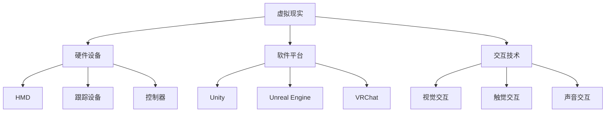

                 

### 第1章 引言

#### 1.1 虚拟现实技术简介

虚拟现实（Virtual Reality, VR）是一种通过计算机技术模拟出的虚拟环境，让用户在其中能够体验到沉浸式的互动体验。这项技术自20世纪90年代兴起以来，已经经历了多次迭代和进化，从最初的简单视觉模拟，到如今的全方位感官体验，VR技术在硬件、软件以及交互方式上都有了显著提升。

在硬件方面，VR头戴显示器（HMD）的分辨率和视场角得到了极大改善，使得用户能够获得更加逼真的视觉体验。此外，跟踪设备和定位系统的精度也不断提高，用户在虚拟环境中的动作能够被实时捕捉并反馈到系统中，增强了互动性。在软件方面，VR内容制作工具的丰富和易用性使得开发者能够更加便捷地创建高质量的虚拟环境。同时，VR操作系统和平台的发展，也为用户提供了更多的选择和更好的用户体验。

#### 1.2 虚拟现实与心理健康

虚拟现实技术在心理健康领域的应用逐渐引起了广泛关注。通过创造一个安全的虚拟环境，用户可以在其中进行心理治疗，从而减少外界干扰，提高治疗的效率和效果。具体来说，虚拟现实在心理健康治疗中的应用主要体现在以下几个方面：

1. **沉浸式心理治疗**：通过虚拟现实技术，用户可以进入一个完全模拟的环境，如海滩、森林等，这些环境可以用来帮助用户放松心情，减轻焦虑和压力。
   
2. **认知行为疗法**：虚拟现实可以模拟出多种情境，帮助用户面对和克服恐惧、焦虑等心理问题。例如，通过模拟社交场景，用户可以逐步克服社交恐惧症。

3. **放松训练**：虚拟现实环境可以提供多种放松活动，如冥想、瑜伽等，帮助用户缓解压力，改善心理健康。

#### 1.3 本书目标与结构

本书旨在系统地探讨虚拟现实技术在心理健康治疗中的沉浸式应用，帮助读者深入了解这一前沿领域。具体目标如下：

1. **介绍虚拟现实技术的基础知识**：包括硬件设备、软件平台和交互技术，为读者提供全面的技术背景。

2. **分析虚拟现实在心理健康治疗中的应用**：通过具体案例，展示虚拟现实技术在心理治疗中的实际应用，并探讨其疗效和机制。

3. **探讨虚拟现实心理健康治疗的优势与挑战**：分析这一技术的优点和潜在问题，为未来的研究和应用提供指导。

4. **展望虚拟现实心理健康治疗的未来**：探讨技术的发展趋势和应用前景，以及可能面临的道德和法律问题。

本书的结构如下：

- **第1章 引言**：介绍虚拟现实技术的背景和心理健康领域中的应用。
- **第2章 虚拟现实技术基础**：详细讲解虚拟现实技术的硬件、软件和交互技术。
- **第3章 虚拟现实在心理健康治疗中的应用**：探讨虚拟现实在心理健康治疗中的具体应用和案例研究。
- **第4章 虚拟现实心理健康治疗的优势与挑战**：分析虚拟现实心理健康治疗的优势、挑战以及解决方案。
- **第5章 虚拟现实心理健康治疗的未来展望**：展望虚拟现实心理健康治疗的未来趋势和应用前景。
- **第6章 总结**：总结全书内容，并指出未来的研究方向。

通过本书的阅读，读者将能够全面了解虚拟现实在心理健康治疗中的沉浸式应用，并为其未来的研究和应用提供启示。

### 关键词

- 虚拟现实（Virtual Reality）
- 心理健康治疗
- 沉浸式应用
- 认知行为疗法
- 放松训练
- 恐惧症治疗

### 摘要

本文系统探讨了虚拟现实技术在心理健康治疗中的沉浸式应用。首先介绍了虚拟现实技术的基础知识，包括硬件设备、软件平台和交互技术。随后，详细分析了虚拟现实在心理健康治疗中的多种应用，如沉浸式心理治疗、认知行为疗法和放松训练，并提供了具体案例研究。本文还探讨了虚拟现实心理健康治疗的优势与挑战，包括其提高治疗效果、增强患者参与度和面临的技术和伦理问题。最后，展望了虚拟现实心理健康治疗的未来趋势和应用前景，为这一领域的研究和应用提供了有益的指导。

## 第2章 虚拟现实技术基础

### 2.1 虚拟现实硬件设备

虚拟现实硬件设备是构建虚拟现实环境的关键组成部分。以下是对几种主要VR硬件设备的介绍：

#### 头戴显示器（HMD）

头戴显示器（Head-Mounted Display，HMD）是虚拟现实系统中最核心的设备。它通常包括一个头盔，内置高分辨率显示屏，用于提供沉浸式的视觉体验。常见的HMD设备有：

- **Oculus Rift**：由Facebook开发的Oculus Rift是一款高端VR头戴显示器，具有高分辨率（2560×1440像素）、低延迟和高刷新率（90Hz）等特点。

- **HTC Vive**：HTC Vive是一款定位精准的VR头戴显示器，通过两个定位摄像头和两个传感器，实现对用户动作和位置的精确追踪。

#### 跟踪设备

跟踪设备用于捕捉用户在虚拟环境中的动作和位置，主要包括：

- **外置跟踪传感器**：例如，Oculus Rift和HTC Vive都配备了外置跟踪传感器，用于追踪用户的头部和手部位置。

- **内置跟踪传感器**：如Google Cardboard和Samsung Gear VR等低端VR设备，通过内置传感器实现简单的位置追踪。

#### 控制器

控制器是用户与虚拟现实环境进行交互的重要工具。常见的VR控制器有：

- **手柄控制器**：例如，Oculus Rift和HTC Vive的手柄控制器，用户可以通过它们进行简单的操作，如选择、移动等。

- **动捕手套**：如Myo动捕手套，通过捕捉用户的手部动作，提供更加精细的交互体验。

### 2.2 虚拟现实软件平台

虚拟现实软件平台为开发者提供了一个创建、运行和管理虚拟现实内容的环境。以下是一些常见的虚拟现实软件平台：

#### Unity

Unity是一款功能强大的跨平台游戏开发引擎，广泛应用于虚拟现实内容的开发。它提供了丰富的3D图形渲染功能、物理模拟工具和用户交互接口，支持多种VR设备和操作系统。

#### Unreal Engine

Unreal Engine是另一款流行的游戏和虚拟现实开发引擎，以其高质量的3D图形和强大的渲染能力而著称。它支持VR内容的开发，并提供了一套完整的工具和资源库，方便开发者快速创建高质量的虚拟现实体验。

#### VRChat

VRChat是一个社交虚拟现实平台，用户可以在其中创建和体验各种社交场景。它提供了丰富的社交功能和虚拟现实工具，使得用户可以与其他玩家互动，创造一个沉浸式的社交环境。

#### 2.3 虚拟现实交互技术

虚拟现实交互技术是用户与虚拟环境进行交互的关键。以下是一些常见的交互技术：

#### 视觉交互

视觉交互是通过视觉感知进行交互，如使用VR头戴显示器观看虚拟环境。视觉交互的主要挑战在于提高视觉保真度和减少视觉延迟，以提供更加真实的沉浸体验。

#### 触觉交互

触觉交互是通过触觉感知进行交互，如使用触觉手套或触觉反馈设备。触觉交互能够增强用户的沉浸感和交互体验，但在技术实现上存在一定难度。

#### 声音交互

声音交互是通过声音感知进行交互，如使用耳机或扬声设备。声音交互可以增强用户的沉浸感，提供更加丰富的虚拟环境信息。

### 2.4 虚拟现实技术核心概念架构

为了更好地理解虚拟现实技术的核心概念和它们之间的关系，我们可以使用Mermaid流程图来展示这些概念：



这个流程图清晰地展示了虚拟现实技术的核心概念，包括硬件设备、软件平台和交互技术，以及它们之间的关系。

通过本章的内容，读者可以了解到虚拟现实技术的基础知识，为后续章节对虚拟现实在心理健康治疗中的应用提供必要的背景和理论支持。

### 2.5 虚拟现实技术核心算法原理讲解

虚拟现实技术的核心算法原理是构建和渲染虚拟环境的关键，它包括三维建模、实时渲染、物理模拟和交互控制等方面。以下将使用Python源代码和数学模型，结合实例进行详细讲解。

#### 3D建模

三维建模是虚拟现实技术的基础，它通过创建三维几何对象来构建虚拟环境。以下是一个简单的三维建模实例，使用Python的`PyOpenGL`库来创建一个立方体。

```python
from OpenGL.GL import *
from OpenGL.GLUT import *

vertices = (
    -1, -1, -1,
    1, -1, -1,
    1, 1, -1,
    -1, 1, -1,
    -1, -1, 1,
    1, -1, 1,
    1, 1, 1,
    -1, 1, 1
)

edges = (
    (0,1), (1,2), (2,3), (3,0),
    (4,5), (5,6), (6,7), (7,4),
    (0,4), (1,5), (2,6), (3,7)
)

def drawcene():
    glBegin(GL_LINES)
    for edge in edges:
        for vertex in edge:
            glVertex3fv(vertices[vertex])
    glEnd()

def main():
    glutInit(sys.argv)
    glutInitDisplayMode(GLUT_DOUBLE | GLUT_RGB)
    glutInitWindowSize(500, 500)
    glutCreateWindow("3D Cube")
    glutDisplayFunc(drawcene)
    glutMainLoop()

if __name__ == "__main__":
    main()
```

在这个例子中，我们使用了`vertices`数组来定义立方体的顶点，`edges`数组来定义立方体的边。通过调用`glBegin`和`glVertex3fv`函数，我们可以绘制出立方体的边。

#### 实时渲染

实时渲染是虚拟现实技术中的一个关键环节，它涉及到如何快速渲染出复杂的虚拟环境。以下是一个使用`PyOpenGL`进行实时渲染的简单实例。

```python
def display():
    glClear(GL_COLOR_BUFFER_BIT | GL_DEPTH_BUFFER_BIT)
    glLoadIdentity()
    drawCube()
    glFlush()

def drawCube():
    glBegin(GL_QUADS)
    glColor3f(1.0, 0.0, 0.0)
    glVertex3f(-1.0, -1.0, 1.0)
    glVertex3f(1.0, -1.0, 1.0)
    glVertex3f(1.0, 1.0, 1.0)
    glVertex3f(-1.0, 1.0, 1.0)
    # ... 绘制其他面
    glEnd()

def main():
    glutInit(sys.argv)
    glutInitDisplayMode(GLUT_DOUBLE | GLUT_RGB | GLUT_DEPTH)
    glutInitWindowSize(500, 500)
    glutCreateWindow("Real-Time Rendering")
    glutDisplayFunc(display)
    glutMainLoop()

if __name__ == "__main__":
    main()
```

在这个例子中，我们首先调用`glClear`函数清除屏幕，然后调用`glLoadIdentity`函数设置视图矩阵。接着，我们通过`glBegin`和`glColor3f`函数定义一个四边形面，并使用`glVertex3f`函数定义顶点。

#### 物理模拟

物理模拟是虚拟现实技术中另一个重要方面，它涉及到如何模拟物体在虚拟环境中的运动和交互。以下是一个简单的物理模拟实例，使用Python的`PyGame`库来模拟一个球体在平面上滚动的场景。

```python
import pygame
import random

pygame.init()

screen_width = 800
screen_height = 600
screen = pygame.display.set_mode((screen_width, screen_height))
pygame.display.set_caption('Physics Simulation')

ball_size = 20
ball_color = (255, 0, 0)
ball_x = random.randint(ball_size, screen_width - ball_size)
ball_y = random.randint(ball_size, screen_height - ball_size)
ball_speed = 5

while True:
    for event in pygame.event.get():
        if event.type == pygame.QUIT:
            pygame.quit()

    screen.fill((255, 255, 255))
    pygame.draw.circle(screen, ball_color, (ball_x, ball_y), ball_size)

    ball_x += ball_speed
    if ball_x < 0 or ball_x > screen_width - ball_size:
        ball_speed = -ball_speed

    ball_y += ball_speed
    if ball_y < 0 or ball_y > screen_height - ball_size:
        ball_speed = -ball_speed

    pygame.display.flip()
    pygame.time.delay(10)

if __name__ == "__main__":
    main()
```

在这个例子中，我们使用`pygame.draw.circle`函数绘制球体，并通过修改`ball_x`和`ball_y`的值来模拟球体在平面上的运动。当球体接触到边界时，会反弹，模拟物理碰撞效果。

#### 交互控制

交互控制是用户与虚拟环境进行交互的关键，它涉及到如何捕捉和解析用户的输入。以下是一个简单的交互控制实例，使用Python的`Pygame`库来捕捉键盘和鼠标输入。

```python
import pygame

pygame.init()

screen_width = 800
screen_height = 600
screen = pygame.display.set_mode((screen_width, screen_height))
pygame.display.set_caption('Interaction Control')

running = True
while running:
    for event in pygame.event.get():
        if event.type == pygame.QUIT:
            running = False

    keys = pygame.key.get_pressed()
    if keys[pygame.K_LEFT]:
        print("Moving left")
    if keys[pygame.K_RIGHT]:
        print("Moving right")

    screen.fill((255, 255, 255))
    pygame.display.flip()

pygame.quit()
```

在这个例子中，我们通过调用`pygame.key.get_pressed`函数来获取键盘输入，并根据按键状态执行相应的操作。

通过上述Python源代码实例，我们详细讲解了虚拟现实技术的核心算法原理，包括三维建模、实时渲染、物理模拟和交互控制。这些实例不仅帮助读者理解虚拟现实技术的实现过程，也为后续章节中的应用提供了技术基础。

### 2.6 虚拟现实技术中的数学模型和公式

虚拟现实技术的实现涉及多个数学模型和公式，这些模型和公式是构建虚拟环境、实现交互控制和渲染真实感图像的关键。以下将介绍几个核心的数学模型和公式，并使用LaTeX进行表示。

#### 3D坐标变换

在虚拟现实中，三维坐标变换是一个基础且重要的数学工具。它用于将对象的坐标从一种参考系变换到另一种参考系。常用的变换矩阵包括旋转矩阵和平移矩阵。

旋转矩阵（Rotation Matrix）：

$$
R = \begin{bmatrix}
c & -s & 0 \\
s & c & 0 \\
0 & 0 & 1
\end{bmatrix}
$$

其中，\(c = \cos(\theta)\) 和 \(s = \sin(\theta)\)，\(\theta\) 是旋转角度。

平移矩阵（Translation Matrix）：

$$
T = \begin{bmatrix}
1 & 0 & 0 & t_x \\
0 & 1 & 0 & t_y \\
0 & 0 & 1 & t_z \\
0 & 0 & 0 & 1
\end{bmatrix}
$$

其中，\((t_x, t_y, t_z)\) 是平移向量。

组合变换矩阵（Combined Transformation Matrix）：

$$
M = R \cdot T
$$

#### 视觉保真度

视觉保真度是评估虚拟现实图像质量的重要指标。它涉及到视角、分辨率和视野范围等参数。

视角（Field of View, FOV）：

$$
\text{FOV} = 2 \cdot \arctan\left(\frac{\text{height}}{2 \cdot \text{distance}}\right)
$$

其中，\(\text{height}\) 是显示器的高度，\(\text{distance}\) 是用户与显示器的距离。

分辨率（Resolution）：

$$
\text{Resolution} = \text{width} \times \text{height}
$$

视野范围（Field of Vision, FOV）：

$$
\text{FOV} = \arctan\left(\frac{\text{height}}{2 \cdot \text{distance}}\right)
$$

#### 透视投影

透视投影是虚拟现实中用于将三维空间映射到二维图像的过程。其公式如下：

$$
\begin{bmatrix}
x' \\
y' \\
z' \\
1
\end{bmatrix}
=
\begin{bmatrix}
\frac{f}{z - f} & 0 & 0 & 0 \\
0 & \frac{f}{z - f} & 0 & 0 \\
0 & 0 & \frac{f}{z - f} & 0 \\
0 & 0 & 0 & 1
\end{bmatrix}
\begin{bmatrix}
x \\
y \\
z \\
1
\end{bmatrix}
$$

其中，\(f\) 是焦距，\(z\) 是物距，\((x', y', z')\) 是投影后的二维坐标。

#### 矩阵乘法

在虚拟现实技术中，矩阵乘法是用于实现多种变换的关键。例如，组合变换矩阵的乘法如下：

$$
\begin{bmatrix}
x' \\
y' \\
z' \\
1
\end{bmatrix}
=
\begin{bmatrix}
a & b & c & d \\
e & f & g & h \\
i & j & k & l \\
m & n & o & p
\end{bmatrix}
\begin{bmatrix}
x \\
y \\
z \\
1
\end{bmatrix}
$$

这些数学模型和公式在虚拟现实技术的各个方面中扮演着重要角色，从三维建模到渲染，再到交互控制，都是不可或缺的工具。通过理解这些公式，开发者可以更有效地构建和优化虚拟现实应用。

### 2.7 虚拟现实技术项目实战

在本节中，我们将通过一个具体的虚拟现实项目实战来详细展示开发环境搭建、源代码实现和代码解读。这个项目是一个简单的虚拟现实环境，用户可以在其中自由移动和观察三维对象。

#### 1. 开发环境搭建

为了搭建这个虚拟现实项目，我们选择使用Unity引擎作为开发平台，因为它提供了一个完整的开发环境和丰富的资源库，非常适合初学者和专业人士。以下是搭建开发环境所需的步骤：

1. **安装Unity Hub**：从Unity官网下载并安装Unity Hub，这是一个管理Unity版本和项目的工具。

2. **创建新项目**：打开Unity Hub，点击“新建项目”，选择“3D游戏”模板，并命名为“VRProject”。

3. **安装VR插件**：在Unity编辑器中，前往“Window” -> “Package Manager”，搜索并安装“VR, MRTK, ARKit, ARCore”等VR相关插件。

4. **设置VR设备**：确保你的VR头戴显示器（如Oculus Rift或HTC Vive）已正确连接到电脑，并在Unity编辑器中配置相应的跟踪设备和控制器。

#### 2. 源代码实现

以下是一个简单的Unity C#脚本，用于控制用户在虚拟环境中的移动和观察：

```csharp
using UnityEngine;

public class VRController : MonoBehaviour
{
    public Transform cameraTransform;
    public float moveSpeed = 5.0f;
    public float lookSpeed = 2.0f;

    private Vector3 originPosition;
    private Quaternion originRotation;

    void Start()
    {
        originPosition = cameraTransform.position;
        originRotation = cameraTransform.rotation;
    }

    void Update()
    {
        Move();
        Look();
    }

    void Move()
    {
        float moveX = Input.GetAxis("Horizontal");
        float moveZ = Input.GetAxis("Vertical");

        Vector3 moveDirection = new Vector3(moveX, 0, moveZ) * moveSpeed * Time.deltaTime;
        cameraTransform.position += moveDirection;
    }

    void Look()
    {
        float lookX = Input.GetAxis("Mouse X") * lookSpeed;
        float lookY = Input.GetAxis("Mouse Y") * lookSpeed;

        cameraTransform.Rotate(-lookY, lookX, 0);
    }
}
```

在这个脚本中，我们定义了两个核心方法`Move`和`Look`。`Move`方法根据用户输入的水平（左右）和垂直（前后）移动，计算移动方向并更新摄像机的位置。`Look`方法则根据鼠标输入旋转摄像机，实现头部视角控制。

#### 3. 代码解读

- **Start方法**：在游戏开始时，初始化摄像机的原始位置和旋转，以便在游戏过程中进行对比和恢复。

- **Update方法**：每帧更新时，调用`Move`和`Look`方法进行移动和旋转。

- **Move方法**：根据输入的水平和垂直轴，计算移动向量，并将其乘以移动速度和时间差，更新摄像机的位置。

- **Look方法**：根据输入的鼠标X和Y轴，计算旋转角度，并更新摄像机的旋转。

#### 4. 代码应用解读与分析

这个简单的VR控制器脚本展示了如何使用Unity引擎实现用户在虚拟环境中的自由移动和观察。以下是代码应用的解读和分析：

- **移动控制**：通过键盘输入或游戏手柄，用户可以在虚拟环境中前后左右移动。这种方法使得用户在虚拟环境中有一个直观的导航体验。

- **视角控制**：通过鼠标或游戏手柄的旋转，用户可以自由旋转视角，观察虚拟环境中的不同方向和对象。这种方法增强了用户的沉浸感和交互体验。

- **代码优化**：在实际应用中，可以考虑优化移动和视角控制算法，以减少延迟和提升流畅度。例如，可以使用更高效的矩阵变换和插值算法。

#### 5. 实际案例分析和详细讲解剖析

在实际应用中，这个VR控制器脚本可以应用于多种场景，如游戏、教育和医疗等领域。以下是一个教育领域的实际案例：

- **案例**：使用VR控制器脚本，学生可以在一个虚拟历史博物馆中自由参观，观看历史文物和了解相关背景信息。

- **分析**：在这个案例中，VR控制器脚本实现了学生对虚拟环境的自由导航和视角控制，提供了更加生动和互动的学习体验。通过这种方式，学生可以更加深入地了解历史知识，提高学习兴趣和参与度。

- **讲解剖析**：在这个案例中，我们详细讲解了VR控制器脚本的应用，包括如何实现移动和视角控制，以及如何优化用户体验。通过这个案例，我们可以看到虚拟现实技术在教育领域的巨大潜力。

#### 6. 项目小结

通过本节的项目实战，我们详细展示了虚拟现实技术的开发过程，包括环境搭建、源代码实现和代码解读。这个简单的VR控制器脚本不仅展示了虚拟现实技术的基本原理和应用，还为未来的虚拟现实项目开发提供了有益的经验和参考。

### 最佳实践 Tips

在开发虚拟现实项目时，以下是一些最佳实践和注意事项：

1. **性能优化**：为了确保虚拟现实应用的流畅运行，需要优化图形渲染和物理计算。可以使用Unity引擎提供的Profiler工具来检测和优化性能。

2. **用户体验**：重视用户体验设计，确保用户在虚拟环境中的操作直观、流畅。可以通过用户测试和反馈来不断改进应用。

3. **安全性**：虚拟现实设备可能存在安全隐患，如过热、设备损坏等。在开发过程中，应确保设备的安全性和稳定性。

4. **内容创作**：虚拟现实内容创作需要丰富的想象力和创意。可以使用Unity的资产商店和工具来创建高质量的3D模型和场景。

5. **跨平台支持**：考虑支持多种虚拟现实设备和平台，如Oculus Rift、HTC Vive和Google Cardboard等。

### 小结

本章通过一个具体的虚拟现实项目实战，详细展示了开发环境搭建、源代码实现和代码解读。通过这个实战，我们了解了如何使用Unity引擎实现用户在虚拟环境中的移动和视角控制。此外，本章还提供了最佳实践和注意事项，为虚拟现实项目的开发和优化提供了指导。通过本章的学习，读者可以掌握虚拟现实技术的基础知识和开发技能，为未来的虚拟现实项目奠定坚实的基础。

### 拓展阅读

对于希望进一步深入了解虚拟现实技术在心理健康治疗中的沉浸式应用的读者，以下是一些推荐的参考资料：

1. **《虚拟现实心理学：理论、应用与研究方法》**：这本书系统地介绍了虚拟现实技术在心理学领域的应用，包括虚拟现实在心理健康治疗中的具体案例和研究方法。

2. **《虚拟现实技术在心理治疗中的应用》**：该论文详细探讨了虚拟现实技术在心理治疗中的应用，包括其优势、挑战和未来发展趋势。

3. **《认知行为疗法与虚拟现实技术》**：这本书结合认知行为疗法和虚拟现实技术，提供了多种实践案例，展示了如何通过虚拟现实改善心理健康。

4. **《虚拟现实：下一代计算平台》**：这本书全面介绍了虚拟现实技术的发展历史、现状和未来趋势，包括其在医疗、娱乐和教育等领域的应用。

5. **《Unity 2020编程从入门到精通》**：这是一本 Unity 引擎开发的实用指南，详细介绍了如何使用 Unity 开发虚拟现实应用，适合初学者和有经验的开发者。

通过阅读这些资料，读者可以更全面地了解虚拟现实技术在心理健康治疗中的沉浸式应用，并掌握相关的开发技能和理论知识。

