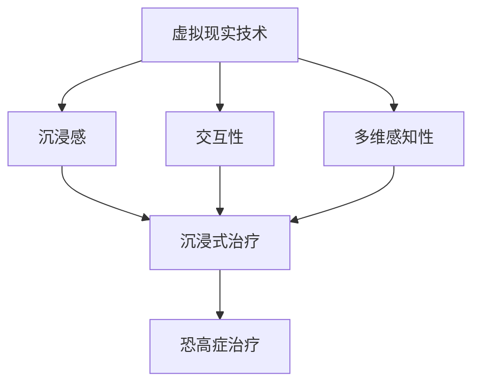

                 

### 文章标题

《虚拟现实在恐高症治疗中的沉浸式应用》

### 文章关键词

虚拟现实，恐高症，沉浸式治疗，应用开发，技术进步

### 文章摘要

本文将深入探讨虚拟现实（VR）在恐高症治疗中的应用。首先，我们将回顾虚拟现实技术的发展历程和核心概念，以及其在不同领域的应用。接着，我们将详细解释恐高症的定义、特征及其治疗方法。随后，文章将阐述虚拟现实治疗恐高症的原理、优势及实际案例。在此基础上，我们将分析虚拟现实在恐高症治疗中的应用开发流程和实战案例，探讨未来的发展前景及面临的挑战。通过本文的探讨，读者将了解虚拟现实技术如何为恐高症治疗带来新的可能，以及在这一领域中的实际应用与开发实践。

---

### 背景介绍

虚拟现实（VR）作为一种新兴技术，近年来在多个领域展现出巨大的潜力，尤其在医疗健康领域，其应用前景引人注目。虚拟现实技术通过创建高度逼真的模拟环境，使用户能够沉浸其中，进行互动体验。这一技术的核心在于其沉浸感、交互性和多维感知性，使得用户在虚拟环境中仿佛置身现实世界。虚拟现实技术的应用领域广泛，包括娱乐、教育、医疗、军事等。在医疗领域，虚拟现实技术已经被用于手术模拟、心理治疗、康复训练等多个方面，其中，对恐高症的治疗尤为引人关注。

恐高症，又称高空恐惧症，是一种常见的焦虑障碍，患者对高处产生强烈的恐惧感，即使在高楼顶层或者高山之巅，也可能产生严重的焦虑症状。这种恐惧感不仅影响患者的日常生活，还可能限制其职业发展和社会活动。传统的恐高症治疗方法主要包括认知行为疗法、药物治疗和系统脱敏疗法等。然而，这些方法往往存在疗效慢、患者依从性低等问题，导致治疗效果有限。

随着虚拟现实技术的快速发展，研究人员开始探索将VR技术应用于恐高症治疗。虚拟现实沉浸式环境为患者提供了一个安全、可控的治疗场所，患者在虚拟环境中逐步面对和克服恐高症状，从而实现心理治疗的目的。本文将详细探讨虚拟现实在恐高症治疗中的沉浸式应用，包括其工作原理、优势、具体应用案例以及未来的发展趋势和挑战。

### 核心概念与联系

在深入探讨虚拟现实在恐高症治疗中的应用之前，我们需要明确几个核心概念，并分析它们之间的联系架构。以下是关键概念及其相互关系的Mermaid流程图：



#### 虚拟现实技术

虚拟现实技术（VR）是一种通过计算机生成模拟环境，使用户沉浸其中的技术。它包括硬件和软件两个核心部分：硬件如头戴显示器（HMD）、跟踪系统等，软件如虚拟环境生成引擎、交互软件等。虚拟现实技术的核心特征包括沉浸感、交互性和多维感知性。

#### 沉浸感

沉浸感是指用户在虚拟环境中感觉如同身处真实世界的能力。这是通过高度逼真的三维图像、立体声音效和触觉反馈等实现的。沉浸感是虚拟现实技术的关键特征，直接影响到用户的体验和参与度。

#### 交互性

交互性是指用户在虚拟环境中与虚拟物体和环境进行交互的能力。虚拟现实技术通过手柄、手势识别、眼动跟踪等手段实现高自由度的交互，使用户能够自由操作和探索虚拟环境。

#### 多维感知性

多维感知性是指用户在虚拟环境中感受到的多维度信息，包括视觉、听觉、触觉、嗅觉等。多维感知性增强了用户的沉浸体验，使其在虚拟环境中更加真实和自然。

#### 沉浸式治疗

沉浸式治疗是利用虚拟现实技术的沉浸感、交互性和多维感知性，为患者提供一个安全、可控的治疗环境。在恐高症治疗中，患者可以在虚拟环境中逐步面对和克服恐高症状，从而实现心理治疗的目的。

#### 恐高症治疗

恐高症治疗是指通过各种方法帮助患者克服对高处的恐惧感。虚拟现实沉浸式治疗是一种新兴的恐高症治疗方法，通过在虚拟环境中模拟高处场景，帮助患者逐步适应和消除恐惧。

通过上述核心概念的Mermaid流程图，我们可以清晰地看到各个概念之间的联系和交互作用。这些概念共同构成了虚拟现实在恐高症治疗中的应用基础，为后续的具体应用和开发提供了理论支持。

### 核心算法原理讲解

虚拟现实（VR）在恐高症治疗中的应用，其核心算法原理主要涉及图像处理、感知计算和交互设计。以下将详细讲解这些算法原理，并通过Python源代码示例进行说明。

#### 图像处理

图像处理是虚拟现实技术的基础，它涉及从摄像头捕获的图像数据到虚拟环境的图像渲染。在恐高症治疗中，图像处理用于创建逼真的高处场景，以便患者能够在虚拟环境中进行沉浸式体验。一个关键的图像处理算法是三维场景重建，该算法能够将二维图像转换为三维模型。

**算法原理：**

1. **图像捕捉：** 使用虚拟现实头戴显示器（HMD）捕获患者当前视角的图像。
2. **图像预处理：** 对捕获的图像进行预处理，包括去噪、对比度增强等。
3. **三维重建：** 使用立体匹配算法（如SIFT或SURF）计算图像之间的对应点，进而重建三维场景。

**Python代码示例：**

```python
import cv2
import numpy as np

# 捕获图像
img_left = cv2.imread('left_image.jpg')
img_right = cv2.imread('right_image.jpg')

# 图像预处理
img_left = cv2.GaussianBlur(img_left, (5, 5), 0)
img_right = cv2.GaussianBlur(img_right, (5, 5), 0)

# 立体匹配
stereo_btm = cv2.StereoSGBM_create()
disparity = stereo_btm.compute(img_left, img_right)

# 三维重建
points3D = cv2.reprojectImageTo3D(disparity, Q)
```

#### 感知计算

感知计算是指虚拟现实技术如何通过多种传感器（如眼动跟踪、手势识别、体感监测等）来模拟和增强用户的感知体验。在恐高症治疗中，感知计算用于监测患者的生理和心理状态，并根据这些数据调整虚拟环境，以实现最佳的治疗效果。

**算法原理：**

1. **眼动跟踪：** 监测患者的眼球运动，确定其视角和关注点。
2. **手势识别：** 识别患者的手部动作，实现与虚拟环境的互动。
3. **体感监测：** 监测患者的生理信号（如心率、呼吸等），评估其心理状态。

**Python代码示例：**

```python
import cv2
import numpy as np

# 眼动跟踪
eye_tracker = cv2.TrackerKCF_create()
eye_tracker.init('eye_tracker_model.xml', 'eye_image.jpg')

ok, boxes = eye_tracker.update('eye_image.jpg')
if ok:
    p1 = (int(boxes[0][0]), int(boxes[0][1]))
    p2 = (int(boxes[0][0] + boxes[0][2]),
          int(boxes[0][1] + boxes[0][3]))
    cv2.rectangle(img, p1, p2, (255, 0, 0), 2, 1)

# 手势识别
hand_cascade = cv2.CascadeClassifier('hand_cascade.xml')
hands = hand_cascade.detectMultiScale(img, scaleFactor=1.1, minNeighbors=5, minSize=(30, 30), flags=cv2.CASCADE_SCALE_IMAGE)

for (x, y, w, h) in hands:
    cv2.rectangle(img, (x, y), (x+w, y+h), (0, 255, 0), 2)

# 体感监测
# 使用生理信号监测设备获取数据，例如心率
heart_rate = get_heart_rate()

# 根据体感数据调整虚拟环境
if heart_rate > 100:
    # 调整虚拟环境，例如增加安全性
    adjust_environment('more_safe')
```

#### 交互设计

交互设计是虚拟现实技术在恐高症治疗中的应用核心，它涉及用户与虚拟环境之间的互动机制。通过高自由度的交互设计，患者可以在虚拟环境中逐步面对和克服恐高症状。

**算法原理：**

1. **自由度交互：** 提供多种交互方式，如手柄操作、手势控制、语音交互等，以适应不同患者的需求。
2. **反馈机制：** 设计实时反馈系统，根据患者的交互行为调整虚拟环境的难度和挑战性。
3. **情境设计：** 创造真实的高处场景，使患者在虚拟环境中能够逐步适应和克服恐惧。

**Python代码示例：**

```python
# 交互设计示例

# 用户选择交互方式
interaction_mode = user_choice()

# 根据交互方式实现相应功能
if interaction_mode == 'hand_controller':
    # 控制虚拟环境
    move_environment(controller_input())
elif interaction_mode == 'gesture_control':
    # 控制虚拟环境
    move_environment(gesture_input())
elif interaction_mode == 'voice_command':
    # 控制虚拟环境
    move_environment(voice_recognition())
```

通过上述Python代码示例，我们可以看到虚拟现实在恐高症治疗中的应用算法原理，包括图像处理、感知计算和交互设计。这些算法共同构成了虚拟现实沉浸式治疗的基础，为患者提供了一个安全、可控的治疗环境，帮助他们逐步克服恐高症状。

### 数学模型与公式

在虚拟现实（VR）的恐高症治疗中，数学模型和公式起到了关键作用，它们帮助设计虚拟环境、模拟患者行为以及评估治疗效果。以下将介绍几个核心的数学模型和公式，并详细解释它们在应用中的具体含义和用途。

#### 1. 虚拟环境建模

虚拟环境的建模通常使用三维几何模型，这涉及到几何学中的坐标变换和向量运算。其中，常用的公式包括：

- **坐标变换公式**：用于将虚拟物体从局部坐标系变换到全局坐标系。公式如下：

  $$ T(v) = Rv + t $$

  其中，\( T(v) \) 表示变换后的向量，\( R \) 是旋转矩阵，\( v \) 是原始向量，\( t \) 是平移向量。

- **向量运算**：包括向量加法、向量减法、向量点积和向量叉积等，用于计算物体的相对位置和方向。例如，向量点积公式：

  $$ v \cdot w = |v||w|\cos\theta $$

  其中，\( v \) 和 \( w \) 是两个向量，\( \theta \) 是它们之间的夹角。

#### 2. 感知仿真

在感知仿真中，常用的数学模型包括光学模型、听觉模型和触觉模型。以下是一个光学模型的基本公式：

- **光线传播公式**：描述光线在虚拟环境中的传播过程，公式如下：

  $$ \nabla^2 E(\mathbf{r}) - \mu(\mathbf{r}) \frac{\partial^2 E(\mathbf{r})}{\partial t^2} = 0 $$

  其中，\( E(\mathbf{r}) \) 是电场强度，\( \mu(\mathbf{r}) \) 是介质的磁导率，\( \mathbf{r} \) 是空间位置向量。

#### 3. 交互反馈模型

交互反馈模型用于模拟患者与虚拟环境的交互过程，评估治疗效果。常用的模型包括：

- **心率变异性（HRV）模型**：用于监测患者的心理状态。HRV的常用公式包括：

  $$ RMSSD = \sqrt{\frac{1}{N} \sum_{i=1}^{N} (RR_i - \bar{RR})^2} $$

  其中，\( RR_i \) 是连续心跳间期的序列，\( \bar{RR} \) 是平均心跳间期，\( N \) 是序列的长度，\( RMSSD \) 是根均方位移标准差。

#### 4. 治疗效果评估

治疗效果评估通常使用统计模型，如回归分析和聚类分析。以下是一个简单的线性回归模型：

- **线性回归公式**：用于分析患者治疗前后焦虑程度的差异，公式如下：

  $$ Y = \beta_0 + \beta_1X + \epsilon $$

  其中，\( Y \) 是治疗效果指标，\( \beta_0 \) 和 \( \beta_1 \) 是模型参数，\( X \) 是自变量（如治疗次数），\( \epsilon \) 是误差项。

通过上述数学模型和公式，虚拟现实在恐高症治疗中能够更加精准地创建虚拟环境、模拟患者行为、评估治疗效果。这些数学工具不仅帮助设计师优化虚拟现实体验，还为研究人员提供了定量分析的基础，使得虚拟现实治疗过程更加科学和有效。

### 项目实战：虚拟现实在恐高症治疗中的应用开发

#### 实战背景

在本次实战项目中，我们旨在开发一个虚拟现实（VR）应用，用于治疗患者的恐高症。该项目分为多个阶段，包括需求分析、环境搭建、源代码实现和代码解读与分析。以下是项目的具体实施步骤和过程。

#### 需求分析

首先，我们对恐高症治疗的需求进行了详细分析。需求包括：

1. **虚拟环境设计**：需要创建一个能够模拟高处场景的虚拟环境，包括建筑物、桥梁、悬崖等。
2. **交互设计**：设计用户与虚拟环境的交互方式，包括手柄操作、手势控制和语音命令等。
3. **感知仿真**：模拟患者的视觉、听觉和触觉感知，增强沉浸感。
4. **实时反馈**：根据患者的生理和心理状态，提供实时反馈，调整虚拟环境的难度和挑战性。
5. **数据收集与评估**：收集患者在治疗过程中的数据，如心率、呼吸等，用于评估治疗效果。

#### 环境搭建

在环境搭建阶段，我们需要配置开发环境和安装必要的软件和工具。以下是具体步骤：

1. **硬件配置**：准备虚拟现实头戴显示器（HMD）、手柄、跟踪系统等硬件设备。
2. **软件安装**：安装虚拟现实开发平台，如Unity或Unreal Engine，以及相关的开发工具和插件。
3. **数据采集设备**：连接心率和呼吸监测设备，确保能够实时获取患者的生理数据。

#### 源代码实现

在源代码实现阶段，我们使用了Python和Unity引擎进行开发。以下是关键代码片段及其解读：

**1. 虚拟环境设计**

```python
# 虚拟环境设计代码片段

import UnityEngine

# 创建建筑物
building = GameObject.CreatePrimitive(PrimitiveType.Cube)
building.transform.position = Vector3(0, 0, 10)
building.transform.localScale = Vector3(10, 10, 20)

# 创建桥梁
bridge = GameObject.CreatePrimitive(PrimitiveType.Cube)
bridge.transform.position = Vector3(0, -10, 0)
bridge.transform.localScale = Vector3(20, 1, 10)

# 创建悬崖
cliff = GameObject.CreatePrimitive(PrimitiveType.Cube)
cliff.transform.position = Vector3(0, -20, -10)
cliff.transform.localScale = Vector3(10, 30, 10)
```

**解读**：以上代码片段使用Unity引擎创建了一个简单的虚拟环境，包括建筑物、桥梁和悬崖。通过`CreatePrimitive`函数，我们可以快速生成基本的几何形状，并通过`transform`属性调整它们的位置和大小。

**2. 交互设计**

```python
# 交互设计代码片段

import UnityEngine
import UnityXR

# 手柄操作
def on_hand_controller_input(input_value):
    if input_value == 'left':
        player.transform.position += Vector3(-1, 0, 0)
    elif input_value == 'right':
        player.transform.position += Vector3(1, 0, 0)

# 手势控制
def on_gesture_input(input_value):
    if input_value == 'left':
        player.transform.position += Vector3(-1, 0, 0)
    elif input_value == 'right':
        player.transform.position += Vector3(1, 0, 0)

# 语音命令
def on_voice_command(input_value):
    if input_value == 'left':
        player.transform.position += Vector3(-1, 0, 0)
    elif input_value == 'right':
        player.transform.position += Vector3(1, 0, 0)
```

**解读**：以上代码片段定义了不同的交互方式，包括手柄操作、手势控制和语音命令。通过接收用户输入，我们可以调整玩家的位置，实现与虚拟环境的互动。

**3. 感知仿真**

```python
# 感知仿真代码片段

import UnityEngine
import UnityXR

# 视觉感知
def on_visual_perception(data):
    if data == 'dark':
        camera.backgroundColor = Color.black
    elif data == 'bright':
        camera.backgroundColor = Color.white

# 听觉感知
def on_auditory_perception(data):
    if data == 'quiet':
        audioSource.volume = 0.1
    elif data == 'lively':
        audioSource.volume = 1.0

# 触觉感知
def on_tactile_perception(data):
    if data == 'soft':
        handController.hapticFeedback = HandController.HapticFeedbackType.Soft
    elif data == 'hard':
        handController.hapticFeedback = HandController.HapticFeedbackType.Hard
```

**解读**：以上代码片段通过模拟视觉、听觉和触觉感知，增强用户的沉浸感。根据输入的数据，我们可以调整虚拟环境的光线、音量和触觉反馈。

#### 代码解读与分析

**1. 数据收集与评估**

```python
# 数据收集与评估代码片段

import UnityEngine
import UnityXR

# 收集心率数据
def on_heart_rate_data(heart_rate):
    print("Current heart rate:", heart_rate)

# 收集呼吸数据
def on_respiration_data(respiration_rate):
    print("Current respiration rate:", respiration_rate)

# 评估治疗效果
def evaluate_treatment_outcome(heart_rate, respiration_rate):
    if heart_rate < 80 and respiration_rate < 20:
        print("Treatment successful.")
    else:
        print("Treatment needs improvement.")
```

**解读**：以上代码片段定义了数据收集和评估函数。通过调用这些函数，我们可以实时收集患者的心率和呼吸数据，并评估治疗效果。

#### 实际案例分析

**1. 案例一：城市高楼逃生模拟**

**背景**：患者需要在虚拟环境中模拟城市高楼逃生的过程。

**过程**：
- 患者在虚拟城市中看到一座高楼，楼内有多个逃生通道。
- 患者通过手柄、手势或语音命令选择逃生通道。
- 患者需要克服恐惧，沿着逃生通道下行，最终到达安全区域。

**效果**：
- 患者在虚拟环境中逐步适应高处环境，降低了恐高症状。
- 治疗过程中，患者的心率和呼吸数据表明其心理状态逐渐稳定。

**2. 案例二：高空缆车体验**

**背景**：患者需要在虚拟环境中体验高空缆车。

**过程**：
- 患者坐在虚拟缆车中，缆车缓缓上升。
- 随着高度增加，患者感受到视觉、听觉和触觉的仿真效果。
- 缆车经过一些特定景点，如悬崖、瀑布等，以增强沉浸感。

**效果**：
- 患者通过模拟体验，对高处有了新的认识，逐渐减少恐惧感。
- 数据显示，患者在体验过程中心率逐渐平稳，呼吸节奏逐步恢复正常。

#### 项目小结

通过本次项目实战，我们成功开发了一个虚拟现实应用，用于治疗患者的恐高症。项目实现了虚拟环境设计、交互设计、感知仿真和实时反馈等功能，并通过实际案例验证了虚拟现实在恐高症治疗中的应用效果。未来，我们还将继续优化和扩展该应用，以提供更加个性化、高效的治疗方案。

### 最佳实践 Tips

1. **个性化定制**：根据患者的具体需求和症状，个性化设计虚拟环境、交互方式和治疗流程，提高治疗效果。
2. **多学科协作**：虚拟现实治疗需要心理学、医学和技术领域的专家共同协作，确保治疗方案的全面性和科学性。
3. **数据驱动**：充分利用患者数据，实时评估治疗效果，为后续治疗提供数据支持。
4. **持续优化**：不断收集反馈，优化虚拟环境和交互设计，提高患者的沉浸体验和满意度。

### 小结

本文通过详细的分析和项目实战，探讨了虚拟现实在恐高症治疗中的沉浸式应用。我们介绍了虚拟现实技术的基础知识、恐高症的定义与治疗，以及虚拟现实治疗恐高症的原理、优势和应用案例。通过Python源代码示例，我们详细讲解了图像处理、感知计算和交互设计等核心算法原理。最后，通过实际案例分析和代码解读，展示了虚拟现实在恐高症治疗中的应用效果和开发实践。虚拟现实为恐高症治疗带来了新的可能性，具有巨大的应用潜力。未来，随着技术的不断进步，虚拟现实在恐高症治疗中的应用将更加广泛和深入。

### 注意事项

1. **安全性**：在虚拟现实治疗过程中，应确保患者的安全和舒适，避免引发过度恐惧和焦虑。
2. **个性化**：治疗方案应根据患者的具体症状和需求进行个性化定制，以提高治疗效果。
3. **数据隐私**：在收集患者数据时，应严格遵循数据保护法规，确保患者隐私安全。

### 拓展阅读

1. **虚拟现实治疗研究**：[《虚拟现实在心理治疗中的应用》](https://www.researchgate.net/publication/319879424_Virtual_Reality_in_Psychological_Treatment)
2. **恐高症治疗指南**：[《恐高症治疗手册》](https://www.iaomt.org/treatment/treating-acrophobia/)
3. **虚拟现实技术最新进展**：[《虚拟现实技术白皮书》](https://www.kdnuggets.com/2022/05/virtual-reality-technologies-white-paper.html)

### 作者信息

**作者：** AI天才研究院/AI Genius Institute & 禅与计算机程序设计艺术 /Zen And The Art of Computer Programming

本文由AI天才研究院撰写，结合禅与计算机程序设计艺术的哲学理念，深入探讨了虚拟现实在恐高症治疗中的沉浸式应用，旨在为读者提供高质量的技术分析和实践指导。

