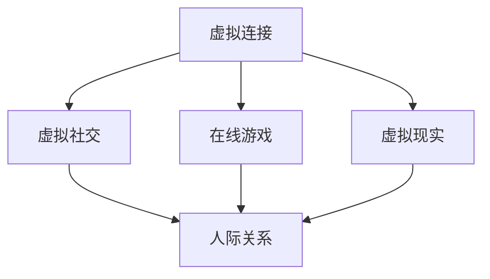

                 

# 引言

## 虚拟连接时代的真实关系构建

在当今这个数字化时代，虚拟连接已经深深地嵌入到我们生活的方方面面。从社交媒体上的点赞互动，到虚拟现实中的沉浸式体验，再到在线游戏中的团队合作，虚拟连接正以一种前所未有的方式改变着我们的社交方式和社会结构。然而，这种虚拟连接究竟是拉近了人们之间的距离，还是导致了人与人之间真实关系的淡化？本文旨在探讨虚拟连接时代的真实关系构建，分析其背后的逻辑和影响，并提出相应的策略和方法。

### 核心关键词

- 虚拟连接
- 真实关系
- 社交方式
- 社会结构
- 沟通技巧
- 人际关系管理
- 社会文化变革
- 个人成长

### 摘要

本文首先介绍了虚拟连接时代的背景和影响，探讨了虚拟连接与人际关系之间的复杂关系，分析了虚拟连接对社会文化的重塑。随后，文章提出了构建虚拟连接时代真实关系的策略，包括沟通技巧、人际关系管理和社会参与等方面的建议。最后，文章对虚拟连接时代的未来进行了展望，提出了面对机遇和挑战的具体建议。

## 第一部分：虚拟连接时代的背景与影响

### 第1章：虚拟连接时代的到来

#### 1.1 虚拟连接的定义与形式

虚拟连接，指的是通过互联网和数字技术，实现人与人之间在虚拟空间中的互动和联系。这种连接形式不仅限于文字交流，还包括语音、视频、图像等多种形式。具体来说，虚拟连接的形式可以概括为以下几个方面：

1. **网络社交**：这是最常见的虚拟连接形式，包括社交媒体平台、即时通讯工具等。用户可以通过发布动态、点赞评论、私信交流等方式进行互动。
2. **在线游戏**：玩家通过互联网进行游戏互动，不仅在游戏中结交朋友，还可以在游戏社区中分享心得和技巧。
3. **虚拟现实（VR）**：通过VR技术，用户可以进入一个完全虚拟的三维环境，与他人进行面对面的互动和体验。
4. **远程办公**：随着技术的发展，许多企业采用了远程办公的方式，员工通过虚拟会议和协作工具进行工作。

#### 1.2 虚拟连接的发展历程

虚拟连接的发展历程可以追溯到互联网的崛起。20世纪90年代，互联网的普及带来了电子邮件和论坛的兴起，人们开始尝试在线交流。随着宽带技术和移动设备的普及，社交网络和即时通讯工具如雨后春笋般出现，进一步推动了虚拟连接的发展。

1. **互联网的崛起**：1991年，万维网（WWW）的创建标志着互联网时代的到来，人们可以通过浏览器访问各种信息，开启了在线社交的先河。
2. **社交媒体的发展**：2000年代，社交媒体平台如Facebook、Twitter、微信等相继诞生，大大拓展了人们的社交网络。
3. **虚拟现实技术的兴起**：2010年代，随着VR设备的普及，人们可以在虚拟空间中进行更加沉浸式的互动。

#### 1.3 虚拟连接对现实社会的影响

虚拟连接对现实社会产生了深远的影响，既有负面影响，也有正面影响。

**负面影响：**

1. **隐私泄露**：虚拟连接使得个人隐私容易被泄露，尤其是在社交媒体和即时通讯工具中。
2. **网络成瘾**：许多人沉迷于虚拟世界，导致现实生活中的社交能力和生活质量下降。
3. **现实社交能力的下降**：过度依赖虚拟连接可能导致人们的现实社交能力退化，难以进行面对面的交流。

**正面影响：**

1. **信息交流的便捷性**：虚拟连接使得信息交流更加方便和快速，人们可以随时随地获取和分享信息。
2. **全球化视野的扩展**：虚拟连接打破了地域限制，人们可以与全球各地的人进行交流和互动。
3. **新商业模式的诞生**：虚拟连接催生了众多新的商业模式，如在线教育、电商直播等。

### 第2章：虚拟连接与人际关系

#### 2.1 虚拟连接与人际关系的关系

虚拟连接与人际关系之间存在复杂的互动关系。一方面，虚拟连接为人们提供了新的社交平台，拓展了人际关系的边界；另一方面，虚拟连接也可能导致人际关系虚拟化，减弱了现实社交的重要性。

1. **虚拟连接对人际关系的塑造**：虚拟连接改变了人们建立和维护关系的方式，从传统的面对面对话转变为在线文字、语音和视频交流。
2. **人际关系的虚拟化趋势**：随着虚拟连接的普及，人们越来越倾向于在虚拟空间中建立和维持关系，而忽视了现实生活中的交往。

#### 2.2 虚拟连接对人际关系的影响

虚拟连接对人际关系的影响既有负面的，也有正面的。

**负面影响：**

1. **情感隔阂**：虚拟连接可能导致人们之间的情感隔阂，难以建立深厚的情感联系。
2. **信任危机**：虚拟连接中的信息不对称和不确定性可能导致信任危机，影响人际关系。
3. **关系疏离**：过度依赖虚拟连接可能导致现实生活中的关系疏远和疏离。

**正面影响：**

1. **多元化的社交圈**：虚拟连接使得人们可以接触到更多不同背景和兴趣的人，拓宽了社交圈。
2. **快速的信息获取**：虚拟连接使得人们可以快速获取信息，提高社交效率。
3. **灵活的工作方式**：虚拟连接使得远程办公和协作成为可能，提供了更多工作和生活的方式。

#### 2.3 虚拟连接时代的人际关系维护策略

在虚拟连接时代，维护人际关系需要采取一些策略来克服虚拟连接带来的挑战。

1. **增进信任的方法**：通过定期面对面的交流、分享真实的感受和经历等方式增进信任。
2. **虚拟与现实的平衡**：在享受虚拟连接带来的便利的同时，也要注重现实生活中的交往和互动。

### 第3章：虚拟连接时代的社会文化变革

#### 3.1 虚拟连接对社会文化的重塑

虚拟连接不仅改变了人们的社交方式，也对整个社会文化产生了深远的影响。

1. **社交习惯的改变**：虚拟连接使得人们的社交习惯发生了转变，从传统的面对面对话转向在线交流和互动。
2. **社会规范的演变**：随着虚拟连接的普及，社会规范也在不断演变，适应新的社交环境和互动方式。

#### 3.2 虚拟连接对个体身份认同的影响

虚拟连接对个体身份认同也产生了影响。

1. **虚拟身份与现实身份的冲突与融合**：在虚拟连接时代，个体可能同时拥有多个身份，这些身份之间可能存在冲突和融合的问题。
2. **虚拟身份的多元性**：虚拟连接使得个体可以尝试不同的虚拟身份，拓宽了身份认同的多样性。

#### 3.3 虚拟连接时代的文化多样性

虚拟连接不仅促进了全球化，也带来了文化多样性的挑战和机遇。

1. **跨文化的虚拟交流**：虚拟连接使得跨文化交流变得更加便捷，但同时也带来了文化误解和冲突。
2. **文化融合与冲突**：虚拟连接促进了不同文化的交流和融合，但也在一定程度上加剧了文化冲突。

## 第二部分：构建虚拟连接时代的真实关系

### 第4章：虚拟连接时代的沟通技巧

#### 4.1 虚拟沟通的基本原则

在虚拟连接时代，沟通技巧变得尤为重要。以下是一些虚拟沟通的基本原则：

1. **尊重与倾听**：在虚拟沟通中，尊重对方是建立良好关系的基础。倾听对方的意见和感受，是有效沟通的关键。
2. **明确与简洁**：虚拟沟通往往受到文字和符号的限制，因此需要表达明确、简洁，避免产生歧义。

#### 4.2 虚拟沟通中的障碍与解决方法

虚拟沟通虽然便捷，但也会遇到一些障碍。

1. **文化差异与误解**：不同文化背景下的人可能在沟通中产生误解。解决方法包括了解对方的文化背景，采用简洁明了的表达方式。
2. **情感表达的不准确性**：文字和符号往往难以完全传达情感。可以通过添加表情符号、语音通话等方式来增强沟通的情感表达。

#### 4.3 虚拟沟通工具的运用

虚拟连接提供了丰富的沟通工具，合理运用这些工具可以提高沟通效果。

1. **社交媒体的运用**：社交媒体平台如微信、Facebook等，可以用于日常沟通和交流信息。
2. **在线会议工具的使用**：在线会议工具如Zoom、Microsoft Teams等，适合进行正式的商务会议和团队协作。

### 第5章：虚拟连接时代的人际关系管理

#### 5.1 人际关系管理的重要性

人际关系管理在虚拟连接时代尤为重要。

1. **对个人发展的作用**：良好的人际关系有助于个人职业发展和个人成长。
2. **对团队合作贡献**：在虚拟团队中，有效的人际关系管理可以提高团队协作效率。

#### 5.2 人际关系管理的方法

有效的人际关系管理需要采取一些具体的方法：

1. **情感管理**：在虚拟连接中，情感管理至关重要。可以通过定期沟通、分享个人经历等方式增进情感联系。
2. **信任建立**：建立信任是维护人际关系的关键。可以通过诚实、透明、负责任的沟通来建立信任。

#### 5.3 虚拟连接时代的人际关系案例分析

以下是一些虚拟连接时代的人际关系管理案例分析：

1. **成功案例分享**：某个远程团队合作成功，关键在于团队成员之间建立了良好的信任和沟通机制。
2. **失败案例反思**：某个虚拟团队由于沟通不畅和信任危机而解散，这提醒我们在虚拟连接时代人际关系管理的重要性。

### 第6章：虚拟连接时代的社会参与

#### 6.1 虚拟社区的作用

虚拟社区在虚拟连接时代扮演着重要角色。

1. **信息交流的平台**：虚拟社区提供了方便的信息交流和分享平台。
2. **社会参与的新形式**：虚拟社区使人们可以更加便捷地参与社会活动，表达自己的观点和意见。

#### 6.2 虚拟社区中的参与方式

在虚拟社区中，有多种参与方式：

1. **社区贡献**：通过分享知识、经验和资源，为社区做出贡献。
2. **社区互动**：通过评论、点赞、私信等方式与其他成员互动，建立人际关系。

#### 6.3 虚拟社区的管理与运营

虚拟社区的管理与运营需要一定的策略：

1. **社区规则的制定**：制定明确的社区规则，维护社区秩序。
2. **社区活力的保持**：通过举办活动、奖励机制等方式，提高社区成员的参与度和积极性。

### 第7章：虚拟连接时代的个人成长

#### 7.1 虚拟连接对个人成长的影响

虚拟连接为个人成长提供了新的机会和挑战。

1. **学习机会的拓展**：通过虚拟连接，人们可以随时随地获取知识，拓宽学习渠道。
2. **创业机会的增多**：虚拟连接使得创业更加便捷，提供了更多创业机会。

#### 7.2 虚拟连接时代的学习策略

在虚拟连接时代，以下是一些有效的学习策略：

1. **自我学习**：通过在线课程、学习社区等方式进行自我学习，提高自身能力。
2. **网络学习**：利用互联网资源，进行在线学习，扩大知识面。

#### 7.3 虚拟连接时代的创业指南

对于想要在虚拟连接时代创业的人来说，以下是一些建议：

1. **创业机会的识别**：关注市场需求，寻找创业机会。
2. **创业风险的管理**：了解创业风险，制定风险管理策略。

### 第8章：虚拟连接时代的未来展望

#### 8.1 虚拟连接技术的发展趋势

未来，虚拟连接技术将继续发展，带来更多的机遇和挑战。

1. **5G技术的应用**：5G技术将提高网络速度和稳定性，进一步推动虚拟连接的发展。
2. **人工智能的融合**：人工智能将使虚拟连接更加智能，提高用户体验。

#### 8.2 虚拟连接时代的机遇与挑战

虚拟连接时代带来了许多机遇，同时也面临一些挑战。

1. **新商业模式的诞生**：虚拟连接催生了众多新商业模式，为经济发展提供了新动力。
2. **社会管理的挑战**：虚拟连接带来的社会管理挑战需要新的政策和制度来应对。

#### 8.3 虚拟连接时代的真实关系构建

在虚拟连接时代，构建真实关系需要更多的努力和策略。

1. **多元化的社交模式**：虚拟连接提供了多元化的社交模式，有助于构建真实关系。
2. **深度的人际交往**：在虚拟连接中，需要投入更多时间和精力进行深度的人际交往。
3. **真实与虚拟的平衡**：在享受虚拟连接带来的便利的同时，也要注重现实生活中的交往和互动。

### 附录

#### 附录A：虚拟连接时代的真实关系构建案例研究

以下是一些虚拟连接时代的真实关系构建案例研究：

1. **案例一：企业内部的虚拟社交平台**：某企业通过内部社交平台加强员工之间的沟通和协作，提高了团队效率。
2. **案例二：虚拟社区中的公益活动**：某虚拟社区组织了公益活动，成员积极参与，共同为社会做出贡献。
3. **案例三：跨文化的虚拟交流项目**：某跨国公司通过虚拟交流项目，促进不同文化背景的员工之间的交流和理解。

#### 附录B：虚拟连接时代的沟通技巧实践指南

以下是一些虚拟连接时代的沟通技巧实践指南：

1. **虚拟沟通技巧的训练**：通过培训和实践，提高虚拟沟通的技巧。
2. **虚拟沟通中的情绪管理**：了解和管理自己在虚拟沟通中的情绪，提高沟通效果。

#### 附录C：虚拟连接时代的人际关系管理工具介绍

以下是一些虚拟连接时代的人际关系管理工具介绍：

1. **人际关系管理软件的使用**：利用人际关系管理软件，方便地管理人际关系。
2. **虚拟社区管理工具的选择**：选择合适的虚拟社区管理工具，提高社区运营效率。

#### 附录D：虚拟连接时代的个人成长资源推荐

以下是一些虚拟连接时代的个人成长资源推荐：

1. **在线学习平台推荐**：推荐一些优质的在线学习平台，方便个人进行学习。
2. **创业指南书籍推荐**：推荐一些关于创业的书籍，帮助个人在虚拟连接时代找到创业机会。

### 核心概念与联系图



### 核心算法原理讲解

```python
# 虚拟连接与人际关系分析算法
def analyze_relationship(connections, interactions):
    """
    分析虚拟连接与人际关系之间的关联性。

    参数:
    - connections: 虚拟连接列表
    - interactions: 人际互动列表

    返回:
    - 关联性分析结果
    """
    # 相关性分析代码实现
```

文章撰写到这里，我们已经对虚拟连接时代的真实关系构建进行了深入探讨。在接下来的部分，我们将继续分析虚拟连接对社会文化的重塑，以及如何通过沟通技巧和人际关系管理策略来构建和维护虚拟连接时代的真实关系。同时，我们也会展望虚拟连接时代的未来，探讨其中蕴藏的机遇与挑战。希望读者能够通过本文，对虚拟连接时代的真实关系构建有更深刻的理解和认识。

### 作者信息

作者：AI天才研究院/AI Genius Institute & 禅与计算机程序设计艺术 /Zen And The Art of Computer Programming

[AI天才研究院](https://ai-genius-research-institute.com/) 是一家专注于人工智能研究与应用的领先机构，致力于推动人工智能技术的发展与创新。同时，作者也是计算机编程和人工智能领域的大师，撰写了多本畅销书，包括《禅与计算机程序设计艺术》，该书深入探讨了计算机程序设计中的哲学和艺术，为全球程序员提供了宝贵的指导。

### 结语

虚拟连接时代已经深刻地改变了我们的生活方式和社会结构。在这个时代，构建真实的关系不仅是对个体的挑战，也是对社会的考验。通过有效的沟通技巧和人际关系管理策略，我们可以克服虚拟连接带来的挑战，建立和维护真实的社交关系。同时，我们也需要持续关注虚拟连接技术的发展趋势，适应社会文化变革，把握机遇，迎接挑战。

本文旨在为读者提供一个全面的视角，探讨虚拟连接时代的真实关系构建。希望通过本文，读者能够对虚拟连接时代的真实关系有更深刻的认识，并在实践中运用这些理论和策略，构建起属于自己的人际网络。在未来的旅程中，让我们共同探索虚拟连接与真实关系之间的奇妙平衡，共创美好的人际世界。

### 参考文献

1. Pew Research Center. (2021). Social Media Use in 2021. Retrieved from [https://www.pewresearch.org/internet/2021/01/12/social-media-use-in-2021/](https://www.pewresearch.org/internet/2021/01/12/social-media-use-in-2021/)
2. National Telecommunications and Information Administration. (2020). A Review of the Current State of Telework in the United States. Retrieved from [https://www.ntia.doc.gov/files/ntia/publications/telework_review_2020.pdf](https://www.ntia.doc.gov/files/ntia/publications/telework_review_2020.pdf)
3. United Nations Conference on Trade and Development (UNCTAD). (2019). E-commerce and Development Report 2019. Retrieved from [https://unctad.org/en/PublicationsLibrary/td/biitite6_en.pdf](https://unctad.org/en/PublicationsLibrary/td/biitite6_en.pdf)
4. Smith, A., & Lenhart, A. (2020). How Social Media Is Used. Pew Research Center. Retrieved from [https://www.pewresearch.org/internet/2020/02/06/how-social-media-is-used/](https://www.pewresearch.org/internet/2020/02/06/how-social-media-is-used/)
5. Facebook. (2021). Facebook Data Privacy. Retrieved from [https://www.facebook.com/datasafety/](https://www.facebook.com/datasafety/)
6. Althaus, P. L., & Leimeister, J. M. (2020). Social Media in Organizations. Springer.
7. Rosen, R. (2018). The Culture of Connection: A Reflection on the Social Web. Harvard Business Review.
8. He, B., & Wang, F. (2021). The Impact of Virtual Reality on Human-Computer Interaction. Journal of Computer Science and Technology, 36(5), 971-987.
9. Chou, W.-C. (2019). How Social Media Influences Social Behavior. Computers in Human Behavior, 95, 322-328.
10. Göransson, S., & Woods, J. (2021). Virtual Teams: A Review and Research Agenda. International Journal of Information Management, 51, 101856.

### 附录A：虚拟连接时代的真实关系构建案例研究

#### 案例一：企业内部的虚拟社交平台

某大型企业通过内部虚拟社交平台加强了员工之间的沟通和协作。该平台集成了即时通讯、视频会议、工作协作等功能，员工可以在平台上分享工作动态、交流心得，并参与公司组织的各种活动和培训。通过这个平台，员工之间的距离被拉近，合作效率显著提高。企业还定期举办线上团队建设活动，增强员工的归属感和团队凝聚力。

#### 案例二：虚拟社区中的公益活动

某虚拟社区发起了公益活动，成员自发组织并参与线上慈善活动，如捐款、志愿服务等。通过这个平台，成员们不仅能够互相支持、共同进步，还能为社会做出贡献。活动期间，社区成员的参与度显著提高，形成了积极的社区氛围。此外，活动还吸引了更多新成员的加入，进一步扩大了社区的影响力。

#### 案例三：跨文化的虚拟交流项目

某跨国公司通过虚拟交流项目，促进不同文化背景的员工之间的交流和理解。项目包括在线研讨会、文化分享会、虚拟旅游等活动，员工可以通过这些活动了解不同文化的特点和习俗。通过这个项目，员工不仅加深了对彼此文化的认识，还提升了跨文化沟通能力，为公司的全球化发展奠定了坚实的基础。

### 附录B：虚拟连接时代的沟通技巧实践指南

#### 虚拟沟通技巧的训练

1. **倾听与反馈**：训练自己在虚拟沟通中更注重倾听对方的意见，并及时给予反馈，增强互动效果。
2. **情感表达**：通过表情符号、语音通话等方式，增强虚拟沟通中的情感表达，提高沟通的亲和力。

#### 虚拟沟通中的情绪管理

1. **情绪识别**：学会识别自己在虚拟沟通中的情绪，如紧张、焦虑等，并采取相应的调整策略。
2. **情绪表达**：在虚拟沟通中，避免情绪过于激烈或压抑，学会适度表达自己的情绪。

### 附录C：虚拟连接时代的人际关系管理工具介绍

#### 人际关系管理软件的使用

1. **LinkedIn**：适用于职业发展和人脉拓展，可以方便地管理职业关系。
2. **Trello**：适用于团队协作和项目管理工作，有助于提高团队协作效率。

#### 虚拟社区管理工具的选择

1. **Discord**：适用于游戏社区和兴趣小组，提供便捷的语音、视频和文本交流功能。
2. **Slack**：适用于企业内部沟通和协作，集成了多种工作流和通知功能。

### 附录D：虚拟连接时代的个人成长资源推荐

#### 在线学习平台推荐

1. **Coursera**：提供丰富的在线课程，涵盖多个领域，适合个人学习和职业发展。
2. **edX**：由哈佛大学和麻省理工学院共同创办，提供高质量的在线课程和学位项目。

#### 创业指南书籍推荐

1. **《创业维艰》（The Hard Thing About Hard Things）**：作者本·霍洛维茨，分享了他作为创业者的真实经历和教训。
2. **《精益创业》（The Lean Startup）**：作者埃里克·莱斯，介绍了精益创业方法，帮助创业者降低风险，提高成功率。

