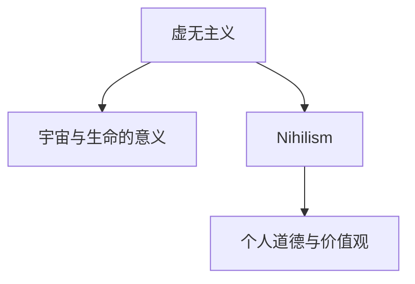

                 

## 《虚无主义与nihilism的心理学解析》

### 关键词

- 虚无主义
- Nihilism
- 心理学
- 心理机制
- 心理影响
- 应对策略

### 摘要

本文旨在探讨虚无主义与nihilism的心理学本质及其对个体和社会的深远影响。通过对这两种哲学观点的基本概念、心理机制、心理影响的深入分析，文章提出了心理学应对虚无主义与nihilism的具体策略。同时，结合真实案例研究，本文揭示了虚无主义与nihilism的心理历程及其具体影响，为相关领域的研究和实践提供了有价值的参考。

## 第1章：虚无主义与nihilism的基本概念

### 1.1 虚无主义的历史起源与哲学背景

虚无主义（Nihilism）作为一种哲学观点，起源于19世纪的西方哲学。它反对传统价值观念，主张宇宙和生命缺乏固有意义。虚无主义的起源可以追溯到德国哲学家尼采（Friedrich Nietzsche）的作品，尤其是其关于“上帝已死”和“超人”的概念。尼采认为，在上帝死亡之后，人类失去了信仰和道德的基础，从而陷入了虚无主义的深渊。

虚无主义在西方哲学史上具有重要地位，它不仅挑战了传统的宗教和道德观念，还引发了深刻的哲学思考和道德反思。虚无主义的兴起与19世纪末20世纪初的社会动荡和思想变革密切相关。在那个时代，科学和技术的迅速发展使得人们对宗教和传统的信仰产生了怀疑，虚无主义成为了一种普遍的哲学情绪。

### 1.2 Nihilism的概念与哲学内涵

Nihilism（虚无主义）在哲学上通常被定义为一种否定所有形而上价值的存在论立场。它认为宇宙和生命本身没有固有的意义或目的，一切都是毫无意义的随机事件。Nihilism的核心思想是，如果不存在超自然的神或宇宙设计者，那么人类创造的价值和意义都是主观的，甚至是虚幻的。

Nihilism与虚无主义在概念上有着紧密的联系。两者都否认宇宙和生命的固有意义，但nihilism更侧重于个人层面的道德和价值观的崩溃。虚无主义通常被视为一种哲学观点，而nihilism则可能表现为个体的心理状态或生活方式。

### 1.3 虚无主义与nihilism的比较与联系

虚无主义和nihilism在概念上有所不同，但它们之间也存在联系。虚无主义主要关注宇宙和生命的意义问题，而nihilism则侧重于个人层面的道德和价值观。虚无主义是一种哲学观点，它挑战了传统的宗教和道德观念，而nihilism则可能表现为个体的心理状态或生活方式。

为了更清晰地理解两者的关系，我们可以使用Mermaid流程图展示虚无主义与nihilism的概念架构：



在这个流程图中，虚无主义关注的是宇宙与生命的意义问题，而nihilism则专注于个人道德和价值观的崩溃。尽管两者在关注点上有所不同，但它们都涉及到人类存在的本质问题，因此它们之间存在紧密的联系。

## 第2章：虚无主义与nihilism的心理机制

### 2.1 虚无主义与nihilism的心理特征

虚无主义和nihilism在个体的心理特征上表现出一些共同点和差异。共同点在于，这两种哲学观点都会导致个体对生活失去兴趣、感到绝望和孤独。这种心理状态可能表现为：

- 情绪低落：长期感到悲伤、无助和绝望。
- 社交回避：避免与他人交往，感到与他人之间的距离和疏远。
- 自我怀疑：对自我价值产生怀疑，感到自己的存在没有意义。

然而，虚无主义和nihilism在心理特征上也有所不同。虚无主义可能更多地表现为对整个宇宙和生命意义的怀疑，而nihilism则可能更多地关注个人道德和价值观的崩溃。

### 2.2 虚无主义与nihilism的心理反应

虚无主义和nihilism会对个体的心理反应产生深远影响。这些心理反应可能包括：

- 应激反应：面对生活中的挑战和困难时，个体可能会感到无法应对，从而产生应激反应。
- 情绪反应：虚无主义和nihilism可能导致个体产生持续的情绪低落和绝望感。
- 行为反应：个体可能会采取逃避现实的行为，如过度饮酒、吸毒或自残。

这些心理反应不仅会影响个体的心理健康，还可能导致一系列负面后果，如抑郁症、焦虑症等。

### 2.3 心理机制的理论解释

虚无主义和nihilism的心理机制可以从多个心理学理论进行解释。以下是一些常见的理论：

- **心理动力学理论**：心理动力学理论认为，个体的内心冲突和心理创伤是导致虚无主义和nihilism的原因。例如，童年时期的创伤可能会导致个体对生活产生消极的看法。
- **认知行为理论**：认知行为理论认为，个体的认知方式和行为模式是影响虚无主义和nihil主义的关键因素。例如，过度悲观和消极的认知方式可能会导致个体产生虚无主义和nihil主义的信念。
- **社会文化理论**：社会文化理论认为，社会环境和文化背景对个体的虚无主义和nihil主义信念产生重要影响。例如，社会动荡和文化变迁可能会导致个体对生活产生消极的看法。

通过这些理论，我们可以更好地理解虚无主义和nihilism的心理机制，为应对这些问题提供有效的心理干预策略。

## 第3章：虚无主义与nihilism的心理影响

### 3.1 对个人生活的影响

虚无主义和nihilism对个人生活的影响是深远且复杂的。首先，这两种哲学观点可能导致个体对生活失去兴趣，产生持续的情绪低落和绝望感。这种情绪状态可能影响个体的日常生活，如工作、学习和人际关系。

- 失去兴趣：个体可能会对曾经感兴趣的事物和活动失去热情，感觉一切都没有意义。
- 情绪低落：长期的绝望感和无助感可能导致抑郁症等心理障碍。
- 人际关系破裂：由于情绪低落和自我怀疑，个体可能会避免与他人交往，导致人际关系的破裂。

### 3.2 对社会关系的影响

虚无主义和nihilism不仅影响个人生活，还可能对社会关系产生负面影响。首先，这些哲学观点可能导致个体对社会的信任感降低，影响社会凝聚力。

- 社会信任缺失：个体可能会怀疑他人的动机和价值观，导致社会信任的瓦解。
- 社会伦理的瓦解：虚无主义和nihilism可能导致传统社会伦理的崩溃，影响社会的道德规范。
- 社会问题的加剧：社会动荡和道德崩溃可能导致一系列社会问题的加剧，如犯罪率上升、社会不稳定等。

### 3.3 对心理健康的影响

虚无主义和nihilism对心理健康的影响是显而易见的。这些哲学观点可能导致个体产生严重的心理问题，如抑郁症、焦虑症等。

- 心理健康的危机：虚无主义和nihilism可能导致个体对生活失去希望，产生自杀倾向。
- 精神疾病的增加：长期的绝望感和情绪低落可能导致精神疾病的增加，如抑郁症、焦虑症、精神分裂症等。
- 心理治疗的需求：面对虚无主义和nihilism的心理影响，个体可能需要寻求专业的心理治疗和支持。

## 第4章：心理学对虚无主义与nihilism的应对策略

### 4.1 心理治疗的理论与实践

心理学为应对虚无主义和nihilism提供了多种心理治疗理论和方法。以下是一些常见的方法：

- **认知行为疗法（CBT）**：认知行为疗法是一种以改变消极思维和行为模式为目标的心理治疗方法。通过识别和挑战消极思维，个体可以改变对生活和世界的看法，从而减轻虚无主义和nihil主义的影响。

  ```python
  # 示例：CBT中的思维重构
  original_thought = "我的生活毫无意义。"
  alternative_thought = "尽管生活中有许多挑战，但我可以通过积极的方式找到生活的意义。"
  ```

- **存在主义疗法**：存在主义疗法关注个体的自由、选择和存在意义。通过探讨个体的存在意义和生命目标，个体可以找到对抗虚无主义和nihil主义的动力。

  ```python
  # 示例：存在主义疗法中的自我探索
  self_explore = "我为什么存在？我存在的意义是什么？"
  ```

- **心理动力学疗法**：心理动力学疗法通过探索个体的内心冲突和心理创伤来治疗虚无主义和nihil主义。通过解决内心的冲突和创伤，个体可以减轻虚无主义和nihil主义的影响。

  ```python
  # 示例：心理动力学疗法中的情感探索
  emotional_explore = "我为什么感到绝望和无助？"
  ```

### 4.2 心理干预的方法与技术

在心理干预方面，心理学提供了一系列方法和技术，以帮助个体应对虚无主义和nihil主义的影响。

- **认知重构技术**：认知重构技术通过改变个体的思维方式来减轻消极情绪。这种方法通常包括识别和挑战消极思维，并引入积极的替代思维。

  ```python
  # 示例：认知重构技术
  negative_thought = "我无法应对生活中的挑战。"
  positive_thought = "我可以通过学习和成长来应对生活中的挑战。"
  ```

- **情感调节技术**：情感调节技术通过帮助个体识别和表达情绪，以及学会应对和处理负面情绪。这种方法包括情绪识别、情绪表达和情绪应对策略。

  ```python
  # 示例：情感调节技术
  emotion_identification = "我现在感到很沮丧。"
  emotion_expression = "我选择找一个朋友谈谈我的感受。"
  emotion_management = "我决定通过运动来缓解我的沮丧情绪。"
  ```

- **行为激活技术**：行为激活技术通过鼓励个体参与积极的活动来改善情绪和心理健康。这种方法包括设定目标、参与活动和评估进展。

  ```python
  # 示例：行为激活技术
  goal_setting = "我决定每天锻炼30分钟。"
  activity_participation = "我选择每天早上跑步。"
  progress_evaluation = "我每周评估我的锻炼进度。"
  ```

### 4.3 社会支持系统的建立

除了心理治疗和心理干预，社会支持系统也在应对虚无主义和nihil主义中发挥着重要作用。

- **家庭支持**：家庭是提供支持的重要来源。家庭成员可以通过提供情感支持、理解和支持个体的努力来帮助个体应对虚无主义和nihil主义。

- **社区支持**：社区可以提供社交机会、资源和信息，帮助个体建立社交网络。社区支持可以包括志愿者活动、社区中心、互助小组等。

- **社会政策支持**：社会政策可以提供经济援助、心理健康服务和教育机会，帮助个体应对虚无主义和nihil主义。这些政策可以包括社会福利计划、心理健康治疗、教育支持等。

通过建立有效的社会支持系统，个体可以获得多方面的支持，从而更好地应对虚无主义和nihil主义的影响。

## 第5章：案例研究：虚无主义与nihilism的真实故事

### 5.1 著名虚无主义者的心理历程

虚无主义在历史上产生了许多著名人物，他们的心理历程为我们理解虚无主义的心理影响提供了宝贵的案例。以下是一些著名虚无主义者的心理历程：

- **尼采（Friedrich Nietzsche）**：尼采是虚无主义的代表人物之一。他的作品《查拉图斯特拉如是说》中充满了对上帝、道德和人类存在的批判。尼采在晚年经历了精神崩溃，他可能经历了严重的心理痛苦和虚无主义的冲击。

- **弗朗茨·卡夫卡（Franz Kafka）**：卡夫卡的作品充满了对现实和存在的怀疑，他的许多作品都反映了虚无主义的思想。卡夫卡的生活和作品都反映了他对生命意义的深刻质疑。

- **阿尔贝·加斯贝里（Albert Camus）**：加斯贝里是20世纪著名的哲学家和作家，他的作品《西西弗斯的神话》探讨了人类在无意义的世界中的存在意义。加斯贝里本人也经历了对生命意义的探索和挣扎。

这些著名虚无主义者的心理历程反映了虚无主义对个体心理的深刻影响，他们中的许多人经历了心理痛苦和绝望，同时也展现了人类在寻找生命意义的过程中所经历的挣扎和探索。

### 5.2 Nihilism对个体的具体影响

虚无主义和nihilism对个体的影响是复杂且多方面的。以下是一些具体的影响：

- **情绪低落和绝望**：虚无主义和nihilism可能导致个体感到情绪低落和绝望。这种情绪状态可能会影响个体的日常生活，使其对工作和社交活动失去兴趣。

- **自我怀疑和自我否定**：虚无主义和nihil主义可能导致个体对自己的价值和存在产生怀疑。这种自我否定可能会影响个体的自尊和自信，导致自我价值的崩溃。

- **行为极端化**：在某些情况下，虚无主义和nihil主义可能导致个体采取极端行为，如自杀、自残或犯罪行为。这些行为可能是对虚无主义和nihil主义情绪的极端表达。

### 5.3 成功应对虚无主义与nihilism的案例

尽管虚无主义和nihilism可能导致严重的心理痛苦，但也有一些成功的案例展示了个体如何应对这些哲学观点带来的挑战。

- **保罗·柯艾略（Paulo Coelho）**：柯艾略是一位著名的巴西作家，他的作品《牧羊少年的奇幻之旅》探讨了生命意义和梦想的主题。尽管柯艾略本人也经历了心理痛苦和虚无主义的困扰，但他通过写作和探索生命的意义，最终找到了自己的使命和目标。

- **马克·吐温（Mark Twain）**：吐温是一位著名的美国作家，他的作品充满了对生命和人性的深刻洞察。尽管吐温在生活中经历了许多挑战和失望，但他通过幽默和智慧的方式，成功地应对了虚无主义和nihil主义的冲击。

这些案例展示了个体如何通过积极的方式应对虚无主义和nihil主义，找到生命的意义和价值。

## 第6章：虚无主义与nihilism的未来趋势

### 6.1 当代社会虚无主义与nihilism的流行趋势

在当代社会，虚无主义和nihilism仍然存在，并且呈现出一些新的流行趋势。首先，社交媒体和互联网的普及使得虚无主义和nihil主义的思想更容易传播。人们通过社交媒体平台分享对生活意义和存在的怀疑，形成了一种新的虚无主义亚文化。

此外，经济不稳定、政治动荡和文化变革也加剧了虚无主义和nihil主义的流行。在许多国家，年轻人感到自己的未来不确定，从而产生了对生活意义的怀疑。

### 6.2 心理学领域的最新研究成果

在心理学领域，对虚无主义和nihilism的研究正在不断深入。最新的研究成果包括：

- **认知行为疗法（CBT）**：认知行为疗法在应对虚无主义和nihil主义方面取得了显著成效。通过改变个体的消极思维模式，CBT帮助个体找到了对抗虚无主义和nihil主义的方法。

- **存在主义疗法**：存在主义疗法通过探讨个体的自由和选择，帮助个体找到了生命的意义。这种方法强调个体的自主性和责任感，为应对虚无主义和nihil主义提供了新的视角。

### 6.3 未来可能的心理学应对策略

未来，心理学领域可能会采取以下策略来应对虚无主义和nihil主义：

- **综合治疗**：结合认知行为疗法、存在主义疗法和其他心理治疗方法，为个体提供更全面的支持。
- **社会干预**：通过社区支持和社会政策，为个体提供更广泛的社会支持，帮助他们应对虚无主义和nihil主义的影响。
- **跨学科研究**：心理学与其他学科（如哲学、社会学、神经科学）的合作，将有助于更全面地理解虚无主义和nihil主义的本质，从而开发出更有效的应对策略。

通过这些策略，心理学可以为应对虚无主义和nihil主义提供更有效的支持，帮助个体找到生命的意义和价值。

## 第7章：结论与展望

### 7.1 对虚无主义与nihilism的总体认知

虚无主义和nihilism是哲学上重要的观点，它们挑战了传统的宗教和道德观念，对个体和社会产生了深远影响。通过本文的分析，我们认识到虚无主义和nihilism不仅涉及哲学问题，还与个体的心理状态和社会关系密切相关。

### 7.2 心理学研究的方向与挑战

心理学在应对虚无主义和nihil主义方面具有重要作用。未来的研究方向包括：

- **跨学科合作**：通过与其他学科（如哲学、社会学、神经科学）的合作，心理学可以更全面地理解虚无主义和nihil主义的本质。
- **综合治疗方法**：开发更有效的综合治疗方法，结合认知行为疗法、存在主义疗法和其他心理治疗方法，为个体提供更全面的支持。
- **社会支持系统**：建立更完善的社会支持系统，通过社区支持和社会政策，为个体提供更广泛的支持。

### 7.3 提出未来研究建议

为了更好地应对虚无主义和nihil主义，我们提出以下未来研究建议：

- **实证研究**：进行更多的实证研究，以验证不同治疗方法的有效性，并探索新的干预策略。
- **长期跟踪研究**：对长期跟踪研究，以了解虚无主义和nihil主义对个体生活的影响，以及不同干预策略的长期效果。
- **跨文化研究**：进行跨文化研究，以了解不同文化背景下虚无主义和nihil主义的特点和影响，从而开发出更具文化敏感性的干预策略。

通过这些研究，心理学可以为应对虚无主义和nihil主义提供更科学的指导和支持，帮助个体找到生命的意义和价值。**作者：AI天才研究院/AI Genius Institute & 禅与计算机程序设计艺术 /Zen And The Art of Computer Programming**

