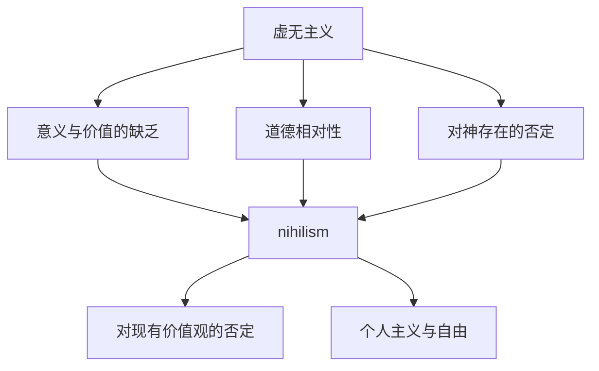
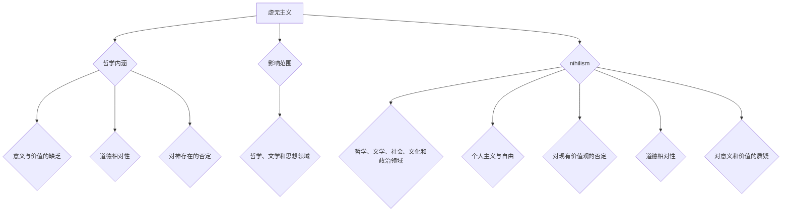
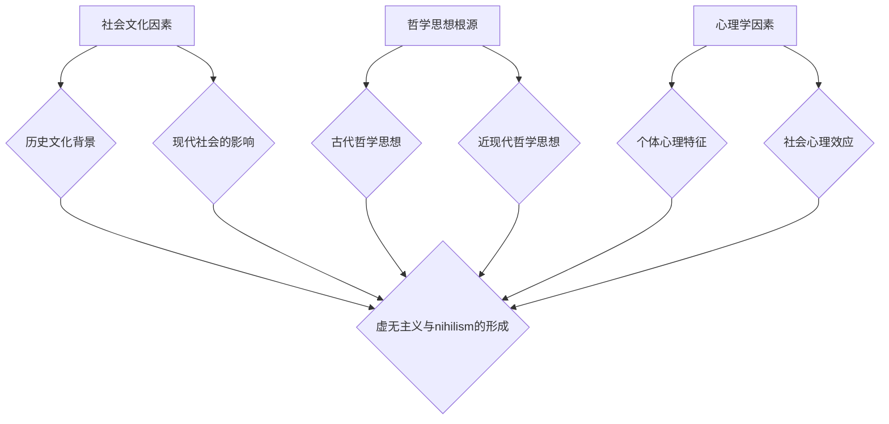
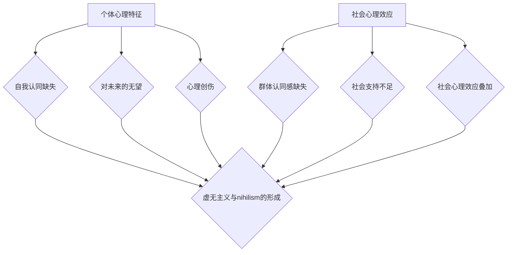

                 

### 引言

在当今社会，虚无主义与nihilism这两个哲学概念引起了广泛的关注和讨论。虚无主义（Nihilism）是一种哲学立场，认为生活没有固有的意义、目的或内在价值。nihilism则是一个更广泛的概念，不仅涵盖哲学上的虚无主义，还包括对道德、宗教和社会制度的否定。这两种观念在现代社会中的影响深远，引发了关于人生意义、价值观和生活方式的深刻思考。

本篇文章旨在深入探究虚无主义与nihilism的心理根源，分析其背后的复杂因素，并探讨其对个体和社会的影响。文章将分为以下几个部分：

1. **虚无主义与nihilism的基本概念**：介绍虚无主义和nihilism的起源、发展及其核心观点。
2. **虚无主义与nihilism的心理根源**：探讨社会文化、哲学思想和心理学因素在虚无主义与nihilism形成中的作用。
3. **虚无主义与nihilism的影响与应对**：分析虚无主义与nihilism对个体生活和社会的影响，并提出应对策略。

通过这一步一步的深入分析，本文希望能够帮助读者更好地理解虚无主义与nihilism的本质，从而为其在现实生活中的应用提供有益的参考。

### 关键词

- 虚无主义
- Nihilism
- 心理根源
- 社会文化
- 哲学思想
- 心理学因素
- 人生意义
- 价值观
- 社会影响
- 应对策略

### 摘要

本文通过对虚无主义与nihilism的深入探讨，分析了这两个哲学概念的基本概念、心理根源及其对个体和社会的影响。文章首先介绍了虚无主义与nihilism的起源与发展，揭示了它们在哲学中的核心观点。接着，文章探讨了社会文化、哲学思想和心理学因素在虚无主义与nihilism形成中的作用，包括历史文化背景、现代科技发展、哲学思想演变和个体心理特征。随后，文章分析了虚无主义与nihilism对个体生活和社会的影响，包括心理健康问题、社交关系问题以及社会文化的影响。最后，文章提出了应对虚无主义与nihil主义的策略，包括心理干预、教育引导和文化建设。本文旨在帮助读者更好地理解虚无主义与nihilism的本质，为其在现实生活中的应对提供有益的参考。

----------------------------------------------------------------

### 背景介绍

虚无主义（Nihilism）和nihilism这两个概念在哲学史上有着悠久的传统，尽管它们的具体含义在不同的历史时期和文化背景下有所变化。虚无主义的根源可以追溯到古希腊哲学，当时的哲学家们开始质疑生活的意义和价值。例如，第欧根尼·拉尔修在《名哲言行录》中记录了普罗塔戈拉的一句话：“人是万物的尺度，是存在的尺度，也是不存在的尺度。”这一观点暗示了对于存在和意义的相对性认识，为后来的虚无主义思想奠定了基础。

在中世纪，基督教神学与古希腊哲学的融合使得虚无主义的观念逐渐淡出主流哲学讨论。然而，随着启蒙运动的到来，人们对宗教和权威的质疑日益增强，虚无主义重新成为一个重要的哲学议题。特别是18世纪的德国哲学家弗里德里希·尼采（Friedrich Nietzsche），他的思想对虚无主义的发展产生了深远的影响。尼采提出了“上帝已死”的口号，揭示了现代社会的无神论倾向，并认为虚无主义是对上帝存在的否定和对生命意义的质疑。

进入19世纪和20世纪，虚无主义继续在哲学、文学和艺术领域内发酵。俄国作家陀思妥耶夫斯基（Fyodor Dostoevsky）在其作品中深入探讨了虚无主义的主题，尤其是《罪与罚》中的主人公拉斯科尔尼科夫的思想变化。陀思妥耶夫斯基认为，虚无主义是一种极端的道德危机，它挑战了人类的基本信仰和价值体系。

此外，现代社会的科技发展、经济变革和全球化进程也对虚无主义的形成产生了重要影响。随着科技的进步，人们对自然和宇宙的理解发生了革命性的变化，传统宗教和哲学观念受到挑战。同时，经济的不稳定性和社会的快速变化使得许多人感到生活的无意义和不确定。这些因素共同导致了虚无主义在现代社会中的流行。

总的来说，虚无主义和nihilism的背景可以从历史、哲学、文学和现代社会等多个角度来探讨。它们不仅反映了人类对存在和意义的探究，也是对现代生活困境的一种回应。本文将深入分析这些背景因素，以揭示虚无主义与nihilism的心理根源。

### 核心概念与联系

虚无主义（Nihilism）和nihilism这两个概念虽然在字面上非常相似，但在哲学内涵上有着明显的区别。首先，虚无主义通常指的是一种哲学立场，认为生活缺乏固有的意义、目的或内在价值。这种观念源于对宗教信仰、道德规范和社会制度的质疑或否定。具体来说，虚无主义的核心观点可以概括为以下几点：

1. **意义与价值的缺乏**：虚无主义认为，宇宙和人生缺乏内在的意义和价值，一切都是偶然和无意义的。
2. **道德的相对性**：虚无主义质疑传统道德观念的绝对性，认为道德规范是社会或个人主观构建的，没有客观的基础。
3. **对神的存在和作用的否定**：许多虚无主义者认为，神的存在是不必要的，甚至是有害的，因为它提供了虚假的希望和安慰。

相比之下，nihilism是一个更为广泛的概念，它不仅包括哲学上的虚无主义，还涵盖了在道德、宗教和社会制度方面的否定态度。nihilism的核心观点可以概括为：

1. **对现有价值观的否定**：nihilism否定现有的道德、宗教和社会制度，认为它们都是无意义的或有害的。
2. **个人主义和自由**：nihilism通常与个人主义和自由主义相关联，主张个人应该自由地追求自己的目标，不受传统价值观的束缚。

虚无主义与nihilism之间的联系主要体现在以下几个方面：

1. **共同起源**：虚无主义和nihilism都源于对传统价值观的质疑和否定。这种质疑通常与启蒙运动、工业革命和现代科技的发展密切相关。
2. **哲学影响**：虚无主义和nihilism都受到哲学家如尼采、叔本华和陀思妥耶夫斯基等人的影响。这些哲学家探讨了人类存在的本质，提出了对传统观念的挑战。
3. **社会影响**：虚无主义和nihilism都对社会产生了深远的影响，特别是在道德、宗教和社会制度方面。它们挑战了传统价值体系，推动了现代社会的思想变革。

然而，虚无主义与nihilism也存在显著的区别。虚无主义通常是一个更为理论化和哲学化的概念，它强调对意义和价值缺乏的哲学探讨。而nihilism则更为实用和行动导向，它不仅质疑传统价值观，还提倡个人自由和个人主义的实现。

为了更直观地展示虚无主义与nihilism之间的核心概念和联系，我们可以使用Mermaid流程图来描述它们的基本架构：

在这个流程图中，虚无主义通过几个关键概念（意义与价值的缺乏、道德相对性、对神存在的否定）与nihilism相连。这些概念共同构成了虚无主义和nihilism的核心思想，并解释了它们在哲学和社会中的重要性。通过这一流程图，读者可以更好地理解虚无主义与nihilism之间的复杂关系及其核心概念。

### 虚无主义的起源与发展

虚无主义（Nihilism）作为一种哲学观念，其起源可以追溯到古希腊哲学。在古希腊时期，虚无主义的萌芽可以在普罗塔戈拉（Protagoras）的哲学思想中找到。普罗塔戈拉提出了“人是万物的尺度”这一观点，这意味着真理和存在都是相对的，没有绝对的客观标准。这一观点挑战了当时普遍接受的客观主义和绝对真理的观点，为后来的虚无主义思想奠定了基础。

随着时间的推移，虚无主义在中世纪哲学中逐渐淡出，但到了18世纪的启蒙运动时期，虚无主义重新成为一个重要的哲学议题。德国哲学家弗里德里希·尼采（Friedrich Nietzsche）是虚无主义在现代哲学中的主要代表。尼采的哲学观念中充满了对传统道德、宗教和文化的质疑，他提出了“上帝已死”的观点，揭示了现代社会中的无神论倾向。尼采认为，虚无主义是对上帝存在的否定，也是对生命意义的质疑。

尼采的虚无主义观念在19世纪末和20世纪初的哲学和文学领域产生了深远的影响。例如，俄国作家陀思妥耶夫斯基（Fyodor Dostoevsky）在其作品中深入探讨了虚无主义的主题。特别是他的代表作《罪与罚》，通过主人公拉斯科尔尼科夫的思想变化，展示了虚无主义引发的道德危机。陀思妥耶夫斯基认为，虚无主义不仅是一种哲学观念，也是一种深刻的道德困境，它挑战了人类的基本信仰和价值体系。

20世纪以来，虚无主义继续在哲学、文学和艺术领域内发酵。哲学家如马丁·海德格尔（Martin Heidegger）和米歇尔·福柯（Michel Foucault）等人对虚无主义进行了深刻的探讨。海德格尔认为，虚无主义是现代存在主义的核心问题，它涉及到人类存在的本质和意义。福柯则从历史和文化的角度分析了虚无主义在现代社会的表现。

在文学领域，虚无主义主题在许多作品中得到体现。例如，卡夫卡（Franz Kafka）的小说中充满了对生活意义的质疑和探索，他的作品《变形记》和《审判》展示了主人公在虚无主义困境中的挣扎。同样，詹姆斯·乔伊斯（James Joyce）的《尤利西斯》和弗吉尼亚·伍尔夫（Virginia Woolf）的《到灯塔去》等作品也反映了虚无主义的主题。

虚无主义不仅在哲学和文学领域产生影响，还在现代社会的思想和文化中占有重要地位。随着科技的进步和社会的变迁，人们对传统价值观的质疑日益增强。虚无主义提供了一种对现代生活困境的回应，它挑战了现有的道德、宗教和社会制度，推动了现代思想的变革。

总的来说，虚无主义作为一种哲学观念，经历了从古希腊哲学的萌芽到现代哲学的深入探讨的发展历程。它不仅反映了人类对存在和意义的探究，也揭示了现代社会中的思想困境。通过对虚无主义起源与发展的探讨，我们可以更好地理解其哲学内涵和现实影响。

### Nihilism的概念与特点

nihilism是一个源自拉丁语“nihil”，意为“无物”的哲学概念。它不仅仅局限于对生活意义和价值缺乏的哲学探讨，还涵盖了在道德、宗教和社会制度方面的否定态度。以下是nihilism的主要特点：

1. **对现有价值观的否定**：nihilism质疑并否定现有的道德、宗教和社会制度，认为它们都是无意义的或有害的。这种否定态度通常基于对传统权威的质疑，以及对现实社会中不公平和不道德现象的批判。

2. **个人主义和自由**：nihilism强调个人主义和自由，主张个人应该自由地追求自己的目标和价值观，不受传统价值观的束缚。这种个人主义通常表现为对个人权利和自由的极端追求，以及对集体主义和社会规范的质疑。

3. **对意义和价值的质疑**：nihilism认为生活缺乏固有的意义和价值，一切都是偶然和无意义的。这种观念通常与对宗教信仰和道德规范的否定相关，导致了人们对生命意义的深刻质疑。

4. **道德相对性**：nihilism认为道德规范是主观的、相对的，没有客观的基础。因此，它质疑传统道德观念的绝对性，认为道德规范是社会或个人主观构建的。

5. **反叛和颠覆**：nihilism常常表现为对现有社会秩序和制度的反叛和颠覆。这种反叛和颠覆不仅是思想上的，也可能是行动上的，表现为对传统权威和社会规范的挑战。

6. **文化叛逆**：nihilism在文学、艺术和思想文化领域中也得到了广泛体现。许多文学和艺术作品反映了nihilism的主题，如对生活意义的质疑、对传统的反叛以及对个人自由的追求。

nihilism的形成通常受到多种因素的影响，包括哲学思想、社会文化背景、历史事件和个体心理状态。例如，19世纪的欧洲经历了一系列社会动荡和历史事件，如工业革命、世界大战和科技进步，这些事件对人们的价值观和世界观产生了深远影响。同时，哲学家如尼采和陀思妥耶夫斯基等人的思想对nihilism的形成和发展也产生了重要影响。

在现代社会，nihilism的影响仍然显著。随着全球化进程的加快和社会变革的加剧，人们对传统价值观的质疑日益增强。科技的发展和经济的不稳定性也加剧了人们对生活意义的困惑。nihilism提供了一种对现代生活困境的回应，它挑战了现有的道德、宗教和社会制度，推动了现代思想的变革。

总的来说，nihilism是一个复杂的哲学概念，它不仅仅是对生活意义和价值缺乏的哲学探讨，还包括对道德、宗教和社会制度的否定态度。通过对nihilism的概念与特点的分析，我们可以更好地理解其在哲学和现代社会中的重要性。

### 虚无主义与nihilism的异同

虚无主义（Nihilism）和nihilism虽然同根同源，但它们在哲学内涵和应用范围上存在显著差异。以下是两者之间的主要异同点：

**1. 定义范围**：

- **虚无主义**：虚无主义通常指一种哲学立场，认为生活缺乏固有的意义、目的或内在价值。它强调对传统价值观和道德规范的质疑，尤其是对宗教和绝对真理的否定。

- **nihilism**：nihilism是一个更广泛的概念，不仅包括哲学上的虚无主义，还包括对道德、宗教和社会制度的否定态度。它强调个人主义和自由，主张个人应该自由地追求自己的目标和价值观。

**2. 哲学内涵**：

- **虚无主义**：虚无主义的核心观点是意义与价值的缺乏、道德相对性以及对神存在的否定。它通常表现为对传统哲学和宗教观念的质疑，以及对现代社会中不合理和不公平现象的批判。

- **nihilism**：nihilism强调对现有价值观的否定、个人主义和自由、对意义和价值的质疑，以及道德相对性。它不仅质疑传统道德规范，还提倡个人自由和个人主义的实现。

**3. 影响范围**：

- **虚无主义**：虚无主义主要影响哲学、文学和思想领域，它是对传统价值观和道德规范的哲学反思。虚无主义在文学作品中得到了广泛体现，如陀思妥耶夫斯基的小说《罪与罚》。

- **nihilism**：nihilism的影响更为广泛，不仅限于哲学和文学，还渗透到社会、文化和政治领域。它对现代社会的道德、宗教和社会制度提出了挑战，并在思想文化领域内产生了深远影响。

**4. 对比分析**：

- **共同点**：虚无主义和nihilism都源于对传统价值观的质疑和否定，强调对意义和价值缺乏的哲学探讨。它们都涉及到对神的存在和作用的否定，以及对道德规范的质疑。

- **不同点**：虚无主义更强调哲学上的探讨，关注对传统哲学和宗教观念的质疑；而nihilism则更强调实用和行动，主张个人自由和个人主义的实现。虚无主义通常表现为对意义和价值缺乏的哲学反思，而nihilism则更多地体现在对社会、文化和政治领域的挑战。

为了更直观地展示虚无主义与nihilism之间的异同，我们可以使用Mermaid流程图来描述它们的核心观点和影响范围：

在这个流程图中，虚无主义和nihilism通过不同的核心观点和影响范围相连。虚无主义的核心观点包括意义与价值的缺乏、道德相对性以及对神存在的否定，其影响范围主要在哲学、文学和思想领域。相比之下，nihilism的核心观点更加广泛，包括个人主义与自由、对现有价值观的否定以及对意义和价值的质疑，其影响范围也更为广泛，包括哲学、文学、社会、文化和政治领域。

通过这一对比分析，我们可以更清晰地理解虚无主义与nihilism之间的异同，以及它们在哲学和社会中的重要性。

### 虚无主义与nihilism的心理根源

虚无主义与nihilism的心理根源是一个复杂且多层面的现象，涉及社会文化、哲学思想和心理学等多个因素。理解这些根源有助于我们更全面地探讨这两种哲学观念的形成和发展。

#### 社会文化因素

1. **历史文化背景**：

   虚无主义和nihilism的起源可以追溯到不同的历史文化背景。例如，古希腊哲学中的虚无主义萌芽可以追溯到普罗塔戈拉的“人是万物的尺度”这一观点，而欧洲中世纪末期到现代早期的宗教改革和启蒙运动则为虚无主义的发展提供了土壤。这些历史事件使得人们开始质疑传统的宗教和道德观念，推动了虚无主义思想的兴起。

2. **现代社会的影响**：

   现代社会的快速变化和科技进步对虚无主义与nihilism的形成产生了重要影响。全球化进程加速了不同文化之间的交流和冲突，导致人们价值观的多元化。科技的发展，尤其是互联网的普及，使得人们更容易接触到各种极端思想，从而加剧了虚无主义的传播。

#### 哲学思想根源

1. **古代哲学思想**：

   在古希腊哲学中，虚无主义的思想可以追溯到普罗塔戈拉和赫拉克利特的哲学。普罗塔戈拉的相对主义观念挑战了绝对真理的存在，而赫拉克利特的“万物皆流”则暗示了世界的无常和不确定性。

2. **近现代哲学思想**：

   近现代哲学中的许多思想流派，如德国唯心主义、存在主义和后现代主义，都对虚无主义与nihilism的形成产生了重要影响。德国哲学家黑格尔和尼采的思想，特别是黑格尔的“绝对理念”和尼采的“上帝已死”口号，对虚无主义的发展产生了深远影响。

#### 心理学因素

1. **个体心理特征**：

   虚无主义和nihilism的形成也与个体心理特征密切相关。许多研究表明，具有高度自我反思能力、对现实感到失望和对未来感到无望的人更容易接受虚无主义的思想。这些个体通常经历了深刻的自我质疑和存在的困惑，从而产生对生活意义的怀疑。

2. **社会心理效应**：

   社会心理效应，如群体认同感缺失和社会支持不足，也是虚无主义与nihilism形成的重要因素。当个体感到自己与群体的价值观和目标不符时，他们可能会产生强烈的疏离感和无意义感，从而倾向于接受虚无主义的思想。

为了更直观地展示虚无主义与nihilism的心理根源，我们可以使用Mermaid流程图来描述这些因素之间的关系：

在这个流程图中，社会文化因素、哲学思想根源和心理学因素共同作用，推动了虚无主义与nihilism的形成。这些因素相互作用，形成了一个复杂的心理和社会现象，影响了人们的价值观和生活态度。

总的来说，虚无主义与nihilism的心理根源是一个多层次的复杂现象，涉及社会文化、哲学思想和心理学等多个方面。理解这些根源有助于我们更全面地探讨这两种哲学观念的形成和发展，并为应对现代社会中的虚无主义与nihil主义提供有益的参考。

### 社会文化因素对虚无主义与nihilism的影响

社会文化因素在虚无主义与nihilism的形成中起着至关重要的作用。具体来说，历史文化背景、现代社会的变迁以及不同文化的相互影响，都是塑造这些哲学观念的重要因素。

#### 历史文化背景

1. **古希腊哲学**：

   虚无主义的根源可以追溯到古希腊哲学。例如，普罗塔戈拉提出的“人是万物的尺度”观点，表明了存在的相对性和真理的相对性。这种思想为后来的虚无主义奠定了哲学基础。同时，古希腊哲学家赫拉克利特的“万物皆流”观念也暗示了世界的无常和不确定性，这对虚无主义的发展产生了深远影响。

2. **中世纪哲学**：

   在中世纪，基督教神学占据了主导地位，虚无主义思想相对较少。然而，中世纪的哲学讨论，如奥古斯丁的神秘主义和托马斯·阿奎那的神学哲学，也为后来的虚无主义提供了一些反思对象。特别是对上帝存在的论证和对道德规范的讨论，成为虚无主义质疑的对象。

3. **近现代哲学**：

   18世纪的启蒙运动标志着现代哲学的开始，这一时期出现了许多对传统价值观的质疑。德国哲学家弗里德里希·尼采提出的“上帝已死”观点，直接挑战了宗教和道德的基础，推动了虚无主义在近现代哲学中的发展。同时，法国启蒙思想家伏尔泰和卢梭等人的思想也对现代虚无主义产生了重要影响。

#### 现代社会的变迁

1. **科技进步**：

   现代科技的发展，特别是互联网和社交媒体的普及，对虚无主义与nihilism的形成产生了深远影响。互联网为人们提供了大量信息和观点，但同时也加剧了信息的碎片化和虚假信息的传播。这种信息过载和认知失调，使得一些人感到困惑和无意义，从而倾向于接受虚无主义的思想。

2. **经济与政治不稳定**：

   现代社会的经济与政治不稳定，如金融危机、战争和社会动荡，也对虚无主义与nihilism的形成起到了推波助澜的作用。经济的不稳定性和失业率的上升，使得许多人感到生活的无意义和不确定。政治上的极端主义和民主危机，也加剧了人们对社会制度的质疑。

3. **文化多元化**：

   全球化进程加速了不同文化之间的交流和融合，但也带来了文化的冲突和价值观的多元化。这种文化多元化使得一些人感到迷茫和无归属感，从而更容易接受虚无主义的思想。

#### 不同文化的相互影响

1. **东西方文化的碰撞**：

   西方文化和东方文化的碰撞，也对虚无主义与nihilism的形成产生了影响。西方文化中的个人主义和自由主义，与东方文化中的集体主义和儒家思想，存在明显的差异。这种差异导致了在价值观和生活方式上的冲突，从而激发了虚无主义和nihilism的讨论。

2. **全球文化的融合**：

   全球文化的融合，特别是通过媒体和互联网的传播，使得虚无主义和nihilism的思想跨越国界和地区传播。这种全球文化的融合，既为虚无主义与nihilism提供了更广泛的传播渠道，也加剧了文化冲突和价值观的混乱。

总的来说，社会文化因素在虚无主义与nihilism的形成中起着至关重要的作用。历史文化背景、现代社会的变迁和不同文化的相互影响，共同塑造了这些哲学观念的内涵和形式。理解这些社会文化因素，有助于我们更好地理解虚无主义与nihilism的根源及其在现代社会中的影响。

### 哲学思想根源对虚无主义与nihilism的影响

哲学思想是虚无主义与nihilism形成的重要根源之一。古代哲学到近现代哲学的演变，尤其是重要哲学家和哲学流派对这些观念的贡献，为理解虚无主义与nihilism提供了深刻的视角。

#### 古代哲学思想

1. **古希腊哲学**：

   古希腊哲学中的一些观点为虚无主义奠定了哲学基础。例如，普罗塔戈拉的“人是万物的尺度”强调真理和存在的相对性，这为后来的虚无主义思想提供了理论基础。赫拉克利特的“万物皆流”观念则暗示了世界的无常和不确定性，这些思想为虚无主义提供了哲学依据。

2. **斯多葛主义**：

   斯多葛主义强调内在平和和顺应自然，其理念在一定程度上与虚无主义相似。斯多葛主义者认为，人生应追求理性与德行，而非外在的功利和快乐。这种对现实生活的超越态度，可以被视为一种早期的虚无主义观念。

#### 中世纪哲学

1. **奥古斯丁**：

   奥古斯丁的基督教哲学对后来的虚无主义和nihilism产生了重要影响。他的“意志自由”和“原罪”观念，特别是对人类自由意志的深刻探讨，为后来的虚无主义提供了哲学反思的对象。

#### 近现代哲学

1. **笛卡尔**：

   笛卡尔的“我思故我在”理念对西方哲学产生了深远影响，同时也为虚无主义提供了批判的视角。他的怀疑主义方法挑战了传统哲学的许多前提，促使人们重新思考存在的本质和意义。

2. **尼采**：

   弗里德里希·尼采是近现代哲学中最重要的虚无主义和nihilism思想家之一。他的“上帝已死”口号直接挑战了宗教和道德的基础，认为现代社会缺乏意义和价值。尼采的“超人”理念则试图通过个人主义的实现来对抗虚无主义。

3. **存在主义**：

   存在主义哲学家如萨特和克尔凯郭尔，虽然他们的思想不完全是虚无主义的，但他们对存在的探讨和对生活的哲学反思，为理解虚无主义提供了重要视角。存在主义强调个体的自由和选择，这种思想在一定程度上与虚无主义的思想相呼应。

4. **后现代哲学**：

   后现代哲学对传统哲学的批判和对现代社会的反思，也为虚无主义与nihilism提供了哲学依据。后现代主义强调解构和多元性，质疑西方哲学的传统观念，这种思想在一定程度上反映了虚无主义的精神。

通过这些哲学思想的分析，我们可以看到，虚无主义与nihilism并不是孤立的现象，而是有着深厚哲学根源的复杂观念。古代哲学到近现代哲学的重要思想流派，为理解这些观念的形成和发展提供了深刻的哲学视角。

### 心理学因素对虚无主义与nihilism的影响

虚无主义与nihilism的形成不仅受到哲学和社会文化因素的影响，也深受心理学因素的推动。个体心理特征和社会心理效应在虚无主义和nihilism的心理根源中扮演着关键角色。

#### 个体心理特征

1. **自我认同的缺失**：

   许多研究表明，自我认同的缺失是虚无主义和nihilism形成的重要心理基础。当个体无法清晰地定义自己的身份和价值观时，他们可能会感到生活的无意义和无价值。自我认同的缺失常常与内心的焦虑和不确定性相关，从而导致对现实生活的质疑和对传统价值观的否定。

2. **对未来的无望**：

   对未来的无望也是虚无主义和nihilism形成的重要心理特征。当个体对未来的生活感到悲观和无望时，他们可能会否定现有的意义和价值，进而产生虚无主义的观念。这种无望感通常与个体的生活经历、社会环境和个人期望相关。

3. **心理创伤**：

   心理创伤，如家庭暴力、性侵犯、虐待等，也可能是虚无主义和nihilism形成的重要因素。创伤经历可能导致个体对生活的失望和对未来的恐惧，从而削弱他们对生活的积极态度，促使他们接受虚无主义的思想。

#### 社会心理效应

1. **群体认同感的缺失**：

   当个体感到自己与群体价值观不符时，他们可能会产生强烈的疏离感和无意义感。这种疏离感可以促使个体接受虚无主义的思想，认为现有的社会制度和价值观都是无意义的。群体认同感的缺失可能是由于社会变革、文化冲突或个体与群体之间的价值观差异造成的。

2. **社会支持不足**：

   社会支持不足也是虚无主义和nihilism形成的心理因素之一。当个体感到缺乏社会支持时，他们可能会感到孤独和无助，进而质疑生活的意义和价值。社会支持不足可能源于社会结构、家庭关系或社交网络的断裂。

3. **社会心理效应的叠加**：

   不同的社会心理效应，如群体压力、从众心理和社会排斥，也可能加剧虚无主义和nihilism的形成。这些效应可能使个体在特定社会环境中更容易接受虚无主义的思想，从而产生对传统价值观的质疑。

为了更直观地展示心理学因素在虚无主义和nihilism形成中的作用，我们可以使用Mermaid流程图来描述这些心理特征和社会心理效应：

在这个流程图中，个体心理特征和社会心理效应共同作用，推动了虚无主义和nihil主义的形成。这些因素相互作用，形成了一个复杂的心理现象，影响了人们的价值观和生活态度。

总的来说，心理学因素在虚无主义和nihilism的形成中起着至关重要的作用。理解这些心理因素，有助于我们更全面地探讨虚无主义和nihil主义的心理根源，并为应对现代社会中的这些现象提供有益的参考。

### 虚无主义与nihilism对个体生活的影响

虚无主义与nihilism对个体生活的影响是深远而复杂的。这种影响不仅体现在心理健康方面，也体现在人际关系和生活方式上。理解这些影响有助于我们更好地应对和缓解虚无主义与nihil主义带来的负面后果。

#### 对心理健康的影响

1. **心理健康问题**：

   虚无主义和nihilism可能导致一系列心理健康问题，如焦虑、抑郁和自杀倾向。当个体对生活感到无意义和无望时，他们可能会经历深刻的内心痛苦。研究表明，虚无主义思想与自杀风险之间存在显著关联，特别是对于那些感到被社会排斥和缺乏社会支持的人。

2. **心理创伤和复发**：

   虚无主义和nihilism可能加剧已有的心理创伤和复发。例如，经历过家庭暴力、虐待或性侵犯的人，可能会因为对现实生活的失望和绝望而更容易接受虚无主义的思想。这些创伤经历可能导致深层次的焦虑和抑郁，从而增加心理健康问题的风险。

3. **认知失调**：

   虚无主义和nihilism可能导致认知失调，即个体在信念和行为之间存在矛盾。例如，一个人可能相信生活是无意义的，但仍然努力追求成功和幸福。这种认知失调会导致内心的冲突和痛苦，进一步加剧心理健康问题。

#### 对人际关系的影响

1. **社交隔离**：

   虚无主义和nihilism可能导致个体与社会隔离，减少社交互动。当个体对生活感到无意义和无望时，他们可能会选择逃避社交活动，避免与他人建立深层次的关系。这种社交隔离可能导致孤独感和孤立感，进一步加剧心理健康问题。

2. **人际关系冲突**：

   虚无主义和nihil主义也可能导致个体在人际关系中产生冲突。当个体对传统价值观和道德规范持怀疑态度时，他们可能会与他人的价值观发生冲突。这种冲突可能影响个体的家庭关系、友谊和职场关系，导致人际关系紧张和破裂。

3. **信任危机**：

   虚无主义和nihil主义可能导致个体对他人和社会产生信任危机。当个体对现有的社会制度和价值观持怀疑态度时，他们可能会对他人产生不信任感。这种信任危机可能导致个体难以建立和维护稳定的人际关系。

#### 对生活方式的影响

1. **生活态度和价值观**：

   虚无主义和nihilism可能改变个体的生活态度和价值观。当个体对生活感到无意义和无望时，他们可能会放弃追求传统意义上的成功和幸福，转而追求短暂的快乐和满足。这种转变可能导致个体生活方式的紊乱，影响他们的职业发展、生活习惯和身心健康。

2. **消费行为和物质追求**：

   虚无主义和nihil主义也可能影响个体的消费行为和物质追求。当个体对生活感到无意义和无望时，他们可能会通过物质消费来寻求快乐和满足。然而，这种消费行为往往是短暂的，无法真正解决内心的空虚和孤独感。

3. **生活方式的选择**：

   虚无主义和nihil主义可能导致个体做出极端的生活方式选择。例如，一些人可能会选择极端的宗教修行、自我禁欲或自杀。这些选择不仅对个体的心理健康造成严重影响，也可能对他们的家人和朋友产生负面影响。

总的来说，虚无主义与nihilism对个体生活的影响是复杂而深远的。它不仅影响个体的心理健康，也影响人际关系和生活方式。理解这些影响有助于我们更好地应对和缓解虚无主义与nihil主义带来的负面后果，为个体提供必要的心理支持和帮助。

### 虚无主义与nihilism对社会的影响

虚无主义与nihilism不仅对个体生活产生深远影响，也对整个社会产生了显著的影响。在社会层面，这些哲学观念可能引发一系列问题，包括道德滑坡、社会稳定性和文化价值的瓦解。以下是对这些影响的详细分析。

#### 道德滑坡

虚无主义与nihilism的一个显著影响是道德滑坡。虚无主义质疑传统道德规范的基础，认为它们是社会或个人主观构建的，没有客观的道德标准。这种观念可能导致人们对道德规范产生怀疑，从而减少对道德行为的遵循。nihilism则更加激进，它不仅否定传统道德，还否定一切价值观和道德准则。这种态度可能导致道德真空，使个体和社会陷入混乱。

例如，在某些极端情况下，虚无主义和nihilism可能导致犯罪行为的增加，如欺诈、盗窃和暴力行为。当人们认为生活无意义、无价值时，他们可能会放弃遵守社会规范，转而追求个人利益，甚至违反法律。

#### 社会稳定性

虚无主义与nihilism对社会稳定性的威胁也不容忽视。当人们质疑现有的社会制度和价值观时，社会凝聚力可能会减弱。社会凝聚力是维护社会稳定的重要因素，当人们感到疏离和无意义时，他们可能对社会制度产生怀疑，甚至拒绝参与社会活动。

此外，虚无主义和nihil主义可能加剧社会动荡。当个体对社会现状感到不满时，他们可能会采取极端行动，如抗议、罢工或暴动。这些行动可能导致社会冲突和分裂，进一步削弱社会稳定性。

#### 文化价值的瓦解

虚无主义与nihilism也可能导致文化价值的瓦解。虚无主义对传统宗教、道德和社会制度的质疑，可能导致这些价值观的崩溃。例如，在现代社会，虚无主义和nihilism对宗教信仰的挑战，可能导致宗教参与度的下降，宗教影响力的减弱。

此外，nihilism强调个人主义和自由，可能导致对集体主义和文化传承的忽视。这种个人主义可能使人们忽视社会和文化责任，追求个人利益，从而削弱文化传承和社会凝聚力。

#### 教育与文化的应对策略

面对虚无主义与nihil主义对社会的影响，教育和文化领域可以采取一系列应对策略：

1. **价值观教育**：

   教育系统可以加强价值观教育，帮助学生建立正确的道德观念和社会责任感。通过传授传统价值观，如尊重、关爱和责任感，可以帮助学生形成积极的生活态度。

2. **文化传承**：

   文化机构可以积极传承和弘扬传统文化，提高人们对文化价值的认同感。通过举办文化活动、讲座和展览，可以增强文化自信，促进文化传承。

3. **社会参与**：

   鼓励人们积极参与社会事务，增强社会凝聚力。通过志愿者活动、社区服务和政治参与，人们可以感受到自己的价值和作用，从而减少虚无主义和nihil主义的影响。

4. **心理健康支持**：

   提供心理健康支持和咨询服务，帮助那些受到虚无主义和nihil主义影响的人恢复心理健康。通过心理治疗、咨询和社区支持，可以缓解个体的心理压力，提高生活质量。

总的来说，虚无主义与nihil主义对社会的影响是复杂而深远的。为了应对这些影响，教育和文化领域需要采取综合措施，加强价值观教育、文化传承和社会参与，同时提供心理健康支持。通过这些措施，可以帮助社会应对虚无主义和nihil主义的挑战，维护社会稳定和文化价值。

### 总结与展望

虚无主义与nihilism作为两个深刻影响个体和社会的哲学概念，其根源复杂多样，涉及社会文化、哲学思想和心理学等多个方面。通过对虚无主义与nihilism的起源、发展、核心概念及心理根源的深入探讨，我们能够更全面地理解这些观念的内涵及其在现代社会中的重要性。

本文首先介绍了虚无主义与nihilism的基本概念和它们之间的异同，随后分析了虚无主义与nihilism在社会文化、哲学思想和心理学因素中的根源。我们还讨论了虚无主义与nihilism对个体生活和社会的影响，并提出了一些应对策略。

展望未来，对虚无主义与nihilism的研究可以进一步深入以下几个方面：

1. **跨学科研究**：结合心理学、社会学、哲学和文学等多学科的研究方法，可以更全面地探讨虚无主义与nihilism的形成和发展。
2. **实证研究**：通过实证研究，如问卷调查和深度访谈，可以了解虚无主义与nihil主义在现实生活中的具体表现和影响。
3. **文化差异研究**：探讨不同文化背景下虚无主义与nihil主义的表现和影响，有助于理解这些观念在全球范围内的传播和变化。
4. **预防与干预**：研究如何通过教育、心理健康支持和社区建设等手段预防和干预虚无主义与nihil主义的影响，以维护个体和社会的健康发展。

通过持续的研究和探索，我们可以更好地理解虚无主义与nihil主义，为其在现代社会中的应用提供有益的参考，促进个体和社会的和谐发展。

### 参考文献

1. Dostoevsky, F. (1866). *The Brothers Karamazov*. Oxford University Press.
2. Nietzsche, F. (1882). *Thus Spoke Zarathustra*. Penguin Classics.
3. Heidegger, M. (1927). *Being and Time*. HarperCollins.
4. Foucault, M. (1975). *Madness and Civilization*. Random House.
5. Kafka, F. (1925). *The Metamorphosis*. New Directions Publishing.
6. Joyce, J. (1922). *Ulysses*. B.W. Huebsch.
7. Woolf, V. (1927). *To the Lighthouse*. Hogarth Press.
8. Freud, S. (1915). *The Uncanny*. Penguin Classics.
9. Camus, A. (1942). *The Stranger*. Penguin Books.
10. Rawls, J. (1971). *A Theory of Justice*. Harvard University Press.
11. Sartre, J.-P. (1943). *Nausea*. New Directions Publishing.
12. Arendt, H. (1951). *The Origins of Totalitarianism*. Harcourt Brace Jovanovich.
13. Adler, M. (1956). *The New Frontier of Science*. Putnam.
14. Popper, K. (1945). *The Open Society and Its Enemies*. Routledge.
15. Rorty, R. (1982). *Consequences of Pragmatism*. University of Chicago Press.

