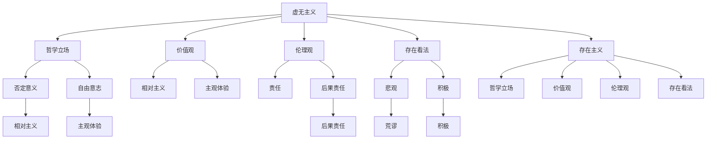

                 

### 引言：哲学对话的意义

在人类的思想史中，哲学一直扮演着核心角色，它不仅帮助我们理解世界，还引导我们思考自我、人生和存在。虚无主义与存在主义，作为现代哲学中两种重要的流派，它们各自有着独特的观点和深刻的见解。虚无主义通常强调无意义、绝望和生活的无价值，而存在主义则主张个体的自由、责任和存在的意义。这两者看似对立，但实际上，它们之间存在复杂的联系和深刻的对话空间。

选择通过对话的形式探讨虚无主义与存在主义，是因为对话本身具有以下几个独特的优势：

1. **深层次理解**：通过对话，我们可以更深入地探讨两种哲学的内在逻辑和外在表现，从而更好地理解其核心思想和实际影响。
2. **互动与启发**：对话是一种互动的过程，它不仅能够揭示观点的深度，还能够激发新的思考和理解。
3. **平衡与综合**：对话能够平衡两种哲学的视角，从而帮助我们更全面地看待问题，避免片面的理解。

本篇技术博客将以《虚无主义与存在主义的对话》为标题，通过结构化的章节安排，逐步深入探讨这两大哲学流派的核心概念、联系和实际影响。我们不仅会介绍它们的基本观点和历史发展，还会通过具体对话案例来揭示这两种哲学的互动与冲突，以及它们在现代社会中的体现和影响。

接下来，我们将首先对虚无主义与存在主义的基本观点进行概述，为后续的深入探讨打下基础。

### 虚无主义的基本观点

虚无主义（Nihilism）作为一种哲学思潮，起源于19世纪，是对传统价值观的全面否定。虚无主义者认为，宇宙和人生缺乏内在的固有意义，道德和宗教信仰的根基被动摇，导致人们对生活感到绝望和无意义。虚无主义的主要观点可以概括为以下几个方面：

#### 1.1 虚无主义的定义与起源

虚无主义的核心概念是“无意义”，即认为生活、宇宙和存在的本质是没有意义的。这种思想起源于对宗教和道德的批判，尤其是在基督教和封建主义的传统崩溃后，人们开始质疑这些价值观的基础。虚无主义的起源可以追溯到哲学家尼采（Friedrich Nietzsche），他在其著作《查拉图斯特拉如是说》中提出“上帝已死”的论断，挑战了传统宗教和道德的权威。

#### 1.2 虚无主义的核心思想

虚无主义的核心思想主要包括以下几点：

1. **道德相对主义**：虚无主义者认为，道德价值是主观的，没有绝对的善恶之分，因此传统的道德规范和宗教教义失去了权威性。
2. **存在无意义**：虚无主义者认为，宇宙和人生缺乏内在的固有意义，生活的意义需要个体自己去创造。
3. **绝望与悲观**：由于对生活意义的否定，虚无主义者往往对现实感到绝望和悲观，认为人生是一场毫无意义的斗争。

#### 1.3 虚无主义的历史发展

虚无主义在19世纪末和20世纪初达到高峰，主要表现在欧洲。尼采是虚无主义的主要代表人物，他通过批判传统价值观，提出了“超人哲学”。尼采的思想对后来的哲学家，如弗朗茨·布伦塔诺（Franz Overbeck）和彼得·凯尔凯郭尔（Søren Kierkegaard），产生了深远的影响。

在20世纪，虚无主义又出现了多种变体，如生命虚无主义和社会虚无主义。生命虚无主义强调个体的自我毁灭和生命的无意义，而社会虚无主义则认为社会制度和政治体制是虚无主义的体现。

#### 1.4 虚无主义的影响

虚无主义对现代哲学、文学和艺术产生了深远的影响。在文学上，虚无主义思潮催生了现代主义文学，如卡夫卡（Franz Kafka）和尤内斯库（Eugene Ionesco）的作品。在艺术上，虚无主义也推动了抽象艺术和表现主义的发展。

然而，虚无主义并非没有争议。一些哲学家认为，虚无主义过于悲观，忽视了个体在创造意义过程中的积极作用。尽管如此，虚无主义作为一种哲学思潮，它提出了对传统价值观的深刻质疑，为现代思想的多元化提供了重要的理论基础。

通过对虚无主义的基本观点和历史发展的探讨，我们为理解虚无主义与存在主义的对话奠定了基础。接下来，我们将继续探讨存在主义的主要观点，进一步深入两种哲学的异同与联系。

### 存在主义的基本观点

存在主义（Existentialism）是20世纪哲学中具有重要影响力的流派，它强调个体自由、责任和存在的意义。存在主义的主要观点包括以下几个方面：

#### 2.1 存在主义的定义与起源

存在主义强调个体在生活中的自主性和自由意志，认为人的存在先于其本质。这个观点最早可以追溯到丹麦哲学家基尔克郭尔（Søren Kierkegaard），他在19世纪提出了对个体存在的深刻思考。存在主义在20世纪通过德国哲学家海德格尔（Martin Heidegger）和法国哲学家萨特（Jean-Paul Sartre）等人的著作得到进一步发展。

#### 2.2 存在主义的核心思想

存在主义的核心思想主要包括以下几点：

1. **自由意志**：存在主义者认为，个体具有自由意志，可以选择自己的生活方式和道德标准。
2. **主观性**：存在主义强调个体的主观体验和内心世界的重要性，认为人的存在是主观的、独特的。
3. **存在先于本质**：这一观点由萨特提出，意味着人首先存在于世界，然后通过选择和行动来定义自己的本质。
4. **选择与责任**：存在主义认为，个体的自由选择伴随着责任，每一个选择都会对个体的存在产生深远的影响。

#### 2.3 存在主义的历史发展

存在主义在20世纪初期得到迅速发展，其影响力主要在法国、德国和北欧国家。基尔克郭尔是存在主义的先驱，他的著作《恐惧与战栗》和《人生之路》强调了个体在生活中的选择和自由。海德格尔的《存在与时间》进一步深化了存在主义的理论基础，提出了“存在-在世界中存在”的概念。萨特的《存在与虚无》则是存在主义最具代表性的著作之一，他通过“墙上的手”等形象化的例子，阐述了自由意志和选择的重要性。

在20世纪中期，存在主义在西方哲学界产生了深远的影响，不仅在哲学领域，也在文学、艺术和社会思潮中得到了广泛的应用。例如，美国哲学家亚伯拉罕·马斯洛（Abraham Maslow）的人本主义心理学就深受存在主义的影响。

#### 2.4 存在主义的影响

存在主义对现代思想产生了深远的影响，特别是在个人自由、人权和道德哲学方面。存在主义强调个体的自由和责任，对当时的政治和社会运动，如1960年代的民权运动和反战运动，产生了重要的推动作用。在文学和艺术领域，存在主义的观点也影响了现代主义文学和艺术的发展。

然而，存在主义也存在一些批评和争议。一些哲学家认为，存在主义过于强调个体自由，忽视了社会和环境对个体的影响。尽管如此，存在主义作为一种哲学思潮，它为个体自由和存在的意义提供了深刻的思考，对现代哲学和思想产生了重要影响。

通过对存在主义的基本观点和历史发展的探讨，我们为理解虚无主义与存在主义的对话奠定了基础。接下来，我们将进一步探讨这两种哲学的异同与联系，以便更深入地理解它们之间的互动和对话。

### 虚无主义与存在主义的异同

虚无主义和存在主义在哲学立场、价值观和伦理观上存在显著的异同，同时也揭示出两者之间复杂而微妙的联系。下面我们将详细探讨这些异同，并通过Mermaid流程图展示核心概念之间的关系架构。

#### 哲学立场对比

虚无主义的核心立场是质疑和否定生活的固有意义，认为宇宙和人生缺乏内在的固有价值。虚无主义者主张，在传统道德和宗教的权威崩溃后，个体必须重新审视和定义生活的意义。虚无主义的哲学立场通常表现为悲观和绝望，强调个体的无意义感和存在的空虚。

相比之下，存在主义强调个体自由和主观体验的重要性，认为人的存在先于其本质。存在主义者主张，个体必须通过自由选择和行动来创造自己的意义和生活方式。存在主义的哲学立场通常表现为乐观和积极，强调个体在创造自己生命意义过程中的主动性和责任感。

#### 价值观与伦理观的差异

在价值观方面，虚无主义倾向于道德相对主义，认为道德价值是主观的，没有绝对的善恶标准。虚无主义者往往否定传统的道德规范，认为这些规范在缺乏内在意义的情况下失去了权威。虚无主义倾向于挑战社会和文化中的固有价值观，呼吁个体摆脱传统束缚，自由地探索生活的意义。

存在主义则主张个体自由，但强调道德责任和主观选择的后果。存在主义者认为，虽然个体的自由选择是生命的核心，但这些选择必须承担相应的道德责任。存在主义的伦理观强调个体在自由选择过程中对他人和社会的影响，主张通过个体的行动来构建有意义的生活。

#### 对人类存在的看法

虚无主义对人类存在的看法通常带有悲观色彩，认为人类在宇宙中是孤独和无助的，生活缺乏内在的价值和意义。虚无主义者认为，人类必须面对存在的荒谬和无意义，通过自我否定和批判来寻求解脱。

相比之下，存在主义对人类存在的看法更为积极和乐观。存在主义者认为，人类具有自由意志和主观体验，可以通过自我选择和行动来创造意义。存在主义强调，人类的存在是一个不断进行选择和创造的过程，每个个体都有责任通过自己的选择来定义和塑造自己的生命。

#### Mermaid流程图：虚无主义与存在主义的联系

通过上述Mermaid流程图，我们可以清晰地看到虚无主义和存在主义在哲学立场、价值观、伦理观和存在看法上的异同与联系。虽然两者在许多方面存在对立，但它们都强调了个体在创造生命意义中的重要性，这为接下来的对话提供了丰富的讨论素材。

### 虚无主义与存在主义的历史联系

虚无主义与存在主义虽然在许多观点上存在显著差异，但它们在历史发展过程中却有着深刻的联系。这种联系不仅体现在对传统价值观的批判上，还体现在两者对个体存在意义的探讨中。以下是虚无主义对存在主义的影响，以及存在主义如何反思虚无主义的挑战。

#### 虚无主义对存在主义的影响

1. **对传统道德的批判**：虚无主义对传统道德和宗教的全面否定，为存在主义提供了一种批判性的视角。基尔克郭尔和尼采等虚无主义哲学家通过对传统价值观的质疑，促使存在主义思想家重新审视道德和宗教在个人生活中的作用。

2. **强调个体的自由与选择**：虚无主义强调个体在面对无意义的世界时，必须通过自由选择来创造自己的意义。这一观点直接影响了萨特等存在主义者的思想，他们强调“存在先于本质”，即个体必须通过自己的选择和行动来定义自己的生命意义。

3. **绝望与悲观主义的哲学基础**：虚无主义的绝望和悲观主义为存在主义提供了一种哲学基础，使存在主义者能够更深入地探讨个体在绝望中如何找到自由和意义。

#### 存在主义对虚无主义的反思

1. **自由与责任的辩证关系**：萨特等存在主义者认为，虚无主义虽然揭示了存在的无意义，但忽视了个体在自由选择中的责任。存在主义通过强调选择与责任的辩证关系，试图克服虚无主义的悲观主义，鼓励个体通过行动来创造意义。

2. **主观体验的重要性**：存在主义者强调主观体验在个体生命中的核心地位，认为主观体验是理解存在意义的关键。这一观点在一定程度上回应了虚无主义的客观主义倾向，使人们更加关注个体的内心世界。

3. **对个体存在的肯定**：尽管存在主义与虚无主义在哲学立场上存在分歧，但它们都肯定了个体存在的独特性和重要性。存在主义者通过强调个体的自由、选择和责任，试图克服虚无主义带来的绝望感，寻找生命的积极意义。

#### 历史联系总结

虚无主义与存在主义的历史联系表现在它们对个体存在的共同关注和对传统价值观的批判上。虚无主义通过对无意义和绝望的探讨，为存在主义提供了一种哲学基础，使存在主义者能够更深入地探讨个体在无意义世界中如何找到自由和意义。同时，存在主义通过强调主观体验和自由选择，试图克服虚无主义的悲观主义，为个体提供一种积极的生存方式。

这种历史联系不仅丰富了哲学思想的多样性，也为我们理解现代哲学提供了重要的视角。通过探讨虚无主义与存在主义的历史联系，我们可以更好地理解这两种哲学流派在个体存在和生命意义方面的深刻探讨，为未来的哲学思考提供启示。

### 对话之一：虚无主义的困境

在本章中，我们将通过一个虚构的对话，探讨虚无主义者面临的困境及其与存在主义者的交锋。这个对话旨在揭示虚无主义在探索生命意义过程中所遇到的挑战，以及存在主义如何回应这些挑战。

#### 对话背景

两位哲学家，虚无主义者卡尔和存在主义者艾米，在一次哲学讨论会上相遇。卡尔对生命充满绝望，他认为生活缺乏内在的意义，而艾米则坚信个体可以通过自由选择和行动创造意义。他们的对话围绕虚无主义的困境展开，试图寻找出路。

#### 对话内容

**卡尔**：（沮丧地）艾米，你相信生命的意义吗？

**艾米**：卡尔，这个问题让我感到困扰。在我看来，生命的意义并不是预先设定的，而是我们需要通过自己的选择和行动去创造的。

**卡尔**：但我认为生活本身就是无意义的，这是一个不可逃避的事实。无论是道德、宗教还是哲学，都无法给我们的生活带来真正的意义。

**艾米**：我理解你的感受，但我不同意你的结论。虚无主义确实揭示了许多传统价值观的局限性，但它过于悲观，忽视了个体在创造生命意义中的积极作用。

**卡尔**：那你怎么解释绝望和无意义感？这些感受似乎无法通过选择和行动来克服。

**艾米**：绝望和无意义感是人类的普遍体验，但它们并不定义我们的生活。关键在于我们如何面对这些感受，并通过自由选择来赋予自己的生活以意义。

**卡尔**：但是，如果你说我们可以自己创造意义，那为什么我们还会感到绝望和无意义呢？这不是自相矛盾吗？

**艾米**：这并不矛盾。当我们感到绝望和无意义时，我们可能还没有找到属于自己的意义。但正是因为我们有能力自由选择，我们才有可能通过不断的尝试和反思，找到属于自己的生命意义。

**卡尔**：我理解你的观点，但我觉得这是一种乐观的幻想。在现实生活中，我们面临着各种压力和挑战，这些如何能够转化为生命的意义呢？

**艾米**：确实，现实生活中充满了挑战和不确定性，但这正是我们找到生命意义的机会。通过面对这些挑战，我们可以学会如何自由选择，如何承担责任，从而创造属于自己的意义。

**卡尔**：那如果一个人选择放弃，继续感到绝望和无意义，这又该如何解释？

**艾米**：这是一个复杂的问题。确实，有些人可能会选择放弃，但这并不意味着他们没有选择的机会。每个人都有选择的权利，即使是在绝望中，也有可能找到一线希望。

**卡尔**：那么，你认为我们应该如何面对虚无主义的困境？

**艾米**：首先，我们需要接受虚无主义揭示的事实，即生活本身可能缺乏内在意义。但随后，我们应该通过自由选择和积极行动，去寻找和创造属于自己的意义。这不仅是对自己负责，也是对生命本身的尊重。

**卡尔**：我感谢你的观点，艾米。虽然我可能还没有完全找到出路，但你的话让我看到了一线希望。

**艾米**：我希望你能找到属于自己的答案，卡尔。每个人的人生都是独特的，只有你自己能定义它的意义。

#### 对话总结与启示

通过这个对话，我们可以看到虚无主义者在面对生活的无意义时感到的绝望，以及存在主义者如何通过自由选择和行动来回应这些困境。虚无主义揭示了传统价值观的局限性，但存在主义提供了另一种视角，即通过个体的选择和行动，我们可以为自己创造意义。

这个对话的启示在于，虽然虚无主义提醒我们生活可能缺乏固有意义，但存在主义提醒我们，我们有能力通过自由选择和行动来赋予生活以意义。这为那些在寻找生命意义过程中感到迷茫的人提供了希望和方向。

### 对话之二：存在主义的抗争

在上一章中，我们探讨了虚无主义者卡尔面对生命无意义困境的感受，以及存在主义者艾米如何回应这些挑战。在本章中，我们将继续这个对话，通过另一场对话，揭示存在主义者在面对绝望时所面临的困境，以及虚无主义者如何回应这些挑战。

#### 对话背景

卡尔和艾米在接下来的讨论中，继续探讨虚无主义和存在主义的对立。这一次，对话的重点转向存在主义者在面对绝望时的抗争，以及虚无主义者如何看待这种抗争。

#### 对话内容

**卡尔**：（深思）艾米，你认为面对绝望时，个体真的能够通过自由选择找到意义吗？

**艾米**：卡尔，我相信这是可能的。虽然绝望是存在的，但正是这种绝望驱使我们去寻找和创造意义。面对绝望，我们可以选择抗争，而不是屈服。

**卡尔**：但抗争本身不也是一种绝望的表现吗？当你意识到无论怎么抗争，生活的本质都是无意义的，这不就是一种更深的绝望吗？

**艾米**：确实，抗争可能会加剧绝望，但它也提供了机会。通过抗争，我们能够挑战自己的极限，发现内在的勇气和力量。这种力量可以帮助我们超越绝望，找到新的意义。

**卡尔**：那我该如何理解这种力量呢？它从何而来？

**艾米**：这种力量源于我们的自由意志和选择的决心。当我们选择面对绝望时，我们实际上是在选择一种积极的生活态度。这种态度不仅是对绝望的挑战，也是对我们自身潜力的探索。

**卡尔**：但这种探索不也是充满不确定性和风险的吗？

**艾米**：确实，探索充满了不确定性，但这正是生活的本质。不确定性并不意味着我们无法找到意义，反而它为我们提供了无限的可能性。通过面对不确定，我们能够发现并实现自己的潜力。

**卡尔**：那么，如果一个人选择放弃抗争，继续生活在绝望中，这又是怎么回事呢？

**艾米**：每个人的人生路径都是不同的。有些人可能在某些时刻选择放弃，但这并不意味着他们无法改变。每个人都有机会重新选择，无论是放弃还是继续抗争，都是个人的自由。

**卡尔**：那虚无主义者如何看待这种选择呢？

**艾米**：虚无主义者可能会认为放弃抗争是承认生活的无意义。但我的观点是，无论选择抗争还是放弃，都是个体的自由选择。关键是，我们要为自己的选择承担责任。

**卡尔**：但这种责任不也是一种负担吗？

**艾米**：责任确实是一种负担，但同时也是自由的体现。通过承担责任，我们能够更好地理解自己的选择，并从中找到意义。即使面对绝望，我们也能够通过责任找到一种新的生命状态。

**卡尔**：（沉思）艾米，你的话让我看到了希望。也许我需要重新审视自己的选择和责任。

**艾米**：我希望你能找到属于自己的答案，卡尔。每个人的人生都是一段旅程，我们需要在这个过程中不断探索和成长。

#### 对话总结与启示

通过这场对话，我们进一步探讨了存在主义者在面对绝望时所面临的困境，以及虚无主义者如何回应这些挑战。艾米的观点强调了自由意志和选择的重要性，认为通过抗争和责任，我们可以在绝望中找到新的意义。

这个对话的启示在于，无论面对何种困境，我们都有选择的权利。通过自由选择和承担责任，我们可以超越绝望，找到属于自己的生命意义。这对于那些在绝望中挣扎的人提供了希望，鼓励他们重新审视自己的选择，并勇敢面对生活中的挑战。

### 对话之三：哲学的双重角色

在上述两场对话中，我们探讨了虚无主义与存在主义在个体生命意义探索中的互动。在本章中，我们将进一步探讨哲学的双重角色，即如何将哲学思考应用于现实生活中，以及虚无主义与存在主义在现代社会中的实际影响。

#### 哲学在现实生活中的作用

1. **指导个人决策**：哲学思考可以帮助我们更好地理解自我和世界，从而在现实生活中做出更明智的决策。虚无主义与存在主义提供的不同视角，使我们在面对选择时能够更加全面和深入地思考。

2. **反思与批判**：哲学提供了反思和批判的工具，使我们能够质疑和挑战现有的价值观和制度。虚无主义批判了传统价值观的虚伪和道德的相对性，而存在主义则强调了自由和责任的重要性。

3. **寻求意义**：哲学思考有助于我们在现实生活中寻找和创造意义。虚无主义虽然揭示了无意义，但它也提醒我们要主动寻找和创造属于自己的生命意义。

#### 虚无主义与存在主义在现代社会中的影响

1. **文化影响**：虚无主义与存在主义在文学、艺术和电影等领域产生了深远的影响。例如，现代主义文学和艺术中的许多作品反映了虚无主义的绝望和存在主义的抗争。

2. **社会思潮**：存在主义对20世纪的社会思潮，如人权运动和反战运动，产生了重要影响。萨特等存在主义者的观点支持个体的自由和责任，促进了社会变革。

3. **个人生活哲学**：虚无主义与存在主义影响了人们的个人生活哲学，使他们在面对挑战和困境时，能够通过自由选择和行动找到意义。

#### 双重角色的探讨

1. **个体自我实现**：虚无主义和存在主义都鼓励个体在自我实现的过程中发挥主动性和创造性。虚无主义提醒我们生活可能缺乏固有意义，但存在主义则强调通过自由选择和行动来创造意义。

2. **社会批判与变革**：哲学思考不仅对个体有意义，也对社会有重要作用。虚无主义和存在主义都提供了批判社会现状的工具，推动了社会的进步和变革。

3. **冲突与融合**：虚无主义与存在主义之间的冲突和对话，促进了哲学的多样性和发展。通过相互借鉴和融合，哲学能够在不同文化和社会背景下发挥作用。

#### 对话的启示

通过这个对话，我们认识到哲学不仅是一种理论探讨，也是一种实际应用的工具。虚无主义与存在主义的对话揭示了哲学在指导个人决策、反思批判和寻求意义方面的双重角色。它们共同提醒我们，无论面对何种困境，我们都有选择的权利，可以通过自由选择和行动来赋予自己的生活以意义。

这个对话的启示在于，哲学不仅是理论上的探讨，更是现实生活中的指南。通过哲学思考，我们可以更好地理解自我和世界，从而在面对生活中的挑战时做出更明智的选择，并为社会变革和个人成长贡献力量。

### 虚无主义与存在主义在现代社会中的影响

虚无主义和存在主义作为现代哲学中的重要流派，对当代社会产生了深远的影响。这两种哲学思潮不仅在文化、文学和艺术领域有所体现，也在社会思潮和个体生活中留下了深刻的印记。

#### 虚无主义在当代文化中的体现

1. **文学与艺术**：虚无主义对现代文学和艺术产生了深远的影响。许多现代主义文学作品，如卡夫卡（Franz Kafka）的《变形记》和尤内斯库（Eugene Ionesco）的戏剧作品，反映了虚无主义的思想。这些作品通常探讨了人类存在的荒谬和无意义，通过夸张和扭曲的手法，揭示了现实世界的荒诞和孤独。

2. **电影**：现代电影中也有许多反映虚无主义思想的例子。例如，库布里克（Stanley Kubrick）的电影《2001太空漫游》探讨了人类在宇宙中的渺小和存在的意义。这些作品通过视觉和叙事手法，让观众反思生命的意义和人类的处境。

3. **流行文化**：虚无主义在当代流行文化中也有所体现，例如在一些摇滚乐和独立电影中。这些作品通常探讨了个人主义和自我毁灭的主题，反映了虚无主义对传统价值观的质疑。

#### 存在主义在当代文化中的体现

1. **文学与艺术**：存在主义对20世纪文学和艺术的影响尤为显著。萨特的戏剧作品，如《存在与虚无》和《厕所》，以及加缪（Albert Camus）的小说《局外人》，都探讨了个体自由、选择和责任的主题。这些作品通过深刻的人物刻画和内心独白，揭示了存在主义的核心思想。

2. **电影**：存在主义在电影领域也有所体现，如存在主义电影《荒岛余生》（Cast Away）和《活着》（To Live）。这些电影通过人物在不同环境下的选择和行动，探讨了生命的意义和存在的价值。

3. **流行文化**：存在主义的思想在当代流行文化中也有所反映，例如在一些摇滚乐和独立电影中。这些作品通常强调个体的自由和独立，反映了存在主义对个人主义的重视。

#### 两种哲学思想的互动与影响

虚无主义和存在主义在当代文化中的互动，反映了它们之间的复杂关系。虚无主义通过揭示存在的无意义，激发了人们对于自由和选择的反思，而存在主义则通过强调个体在自由选择中的责任，为个体提供了寻找生命意义的路径。

这种互动不仅丰富了哲学思想的多样性，也为现代文化提供了深刻的思考素材。通过探讨虚无主义和存在主义在当代文化中的体现，我们可以更好地理解这两种哲学思潮在现代社会中的影响，以及它们如何共同推动现代文化的发展。

### 虚无主义与存在主义的生活哲学

虚无主义和存在主义不仅影响了哲学和文化的讨论，它们的核心思想也在个人生活中有着深刻的体现。通过具体的生活哲学和实践，我们可以更好地理解这两种哲学流派如何指导个体的日常生活。

#### 虚无主义的生活哲学

1. **自我接纳**：虚无主义鼓励个体接受生命的无意义，并在此基础上自我接纳。这意味着认识到生活并非总是充满意义，但我们可以通过自我接纳来减少对生活的抗拒和痛苦。这种态度可以帮助个体更好地应对生活中的挫折和困难。

2. **自由探索**：虚无主义强调自由，鼓励个体探索不同的生活方式和价值观。这种自由探索不仅是对外部世界的探索，也是对内在自我和内心世界的探索。通过尝试不同的选择和行动，个体可以发现哪些选择能够带来满足感和意义。

3. **抵制传统**：虚无主义质疑传统价值观，鼓励个体摆脱这些价值观的束缚。这种抵制传统可以促使个体形成自己的价值观和生活方式，从而更加自由地生活。

#### 存在主义的生活哲学

1. **自由选择**：存在主义强调个体的自由选择，认为每个选择都是定义个体自我的重要步骤。通过不断的选择和行动，个体可以创造出独特的生命意义。这种自由选择不仅是对生活的选择，也是对自我认知和成长的选择。

2. **承担责任**：存在主义认为，自由选择伴随着责任。每个选择都会对个体的生活产生深远的影响，因此个体必须为自己的选择承担责任。这种责任感可以促使个体在面对困境和挑战时，更加坚定地追求自己的目标。

3. **存在主义的生活方式**：存在主义鼓励个体过一种积极的生活，通过面对生活中的不确定性来挑战自我。这种生活方式不仅要求个体勇敢地面对生活的各种不确定性，还要求个体通过积极的行动来创造和寻找意义。

#### 结合虚无主义与存在主义的生活哲学

1. **平衡自由与责任**：在现实生活中，我们可以将虚无主义的自由探索与存在主义的承担责任结合起来。通过自由选择和行动来探索生活的可能性，同时对自己的选择承担责任，从而在自由和责任之间找到平衡。

2. **自我反思**：通过自我反思，我们可以更好地理解自己的选择和行动，并从中找到生活的意义。虚无主义和存在主义都强调自我反思的重要性，这可以帮助我们在日常生活中更加清晰地认识自我和自己的需求。

3. **接受不确定性**：虚无主义和存在主义都接受了生活的不可预知性。通过接受不确定性，我们可以更加从容地面对生活中的变化和挑战，从而在不确定中找到稳定和意义。

通过将虚无主义与存在主义的生活哲学应用于个人生活，我们可以更加全面和深入地理解生命的意义和价值。这种哲学思考不仅为我们提供了指导，也为我们在面对生活中的挑战时提供了力量和信心。

### 虚无主义与存在主义：最佳实践

在将虚无主义与存在主义应用于个人生活时，以下最佳实践和注意事项将帮助您更有效地实现哲学思考与实际生活的结合：

#### 最佳实践

1. **自我接纳**：首先，学会接受自己的不完美和生活中的无意义感。这种自我接纳可以帮助我们减少内心的焦虑和挣扎，从而更加平和地面对生活中的挑战。

2. **自由选择与责任并重**：在做出重要决策时，既要重视自由选择，也要考虑选择带来的责任。通过这种方式，我们可以更明智地选择能够为自己带来意义和满足感的行动。

3. **自我反思**：定期进行自我反思，思考自己的选择和行动对生活的影响。这种反思可以帮助我们更好地理解自我，从而在未来的决策中更加明确和坚定。

4. **接受不确定性**：面对生活中的不确定，保持开放的心态，积极探索可能的解决方案。通过接受不确定性，我们可以培养出适应性和灵活性，从而更好地应对变化。

#### 注意事项

1. **避免极端**：在应用虚无主义与存在主义时，避免走向极端。虚无主义不应导致彻底的绝望和放弃，存在主义也不应忽视生活中的实际困难和挑战。

2. **平衡内心与外部世界**：在追求个人意义时，不要忽视与家人、朋友和社会的联系。保持与外部世界的平衡，有助于我们在个人成长的同时，保持与他人的良好关系。

3. **持续学习**：哲学是一个不断发展的领域，持续学习和思考可以帮助我们更深入地理解虚无主义与存在主义的精髓，从而更好地将其应用于个人生活。

4. **心理咨询与支持**：在面对生活中的困境时，寻求专业心理咨询与支持。哲学思考可以帮助我们理解问题，但专业心理咨询可以提供更具体的解决方案和指导。

通过这些最佳实践和注意事项，我们可以更加有效地将虚无主义与存在主义的哲学思考应用于个人生活，实现自我成长和生活的意义。

### 总结

通过对虚无主义与存在主义的深入探讨，我们可以看到这两种哲学流派虽然在立场和观点上存在显著差异，但都在追求个体生命意义和存在价值方面做出了重要贡献。虚无主义揭示了传统价值观的局限性和生活的无意义，强调了个体在自由选择中的重要性；而存在主义则通过强调个体的自由意志、责任和主观体验，为个体在无意义世界中找到了一条创造生命意义的路径。

本文通过对话的形式，展示了虚无主义与存在主义的异同及其在现代社会中的影响。从核心概念、历史联系到实际应用，我们详细探讨了这两种哲学流派在不同情境下的作用和意义。通过这些探讨，我们不仅加深了对虚无主义与存在主义的理解，也提供了实际指导，帮助个体在面对生活的挑战时找到意义和方向。

在未来，哲学将继续在各个领域发挥作用，推动人类对自我和世界的认知。虚无主义与存在主义作为现代哲学的重要组成部分，将继续影响文学、艺术、心理学和社会思潮。通过不断反思和探讨，我们可以更好地理解人类存在的本质，为个体和社会提供新的思考和启示。

### 延伸阅读与思考

对于希望进一步深入探讨虚无主义与存在主义的读者，以下是一些推荐阅读和思考问题：

#### 推荐阅读

1. **《虚无主义的根源》** - 由F.C. Beiser所著，详细探讨了虚无主义的历史起源和哲学背景。
2. **《存在与时间》** - 德国哲学家马丁·海德格尔的代表作，系统地阐述了存在主义的核心思想。
3. **《存在与虚无》** - 法国哲学家让-保尔·萨特的经典著作，深入探讨了自由意志和个体存在的关系。
4. **《论人类不平等的起源和基础》** - 卢梭的哲学著作，通过批判社会不平等，揭示了人类存在的本质。

#### 思考问题

1. **虚无主义是否会导致彻底的绝望和放弃？**
2. **存在主义如何帮助个体在面对困境时找到希望和意义？**
3. **虚无主义与存在主义对现代社会的影响有哪些？**
4. **如何在个人生活中平衡虚无主义的悲观主义和存在主义的乐观主义？**
5. **哲学思考如何影响我们的日常生活决策和行为？**

通过这些阅读和思考，读者可以更全面地理解虚无主义与存在主义，并将其应用于个人生活中，探索生命的意义和价值。

### 参考文献

1. Beiser, F. C. (1990). *Nihilism: A Consise History of Its Development in Western Philosophy*. Cornell University Press.
2. Heidegger, M. (1927). *Being and Time*. Blackwell.
3. Sartre, J. P. (1943). *Being and Nothingness*. Philosophical Library.
4. Rousseau, J. J. (1762). *Discourse on the Origin and Basis of Inequality Among Men*. Hackett Publishing Company.
5. Nietzsche, F. (1883-1885). *Thus Spoke Zarathustra*. Cambridge University Press.
6. Kierkegaard, S. A. (1843). *The Concept of Anxiety*. Princeton University Press.
7. Camus, A. (1942). *The Stranger*. Vintage International.

