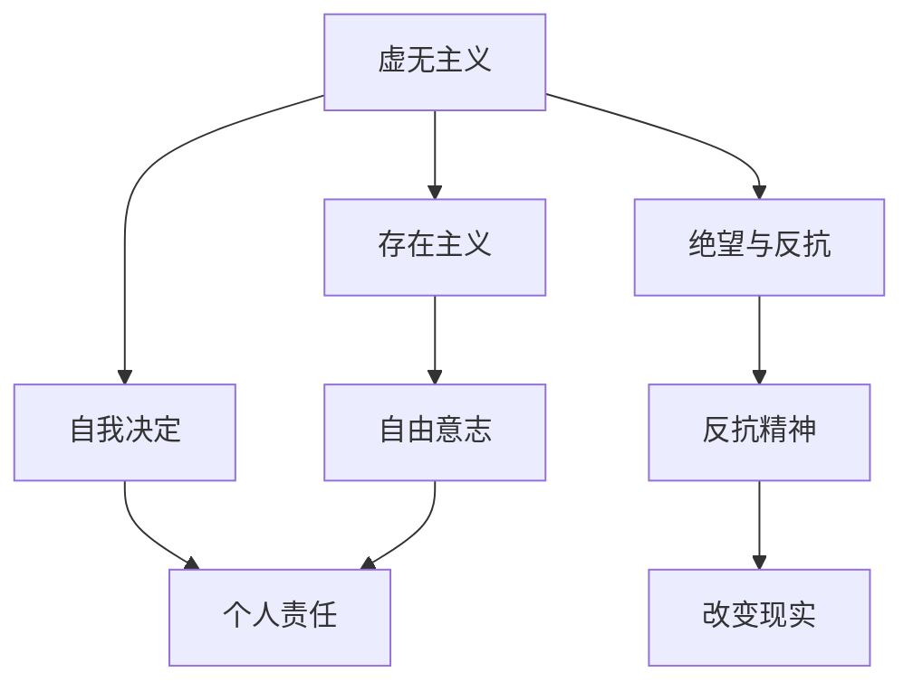
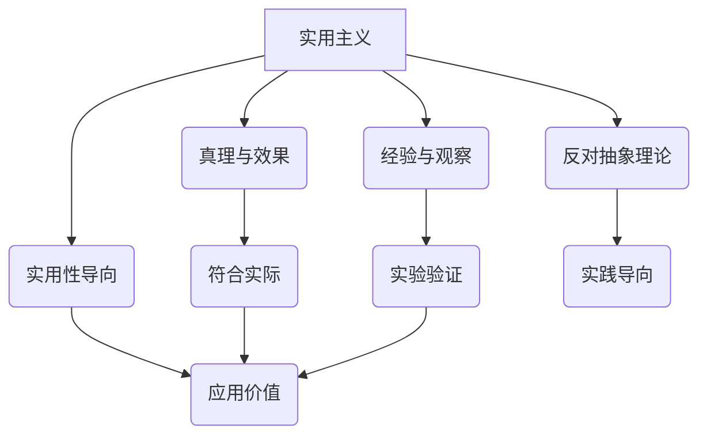

                 

### 背景介绍

#### 虚无主义的起源与发展

虚无主义作为一种哲学思潮，起源于19世纪末的欧洲，特别是在德国和俄罗斯。其最早的代表人物包括弗里德里希·尼采和费奥多尔·陀思妥耶夫斯基。尼采在其作品中提出“上帝已死”的观点，揭示了西方文化中道德和价值观的崩溃。他认为，世界的本质是虚无，人类的存在没有固定的意义，因此人们必须创造自己的意义。

陀思妥耶夫斯基则在《罪与罚》等作品中探讨了人的罪恶感、自我救赎以及存在意义的虚无。他认为，人的内在精神状态比外部世界更为真实，因此在面对虚无时，人必须依靠内在的精神力量。

随着时间的推移，虚无主义在20世纪继续发展，其影响力扩展到了文学、艺术、哲学等多个领域。存在主义作为虚无主义的一种表现，强调了人的自由意志和存在先于本质的观点。主要的代表人物包括让-保尔·萨特和阿尔贝·加缪。萨特在其哲学著作《存在与虚无》中提出了“存在先于本质”的观点，强调人的自由和选择的重要性。加缪则在《鼠疫》等作品中展现了人类在绝望中的抗争精神。

#### 实用主义的起源与发展

实用主义作为一种哲学思潮，起源于19世纪末的美国。其代表人物包括威廉·詹姆斯和约翰·杜威。威廉·詹姆斯是美国著名的心理学家和哲学家，他提出了实用主义的核心观点，即真理是符合实际效果的思想。他认为，知识应该以实际效果为导向，而不是基于传统的形而上学观念。

约翰·杜威是实用主义的另一位重要代表，他强调教育和社会改革的重要性。他认为，教育应该以实用为导向，培养学生的批判性思维和解决问题的能力。杜威的教育理念对现代教育产生了深远的影响。

20世纪，实用主义继续发展，其影响扩展到了社会科学、心理学、经济学等多个领域。实用主义强调实际效果和经验的重要性，反对抽象的理论和形而上学。

#### 两种哲学观念的异同

虚无主义和实用主义在哲学观念上存在显著差异。虚无主义认为世界的本质是虚无，人类的存在缺乏固有意义，因此强调个人自由意志和自我创造。而实用主义则认为真理是符合实际效果的思想，强调实际效果和经验的重要性，反对抽象的理论。

然而，两种哲学观念也存在一定的联系。虚无主义和实用主义都关注人类的存在意义和实际效果。虚无主义通过揭示世界的虚无性，促使人们反思和重新定义生活的意义；而实用主义则通过强调实际效果，为人们提供了一种解决实际问题的方法。

在接下来的章节中，我们将进一步探讨虚无主义和实用主义的基本概念、哲学比较、社会应用、个体生活影响以及案例研究，以全面分析这两种哲学观念的碰撞与融合。

### 虚无主义的基本概念与特点

虚无主义作为一种哲学思潮，其基本概念和特点可以从多个方面来理解。首先，虚无主义认为世界的本质是虚无，即不存在固有的意义、目的或价值。这一观点与传统的宗教、形而上学和伦理观念形成鲜明对比。在虚无主义者看来，人类的存在本身是缺乏意义的，生活在一个无意义的世界中。

#### 虚无主义的哲学核心

虚无主义的哲学核心可以归结为以下几点：

1. **存在主义**：虚无主义强调存在先于本质，即人类的存在是先于其固有意义的。这意味着人们必须通过自己的行动和选择来创造生活的意义。
2. **自我决定**：虚无主义认为，个人具有自由意志，可以选择自己的生活态度和行为。在虚无主义的框架下，个人必须为自己的生活负责，并承担选择带来的后果。
3. **绝望与反抗**：虚无主义者常常感受到深刻的绝望，因为他们认为世界是虚无的，人类的存在缺乏意义。然而，虚无主义并不鼓励放弃或沉沦，相反，它提倡在绝望中寻找反抗的力量，通过个人的创造力和意志力来挑战和改变现实。

#### 虚无主义的代表人物

虚无主义的代表人物包括弗里德里希·尼采、费奥多尔·陀思妥耶夫斯基和让-保尔·萨特等。他们的作品深刻地体现了虚无主义的哲学观念。

1. **弗里德里希·尼采**：尼采在其哲学著作中提出了“上帝已死”的观点，揭示了西方文化中道德和价值观的崩溃。他认为，世界的本质是虚无，人类的存在没有固定的意义，因此人们必须创造自己的意义。尼采的哲学思想具有强烈的个人主义色彩，强调个体的意志力和创造力。
2. **费奥多尔·陀思妥耶夫斯基**：陀思妥耶夫斯基在《罪与罚》等作品中探讨了人的罪恶感、自我救赎以及存在意义的虚无。他认为，人的内在精神状态比外部世界更为真实，因此在面对虚无时，人必须依靠内在的精神力量。
3. **让-保尔·萨特**：萨特在《存在与虚无》中提出了“存在先于本质”的观点，强调人的自由意志和选择的重要性。他认为，人类的存在是自由的，但自由也意味着责任，因为人们必须为自己的选择承担后果。

#### 虚无主义的哲学意义

虚无主义在哲学上具有重要的意义，它挑战了传统的价值观和道德观念，促使人们重新思考人类的存在意义。虚无主义鼓励个人在无意义的世界中寻找自己的价值和意义，通过自由意志和自我创造来定义自己的生活。

#### 总结

虚无主义的基本概念和特点体现在对世界的虚无性、人类存在意义的反思以及自我决定和反抗的精神。通过理解虚无主义的哲学核心和代表人物，我们可以更深入地探讨虚无主义在现代社会中的影响和意义。

#### 核心概念实体之间的关系架构 Mermaid 流程图

#### 虚无主义与实用主义的异同分析

虚无主义与实用主义在哲学观念上存在显著差异，但也存在一定的联系。通过对两者的异同进行分析，我们可以更好地理解它们在现实世界中的影响。

#### 1. 基本概念和哲学观点

虚无主义的基本概念是世界的本质是虚无，人类的存在缺乏固有意义。虚无主义者强调自由意志和自我创造，认为个人必须通过自己的行动来定义生活的意义。虚无主义的核心在于揭示人类在无意义的世界中的生存状态，并探讨如何在这种状态下找到个人价值。

实用主义的基本概念是真理是符合实际效果的思想。实用主义者强调实际效果和经验的重要性，认为知识应该以实际应用为导向。实用主义的哲学观点是，通过经验观察和实验来验证和修正理论，从而推动科学和社会的进步。

#### 2. 对比分析

**差异点**

- **对世界的看法**：虚无主义认为世界是虚无的，缺乏固有意义；实用主义则认为世界是有意义的，通过实际效果和经验来验证和解释。
- **对真理的界定**：虚无主义认为真理是主观的，取决于个人的选择和创造；实用主义则认为真理是客观的，可以通过实验和观察来验证。
- **对行动的导向**：虚无主义强调个人的自由意志和自我创造，鼓励个人在无意义的世界中寻找意义；实用主义则强调实际效果和经验，鼓励通过实践和实验来解决问题。

**联系点**

- **人类存在意义的探讨**：虚无主义和实用主义都关注人类的存在意义。虚无主义通过揭示世界的虚无性，促使人们反思和重新定义生活的意义；实用主义则通过强调实际效果和经验，为人们提供了一种寻找意义的方法。
- **实际应用的关注**：虚无主义和实用主义都在实际应用中发挥作用。虚无主义通过鼓励个人创造和自由选择，推动社会变革；实用主义则通过科学实验和实际效果，推动技术和社会进步。

#### 3. 社会影响

**虚无主义的影响**：

- **文学与艺术**：虚无主义激发了19世纪末和20世纪初的许多文学作品和艺术作品，如尼采的《查拉图斯特拉如是说》和陀思妥耶夫斯基的《罪与罚》等。这些作品探讨了人类在无意义的世界中的生存状态和内心挣扎。
- **社会哲学**：虚无主义对20世纪初的存在主义产生了深远影响，如让-保尔·萨特的哲学思想。存在主义强调个体的自由意志和责任，与虚无主义的哲学观点有密切联系。
- **政治领域**：虚无主义在某些政治思潮中也有所体现，如极权主义和纳粹主义。这些思潮利用虚无主义的思想来削弱传统的道德和价值观，从而实现政治权力的集中。

**实用主义的影响**：

- **科学技术**：实用主义强调实际效果和经验，推动了科学技术的发展。例如，实用主义哲学为实验科学和工程学提供了理论基础，促进了现代科技文明的进步。
- **教育改革**：实用主义对教育改革产生了深远影响，如约翰·杜威的教育理念。杜威主张以实用为导向的教育，培养学生的批判性思维和解决问题的能力。
- **社会政策**：实用主义在制定社会政策时也有所应用，如通过实证研究和数据驱动的方法来评估政策的效果和可行性。

#### 4. 总结

虚无主义与实用主义在哲学观点上存在显著差异，但也存在一定的联系。虚无主义通过揭示世界的虚无性，促使人们反思和重新定义生活的意义；实用主义则通过强调实际效果和经验，为人们提供了一种寻找意义的方法。在现实世界中，这两种哲学观念都产生了深远的影响，体现在文学、艺术、社会哲学、政治领域以及科学技术等方面。

#### 核心概念与联系：Mermaid 流程图

### 实用主义的基本概念与特点

实用主义作为一种哲学思潮，起源于19世纪末的美国，其代表人物包括威廉·詹姆斯和约翰·杜威。实用主义的基本概念和特点可以从以下几个方面进行阐述。

#### 1. 实用主义的哲学核心

实用主义的哲学核心在于对真理和知识的重新定义。实用主义者认为，真理不是抽象的理论，而是通过实际效果来验证的思想。也就是说，一个观点或理论是否正确，取决于它在实际应用中的效果。这一观点与传统的形而上学和理性主义形成了鲜明对比。

#### 2. 真理与实际效果

实用主义强调真理与实际效果的密切关系。威廉·詹姆斯提出，真理是符合实际效果的思想。这意味着，一个理论或观点只有在实际应用中得到了验证，才能被认为是真实的。这种观点鼓励人们关注实践，而不是仅仅停留在抽象的理论讨论中。

#### 3. 经验与观察

实用主义认为，经验是知识的基础。约翰·杜威强调，知识应该从经验中获取，通过观察和实验来验证。实用主义者主张，通过实际的观察和实验，人们可以更好地理解世界，并从中得出有意义的结论。

#### 4. 实用性为导向

实用主义强调实用性和应用价值。杜威的教育理念就是一个典型的例子，他主张教育应该以实用为导向，培养学生的批判性思维和解决问题的能力。这种教育理念强调，教育的目的不仅是传授知识，更重要的是培养学生的实际应用能力。

#### 5. 反对抽象理论

实用主义反对过于抽象的理论，主张将理论应用于实际生活。实用主义者认为，抽象的理论往往脱离实际，难以解决现实问题。因此，他们强调，理论应该紧密联系实际，以解决实际问题为导向。

#### 6. 社会改革与进步

实用主义强调通过社会改革和进步来改善人类生活。杜威认为，实用主义不仅是一种哲学观念，更是一种行动指南。他主张，通过教育改革、社会政策和科技进步，可以实现社会的公平和正义。

#### 实用主义的代表人物

- **威廉·詹姆斯**：詹姆斯是美国著名的心理学家和哲学家，他是实用主义的奠基人之一。他提出了“真理是符合实际效果的思想”这一观点，为实用主义奠定了理论基础。
- **约翰·杜威**：杜威是实用主义的另一位重要代表，他是一位杰出的教育家和哲学家。他的教育理念强调实用性和应用价值，对现代教育产生了深远影响。

#### 实用主义的哲学意义

实用主义在哲学上具有重要意义。它挑战了传统的形而上学和理性主义观念，提出了新的真理观和知识观。实用主义鼓励人们关注实际效果和经验，通过实践和实验来验证和修正理论，从而推动科学和社会的进步。

#### 总结

实用主义的基本概念和特点体现在对真理和知识的重新定义、对经验的重视、实用性为导向、反对抽象理论以及社会改革与进步等方面。通过理解实用主义的哲学核心和代表人物，我们可以更深入地探讨实用主义在现代社会中的影响和意义。

#### 核心概念与联系：Mermaid 流程图

### 虚无主义与实用主义在社会文化中的应用

虚无主义和实用主义作为两种哲学观念，在现代社会文化中产生了广泛而深远的影响。它们不仅塑造了人们的思想观念，还影响了文学、艺术、政治和社会各个领域。

#### 1. 文学与艺术

虚无主义在文学和艺术领域中的影响尤为显著。19世纪末和20世纪初的许多文学作品都体现了虚无主义的哲学思想。例如，尼采的《查拉图斯特拉如是说》描绘了一个充满绝望和虚无的世界，同时探讨了如何在这个世界中找到意义。陀思妥耶夫斯基的《罪与罚》则深刻地探讨了罪恶感、自我救赎和存在意义的虚无。这些作品揭示了人类在无意义世界中寻找自我价值和意义的挣扎。

实用主义在文学和艺术中的影响同样不可忽视。实用主义强调实际效果和经验，鼓励创作者通过实际观察和实验来获取知识。约翰·杜威的教育理念强调实用性和应用价值，对现代教育产生了深远影响。实用主义还推动了现实主义文学和艺术的发展，使创作者更加关注现实生活和社会问题。

#### 2. 政治领域

虚无主义在政治领域的影响主要体现在极权主义和纳粹主义的兴起。这些政治运动利用虚无主义的思想，破坏传统道德和价值观，以实现政治权力的集中。极权主义和纳粹主义强调个人必须放弃自由意志，服从集体的意志。这种思想与虚无主义的自我决定和反抗精神形成鲜明对比。

实用主义在政治领域的影响则主要体现在政策制定和执行中。实用主义强调通过实证研究和数据驱动的方法来评估政策的效果和可行性。现代政治中的许多政策都采用了实用主义的方法，以解决社会问题，提高人民生活质量。

#### 3. 社会应用

虚无主义在社会中的应用主要体现在对传统价值观的质疑和反思。虚无主义鼓励人们重新审视生活的意义和价值，推动社会变革。虚无主义思潮在20世纪初的俄国革命、法国大革命以及现代的新社会运动中都有所体现。

实用主义在社会中的应用则体现在科学技术的推动和社会改革中。实用主义强调实际效果和经验，推动了科学技术的发展。现代社会的许多科技进步，如互联网、智能手机等，都得益于实用主义的思想。同时，实用主义在教育改革、社会福利政策等方面也发挥了重要作用。

#### 4. 个人生活

虚无主义和个人生活之间的关系较为复杂。虚无主义认为人类的存在缺乏固有意义，但同时也鼓励个人通过自由意志和自我创造来定义生活。虚无主义者在面对生活困境时，可能会感到绝望，但也因此更加珍惜和追求个人价值。

实用主义在个人生活中的应用则主要体现在实际问题和解决问题的方法上。实用主义者倾向于通过经验和实验来解决问题，而不是依赖抽象的理论和形而上学。这种态度有助于提高个人的适应能力和解决问题的能力。

#### 5. 总结

虚无主义和实用主义在现代社会文化中的应用体现了它们各自的哲学思想。虚无主义鼓励人们反思生活的意义和价值，推动社会变革；实用主义则强调实际效果和经验，推动科学和社会的进步。两种哲学观念在不同领域产生了深远的影响，为我们理解和应对现代社会的问题提供了不同的视角和方法。

### 虚无主义与实用主义对个人生活的影响

虚无主义和实用主义作为两种哲学观念，对个人的生活态度、行为模式和价值观念产生了深远的影响。这两种观念在应对现代生活中的挑战和矛盾时，提供了不同的视角和方法。

#### 1. 虚无主义的影响

虚无主义强调世界的虚无性和人类存在的无意义，这可能导致人们对生活感到绝望和困惑。然而，虚无主义并不鼓励放弃或沉沦，相反，它提倡通过自由意志和自我创造来寻找生活的意义。以下是虚无主义对个人生活的影响：

- **挑战传统价值观**：虚无主义质疑传统的道德、宗教和伦理观念，鼓励人们重新审视和定义自己的价值观。这种反思有助于人们摆脱社会规范的束缚，追求更加真实和个性化的生活。
- **个人自由和自我表达**：虚无主义强调个人的自由意志和自我决定，鼓励人们追求自己的兴趣和梦想。这种自由和自我表达可以激发个人的创造力和创新能力，使生活更加丰富和有意义。
- **面对现实困境**：虚无主义帮助人们面对现实生活中的困境和挑战，通过反思和自我创造来寻找解决问题的方法。这种积极的态度有助于提高个人的适应能力和心理韧性。

#### 2. 实用主义的影响

实用主义强调实际效果和经验，鼓励人们通过实际观察和实验来解决问题。实用主义对个人生活的影响主要体现在以下几个方面：

- **注重实际效果**：实用主义者倾向于关注实际效果，而不是仅仅追求理论上的完美。这种务实的精神有助于人们更好地应对现实生活中的问题和挑战，提高生活质量和幸福感。
- **实用性的价值观**：实用主义鼓励人们以实用为导向，培养批判性思维和解决问题的能力。这种价值观有助于人们在实际生活中做出明智的决策，提高个人的适应能力和竞争力。
- **经验与知识的积累**：实用主义强调通过经验和实验来获取知识，这种态度有助于人们不断学习和成长。通过积累经验和知识，人们可以更好地理解世界，提高自己的生活水平和质量。

#### 3. 虚无主义与实用主义的平衡

在个人生活中，如何平衡虚无主义和实用主义的影响是一个重要的课题。以下是一些策略和建议：

- **反思与行动**：在面临生活困境时，可以通过虚无主义来反思生活的意义和价值，寻找内心的平衡。同时，通过实用主义的方法来解决问题，将反思转化为具体的行动。
- **多样化思维方式**：培养多样化的思维方式，既关注理论上的抽象思考，也注重实际效果和经验。这样可以更好地应对生活中的各种挑战，提高个人的适应能力和创造力。
- **结合个人兴趣**：根据自己的兴趣和特长，将虚无主义和实用主义的方法结合起来。例如，在追求个人兴趣和创造力的过程中，可以运用实用主义的方法来提高效率和质量。

#### 4. 总结

虚无主义和实用主义对个人生活的影响体现在反思生活的意义、追求自由和自我表达、注重实际效果和经验等方面。通过平衡这两种哲学观念，人们可以更好地应对现实生活中的挑战，提高生活质量。在实际生活中，我们可以根据个人情况和需求，灵活运用虚无主义和实用主义的方法，以实现个人成长和幸福。

### 虚无主义与实用主义的案例研究

为了更好地理解虚无主义和实用主义在实际中的应用，我们可以通过几个具体的案例来分析这两种哲学观念在不同领域中的影响和表现。

#### 案例一：文学与艺术

**1. 文学作品**：《百年孤独》

《百年孤独》是哥伦比亚作家加西亚·马尔克斯的代表作，其中体现了虚无主义的哲学思想。小说中，布恩迪亚家族的成员在充满神秘和魔幻的现实生活中，不断地追寻着永恒和不朽的意义。然而，家族的命运最终却以悲剧收场，揭示了人类在虚无世界中寻找意义的徒劳。马尔克斯通过这部作品，探讨了人类存在的无意义和命运的无常，体现了虚无主义的哲学观点。

**2. 艺术作品**：梵高的《星夜》

梵高的《星夜》是实用主义在艺术中的典型体现。梵高在创作这幅画时，强调实际观察和情感表达，而不是抽象的理论和形式。他通过强烈的色彩和笔触，表达了对自然的热爱和内心深处的情感。这幅画展现了梵高对现实世界的独特理解和感受，体现了实用主义强调实际效果和经验的艺术观念。

#### 案例二：科学技术

**1. 实用主义的应用**：苹果公司

苹果公司是实用主义的典范。乔布斯在创立苹果公司时，强调产品的实用性和用户体验，而不是仅仅追求技术上的突破。他通过对产品进行简洁和精致的设计，使苹果的产品成为了时尚和实用的代名词。苹果的成功证明了实用主义在商业和技术领域的有效性，它通过实际效果和用户体验来推动创新和进步。

**2. 虚无主义的影响**：特斯拉公司

特斯拉公司在一些方面也体现了虚无主义的哲学思想。特斯拉的创始人埃隆·马斯克经常表达对现实世界的不满和对未来技术的乐观态度。他认为，当前世界存在许多问题，如能源危机、环境污染等，而这些问题需要通过技术创新来解决。马斯克利用虚无主义的观念，鼓励人们挑战现状，追求更加美好的未来。

#### 案例三：社会改革

**1. 虚无主义的社会应用**：罗纳德·雷根的政治理念

罗纳德·雷根是一位著名的政治家，他在其政治理念中融入了虚无主义的元素。雷根强调自由市场和私有制，认为政府的干预会导致经济和社会的衰退。他主张减少政府规模，降低税收，鼓励个人自由和市场竞争。这种理念反映了虚无主义对传统政治观念的质疑和反对。

**2. 实用主义的社会应用**：约翰·F·肯尼迪的民权政策

约翰·F·肯尼迪是实用主义在政治领域的代表人物之一。他在民权政策中强调了实际效果和经验。肯尼迪通过推动《民权法案》的通过，努力消除种族歧视，推动社会公平和正义。他的政策不仅关注理论上的正义，更注重实际的社会效果和民众的福祉。

#### 3. 总结

这些案例展示了虚无主义和实用主义在不同领域中的实际应用。虚无主义通过质疑传统观念和强调自由意志，激发了人们的反思和创造力；实用主义则通过强调实际效果和经验，推动了科学、技术和社会的进步。通过这些案例，我们可以更深入地理解虚无主义和实用主义对现实世界的影响，以及它们在现代社会中的重要性。

### 对话与反思

虚无主义与实用主义在现代社会中的碰撞，为我们提供了一种独特的视角来审视人类存在的意义和未来的发展。通过对话与反思，我们可以更深入地理解这两种哲学观念的内在联系及其对个体和社会的深远影响。

#### 1. 虚无主义与实用主义的互补性

虚无主义和实用主义虽然在某些方面存在对立，但它们在解决现实问题和推动社会进步方面具有互补性。虚无主义通过揭示世界的虚无性，促使人们反思生活的意义和价值，从而激发个体的自由意志和创造力。而实用主义则通过强调实际效果和经验，为人们提供了一种务实的方法来应对现实问题。在实际生活中，个体可以在虚无主义的指导下反思和寻找生活的意义，同时运用实用主义的方法来解决问题，实现个人和社会的双重进步。

#### 2. 虚无主义与实用主义的未来发展趋势

虚无主义和实用主义在未来将继续在各个领域发挥作用。随着科技的不断进步和社会的快速变革，虚无主义可能会在挑战传统价值观和推动社会变革方面发挥更大的作用。它鼓励个体在虚无的世界中寻找意义，激发创新和变革的精神。而实用主义则将在科学、技术和商业等领域继续推动实际问题的解决和社会的进步。它通过实证研究和数据驱动的方法，为人类社会提供了实用的解决方案和工具。

#### 3. 个体与社会的平衡

在现代社会中，个体如何在虚无主义和实用主义之间找到平衡是一个重要的课题。一方面，个体需要通过虚无主义的反思来寻找生活的意义和价值，培养自由意志和创造力；另一方面，个体也需要通过实用主义的方法来应对现实问题，实现个人和社会的目标。个体可以在日常生活中，结合两种哲学观念的精髓，以实现个人成长和社会进步的统一。

#### 4. 总结

虚无主义与实用主义的碰撞为我们提供了一种深刻的哲学思考，使我们能够从不同角度审视人类存在的意义和未来的发展。通过对话与反思，我们可以更好地理解这两种哲学观念的内在联系及其对个体和社会的深远影响。在未来的发展中，虚无主义和实用主义将继续共同推动社会的进步，为人类创造更加美好的未来。

### 最佳实践 Tips

为了在个人生活和职业生涯中更好地应用虚无主义和实用主义，以下是一些实用的建议和最佳实践：

#### 1. 虚无主义应用

- **反思与自我探索**：定期花时间反思自己的生活和工作，思考存在的意义和目标。这有助于你更好地了解自己的需求和价值观。
- **自由意志与创造力**：在工作和生活中，勇于尝试新的事物，发挥自己的创造力。不要受限于传统观念，大胆地追求个人兴趣和梦想。
- **面对困境**：当你遇到困境时，不要放弃，而是通过虚无主义的视角来寻找解决问题的方法。这种反思和创造力可以帮助你更好地应对挑战。

#### 2. 实用主义应用

- **注重实际效果**：在决策和行动时，关注实际效果和可操作性。避免仅仅追求理论上的完美，而是寻找可行的解决方案。
- **经验积累**：通过实践和实验来积累经验。不断尝试新的方法，从中学习和成长，提高自己的能力和竞争力。
- **务实的精神**：保持务实的精神，专注于解决问题的实际步骤，而不是陷入抽象的讨论和辩论。

#### 3. 结合虚无主义与实用主义

- **反思与行动的结合**：在面临重大决策时，先通过虚无主义的方法进行深入反思，思考长远的意义和价值。然后，运用实用主义的方法来制定具体的行动计划，确保决策的可执行性。
- **个人成长与社会贡献**：在追求个人成长的同时，关注社会问题和公共利益。通过结合虚无主义和实用主义的方法，你可以实现个人目标，并为社会做出贡献。

#### 4. 注意事项

- **平衡与调整**：在应用虚无主义和实用主义时，注意平衡二者之间的关系。避免过度强调一方，导致忽略另一方的优点。
- **持续学习**：随着社会和科技的发展，虚无主义和实用主义的理念也会不断变化。保持开放的心态，不断学习和适应新的理念和方法。

通过遵循这些最佳实践，你可以更好地将虚无主义和实用主义应用于个人生活和职业生涯，实现个人成长和社会进步。

### 小结

虚无主义与实用主义作为两种哲学观念，对人类存在的意义和未来的发展产生了深远的影响。虚无主义通过揭示世界的虚无性，激发个体的自由意志和创造力，促使人们反思生活的意义和价值。而实用主义则强调实际效果和经验，为人们提供了解决现实问题的方法和工具。这两种哲学观念在不同领域中的应用，为我们提供了丰富的视角和思考方式。

在现代社会，虚无主义和实用主义的碰撞，为我们带来了新的挑战和机遇。通过平衡和应用这两种观念，我们可以更好地应对现实问题，推动个人和社会的进步。在未来，虚无主义和实用主义将继续共同塑造我们的世界，为人类创造更加美好的未来。

### 拓展阅读

如果您对虚无主义与实用主义感兴趣，以下是一些推荐阅读的书籍和论文：

#### 1. 必读经典

- **《存在与虚无》（让-保尔·萨特）**：这是一部探讨存在主义和虚无主义的经典著作，深入分析了人类存在的本质和自由意志。
- **《实用主义》（约翰·杜威）**：杜威的这部作品是实用主义的代表作，详细阐述了实用主义的基本概念和哲学观点。

#### 2. 相关论文

- **“Nihilism and Its Impact on Modern Society”（虚无主义对现代社会的冲击）**：这篇论文分析了虚无主义在现代社会中的影响，以及它对文学、艺术和哲学的启示。
- **“Pragmatism and the Philosophy of Science”（实用主义与科学哲学）**：这篇论文探讨了实用主义在科学哲学中的应用，以及它对科学方法论的影响。

#### 3. 进一步学习资源

- **《虚无主义与实用主义的哲学基础》（周国平）**：这本书从哲学角度详细探讨了虚无主义和实用主义的起源、发展和影响。
- **《实用主义教育理论》（杜威）**：杜威的这部作品是他的教育哲学体系的代表作，对实用主义在教育中的应用进行了深入分析。

通过阅读这些书籍和论文，您可以更深入地了解虚无主义和实用主义的哲学内涵及其在实际中的应用，从而丰富自己的知识和思考。

