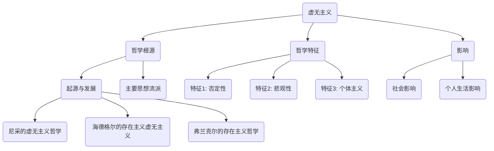

                 

# 《虚无主义与生命意义的哲学探讨》

> 关键词：虚无主义、生命意义、哲学、心理学、存在主义、海德格尔、尼采、弗兰克尔

> 摘要：本文通过探讨虚无主义的起源、发展及其在现代生活中的影响，深入分析了虚无主义与生命意义的哲学关系。通过对核心概念的剖析和算法原理讲解，结合心理学和存在主义理论，本文试图为读者提供对虚无主义与生命意义的深刻理解，并提出重构生命意义的方法和实践策略。

## 目录大纲

## 第一部分：虚无主义的起源与发展

### 第1章：虚无主义的哲学根源

#### 1.1 虚无主义的起源

- 虚无主义的起源与发展
- 虚无主义的主要思想流派

#### 1.2 虚无主义的代表人物

- 尼采的虚无主义哲学
- 海德格尔的存在主义虚无主义
- 弗兰克尔的存在主义哲学

### 第2章：虚无主义的哲学特征与影响

#### 2.1 虚无主义的哲学特征

- 虚无主义的否定性
- 虚无主义的悲观性
- 虚无主义的个体主义

#### 2.2 虚无主义的影响

- 虚无主义对社会的影响
- 虚无主义对个人生活的影响

## 第二部分：虚无主义与现代生活

### 第3章：虚无主义与现代社会的冲突

#### 3.1 虚无主义与现代生活的冲突

- 现代社会中的虚无主义现象
- 虚无主义对个人生活的冲击

#### 3.2 虚无主义与现代生活方式

- 现代生活方式中的虚无主义倾向
- 虚无主义对现代社会价值观的挑战

### 第4章：虚无主义与个人心灵的救赎

#### 4.1 虚无主义的个人救赎之路

- 虚无主义下的个人救赎之路
- 虚无主义对个人心灵的救赎意义

#### 4.2 虚无主义下的心灵成长

- 虚无主义下的心灵成长策略
- 虚无主义下的心灵成长案例

## 第三部分：虚无主义与生命意义的重构

### 第5章：虚无主义下的生命意义重建

#### 5.1 重建生命意义的方法

- 存在主义心理学的方法
- 精神分析的方法
- 信仰重建的方法

#### 5.2 生命意义重建的实践

- 生命意义重建的实践案例
- 生命意义重建的实践意义

### 第6章：虚无主义与未来哲学

#### 6.1 虚无主义对未来哲学的影响

- 虚无主义对未来哲学的挑战
- 虚无主义对未来哲学的发展方向

#### 6.2 未来哲学的应对策略

- 未来哲学的应对策略
- 虚无主义与未来哲学的关系

### 第7章：结论

#### 7.1 虚无主义与生命意义的哲学探讨总结

- 虚无主义的哲学探讨的意义
- 生命意义哲学探讨的展望

## 附录

### 附录A：虚无主义与生命意义的哲学著作推荐

- 经典哲学著作推荐
- 近年来的新研究著作推荐

### 附录B：虚无主义与生命意义的哲学案例分析

- 虚无主义与生命意义的哲学案例分析
- 案例分析的启示与思考

[流程图：虚无主义的核心概念与联系](https://mermaid-js.github.io/mermaid-live-editor/edit/eyJjb2RlIjoic2VsZlwiLCJtZXRyaXRlcm4iOiJkZWZhdWx0In0%3D)

```markdown

```

接下来，我们将按照大纲结构逐步展开讨论。让我们开始第一部分：虚无主义的起源与发展。|>

