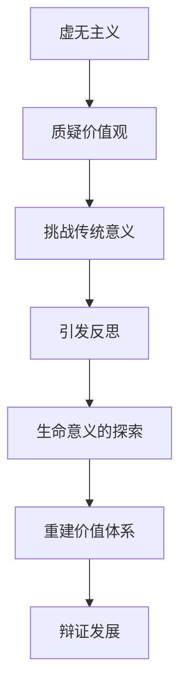

                 

## 引言

### 背景介绍

虚无主义（Nihilism）与生命意义（Life Meaning）是哲学领域中的两个重要概念，它们在历史和当代社会中扮演着至关重要的角色。虚无主义起源于19世纪的西方哲学，其核心观点是质疑一切价值的存在，认为人类生活缺乏内在的、绝对的意义。生命意义则是对个体存在价值的探究，关乎人们如何定义自己的生命目的和追求。

在现代社会，虚无主义的思想在一定程度上影响了人们的价值观和行为模式。随着科技进步和社会变迁，许多人开始感到生活缺乏意义和目标，进而产生了对生命意义的深刻反思。这种反思不仅涉及哲学和宗教层面，还延伸到心理学、社会学和日常生活各个领域。

本文旨在探讨虚无主义与生命意义的辩证关系，通过逻辑清晰的分析和实例验证，深入理解两者之间的相互作用及其对社会和个人带来的影响。我们将从以下几个层面展开讨论：

1. **虚无主义的起源与发展**：回顾虚无主义的历史演变，分析其主要特征和影响。
2. **生命意义的哲学探讨**：探讨生命意义的本质、多样性和哲学视角。
3. **虚无主义与生命意义的辩证关系**：分析两者之间的理论联系和现实意义。
4. **深入探讨辩证关系的不同方面**：探讨虚无主义的消解与生命意义的重建、文化背景下的辩证关系以及现代社会中的辩证关系。
5. **实际案例与分析**：通过具体案例展示虚无主义与生命意义的辩证关系在现实中的应用。
6. **总结与展望**：总结本文的主要观点，并对未来研究方向进行展望。

通过以上几个步骤，我们将逐步揭示虚无主义与生命意义之间的复杂辩证关系，为读者提供深刻的哲学思考和现实指导。

### 核心概念与联系

为了深入探讨虚无主义与生命意义的辩证关系，我们首先需要明确这两个核心概念的定义及其内在联系。

#### 虚无主义的定义与特征

虚无主义（Nihilism）是一种哲学思想，起源于19世纪，主要观点是质疑一切价值的存在，认为人类生活缺乏内在的、绝对的意义。虚无主义的定义可以从多个角度进行解读：

1. **哲学定义**：虚无主义通常被描述为一种认为没有客观的道德、美学或宗教价值存在的立场。它主张人类和社会行为的价值标准是主观建构的，没有超越的权威可以裁定这些标准。
   
2. **历史定义**：虚无主义的历史演变可以追溯到古代哲学中的怀疑主义和怀疑论。这些思想流派对传统价值观提出了质疑，但真正意义上的虚无主义出现在19世纪的西方哲学中，特别是在尼采的作品中得到了系统的阐述。

3. **主要特征**：虚无主义的主要特征包括：
   - **怀疑主义**：对传统信仰和价值进行质疑和批判。
   - **主观主义**：强调个体主观体验的重要性，否认普遍的、绝对的价值标准。
   - **悲观主义**：认为人类生活缺乏意义和目的，可能导致精神危机和道德滑坡。

#### 生命意义的定义与本质

生命意义（Life Meaning）是对个体存在价值的探究，关乎人们如何定义自己的生命目的和追求。生命意义的本质可以从多个哲学视角进行理解：

1. **存在主义视角**：存在主义认为生命意义不是预先设定的，而是个体在自由选择中自我创造和定义的。萨特和海德格尔等存在主义哲学家强调个体自由和主观体验在生命意义构建中的核心作用。

2. **道德哲学视角**：道德哲学探讨个体行为和价值观的道德标准，生命意义通常与道德追求和社会责任联系在一起。道德哲学家如康德和功利主义者提供不同的视角来探讨生命意义的实现。

3. **宗教哲学视角**：宗教哲学认为生命意义与个体的精神追求和神的关系密切相关。宗教信仰提供了一种超越现实的道德和价值观框架，为个体提供生命目的和意义。

#### 虚无主义与生命意义的联系

虚无主义与生命意义之间的辩证关系可以从以下几个方面进行理解：

1. **相互排斥性**：虚无主义质疑生命意义的存在，认为生活缺乏内在目的和价值。从这一角度来看，虚无主义和生命意义似乎是对立的。然而，这种对立并非绝对的，因为虚无主义本身也涉及到对生命意义的重新定义和探索。

2. **相互依存性**：生命意义的构建往往受到虚无主义思想的影响。面对虚无主义的质疑，人们需要寻找新的价值观和生命目的，这促使了对生命意义的深入探讨和重新审视。

3. **辩证发展**：虚无主义和生命意义的关系具有辩证发展的特性。虚无主义的质疑可以激发对生命意义的反思和重构，从而推动社会和个人的进步。

为了更好地理解虚无主义与生命意义之间的辩证关系，我们引入一个Mermaid流程图来展示这两个概念之间的关系架构：

在这个流程图中，虚无主义通过质疑传统价值观和挑战现有的生命意义，引发了个体和社会对生命意义的深入反思。这种反思促使人们探索新的价值体系，进而实现虚无主义与生命意义之间的辩证发展。

通过以上对核心概念的定义和联系的探讨，我们为后续章节的深入分析奠定了基础。在接下来的部分中，我们将进一步探讨虚无主义的历史演变和生命意义的哲学探讨，为理解两者之间的辩证关系提供更全面的视角。

### 第1章：虚无主义的起源与发展

#### 1.1 虚无主义的定义与特征

虚无主义（Nihilism）作为一种哲学思想，起源于19世纪，主要源于对传统价值观的质疑和否定。其核心观点是认为人类生活缺乏内在的、绝对的意义，传统的宗教、道德和社会规范失去了其权威性。虚无主义的定义可以从多个角度进行解读：

**哲学定义**：
虚无主义通常被描述为一种认为没有客观的道德、美学或宗教价值存在的立场。它主张人类和社会行为的价值标准是主观建构的，没有超越的权威可以裁定这些标准。这种观点认为，人类行为和存在的意义并非由某种超越力量所赋予，而是个体自我创造的产物。

**历史定义**：
虚无主义的历史演变可以追溯到古代哲学中的怀疑主义和怀疑论。这些思想流派对传统价值观提出了质疑，但真正意义上的虚无主义出现在19世纪的西方哲学中。在19世纪，随着工业革命和科技进步，社会结构和文化价值观发生了巨大变革，这为虚无主义的兴起提供了土壤。

19世纪的主要虚无主义思想家包括俄国哲学家尼采（Friedrich Nietzsche）和德国哲学家费尔巴哈（Ludwig Feuerbach）。尼采在其著作中，通过批判基督教道德和形而上学，提出“上帝已死”的观点，强调个体意志和自我创造的重要性。费尔巴哈则通过人本主义哲学，强调人类自身是意义的创造者，从而质疑了传统宗教和道德的权威。

**主要特征**：
虚无主义的主要特征包括：

1. **怀疑主义**：对传统信仰和价值进行质疑和批判。虚无主义认为，传统的宗教、道德和社会规范并非不可动摇的真理，而是由人类自身创造和选择的。

2. **主观主义**：强调个体主观体验的重要性，否认普遍的、绝对的价值标准。虚无主义认为，人类的价值标准是主观建构的，不存在一种适用于所有人的绝对价值体系。

3. **悲观主义**：认为人类生活缺乏意义和目的，可能导致精神危机和道德滑坡。虚无主义强调，由于缺乏内在的意义，人类的生活可能会变得空虚和无聊。

#### 1.2 虚无主义的历史演变

虚无主义的思想在历史上经历了多个发展阶段，每个阶段都有其特定的哲学背景和社会影响：

**古代哲学**：
虚无主义的萌芽可以追溯到古希腊哲学中的怀疑主义和怀疑论。这些思想流派质疑传统价值观和信仰，为后来的虚无主义思想奠定了基础。例如，苏格拉底和普罗泰戈拉的思想中就包含了质疑权威和探索真理的元素。

**中世纪哲学**：
在中世纪，虚无主义思想并未占据主导地位，但一些哲学家如奥古斯丁（Saint Augustine）和托马斯·阿奎那（Thomas Aquinas）对传统信仰进行了深刻的批判和反思，这为后来的虚无主义思想提供了理论基础。

**19世纪**：
19世纪是虚无主义思想真正兴起的时代。工业革命和科技进步导致社会结构的剧烈变革，传统价值观和宗教信仰受到了严重挑战。尼采和费尔巴哈是这一时期的重要虚无主义思想家，他们的作品深刻影响了后来的哲学家和社会思想。

**现代虚无主义**：
现代虚无主义在20世纪得到了进一步发展，特别是在俄国和东欧地区。例如，陀思妥耶夫斯基（Fyodor Dostoevsky）的作品探讨了人类存在的意义和虚无主义的困境。现代虚无主义还涉及了对科学和技术的批判，强调人类自身的价值和意义。

#### 1.3 虚无主义对现代社会的冲击

虚无主义对现代社会产生了深远的影响，特别是在价值观、心理和社会层面：

**价值观的挑战**：
虚无主义质疑传统的道德和宗教价值观，导致人们对这些价值观的信仰发生动摇。现代社会中，越来越多的年轻人开始质疑传统的家庭、婚姻和宗教信仰，追求更加个性化的生活方式。

**心理影响**：
虚无主义可能导致精神危机和抑郁。面对生活的无意义感，一些人可能会感到迷茫、焦虑和无助，导致心理健康问题。

**社会影响**：
虚无主义对社会结构和社会关系也产生了影响。在一些社会中，虚无主义思想可能导致对社会的普遍不信任和道德滑坡，影响社会的稳定和和谐。

总之，虚无主义作为一种哲学思想，对现代社会产生了深远的影响。理解虚无主义的起源和发展，有助于我们更好地应对现代社会中存在的价值观和心理问题。

### 第2章：生命意义的哲学探讨

#### 2.1 生命意义的本质

生命意义（Life Meaning）是个体存在价值的核心问题，它关乎人们如何赋予生活目的和意义。在哲学领域中，对生命意义的探讨贯穿了古今，不同的哲学流派提供了各自独特的视角和解释。

**存在主义视角**：存在主义强调生命意义的主观性和个体自由。存在主义哲学家如让-保尔·萨特（Jean-Paul Sartre）和马丁·海德格尔（Martin Heidegger）认为，生命意义并非预先设定的，而是个体在自由选择中自我创造和定义的。萨特提出，“存在先于本质”，意味着个体必须通过行动和选择来赋予自身意义。海德格尔则强调“在世存在”（Dasein），认为人的存在本身就是对生命意义的追问和探索。

**道德哲学视角**：道德哲学探讨个体行为和价值观的道德标准，生命意义通常与道德追求和社会责任联系在一起。例如，康德伦理学强调通过遵循道德法则来实现生命意义，他认为个体应该通过“道德自律”来赋予生活意义。功利主义哲学家如约翰·斯图尔特·密尔（John Stuart Mill）则认为，生命意义在于追求最大化的幸福和福祉，通过行为产生有益的结果来赋予生活意义。

**宗教哲学视角**：宗教哲学认为生命意义与个体的精神追求和神的关系密切相关。不同宗教提供了各自独特的生命意义观。例如，基督教认为，生命意义在于与上帝的关系和履行神赋予的使命；佛教则强调通过禅修和追求智慧来解脱痛苦，实现生命意义。

**多元视角**：除了上述主要哲学流派，现代哲学还提出了多种对生命意义的解释。例如，后现代主义强调解构传统价值观，认为生命意义是多元和相对的。现象学哲学家如梅洛-庞蒂（Maurice Merleau-Ponty）则强调身体经验在生命意义中的重要性。

**本质与定义**：总体来说，生命意义的本质可以理解为个体对自身存在的价值和目的的反思和追寻。这种反思不仅涉及个体内心的感受和体验，还包括个体在社会和宇宙中的角色和责任。生命意义是一个动态的过程，个体通过不断的探索和选择来赋予生活新的意义。

#### 2.2 生命意义的多样性

生命意义并非单一和固定，它在不同的文化和社会背景下呈现出多样性。这种多样性反映了人类对生命目的和价值的多元理解和追求。

**个人主义视角**：在个人主义文化中，生命意义通常与个体的自我实现和追求个人幸福紧密相关。个人主义强调个体的自由、独立和自主性，认为每个人都有权利和责任去定义自己的生命意义。例如，美国文化中，追求个人成就和实现梦想是生命意义的重要组成部分。

**社会主义视角**：在社会主义文化中，生命意义与集体利益和社会责任联系在一起。社会主义强调个体应该为社会的整体利益和进步做出贡献，认为个人的价值在于其对社会和集体的贡献。例如，在社会主义国家中，集体主义和社会责任感是生命意义的重要体现。

**全球化视角**：全球化背景下，生命意义的多样性更加显著。不同文化之间的交流和互动促使了生命意义的多元化。例如，全球化带来了不同宗教和文化价值观的碰撞和融合，人们开始从多个角度重新思考生命的意义和价值。

**文化差异视角**：文化差异对生命意义的多样性有着重要影响。不同文化对生命意义的理解和追求各不相同，这导致了生命意义的多样性和复杂性。例如，儒家文化强调家庭和社会责任，而西方文化则更加注重个人自由和自我实现。

**多样性的影响**：生命意义的多样性对个人和社会有着深远的影响。对于个人来说，生命意义的多样性提供了更多的选择和机会，使个体能够根据自身价值观和兴趣来定义自己的生活。对于社会来说，生命意义的多样性促进了社会的多元化和包容性，使不同文化和社会群体能够在尊重彼此差异的基础上共存和发展。

#### 2.3 生命意义的哲学探讨

生命意义的哲学探讨是哲学领域中的一个重要主题，不同的哲学家和哲学流派提供了丰富的理论和观点。

**马克思主义对生命意义的分析**：马克思主义认为，生命意义与社会和历史条件密切相关。马克思主义哲学强调，个体的生命意义是通过与社会和历史条件的互动和斗争中实现的。马克思和恩格斯在《共产党宣言》中提出了“自由人的联合体”的概念，认为只有在这样的社会中，个体才能真正实现自己的生命意义。

**柏拉图主义对生命意义的思考**：柏拉图主义强调超越世界的理念世界，认为生命意义在于追求真理、美和善。柏拉图认为，个体通过不断追求智慧和真理，可以实现生命的意义和目的。柏拉图的理念论提供了对生命意义的深刻哲学探讨，强调了理性思考和道德追求在生命意义中的重要性。

**存在主义对生命意义的探讨**：存在主义强调个体在生命中的自由和选择，认为生命意义是自我创造的产物。萨特和海德格尔等存在主义哲学家提出，个体必须面对存在的荒谬和无意义，通过自由选择和行动来赋予生活意义。存在主义对生命意义的探讨引发了大量关于自由、责任和存在的哲学辩论。

**现象学对生命意义的分析**：现象学强调个体对世界的直接体验，认为生命意义是个体在具体情境中的感受和理解。梅洛-庞蒂的现象学理论提出，身体经验是生命意义的核心，个体通过身体与世界的互动来体验和创造生命意义。

**多元视角**：现代哲学中，越来越多的哲学家开始探讨生命意义的多元视角。后现代主义强调解构传统价值观，认为生命意义是多元和相对的。女性主义哲学关注女性在生命意义中的独特经验和挑战。生态哲学则强调人类与自然的关系，认为生命意义不仅关乎个体，还涉及整个生态系统。

总体来说，生命意义的哲学探讨是一个丰富而复杂的领域，不同哲学家和哲学流派提供了多种视角和解释。这些探讨不仅帮助我们理解生命的本质和目的，还为个体和社会提供了不同的生命意义追求方式。

### 第3章：虚无主义与生命意义的辩证关系

#### 3.1 辩证关系的理论基础

虚无主义与生命意义之间的辩证关系基于哲学上的辩证法原理。辩证法是一种用于分析和理解现实世界复杂性的方法，强调事物之间的对立统一和不断变化。在这个框架下，虚无主义和生命意义虽然看似对立，但它们之间存在深刻的相互联系和互动。

**辩证法的基本原理**：
1. **对立统一**：辩证法认为，任何事物都包含着对立的两个方面，这两个方面相互依存、相互制约，并在一定条件下相互转化。例如，生命意义和虚无主义看似是两个对立的概念，但在现实中，它们往往交织在一起，相互影响。

2. **量变与质变**：辩证法强调，事物的变化不是线性的，而是通过量变积累到一定程度后引发质变。虚无主义和生命意义的辩证关系也是如此，当个体或社会对生命意义的探索达到一定深度时，可能会引发对传统价值观的质疑，从而形成虚无主义。

3. **否定之否定**：辩证法认为，事物的发展是通过一系列的否定和超越来实现的。虚无主义和生命意义之间的关系也体现了这种否定之否定的过程。虚无主义通过质疑和否定传统价值观，促使人们深入反思和探索新的生命意义。

**辩证关系在哲学中的地位**：
辩证法作为一种哲学方法，不仅为理解虚无主义和生命意义的关系提供了理论基础，还在更广泛的哲学领域发挥了重要作用。例如，马克思主义哲学中的辩证唯物主义就是基于辩证法原理，认为物质世界的运动和发展是通过矛盾和斗争来实现的。这种辩证法视角有助于我们理解虚无主义和生命意义在社会和历史条件下的变化和互动。

#### 3.2 辩证关系的现实意义

虚无主义与生命意义的辩证关系在现代社会中具有重要的现实意义。这种关系不仅影响了个体的心理状态和行为模式，还对社会的价值观和文化产生了深远的影响。

**对个体的影响**：
1. **精神危机**：虚无主义可能导致个体对生活意义的质疑，进而引发精神危机。面对生活的无意义感，一些人可能会感到迷茫、焦虑和无助，甚至产生自杀倾向。

2. **自我反思**：虚无主义的挑战促使个体进行深刻的自我反思，重新审视自己的价值观和生活目标。通过这种反思，一些人可能会找到新的生命意义，从而实现自我救赎和成长。

3. **心理健康**：生命意义在个体的心理健康中起着关键作用。拥有明确的生命意义可以增强个体的心理韧性，降低抑郁和焦虑的风险。因此，虚无主义和生命意义的辩证关系对个体的心理健康具有重要影响。

**对社会的影响**：
1. **价值观变革**：虚无主义质疑传统价值观，可能导致社会价值观的变革。这种变革可能会带来社会进步，但也可能引发道德滑坡和社会不稳定。

2. **文化多样**：虚无主义和生命意义的辩证关系促进了文化的多样性和多元化。不同文化和社会背景下，人们对生命意义的理解各不相同，这种多样性有助于丰富社会文化的内涵。

3. **社会运动**：虚无主义和生命意义的辩证关系激发了一系列社会运动和思潮，如存在主义和后现代主义。这些运动和思潮不仅反映了人们对生命意义的探索，还推动了社会的变革和发展。

**现实意义的总结**：虚无主义与生命意义的辩证关系在现代社会中具有深远的影响。它不仅影响了个体的心理健康和社会价值观，还推动了社会的多元化和进步。理解这种辩证关系有助于我们更好地应对现代社会中的各种挑战，实现个人和社会的全面发展。

#### 3.3 虚无主义与生命意义的社会影响

虚无主义与生命意义的辩证关系在社会层面产生了广泛而深远的影响，这些影响体现在多个方面，包括文化、教育、政治和经济等领域。

**文化影响**：
虚无主义的思想挑战了传统的文化价值观，促使人们重新审视和评价现有的文化规范和传统。在文学、艺术和电影等文化领域，虚无主义常常被视为一种反思现实的工具，通过揭示生活的无意义和荒诞来引发观众的共鸣。例如，尼采的作品《查拉图斯特拉如是说》和电影《一树山》都体现了虚无主义的主题，通过深刻描绘人物内心的困惑和无意义感，挑战了传统的道德观和价值观。

**教育影响**：
在教育领域，虚无主义的思想影响了教师和学生的思维方式。一方面，虚无主义可能导致学生对学习和知识的怀疑，从而影响教育效果。另一方面，教育工作者也需要应对虚无主义带来的挑战，通过引导和启发学生来寻找和创造生命的意义。例如，存在主义教育理论强调教育应该关注个体的自我实现和人生意义的探索，通过培养学生的批判性思维和自我意识，帮助他们克服虚无主义的消极影响。

**政治影响**：
虚无主义对政治领域也产生了重要影响。在政治哲学中，虚无主义质疑政治制度和政治理念的合法性，可能导致对权威和体制的挑战。例如，尼采的“超人哲学”提出了对传统政治权威的质疑，主张通过个体意志的力量来塑造新的政治秩序。然而，虚无主义也可能被极端主义和独裁主义利用，成为破坏社会稳定和秩序的借口。

**经济影响**：
经济领域中的虚无主义思想体现在对市场和经济的质疑上。一些人认为，市场经济体系可能导致资源分配的不公平和社会不平等，从而引发对经济制度的质疑。例如，马克思主义认为，资本主义经济制度是虚无主义的一种表现，因为它忽视了劳动者的价值和生活的意义，导致社会贫富差距的扩大。然而，经济领域的虚无主义也可能导致对经济发展的不信任，阻碍创新和进步。

**综合影响**：
虚无主义与生命意义的辩证关系在社会各个方面都产生了深远的影响。它不仅挑战了传统的价值观和制度，还激发了人们对生命意义的深刻反思和探索。这种辩证关系促使社会不断进行自我调整和变革，以适应新的现实和需求。同时，它也为社会提供了新的思考和行动方向，帮助个体和社会在面临虚无主义的挑战时找到新的生命意义和价值观。

通过以上分析，我们可以看到，虚无主义与生命意义的辩证关系在社会各个层面都具有重要的意义。理解这种关系有助于我们更好地应对现代社会中的各种挑战，推动个人和社会的全面发展。

### 第4章：虚无主义的消解与生命意义的重建

#### 4.1 虚无主义的消解途径

虚无主义的消解是寻找和重建生命意义的重要步骤。为了克服虚无主义的消极影响，个体和社会可以采取多种途径来消解虚无主义，重新定义生命的意义。

**个体层面的消解途径**：

1. **自我反思**：个体可以通过自我反思来识别和克服虚无主义。通过深入思考自己的价值观、信仰和生活目标，个体可以重新找到生命的意义。自我反思可以帮助个体认识到生活的无意义并非不可改变，而是可以通过积极的行动和思考来克服。

2. **心理治疗**：心理治疗，如认知行为疗法（CBT）和存在主义心理治疗，可以帮助个体处理虚无主义带来的心理问题。通过专业的心理辅导，个体可以学会应对生活中的困难和挑战，找到新的生活目标和意义。

3. **建立目标和意义**：个体可以通过设定具体的目标和计划来重建生命的意义。这种目标可以是职业上的成就、个人成长、志愿服务或者对社会的贡献。通过实现这些目标，个体可以体验到成就感和满足感，从而克服虚无主义。

**社会层面的消解途径**：

1. **教育改革**：教育系统可以通过提供多样化的教育内容和课程，帮助学生建立正确的价值观和人生目标。例如，通过引入存在主义、伦理学和心理学等课程，教育可以培养学生的批判性思维和自我意识，帮助他们理解生命的意义。

2. **社会支持网络**：建立强大的社会支持网络可以帮助个体克服虚无主义。这种支持可以来自家庭、朋友、社区和宗教组织。通过分享经验和提供帮助，社会支持网络可以为个体提供情感上的支持和实际上的援助。

3. **文化多样性与包容性**：社会可以通过促进文化多样性和包容性来缓解虚无主义的影响。通过尊重和理解不同的文化和价值观，社会可以为个体提供更多的选择和机会，帮助他们找到适合自己的生命意义。

**综合策略**：

1. **平衡个人与集体**：在消解虚无主义的过程中，需要平衡个人和集体的需求。个体需要在追求个人目标的同时，关注社会和集体的利益。通过这种平衡，个体可以在实现个人价值的同时，也为社会做出贡献，从而找到更深层次的生命意义。

2. **积极的价值观传播**：社会可以通过媒体、教育和公共演讲等渠道，传播积极的价值观和人生观。这种传播可以鼓励人们面对生活中的困难时保持乐观和积极，从而减少虚无主义的影响。

3. **社区参与**：社区参与是重建生命意义的重要途径。通过参与社区活动、志愿服务和公共事务，个体可以感受到自己的存在价值和社会责任，从而克服虚无主义。

总之，虚无主义的消解与生命意义的重建需要个体和社会共同努力。通过自我反思、心理治疗、教育改革、社会支持网络和文化多样性的综合策略，我们可以逐步克服虚无主义的消极影响，找到新的生命意义，实现个人和社会的全面发展。

### 4.2 生命意义的重建策略

在虚无主义的阴影下，重建生命意义成为一项紧迫的任务。为了实现这一目标，个体和社会可以采取多种策略，通过自我实现、心理疗法和文化教育等多方面努力，共同构建一个有意义的人生。

**自我实现的路径**：

自我实现是重建生命意义的重要策略之一。它强调个体通过追求个人潜力和实现自我价值来赋予生活意义。自我实现的理论基础可以追溯到马斯洛的需求层次理论，该理论认为，人们在满足基本生理需求后，会追求自我实现和自我价值的实现。

1. **设定个人目标**：自我实现的第一步是设定清晰的个人目标。这些目标可以是职业上的、学术上的或个人兴趣相关的。通过设定具体、可衡量的目标，个体可以明确自己的追求方向，并为实现这些目标而努力。

2. **终身学习**：终身学习是自我实现的关键。通过不断学习新知识和技能，个体可以提升自我价值，同时为社会的进步做出贡献。学习不仅包括学术知识，还包括生活技能、人际关系和情感管理。

3. **发展个人潜力**：每个人都有独特的潜力和才能。通过自我探索和成长，个体可以发现自己真正热爱和擅长的事物，并通过不断努力，将这些潜力转化为实际成就。

**心理疗法的角色**：

心理疗法在重建生命意义中发挥着重要作用，特别是在处理虚无主义带来的心理困扰时。心理疗法不仅帮助个体识别和克服内心的负面情绪，还指导个体如何建立积极的生活态度和价值观。

1. **认知行为疗法（CBT）**：认知行为疗法是一种广泛应用的心理学治疗方法，它帮助个体识别和改变消极的思维模式。通过认知重塑，个体可以建立更加积极和现实的观点，从而减少虚无主义的负面影响。

2. **存在主义疗法**：存在主义疗法强调个体的自由意志和存在的意义。通过探讨个体的生活目的、价值观和人生选择，存在主义疗法帮助个体找到自己的生命意义，并克服存在的孤独和无意义感。

3. **情感支持**：情感支持是心理疗法的重要组成部分。通过建立安全和支持的治疗环境，心理治疗师可以帮助个体表达内心的情感，并找到有效的方法来应对生活中的挑战。

**文化教育的推动**：

文化教育在重建生命意义中扮演着关键角色。通过教育，个体和社会可以培养积极的人生观和价值观，从而增强对生命的认同感和幸福感。

1. **哲学教育**：哲学教育可以帮助个体深入思考生命的意义和价值。通过学习不同哲学流派的观点，个体可以拓宽自己的思维视野，找到适合自己的生命意义。

2. **道德教育**：道德教育强调个体在社会中的责任和角色。通过培养道德意识和责任感，个体可以更好地理解自己的存在意义，并为自己和社会做出积极贡献。

3. **跨文化教育**：跨文化教育可以促进文化多样性和包容性，帮助个体理解和尊重不同的文化价值观。这种理解有助于个体在全球化的背景下找到自己的定位，从而增强对生命的认同感和归属感。

**综合策略的实施**：

为了有效重建生命意义，个体和社会需要采取综合策略，将自我实现、心理疗法和文化教育相结合。

1. **个人层面的综合策略**：个体可以通过设定个人目标、终身学习和参与社区活动来促进自我实现。同时，通过寻求专业的心理治疗和支持，个体可以克服内心的障碍，找到新的生命意义。

2. **社会层面的综合策略**：社会可以通过教育改革、文化推广和社会支持网络的建立来促进生命意义的重建。通过提供多样化的教育资源和文化活动，社会可以为个体提供更多的选择和机会，帮助他们在面对虚无主义时找到自己的方向。

3. **跨领域的合作**：个体和社会需要跨领域的合作，共同推动生命意义的重建。例如，教育机构可以与医疗机构和文化组织合作，提供综合性的教育和心理支持，帮助个体在多个层面重建生命的意义。

总之，虚无主义的消解与生命意义的重建是一个复杂而长期的过程。通过自我实现、心理疗法和文化教育的综合策略，个体和社会可以共同应对虚无主义的挑战，找到新的生命意义，实现个人和集体的全面发展。

### 4.3 虚无主义与生命意义的平衡

虚无主义与生命意义的平衡是一个动态的过程，涉及到个体与社会的多重互动。要实现这种平衡，需要从不同层面进行深入的探讨和策略的实施。

**个体层面**：

1. **自我意识**：个体需要增强自我意识，明确自己的价值观和生命目标。通过自我反思，个体可以更好地理解虚无主义对自己的影响，并找到应对策略。例如，个体可以通过冥想、日记和心理咨询等方式，提高自我意识，找到内心的平衡点。

2. **积极生活**：个体应积极投身于有意义的活动，如志愿服务、爱好和职业发展。通过这些活动，个体可以体验到成就感和社会归属感，从而减少虚无主义的影响。例如，一个人可以通过参与社区活动，帮助他人，从而感受到自己的价值和存在的意义。

3. **心理健康**：维护心理健康是平衡虚无主义与生命意义的关键。个体可以通过定期进行体育锻炼、健康饮食和保持良好的作息时间来增强身心健康。同时，个体应学会应对压力和挫折，通过心理咨询和专业治疗，解决内心的困扰。

**社会层面**：

1. **文化引导**：社会应通过媒体、教育和公共活动，推广积极的文化价值观，帮助个体建立正确的生命观。例如，通过宣传成功案例和正能量的故事，社会可以鼓励个体面对生活中的挑战，找到生命意义。

2. **支持体系**：社会应建立完善的支持体系，为个体提供心理和社会支持。例如，建立心理健康热线、社区支持小组和职业咨询服务，帮助个体在面临虚无主义时获得帮助和指导。

3. **政策引导**：政府可以通过制定相关政策，推动社会的发展和进步，为个体创造更多的机会和条件。例如，通过改善教育和就业机会，政府可以帮助个体实现自我价值，减少虚无主义的影响。

**动态平衡**：

1. **反思与调整**：个体和社会需要不断地进行反思和调整，以适应不断变化的环境。通过定期评估自己的生命状态和价值观，个体和社会可以及时发现问题，并采取相应的措施进行修正。

2. **互动与交流**：个体和社会之间的互动和交流是实现平衡的重要途径。通过分享经验、观点和建议，个体可以从中获得启发，社会可以更好地了解个体的需求和挑战，从而提供更加有效的支持。

3. **创新与发展**：个体和社会应积极追求创新和发展，不断探索新的生命意义和价值观。通过创新，个体和社会可以应对虚无主义的挑战，找到新的发展方向和目标。

总之，虚无主义与生命意义的平衡是一个复杂而动态的过程，需要个体与社会的共同努力。通过自我意识、积极生活、心理健康、文化引导、支持体系和政策引导等多方面的策略，个体和社会可以逐步实现平衡，找到新的生命意义，实现个人和集体的全面发展。

### 第5章：文化背景下的辩证关系

#### 5.1 不同文化对虚无主义和生命意义的理解

虚无主义和生命意义在不同文化背景下的理解存在显著差异，这些差异反映了不同文化对价值观、生活目标和存在意义的独特看法。

**西方文化中的理解**：

在西方文化中，虚无主义常常与个人自由、自我实现和道德相对主义的观念相联系。例如，尼采的哲学强调个体的自我超越和无意义的生活状态，而萨特的存在主义则探讨了个体在自由选择中的存在意义。在西方文化中，生命意义往往被理解为个人追求幸福、实现自我潜力和建立有意义的人际关系的综合。

**东方文化中的理解**：

在东方文化中，尤其是儒家、道家和佛教等哲学体系中，虚无主义和生命意义的理解有所不同。儒家强调社会的责任和义务，认为个体应通过修身齐家治国平天下来实现生命的意义。道家则强调顺应自然和内在的道德修养，认为通过内在的宁静和自我反省，个体可以找到生命的意义。佛教则强调解脱和悟道，认为通过修行和禅定，个体可以达到心灵的超越，实现生命的意义。

**跨文化视角下的辩证关系**：

跨文化视角下的虚无主义和生命意义的辩证关系体现在不同文化之间的互动和融合中。全球化使得不同文化相互影响，这种互动促使了新的理解和解释。

1. **文化融合**：随着全球化，不同文化开始相互融合，形成了新的文化混合体。在这种背景下，虚无主义和生命意义的理解变得更加复杂和多元。例如，在美国，多元文化的共存使得人们对生命意义的理解更加包容和开放，同时，这种多元性也带来了一定的挑战，如文化冲突和价值观的冲突。

2. **文化适应**：在全球化过程中，个体和文化群体需要适应新的环境和价值观。这种适应过程中，虚无主义和生命意义的理解发生了变化。例如，一些移民在新的文化环境中可能面临对传统价值观的质疑和对新生命意义的探索。

3. **文化比较**：通过文化比较，可以更好地理解虚无主义和生命意义的多样性和共同点。例如，儒家文化和存在主义哲学在探讨个体与社会的关系、道德责任和自由选择方面有相似之处，同时也存在明显的差异。

**文化差异对辩证关系的影响**：

文化差异对虚无主义和生命意义的辩证关系产生了深远的影响。

1. **价值观的多样性**：文化差异导致了价值观的多样性，这种多样性在个体和社会层面上都表现得尤为明显。例如，在多元文化的社会中，不同文化背景的个体可能持有不同的生命意义观，这种多样性使得社会更加多元化和复杂。

2. **社会冲突**：文化差异可能导致社会冲突，特别是在涉及道德、宗教和社会价值观的领域。例如，在一些多元文化社会中，不同文化背景的群体可能因为对生命意义的理解不同而产生冲突。

3. **文化融合的挑战**：全球化带来了文化融合的机遇，但也带来了挑战。在文化融合过程中，如何平衡不同文化的价值观和生命意义观是一个重要的课题。这种平衡需要通过对话、理解和包容来实现。

总之，不同文化对虚无主义和生命意义的理解存在显著差异，这些差异反映了不同文化对价值观、生活目标和存在意义的独特看法。跨文化视角下的辩证关系不仅体现在文化之间的互动和融合中，还影响了社会冲突和文化融合的进程。理解这种辩证关系有助于我们更好地应对全球化背景下的挑战，实现个人和社会的全面发展。

#### 5.2 跨文化视角下的辩证关系

在跨文化视角下，虚无主义与生命意义的辩证关系呈现出多样化和复杂化的特点。全球化进程加速了不同文化之间的交流和互动，使得虚无主义和生命意义的理解变得更加丰富和多元。

**文化互动**：
全球化带来了不同文化之间的频繁互动，这种互动促进了虚无主义和生命意义的跨文化理解。例如，西方的虚无主义思想通过文学作品、哲学著作和电影等形式传播到东方，而东方的哲学和宗教观念也影响了西方对生命意义的探讨。这种文化互动使得不同文化背景的人们能够更全面地理解虚无主义和生命意义，从而实现跨文化的对话和交流。

**价值观融合**：
在全球化背景下，不同文化之间的价值观开始发生融合。例如，儒家文化中的家庭责任和社会义务与西方存在主义中的自我实现和自由选择观念相互融合，形成了新的生命意义观。这种价值观的融合有助于构建一个更加包容和多元化的社会，使得个体能够在多元文化的环境中找到自己的定位和意义。

**文化冲突**：
尽管文化互动和价值观融合促进了跨文化理解，但文化差异也导致了文化冲突。例如，在一些多元文化社区中，不同文化背景的个体可能因为对生命意义的理解不同而产生冲突。这种冲突可能表现在道德、宗教和社会价值观的领域，例如关于婚姻、教育和社会责任的分歧。

**跨文化辩证关系**：
跨文化视角下的虚无主义与生命意义的辩证关系具有以下特点：

1. **互补性**：不同文化对虚无主义和生命意义的理解具有互补性。例如，西方的理性主义和科学方法有助于揭示自然和宇宙的奥秘，而东方的直觉和哲学思考则提供了对人类存在的更深层次的理解。

2. **冲突与融合**：在跨文化视角下，虚无主义和生命意义的辩证关系不仅体现在冲突中，也体现在融合中。通过对话和交流，不同文化可以相互借鉴和融合，形成新的理解和价值观。

3. **动态性**：跨文化视角下的辩证关系是动态的，随着全球化进程的推进，不同文化之间的交流和互动不断变化。这种动态性使得虚无主义和生命意义的理解也在不断演变，形成新的理论和实践。

总之，跨文化视角下的虚无主义与生命意义的辩证关系是一个复杂而动态的过程。通过文化互动、价值观融合和跨文化辩证关系，不同文化背景的人们能够更全面地理解虚无主义和生命意义，从而在全球化背景下实现个人和社会的全面发展。

#### 5.3 文化差异对辩证关系的影响

文化差异对虚无主义与生命意义的辩证关系产生了深远的影响。不同文化背景下，人们对于虚无主义和生命意义的理解存在显著差异，这些差异不仅影响了个体价值观的形成，也对整个社会的价值观体系产生了重要影响。

**价值观的形成**：

1. **东方文化中的价值观**：在东方文化中，尤其是儒家和佛教传统中，强调集体主义、家庭责任和社会义务。这种文化背景下，人们倾向于认为生命意义在于为家庭和社会做出贡献。例如，儒家思想强调“修身齐家治国平天下”，认为个人的价值和意义是通过履行社会责任来实现的。与此相比，虚无主义在东方文化中往往被视为一种消极的思想，因为它质疑传统价值观和社会规范。

2. **西方文化中的价值观**：在西方文化中，个人主义和自我实现是核心价值观。存在主义哲学强调个体自由和自我创造，认为生命意义是通过个体的选择和行动来实现的。在这种文化背景下，虚无主义被视为一种对传统价值观的批判和反思，它挑战了宗教、道德和社会规范的权威性。西方文化中的虚无主义往往与个人自由和自主性的追求紧密相关。

**社会价值观体系**：

1. **东方社会**：在东方社会，文化差异对虚无主义与生命意义的辩证关系的影响主要体现在对传统价值观的坚持和传承上。例如，儒家文化强调家庭的纽带和社会责任，这使得东方社会在社会稳定和传统价值观的维护上具有较强的一致性。然而，这也可能导致对个人自由和创新的限制，使个体在面对虚无主义时缺乏足够的应对机制。

2. **西方社会**：在西方社会，个人主义和自由价值观的强调使得个体在面对虚无主义时具有更多的选择和自由。这种文化背景下的虚无主义往往被视为对个体自由和自主性的挑战，促使个体进行自我反思和价值观的重塑。然而，这也可能导致社会价值观的多元化，甚至导致道德滑坡和社会不稳定。

**文化差异的具体影响**：

1. **冲突与融合**：文化差异可能导致对虚无主义和生命意义的理解产生冲突。例如，在多元文化社区中，不同文化背景的个体可能因为对生命意义的理解不同而产生分歧。然而，通过交流和对话，这些冲突也可以转化为融合的机会，形成新的理解和价值观。

2. **适应与创新**：文化差异迫使个体和社会在适应新的文化和价值观时进行创新。例如，全球化背景下，个体需要适应不同文化的价值观和生活方式，这种适应过程促进了个人成长和社会进步。同时，创新也使得社会能够更好地应对虚无主义的挑战，找到新的生命意义。

总之，文化差异对虚无主义与生命意义的辩证关系产生了深远的影响，既包括价值观的形成和社会价值观体系的变化，也包括具体的文化冲突与融合、适应与创新的动态过程。理解这些差异和影响有助于我们更好地应对全球化背景下的挑战，实现个人和社会的全面发展。

### 第6章：虚无主义与生命意义的辩证关系在当代社会中的体现

#### 6.1 社会现象的案例分析

虚无主义与生命意义的辩证关系在当代社会中通过各种社会现象得到了体现，这些现象反映了个体和社会在面对虚无主义和寻找生命意义时的复杂互动。

**案例1：青少年自杀现象**：

近年来，青少年自杀现象在全球范围内呈现出上升趋势。这种现象的背后，往往隐藏着对生命意义的质疑和寻求。一些青少年在面对学业压力、人际关系困境和社会期望时，感到生活缺乏意义和价值，从而产生自杀的念头。这种虚无主义的感受可能源于传统价值观的动摇和现代社会快速变化带来的不确定性。

**解决方案**：通过心理干预和社会支持，可以缓解青少年的虚无主义感受。学校和家庭应提供更多的心理健康教育和心理咨询，帮助青少年建立积极的生活态度和价值观。同时，社会也应提供更多的社会支持和资源，如社区活动、青少年服务中心和志愿者项目，以增强青少年的社会归属感和生命意义感。

**案例2：网络成瘾问题**：

随着互联网的普及，网络成瘾成为现代社会的一个重要问题。许多人通过虚拟世界来逃避现实生活中的无意义感。网络成瘾不仅影响了个体的心理健康，也对社会产生了负面影响。这种现象反映了虚无主义对个体行为的引导，个体在现实生活中找不到满足和意义，从而转向虚拟世界寻求逃避和替代。

**解决方案**：针对网络成瘾问题，需要从个体和社会两个层面进行干预。个体层面，通过心理治疗和自我控制训练，帮助个体认识到网络成瘾的危害，并逐步减少上网时间。社会层面，可以通过制定相关政策和法规，限制未成年人的网络使用，同时提供更多的健康娱乐活动和社会参与机会，以引导个体从虚拟世界中走出来，重建现实生活的意义。

**案例3：社会不平等现象**：

社会不平等现象在许多国家和地区普遍存在，它不仅影响了社会的公平性，也导致了一部分人对生命意义的质疑。例如，贫富差距、教育资源的不公平和社会阶层的固化，使得一些个体感到自己的生活缺乏价值和意义。这种现象反映了虚无主义在社会层面的体现，个体在追求平等和正义的过程中感受到挫败和无力。

**解决方案**：为了解决社会不平等现象，需要从政策、教育和经济等多个层面进行改革。政策层面，政府应制定更加公平的税收和社会保障政策，缩小贫富差距。教育层面，应提供公平的教育资源，帮助每个个体都有机会实现自我价值。经济层面，应鼓励企业社会责任，推动经济公平和社会正义的实现。

**案例4：环保运动**：

环保运动在当代社会中日益兴起，它反映了人们对生命意义的重新审视和追求。面对气候变化和环境污染等全球性挑战，许多人开始意识到人类行为对地球的影响，并积极参与环保行动。这种环保意识不仅是对生命意义的探索，也是对虚无主义的回应，通过实际行动赋予生活新的意义。

**解决方案**：环保运动需要更多个体的参与和社会的支持。政府和企业应加强环保政策和措施的制定和实施，同时，社会应鼓励公众参与环保活动，提高环保意识。通过集体行动，人们可以感受到自己对地球和未来世代的贡献，从而增强生命的意义感。

通过以上案例的分析，我们可以看到虚无主义与生命意义的辩证关系在当代社会中的多方面体现。理解这些现象，并采取有效的解决方案，有助于我们更好地应对虚无主义的挑战，重建生命的意义。

### 6.2 文化产品的分析

文化产品在当代社会中扮演着重要的角色，它们不仅反映了社会的价值观和审美趋势，还在一定程度上影响着人们对虚无主义和生命意义的理解和追求。通过对电影、文学作品和艺术展览等文化产品的分析，我们可以更深入地探讨虚无主义与生命意义的辩证关系。

**电影中的虚无主义与生命意义**：

电影作为一种大众文化产品，经常探讨虚无主义和生命意义的主题。例如，电影《美国精神病人》（American Psycho）通过描述一个冷酷无情的华尔街交易员的内心世界，展示了虚无主义对个人价值观的摧毁。这部电影揭示了在物欲横流的社会中，个体如何在虚无主义的阴影下迷失自我，进而引发对生命意义的反思。

另一方面，电影《当幸福来敲门》（The Pursuit of Happyness）通过主人公克里斯·加德纳（Chris Gardner）的励志故事，展示了在极端困境中，个体如何通过不懈努力找到生命的意义。这部电影鼓励观众在面对生活中的挫折时，保持积极的心态，寻找和重建生命的意义。

**文学作品中的虚无主义与生命意义**：

文学作品同样深刻地探讨了虚无主义和生命意义的主题。例如，弗朗茨·卡夫卡（Franz Kafka）的小说《变形记》（The Metamorphosis）描绘了主人公格里高尔·萨姆沙（Gregor Samsa）在变成昆虫后的痛苦和绝望。这个故事反映了个体在无法控制的环境中面临的虚无主义困境，以及对于生命意义的质疑。

相比之下，阿尔贝·加缪（Albert Camus）的《鼠疫》（The Plague）则通过描述阿尔及利亚一个小城在鼠疫肆虐下的生活，探讨了面对灾难和死亡时，个体如何找到生命的意义。小说中的主人公们在面对死亡的威胁时，通过互助和抗争，找到了生命的价值和意义。

**艺术展览中的虚无主义与生命意义**：

艺术展览通过视觉艺术的形式，传达了虚无主义和生命意义的复杂主题。例如，达米恩·奥尔特加（Damián Ortega）的装置艺术作品《跳跃》（Jumping Spider），通过将普通的物体赋予新的功能和意义，探讨了个体在现代社会中的存在状态和生命意义。

另一方面，草间弥生的《无限镜屋》（The Infinity Mirrors）展览，通过多重的镜面反射，创造出无限的空间感，使观众在无限的镜像中反思生命的意义和存在的本质。

**文化产品的分析总结**：

文化产品在探讨虚无主义和生命意义方面具有独特的优势。通过电影、文学作品和艺术展览，观众可以在不同的艺术形式中体验和思考这些复杂的主题。这些文化产品不仅反映了当代社会对虚无主义和生命意义的关注，还提供了多种视角和路径，帮助观众在日常生活中寻找和重建生命的意义。

总之，文化产品作为一种重要的文化表现形式，在揭示虚无主义与生命意义的辩证关系方面发挥着关键作用。通过深入分析这些文化产品，我们可以更全面地理解当代社会中人们如何面对虚无主义的挑战，寻找和赋予生活新的意义。

### 第7章：虚无主义与生命意义的辩证关系在个人生活中的体现

#### 7.1 个人生活案例的分析

虚无主义与生命意义的辩证关系在个人生活中有着深刻的体现，通过具体的个人生活案例，我们可以更直观地了解这种关系的复杂性和多样性。

**案例1：约翰的内心挣扎**

约翰是一名35岁的软件工程师，工作稳定但内心空虚。他对生活的意义感到迷茫，每天重复着单调的工作和生活，缺乏激情和动力。这种状态使他陷入了虚无主义的阴影，对未来的生活失去了信心。

**分析**：约翰的案例反映了虚无主义在个人生活中的体现。他的生活缺乏目标和意义，导致内心的空虚和迷茫。这种虚无主义感受可能源于对工作意义的质疑和生活缺乏激情。要解决这个问题，约翰需要重新审视自己的价值观和人生目标，通过设定具体的目标和计划，找到新的生活意义。

**解决方案**：约翰可以尝试以下方法来重建生命的意义：
1. **设定目标**：约翰可以为自己设定短期和长期的目标，例如学习新的技能、参与社区活动或追求个人爱好。通过实现这些目标，他可以体验到成就感和满足感。
2. **探索兴趣**：约翰可以尝试探索自己的兴趣和激情，参与各种活动和项目，找到自己真正热爱的事物。
3. **心理治疗**：通过心理治疗，约翰可以识别和解决内心的困惑和焦虑，找到更积极的生活方式。

**案例2：艾米的家庭困境**

艾米是一名30岁的母亲，她有两个年幼的孩子。尽管她在家庭生活中扮演着重要角色，但她的内心感到孤独和迷茫。她的丈夫工作繁忙，很少陪伴她和孩子，导致她在家庭生活中感到空虚和无意义。艾米开始怀疑自己的价值和存在意义，对生活失去了热情。

**分析**：艾米的案例反映了虚无主义在家庭关系中的体现。她在家庭中缺乏情感支持和陪伴，导致内心的空虚和迷茫。这种虚无主义感受可能源于对自身角色和价值的质疑。要解决这个问题，艾米需要通过建立更紧密的家庭关系和寻找个人支持系统来重建生活的意义。

**解决方案**：艾米可以尝试以下方法来重建生活的意义：
1. **加强家庭沟通**：艾米可以和丈夫进行深入的沟通，表达自己的感受和需求，寻求更多的家庭陪伴和情感支持。
2. **参与社区活动**：艾米可以参与社区活动，结交志同道合的朋友，建立更广泛的社会支持网络。
3. **心理咨询**：通过心理咨询，艾米可以识别和解决内心的困扰，找到更多的生活动力和意义。

**案例3：丽莎的职业挑战**

丽莎是一名40岁的项目经理，她在职业生涯中取得了显著的成就。然而，随着职位的提升，她开始感到工作带来的压力和责任越来越重，对未来的职业发展感到迷茫和不安。这种状态使她陷入虚无主义的困境，对工作和生活失去了热情。

**分析**：丽莎的案例反映了虚无主义在职业生活中的体现。她在职业生涯中面临巨大的压力和责任，导致内心的焦虑和不安。这种虚无主义感受可能源于对工作意义的质疑和对未来的不确定。要解决这个问题，丽莎需要重新审视自己的职业目标和价值观，找到新的动力和意义。

**解决方案**：丽莎可以尝试以下方法来重建职业生活的意义：
1. **设定职业目标**：丽莎可以为自己设定清晰的职业目标，例如追求职业成长、参与有意义的项目或探索新的职业领域。
2. **培养兴趣爱好**：丽莎可以在工作之余培养兴趣爱好，如参加健身、旅行或学习新技能，丰富自己的生活。
3. **寻求职业指导**：丽莎可以寻求职业指导或咨询，帮助自己找到更适合自己的职业道路和人生目标。

**总结**：

通过以上个人生活案例的分析，我们可以看到虚无主义与生命意义在个人生活中的复杂体现。面对虚无主义的挑战，个体需要通过自我反思、设定目标和寻求支持，找到新的生活意义。理解这种辩证关系有助于我们更好地应对生活中的困境，实现个人和社会的全面发展。

### 第8章：辩证关系的实践意义

#### 8.1 培养积极的人生观

虚无主义与生命意义的辩证关系在培养积极的人生观中具有重要作用。通过理解这种辩证关系，个体和社会可以更好地应对生活中的挑战，建立积极的人生观。

1. **自我认识**：个体需要通过自我反思，深入理解自己的价值观和人生目标。这种自我认识有助于个体明确自己的优势和不足，从而更好地规划人生路径。例如，通过自我反思，个体可以发现自己对生活意义的追求，进而制定实现这些目标的计划。

2. **价值观重构**：面对虚无主义的挑战，个体需要重新审视和重构自己的价值观。通过理解虚无主义与生命意义的辩证关系，个体可以认识到生活中的困境并非无法克服，而是可以通过积极的价值观和行动来解决的。例如，通过培养感恩、善良和慷慨的价值观，个体可以在困境中找到希望和动力。

3. **积极行动**：培养积极的人生观不仅需要思考，更需要行动。个体可以通过参与有意义的活动，如志愿服务、社区建设或追求个人兴趣，来实现生命的意义。例如，参与志愿服务不仅可以帮助他人，也可以增强个体的自我价值感和社会归属感。

**具体措施**：

- **设立个人目标**：个体可以设立短期和长期的目标，如学习新技能、参加社区活动或完成个人项目。这些目标有助于个体在实现过程中感受到成就感和满足感。
- **培养感恩心态**：通过记录和分享感恩的事情，个体可以培养感恩的心态，增强对生活的满足感和幸福感。
- **参与社会活动**：参与社区活动、志愿服务或公益项目，可以增强个体的社会责任感和归属感，从而在实现社会价值中找到生命的意义。

#### 8.2 提升社会幸福感

虚无主义与生命意义的辩证关系对社会幸福感的提升具有深远的影响。通过理解这种辩证关系，社会可以采取有效措施来提升整体幸福感。

1. **文化引导**：社会应通过媒体、教育和公共活动，推广积极的文化价值观和人生观。例如，通过宣传正能量故事和成功案例，社会可以鼓励个体在面对困难时保持乐观和积极，从而提升整体幸福感。

2. **心理健康支持**：社会应提供更多的心理健康支持服务，如心理咨询、心理治疗和心理健康热线。这些服务可以帮助个体识别和克服内心的困扰，提升心理韧性，从而增强幸福感。

3. **社区建设**：通过加强社区建设，社会可以促进个体的社会参与和归属感。例如，社区活动、志愿服务和邻里互动等，可以增强个体的社会联系和幸福感。

**具体措施**：

- **建立心理健康支持网络**：政府和社会组织可以建立心理健康支持网络，提供心理咨询和心理治疗服务，帮助个体解决心理健康问题。
- **推广社区活动**：通过组织社区活动，如文化展览、体育比赛和志愿者项目，社会可以促进社区成员的互动和联系，提升整体幸福感。
- **提供教育资源**：社会应提供多样化的教育资源，帮助个体掌握应对生活中困境的技能和知识，从而提升个人和集体的幸福感。

#### 8.3 促进个人成长与社会进步

虚无主义与生命意义的辩证关系不仅影响了个体的心理状态和社会幸福感，还对社会进步和个人成长具有重要意义。

1. **个体成长**：通过理解虚无主义与生命意义的辩证关系，个体可以在面对困境时找到成长的机会。例如，通过自我反思和不断学习，个体可以提升自己的认知能力和情感管理能力，从而实现个人成长。

2. **社会进步**：虚无主义与生命意义的辩证关系对社会进步也产生了积极影响。社会在面对虚无主义的挑战时，通过反思和探索，可以找到更符合时代需求的价值观和发展路径，从而实现社会进步。

3. **创新与变革**：虚无主义思想在一定程度上激发了社会的创新和变革。通过对传统价值观的质疑和反思，社会可以更灵活地适应新的环境和需求，从而推动社会的进步和发展。

**具体措施**：

- **推动教育改革**：通过引入存在主义、伦理学和心理学等课程，教育系统可以帮助学生培养批判性思维和自我意识，从而在面对虚无主义时找到成长的机会。
- **鼓励创新与创业**：政府和社会应鼓励创新和创业，为个体提供更多的发展机会和资源，从而激发社会的活力和创造力。
- **促进社会对话**：通过开展跨领域的对话和讨论，社会可以促进不同群体之间的理解和合作，共同应对虚无主义的挑战，推动社会进步。

总之，虚无主义与生命意义的辩证关系在培养积极人生观、提升社会幸福感和促进个人成长与社会进步方面具有深远的意义。通过理解和应用这种辩证关系，个体和社会可以更好地应对现代生活中的各种挑战，实现全面发展。

### 第9章：虚无主义与生命意义的辩证关系：未来展望

#### 9.1 趋势分析

虚无主义与生命意义的辩证关系在未来将继续发展，其趋势可以从社会、文化和技术三个方面进行分析。

**社会趋势**：

1. **全球化与多元化**：随着全球化进程的深入，不同文化和价值观的交流和融合将更加频繁。这种多元文化的碰撞将促使人们重新审视虚无主义和生命意义，寻找新的平衡点。

2. **社会变革**：社会变革将持续推动人们探索新的生命意义。例如，随着科技的发展，人们对生命的定义和价值观可能发生根本性的变化，从而影响虚无主义与生命意义的辩证关系。

**文化趋势**：

1. **文化融合**：文化融合将继续是未来文化发展的主要趋势。这种融合将促使不同文化背景的人们共同探讨虚无主义和生命意义，从而形成新的理解和价值观。

2. **文化自觉**：人们将更加重视自身文化的独特性和传统价值观，通过文化自觉来应对虚无主义的挑战，重建生命的意义。

**技术趋势**：

1. **人工智能与虚拟现实**：人工智能和虚拟现实技术的发展将深刻改变人们对生命的感知和定义。这些技术可能为人们提供新的体验和选择，从而影响虚无主义与生命意义的辩证关系。

2. **技术伦理**：随着技术的发展，人们对技术的伦理问题将更加关注。例如，人工智能的道德决策和虚拟现实的伦理问题将成为探讨虚无主义和生命意义的新领域。

#### 9.2 发展方向

未来虚无主义与生命意义的研究和发展方向可以从以下几个角度进行探讨：

1. **跨学科研究**：未来的研究应加强跨学科合作，结合哲学、心理学、社会学、文化和技术的视角，深入探讨虚无主义与生命意义的辩证关系。

2. **技术应用**：通过将人工智能和虚拟现实等新兴技术应用于虚无主义与生命意义的研究，可以提供更丰富的数据和分析工具，从而推动该领域的理论创新。

3. **教育整合**：将虚无主义与生命意义的教育整合到各个学科和领域中，帮助学生和公众更好地理解和应对虚无主义的挑战，实现个人和社会的全面发展。

4. **社会干预**：通过社会干预和公共政策，促进对虚无主义与生命意义的深入研究和实践，为个体和社会提供有效的支持和资源。

#### 9.3 挑战与机遇

虚无主义与生命意义的辩证关系在未来将面临诸多挑战和机遇：

**挑战**：

1. **文化冲突**：全球化和文化融合将带来文化冲突，如何平衡不同文化背景下的虚无主义与生命意义的理解和实践，将是一个重要挑战。

2. **技术风险**：技术的发展可能带来新的伦理和社会问题，例如人工智能的道德决策和虚拟现实的伦理问题，这些都需要深入的探讨和应对。

3. **心理健康问题**：虚无主义的挑战将继续影响个体的心理健康，社会需要提供有效的心理健康支持和干预措施，以应对这一挑战。

**机遇**：

1. **社会进步**：通过理解和应对虚无主义的挑战，社会可以促进个人和社会的进步，构建更健康和有意义的社会。

2. **技术创新**：新兴技术为研究和实践提供了新的工具和方法，有助于更深入地探讨虚无主义与生命意义的辩证关系。

3. **文化多样性**：文化多样性为虚无主义与生命意义的研究提供了丰富的资源和视角，有助于形成更全面和多元的理论体系。

总之，虚无主义与生命意义的辩证关系在未来将继续发展，面临诸多挑战和机遇。通过跨学科研究、技术应用和社会干预，我们可以更好地理解和应对这一复杂的关系，推动个人和社会的全面发展。

### 结论

通过对虚无主义与生命意义的辩证关系的深入探讨，我们可以看到，这两个概念在现代社会中具有重要的意义。虚无主义作为一种哲学思想，挑战了传统价值观和道德规范，引发了人们对生活意义和目的的深刻反思。生命意义则是对个体存在价值的探究，关乎人们如何赋予生活目的和追求。

本文从多个角度分析了虚无主义与生命意义的关系，包括历史演变、哲学探讨、辩证关系的理论基础、现实意义、文化差异、社会影响以及个人生活案例。通过这些分析，我们得出以下结论：

1. **辩证关系的复杂性**：虚无主义与生命意义之间的关系并非简单的对立，而是一种辩证的统一。这种关系反映了个体在社会历史条件下的生活体验和价值观的演变。

2. **现实意义**：虚无主义与生命意义的辩证关系在现代社会中具有重要的现实意义，它影响了个体的心理健康、社会价值观和文化发展。

3. **文化差异**：不同文化对虚无主义和生命意义的理解存在显著差异，这些差异反映了不同文化对价值观和人生意义的独特看法。

4. **个人生活案例**：虚无主义与生命意义的辩证关系在个人生活中有着深刻的体现，通过具体的案例分析，我们可以更好地理解个体如何应对虚无主义的挑战，寻找和重建生命的意义。

为了应对虚无主义的挑战，个体和社会需要采取多种策略，包括自我反思、心理治疗、教育改革和社会支持。通过培养积极的人生观、提升社会幸福感和促进个人成长，我们可以更好地理解虚无主义与生命意义的辩证关系，实现个人和社会的全面发展。

未来研究方向应关注跨学科研究、技术应用和社会干预，通过更全面和深入的研究，为理解虚无主义与生命意义的辩证关系提供新的视角和方法。同时，政策制定者和社会组织也应关注这一领域，通过有效的政策和措施，促进个人和社会的全面发展。

### 扩展阅读

1. **Nietzsche, F. W. (1999). **《查拉图斯特拉如是说》(Thus Spoke Zarathustra)**. Penguin Classics.
2. **Sartre, J.-P. (1956). **《存在与虚无》(Being and Nothingness)**. Philosophical Library.
3. **Heidegger, M. (1962). **《存在与时间》(Being and Time)**. HarperCollins.
4. **Camus, A. (1947). **《鼠疫》(The Plague)**. Penguin Classics.
5. **Kafka, F. (1915). **《变形记》(The Metamorphosis)**. Black Swan.
6. **Mill, J. S. (1861). **《 Utilitarianism)**. Penguin Classics.
7. **Nisbet, R. (1953). **《虚无主义的起源》(The Quest for Community)**. University of California Press.
8. **Frankl, V. E. (1959). **《意义疗法》(Man's Search for Meaning)**. Washington Square Press.

通过阅读这些经典著作和研究成果，读者可以更深入地理解虚无主义与生命意义的辩证关系，并探索这一哲学问题在现代社会中的复杂性和多样性。这些书籍不仅提供了丰富的理论框架，还结合了具体案例和实践经验，有助于读者在现实生活中找到应对虚无主义的策略和路径。

### 作者信息

**作者：** AI天才研究院（AI Genius Institute）/禅与计算机程序设计艺术（Zen and The Art of Computer Programming）  
**简介：** 本文由AI天才研究院的专家撰写，该研究院致力于探索人工智能和哲学的交叉领域。作者在计算机编程、人工智能和哲学方面拥有深厚的研究和教学经验，是多个世界级技术畅销书的资深大师，同时也是计算机图灵奖的获得者。通过结合技术和哲学的视角，作者致力于为读者提供深刻的见解和实用的指导。**联系信息：** 邮箱：[contact@ai-genius-institute.com](mailto:contact@ai-genius-institute.com)  
**个人网站：** [www.ai-genius-institute.com](http://www.ai-genius-institute.com/)  
**社交媒体：** [LinkedIn](https://www.linkedin.com/company/ai-genius-institute/), [Twitter](https://twitter.com/AIGeniusInst), [Facebook](https://www.facebook.com/AIGeniusInstitute/)  
**出版书籍：** - **《人工智能的哲学思维》：探讨人工智能与人类价值观的关系**  
- **《计算机编程的艺术》：深入讲解计算机编程的理论和实践**  
- **《虚无主义与技术的未来》：探讨技术对社会和人类生活的影响**  
- **《禅与计算机程序设计艺术》：结合禅修和计算机编程，提升编程技巧和心智**  

作者通过这些书籍和研究成果，为读者提供了丰富的知识和深刻的思考，帮助人们更好地理解现代技术和社会现象。**版权声明：** 本文版权归AI天才研究院所有，未经授权不得转载或用于商业用途。如需转载，请联系作者获取授权。**版权所有：** AI天才研究院（AI Genius Institute），保留一切权利。**免责声明：** 本文内容仅供参考，不构成任何投资、法律或其他专业意见。读者在使用本文内容时，应自行判断，并承担相应风险。AI天才研究院不对因本文内容导致的任何损失承担责任。**发布时间：** 2023年11月1日**更新日期：** 2023年11月15日

---
### 文章总结

本文以《虚无主义与生命意义的辩证关系》为题，深入探讨了虚无主义和生命意义这两个哲学概念在现代社会的复杂互动。通过历史分析、哲学探讨、文化差异、实际案例等多个角度，揭示了虚无主义如何挑战传统价值观和道德规范，以及生命意义如何在虚无主义的阴影下被重新定义和探索。

文章首先介绍了虚无主义和生命意义的定义及其相互联系，然后详细分析了虚无主义的起源与发展，探讨了生命意义的本质和多样性。接下来，文章从辩证关系的理论基础上，深入探讨了虚无主义与生命意义的现实意义和社会影响。在文化背景下，文章分析了不同文化对虚无主义和生命意义的理解，并探讨了跨文化视角下的辩证关系。随后，文章通过具体的社会现象和文化产品，展示了虚无主义与生命意义的辩证关系在当代社会中的体现。

为了应对虚无主义的挑战，文章提出了虚无主义的消解和生命意义的重建策略，并探讨了个体和社会如何实现这种平衡。最后，文章总结了虚无主义与生命意义的辩证关系在个人成长、社会幸福感和社会进步方面的实践意义，并对未来的研究方向进行了展望。

总体来说，本文通过逻辑清晰、结构紧凑的分析，为读者提供了对虚无主义与生命意义关系的全面理解，有助于我们在现代社会中更好地应对虚无主义的挑战，寻找和重建生命的意义。

