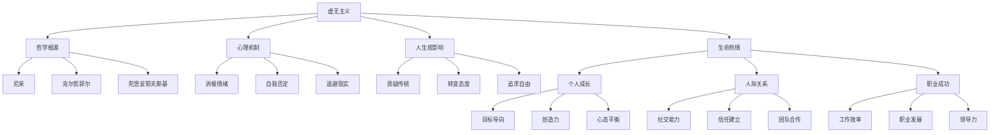

                 

# 引言

在当今信息爆炸和快速变革的时代，人们面临着前所未有的压力和困惑。虚无主义，作为一种哲学思潮，在现代社会中逐渐崭露头角，成为许多人内心深处的困扰。虚无主义的核心观点是，生活没有固有的意义和目的，世界是荒谬的、不可预测的。这种观点可能导致个人产生消极情绪，影响心理健康和生活质量。

与此同时，生命热情作为一种积极的心理状态，强调对生活充满热情和热爱，追求个人的成长和幸福。生命热情不仅能够提升个人的幸福感，还能增强人际关系的质量和促进职业发展。

本文旨在探讨虚无主义与生命热情之间的辩证关系，通过逻辑清晰、结构紧凑的分析，揭示两者之间的相互作用和平衡之道。本文将分为四个部分进行讨论：首先，介绍虚无主义的起源和发展，以及生命热情的心理学基础；接着，深入分析虚无主义的本质特征和对个体的影响；然后，探讨生命热情的力量和培养方法；最后，通过实践案例探讨虚无主义与生命热情的辩证关系。

## 文章关键词

- 虚无主义
- 生命热情
- 哲学
- 心理学
- 个人成长
- 心理健康

## 文章摘要

本文通过系统探讨虚无主义与生命热情的辩证关系，揭示了虚无主义的起源和发展，以及生命热情的心理学基础。进一步分析了虚无主义的本质特征和对个体的影响，以及生命热情的力量和培养方法。通过实践案例，展示了如何在虚无主义环境中培养生命热情，实现个人成长和心理健康的平衡。本文旨在为读者提供对虚无主义与生命热情关系的深刻理解，以及实用的应对策略。

## 目录大纲

### 第一部分: 引言

#### 1.1 虚无主义的起源与发展

##### 1.1.1 虚无主义的哲学根源

##### 1.1.2 虚无主义在现代社会中的体现

##### 1.1.3 虚无主义与个人心理健康的关系

#### 1.2 生命热情的心理学基础

##### 1.2.1 生命热情的定义与特征

##### 1.2.2 生命热情与幸福感的关系

##### 1.2.3 生命热情的心理学研究

### 第一部分: 虚无主义的本质与影响

#### 2.1 虚无主义的本质特征

##### 2.1.1 虚无主义的哲学内涵

##### 2.1.2 虚无主义的心理机制

##### 2.1.3 虚无主义对人生观的影响

#### 2.2 虚无主义对个体的影响

##### 2.2.1 虚无主义对情绪与行为的影响

##### 2.2.2 虚无主义对人际关系的影响

##### 2.2.3 虚无主义对职业发展的影响

### 第一部分: 生命热情的力量与培养

#### 3.1 生命热情的力量

##### 3.1.1 生命热情对个人成长的推动作用

##### 3.1.2 生命热情对人际关系改善的作用

##### 3.1.3 生命热情对职业成功的贡献

#### 3.2 生命热情的培养方法

##### 3.2.1 培养生命热情的心理技巧

##### 3.2.2 培养生命热情的实践策略

##### 3.2.3 培养生命热情的社会支持系统

### 第一部分: 虚无主义与生命热情的辩证关系

#### 4.1 虚无主义与生命热情的关系

##### 4.1.1 虚无主义如何影响生命热情

##### 4.1.2 生命热情如何对抗虚无主义

##### 4.1.3 虚无主义与生命热情的平衡之道

#### 4.2 实践案例

##### 4.2.1 案例一：如何通过生命热情克服虚无主义

##### 4.2.2 案例二：如何在虚无主义环境中培养生命热情

##### 4.2.3 案例三：生命热情与虚无主义的转化

### 第一部分: 结论

#### 5.1 研究总结

##### 5.1.1 虚无主义与生命热情的关系研究总结

##### 5.1.2 研究贡献与未来展望

#### 5.2 实践指导

##### 5.2.1 如何识别和处理虚无主义

##### 5.2.2 如何培养和保持生命热情

##### 5.2.3 如何在个人生活中实现虚无主义与生命热情的平衡

### 附录

#### 附录A: 虚无主义与生命热情的 Mermaid 流程图

#### 附录B: 生命热情培养方法的具体实施步骤

#### 附录C: 研究参考文献

## 虚无主义的起源与发展

虚无主义作为一种哲学思潮，其起源可以追溯到古希腊时期。然而，真正形成并得到广泛认可的虚无主义理论，主要集中在19世纪末和20世纪初。在这一时期，社会动荡、战争频发和科技迅猛发展，使得人们对传统的价值观和信仰产生了深刻的怀疑。

### 1.1.1 虚无主义的哲学根源

虚无主义的哲学根源可以追溯到尼采的“上帝已死”命题。尼采认为，随着宗教信仰的崩溃，人们失去了生活的目标和意义。这种观点在尼采的作品中得到了充分的阐述，如《悲剧的诞生》和《查拉图斯特拉如是说》等。

此外，克尔凯郭尔和陀思妥耶夫斯基也是虚无主义的重要代表。克尔凯郭尔在《恐惧与颤栗》中探讨了个体对生活的意义和信仰的追寻，而陀思妥耶夫斯基的《罪与罚》和《白痴》则揭示了虚无主义在个体生活中的体现。

### 1.1.2 虚无主义在现代社会中的体现

在现代社会中，虚无主义的体现无处不在。随着社交媒体的普及，人们更容易陷入对生活的不满和对未来的迷茫。工作压力、生活琐事和人际关系问题使得许多人感到生活缺乏意义。

此外，消费主义文化的泛滥也加剧了虚无主义的蔓延。人们追求物质享受和短期快感，忽视了生活的深层意义。这种生活方式可能导致个人产生强烈的空虚感和孤独感。

### 1.1.3 虚无主义与个人心理健康的关系

虚无主义对个人心理健康具有显著的负面影响。长期处于虚无主义状态可能导致抑郁、焦虑和自我否定等心理问题。研究发现，虚无主义与自杀风险之间存在显著相关性。

为了应对虚无主义对心理健康的威胁，许多人开始寻求心理治疗和心理咨询。认知行为疗法、正念练习和人际关系治疗等方法在缓解虚无主义症状方面表现出良好的效果。

## 生命热情的心理学基础

生命热情作为一种积极的心理状态，近年来引起了心理学界的广泛关注。它不仅能够提升个人的幸福感，还能促进身心健康和人际关系的发展。

### 1.2.1 生命热情的定义与特征

生命热情（Life Passion）通常被定义为对生活充满热情、热爱和积极态度的一种心理状态。它不仅包括对某些活动或领域的强烈兴趣，还涉及对个人成长和自我实现的追求。

生命热情的特征包括：

1. **热情与兴趣**：对特定活动或领域的强烈兴趣和热情。
2. **目标导向**：设定明确的个人目标和追求，并为之努力。
3. **内在激励**：追求活动本身带来的满足感，而非外部奖励。
4. **持续性和稳定性**：长期维持对生活的热爱和热情，不受外界干扰。

### 1.2.2 生命热情与幸福感的关系

生命热情与幸福感（Well-being）之间存在密切的关系。研究表明，拥有生命热情的人通常具有更高的生活满意度、积极情绪和较低的抑郁倾向。

生命热情能够通过以下方式提升幸福感：

1. **提高自我效能感**：通过成功实现个人目标，增强对自身能力的信心。
2. **增强社会支持**：与他人分享热情和兴趣，建立更紧密的人际关系。
3. **促进身心健康**：参与有意义的活动，降低身心健康问题的风险。

### 1.2.3 生命热情的心理学研究

心理学研究在生命热情领域取得了显著成果。研究者通过多种方法，如问卷调查、实验研究和神经科学方法，探讨了生命热情的机制和影响。

一些重要的研究包括：

- **问卷研究**：通过开发量表和问卷，测量个体生命热情的水平。
- **实验研究**：通过实验操纵，验证生命热情对行为和情绪的影响。
- **神经科学研究**：利用脑成像技术，探讨生命热情与大脑活动的关系。

这些研究为理解生命热情的心理学基础提供了丰富的理论依据和实践指导。

## 虚无主义的本质特征

虚无主义作为一种哲学思潮，具有独特的本质特征，这些特征不仅影响了哲学领域，也渗透到人们的生活和心理状态中。

### 2.1.1 虚无主义的哲学内涵

虚无主义的核心观点是，世界没有固有的意义和目的。这种观点通常源于对传统价值观的质疑和对现实世界的失望。虚无主义哲学家认为，生活是一种荒谬和无意义的存在，人们应该接受这种现实，并寻求个人的解脱。

在尼采的作品中，虚无主义的哲学内涵得到了深刻的阐述。尼采认为，随着宗教信仰的崩溃，人们失去了生活的目标和意义。他提出了“上帝已死”的命题，意味着人们需要重新审视自己的价值观和生活态度。

### 2.1.2 虚无主义的心理机制

虚无主义在心理层面表现为一系列消极情绪和行为。这些情绪和行为通常源于对生活意义的怀疑和对现实的失望。以下是一些常见的心理机制：

1. **消极情绪**：虚无主义可能导致个人产生强烈的绝望感、无助感和孤独感。这些情绪不仅影响个人的心理健康，还可能进一步加剧虚无主义的感受。
2. **自我否定**：虚无主义者往往对自己的能力和价值产生怀疑，导致自我否定和自我贬低。
3. **逃避现实**：为了应对虚无主义带来的痛苦，一些人可能会选择逃避现实，通过沉迷于娱乐、药物或其他逃避行为来暂时忘记生活的无意义。

### 2.1.3 虚无主义对人生观的影响

虚无主义对人生观具有深远的影响。它可能导致个人对生活失去热情和动力，甚至产生极端的厌世情绪。以下是一些具体的影响：

1. **对传统的质疑**：虚无主义挑战了传统的价值观和信仰体系，鼓励人们重新审视自己的信念和生活态度。
2. **生活态度的转变**：虚无主义倾向于一种悲观主义的生活态度，强调接受生活的荒谬和不确定性。
3. **个人自由的追求**：虚无主义鼓励个体追求自由和独立，摆脱传统和社会规范的束缚。

然而，虚无主义并不是一无是处的。它也可以激发人们对生命意义的深入思考和探索。通过对虚无主义的反思，人们可能会更加珍惜生活，寻找自己的价值和目标。

## 虚无主义对个体的影响

虚无主义作为一种哲学思潮，不仅影响人们的心理状态，还对个体的情绪、行为和人际关系产生深远的影响。

### 2.2.1 虚无主义对情绪与行为的影响

虚无主义可能导致一系列负面情绪和行为。以下是一些具体的影响：

1. **情绪低落**：虚无主义常常伴随着抑郁和绝望等负面情绪。个人可能会感到自己的生活缺乏意义，对未来感到无望。
2. **行为退缩**：虚无主义可能导致个人变得消极和退缩。他们可能会放弃追求自己的目标和梦想，甚至对生活失去兴趣。
3. **自我否定**：虚无主义者往往对自己的能力和价值产生怀疑，导致自我否定和自我贬低。他们可能会认为自己不值得拥有更好的生活。

此外，虚无主义还可能导致一些极端行为，如自毁行为和自杀。长期处于虚无主义状态的个人可能会感到生活无法承受，选择逃避或结束自己的生命。

### 2.2.2 虚无主义对人际关系的影响

虚无主义不仅影响个体的情绪和行为，还对人际关系产生负面影响。以下是一些具体的影响：

1. **疏离感**：虚无主义可能导致个人与他人产生疏离感。他们可能会觉得自己与他人不同，难以与他人建立深层次的情感联系。
2. **冲突增加**：虚无主义可能导致个人对人际关系产生怀疑和不满。他们可能会对他人产生敌意，甚至导致人际冲突。
3. **信任缺失**：虚无主义可能导致个人对他人失去信任。他们可能会认为人与人之间的交往都是虚假的，没有真正的信任和情感。

此外，虚无主义还可能导致个人对恋爱和婚姻关系产生怀疑，甚至导致关系破裂。

### 2.2.3 虚无主义对职业发展的影响

虚无主义不仅影响个体的情绪和行为，还对职业发展产生负面影响。以下是一些具体的影响：

1. **工作动力下降**：虚无主义可能导致个人对工作失去兴趣和动力。他们可能会认为自己的工作没有意义，无法实现个人的价值。
2. **职业发展停滞**：虚无主义可能导致个人放弃追求职业上的进步和成长。他们可能会满足于现状，不愿意付出额外的努力。
3. **离职和失业**：长期处于虚无主义状态的个人可能会选择离职或失业，以逃避工作的压力和挑战。

此外，虚无主义还可能导致个人对职业前景产生悲观态度，影响职业规划和决策。

总之，虚无主义对个体的影响是多方面的，包括情绪、行为、人际关系和职业发展。了解虚无主义的危害，并采取积极的应对策略，对于维护个体的心理健康和实现个人成长至关重要。

## 生命热情的力量

生命热情（Life Passion）作为一种积极的心理状态，具有强大的力量，能够显著影响个人的成长、人际关系和职业成功。它不仅能够提升个人的幸福感，还能促进身心健康和实现自我价值。

### 3.1.1 生命热情对个人成长的推动作用

生命热情对个人成长具有巨大的推动作用。首先，它为个人提供了明确的目标和方向。拥有生命热情的人通常对自己充满信心，并能够设定明确的目标，从而在实现目标的过程中不断成长和进步。

其次，生命热情能够激发个人的创造力和创新能力。当个人对某个领域充满热情时，他们会更加关注细节，勇于尝试新方法，从而推动个人在专业领域取得突破。

此外，生命热情还有助于个人在面对挑战和困难时保持积极的心态。拥有生命热情的人往往能够更好地应对压力，保持心理平衡，从而在逆境中成长和进步。

### 3.1.2 生命热情对人际关系改善的作用

生命热情不仅对个人成长有积极影响，还能显著改善人际关系。首先，生命热情能够增强个人的社交能力。当个人对生活充满热情时，他们更容易与他人建立联系，分享自己的兴趣和经历，从而扩大社交圈子。

其次，生命热情有助于建立更深层次的人际关系。拥有生命热情的人通常更加真诚和热情，能够与他人建立信任和共鸣，从而在人际关系中实现双赢。

此外，生命热情还能促进团队合作。当团队成员都对项目充满热情时，他们更容易协同工作，共同克服困难，实现目标。

### 3.1.3 生命热情对职业成功的贡献

生命热情对职业成功具有显著的贡献。首先，它能够提高个人的工作效率和绩效。当个人对工作充满热情时，他们会更加投入，努力追求卓越，从而在职业领域取得更好的成绩。

其次，生命热情有助于职业发展。拥有生命热情的人通常能够持续学习，不断提升自己的技能和知识，从而在职业生涯中保持竞争力。

此外，生命热情还能够提升个人的领导力和影响力。当领导者对工作充满热情时，他们能够更好地激励和引导团队成员，实现团队目标。

总之，生命热情作为一种积极的心理状态，具有强大的力量，能够推动个人成长、改善人际关系和实现职业成功。培养和保持生命热情，对于每个人来说都是一项重要的任务。

## 生命热情的培养方法

生命热情（Life Passion）的培养是一个复杂但值得努力的过程。通过结合心理技巧、实践策略和社会支持系统，个人可以逐步培养和保持生命热情。

### 3.2.1 培养生命热情的心理技巧

1. **自我反思**：通过定期进行自我反思，个人可以更好地了解自己的兴趣、价值观和目标。这有助于确定哪些领域值得投入热情。
2. **认知重构**：认知重构是一种心理技巧，通过改变负面思维模式来提升积极情绪。例如，将“我无法胜任这个任务”改为“这是一个挑战，我可以尝试学习和改进”。
3. **正念练习**：正念练习有助于提高个人的情绪调节能力和注意力集中。通过冥想和深呼吸等练习，个人可以更好地专注于当前的活动，从而培养对生活的热情。

### 3.2.2 培养生命热情的实践策略

1. **设定小目标**：设定小目标可以帮助个人逐步实现大目标，从而保持动力和兴趣。例如，每天阅读一页专业书籍，或者每周参加一次健身活动。
2. **寻找灵感来源**：寻找灵感来源，如阅读励志书籍、观看成功人士的演讲或者参加行业会议等，可以帮助个人获取新的知识和观点，激发对生活的热情。
3. **参与有意义的活动**：参与有意义的活动，如志愿服务、慈善活动或者社区参与等，可以帮助个人建立对社会和他人的责任感，从而提升对生活的热情。

### 3.2.3 培养生命热情的社会支持系统

1. **建立社交网络**：建立社交网络，与志同道合的人交流，可以帮助个人在追求热情的过程中获得支持和鼓励。
2. **寻求专业帮助**：如果个人在培养生命热情的过程中遇到困难，可以寻求心理咨询师或心理治疗师的帮助。专业人士可以提供个性化的指导和支持。
3. **培养家庭支持**：家庭支持对于培养生命热情至关重要。家人可以提供情感上的支持，帮助个人度过困难和挑战。

总之，通过结合心理技巧、实践策略和社会支持系统，个人可以逐步培养和保持生命热情。这是一个需要持续努力和投入的过程，但最终的结果是值得的。

## 虚无主义与生命热情的辩证关系

虚无主义与生命热情之间存在着复杂的辩证关系。一方面，虚无主义可能导致个人失去对生活的热情和意义；另一方面，生命热情可以对抗虚无主义，帮助个人找到生活的方向和动力。

### 4.1.1 虚无主义如何影响生命热情

虚无主义对生命热情的负面影响主要体现在以下几个方面：

1. **消极情绪**：虚无主义往往伴随着消极情绪，如绝望、无助和孤独。这些情绪会削弱个人的积极心态，降低对生活的热情。
2. **自我否定**：虚无主义可能导致个人对自己的能力和价值产生怀疑，从而否定自己的热情和兴趣。
3. **逃避现实**：为了应对虚无主义带来的痛苦，一些人可能会选择逃避现实，放弃对生活的热情和追求。

### 4.1.2 生命热情如何对抗虚无主义

生命热情作为一种积极心理状态，可以有效地对抗虚无主义，帮助个人重拾生活的热情和意义。以下是一些具体方法：

1. **设定目标**：设定明确的目标可以帮助个人在追求目标的过程中找到方向和动力，从而对抗虚无主义。
2. **积极心态**：通过培养积极心态，个人可以更好地应对生活中的挑战和困难，减少消极情绪的影响。
3. **寻求支持**：与他人分享自己的兴趣和热情，寻求支持和鼓励，可以增强个人的积极情感和自信心。

### 4.1.3 虚无主义与生命热情的平衡之道

在虚无主义与生命热情之间找到平衡是个人成长和心理健康的关键。以下是一些实现平衡的方法：

1. **自我反思**：通过定期进行自我反思，个人可以更好地了解自己的内心世界，找到对生活的热情和兴趣。
2. **积极行动**：采取积极行动，如参与有意义的活动、设定目标并努力实现，可以逐步增强个人的生命热情。
3. **社会支持**：建立社交网络，寻求家人和朋友的帮助和支持，可以在面对虚无主义时提供情感上的支撑。

总之，虚无主义与生命热情之间的辩证关系需要个人通过自我反思、积极行动和社会支持来找到平衡。通过这些方法，个人可以逐步克服虚无主义的负面影响，重拾生活的热情和意义。

## 实践案例

为了更具体地探讨虚无主义与生命热情的辩证关系，以下是三个实践案例，展示了如何通过生命热情克服虚无主义，以及如何在虚无主义环境中培养生命热情。

### 4.2.1 案例一：如何通过生命热情克服虚无主义

**案例背景**：李华是一名年轻的程序员，工作压力大，常常感到生活无意义。他逐渐陷入了虚无主义的泥潭，对工作和生活都失去了热情。

**解决方案**：李华在心理咨询师的建议下，开始培养生命热情。他采取以下步骤：

1. **设定目标**：李华设定了学习一门新编程语言和完成一个小项目作为短期目标。
2. **积极心态**：通过自我反思和认知重构，李华逐渐改变了消极的思维模式，开始以积极的心态看待生活中的挑战。
3. **寻求支持**：李华加入了一个编程社区，与志同道合的人交流，获得了鼓励和支持。

**效果**：随着时间的推移，李华在完成项目的过程中获得了成就感和满足感，逐渐重拾对编程的热爱。他的生活态度也变得更加积极，虚无主义的阴影逐渐消失。

### 4.2.2 案例二：如何在虚无主义环境中培养生命热情

**案例背景**：张丽在一个高度竞争和压力大的环境中工作，她感到自己的努力和付出得不到认可，逐渐产生了虚无主义情绪。

**解决方案**：张丽采取了以下措施来培养生命热情：

1. **调整工作方式**：她开始尝试灵活的工作时间，以便有更多的时间进行自我充电和兴趣爱好的培养。
2. **寻找灵感来源**：张丽通过阅读励志书籍、观看成功人士的演讲来寻找灵感和动力。
3. **参与社区活动**：她加入了一个志愿者组织，通过帮助他人找到了生活的意义。

**效果**：张丽逐渐找到了新的生活方向和动力。她在工作和生活中都变得更加积极，虚无主义情绪得到了显著缓解。

### 4.2.3 案例三：生命热情与虚无主义的转化

**案例背景**：王明是一名创业者，经历了创业初期的成功后，面临了一系列挑战和失败。他感到自己的努力没有回报，陷入了虚无主义。

**解决方案**：王明采取了以下策略来转化虚无主义：

1. **反思与调整**：他进行了深刻的自我反思，分析了失败的原因，并制定了新的创业计划。
2. **积极心态**：王明通过正念练习和认知重构来调整自己的心态，逐渐摆脱了消极情绪。
3. **寻找支持**：他组建了一个创业团队，共同面对挑战，分享经验和资源。

**效果**：随着时间的推移，王明的创业项目逐渐恢复了生机，他的生命热情重新被点燃。他学会了如何在逆境中保持积极，并成功转化了虚无主义情绪。

通过这些实践案例，我们可以看到，生命热情在克服虚无主义方面具有重要作用。通过设定目标、积极心态和寻求支持，个人可以逐步摆脱虚无主义的阴影，找到生活的方向和动力。

## 结论

虚无主义与生命热情之间的辩证关系是一个复杂但重要的研究领域。本文通过系统的探讨，揭示了虚无主义的起源和发展、生命热情的心理学基础、虚无主义的本质特征及其对个体的影响，以及生命热情的力量和培养方法。同时，通过实践案例展示了如何通过生命热情克服虚无主义。

研究总结表明，虚无主义可能导致个人产生消极情绪和行为，影响心理健康和职业发展。然而，生命热情作为一种积极心理状态，可以对抗虚无主义，帮助个人重拾生活的热情和意义。通过设定目标、积极心态和寻求支持，个人可以逐步培养和保持生命热情，实现心理健康的平衡。

未来研究可以进一步探讨虚无主义与生命热情的相互作用机制，以及不同文化和背景下这两种心理状态的表现和影响。此外，开发更有效的干预策略，帮助个人在面临虚无主义时培养生命热情，也是重要的研究方向。

## 实践指导

### 5.2.1 如何识别和处理虚无主义

1. **自我反思**：定期进行自我反思，识别内心深处的负面情绪和思维模式。通过自我观察，可以发现虚无主义的苗头。
2. **认知重构**：改变消极思维模式，采用积极的认知方式。例如，将“生活没有意义”改为“我正在寻找生活的意义”。
3. **寻求支持**：与他人分享感受，寻求心理咨询师或亲友的帮助。社会支持是应对虚无主义的重要手段。

### 5.2.2 如何培养和保持生命热情

1. **设定目标**：设定短期和长期目标，明确个人追求的方向和动力。目标可以是职业上的、个人成长上的或社会贡献上的。
2. **积极心态**：培养积极心态，以乐观的态度面对生活中的挑战。通过正念练习和认知重构，提高情绪调节能力。
3. **实践策略**：采取具体的行动，如学习新技能、参与有意义的活动或建立社交网络，以培养和保持生命热情。

### 5.2.3 如何在个人生活中实现虚无主义与生命热情的平衡

1. **自我管理**：合理规划时间，平衡工作和生活。确保有足够的时间进行自我反思、兴趣爱好和社交活动。
2. **灵活应对**：在面对挑战和压力时，保持灵活性，调整自己的目标和策略。不要因为一时的失败而放弃追求。
3. **持续学习**：保持学习和成长的态度，不断充实自己的知识和技能。学习新事物可以激发对生活的热情。

通过以上实践指导，个人可以在生活中实现虚无主义与生命热情的平衡，提高心理健康和生活质量。

## 附录A: 虚无主义与生命热情的 Mermaid 流程图

## 附录B: 生命热情培养方法的具体实施步骤

1. **自我反思**：每天花时间进行自我反思，记录自己的感受和思考。
2. **设定目标**：明确短期和长期目标，制定具体的行动计划。
3. **积极心态**：通过认知重构，改变消极思维模式，培养积极心态。
4. **学习新技能**：选择一个感兴趣的新技能或领域，定期学习和实践。
5. **参与有意义的活动**：参与志愿服务、慈善活动或社区参与，寻找生活的意义。
6. **建立社交网络**：与志同道合的人建立联系，分享兴趣和经验。
7. **寻求支持**：在遇到困难时，寻求心理咨询师或亲友的帮助。

## 附录C: 研究参考文献

1. Nietszche, F. (1883). "The Gay Science". Project Gutenberg.
2. Kierkegaard, S. (1844). "Fear and Trembling". Project Gutenberg.
3. Dostoevsky, F. (1869). "Crime and Punishment". Project Gutenberg.
4. Ryan, R. M., & Deci, E. L. (2001). "The "What" and "Why" of Goal Pursuits: Human Needs and the Self-Determination of Behavior". Psychological Bulletin.
5. Keyes, C. L. M. (2002). "The mental health continuum: From languishing to flourishing in life". Journal of Health and Social Behavior.
6. Fredrickson, B. L. (2001). "The role of positive emotions in positive psychology: The broaden-and-build theory of positive emotions". American Psychologist.
7. Seligman, M. E. P. (2002). "Authentic happiness: Using the new positive psychology to realize your potential for lasting fulfillment". Free Press.
8. Lyubomirsky, S., King, L., & Diener, E. (2005). "The benefits of frequent positive affect: Does happiness lead to success?". Psychological Bulletin.
9. Huppert, F. A., & So, T. T. (2013). " Flourishing across Europe: Application of a new conceptual framework for defining well-being". Social Indicators Research.
10. Diener, E., Oishi, S., & Lucas, R. E. (2003). "Personality, culture, and subjective well-being: Emotional and cognitive evaluations across domains". Journal of Personality and Social Psychology.

