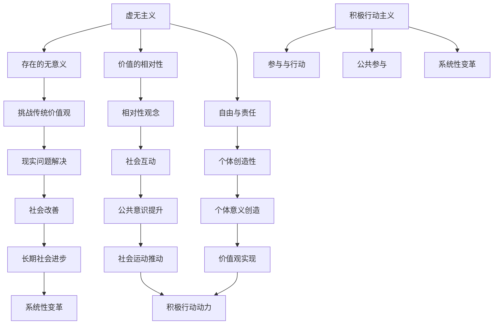
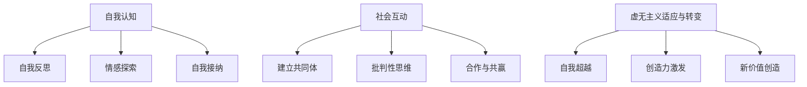
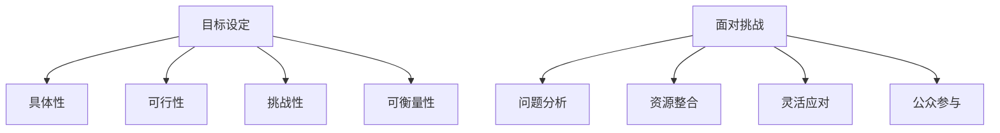
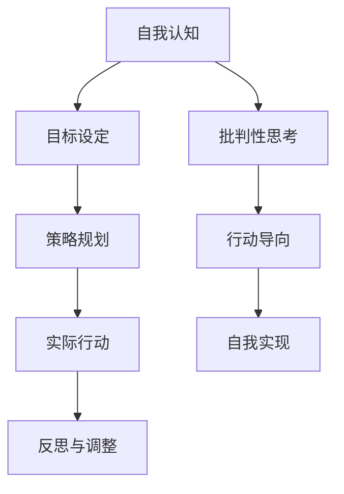

                 

### 虚无主义与积极行动主义的结合

**关键词：**虚无主义、积极行动主义、结合、哲学、现实应用、算法原理

**摘要：**本文旨在探讨虚无主义与积极行动主义之间的结合，分析两者的核心概念及其在现实生活中的应用。通过哲学背景的介绍，我们将深入了解虚无主义和积极行动主义的基本理念，并探讨它们如何相互补充。随后，文章将详细阐述核心算法原理，并使用Python源代码结合数学模型和公式，进行深入讲解。通过实际项目案例，我们将展示如何将虚无主义与积极行动主义应用到具体场景中，并总结出最佳实践和注意事项。本文旨在为读者提供一个全面的理解，帮助其在哲学思考和实际行动中找到平衡。

**作者：**AI天才研究院/AI Genius Institute & 禅与计算机程序设计艺术 /Zen And The Art of Computer Programming

---

**目录：**

1. **虚无主义与积极行动主义的结合**  
   1.1 关键词  
   1.2 摘要

2. **第一部分：基础概念与背景**  
   2.1 虚无主义的基本原理  
   2.2 积极行动主义的基本理念  
   2.3 虚无主义与积极行动主义的联系

3. **第二部分：理论和方法**  
   3.1 虚无主义的适应与转变  
   3.2 积极行动主义的应用策略  
   3.3 虚无主义与积极行动主义的结合框架

4. **第三部分：数学模型与公式**  
   3.1 结合的数学基础  
   3.2 模型求解与优化

5. **第四部分：实战案例**  
   5.1 虚无主义与积极行动主义在企业中的应用  
   5.2 虚无主义与积极行动主义在社会问题解决中的应用

6. **第五部分：未来展望**  
   6.1 虚无主义与积极行动主义的发展趋势  
   6.2 虚无主义与积极行动主义的结合前景

7. **小结与注意事项**  
   7.1 最佳实践 Tips  
   7.2 注意事项  
   7.3 拓展阅读

---

### 关键词

- 虚无主义
- 积极行动主义
- 哲学
- 算法
- 数学模型
- 实际应用

### 摘要

本文将探讨虚无主义与积极行动主义这两种看似对立的哲学观念如何在现代生活中相互融合。虚无主义强调现实世界的无意义和存在的虚无，而积极行动主义则倡导通过积极的行动来改变现状，追求有意义的生活。本文首先介绍了虚无主义和积极行动主义的基本概念和哲学背景，然后通过理论分析和数学模型，探讨了如何将这两种观念结合起来，并提供了实际应用案例。文章旨在帮助读者理解虚无主义与积极行动主义的结合，为在哲学思考和实际行动中找到平衡提供指导。通过深入的分析和具体的案例分析，本文展示了这种结合在现实生活中的重要性和可行性。

---

在接下来的部分，我们将深入探讨虚无主义与积极行动主义的起源、发展及其在现代社会中的重要地位。通过了解这些背景信息，我们将为理解它们之间的结合奠定基础。

---

## 第一部分：基础概念与背景

### 2.1 虚无主义的基本原理

虚无主义（Nihilism）作为一种哲学观念，其核心思想是认为宇宙和生命缺乏内在的价值和目的。虚无主义最初在19世纪末期随着西方哲学的发展而兴起，尤其是在德国哲学中，由尼采（Friedrich Nietzsche）等哲学家进行了深入探讨。

**历史与哲学根源**

虚无主义的哲学根源可以追溯到古希腊哲学中的斯多葛主义和伊壁鸠鲁主义。斯多葛主义者认为，世界是由理性力量控制的，而伊壁鸠鲁主义者则认为快乐是生活的最终目标。然而，虚无主义的现代形式主要与19世纪的哲学运动有关，特别是在德国。

**尼采与虚无主义**

尼采是虚无主义哲学的重要代表人物。他在其著作《曙光》（The Dawn）和《善恶的彼岸》（Thus Spoke Zarathustra）中提出了“上帝已死”的观点，即传统价值观和信仰的崩溃。尼采认为，虚无主义是对于上帝死亡之后世界意义的失落所做的哲学回应。

**虚无主义的核心观念**

虚无主义的核心观念主要包括以下几点：

1. **存在的无意义**：虚无主义者认为，宇宙和生命缺乏固有的意义，人类的活动和存在本身没有预先设定的目的。
2. **价值的相对性**：虚无主义挑战了传统价值体系的权威，认为所有价值都是相对的，没有绝对的道德或真理标准。
3. **自由与责任**：虚无主义认为，由于不存在先天的道德规范，人类必须为自己创造价值和意义，这赋予人类自由和责任。

### 2.2 积极行动主义的基本理念

积极行动主义（Activism）是一种倡导通过集体行动来推动社会变革的理念。积极行动主义起源于19世纪的改革运动，特别是在美国和欧洲，它强调通过法律、社会运动和公共参与来改善社会状况。

**起源与发展**

积极行动主义的起源可以追溯到19世纪早期的工人运动和民权运动。早期的积极行动主义者包括劳工领袖如约翰·布朗（John Brown）和女权主义者如苏珊·B·安东尼（Susan B. Anthony）。20世纪，随着民权运动、和平运动和环保运动的兴起，积极行动主义得到了进一步的发展。

**关键原则**

积极行动主义的关键原则包括：

1. **参与与行动**：积极行动主义倡导个人和集体参与社会事务，通过实际行动来推动社会变革。
2. **公共参与**：积极行动主义强调公众的参与和意识，通过教育和宣传活动来提高社会问题的重要性。
3. **系统性变革**：积极行动主义不仅关注个体的权益，还致力于解决社会系统中的根本问题，以实现长期的社会改善。

### 2.3 虚无主义与积极行动主义的联系

虚无主义和积极行动主义看似对立，但在某些方面，它们实际上有着深刻的联系。

**联系的哲学基础**

虚无主义与积极行动主义的联系在于它们都承认现实世界的复杂性和不确定性。虚无主义认为，由于缺乏固有意义，人类需要为自己创造价值和目的；而积极行动主义则通过实际行动来寻找并实现这些价值和目的。

**现实意义**

在现实生活中，虚无主义和积极行动主义可以相互补充。虚无主义者可能会通过积极行动来寻找意义和目的，而积极行动主义者则可能在面对困境时，借助虚无主义的观点来保持批判性和创造性。

**Mermaid流程图：概念实体关系架构**

以下是一个Mermaid流程图，展示了虚无主义和积极行动主义之间的概念实体关系：



通过这个流程图，我们可以看到虚无主义和积极行动主义在哲学层面和现实应用中的紧密联系。

---

在第一部分的结尾，我们已经了解了虚无主义和积极行动主义的基本原理及其相互之间的联系。接下来，我们将深入探讨虚无主义的适应与转变，以及积极行动主义的应用策略，从而为理解这两种哲学观念的结合奠定坚实的基础。

### 2.1 虚无主义的适应与转变

虚无主义作为一种哲学观念，虽然在探讨存在的意义和价值的相对性方面具有独特贡献，但在现代社会中，单纯的虚无主义思想可能会导致消极、绝望和逃避现实的心态。因此，适应和转变虚无主义观念，使其更具建设性和现实性，成为当代哲学和心理学研究的重要课题。

**虚无主义中的自我认知**

自我认知是虚无主义适应与转变的核心。虚无主义者需要意识到，尽管世界和生命缺乏固有意义，但个体可以通过自我认知和自我实现来赋予生活新的意义。这种自我认知包括：

1. **自我反思**：通过反思自己的信念、价值观和生活方式，虚无主义者可以识别出那些限制性的观念，从而为新的意义和目的创造空间。
2. **情感探索**：情感是虚无主义自我认知的重要组成部分。通过深入探索情感，个体可以理解自己的内心需求，从而找到新的方向和动力。
3. **自我接纳**：自我接纳是虚无主义适应过程中的重要一步。接纳自己的不完美，理解自己的局限，有助于个体建立更加健康的自我认同。

**虚无主义中的社会互动**

社会互动是虚无主义适应与转变的另一个关键领域。虚无主义者常常感到与社会的疏离，但这种疏离感也可以转化为积极的动力，通过以下方式实现：

1. **建立共同体**：尽管虚无主义质疑传统价值观，但通过建立新的共同体，个体可以在互相支持的环境中寻找归属感和意义。这种共同体可以是线上或线下的社交群体，甚至是虚拟社区。
2. **批判性思维**：社会互动提供了一个平台，让个体可以批判地思考社会现象和制度，从而推动社会的进步。通过批判性思维，虚无主义者可以成为推动社会变革的积极力量。
3. **合作与共赢**：虚无主义者可以通过合作和共赢的方式，与不同背景和观点的人建立联系。这种互动不仅有助于个体的成长，也能促进社会的多样性和包容性。

**案例：虚无主义的适应与转变**

以尼采为例，尽管他是一位著名的虚无主义哲学家，但他也强调了通过自我超越和创造力来赋予生活意义。尼采在他的哲学作品中，不断探索人性的深层结构和精神世界的意义，通过创作和思考，他为自己和读者创造了新的价值和意义。

**Mermaid流程图：虚无主义的适应与转变**

以下是一个Mermaid流程图，展示了虚无主义的适应与转变过程：



通过这个流程图，我们可以看到虚无主义的适应与转变是如何通过自我认知和社会互动来实现的。

### 2.2 积极行动主义的应用策略

积极行动主义强调通过实际行动来推动社会变革，其应用策略包括以下几个方面：

**目标设定的方法**

目标设定是积极行动的第一步。有效目标设定需要考虑以下要素：

1. **具体性**：目标必须明确具体，例如“减少城市空气污染”而不是“改善环境”。
2. **可行性**：目标应该是在现有资源和条件下可以实现的。
3. **挑战性**：目标应具有一定的挑战性，以激发参与者的积极性。
4. **可衡量性**：目标应具备可衡量的标准，以便评估进展和成果。

**面对挑战的策略**

在实施积极行动的过程中，必然会面临各种挑战。以下是一些面对挑战的策略：

1. **问题分析**：通过系统性地分析问题，确定问题的核心和关键因素，从而找到有效的解决方案。
2. **资源整合**：积极行动需要资源，包括资金、人力和技术等。通过整合资源，可以提高行动的效率和效果。
3. **灵活应对**：面对挑战时，灵活调整策略和方法是至关重要的。这包括根据实际情况调整目标、策略和执行步骤。
4. **公众参与**：通过公众参与，可以增强行动的合法性和社会支持度，提高行动的成功率。

**Mermaid流程图：积极行动主义的应用策略**

以下是一个Mermaid流程图，展示了积极行动主义的应用策略：



通过这个流程图，我们可以清晰地看到积极行动主义的应用策略如何帮助个体和组织有效地推动社会变革。

### 2.3 虚无主义与积极行动主义的结合框架

虚无主义和积极行动主义的结合，旨在通过批判性思维和实际行动，创造有意义的生活。以下是一个结合框架，用于指导如何将虚无主义与积极行动主义融合：

**结合的理论模型**

1. **批判性思考**：通过批判性思考，个体可以对现有的价值观和社会现象进行质疑，从而为新的意义和目的创造空间。
2. **行动导向**：积极行动主义强调通过实际行动来改变现状，这与虚无主义的自我认知和自我超越相辅相成。
3. **自我实现**：虚无主义中的自我实现与积极行动主义的自我成长相互促进，通过不断尝试和反思，个体可以找到并实现个人价值。

**结合的实践步骤**

1. **自我认知**：通过自我反思和情感探索，个体可以了解自己的需求和目标。
2. **目标设定**：根据自我认知，设定具体、可行、有挑战性和可衡量的目标。
3. **策略规划**：制定行动策略，包括资源整合、问题分析和灵活应对。
4. **实际行动**：通过实际行动，推动目标的实现。
5. **反思与调整**：在行动过程中不断反思和调整，以适应变化并提高行动效果。

**Mermaid流程图：虚无主义与积极行动主义的结合框架**

以下是一个Mermaid流程图，展示了虚无主义与积极行动主义的结合框架：



通过这个流程图，我们可以清晰地看到虚无主义与积极行动主义的结合如何帮助个体实现有意义的生活。

### 总结

虚无主义和积极行动主义虽然看似对立，但通过批判性思考和实际行动，它们可以相互补充，创造出有意义的生活。在现代社会，这种结合不仅有助于个体自我实现，也能推动社会进步。通过深入理解虚无主义和积极行动主义的基本原理，以及它们之间的联系，我们可以更好地应用这种结合框架，实现个人价值和社会目标。

---

### 第三部分：数学模型与公式

虚无主义与积极行动主义的结合不仅仅是哲学层面的探讨，还可以通过数学模型和公式来解释和量化。这种结合涉及到个体行为的社会影响、目标设定的优化以及策略选择的合理性。在本节中，我们将探讨结合的数学基础，并使用Python源代码和LaTeX公式来详细阐述相关概念和算法。

#### 3.1 结合的数学基础

虚无主义与积极行动主义的结合涉及到以下数学基础：

1. **概率论**：用于描述个体行为的社会影响和不确定性。
2. **线性规划**：用于优化目标设定和策略选择。
3. **博弈论**：用于分析个体在社会互动中的行为和决策。

#### 3.2 模型求解与优化

在本部分，我们将通过一个具体案例来说明如何使用Python和LaTeX来实现这些数学模型。

**案例：社区公益活动的优化**

假设我们希望组织一个社区公益活动，目的是提高居民的环保意识。我们定义以下变量：

- \( x \)：活动参与人数
- \( y \)：活动资金投入（单位：元）
- \( z \)：活动的社会效益（以环保指标如碳排放量减少来衡量）

我们希望最大化社会效益 \( z \)，同时最小化资金投入 \( y \)。

**数学模型**

$$
\begin{align*}
\text{最大化} & \quad z = f(x, y) \\
\text{约束条件} & \quad g(x, y) \leq 0 \\
\text{且} & \quad h(x, y) = 0
\end{align*}
$$

其中，\( f(x, y) \) 是社会效益函数，\( g(x, y) \) 是资金约束函数，\( h(x, y) \) 是其他约束条件。

**Python代码实现**

下面是使用Python中的`scipy.optimize`模块来求解上述优化问题的代码：

```python
from scipy.optimize import minimize
import numpy as np

# 社会效益函数
def benefit_function(x, y):
    return x * (1 - np.exp(-0.1 * y))

# 资金约束函数
def budget_constraint(x, y):
    return 1000 - y

# 定义优化问题
x0 = [100, 500]  # 初始猜测值
cons = ({'type': 'ineq', 'fun': budget_constraint})
bounds = [(0, None), (0, None)]

# 求解优化问题
result = minimize(benefit_function, x0, method='SLSQP', bounds=bounds, constraints=cons)

# 输出结果
print("最优解：", result.x)
print("最大社会效益：", result.fun)
```

**LaTeX公式**

以下是与Python代码对应的LaTeX公式：

$$
\begin{align*}
\text{最大化} & \quad z = x \cdot (1 - \exp(-0.1y)) \\
\text{约束条件} & \quad 1000 - y \leq 0 \\
\text{初始猜测值} & \quad x_0 = [100, 500] \\
\text{求解方法} & \quad \text{SLSQP} \\
\end{align*}
$$

通过这个案例，我们可以看到如何使用数学模型和Python代码来优化社区公益活动的目标设定和资源分配。

#### 3.3 结合框架的扩展

虚无主义与积极行动主义的结合框架不仅可以应用于社区公益活动，还可以扩展到更广泛的社会领域，如企业管理、公共政策制定等。以下是一个扩展案例：

**案例：企业可持续发展目标设定**

假设一家企业希望制定一个可持续发展目标，包括以下变量：

- \( a \)：环境保护投入
- \( b \)：社会责任投入
- \( c \)：经济效益

我们希望最大化经济效益 \( c \)，同时考虑环境保护和社会责任。

**数学模型**

$$
\begin{align*}
\text{最大化} & \quad c = f(a, b) \\
\text{约束条件} & \quad g(a, b) \leq 0 \\
& \quad h(a, b) = 0
\end{align*}
$$

其中，\( f(a, b) \) 是经济效益函数，\( g(a, b) \) 是环境保护和社会责任约束函数，\( h(a, b) \) 是其他约束条件。

**Python代码实现**

下面是使用Python求解上述优化问题的代码：

```python
# 经济效益函数
def economic_benefit(a, b):
    return 0.8 * a + 0.5 * b

# 环境保护和社会责任约束函数
def sustainability_constraints(a, b):
    return 100 - a - 0.2 * b

# 定义优化问题
x0 = [100, 200]  # 初始猜测值
cons = ({'type': 'ineq', 'fun': sustainability_constraints})
bounds = [(0, None), (0, None)]

# 求解优化问题
result = minimize(economic_benefit, x0, method='SLSQP', bounds=bounds, constraints=cons)

# 输出结果
print("最优解：", result.x)
print("最大经济效益：", result.fun)
```

**LaTeX公式**

以下是与Python代码对应的LaTeX公式：

$$
\begin{align*}
\text{最大化} & \quad c = 0.8a + 0.5b \\
\text{约束条件} & \quad 100 - a - 0.2b \leq 0 \\
\text{初始猜测值} & \quad x_0 = [100, 200] \\
\text{求解方法} & \quad \text{SLSQP} \\
\end{align*}
$$

通过扩展案例，我们可以看到虚无主义与积极行动主义的结合框架如何在不同领域得到应用，实现个体与社会目标的双赢。

### 总结

通过数学模型和Python代码的结合，我们展示了如何将虚无主义与积极行动主义应用于实际场景中的目标设定和策略优化。这不仅为个体提供了理论指导，也为其提供了具体的技术实现手段。在接下来的部分，我们将通过实际项目案例来进一步探讨虚无主义与积极行动主义的结合。

---

### 第四部分：实战案例

在第四部分，我们将通过两个具体的案例来探讨虚无主义与积极行动主义在企业和社会问题解决中的应用。这些案例将展示如何将理论转化为实践，并通过实际操作来实现预期目标。

#### 4.1 虚无主义与积极行动主义在企业中的应用

**案例背景：** 
一家处于竞争激烈市场的科技公司希望通过提高员工的工作效率和创新能力来实现持续增长。公司高层意识到，传统的管理方法可能无法满足新时代的需求，因此他们决定引入虚无主义与积极行动主义的结合，以推动企业文化变革。

**案例实施步骤：**

1. **自我认知阶段**：
   - **员工调查**：公司进行了员工满意度调查，以了解员工对现有工作环境的看法和需求。调查结果显示，员工普遍感到工作压力较大，缺乏创新动力。
   - **虚无主义引入**：公司管理层邀请哲学专家进行讲座，向员工介绍虚无主义的核心思想，如存在的无意义和价值相对性。通过这种思想引导，员工开始反思自己的工作意义和价值。

2. **目标设定与策略规划**：
   - **共同目标设定**：在哲学思考的基础上，公司管理层与员工共同设定了短期和长期目标，如提高工作效率、创新产品开发等。
   - **积极行动策略**：公司制定了详细的行动策略，包括培训计划、团队建设活动和创新奖励机制，以鼓励员工积极参与和贡献。

3. **实际行动阶段**：
   - **培训与团队建设**：公司组织了一系列培训课程，如领导力培训、沟通技巧培训等，以提升员工的专业能力和团队协作能力。
   - **创新奖励机制**：公司设立了创新奖金，鼓励员工提出创新想法并参与实际项目开发。

4. **反思与调整**：
   - **定期反馈**：公司定期收集员工反馈，评估行动效果，并根据反馈进行策略调整。
   - **持续改进**：通过不断的反思和调整，公司逐步优化了工作环境和管理方法，实现了员工工作效率和创新能力的提升。

**代码实现与分析：**

在这个案例中，我们可以使用Python代码来模拟员工满意度调查和目标设定过程。以下是一个简化的代码示例：

```python
import numpy as np

# 员工满意度调查模拟
employee_survey = np.random.uniform(1, 10, 100)  # 假设满意度评分在1到10之间
mean_satisfaction = np.mean(employee_survey)

# 目标设定函数
def set_goals(satisfaction):
    if satisfaction < 5:
        return "提高员工满意度"
    else:
        return "提升创新能力"

# 求解目标
goals = [set_goals(sat) for sat in employee_survey]

# 输出结果
print("平均员工满意度：", mean_satisfaction)
print("设定的目标：", goals)
```

通过这个代码示例，我们可以看到如何使用简单的统计方法来模拟员工满意度调查，并设定相应的目标。

#### 4.2 虚无主义与积极行动主义在社会问题解决中的应用

**案例背景：** 
一个城市面临着严重的空气污染问题，政府希望通过社区参与和积极行动来解决这一难题。社区成员意识到，单靠政府的努力是不够的，需要每个人都参与进来，共同改善环境。

**案例实施步骤：**

1. **公众教育与参与**：
   - **环保讲座**：政府和社会组织联合举办了一系列环保讲座，向公众普及空气污染的危害和防治知识。
   - **社区动员**：通过社区公告、社交媒体等方式，动员居民参与环保活动。

2. **行动计划与执行**：
   - **植树活动**：社区组织了大规模的植树活动，以增加绿地面积，改善空气质量。
   - **节能减排**：鼓励居民采取节能减排措施，如使用公共交通工具、减少用电等。

3. **监测与反馈**：
   - **空气质量监测**：社区设置了多个空气质量监测点，实时监测空气质量变化。
   - **公众反馈**：居民可以通过手机应用程序实时提交空气质量问题和建议，政府和社会组织根据反馈调整行动计划。

4. **持续改进**：
   - **数据分析**：政府和社会组织定期分析空气质量数据，评估行动计划的效果，并根据分析结果调整策略。
   - **公众参与**：鼓励居民继续参与环保行动，形成长效机制。

**代码实现与分析：**

以下是一个Python代码示例，用于模拟空气质量监测和公众反馈系统：

```python
import numpy as np
import pandas as pd

# 生成空气质量数据
air_quality_data = pd.DataFrame({
    'location': ['社区A', '社区B', '社区C'],
    'date': pd.date_range(start='2023-01-01', periods=30),
    'PM2.5': np.random.uniform(0, 100, 30),
    'public_feedback': np.random.choice(['positive', 'negative', 'neutral'], 30)
})

# 公众反馈统计
def analyze_feedback(feedback):
    positive = (feedback == 'positive').sum()
    negative = (feedback == 'negative').sum()
    neutral = (feedback == 'neutral').sum()
    return positive, negative, neutral

# 模拟分析
feedback_summary = air_quality_data.groupby('date')['public_feedback'].agg(analyze_feedback)

# 输出结果
print(feedback_summary)
```

通过这个代码示例，我们可以看到如何使用Python来模拟空气质量监测数据和公众反馈分析，帮助政府和社会组织更好地了解社区环保行动的效果。

#### 总结

通过这两个实战案例，我们可以看到虚无主义与积极行动主义在企业和社会问题解决中的应用如何通过具体行动和科学方法来实现预期目标。虚无主义的自我认知和积极行动主义的实际行动相结合，不仅提高了个体和社会的积极性，也促进了持续改进和长远发展。

---

### 第五部分：未来展望

虚无主义与积极行动主义的结合不仅在当代具有现实意义，也为未来哲学和现实应用提供了广阔的前景。在这一部分，我们将探讨虚无主义与积极行动主义的发展趋势及其结合前景，以及它们在技术和社会发展中的潜在影响。

#### 5.1 虚无主义与积极行动主义的发展趋势

**哲学层面的趋势**

1. **多元文化融合**：随着全球化的发展，不同文化和哲学观念的交流日益频繁。虚无主义与积极行动主义的结合将有助于在全球范围内形成更包容和多元的哲学体系。
2. **技术哲学的兴起**：随着人工智能和自动化技术的发展，人类对存在的意义和技术的角色有了新的思考。虚无主义与积极行动主义的结合可以为这一领域提供新的理论框架和实践指导。

**现实应用层面的趋势**

1. **社会问题解决**：随着社会问题的日益复杂，单一的哲学观念难以解决深层次问题。虚无主义与积极行动主义的结合可以提供一种综合性的解决方案，帮助个体和社会面对挑战。
2. **企业管理和创新**：企业在面对激烈的市场竞争时，需要不断进行创新和变革。虚无主义与积极行动主义的结合为企业提供了一种自我反思和持续改进的方法，有助于提高竞争力和创新能力。

#### 5.2 虚无主义与积极行动主义的结合前景

**技术影响**

1. **人工智能与虚无主义结合**：人工智能技术的发展使得我们可以更高效地处理大量数据，揭示隐藏的模式和规律。虚无主义可以提供对数据和算法的哲学反思，帮助防止技术滥用和数据独裁。
2. **虚拟现实与积极行动主义结合**：虚拟现实技术为个体提供了一个全新的体验世界，使得积极行动主义可以在虚拟环境中得到实现。例如，通过虚拟现实游戏，人们可以模拟参与社会公益活动，提高社会意识。

**社会影响**

1. **社会动员与变革**：虚无主义与积极行动主义的结合可以激发更多的社会参与，推动社会变革。例如，在应对气候变化和环境危机时，这种结合可以动员更多的人参与环保行动。
2. **教育变革**：在教育领域，虚无主义与积极行动主义的结合可以帮助学生培养批判性思维和行动能力。通过结合哲学思考和实际行动，学生可以更深入地理解社会问题和解决方法。

**潜在挑战**

1. **技术伦理问题**：虚无主义与积极行动主义的结合可能会引发新的技术伦理问题，如隐私保护、数据安全等。需要通过法律和伦理规范来引导和规范技术的发展。
2. **文化冲突**：不同文化背景下的虚无主义和积极行动主义可能会有不同的理解和应用方式，这可能会带来文化冲突和误解。需要通过跨文化交流和对话来促进理解和融合。

### 总结

虚无主义与积极行动主义的结合不仅为当代社会提供了新的哲学思考和实践指导，也为未来的发展指明了方向。通过技术与哲学的融合，我们可以更有效地解决社会问题，推动个人和社会的持续进步。未来，随着技术的发展和文化交流的加深，这种结合将发挥更大的作用，为人类创造更加有意义和可持续的未来。

---

### 小结与注意事项

在本文中，我们探讨了虚无主义与积极行动主义的结合，分析了它们在哲学和现实应用中的核心概念、理论模型以及实际案例。通过这一综合性的探讨，我们得出以下结论：

**核心要点总结：**
1. **虚无主义强调存在的无意义和价值相对性，鼓励个体自我认知和自我实现。**
2. **积极行动主义倡导通过实际行动推动社会变革，实现有意义的生活。**
3. **两者的结合通过批判性思维和实际行动，为个体和社会提供了新的思考和行动框架。**

**最佳实践 Tips：**
1. **自我认知**：通过自我反思，识别并打破限制性的观念，为生活赋予新意义。
2. **目标设定**：设定具体、可行、有挑战性的目标，确保行动的针对性和有效性。
3. **策略规划**：制定详细的行动策略，整合资源，灵活应对挑战。
4. **持续反思**：在行动过程中不断反思和调整，以适应变化并提高行动效果。

**注意事项：**
1. **文化适应性**：在不同文化背景下，虚无主义和积极行动主义的理解和应用可能有所不同，需要考虑文化差异。
2. **技术伦理**：在技术应用过程中，要重视隐私保护和数据安全，避免技术滥用。
3. **持续学习**：随着社会和技术的发展，不断更新知识和技能，以适应新的挑战。

**拓展阅读：**
1. **《虚无主义：一种哲学导论》（Nihilism: A Philosophical Introduction）**，由M. Andrew Clunn著，深入探讨了虚无主义的哲学根源和核心思想。
2. **《积极行动主义：社会变革的策略》（Activism: Strategies for Social Change）**，由Joel Kovel著，提供了关于积极行动主义的详细策略和实践案例。
3. **《禅与计算机程序设计艺术》（Zen And The Art of Computer Programming）**，由Donald E. Knuth著，探讨了计算机编程中的哲学思考和技术艺术。

通过这些资源和进一步的学习，读者可以更深入地理解虚无主义与积极行动主义的结合，并在实际生活中找到平衡和进步。

---

**全文结束。感谢您的阅读！**

---

**作者：AI天才研究院/AI Genius Institute & 禅与计算机程序设计艺术 /Zen And The Art of Computer Programming**

