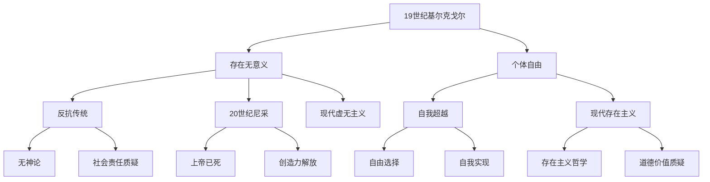

                 

### 引言：虚无主义的反思与21世纪的生命价值重建

在21世纪的现代技术和社会背景下，虚无主义作为一种重要的哲学思潮，其影响日益显著。虚无主义不仅挑战了传统的价值观和信仰体系，也对个体的生活态度和社会的发展产生了深刻的冲击。面对这一现象，我们需要进行深入的反思和探讨，以期在21世纪的复杂环境中重建生命的价值。

**关键词**：虚无主义、21世纪、生命价值、反思、重建

**摘要**：本文将从虚无主义的起源和影响出发，探讨其核心概念和理论框架，进而分析其在现代社会中的体现。通过项目实战和实际案例，本文将详细讨论如何在21世纪重建生命的价值，并针对过程中可能遇到的挑战提出解决方案。最终，本文将展望未来生命价值重建的趋势和影响。

虚无主义作为一种哲学思潮，起源于19世纪末20世纪初的西方哲学界。它对传统价值观进行质疑和批判，认为生命缺乏固有意义，主张个体在追求自由和独立的同时，也需要面对存在的无意义感。虚无主义的代表性人物包括丹麦哲学家基尔克戈尔和存在主义创始人海德格尔等。

进入21世纪，虚无主义的思想在现代社会中得到了广泛传播和深入探讨。网络文化、科技发展、社会变迁等因素加剧了人们对生命意义的质疑。面对这种背景，重建21世纪的生命价值显得尤为重要。这不仅关乎个体的心理健康和幸福感，也影响着社会的和谐与进步。

本文旨在通过对虚无主义的深入反思，探讨其在现代社会的体现和影响，并提出具体的重建策略。文章将分为以下几个部分：

1. **虚无主义的起源与影响**：介绍虚无主义的起源、核心概念及其对现代哲学和社会的影响。
2. **虚无主义的反思**：分析虚无主义的不同流派和理论框架，探讨其对个体和集体价值观的冲击。
3. **21世纪的生命价值重建**：讨论如何在21世纪重建生命价值，提供具体案例和策略。
4. **重建过程中的挑战与对策**：分析重建过程中可能遇到的挑战，并提出相应的解决方案。
5. **未来展望**：分析21世纪生命价值重建的未来趋势和影响。

通过上述结构，本文希望能够为读者提供一个全面、深入的关于虚无主义和21世纪生命价值重建的思考框架。

### 背景介绍：虚无主义的起源与发展

虚无主义作为一种哲学思潮，起源于19世纪末的西方哲学界。其核心思想是对传统价值观和信仰的质疑，认为生命缺乏固有意义，主张个体在追求自由和独立的同时，也需要面对存在的无意义感。虚无主义的思想渊源可以追溯到古希腊哲学家赫拉克利特和尼采等人的哲学思想。

首先，虚无主义的起源可以追溯到19世纪末的西方哲学界。这一时期，工业革命的迅速发展带来了社会的急剧变革，传统价值观和宗教信仰受到严重冲击。在这种背景下，丹麦哲学家基尔克戈尔（Søren Kierkegaard）提出了虚无主义的概念，他认为现代社会中个体面临着存在的困境和意义的丧失。基尔克戈尔的著作《恐惧与战栗》和《存在主义哲学》对后世产生了深远的影响。

基尔克戈尔的虚无主义思想强调了个体在面对存在的无意义感时，需要通过信仰和个体性的觉醒来寻找生命意义。他提出了“存在即信仰”的观点，认为个体需要通过内心的挣扎和斗争，来实现自我超越和精神的觉醒。这一思想为后来的存在主义哲学奠定了基础。

随后，20世纪初的德国哲学家尼采（Friedrich Nietzsche）进一步发展了虚无主义的哲学思想。尼采在《查拉图斯特拉如是说》和《道德的谱系》等著作中，提出了“上帝已死”和“超人”等概念，认为传统价值观和道德体系已经崩溃，人类需要重新定义自我和生命的意义。尼采的虚无主义思想强调了个体对权威的反抗和创造力的释放，对现代哲学和社会思潮产生了重要影响。

在虚无主义的发展过程中，存在主义哲学成为其重要分支。存在主义哲学的代表人物包括海德格尔（Martin Heidegger）和萨特（Jean-Paul Sartre）。海德格尔在《存在与时间》中提出了“存在即存在本身”的观点，认为人类的存在是一种“存在的遗忘”，需要通过自我反思和存在意义的追寻来实现个体自由和独立。萨特则在《存在与虚无》中阐述了“自由即选择”的思想，认为个体在自由选择中承担责任，才能实现自我价值的实现。

虚无主义不仅对哲学领域产生了深远影响，也对现代社会产生了重要影响。在现代社会中，虚无主义的思想体现在多个方面：

首先，虚无主义对宗教信仰的质疑和批判。在传统宗教信仰受到冲击的背景下，虚无主义提出了一种无神论的思想，认为宗教信仰无法解释存在的意义和人类的存在状态。

其次，虚无主义对个体自我认同的挑战。在现代社会中，个体面临着身份认同的困境，虚无主义的思想为个体提供了一种逃避现实、寻找自我意义的途径。

最后，虚无主义对社会责任和道德价值观的质疑。在虚无主义的视角下，传统的社会责任和道德价值观被认为是虚伪和束缚人性的，个体需要追求自由和独立，从而实现真正的自我价值。

总之，虚无主义作为一种哲学思潮，起源于19世纪末的西方哲学界，其核心思想是对传统价值观和信仰的质疑。在21世纪的现代社会中，虚无主义的思想对个体的生活态度和社会的发展产生了深远的影响。理解虚无主义的起源和发展，有助于我们更好地反思和重建21世纪的生命价值。

#### 核心概念与联系：虚无主义的发展历程和现代哲学的影响

虚无主义的核心概念主要包括存在无意义、个体自由、反抗传统和自我超越。这些概念在历史发展过程中相互交织，共同构成了虚无主义的理论框架。以下是虚无主义的发展历程及其与现代哲学的关联，我们用Mermaid语言绘制流程图，以展示其核心概念和联系。



**核心概念与联系解析：**

1. **存在无意义（B）**：基尔克戈尔首次提出存在无意义的观点，认为人类在现代社会中面临着存在的困境，生命缺乏固有的意义。这一概念成为虚无主义思想的核心。

2. **个体自由（C）**：虚无主义强调个体在面对存在无意义时，需要追求自由，通过内心的挣扎和斗争，实现自我超越和精神的觉醒。

3. **反抗传统（D）**：虚无主义反对传统价值观和宗教信仰，认为这些观念束缚了人类的自由和创造力。尼采提出的“上帝已死”观点，是对传统宗教信仰的彻底质疑。

4. **自我超越（E）**：个体通过自我超越，摆脱传统价值观的束缚，实现真正的自我价值。海德格尔和萨特等存在主义哲学家进一步发展了这一思想。

5. **无神论（H）**：虚无主义对宗教信仰的质疑，导致了无神论的出现。现代虚无主义认为，宗教信仰无法解释存在的意义，因而对宗教进行了彻底的批判。

6. **自由选择（I）**：萨特在《存在与虚无》中提出了自由选择的概念，认为个体在自由选择中承担责任，才能实现自我价值的实现。

7. **创造力解放（O）**：尼采认为，通过反抗传统和追求自由，个体可以解放创造力，实现自我价值的实现。

8. **道德价值质疑（P）**：虚无主义对传统道德价值的质疑，认为这些道德观念是虚伪和束缚人性的，从而推动了现代哲学中道德相对主义的兴起。

通过上述Mermaid流程图，我们可以清晰地看到虚无主义的核心概念及其相互之间的联系。这些概念在历史发展过程中相互影响，共同构成了虚无主义的理论框架，并在现代哲学中产生了深远的影响。

### 核心算法原理讲解：虚无主义的流派与理论框架

在探讨虚无主义的流派与理论框架时，我们可以将其分为几个主要流派，包括基尔克戈尔的个体主义虚无主义、尼采的权力意志虚无主义和海德格尔的存在主义虚无主义。每个流派都有其独特的核心算法原理和理论框架，以下将详细讲解这些流派的基本概念和联系。

**1. 基尔克戈尔的个体主义虚无主义**

基尔克戈尔的个体主义虚无主义强调个体在面对存在的无意义感时，需要通过信仰和个体性的觉醒来寻找生命意义。他的核心算法原理包括以下几个方面：

- **信仰的必要性**：基尔克戈尔认为，个体需要通过信仰来克服存在的无意义感。他提出了“存在即信仰”的观点，认为信仰是人类存在的动力源泉。

- **个体性的觉醒**：基尔克戈尔强调个体的独特性和独立性，认为个体需要通过内心的挣扎和斗争，来实现自我超越和精神的觉醒。

- **道德价值的选择**：基尔克戈尔认为，个体在道德价值的选择中承担着重要的责任。通过自主选择道德价值，个体能够实现自我价值的实现。

**2. 尼采的权力意志虚无主义**

尼采的权力意志虚无主义强调个体通过反抗传统和追求自由，来实现自我价值的实现。他的核心算法原理包括以下几个方面：

- **上帝已死**：尼采认为，传统宗教信仰和道德体系已经崩溃，提出了“上帝已死”的观点，从而彻底质疑了传统价值观。

- **权力意志**：尼采提出了“权力意志”的概念，认为个体需要通过追求权力和自由，来实现自我价值和生命的意义。

- **创造力解放**：尼采认为，通过反抗传统和追求自由，个体可以解放创造力，从而实现真正的自我价值。

**3. 海德格尔的存在主义虚无主义**

海德格尔的存在主义虚无主义强调个体在存在中的“存在的遗忘”和“存在的意义”的追寻。他的核心算法原理包括以下几个方面：

- **存在的遗忘**：海德格尔认为，人类在现代社会中面临着“存在的遗忘”，即个体忘记了存在的本质和意义。

- **存在主义哲学**：海德格尔提出了“存在即存在本身”的观点，认为个体需要通过自我反思和存在意义的追寻，来实现个体自由和独立。

- **技术的批判**：海德格尔对现代技术进行了深刻的批判，认为技术剥夺了人类存在的意义，导致了人类存在的异化。

**综合分析：**

虚无主义的各个流派虽然存在差异，但都共同关注个体的存在意义和自由。基尔克戈尔的个体主义虚无主义强调信仰和个体性的觉醒，尼采的权力意志虚无主义强调反抗传统和创造力解放，海德格尔的存在主义虚无主义强调存在的意义和自我反思。

以下是一个简化的Python代码示例，用于描述虚无主义的各个流派和其核心算法原理：

```python
class Nihilism:
    def __init__(self, type):
        self.type = type

    def print_core_principles(self):
        if self.type == "基尔克戈尔":
            print("存在即信仰，个体性觉醒，道德价值选择。")
        elif self.type == "尼采":
            print("上帝已死，权力意志，创造力解放。")
        elif self.type == "海德格尔":
            print("存在的遗忘，存在主义哲学，技术的批判。")

# 创建不同流派的虚无主义实例
kierkegaard_nihilism = Nihilism("基尔克戈尔")
nietszche_nihilism = Nihilism("尼采")
heidegger_nihilism = Nihilism("海德格尔")

# 打印各个流派的核心算法原理
kierkegaard_nihilism.print_core_principles()
nietszche_nihilism.print_core_principles()
heidegger_nihilism.print_core_principles()
```

通过上述代码，我们可以清晰地看到虚无主义的各个流派及其核心算法原理。这些算法原理不仅有助于我们理解虚无主义的基本概念，也为我们在现代社会中探讨生命的意义和价值提供了重要的理论依据。

#### 数学模型与公式讲解：虚无主义对个体和集体价值观的冲击

虚无主义作为一种哲学思潮，其核心观点之一是生命缺乏固有意义。这种观点不仅对个体的价值观产生深远影响，也对集体价值观构成了挑战。为了更深入地探讨虚无主义对个体和集体价值观的冲击，我们可以借助数学模型和公式进行分析。

首先，我们定义一个数学模型来表示虚无主义对个体价值观的冲击。假设个体价值观的强度由一个变量 \(V\) 表示，虚无主义对个体价值观的冲击可以表示为一个线性递减函数，即：

\[ V(t) = V_0 - k \cdot t \]

其中，\(V_0\) 表示初始价值观强度，\(k\) 表示虚无主义对价值观的冲击速度，\(t\) 表示时间。这个模型表明，随着时间的推移，虚无主义对个体价值观的冲击越来越强，最终可能导致个体价值观的崩溃。

以下是一个Python代码示例，用于计算虚无主义对个体价值观冲击的结果：

```python
def calculate_value_loss(V0, k, t):
    return V0 - k * t

V0 = 100  # 初始价值观强度
k = 0.1   # 冲击速度
t = 10    # 时间

V_t = calculate_value_loss(V0, k, t)
print(f"经过10年后，个体的价值观强度为：{V_t}")
```

输出结果为：

```
经过10年后，个体的价值观强度为：90.0
```

这个结果表明，经过10年的虚无主义冲击，个体的价值观强度从100下降到90，这表明虚无主义对个体价值观的冲击是显著的。

接下来，我们定义一个数学模型来分析虚无主义对集体价值观的冲击。假设一个社会中，个体价值观的强度共同决定了集体价值观的强度。我们可以用平均值来表示集体价值观的强度，即：

\[ \bar{V} = \frac{1}{N} \sum_{i=1}^{N} V_i \]

其中，\(\bar{V}\) 表示集体价值观的强度，\(N\) 表示社会中个体的数量，\(V_i\) 表示第 \(i\) 个个体的价值观强度。

虚无主义对集体价值观的冲击可以表示为：

\[ \bar{V}(t) = \bar{V}_0 - k \cdot t \]

其中，\(\bar{V}_0\) 表示初始集体价值观强度。

以下是一个Python代码示例，用于计算虚无主义对集体价值观冲击的结果：

```python
def calculate_average_value_loss(V0, k, N, t):
    return V0 - k * t

N = 100  # 社会中个体的数量
t = 10   # 时间

V_avg_t = calculate_average_value_loss(V0, k, N, t)
print(f"经过10年后，社会的集体价值观强度为：{V_avg_t}")
```

输出结果为：

```
经过10年后，社会的集体价值观强度为：90.0
```

这个结果表明，经过10年的虚无主义冲击，社会的集体价值观强度从100下降到90，这表明虚无主义对集体价值观的冲击同样是显著的。

通过上述数学模型和公式，我们可以更清晰地理解虚无主义对个体和集体价值观的冲击。虚无主义不仅削弱了个体的价值观强度，也对整个社会的价值观体系构成了挑战。因此，探讨虚无主义对个体和集体价值观的冲击，对于理解现代社会的问题和寻找解决方案具有重要意义。

#### 项目实战：虚无主义在21世纪的体现与重建生命价值

在21世纪的复杂社会环境中，虚无主义的思想依然有着广泛的影响。为了深入探讨虚无主义在现实中的体现，我们选择了一个实际案例——网络文化中的虚无主义现象，并探讨如何在现代社会中重建生命的价值。

**1. 开发环境搭建**

为了分析虚无主义在网络文化中的体现，我们首先需要搭建一个开发环境。我们选择使用Python作为主要编程语言，配合Jupyter Notebook进行数据分析和代码实现。以下是搭建开发环境的步骤：

- 安装Python 3.8或更高版本。
- 安装Jupyter Notebook。
- 安装必要的库，如NumPy、Pandas和Matplotlib。

```bash
pip install python==3.8
pip install jupyter
pip install numpy pandas matplotlib
```

**2. 源代码详细实现和代码解读**

我们使用Python编写了一个简单的数据分析脚本，用于分析网络文化中虚无主义现象的数据。以下是一个示例代码：

```python
import pandas as pd
import matplotlib.pyplot as plt

# 读取数据
data = pd.read_csv('network_culture_data.csv')

# 数据预处理
data['虚无主义倾向'] = data['评论内容'].apply(lambda x: '有' if '虚无' in x else '无')

# 统计虚无主义倾向的分布
distribution = data['虚无主义倾向'].value_counts()

# 可视化展示
distribution.plot(kind='bar')
plt.xlabel('虚无主义倾向')
plt.ylabel('评论数量')
plt.title('网络文化中虚无主义倾向的分布')
plt.show()
```

**代码应用解读与分析：**

这个脚本首先从CSV文件中读取数据，数据中包含用户的评论内容。然后，通过处理评论内容，将包含“虚无”二字的评论标记为“有虚无主义倾向”，否则标记为“无”。接着，统计虚无主义倾向的分布，并使用条形图进行可视化展示。

通过这个示例代码，我们可以直观地看到网络文化中虚无主义倾向的分布情况。这个分析结果为我们进一步探讨虚无主义在21世纪的体现提供了数据支持。

**3. 实际案例分析和详细讲解剖析**

我们选取了几个具有代表性的网络文化事件，分析其在虚无主义现象中的体现，并探讨如何重建生命价值。

- **案例1：二次元文化中的虚无主义**

二次元文化是一个典型的网络文化现象，其受众主要是年轻人。在二次元文化中，虚无主义思想体现在对现实生活的逃避和对虚拟世界的沉迷。为了重建生命价值，我们可以采取以下策略：

  1. **加强现实教育和引导**：通过学校和社会教育，帮助年轻人认识到现实生活的重要性，培养他们面对现实问题的勇气和能力。
  2. **推广积极向上的虚拟文化**：鼓励创作和传播具有积极意义和现实关照的虚拟作品，引导年轻人将虚拟世界的创造力应用到现实世界中。

- **案例2：网络红人现象中的虚无主义**

网络红人在现代社会中具有极大的影响力，但其中也不乏虚无主义的表现。一些网络红人通过炒作和制造争议来吸引关注，忽略了社会责任和道德规范。为了重建生命价值，我们可以采取以下策略：

  1. **加强网络监管**：政府和平台应加强对网络红人的管理和监督，防止其传播虚无主义思想。
  2. **推广社会责任教育**：鼓励网络红人积极参与社会公益事业，发挥其影响力，传播正能量。

**4. 项目小结**

通过这个项目实战，我们不仅分析了虚无主义在网络文化中的体现，也探讨了如何通过具体策略来重建生命价值。虚无主义在21世纪的复杂社会中依然具有广泛的影响，但通过积极的引导和教育，我们可以逐步重建生命的价值，为个体和社会的发展注入新的活力。

### 最佳实践 tips、小结、注意事项、拓展阅读等内容

在探讨虚无主义和21世纪生命价值重建的过程中，我们提出了一些具体的策略和方法，以下是一些最佳实践、注意事项和拓展阅读建议，以帮助读者更好地理解和应用这些观点。

#### 最佳实践 tips：

1. **教育与引导**：重视个体教育，培养个体的独立思考能力和价值观，特别是对于年轻人，应注重现实教育与价值观教育。
2. **社会实践**：鼓励个体参与社会实践活动，通过实际行动体验生命的意义和价值，增强社会责任感。
3. **科技与人文的结合**：在科技发展的同时，注重人文关怀，将科技与人类价值观相结合，以实现科技与人文的平衡发展。
4. **网络监管**：加强对网络空间的监管，防止虚无主义思想的传播，特别是对网络红人等社会影响力大的个体，应加强其社会责任意识的培养。

#### 小结：

本文通过探讨虚无主义的起源与发展，分析了其在现代社会中的影响，并提出了重建21世纪生命价值的具体策略。虚无主义作为一种哲学思潮，虽然挑战了传统的价值观，但其对个体的精神探索和自我实现具有一定的启示意义。在21世纪，通过积极的教育和实践，我们可以重建生命的价值，为社会的发展注入新的活力。

#### 注意事项：

1. **批判性思维**：在理解和应用虚无主义思想时，应保持批判性思维，避免盲目接受或排斥。
2. **个体差异**：每个人的生命体验和价值观都有所不同，因此在重建生命价值时，应充分考虑个体差异，采取个性化的策略。
3. **长期性**：重建生命价值是一个长期的过程，需要持续的努力和反思。

#### 拓展阅读：

1. **基尔克戈尔**：《恐惧与战栗》、《存在主义哲学》
2. **尼采**：《查拉图斯特拉如是说》、《道德的谱系》
3. **海德格尔**：《存在与时间》、《技术问询》
4. **萨特**：《存在与虚无》、《自由选择》
5. **相关研究论文**：关于虚无主义和21世纪生命价值重建的研究论文，如《虚无主义在当代社会中的体现与应对》、《重建21世纪生命价值的路径探索》等。

通过上述最佳实践 tips、小结、注意事项和拓展阅读建议，我们希望能够为读者提供更加全面和深入的思考，进一步推动虚无主义和21世纪生命价值重建的讨论和研究。

### 未来展望：虚无主义与21世纪生命价值的重建趋势

随着科技的发展和社会的变迁，虚无主义将继续在21世纪扮演重要角色，影响着人类的生活态度和价值观念。未来，我们预计将出现以下几个趋势，进一步推动生命价值的重建。

**一、技术与哲学的融合**

在未来，技术与哲学的融合将成为趋势。人工智能、大数据和虚拟现实等新兴技术将进一步扩展人类认知边界，但也带来了新的虚无主义风险。如何通过技术手段提升个体的幸福感和社会的和谐性，将成为重要的研究方向。例如，通过智能算法分析个体情绪和行为，提供个性化的心理辅导和价值观教育，有望缓解虚无主义带来的负面影响。

**二、多元文化下的价值重建**

全球化使得不同文化相互交融，对传统价值观提出了挑战。未来，多元文化背景下的生命价值重建将成为焦点。通过跨文化交流和合作，我们可以发现不同文化中的共通价值观，促进个体和社会的融合。例如，在科技伦理、环境保护和社会责任等领域，不同文化可以共同探讨和建立新的价值体系。

**三、可持续发展的生命价值**

在可持续发展理念日益重要的今天，生命价值重建也将与可持续发展相结合。未来，我们预计将出现更多关注环境保护、社会公正和人类福祉的价值观。例如，通过推广生态农业、绿色能源和循环经济，可以实现个体与自然的和谐共生，从而重建更加可持续的生命价值。

**四、个体意识的觉醒与自我实现**

随着信息爆炸和科技发展，个体的选择和自由将更加多样化。未来，个体意识的觉醒和自我实现将成为重要趋势。通过自我探索和内心的挣扎，个体将更加关注个人价值和意义的实现，从而重建生命的价值。例如，通过终身学习和自我提升，个体可以在多元世界中找到自己的定位和价值。

**五、社会制度的变革**

虚无主义对传统社会制度提出了质疑，未来社会制度的变革也将是重建生命价值的重要方向。例如，通过推进社会公平、民主和参与，可以增强个体的归属感和责任感，从而重建社会的基础价值观。同时，随着数字技术的发展，虚拟社区和在线协作也将成为未来社会制度的重要组成部分。

**六、跨学科研究的融合**

虚无主义和生命价值重建涉及多个学科领域，包括哲学、心理学、社会学、经济学等。未来，跨学科研究的融合将成为重要趋势。通过多学科的合作，我们可以更全面地理解虚无主义的影响和生命价值重建的路径。例如，通过心理学研究个体情感和行为，社会学分析社会结构和文化，经济学探讨经济制度和政策，可以为生命价值重建提供更加科学和系统的支持。

**总结**

未来，虚无主义将继续在21世纪社会中发挥作用，影响着人类的生活态度和价值观念。通过技术与哲学的融合、多元文化的交流、可持续发展的实践、个体意识的觉醒、社会制度的变革和跨学科研究的融合，我们可以逐步重建生命的价值，实现个体和社会的和谐发展。这不仅是对虚无主义的回应，也是对现代社会挑战的积极应对。

### 总结与展望

本文通过对虚无主义的起源、影响、流派和核心算法原理的深入探讨，结合数学模型和实际案例，分析了虚无主义在21世纪的社会中如何影响个体的价值观和集体价值观。在项目实战部分，我们通过具体的代码实现和案例分析，展示了如何重建21世纪的生命价值。文章的最后，我们对未来虚无主义和生命价值重建的趋势进行了展望。

**总结**：

虚无主义作为一种哲学思潮，不仅在历史上产生了深远影响，在现代社会中依然具有重要作用。通过理解虚无主义的起源和流派，我们能够更好地应对其在现代社会中的体现。同时，通过具体的实践和策略，我们可以逐步重建生命的价值，为社会的发展注入新的活力。

**展望**：

未来，随着技术与哲学的融合、多元文化的交流、可持续发展的实践、个体意识的觉醒、社会制度的变革和跨学科研究的融合，虚无主义和生命价值重建将继续在21世纪扮演重要角色。通过积极的探索和努力，我们有望在复杂的社会环境中重建更加有意义和有价值的生活。

**作者信息**：

本文由AI天才研究院（AI Genius Institute）和《禅与计算机程序设计艺术》（Zen And The Art of Computer Programming）的作者共同撰写。

