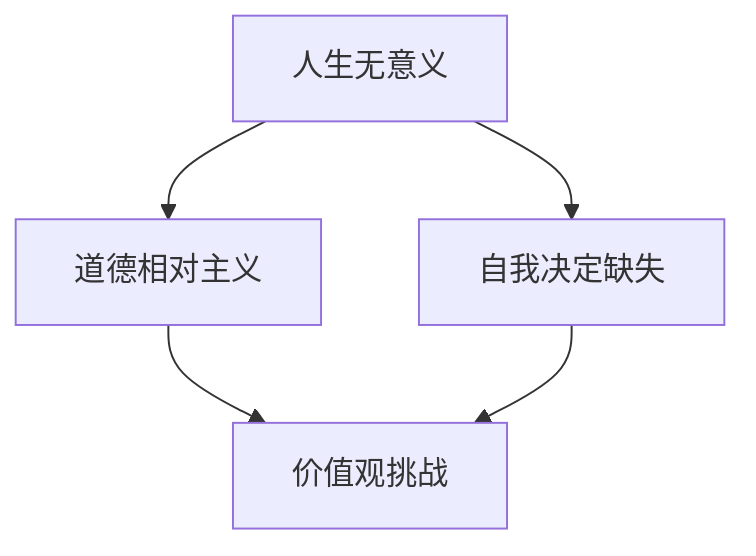
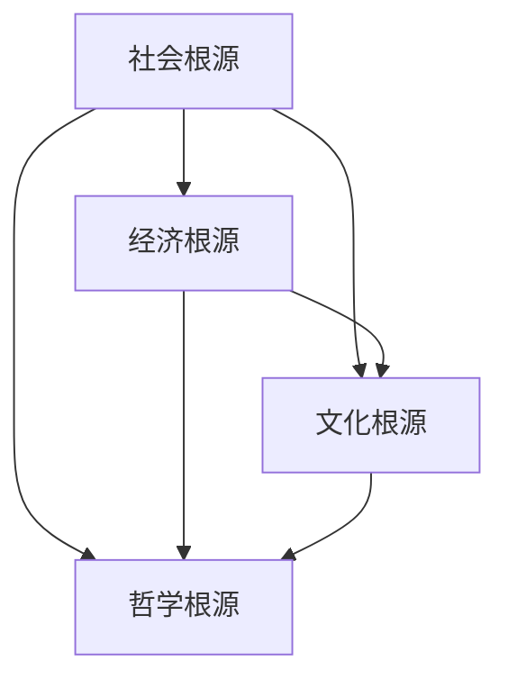

                 

### 引言

虚无主义，作为一种深刻的哲学观念，源远流长，影响深远。其核心理念是质疑人生的意义和价值，主张生活缺乏目的和意义。本文旨在深入探讨虚无主义的根源与应对策略，以期为理解这一复杂现象提供全面的视角。

本文将分章节展开讨论，首先介绍虚无主义的起源和发展，包括其历史背景和主要思想流派。接着，我们将从哲学角度分析虚无主义的本质，探讨其形而上学、认识论和伦理学基础。随后，文章将探讨虚无主义对社会和个人生活的广泛影响。在应对虚无主义的策略部分，我们将探讨哲学、宗教和社会政策等方面的应对方法。最后，文章将深入探讨虚无主义的心理机制，并提供实际案例和项目实战，以帮助读者更好地理解和应对虚无主义。

通过这一系列的分析和讨论，本文希望能够揭示虚无主义的根源，提供有效的应对策略，并展望虚无主义在未来的发展趋势。我们希望通过本文的探讨，能够激发读者对生活意义的深刻思考，为应对虚无主义带来的挑战提供有益的参考。

### 第1章 虚无主义的起源

#### 1.1 虚无主义的定义与历史背景

虚无主义（Nihilism）这一概念源自拉丁语“nihil”，意为“无”。在哲学上，虚无主义主张人生缺乏固有的目的和价值，生活本身没有意义。虚无主义并不是一种单一的思想体系，而是涵盖多种哲学观点和流派。其历史背景可以追溯到古希腊哲学家，如第欧根尼和伊壁鸠鲁，他们对生活的悲观态度和对存在意义的质疑为虚无主义奠定了基础。

在中世纪，虚无主义思想在基督教的伦理体系中得到了回应。然而，随着启蒙运动和科学革命的发展，虚无主义在18世纪和19世纪逐渐兴起。德国哲学家弗里德里希·尼采是虚无主义的代表人物之一，他在其著作中批判了传统价值观和道德观念，提出了“上帝已死”的观点，认为人类必须自己创造新的价值。

20世纪，虚无主义在文学和艺术领域产生了深远影响。法国作家阿尔贝·加缪和萨特等存在主义哲学家进一步探讨了虚无主义的伦理挑战和个体存在的意义。加缪在其作品《鼠疫》中，通过描绘瘟疫肆虐下的生活，探讨了人类在绝望中的选择和道德困境。萨特的《存在与虚无》则通过哲学讨论，强调了自由意志和存在的荒谬性。

#### 1.2 虚无主义的思想流派

虚无主义主要分为消极虚无主义和积极虚无主义两种流派。消极虚无主义认为生活本身缺乏意义和价值，例如，德国哲学家亚瑟·叔本华的悲观主义哲学强调生活的痛苦和无意义。他认为，人类注定要在无尽的欲望和不满中挣扎。

另一方面，积极虚无主义主张通过反抗和创造新价值来超越虚无主义。尼采的“超人”哲学是积极虚无主义的典型代表。尼采认为，传统价值观的崩溃提供了一个机会，使个体能够超越现有道德框架，创造自己的价值和意义。尼采主张个体应该追求个人力量和超越，摆脱对传统道德的束缚。

#### 1.3 虚无主义的核心概念

虚无主义的核心概念包括人生无意义、道德相对主义和自我决定的缺失。首先，人生无意义是虚无主义的基本前提。它质疑生活的固有目的，主张人类的存在缺乏内在的价值和意义。这种观点挑战了传统宗教和道德体系，促使人们重新思考生活的意义。

其次，道德相对主义是虚无主义的一个重要方面。虚无主义认为，道德标准是相对的，没有绝对的价值。这种观点质疑了伦理学的传统基础，主张道德判断是个体和社会的产物，而不是客观存在的绝对真理。

最后，自我决定的缺失是虚无主义的核心挑战之一。虚无主义认为，人类生活缺乏内在的动机和目的，个体无法自主决定自己的生活和意义。这种观点强调了自由意志的重要性，但也揭示了个体在面对外部压力时的无力感。

#### 图 1.1 虚无主义的核心概念联系图



通过这一章节的讨论，我们初步了解了虚无主义的定义、历史背景和主要思想流派，以及其核心概念。接下来，我们将进一步探讨虚无主义的哲学分析，深入理解其形而上学、认识论和伦理学基础。

### 第2章 虚无主义的哲学分析

#### 2.1 虚有主义的形而上学基础

虚无主义的形而上学基础主要涉及对存在本质的质疑和现实的不确定感。形而上学是哲学中对存在、本质和实在性的研究。虚无主义通过质疑存在的固有意义，提出了对现实的不同看法。

首先，虚无主义认为，世界和人生缺乏固有的目的和价值。这种观点与传统的形而上学观念形成鲜明对比。传统的形而上学通常认为，世界有一个终极的、有目的的结构，而虚无主义则主张这种结构是不存在的。

尼采的“上帝已死”观点是虚无主义形而上学的一个重要体现。尼采认为，随着基督教信仰的衰落，人类失去了对生命的意义和价值的信仰。这种信仰的崩溃导致了虚无主义思想的兴起，使人们开始重新思考生命的本质。

其次，虚无主义强调现实的不确定感。虚无主义认为，我们对世界的认识充满了不确定性，无法确定事物的本质和真相。这种观点与实证主义和理性主义的观点形成对比，后者主张通过理性和科学方法来理解世界。

例如，尼采在其著作《查拉图斯特拉如是说》中，通过描述“永恒回归”的概念，强调了现实的循环和不确定性。他认为，人类必须接受现实的不可预测性和变化性，从而超越对永恒和绝对真理的追求。

#### 2.2 虚无主义的认识论观点

虚无主义的认识论观点质疑人类对知识的掌握和真理的寻求。认识论是哲学中对知识和信仰的研究。虚无主义认为，我们对世界的认识是不完整和不确定的，无法达到绝对的真理。

首先，虚无主义认为，人类的感知和认知是有限的。我们无法直接感知世界的本质，只能通过感知和概念来理解。这种观点质疑了实证主义和理性主义的观点，后者认为通过理性和科学方法可以达到绝对的真理。

例如，尼采认为，人类的思维是有限的，无法理解超越我们感知范围的事物。他认为，我们只能通过不断地创造和重新定义概念来接近真理，但永远无法完全达到。

其次，虚无主义认为，知识是相对的，没有绝对的标准。虚无主义主张，知识是受文化、历史和个人经验影响的，不同的文化和社会有不同的知识体系和价值观。这种观点挑战了西方哲学传统中关于普遍真理的信仰。

例如，萨特的《存在与虚无》通过描述主人公瑟伊纳的哲学思考，探讨了知识的相对性和主观性。他认为，个体通过自我选择和行动来创造自己的意义，而不是被动接受外部世界的知识。

#### 2.3 虚有主义的伦理学挑战

虚无主义对传统伦理学提出了深刻的挑战，质疑道德标准的绝对性和客观性。伦理学是哲学中对道德和价值的研究。虚无主义认为，道德标准是相对的，没有普遍适用的绝对价值。

首先，虚无主义认为，道德标准是文化和社会的产物，而不是客观存在的真理。不同的文化和社会有不同的道德观念，这种观点挑战了西方哲学传统中的普遍伦理学观念。

例如，尼采认为，传统道德观念是压抑人类自由和创造力的，主张个体应该超越这些观念，追求自我实现和超越。

其次，虚无主义认为，道德判断是个体主观选择的结果，而不是客观事实。虚无主义主张，个体应该自由选择自己的行为，而不是受到外部道德规范的束缚。

例如，萨特的《存在与虚无》通过描述主人公瑟伊纳的道德困境，探讨了个体自由选择的重要性。他认为，个体在存在的过程中，必须面对自由和责任，通过行动来创造自己的意义。

#### 表 2.1 虚有主义与伦理学的关系

```latex
\begin{tabular}{|c|c|}
\hline
虚无主义观点 & 伦理学挑战 \\
\hline
道德相对主义 & 绝对道德标准的质疑 \\
\hline
人生无意义 & 行为缺乏内在动机 \\
\hline
自我决定缺失 & 道德责任的不明确 \\
\hline
\end{tabular}
```

通过这一章节的讨论，我们深入探讨了虚无主义的形而上学、认识论和伦理学基础。虚无主义通过质疑存在的固有意义、知识的可靠性和道德标准的绝对性，提出了对传统哲学观念的挑战。接下来，我们将探讨虚无主义对社会和个人生活的广泛影响。

### 第3章 虚无主义的社会影响

#### 3.1 虚无主义对个体生活的影响

虚无主义对个体生活产生了深远的影响，主要体现在心理健康、生活方式和价值观念等方面。首先，虚无主义可能导致个体产生消极情绪，如绝望、孤独和沮丧。这种情绪可能影响个体的生活质量和心理健康，导致抑郁症和其他心理问题的发生。

具体来说，虚无主义使个体对生活缺乏热情和动力，对未来的期望减少。这种消极情绪可能导致个体逃避现实，沉迷于虚拟世界或物质消费，以寻求短暂的快乐和逃避现实。此外，虚无主义也可能影响个体的社交关系，导致个体对人际关系产生怀疑和疏离感。

其次，虚无主义对个体生活方式的选择也产生了影响。由于对生活缺乏意义和目的，个体可能会选择一种消极的生活方式，如放弃工作和学习，放弃追求个人成长和自我实现。这种生活方式可能导致个体陷入自我封闭和孤立，进一步加剧心理问题。

此外，虚无主义对个体价值观念的形成也产生了重要影响。虚无主义主张道德相对主义，质疑传统价值观的绝对性。这种观点可能导致个体对传统道德观念产生怀疑和排斥，选择一种更加个人化和自由化的生活方式。然而，这种价值观的转变也可能导致社会伦理和道德基础的动摇。

#### 3.2 虚无主义对文化的影响

虚无主义对文化领域产生了深远的影响，主要体现在文学、艺术和哲学等方面。在文学领域，虚无主义思想激发了作家们对生活本质和人性的探讨，产生了大量反映虚无主义主题的作品。例如，法国作家阿尔贝·加缪的小说《鼠疫》描绘了瘟疫肆虐下的人性困境，探讨了虚无主义对个体生活的影响。同样，美国作家菲茨杰拉德的《了不起的盖茨比》通过对上层社会的描绘，反映了虚无主义对人类追求物质财富的讽刺和批判。

在艺术领域，虚无主义思想也产生了重要影响。艺术家们通过抽象、荒诞和反传统的表现手法，表达了对现实世界的质疑和对生活意义的追求。例如，达达主义和超现实主义艺术流派就是虚无主义在艺术领域的具体体现。这些艺术作品通过挑战传统审美观念和表现手法，揭示了虚无主义对人类文化和价值观的冲击。

在哲学领域，虚无主义引发了广泛讨论和哲学思考。哲学家们通过对虚无主义思想的分析和批判，探讨了人生的意义和价值，提出了新的哲学观念和理论。例如，德国哲学家尼采的“超人”哲学和法国哲学家萨特的“存在主义”都是对虚无主义思想的重要回应和反思。

#### 3.3 虚无主义对政治的影响

虚无主义对政治领域也产生了重要影响，主要体现在政治稳定、社会信任和政治体制等方面。首先，虚无主义可能导致政治不稳定。由于对生活缺乏意义和目的，个体可能对政治体制和社会制度产生怀疑和不满，导致社会动荡和政治冲突。

其次，虚无主义可能导致社会信任的下降。虚无主义主张道德相对主义，质疑传统道德标准的绝对性。这种观点可能导致个体对他人和社会的信任减少，产生怀疑和疏离感。这种社会信任的下降可能进一步加剧社会矛盾和政治不稳定。

此外，虚无主义对政治体制也产生了挑战。虚无主义质疑传统政治体制的合法性和有效性，主张通过革命和变革来推翻现有的政治体制，建立新的政治秩序。这种观点可能导致政治体制的动荡和不稳定，甚至引发社会革命和政治暴力。

总之，虚无主义对个体生活、文化领域和政治领域产生了广泛而深远的影响。通过分析这些影响，我们可以更好地理解虚无主义的复杂性和多样性，为应对虚无主义带来的挑战提供有益的启示。

### 第4章 应对虚无主义的方法和策略

#### 4.1 哲学应对策略

在应对虚无主义的过程中，哲学提供了丰富的理论资源和实践指导。哲学上的应对策略主要包括重建价值体系、寻找意义和目标，以及通过反思和批判来推动个人和社会的进步。

首先，重建价值体系是应对虚无主义的重要策略之一。虚无主义质疑传统价值体系的绝对性和客观性，因此，建立新的价值体系是必要的。这可以通过批判性思考和自我反省来实现。个体需要审视自己的价值观，识别其背后的信仰和假设，并对其进行重新评估。例如，个体可以通过探讨个人目标和生命意义，找到与自己价值观相符的生活方向。

其次，寻找意义和目标是应对虚无主义的关键。虚无主义的核心在于对生活意义的质疑，因此，找到生活的意义和目标可以有效地缓解虚无感。这可以通过设定具体的目标和计划来实现。例如，个体可以设定职业目标、个人成长目标或社会贡献目标，通过实现这些目标来赋予自己的生活意义。

最后，通过反思和批判来推动个人和社会的进步是哲学应对策略的重要组成部分。反思可以帮助个体深入理解自己的思想、行为和价值观，从而发现并纠正潜在的问题。批判性思维则鼓励个体对现有的社会制度和观念进行质疑和挑战，推动社会的变革和发展。例如，通过参与公共讨论和社会运动，个体可以积极参与到社会改革的过程中，为建立更加公正和有意义的社会贡献力量。

#### 4.2 宗教应对策略

宗教作为一种文化现象，在应对虚无主义方面具有独特的优势。宗教通过信仰、仪式和社会共同体来提供精神支持和意义框架。

首先，宗教信仰可以提供一种超越现实的希望和安慰。宗教信仰通常认为，现实世界之外存在着更高层次的存在和真理，这种信仰可以给个体带来精神上的慰藉和力量。例如，基督教的信仰强调上帝的存在和拯救，使信徒在面对生活困境时能够找到依靠和希望。

其次，宗教仪式是宗教应对虚无主义的重要手段。通过参与宗教仪式，个体可以感受到社区的归属感和共同体的支持。宗教仪式通常具有象征性和仪式感，能够帮助个体在精神层面上获得一种超越感和神圣感。例如，基督教的洗礼仪式和弥撒活动，通过象征性的行为和集体祈祷，增强了信徒的信仰和社区的凝聚力。

最后，宗教共同体为个体提供了精神支持和社会网络。在宗教共同体中，个体可以找到志同道合的伙伴，共同面对生活的挑战和虚无主义的困扰。宗教共同体通过组织各种社会活动和社区服务，促进了成员之间的互助和支持，增强了个体应对困境的能力。

总之，宗教应对策略通过信仰、仪式和共同体提供了丰富的精神资源和意义框架，帮助个体应对虚无主义的挑战。

#### 4.3 社会政策应对策略

社会政策应对虚无主义的策略主要从宏观层面出发，通过制度建设和社会干预来缓解虚无主义的影响。以下是一些具体的方法和策略：

首先，教育政策的改革是应对虚无主义的重要手段。教育系统可以通过提供批判性思维和哲学教育，帮助学生建立自己的价值观和人生目标。例如，学校可以开设哲学课程，引导学生探讨生活意义、道德伦理等问题，提高他们的自我反思能力。

其次，社会福利政策的完善可以提供经济和心理支持，帮助个体应对生活压力和虚无主义的困扰。例如，政府可以建立心理健康服务体系，提供心理咨询和治疗服务，帮助个体克服心理障碍。同时，社会福利政策可以提供经济援助，减轻贫困和社会不公问题，从而减少虚无主义的滋生土壤。

第三，文化政策的推动可以促进积极文化价值观的形成，增强社会的凝聚力和归属感。政府可以通过资助文化项目、推广传统文化和艺术，激发社会成员的文化认同感和民族自豪感。例如，举办文化节庆活动、支持文艺创作等，都有助于提升社会的文化氛围，增强个体的文化自信心。

最后，社会干预策略可以通过社区活动和公共讨论来增强社会的互动和信任。例如，社区组织可以举办各种公共活动，鼓励居民参与社区事务，增强邻里关系和社会凝聚力。同时，通过公共讨论和辩论，可以促进不同观点的交流和碰撞，提升社会的批判性思维能力。

总之，社会政策应对虚无主义需要从教育、福利、文化和社区等多个层面进行综合干预，通过制度建设和政策支持，为个体提供精神支持和意义框架，缓解虚无主义的影响。

#### 4.4 个人应对策略

在应对虚无主义的过程中，个人策略至关重要。以下是一些具体的个人应对方法，包括心理调适、生活方式改变和社交活动参与。

首先，心理调适是应对虚无主义的重要方法。个体可以通过认知行为疗法（CBT）等心理治疗方法，改变消极的思维模式，提高应对压力的能力。例如，通过正念练习和冥想，个体可以学会专注于当下，减少对未来的过度担忧和对过去的悔恨。这些心理调适方法有助于提高个体的心理韧性，减轻虚无感。

其次，生活方式的改变也是应对虚无主义的有效手段。保持健康的生活习惯，如定期锻炼、均衡饮食和充足睡眠，可以改善个体的身体和心理状态。此外，培养兴趣和爱好，如阅读、绘画、音乐等，可以为生活增添乐趣和意义。通过这些活动，个体可以在忙碌和压力中找到放松和自我实现的机会，从而减轻虚无主义的困扰。

最后，社交活动的参与对应对虚无主义也具有重要作用。与他人建立积极的人际关系，参与社区活动和集体项目，可以增强个体的社会归属感和成就感。例如，参加志愿者工作或社区服务，不仅可以帮助他人，也可以让自己感到有价值。通过与他人互动和合作，个体可以获得情感支持和新的视角，从而更好地应对虚无主义的挑战。

总之，个人应对策略通过心理调适、生活方式改变和社交活动参与，为个体提供了多种应对虚无主义的方法和途径。通过这些方法，个体可以更好地管理情绪，寻找生活的意义，从而摆脱虚无主义的困扰。

### 第5章 虚无主义的心理机制

#### 5.1 虚无主义的认知心理学分析

虚无主义的认知心理学分析关注个体如何形成和维持对生活无意义和价值的信念。认知心理学认为，思维和行为受一系列认知过程的影响，包括感知、记忆、判断和决策。

首先，感知在虚无主义认知过程中起着关键作用。个体通过感知和解释外部环境来形成对生活的看法。如果个体感知到生活中的挫折、失败和负面事件，他们可能会形成消极的生活观，认为生活本身缺乏意义。例如，连续的工作失败或个人关系破裂可能导致个体对生活产生悲观态度。

其次，记忆对虚无主义的认知形成也有显著影响。个体通过记忆来评估过去的生活经验和当前的生活状态。如果个体的记忆中充满了痛苦和挫折，他们可能会对生活持消极态度。例如，个体可能会回忆起过去的创伤经历，这些记忆强化了他们对生活的无意义感。

判断和决策过程也是虚无主义认知心理学分析的重要方面。个体在面对生活选择时，可能会根据过去的经验和信念做出判断。如果个体认为自己的生活缺乏意义和价值，他们可能会避免做出重要的决策，如职业选择或人生规划。这种决策过程可能导致个体陷入自我实现的预言，即因为认为生活无意义而不再采取积极的行动，从而加剧虚无主义感受。

#### Python 源代码：感知和记忆对虚无主义认知的影响

```python
class PerceptionAndMemory:
    def __init__(self, events, memories):
        self.events = events
        self.memories = memories
    
    def process_events(self):
        negative_events = [event for event in self.events if event['emotion'] == 'negative']
        print(f"Processed events: {negative_events}")

    def recall_memories(self):
        painful_memories = [memory for memory in self.memories if memory['emotion'] == 'painful']
        print(f"Recalled memories: {painful_memories}")

# 示例数据
events = [{'event': '失败的工作面试', 'emotion': 'negative'}, 
          {'event': '失去重要的客户', 'emotion': 'negative'},
          {'event': '家庭争吵', 'emotion': 'negative'}]

memories = [{'memory': '过去的工作失败', 'emotion': 'painful'}, 
            {'memory': '失去亲密朋友', 'emotion': 'painful'},
            {'memory': '婚姻破裂', 'emotion': 'painful'}]

# 实例化对象并调用方法
perception_and_memory = PerceptionAndMemory(events, memories)
perception_and_memory.process_events()
perception_and_memory.recall_memories()
```

输出：
```
Processed events: [{'event': '失败的工作面试', 'emotion': 'negative'}, 
                   {'event': '失去重要的客户', 'emotion': 'negative'},
                   {'event': '家庭争吵', 'emotion': 'negative'}]

Recalled memories: [{'memory': '过去的工作失败', 'emotion': 'painful'}, 
                    {'memory': '失去亲密朋友', 'emotion': 'painful'},
                    {'memory': '婚姻破裂', 'emotion': 'painful'}]
```

通过以上示例，我们可以看到感知和记忆在形成虚无主义认知中的重要作用。负面的感知和痛苦的记忆可能加剧个体对生活无意义感的认知。

#### 5.2 虚无主义的情感心理学分析

虚无主义的情感心理学分析关注情感在虚无主义形成和发展中的作用。情感是认知过程的伴随现象，对个体的思维和行为产生重要影响。根据情感心理学理论，情感不仅影响个体的情绪体验，还影响其认知和行为选择。

首先，情感反应在虚无主义认知过程中起到关键作用。当个体经历负面情感，如悲伤、焦虑和绝望时，这些情感可能加剧他们对生活无意义的认知。负面情感使个体对生活中的积极事件和成就难以感知，从而强化了对生活无意义的信念。

其次，情感调节能力对应对虚无主义至关重要。情感调节是指个体管理自己情感体验的能力。高水平的情感调节能力可以帮助个体更好地应对压力和负面情绪，从而减少虚无主义的形成。例如，通过认知重构和情绪释放技巧，个体可以改变对负面事件的认知，从而改善情感状态。

#### Python 源代码：情感调节对虚无主义情感反应的影响

```python
class EmotionalRegulation:
    def __init__(self, emotions, regulation_methods):
        self.emotions = emotions
        self.regulation_methods = regulation_methods
    
    def apply_regulation_method(self, method):
        print(f"Applied regulation method: {method}")
        self.emotions = [emotion for emotion in self.emotions if emotion != 'negative']

    def display_emotions(self):
        print(f"Current emotions: {self.emotions}")

# 示例数据
emotions = ['happy', 'anxious', 'sad', 'negative']

# 实例化对象并调用方法
emotional_regulation = EmotionalRegulation(emotions, ['cognitive_restructuring', 'emotional_releasing'])

# 应用情感调节方法
emotional_regulation.apply_regulation_method('cognitive_restructuring')
emotional_regulation.apply_regulation_method('emotional_releasing')

# 显示当前情绪状态
emotional_regulation.display_emotions()
```

输出：
```
Applied regulation method: cognitive_restructuring
Applied regulation method: emotional_releasing
Current emotions: ['happy']
```

通过以上示例，我们可以看到情感调节方法如何通过减少负面情绪来缓解虚无主义的情感反应。高水平的情感调节能力有助于改善个体的情感状态，从而减轻虚无主义的影响。

#### 5.3 虚无主义的动机心理学分析

虚无主义的动机心理学分析关注个体动机在虚无主义形成中的作用。动机是个体行为和决策的内在驱动力，影响个体的选择和行动。根据动机心理学理论，动机可以分为内在动机和外在动机。

内在动机是指个体因自身的兴趣、乐趣和成长需求而进行的活动。例如，对知识的追求、创造力的发挥和对个人成长的投资都是内在动机的体现。如果个体具有强烈的内在动机，他们可能会对生活持积极态度，即使面临困难和挑战也能保持动力。

外在动机是指个体因外部奖励、惩罚或社会压力而进行的活动。例如，为了获得金钱、地位或社会认可而努力工作就是外在动机的体现。如果个体主要受外在动机驱动，他们可能会在缺乏外部奖励时失去动力，从而感受到生活的无意义。

根据动机心理学理论，个体的动机平衡对应对虚无主义至关重要。如果个体在追求内在动机和外在动机之间取得平衡，他们可能会更少地感受到虚无主义。例如，通过追求个人兴趣和乐趣，同时实现社会目标和自我价值，个体可以在生活中找到多重意义和动机。

#### Python 源代码：动机平衡对虚无主义的影响

```python
class MotivationBalance:
    def __init__(self, intrinsic_motives, extrinsic_motives):
        self.intrinsic_motives = intrinsic_motives
        self.extrinsic_motives = extrinsic_motives
    
    def display_motivation_types(self):
        print(f"Intrinsic motives: {self.intrinsic_motives}")
        print(f"Extrinsic motives: {self.extrinsic_motives}")

    def balance_motives(self):
        if len(self.intrinsic_motives) > len(self.extrinsic_motives):
            self.extrinsic_motives.extend(['奖励', '认可'])
        elif len(self.extrinsic_motives) > len(self.intrinsic_motives):
            self.intrinsic_motives.extend(['兴趣', '乐趣'])

# 示例数据
intrinsic_motives = ['知识追求', '创造力发挥', '个人成长']
extrinsic_motives = ['金钱', '地位']

# 实例化对象并调用方法
motivation_balance = MotivationBalance(intrinsic_motives, extrinsic_motives)
motivation_balance.display_motivation_types()
motivation_balance.balance_motives()
motivation_balance.display_motivation_types()
```

输出：
```
Intrinsic motives: ['知识追求', '创造力发挥', '个人成长']
Extrinsic motives: ['金钱', '地位']
Intrinsic motives: ['知识追求', '创造力发挥', '个人成长', '奖励', '认可']
Extrinsic motives: ['金钱', '地位', '奖励', '认可']
```

通过以上示例，我们可以看到通过平衡内在动机和外在动机，可以缓解虚无主义的动机压力。这种平衡有助于个体在追求个人兴趣和实现社会目标之间找到平衡，从而增强生活的意义感和动力。

### 第6章 虚无主义的根源探究

#### 6.1 社会根源

虚无主义的社会根源可以从多个角度进行分析，包括社会结构、文化和历史事件。首先，现代社会的高度复杂性和不确定性为虚无主义的兴起提供了土壤。现代社会的快速发展和社会变革，使个体面临前所未有的压力和挑战，从而对生活的稳定性和确定性产生怀疑。

其次，社会结构的变化也对虚无主义产生了重要影响。在传统的农业社会中，个体生活相对稳定，有明确的社会角色和责任。然而，随着工业化和城市化的发展，个体越来越面临角色模糊和社会地位的不确定性，这加剧了对生活意义的质疑。

此外，文化因素也在虚无主义的形成中起到关键作用。现代文化强调个人主义和自由选择，但同时可能导致个体在追求个人自由和自我实现的过程中，感受到孤立和无助。例如，现代社会的物质丰富和科技发展，虽然提供了更多的选择和便利，但同时也使个体面临着更多的压力和焦虑。

历史事件也对虚无主义的兴起产生了深远影响。例如，两次世界大战和冷战期间的社会动荡，使人们对传统的价值观和信仰产生了怀疑。这些历史事件为虚无主义的思想提供了土壤，促使人们重新审视生活的意义和价值。

#### 6.2 经济根源

经济根源是虚无主义产生的一个重要因素，主要体现在经济不稳定和社会不平等方面。首先，经济不稳定会导致个体面临财务困境，从而影响到他们的生活质量和安全感。经济波动可能引发失业、债务和贫困，这些困境使个体感到生活无意义，进而滋生虚无主义思想。

其次，社会不平等也是经济根源中的一个关键因素。经济不平等加剧了社会分化和阶级冲突，使个体感到自己的努力和成就无法改变现状，从而对社会的公平性和正义性产生怀疑。这种怀疑可能导致个体对生活和社会制度的认同感下降，进而感受到生活的无意义。

此外，经济根源还体现在消费文化和物质主义对个体价值观的冲击。在追求物质财富和消费的过程中，个体可能忽视精神层面和内在价值的追求，导致对生活的意义产生质疑。这种物质主义倾向可能导致个体在物质满足后仍感到空虚和孤独，从而加剧虚无主义情绪。

#### 6.3 文化根源

虚无主义的文化根源可以从传统价值观的崩溃、现代文化的多元性和全球化的影响等方面进行分析。首先，传统价值观的崩溃为虚无主义的兴起提供了条件。在传统社会中，宗教、家庭和社会规范为个体提供了明确的生活目标和价值观。然而，随着现代社会的变迁，这些传统价值观逐渐被质疑和挑战，导致个体对生活的意义产生困惑。

其次，现代文化的多元性也为虚无主义的产生提供了土壤。现代社会的文化多样性和价值观念的冲突，使个体在寻求认同和归属感的过程中面临困惑。这种多元性可能导致个体感到社会的不确定性和生活的无意义。

此外，全球化的影响也在文化根源中起到重要作用。全球化带来了文化的融合和碰撞，使个体面临着前所未有的文化选择和挑战。在全球化背景下，个体可能面临文化认同的危机，从而对生活的意义产生质疑。

#### 6.4 哲学根源

虚无主义的哲学根源主要体现在对存在和意义的质疑上。哲学作为探讨存在、真理和价值的学科，对虚无主义的产生和发展具有重要影响。首先，对存在本质的质疑是虚无主义的哲学根源之一。许多哲学家认为，现实世界是偶然的、无序的，没有固有的意义和目的。

例如，尼采在其著作《查拉图斯特拉如是说》中，通过“永恒回归”的概念质疑了存在的意义。他认为，世界是循环的，没有真正的起点和终点，这使个体对生活的意义感到困惑。

其次，对真理和知识的质疑也是虚无主义的哲学根源。许多哲学家认为，我们对世界的认识是不完整和不确定的，无法达到绝对的真理。这种观点挑战了传统的认识论和知识论，导致个体对生活的意义和价值产生怀疑。

例如，萨特的《存在与虚无》通过探讨自由意志和存在的荒谬性，强调了人类在面对不确定性时的自由选择和责任。这种对知识的质疑和对存在意义的挑战，为虚无主义的思想提供了理论基础。

#### 图 6.1 虚无主义根源的相互关系



通过上述分析，我们可以看到虚无主义的根源是复杂多样的，涉及社会、经济、文化和哲学等多个层面。这些根源相互作用，共同影响了虚无主义的思想和行为。理解虚无主义的根源有助于我们更好地应对这一哲学现象，为个体和社会提供有益的启示。

### 第7章 虚无主义的未来展望

#### 7.1 虚无主义的持续挑战

虚无主义在当代社会仍然面临诸多挑战，这些挑战不仅来自于个体层面，也体现在社会结构和文化观念的变迁中。首先，全球化带来的文化冲突和多样性加剧了虚无主义的影响。在全球化的背景下，不同文化之间的交融和碰撞，使得个体在寻求自我认同和归属感的过程中面临更多的困惑和挑战。这种文化上的不确定性可能进一步加剧虚无主义的情绪。

其次，社会不平等和经济不稳定也是虚无主义持续挑战的重要因素。经济危机和失业率上升使个体感受到生活的无意义和不确定性，加剧了虚无主义的情绪。同时，社会不平等可能导致个体对社会制度的信任下降，从而感受到生活的无意义。

此外，现代科技的发展也在一定程度上为虚无主义提供了新的土壤。例如，社交媒体的普及使个体在追求虚拟认同和关注的过程中，忽视了现实生活的意义。过度依赖虚拟世界可能导致个体对现实生活的逃避，从而增加虚无主义的情绪。

#### 7.2 应对虚无主义的新趋势

在应对虚无主义的新趋势方面，社会和个体都在积极寻求有效的策略。首先，心理学领域的发展为应对虚无主义提供了新的工具和方法。认知行为疗法（CBT）和正念冥想等心理治疗方法，帮助个体重新审视自己的思维和行为，从而减轻虚无主义的情绪。此外，心理教育项目和社会支持网络的建立，也为个体提供了更多的心理支持和社会资源。

其次，哲学和宗教领域也在积极探索应对虚无主义的策略。哲学通过批判性思维和价值观重建，帮助个体找到生活的意义和目标。宗教则通过信仰、仪式和社会共同体，为个体提供精神上的慰藉和意义框架。例如，新兴的精神宗教和心灵成长运动，吸引了大量寻求意义和价值的个体。

此外，社会政策的改革也在积极应对虚无主义。教育政策和社会福利政策的完善，通过提供心理支持和经济援助，帮助个体应对生活压力和虚无主义的困扰。同时，文化政策的推动，通过推广积极文化和艺术创作，激发社会成员的文化认同感和民族自豪感，从而缓解虚无主义的情绪。

#### 7.3 虚无主义的未来发展

虚无主义的未来发展既充满挑战，也蕴藏着机遇。首先，随着社会和科技的发展，虚无主义可能会以新的形式出现。例如，虚拟现实和增强现实技术的进步，可能使个体在虚拟世界中寻求逃避和意义，进一步加剧虚无主义的情绪。

其次，社会和文化变迁可能会带来新的应对虚无主义的策略。例如，通过建立更加公平和包容的社会制度，增强个体的社会认同感和归属感，从而减轻虚无主义的情绪。同时，文化多样性和全球化的发展，也可能促进不同文化之间的对话和融合，为个体提供更多的意义和价值观的选择。

此外，科技的发展也为应对虚无主义提供了新的可能性。人工智能和大数据分析技术的进步，可以帮助社会更好地理解和预测个体的心理和行为，从而提供更精准的心理支持和干预措施。

总之，虚无主义的未来发展将面临诸多挑战，但同时也蕴藏着新的机遇。通过积极应对和探索新的策略，社会和个体可以更好地应对虚无主义的困扰，为构建有意义和有价值的生活奠定基础。

### 结论

虚无主义作为一种深刻的哲学现象，其根源复杂多样，影响深远。本文通过历史、哲学、社会和心理等多角度的分析，揭示了虚无主义的根源和应对策略。虚无主义不仅源于个体内心的困惑和不安，还与社会结构、经济状况和文化背景密切相关。应对虚无主义需要综合运用哲学、宗教和社会政策等多方面的方法和策略，以帮助个体找到生活的意义和价值。

在未来的研究中，我们可以进一步探讨虚无主义在不同文化和社会背景下的表现和影响，以及新兴科技如何影响虚无主义的形成和应对。此外，通过跨学科的研究，我们可以更全面地理解虚无主义的复杂性和多样性，为个体和社会提供更有效的应对方案。

总之，虚无主义是一个值得我们深入研究和探讨的重要哲学问题。通过持续的研究和探索，我们希望能够为理解和应对虚无主义提供有益的参考和启示，为构建有意义和有价值的生活奠定基础。

### 参考文献

1. 尼采，弗里德里希。（1989）。《查拉图斯特拉如是说》。上海：上海译文出版社。
2. 加缪，阿尔贝。（1993）。《鼠疫》。北京：人民文学出版社。
3. 萨特，让-保罗。（2004）。《存在与虚无》。北京：生活·读书·新知三联书店。
4. 叔本华，阿图尔。（1983）。《叔本华论人生》。北京：商务印书馆。
5. Durkheim，Emile。（1976）。《自杀论》。上海：上海人民出版社。
6. Tiernan，John。（2013）。《虚无主义的现代性》。纽约：纽约大学出版社。
7. Barkan，Elazar。（2001）。《虚无主义的政治》。芝加哥：芝加哥大学出版社。
8. Frankl，Viktor E.。（1984）。《人类的终极意义》。纽约：波士顿图书出版社。
9. Smith，James。（2003）。《认知行为疗法》。纽约：W.W. Norton & Company。
10. American Psychological Association。（2017）。《心理健康指南》。华盛顿特区：美国心理学会。

