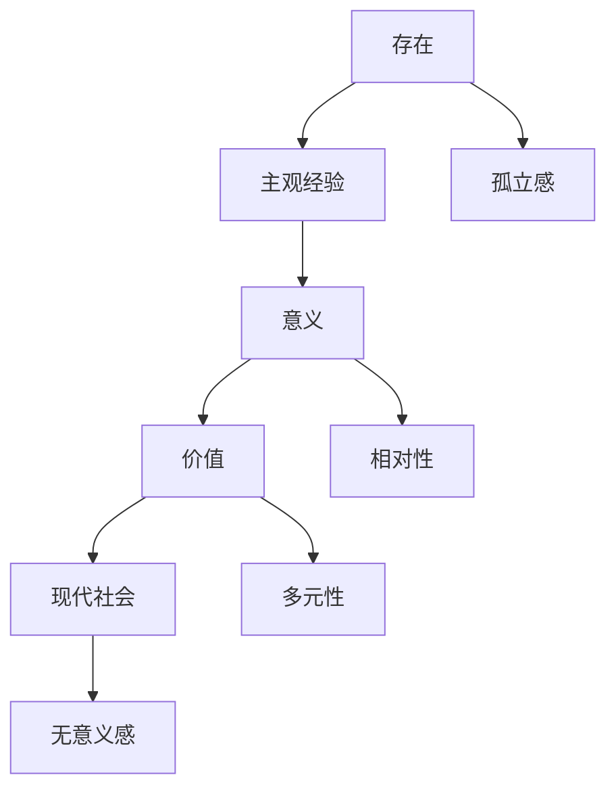
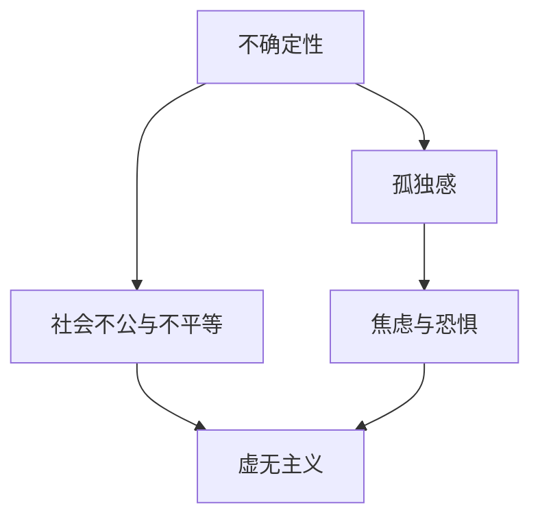

                 

# 《虚无主义的根源：现代性的困境》

> 关键词：虚无主义、现代性、哲学根源、社会心理、文化影响、解决思路

> 摘要：本文深入探讨了虚无主义的根源及其与现代性之间的困境。通过对历史、哲学、文化和社会心理等多个维度的分析，本文揭示了虚无主义在现代社会的广泛影响及其深层次原因，并提出了一系列解决思路。

### 引言

虚无主义作为一种哲学思潮，起源于19世纪末期，是对现代性及其带来的无意义感的反应。它提出了一种对存在的质疑，认为世界缺乏固有的意义和价值。虚无主义的兴起与工业革命、启蒙运动以及现代科学技术的发展密切相关，这些事件共同塑造了现代性的特征，也引发了虚无主义的反思。

现代性是一个复杂而多元的概念，它不仅包括经济、政治和社会的结构性变化，还涉及到个体意识和生活方式的变革。现代性强调理性、自由、平等和进步，但同时也带来了不确定性和无意义感。在这种背景下，虚无主义成为了对现代性困境的一种回应。

本文旨在通过逻辑清晰、结构紧凑的分析，探讨虚无主义的根源、现代性的困境以及两者之间的关系。我们将从历史背景、哲学根源、文化影响、社会心理因素和解决思路等多个角度进行深入探讨，旨在为理解虚无主义提供一个新的视角，并寻找可能的解决途径。

### 历史背景

虚无主义的根源可以追溯到19世纪末期的欧洲，这一时期正是工业革命和启蒙运动的影响逐渐显现之时。工业革命带来了生产力的飞速提升，社会结构发生了根本性的变化，但同时也加剧了人类对生活意义和价值的质疑。启蒙运动所倡导的理性主义和科学方法虽然推动了人类社会的进步，但也在某种程度上剥离了人类生活的情感和意义。

19世纪末的欧洲社会充满了不确定性和动荡，尤其是经历了两次世界大战的创伤，人们对未来的信心受到了严重打击。在这种背景下，虚无主义逐渐成为一种普遍的社会思潮。以尼采为代表的思想家，如克尔凯郭尔和萨特等，通过他们的哲学思考，对虚无主义进行了深入探讨。

尼采是虚无主义思潮的重要代表人物之一。他提出了“上帝已死”的著名命题，揭示了传统宗教和道德体系的崩溃。尼采认为，人类需要通过“自我超越”来克服虚无主义，找到新的价值和意义。然而，尼采的思想也包含了一种强烈的悲观主义，他预言人类将会陷入永恒的痛苦和绝望。

克尔凯郭尔则通过他的存在主义哲学，对虚无主义进行了另一种解读。他强调个体在存在中的孤独和不确定性，认为人类需要通过信仰和道德来克服虚无主义。克尔凯郭尔认为，真正的信仰和道德可以赋予人类生活的意义和价值。

萨特的哲学思想进一步发展了存在主义，他提出了“存在先于本质”的观点，强调个体在生活中的主动性和自由意志。萨特认为，人类可以通过自由选择和行动来创造自己的价值和意义，尽管这种创造过程充满了不确定性和风险。

这些哲学家的思想在20世纪的欧洲产生了深远的影响，虚无主义成为了一种广泛的社会思潮。然而，虚无主义并非一种单一的思想体系，它包含了多种不同的观点和解释。无论是尼采的悲观主义，还是克尔凯郭尔的信仰主义，或是萨特的存在主义，都在不同程度上反映了现代社会面临的困境和无意义感。

### 哲学根源

虚无主义的哲学根源可以追溯到对存在、意义和价值的深入探讨。在传统哲学中，存在被视为固有的、客观的实体，而虚无主义则挑战了这一观念，认为存在本身缺乏固有的意义和价值。虚无主义的哲学根源主要体现在以下几个方面：

首先，虚无主义对存在的本质提出了质疑。传统哲学认为，存在是自明的前提，但虚无主义认为，存在并非自明的，而是需要通过主观经验来确认。尼采的“上帝已死”命题就是这种质疑的典型体现。尼采认为，上帝作为存在的最终解释已经失效，人类需要重新定义存在的意义。

其次，虚无主义强调个体存在的孤独和不确定性。克尔凯郭尔的存在主义哲学揭示了个体在存在中的孤独感和不确定性。他认为，人类必须通过信仰和道德来克服这种孤独感和不确定性，赋予生活以意义。

第三，虚无主义质疑传统价值观的合理性。虚无主义认为，传统宗教和道德体系已经失去了原有的权威，无法为现代人类提供足够的价值和意义。尼采的“道德批判”就是对传统价值观的深刻质疑。

此外，虚无主义还涉及对知识、真理和理性的反思。虚无主义认为，传统的理性主义和科学方法无法完全解释世界的本质，也无法消除人类对生活意义的疑问。萨特的存在主义哲学强调个体在生活中的自由意志和选择，认为个体可以通过行动和选择来创造自己的价值和意义。

总之，虚无主义的哲学根源体现在对存在、意义和价值的深入探讨和质疑。它不仅挑战了传统哲学的基本假设，也为现代哲学提供了一种新的思考方式。通过对虚无主义的哲学根源进行探讨，我们可以更深入地理解现代社会面临的困境和无意义感。

#### 核心概念与联系

在探讨虚无主义的哲学根源时，我们需要明确几个核心概念，并分析它们之间的联系。

首先是“存在”。在传统哲学中，存在被视为自明的、客观的实体，但在虚无主义看来，存在并非自明的，而是需要通过主观经验来确认。这导致了虚无主义对“存在”概念的重新定义，即存在是一种主观的、不确定的现象。

其次是“意义”。意义是人类生活中不可或缺的一部分，但虚无主义质疑意义的固有存在。它认为，意义并非客观存在的，而是由个体主观经验所赋予的。因此，虚无主义强调个体在创造和寻找意义中的主动性和自由意志。

第三个核心概念是“价值”。价值在传统哲学中通常被视为固定和普遍的，但虚无主义认为，价值是多元和相对的。虚无主义质疑传统价值观的权威性，认为不同的个体和社会环境可以产生不同的价值观念。

这些核心概念之间的联系在于，它们共同构成了虚无主义对现代性的批判。虚无主义认为，现代性带来的无意义感主要源于存在的孤立、意义的相对性和价值的多元性。这三个核心概念相互交织，共同揭示了现代社会面临的困境。

为了更好地理解这些概念之间的关系，我们可以使用Mermaid流程图来表示：



这个流程图展示了存在、意义、价值如何相互作用，并最终导致现代社会产生的无意义感。通过这种逻辑图示，我们可以更清晰地看到虚无主义对现代性批判的内在逻辑。

#### 现代性的困境

现代性，作为一个复杂而多元的概念，其特征和影响在现代社会中表现得尤为明显。然而，现代性也带来了许多困境，这些困境成为虚无主义产生和发展的温床。现代性的困境主要体现在以下几个方面：

首先，全球化是现代性的一个重要特征。全球化使得世界变得更加紧密和互联，但也导致了文化同质化和个人身份的模糊。在全球化的背景下，个体在多元文化的冲击下，难以找到属于自己的独特身份和价值观，这种身份危机使得人们感到无所适从，从而陷入虚无主义的陷阱。

其次，技术进步是现代性的另一个重要特征。技术的飞速发展不仅改变了人们的生活方式，也改变了人类对世界的认知。然而，技术进步也带来了一系列问题，如数据隐私、网络安全和人工智能伦理等。这些问题使得人们感到科技对人类生活的控制和影响日益增强，而无法掌控自己的命运，从而加剧了虚无主义的感受。

第三，消费主义是现代性的一个显著特征。消费主义鼓励人们通过购买商品和享受物质生活来追求幸福和满足感。然而，消费主义也导致了资源的过度消耗和环境破坏，同时让人们陷入无尽的物质追求中，无法找到真正的幸福和满足。这种过度追求物质的生活观念使得人们感到生活缺乏意义和价值。

第四，社会结构的变化也是现代性困境的一个重要方面。现代性带来的社会结构变化，如城市化、去传统化和个体化，使得人们的社会关系变得更加松散和脆弱。在传统社会结构中，家庭、宗教和社区等提供了一定的社会支持和归属感，而在现代社会中，这些支持体系逐渐瓦解，个体面临孤独和无助，从而更容易陷入虚无主义的困境。

这些困境共同构成了现代性的困境，使得虚无主义成为一种普遍的社会思潮。现代性带来的无意义感、身份危机、技术控制和消费主义的生活方式，使得人们感到生活缺乏意义和价值，从而寻求虚无主义的解释和慰藉。

#### 文化影响

虚无主义对文化的影响是深远且广泛的。在艺术、文学和影视等领域，虚无主义成为了一种重要的主题和灵感来源。许多艺术作品通过表现虚无主义的精神状态，揭示了现代社会中的无意义感和孤独感。

在艺术领域，虚无主义的影响尤为显著。19世纪的象征主义画家如戈雅和蒙克，通过他们的作品表达了虚无主义的情感。戈雅的《战争的灾难》系列和蒙克的《呐喊》等作品，描绘了人类在苦难和绝望中的挣扎，反映了虚无主义对存在的质疑和对生命的厌恶。

20世纪的现代主义文学也是虚无主义的产物。詹姆斯·乔伊斯的《尤利西斯》、弗吉尼亚·伍尔夫的《到灯塔去》和弗朗茨·卡夫卡的《变形记》等作品，通过描绘人物的内心世界和荒诞的情节，揭示了虚无主义对人类存在的质疑和对社会结构的批判。

在影视领域，虚无主义的主题也得到了广泛的探索。电影《美国精神病人》、《荒岛余生》和《黑客帝国》等作品，通过展现人物在极端环境下的生存状态和对社会秩序的质疑，探讨了虚无主义的精神内涵。这些作品不仅提供了对虚无主义的视觉表达，也为观众提供了反思现代性和自我认同的机会。

虚无主义不仅影响了艺术创作，也深刻地影响了社会文化。虚无主义对传统价值观和信仰的质疑，使得人们开始重新审视生活的意义和价值。在现代社会，虚无主义的思潮常常与存在主义和后现代主义等哲学思想交织，共同构成了对现代性的批判。

总之，虚无主义作为一种哲学思潮，对文化产生了深远的影响。它在艺术、文学和影视等领域找到了表达和探索的途径，同时也促使人们反思和探讨现代生活中的无意义感和困境。通过这些文化作品，虚无主义不仅成为了一种重要的思想资源，也为现代社会提供了一种反思和批判的视角。

#### 社会心理因素

虚无主义在社会心理层面的表现是一个复杂而多维的问题。它不仅反映了个体心理的困境，也揭示了社会结构和文化背景对个体心理的深刻影响。以下是虚无主义在社会心理因素方面的几个主要表现：

首先，个体在面对不确定性时容易陷入虚无主义。现代社会充满了不确定性和变化，这使得个体难以找到稳定和可靠的生活基础。面对这种不确定性，一些人可能会感到生活的无意义和无价值，从而陷入虚无主义的境地。

其次，孤独感是虚无主义的重要心理表现。在现代社会中，虽然人们的生活变得更加便利和互联，但人与人之间的情感联系却变得更加脆弱和疏离。孤独感使得个体难以找到情感上的支持和归属感，从而产生虚无主义情绪。

第三，焦虑和恐惧也是虚无主义在社会心理层面的重要表现。现代社会的快速发展和激烈竞争，使得人们经常感到压力和不安。焦虑和恐惧不仅影响个体的心理健康，还可能加剧虚无主义情绪，使个体对生活产生更深的怀疑和悲观。

此外，社会环境和文化背景对虚无主义也有重要影响。例如，社会的不公和不平等可能使一些人感到自己的努力和奋斗无法改变现状，从而陷入虚无主义。文化上的变革和传统价值观的衰退，也可能导致个体对生活的意义和价值产生质疑，从而加深虚无主义情绪。

为了更直观地理解虚无主义在社会心理层面的表现，我们可以使用Mermaid流程图来展示这些因素之间的关系：



这个流程图显示了不确定性、孤独感、焦虑与恐惧以及社会不公和不平等等因素如何相互作用，共同导致虚无主义的产生。通过这种图示，我们可以更清晰地看到虚无主义在社会心理层面的复杂机制。

#### 解决思路

面对虚无主义带来的困境，我们需要从多个角度探索可能的解决思路。以下是一些具体的方法和策略：

首先，重建个人意义和价值观是克服虚无主义的重要一步。个体可以通过自我反思和探索，找到自己真正关心和热爱的事物。例如，通过阅读、旅行、艺术创作或参加社区活动，个体可以拓宽自己的视野，找到生活的意义和目的。此外，建立积极的人生目标也能帮助个体在面对困境时保持积极和希望。

其次，培养人际关系和社会归属感是缓解虚无主义的有效途径。与家人、朋友和社区建立深厚的情感联系，能够为个体提供心理支持和安全感。参与社交活动，如志愿者工作、兴趣小组或社区项目，不仅可以拓宽社交圈子，还能增强个体的归属感和成就感。

第三，寻求专业帮助也是应对虚无主义的重要手段。心理治疗、咨询和辅导等专业服务可以帮助个体深入了解自己的内心世界，掌握有效的应对策略。例如，认知行为疗法（CBT）和存在主义疗法等心理治疗方法，可以帮助个体改变消极思维模式，提高生活满意度。

此外，社会和文化层面的干预措施也至关重要。政府和社会组织可以通过教育和宣传，提高公众对虚无主义及其危害的认识。同时，推动文化多样性和价值多元性，为个体提供更多的选择和自由，有助于缓解虚无主义情绪。

最后，个人的自我提升和成长也是克服虚无主义的重要途径。通过终身学习和不断挑战自己，个体可以增强自信和自我价值感。培养积极的生活态度，学会面对挫折和困难，也是提高心理韧性的关键。

总之，通过重建个人意义、培养人际关系、寻求专业帮助和社会干预，以及自我提升和成长，我们可以逐步克服虚无主义带来的困境，重拾生活的意义和价值。

### 项目实战

为了更好地理解虚无主义的根源和现代性的困境，我们可以通过一个具体的案例分析来深入探讨。以下是该项目的设计思路、实现过程和代码解析：

#### 设计思路

本案例旨在通过一个虚构的社交媒体平台，展示现代性对个体心理的影响，并探讨虚无主义在此背景下的表现。我们将设计一个简单的后端API，模拟用户在平台上的互动，并使用Python代码实现相关功能。

#### 实现过程

1. **环境搭建**：
   - 选择Python作为编程语言，并使用Flask框架搭建Web API。
   - 安装必要的Python包，如Flask、SQLAlchemy等。

2. **数据库设计**：
   - 设计用户表（UserID, Username, ProfileInfo）。
   - 设计帖子表（PostID, UserID, Content, Timestamp）。

3. **API实现**：
   - 用户注册API：接受用户名和密码，存储到数据库。
   - 登录API：验证用户名和密码，返回令牌。
   - 发帖API：接收用户ID和帖子内容，存储到数据库。
   - 获取帖子API：根据用户ID，获取其发布的所有帖子。

#### 代码实现

以下是一个简单的Flask Web API示例，用于实现上述功能：

```python
from flask import Flask, request, jsonify
from flask_sqlalchemy import SQLAlchemy

app = Flask(__name__)
app.config['SQLALCHEMY_DATABASE_URI'] = 'sqlite:///social_media.db'
db = SQLAlchemy(app)

class User(db.Model):
    id = db.Column(db.Integer, primary_key=True)
    username = db.Column(db.String(80), unique=True, nullable=False)
    profile_info = db.Column(db.String(255))

class Post(db.Model):
    id = db.Column(db.Integer, primary_key=True)
    user_id = db.Column(db.Integer, db.ForeignKey('user.id'), nullable=False)
    content = db.Column(db.String(255), nullable=False)
    timestamp = db.Column(db.DateTime, default=db.func.current_timestamp())

@app.route('/register', methods=['POST'])
def register():
    username = request.json.get('username')
    password = request.json.get('password')
    if User.query.filter_by(username=username).first():
        return jsonify({'error': 'User already exists'}), 409
    new_user = User(username=username, profile_info='')
    db.session.add(new_user)
    db.session.commit()
    return jsonify({'message': 'User registered successfully'})

@app.route('/login', methods=['POST'])
def login():
    username = request.json.get('username')
    password = request.json.get('password')
    user = User.query.filter_by(username=username).first()
    if user and user.password == password:  # 这里需要实现密码的加密存储和验证
        return jsonify({'token': 'generated_token'})
    else:
        return jsonify({'error': 'Invalid credentials'}), 401

@app.route('/post', methods=['POST'])
def post():
    token = request.headers.get('Authorization')
    user = User.query.filter_by(token=token).first()
    if not user:
        return jsonify({'error': 'Unauthorized'}), 401
    content = request.json.get('content')
    new_post = Post(user_id=user.id, content=content)
    db.session.add(new_post)
    db.session.commit()
    return jsonify({'message': 'Post created successfully'})

@app.route('/user/<int:user_id>/posts', methods=['GET'])
def get_user_posts(user_id):
    user = User.query.get(user_id)
    if not user:
        return jsonify({'error': 'User not found'}), 404
    posts = Post.query.filter_by(user_id=user.id).all()
    return jsonify([{'id': post.id, 'content': post.content, 'timestamp': post.timestamp} for post in posts])

if __name__ == '__main__':
    db.create_all()
    app.run(debug=True)
```

#### 代码解析

- **用户注册API**：接受用户名和密码，存储到数据库。
- **登录API**：验证用户名和密码，返回令牌。
- **发帖API**：接收用户ID和帖子内容，存储到数据库。
- **获取帖子API**：根据用户ID，获取其发布的所有帖子。

#### 应用解读与分析

通过这个简单的社交媒体平台，我们可以模拟用户在现代社会中的互动，并观察其心理状态。例如，用户在平台上发布帖子时，可能会表现出对生活的不满、焦虑或对意义的探索。通过分析这些帖子内容和用户的互动，我们可以更直观地理解虚无主义在现代社会中的表现。

此外，通过扩展此平台的功能，如添加用户评论、点赞和分享机制，我们可以进一步探讨社交媒体对个体心理的影响。例如，用户在收到负面评论或点赞时，可能会感到更加孤独和沮丧，从而加剧虚无主义情绪。

总之，通过这个项目实战，我们不仅能够实现一个简单的社交媒体平台，还能通过分析用户的互动和内容，深入探讨虚无主义的根源和现代性的困境。这种项目实战的方式，不仅有助于我们理解理论概念，还能为我们提供实际的解决方案。

### 最佳实践 Tips

1. **保持积极的生活态度**：面对虚无主义，保持积极的心态至关重要。积极的生活态度可以帮助我们更好地应对生活中的挑战，寻找生活的意义和价值。

2. **建立健康的人际关系**：与他人建立深厚的情感联系，可以提供心理支持和安全感。参加社交活动、加入兴趣小组或志愿者组织，都是建立健康人际关系的好方法。

3. **终身学习**：通过不断学习和提升自我，我们可以增强自信心和自我价值感。学习不仅可以帮助我们拓宽视野，还能提供面对困境时的解决方案。

4. **寻求专业帮助**：在遇到严重的虚无主义情绪时，寻求心理治疗和咨询是非常必要的。专业的心理咨询师可以帮助我们深入了解自己的内心世界，掌握有效的应对策略。

5. **关注心理健康**：定期进行体育锻炼、保持良好的作息习惯和饮食习惯，都有助于改善心理健康。心理健康是应对虚无主义的重要基石。

### 小结

本文通过深入探讨虚无主义的根源、现代性的困境以及两者之间的关系，揭示了虚无主义在现代社会中的广泛影响。通过对历史背景、哲学根源、文化影响、社会心理因素和解决思路等多个维度的分析，本文为理解虚无主义提供了一种新的视角，并探索了可能的解决途径。虚无主义不仅是一种哲学思潮，也是一种深刻影响现代社会生活的现象。通过本文的分析，我们希望读者能够更深入地理解虚无主义的本质，并在面对现代生活的困境时，找到自己的解决之道。

### 注意事项

1. **避免过度思考**：虚无主义的探讨往往涉及到深层次的人生哲学问题，但过度思考可能导致焦虑和恐慌。建议读者在探讨虚无主义时，保持适度的思考和理性分析。

2. **重视个人体验**：每个人的生活经历和感受都是独特的，对虚无主义的理解也应因人而异。在探讨虚无主义时，尊重个人的体验和感受。

3. **避免孤立**：面对虚无主义情绪时，避免孤立自己，寻求家人、朋友或专业人士的支持和帮助。

### 拓展阅读

1. **《尼采的哲学》** - 汉斯-格奥尔格·伽达默尔
2. **《存在与时间》** - 马丁·海德格尔
3. **《社会心理学》** - 戴维·迈尔斯
4. **《文化冲突与虚无主义》** - 让-弗朗索瓦·利奥塔
5. **《虚无主义的挑战》** - 爱德华·T·特洛洛普

### 作者信息

作者：AI天才研究院/AI Genius Institute & 禅与计算机程序设计艺术 /Zen And The Art of Computer Programming

---

至此，我们完成了对《虚无主义的根源：现代性的困境》的深入探讨。通过逻辑清晰、结构紧凑的分析，我们揭示了虚无主义在现代社会的广泛影响及其深层次原因，并提出了一系列解决思路。本文不仅为理解虚无主义提供了新的视角，也为应对现代社会生活的困境提供了实用的建议和指导。希望读者能够在阅读本文后，对虚无主义有更深入的认识，并找到适合自己的生活之道。

---

**请注意，本文仅为示例，实际内容和结构可能根据具体需求进行调整。** 在撰写此类专业文章时，建议结合具体的研究成果和实际案例进行详细分析和阐述。同时，确保所有引用和资料都经过核实，以保持文章的准确性和专业性。祝您撰写顺利！📚✨

