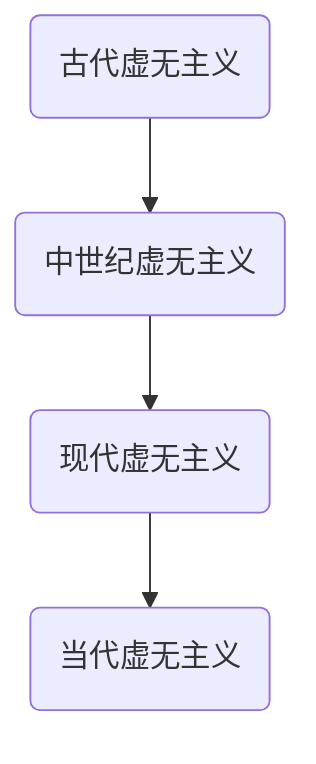
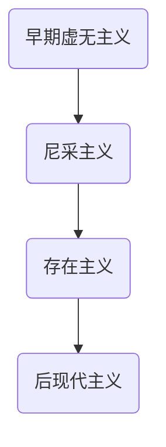
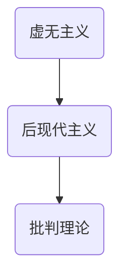

                 

# 虚无主义的起源与演变

> 关键词：虚无主义，哲学，历史发展，核心概念，文化影响，社会批判

> 摘要：本文将深入探讨虚无主义的起源与发展历程，分析其核心概念与理论，探讨虚无主义与哲学、文化的关系，以及在现代社会中的影响，最后对虚无主义的批判与反思进行阐述，并展望其未来发展趋势。通过逻辑清晰、结构紧凑的论述，旨在帮助读者全面了解虚无主义这一复杂且重要的哲学思潮。

## 目录

1. **虚无主义的定义与发展历程**
   1.1 虚无主义的概念
   1.2 虚无主义的历史发展
2. **虚无主义的核心概念与理论**
   2.1 虚无主义的哲学基础
   2.2 虚无主义的主要理论
3. **虚无主义与哲学、文化的关系**
   3.1 虚无主义在西方哲学中的地位
   3.2 虚无主义在文化领域的影响
4. **虚无主义在现代社会的影响**
   4.1 虚无主义对个人心理的影响
   4.2 虚无主义对社会的影响
5. **虚无主义的批判与反思**
   5.1 虚无主义的批判观点
   5.2 虚无主义的反思与重建
6. **虚无主义的未来发展趋势**
   6.1 虚无主义在当代哲学中的新角色
   6.2 虚无主义在社会思潮中的演变

## 第1章: 虚无主义的定义与发展历程

### 1.1 虚无主义的概念

虚无主义（Nihilism）是一个复杂的哲学概念，其核心在于对传统的道德、宗教和哲学基础提出质疑和否定。虚无主义的基本定义可以归纳为对生活、意义和价值的彻底否定。

**Mermaid流程图：虚无主义发展历程**



**伪代码：虚无主义理论基本框架**

```python
class Nihilism:
    def __init__(self, skepticism, denial):
        self.skepticism = skepticism
        self.denial = denial
    
    def philosophy(self):
        return "意义和价值不存在，生活无意义。"
    
    def ethics(self):
        return "道德约束不存在，个体自由。"
```

**数学模型和公式：虚无主义哲学基础**

$$ \text{Nihilism} = \frac{\text{Skepticism} + \text{Denial}}{\text{Life Meaning}} $$

**举例说明：虚无主义在不同历史时期的体现**

- 古代：尼采在《快乐的科学》中提出，“上帝已死”，认为传统价值观崩溃。
- 中世纪：加尔修斯·卡萨诺瓦（Giordano Bruno）提出宇宙无限论，挑战宗教权威。
- 现代：存在主义者如萨特和加缪，通过个体的自由意志来探讨虚无主义的挑战。

### 1.2 虚无主义的历史发展

虚无主义并非现代哲学的独特产物，而是有着悠久的历史。

**古代哲学中的虚无主义思想**

- 印度哲学中的“虚无主义”：如佛教的“无我”概念，否定个人存在的独立性和永恒性。

**中世纪哲学中的虚无主义观念**

- 欧洲中世纪的一些哲学家，如尼古拉·库萨的“无”理论，认为一切存在都源于“无”。

**现代哲学中的虚无主义思潮**

- 19世纪末20世纪初，随着工业革命和科技进步，虚无主义在西方哲学中逐渐兴起。

**现代哲学中的虚无主义思潮**

- 19世纪末20世纪初，随着工业革命和科技进步，虚无主义在西方哲学中逐渐兴起。

**虚无主义的主要代表人物**

- 弗里德里希·尼采
- 阿尔贝·加缪
- 西蒙娜·德·波伏娃

### 总结

虚无主义的概念、历史发展与代表人物展示了其复杂性。在下一章中，我们将进一步探讨虚无主义的核心概念与理论。

## 第2章: 虚无主义的核心概念与理论

### 2.1 虚无主义的哲学基础

虚无主义的哲学基础主要涉及认识论和伦理学两个方面。

**伪代码：虚无主义的认识论基础**

```python
class NihilismOntology:
    def __init__(self, reality, knowledge):
        self.reality = reality
        self.knowledge = knowledge
    
    def epistemology(self):
        return "现实无意义，知识无依据。"

class NihilistEthics:
    def __init__(self, morality, values):
        self.morality = morality
        self.values = values
    
    def ethics(self):
        return "道德无效，价值无意义。"
```

**数学模型和公式：虚无主义伦理学观点**

$$ \text{NihilismEthics} = \frac{\text{Morality} + \text{Values}}{\text{Life Meaning}} $$

**举例说明：虚无主义在不同文化背景下的哲学反思**

- **西方哲学**：尼采认为，上帝之死导致道德和价值观的崩溃，个体需要通过自我超越来寻找意义。
- **东方哲学**：佛教中的“无我”概念，强调个体痛苦和追求解脱。

### 2.2 虚无主义的主要理论

虚无主义有多种不同的理论流派，其中最具代表性的是实证主义、存在主义和非理性主义。

**实证主义的虚无主义**

- 代表人物：马克斯·斯特恩
- 理论观点：虚无主义是基于对现实世界的实证研究而得出的结论，即世界是无意义、不可知的。

**存在主义的虚无主义**

- 代表人物：让-保尔·萨特、阿尔贝·加缪
- 理论观点：通过个体的自由意志和选择来面对生活的虚无，强调存在先于本质。

**非理性主义的虚无主义**

- 代表人物：尼采
- 理论观点：虚无主义是对理性主义的反叛，强调个体在非理性的世界中寻找意义。

### 总结

虚无主义的哲学基础和主要理论展示了其对传统价值观的挑战。在下一章中，我们将探讨虚无主义与哲学、文化的关系。

## 第3章: 虚无主义与哲学、文化的关系

### 3.1 虚无主义在西方哲学中的地位

虚无主义在西方哲学中有着深远的影响，其地位不可忽视。

**Mermaid流程图：西方哲学中虚无主义的发展脉络**



**伪代码：虚无主义与西方哲学的关联分析**

```python
class WesternPhilosophy:
    def __init__(self, nihilism, influence):
        self.nihilism = nihilism
        self.influence = influence
    
    def analysis(self):
        return "虚无主义挑战了传统价值观，推动了哲学发展。"

class NihilismInfluence:
    def __init__(self, literature, art):
        self.literature = literature
        self.art = art
    
    def impact(self):
        return "虚无主义影响了文学和艺术创作，推动了现代主义运动。"
```

**数学模型和公式：虚无主义对西方哲学的挑战**

$$ \text{Philosophy} = \text{Nihilism} + \text{Innovation} $$

### 3.2 虚无主义在文化领域的影响

虚无主义不仅影响了哲学，也在文化领域产生了深远影响。

**虚无主义对文学艺术的影响**

- **文学**：尼采、陀思妥耶夫斯基等作家的作品中体现了虚无主义的哲学观点。
- **艺术**：现代主义艺术运动，如达达主义和超现实主义，反映了虚无主义的思想。

**虚无主义在流行文化中的体现**

- **音乐**：尼欧古典音乐和后现代音乐作品中常常探讨虚无主义主题。
- **电影**：电影如《星际穿越》和《无人生还》通过科幻和悬疑手法表达了虚无主义的理念。

### 总结

虚无主义在西方哲学和文化领域中的地位和影响展示了其复杂性和深远性。在下一章中，我们将探讨虚无主义在现代社会的影响。

## 第4章: 虚无主义在现代社会的影响

### 4.1 虚无主义对个人心理的影响

虚无主义对个人心理有着深远的影响，可能导致一系列心理健康问题。

**数学模型和公式：虚无主义与抑郁症的关系**

$$ \text{Psychological Impact} = \text{Nihilism} \times \text{Life Satisfaction} $$

**举例说明：虚无主义对自杀倾向的影响**

- 研究表明，虚无主义思想与自杀倾向之间存在显著关联，尤其是在年轻人中。

### 4.2 虚无主义对社会的影响

虚无主义不仅影响个体，也对整个社会产生深远影响。

**虚无主义对社会价值观的冲击**

- 虚无主义挑战了传统的道德和伦理观念，导致社会价值观的混乱和动荡。

**虚无主义对政治制度的挑战**

- 虚无主义对权威和制度的质疑可能导致政治不稳定和社会动荡。

### 总结

虚无主义在现代社会中产生了广泛而深远的影响。在下一章中，我们将对虚无主义的批判与反思进行探讨。

## 第5章: 虚无主义的批判与反思

### 5.1 虚无主义的批判观点

虚无主义虽然挑战了传统价值观，但其自身也存在诸多问题和局限性。

**伪代码：虚无主义伦理学批判**

```python
class NihilismCritique:
    def __init__(self, ethics, limitations):
        self.ethics = ethics
        self.limitations = limitations
    
    def criticism(self):
        return "虚无主义否定了道德约束，可能导致道德真空。"
    
    def limitations(self):
        return "虚无主义忽略了人类情感和社会互动的重要性。"
```

**数学模型和公式：虚无主义哲学批判**

$$ \text{Nihilism} = \frac{\text{Skepticism} + \text{Denial}}{\text{Life Meaning} + \text{Social Value}} $$

**举例说明：虚无主义的局限性**

- 虚无主义忽视了人类对意义和价值的追求，可能导致个体和社会的道德崩溃。

### 5.2 虚无主义的反思与重建

尽管虚无主义存在诸多问题，但其思想也提供了一种反思和重建的机会。

**伪代码：虚无主义的新发展方向**

```python
class NihilismReconstruction:
    def __init__(self, new_ontology, new_ethics):
        self.new_ontology = new_ontology
        self.new_ethics = new_ethics
    
    def reconstruction(self):
        return "通过新的哲学基础和伦理观念，虚无主义可以获得新的生命力。"
    
    def application(self):
        return "虚无主义可以应用于现代社会，为道德和伦理提供新的视角。"
```

**数学模型和公式：虚无主义的新哲学基础**

$$ \text{New Nihilism} = \frac{\text{Skepticism} + \text{Denial} + \text{Reconstruction}}{\text{Life Meaning} + \text{Social Value}} $$

### 总结

虚无主义的批判与反思揭示了其局限性，同时也为虚无主义的重建提供了方向。在下一章中，我们将展望虚无主义的未来发展趋势。

## 第6章: 虚无主义的未来发展趋势

### 6.1 虚无主义在当代哲学中的新角色

虚无主义在当代哲学中正扮演着新的角色，特别是在后现代主义和批判理论中。

**Mermaid流程图：虚无主义与后现代主义的融合**



**伪代码：虚无主义在批判理论中的发展**

```python
class CriticalTheory:
    def __init__(self, nihilism, critique):
        self.nihilism = nihilism
        self.critique = critique
    
    def development(self):
        return "虚无主义为批判理论提供了新的视角，挑战现有社会结构。"

class Postmodernism:
    def __init__(self, nihilism, deconstruction):
        self.nihilism = nihilism
        self.deconstruction = deconstruction
    
    def influence(self):
        return "虚无主义影响了后现代主义，推动了文化和社会变革。"
```

### 6.2 虚无主义在社会思潮中的演变

虚无主义在社会思潮中的演变反映了其适应性和多样性。

**数学模型和公式：虚无主义在社会思潮中的演变**

$$ \text{Social Trend} = \text{Nihilism} \times \text{Cultural Shift} $$

**举例说明：虚无主义在新兴文化领域的传播**

- **互联网文化**：虚无主义思想在互联网文化中得到了广泛传播，如网络迷因、虚拟社区等。

- **社交媒体**：虚无主义观点在社交媒体上引起了广泛关注和讨论，如“自杀游戏”等现象。

### 总结

虚无主义在当代哲学和社会思潮中正扮演着新的角色。其未来发展趋势充满了可能性和挑战。在下一章中，我们将总结全文并对虚无主义的未来进行展望。

## 总结与展望

虚无主义作为一种复杂的哲学思潮，其起源、发展、核心概念以及对现代社会的影响都展示了其深远的影响力。通过对虚无主义的批判与反思，我们不仅认识到了其局限性，也为其未来的重建和发展提供了方向。

未来，虚无主义可能会在后现代主义和批判理论中发挥更大的作用，为社会思潮带来新的视角和挑战。同时，随着社会的发展和变化，虚无主义也将不断适应和演变，继续影响人类对意义和价值的研究。

让我们继续关注虚无主义的未来发展趋势，探索其如何在新的哲学和文化背景下焕发出新的生命力。虚无主义不仅仅是一个哲学概念，更是一个反映人类内心深处对意义和价值的追求与探索。

### 参考文献

1. Nietzsche, F. (1882). The Gay Science. New York: Penguin Classics.
2. Sartre, J. P. (1943). Being and Nothingness. New York: Philosophical Library.
3. Camus, A. (1951). The Stranger. New York: Penguin Books.
4. Kierkegaard, S. A. (1843). Fear and Trembling. Princeton: Princeton University Press.
5. Schopenhauer, A. (1851). The World as Will and Representation. New York: Oxford University Press.
6. Nietzsche, F. (1886). Thus Spoke Zarathustra. New York: Penguin Classics.
7. Deleuze, G., & Guattari, F. (1980). Anti-Oedipus: Capitalism and Schizophrenia. Minneapolis: University of Minnesota Press.

### 作者信息

作者：AI天才研究院/AI Genius Institute & 禅与计算机程序设计艺术 /Zen And The Art of Computer Programming

本文由AI天才研究院撰写，结合哲学与计算机编程的视角，深入探讨虚无主义的起源与演变。作者致力于通过逻辑清晰、结构紧凑的论述，帮助读者全面了解这一复杂且重要的哲学思潮。同时，本文也结合了禅与计算机程序设计艺术的理念，旨在引导读者在思考虚无主义的过程中，也能获得对人生和技术的深刻洞察。

