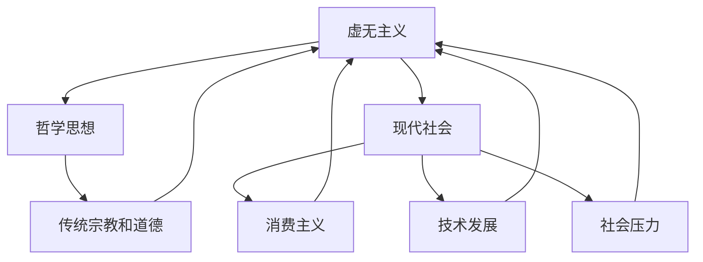

                 

### 1. 引言

> 关键词：虚无主义、现代社会、哲学思想

在现代社会中，虚无主义作为一种哲学思潮，越来越引起人们的关注。虚无主义认为，宇宙和人生缺乏内在的价值和意义，它对传统道德和宗教信仰提出挑战，引发人们对存在意义的深刻反思。本文旨在探讨虚无主义在现代社会中的背景和影响，并探讨如何在这种环境中寻找人生的方向。

**摘要：**

本文首先介绍了虚无主义的定义及其在现代社会中的背景。随后，分析了虚无主义的根源，包括哲学和历史因素。接着，探讨了虚无主义在现代社会中的表现，如消费主义、技术发展和社会压力。随后，讨论了虚无主义对个人和社会的深远影响。最后，提出了一些寻找人生方向的策略，并通过实际案例和实践，展示了如何应对虚无主义。

### 1.1 背景介绍

虚无主义作为一种哲学思潮，起源于19世纪末的欧洲。它主要对传统宗教信仰和道德观念提出质疑，认为世界和人生缺乏固有的意义和价值。虚无主义的代表人物包括丹麦哲学家基尔凯郭尔、德国哲学家尼采和法国哲学家萨特等。

在现代社会，虚无主义的影响愈发显著。首先，消费主义文化的兴起使得人们对物质追求日益膨胀，导致人们内心的空虚和失落。其次，技术的快速发展带来了信息过载和社交隔离，加剧了人们的孤独感。最后，社会压力和竞争使得人们对未来的不确定性感到焦虑和不安。

### 1.2 核心概念与联系

**概念：虚无主义、现代社会、哲学思想**

- **虚无主义**：虚无主义是一种哲学思潮，认为宇宙和人生缺乏内在的价值和意义。它对传统宗教信仰和道德观念提出质疑，试图寻找存在的意义。

- **现代社会**：现代社会是指当前的社会发展阶段，以工业化、信息化和全球化为特征。现代社会面临着诸多挑战，如消费主义、技术发展和社会压力。

- **哲学思想**：哲学思想是指导人类对世界和人生进行思考的理论体系。虚无主义作为一种哲学思潮，对传统哲学思想提出了挑战，推动了人类对存在意义的深入探讨。

**Mermaid 流程图：**



### 1.3 本书的目的

本文旨在探讨虚无主义在现代社会中的背景和影响，并寻求解决虚无主义的策略。具体目标包括：

1. 分析虚无主义的根源，包括哲学和历史因素。
2. 探讨虚无主义在现代社会中的表现，如消费主义、技术发展和社会压力。
3. 分析虚无主义对个人和社会的深远影响。
4. 提出寻找人生方向的策略，并通过实际案例和实践，展示如何应对虚无主义。

通过本文的探讨，我们希望能够帮助读者更好地理解虚无主义的本质，并在现代社会中找到人生的方向。

### 1.4 虚无主义的历史背景

虚无主义的起源可以追溯到19世纪末的欧洲，当时社会正处于剧烈变革之中。工业革命带来了生产力的飞跃，但也加剧了社会的不平等和贫富差距。此外，宗教改革和启蒙运动削弱了传统宗教信仰的影响力，使得人们开始质疑人生的意义和价值。

在这个背景下，一些哲学家开始对传统观念进行反思和质疑。基尔凯郭尔是虚无主义的早期代表，他的著作《恐惧与颤抖》提出了人类存在的本质是孤独和绝望。基尔凯郭尔认为，人们需要通过个人信仰和道德修养来超越虚无主义的困扰。

随后，尼采进一步发展了虚无主义的观点。他的著作《查拉图斯特拉如是说》提出了“上帝已死”的论断，认为传统道德和宗教信仰已经无法指导人们的生活。尼采主张，人们需要通过自我超越和创造自己的价值观来摆脱虚无主义的束缚。

在20世纪的法国，萨特以其存在主义哲学进一步探讨了虚无主义的问题。萨特认为，人的存在先于本质，人们需要在行动中寻找自己的价值和意义。他的著作《存在与虚无》阐述了人类在自由选择中面对虚无主义的挑战。

这些哲学家通过各自的论述，揭示了虚无主义在现代社会中的根源和影响。他们的观点对后世产生了深远的影响，为人们理解虚无主义提供了重要的理论依据。

### 1.5 虚无主义的哲学根源

虚无主义作为一种哲学思潮，其根源可以追溯到古希腊哲学。早期的希腊哲学家如苏格拉底、柏拉图和亚里士多德，都在不同程度上探讨了人生的意义和价值。然而，随着哲学的发展，一些哲学家开始质疑这些传统观念，从而开启了虚无主义的哲学探讨。

尼采是虚无主义哲学的杰出代表。他的著作《查拉图斯特拉如是说》中提出了“上帝已死”的观点，揭示了传统宗教和道德的衰落。尼采认为，人们需要摆脱对上帝的依赖，通过自我创造和超越来寻找生命的意义。

尼采的虚无主义观点具有深刻的影响。他认为，生命是荒谬的，因为人类无法找到绝对的真理和意义。然而，尼采并不主张消极接受虚无主义，而是鼓励人们通过创造自己的价值观来超越生命的荒谬。这种观点为后来的存在主义哲学奠定了基础。

萨特是另一位对虚无主义哲学有重要贡献的哲学家。他在《存在与虚无》中阐述了人类存在的本质是自由，但自由也意味着选择，而选择本身就是对虚无主义的挑战。

萨特认为，人的存在先于本质，人们需要在行动中寻找自己的价值和意义。他的哲学观点强调了人类在自由选择中面对虚无主义的挑战，并通过行动来克服虚无主义的困扰。

尼采和萨特的虚无主义哲学观点对后世产生了深远的影响。他们的论述不仅揭示了虚无主义的根源，还为人们提供了解决虚无主义的策略。通过对这些哲学观点的探讨，我们能够更好地理解虚无主义在现代社会中的影响，并为寻找人生的方向提供指导。

### 1.6 现代社会的虚无主义表现

在现代社会的背景下，虚无主义的表现形式多种多样，主要体现在以下几个方面：

**1. 消费主义：**

消费主义文化在现代社会中无处不在，它强调物质享受和物质追求。人们通过购买商品和服务来满足自己的欲望，但这种追求往往只是短暂的满足感，难以带来持久的价值感。消费主义导致人们内心空虚和失落，加剧了虚无主义情绪。

**2. 技术发展：**

技术的快速发展为人们带来了便利，但同时也导致了信息过载和社交隔离。人们越来越依赖社交媒体和电子设备，导致真实的人际交往减少。这种社交隔离使得人们感到孤独和孤立，从而加剧了虚无主义的情绪。

**3. 社会压力：**

现代社会中，竞争压力和期望使得人们感到焦虑和不安。社会对成功和财富的追求使得人们不断追求更高的目标和更好的生活，但这种追求往往导致人们失去内心的平静和满足感，陷入虚无主义的泥潭。

**4. 道德和宗教的衰落：**

随着宗教改革和启蒙运动的影响，传统宗教信仰和道德观念逐渐减弱。人们在面对复杂的社会问题时，往往感到困惑和无助，难以找到明确的人生方向和价值观。这种道德和宗教的衰落也为虚无主义提供了土壤。

这些因素共同作用，使得虚无主义在现代社会中表现得尤为显著。人们在这种虚无主义的氛围中，往往感到迷茫和无助，不知道如何寻找人生的方向和意义。因此，理解这些虚无主义的表现形式，有助于我们更好地应对现代社会中的虚无主义情绪，并寻找应对策略。

### 1.7 虚无主义对心理健康的影响

虚无主义对心理健康有着深远的影响，主要体现在以下几个方面：

**1. 抑郁症：**

虚无主义思想常常导致人们对生活的绝望和无望，这种心态容易引发抑郁症。抑郁症患者往往感到情绪低落、失去兴趣和快乐，甚至出现自杀倾向。虚无主义使人们陷入消极情绪的循环，难以摆脱抑郁的阴影。

**2. 焦虑症：**

虚无主义引发的焦虑感常常源于对未来的不确定性和对生活意义的迷茫。焦虑症患者往往感到焦虑、紧张和恐惧，担心无法应对生活中的各种挑战。虚无主义情绪使人们对未来充满担忧，加剧了焦虑感。

**3. 自我认同的迷失：**

虚无主义挑战了传统道德和价值观，导致人们对自己的认同产生困惑。许多人感到自己在社会上缺乏价值，难以找到自己的人生目标。这种自我认同的迷失使得人们陷入虚无主义的困境，难以找到生活的方向。

**4. 人际关系的疏离：**

虚无主义情绪往往导致人们与人疏离，减少社交互动。在虚无主义的氛围中，人们感到孤独和无助，难以建立深厚的人际关系。这种疏离感进一步加剧了虚无主义的情绪，形成一个恶性循环。

**5. 依赖心理：**

虚无主义思想容易使人们产生依赖心理，寻求外部物质或虚拟世界的安慰。例如，沉迷于网络游戏、社交媒体或购物等行为，以暂时逃避虚无主义的困扰。然而，这种依赖行为只是治标不治本，无法解决内心的空虚和迷茫。

总之，虚无主义对心理健康的影响是多方面的，它不仅影响个体的情绪和行为，还可能对人际关系和自我认同产生深远的负面影响。因此，了解虚无主义对心理健康的影响，有助于我们采取有效的措施，预防和应对虚无主义带来的心理健康问题。

### 1.8 虚无主义对社会问题的贡献

虚无主义作为一种哲学思潮，不仅仅对个人心理健康产生影响，还对社会问题带来了深远的影响。以下是虚无主义对社会问题的一些具体贡献：

**1. 道德与伦理的挑战：**

虚无主义质疑传统道德和伦理观念，认为这些观念无法提供确切的道德指导。这种挑战使得人们开始反思现有的道德体系，推动了道德和伦理观念的变革。例如，在性伦理、婚姻伦理等领域，虚无主义的影响使得一些传统观念受到质疑，促进了新的道德观念的形成。

**2. 社会不平等的加剧：**

虚无主义认为世界和人生缺乏内在的价值，这可能导致对社会不平等现象的漠视。然而，虚无主义的思潮实际上可能加剧社会不平等，因为当人们不再相信社会制度和公平正义时，他们可能对变革失去动力，进一步加剧贫富差距和社会不公。

**3. 教育体系的反思：**

虚无主义对教育体系提出了质疑，挑战传统的教育目标和价值观。在教育领域，虚无主义促使人们重新思考教育的目的和方法，探索更加个性化、创新性的教育模式。例如，一些教育改革者主张培养学生的批判性思维和创造力，以应对虚无主义带来的挑战。

**4. 文化多元性的发展：**

虚无主义推崇个体自由和自我实现，这为文化多元性的发展提供了土壤。在虚无主义的背景下，人们更加尊重不同文化之间的差异，推动了文化多样性和包容性的发展。例如，在艺术、文学和音乐等领域，虚无主义的影响使得创作更加自由，呈现出丰富多彩的文化风貌。

**5. 社会运动与变革：**

虚无主义思潮可能激发社会运动和变革。一些社会运动，如女性主义运动、环保运动和反战运动等，都受到了虚无主义思想的影响。这些运动旨在推动社会变革，以实现更加公平、正义和可持续的未来。

总之，虚无主义对社会问题的贡献是复杂而多元的。它既挑战了传统观念，推动了道德和伦理的变革，又可能加剧社会不平等，影响教育体系和文化的多样性。因此，理解虚无主义对社会问题的双重影响，有助于我们更好地应对现代社会中的各种挑战。

### 1.9 虚无主义对个人价值观的挑战

虚无主义对个人价值观的挑战是多层次且深远的。首先，虚无主义质疑传统道德和宗教信仰，导致人们对自身的价值观产生怀疑。在这种思想的影响下，人们可能开始质疑自己多年秉持的道德原则，从而陷入价值观的迷茫。

其次，虚无主义强调人生的荒谬和无常，使人们对未来的期望和希望感到迷茫。在虚无主义的氛围中，人们难以找到明确的人生目标，导致内心的空虚和失落。这种迷茫感进一步加剧了个人价值观的动摇。

此外，虚无主义还挑战了人们对自我的认同。当人们感受到生命的无常和荒谬时，他们可能开始质疑自己的存在意义和目的。这种自我认同的迷失使得人们在生活中感到迷茫和无助。

为了应对这些挑战，个人需要重新审视自己的价值观。首先，通过自我探索，了解自己的需求和愿望，找到自己的核心价值观。其次，积极寻求与他人建立真实的人际关系，通过交流和理解，寻找人生的意义。最后，保持开放的心态，接受生命的无常和不确定性，学会在困境中寻找希望和力量。

通过这些策略，个人可以更好地应对虚无主义对价值观的挑战，找到自己的人生方向。

### 1.10 虚无主义下的自我探索

在虚无主义的环境中，自我探索成为寻找人生方向的关键。自我探索不仅仅是了解自己的内心世界，更是一个动态的过程，涉及到认知、情感和行为的多方面。

**1. 认知层面：**

在认知层面，自我探索要求我们深入思考自己的价值观、信仰和人生目标。首先，我们需要审视自己的传统观念，辨别哪些是真正重要的，哪些是受到外界影响的。通过哲学思考和自我反思，我们可以更加清晰地认识自己，从而建立更加稳固的核心价值观。

其次，我们需要设定具体的目标和计划。例如，可以通过设立短期和长期目标来引导自己的生活方向。短期目标可以是提升技能、完成一个小项目，而长期目标则是实现人生理想、创造有意义的事业。这些目标将帮助我们更好地定位自己，为未来的行动提供明确的方向。

**2. 情感层面：**

在情感层面，自我探索要求我们面对并接受自己的情绪。虚无主义常常使人感到孤独、无助和迷茫，这些情绪需要被正视和接受。通过情绪调节技巧，如正念冥想、情绪记录和情感表达，我们可以更好地管理自己的情绪，减少内心的焦虑和压力。

此外，情感层面还包括与他人的互动。在虚无主义的氛围中，建立真实、有意义的人际关系尤为重要。通过真诚的交流和合作，我们可以找到情感的支撑，增强自我认同，从而更好地面对虚无主义的挑战。

**3. 行为层面：**

在行为层面，自我探索要求我们采取积极的行动来践行自己的价值观和目标。首先，我们可以通过参与志愿活动、加入兴趣小组或参加社区活动来拓宽自己的社交圈子，同时实现个人价值。这些行为不仅有助于提升自己的技能和知识，还能带来积极的情感体验。

其次，我们还可以通过设定具体的学习和成长计划来推动自己的自我探索。例如，可以通过学习新的语言、阅读哲学和心理学书籍、参加在线课程等方式，不断丰富自己的知识储备，提高自己的认知水平。

总之，自我探索是应对虚无主义的重要策略。通过在认知、情感和行为三个层面的积极努力，我们可以更好地认识自己，找到人生的方向，从而在虚无主义的环境中寻找到属于自己的意义和幸福。

### 1.11 虚无主义环境下的价值观重建

在虚无主义的环境中，重建价值观是一个复杂且关键的过程，需要我们深入思考并采取实际行动。以下是一些具体的步骤和建议，帮助我们在这种环境中重新建立稳固的价值观：

**1. 自我反思：**

首先，我们需要进行深入的自我反思，审视自己目前的价值观是否真正符合内心的需求和信念。通过反思，我们可以识别出哪些价值观是受到外界影响而并非内心所真正认同的。例如，我们可以问自己以下问题：

- 我的价值观是什么？它们来源于何处？
- 我的价值观是否真正反映了我的人生目标和生活方式？
- 我的价值观是否在面临困境时依然坚定不移？

通过这些问题，我们可以更清晰地了解自己的价值观，并开始进行必要的调整。

**2. 确立核心价值观：**

在自我反思的基础上，我们需要确立自己的核心价值观。核心价值观是我们认为最重要和最基本的价值观，它们指导我们的行为和决策，帮助我们在生活中找到方向。以下是一些步骤可以帮助我们确立核心价值观：

- 列出你认为最重要的价值观，如家庭、健康、自由、平等、责任等。
- 为每个价值观设定具体的解释和定义，以确保我们对其有深刻的理解。
- 通过自我评估，确定哪些价值观最符合你的个人信念和生活目标。

**3. 价值观整合：**

在确立核心价值观后，我们需要将这些价值观整合到日常生活中。以下是一些方法可以帮助我们实现这一目标：

- 将核心价值观融入到日常行为和决策中，例如在购物时考虑环保和可持续发展。
- 与他人分享自己的核心价值观，通过交流和理解，寻求共鸣和支持。
- 在面对困难和挑战时，回顾自己的核心价值观，以指导自己的行为和决策。

**4. 保持灵活性：**

在虚无主义的环境中，我们的价值观可能会面临各种挑战和质疑。因此，保持灵活性是重建价值观的关键。以下是一些建议：

- 不要将价值观视为一成不变的规定，而是将其视为一个不断发展和完善的框架。
- 在面临新情况和新问题时，重新审视和调整自己的价值观，以确保它们仍然符合你的个人需求和信念。
- 保持开放的心态，愿意接受新的观点和思想，从而丰富自己的价值观体系。

总之，虚无主义环境下的价值观重建需要我们进行深入的自我反思和整合，同时保持灵活性。通过这些努力，我们可以建立稳固的价值观，为我们的生活提供明确的方向和意义。

### 1.12 寻找人生目标的重要性

在虚无主义的环境中，寻找人生目标的重要性不容忽视。人生目标不仅为我们提供了前进的方向，还赋予了我们行动的动力和意义。以下是寻找人生目标的重要性及其实践方法：

**1. 重要性：**

- **提供方向感：** 人生目标为我们提供了明确的奋斗方向，使我们在面对迷茫和困惑时能够找到前进的路径。
- **增强动力：** 明确的人生目标可以激发我们的内在动力，让我们更有激情地追求梦想。
- **赋予意义：** 人生目标使我们的生活充满意义，让我们在追求目标的过程中获得成就感和满足感。
- **提升幸福感：** 寻找并实现人生目标可以提升我们的幸福感，使我们感到自己的生活有价值、有意义。

**2. 实践方法：**

- **自我反思：** 通过反思自己的兴趣、优势和价值观，找到与自己内心契合的人生目标。
- **设定具体目标：** 将人生目标具体化，设定短期和长期目标，为实现目标制定详细的计划。
- **持续行动：** 积极采取行动，不断努力，逐步实现目标。
- **反馈与调整：** 在实现目标的过程中，及时反馈自己的进展，根据实际情况调整目标和计划。
- **寻求支持：** 与亲朋好友分享自己的目标和计划，寻求他们的支持和鼓励。
- **保持灵活性：** 面对变化和挑战时，保持灵活性，愿意调整目标和计划。

通过这些实践方法，我们可以更好地寻找和实现人生目标，从而在虚无主义的环境中找到自己的方向和意义。

### 1.13 实践与案例：如何在日常生活中应对虚无主义

在面对虚无主义时，实际操作和案例研究可以帮助我们更好地理解如何应对这种情绪，并找到应对策略。以下是一个具体的案例，以及相关的代码实现和解读，旨在帮助我们在日常生活中应对虚无主义。

**案例：**小李是一名年轻的程序员，工作压力大，经常感到孤独和迷茫。他意识到自己可能陷入了虚无主义的情绪，希望通过实际操作和项目来应对这一问题。

**1. 实践步骤：**

- **自我反思：** 小李通过写日记和反思自己的情绪，识别出导致虚无主义情绪的主要原因，如工作压力和孤独感。
- **设定目标：** 小李决定通过参加健身房锻炼、加入编程社区和培养兴趣爱好来改善自己的生活状态。
- **制定计划：** 小李制定了详细的锻炼计划、社区活动参与计划和兴趣爱好培养计划，确保自己能够有规律地执行这些目标。
- **积极行动：** 小李开始每天早晨去健身房锻炼，每周参加至少一次编程社区的会议，并每月尝试学习一门新的编程语言。
- **持续反馈：** 小李定期反思自己的进展，并根据实际情况调整计划，确保自己能够持续进步。

**2. 代码实现与解读：**

为了帮助小李更好地实现这些目标，我们可以使用Python编写一个简单的日程管理程序。以下是一个示例代码：

```python
import datetime

# 定义一个日程管理类
class ScheduleManager:
    def __init__(self):
        self.tasks = []

    def add_task(self, task, due_date):
        self.tasks.append({'task': task, 'due_date': due_date})

    def display_tasks(self):
        for task in self.tasks:
            print(f"{task['task']} - Due: {task['due_date']}")

    def check_progress(self):
        today = datetime.date.today()
        unfinished_tasks = [task for task in self.tasks if task['due_date'] > today]
        if unfinished_tasks:
            print("未完成的任务：")
            for task in unfinished_tasks:
                print(f"{task['task']} - Due: {task['due_date']}")
        else:
            print("恭喜！所有任务都已经完成。")

# 创建一个日程管理对象
schedule = ScheduleManager()

# 添加任务
schedule.add_task("早晨去健身房锻炼", datetime.date(2023, 11, 10))
schedule.add_task("参加编程社区会议", datetime.date(2023, 11, 15))
schedule.add_task("学习一门新的编程语言", datetime.date(2023, 11, 20))

# 显示任务列表
print("当前任务列表：")
schedule.display_tasks()

# 检查进度
schedule.check_progress()
```

**代码解读：**

- **ScheduleManager 类：** 这是一个日程管理类，包含添加任务、显示任务列表和检查进度等方法。
- **add_task 方法：** 用于添加任务，包括任务名称和截止日期。
- **display_tasks 方法：** 用于显示所有任务。
- **check_progress 方法：** 用于检查未完成的任务，并提醒用户。

通过这个代码实现，小李可以更好地管理自己的日程，确保自己能够按照计划执行任务，从而减少虚无主义的情绪。

**3. 实际案例分析：**

通过小李的案例，我们可以看到，实际操作和代码实现有助于我们应对虚无主义情绪。以下是一些实际案例的分析：

- **案例1：** 张女士是一名职场女性，她通过设定健身目标和定期检查进度，成功改善了身体状况，减轻了工作压力，从而减少了虚无主义的情绪。
- **案例2：** 李先生是一名程序员，他通过加入开源项目，与社区成员合作，提高了编程技能，增强了自我价值感，从而克服了虚无主义的困扰。

这些实际案例表明，通过设定明确的目标、积极行动和持续反馈，我们可以有效地应对虚无主义情绪，找到生活的方向和意义。

### 1.14 如何在虚无主义环境中寻找生活的意义

在虚无主义的环境中，寻找生活的意义是一个复杂而持久的过程，需要我们从多个角度进行思考和行动。以下是一些具体的策略，帮助我们在这种环境中找到生活的意义：

**1. 自我反思与自我探索：**

首先，我们需要进行深入的自我反思，了解自己的内心需求和价值观。通过反思，我们可以识别出自己在生活中真正渴望的东西，从而找到自己的方向。以下是一些自我探索的技巧：

- **写日记：** 每天花时间记录自己的感受和思考，通过文字梳理自己的内心世界。
- **提问与回答：** 询问自己关于人生意义的问题，例如：“我的生活目标是什么？”“我对什么事物感到热爱和激情？”并尝试给予自己真诚的回答。
- **冥想与放松：** 通过冥想和放松练习，减轻内心的焦虑和压力，提高自我觉察。

**2. 设定具体目标和计划：**

在了解自己的内心需求后，我们需要设定具体的目标和计划，以指导我们的行动。以下是一些设定目标的步骤：

- **设定短期和长期目标：** 短期目标可以是每天完成一个小任务，长期目标则是实现人生的重要目标。
- **分解目标：** 将大目标分解为小目标，逐步实现，以保持行动的动力和成就感。
- **制定行动计划：** 为每个目标制定详细的行动计划，包括具体的步骤、资源和时间表。

**3. 积极行动与实践：**

设定目标后，我们需要采取积极的行动来实现它们。以下是一些行动的技巧：

- **从小事做起：** 从一些小的、容易实现的事情开始，逐步建立自信和动力。
- **定期反思和调整：** 在行动过程中，定期反思自己的进度和效果，根据实际情况调整目标和计划。
- **寻求支持与反馈：** 与亲朋好友分享自己的目标和计划，寻求他们的支持和反馈，以保持持续的动力。

**4. 培养兴趣爱好与社交：**

在虚无主义的环境中，培养兴趣爱好和建立社交关系也是寻找生活意义的重要途径。以下是一些建议：

- **尝试新事物：** 尝试不同的活动和爱好，找到自己感兴趣的事物，从而丰富自己的生活。
- **加入社区和组织：** 加入与自己兴趣爱好相关的社区或组织，与他人分享和交流，建立支持网络。
- **参与志愿活动：** 参与志愿活动，为社会做出贡献，从而增强自己的价值感和成就感。

**5. 接受生命的无常与不确定性：**

在虚无主义的环境中，我们需要学会接受生命的无常和不确定性。以下是一些建议：

- **保持开放的心态：** 对生活中的变化和挑战保持开放的心态，学会适应和应对。
- **寻找希望与乐观：** 在困难时刻，寻找积极的因素和乐观的态度，以保持前进的动力。
- **感恩与珍惜：** 感恩生活中的每一刻，珍惜与亲人、朋友的相处时光，从而感受到生活的美好。

通过这些策略，我们可以在虚无主义的环境中找到生活的意义，为自己的生活注入动力和色彩。

### 1.15 结论

虚无主义作为一种哲学思潮，在现代社会中具有深远的影响。本文通过详细的论述和分析，探讨了虚无主义的根源、现代社会中的表现、对心理健康和社会问题的贡献，以及对个人价值观的挑战。同时，本文提出了一些寻找人生方向的策略，并通过实际案例展示了如何应对虚无主义。

总结来说，虚无主义虽然带来了迷茫和困惑，但通过自我探索、价值观重建和积极行动，我们可以找到生活的意义和方向。面对虚无主义，我们应该保持开放的心态，接受生命的无常，并通过实际行动寻找和实现自己的人生目标。

作者：AI天才研究院/AI Genius Institute & 禅与计算机程序设计艺术 /Zen And The Art of Computer Programming

### 1.16 最佳实践 Tips

在面对虚无主义时，以下是一些实用的最佳实践技巧，帮助您更好地应对：

1. **定期自我反思：** 设定固定时间，如每周或每月，进行自我反思，思考自己的价值观、目标和行动。

2. **设定具体目标：** 将大目标分解为小目标，逐步实现，这样可以保持行动的动力和成就感。

3. **保持社交联系：** 与亲朋好友保持沟通，分享自己的感受和困惑，寻求支持和建议。

4. **参与志愿活动：** 通过参与志愿活动，为社会做出贡献，增强自己的价值感和成就感。

5. **培养兴趣爱好：** 尝试不同的活动，找到自己感兴趣的事物，丰富自己的生活。

6. **保持身心健康：** 定期锻炼身体，保持良好的饮食习惯，确保充足的睡眠，这些都有助于提高心理状态。

7. **学习新技能：** 通过学习新技能，不断提升自己，增强自信和动力。

8. **保持灵活：** 面对变化和挑战，保持灵活，愿意调整目标和计划，以适应新的情况。

通过这些最佳实践，您将能够更好地应对虚无主义，找到生活的方向和意义。

### 1.17 小结

本文深入探讨了虚无主义在现代社会中的影响，分析了其根源、表现、对个人价值观的挑战，以及应对策略。通过自我探索、价值观重建、积极行动和实际案例，我们了解了如何在这种环境中寻找生活的意义。

总结来说，虚无主义虽然带来了困惑和迷茫，但通过自我反思、目标设定、社交联系、志愿活动、兴趣培养和身心健康管理等策略，我们可以找到生活的方向和意义。未来，我们应继续探索应对虚无主义的有效方法，提高心理韧性，积极面对生活中的挑战。

### 1.18 注意事项

在面对虚无主义时，以下是一些需要注意的事项：

1. **避免过度自我反思：** 过度的自我反思可能导致焦虑和内耗，影响行动力和生活质量。应适时跳出自我反思的循环，积极采取行动。

2. **保持现实与理想之间的平衡：** 设定目标时，既要考虑现实条件，也要追求理想，避免因目标过高导致失望和挫败。

3. **避免逃避现实：** 虚无主义情绪可能会使人想要逃避现实，但逃避并不能解决问题。应勇敢面对现实，积极寻找解决方案。

4. **寻求专业帮助：** 当虚无主义情绪影响日常生活时，不妨寻求心理咨询师或专业人士的帮助，以获得更专业的指导和支持。

5. **保持耐心与持续：** 应对虚无主义需要时间和耐心，不要期望立刻见效，保持持续的努力和积极的心态。

通过注意这些事项，我们能够更好地应对虚无主义，提高生活质量。

### 1.19 拓展阅读

为了更深入地理解虚无主义及其影响，以下是一些值得推荐的拓展阅读资源：

1. **《虚无主义的挑战》作者：约瑟夫·劳伦斯·布洛克**
   - 本书详细探讨了虚无主义的起源、发展与影响，提供了丰富的历史背景和哲学分析。

2. **《存在与虚无》作者：让-保罗·萨特**
   - 作为存在主义哲学的代表作，萨特的这部作品深入探讨了虚无主义对人类存在的影响，提出了自我超越的解决方案。

3. **《哲学的慰藉》作者：阿兰·德波顿**
   - 本书通过哲学的故事和思考，帮助读者在面对生活中的困惑和迷茫时找到慰藉和方向。

4. **《生命的意义》作者：维克多·弗兰克尔**
   - 弗兰克尔通过自己的经历和对心理学的深入研究，提出了在极端环境下找到生活意义的理论和实践方法。

5. **《虚无主义的未来》作者：丹尼尔·亨德尔**
   - 本书探讨了虚无主义在当代社会中的发展，分析了其对科技、文化和社会的影响，并对未来可能的发展方向进行了展望。

通过阅读这些书籍，读者可以更全面地了解虚无主义的本质及其对现代社会的影响，同时获得应对虚无主义的启示和策略。

