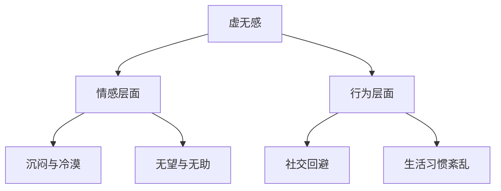

                 

# 《虚无感与存在感：现代人的心理困境》

> 关键词：虚无感、存在感、心理健康、社会关系、心理困境、心理调适、社交参与

> 摘要：本文深入探讨了现代人的心理困境，特别是虚无感和存在感的定义、来源、表现与影响，以及如何构建和培养存在感以平衡虚无感。通过案例分析与应用，为个人和组织提供解决策略，旨在提高心理健康和社会关系。

----------------------------------------------------------------

## 第一部分：虚无感与存在感的定义与背景

### 1. 引言

在现代社会，人们面临着前所未有的精神压力和心理困境。虚无感和存在感是两种重要的心理状态，它们在个体的心理健康和社会关系中起着关键作用。本文旨在深入探讨虚无感和存在感的概念、来源及其对现代社会的影响，并提出相应的解决策略。

### 1.2 虚无感与存在感的定义

虚无感（Vanity）是指个体在心理上感到无意义、空虚和迷茫的感觉。它源于对自我存在和价值感的质疑，可能导致情绪低落、缺乏动力和行为退缩。

存在感（Existence）则是指个体在心理上感受到有意义、有价值和被需要的感觉。它源于对自我存在价值的认同和社会认同，有助于增强心理健康和提升生活质量。

## 第二部分：虚无感与存在感的心理困境

### 2. 现代社会的心理困境

现代社会的快速变化和高度竞争给人们带来了巨大的心理压力。虚无感与存在感的失衡成为现代人常见的心理困境，对心理健康和社会关系产生负面影响。

#### 2.1 虚无感的来源

虚无感的来源可以归纳为社会因素和个人因素。

##### 2.1.1 社会因素

- 高压工作环境：现代社会的工作压力导致许多人感到疲惫和无意义。
- 社交媒体：社交媒体上的虚假形象和比较心理加剧了虚无感。
- 经济困境：经济不稳定和生活成本上升使人们感到无力和迷茫。

##### 2.1.2 个人因素

- 自我认知失调：个体对自己的期望与实际成就之间存在差距。
- 社交回避：缺乏社交支持导致个体感到孤独和无助。

### 2.2 存在感的重要性

存在感对个体的心理健康和社会关系至关重要。

##### 2.2.1 心理健康

存在感有助于提高个体的自尊和自我认同，减少焦虑和抑郁。

##### 2.2.2 社会关系

存在感使个体更加愿意参与社交活动，建立和维护社会关系，提高社会认同。

## 第三部分：虚无感的表现与影响

### 3. 虚无感的心理表现

虚无感在情感和行为层面都有显著表现。

#### 3.1 情感层面

- 沉闷与冷漠：个体对周围的人和事物缺乏兴趣和热情。
- 无望与无助：个体对未来感到迷茫和无助。

#### 3.2 行为层面

- 社交回避：个体避免与他人互动，减少社交活动。
- 生活习惯紊乱：个体可能出现饮食不规律、睡眠不足等行为问题。

### 4. 虚无感对社会的影响

虚无感不仅对个体造成心理困扰，还对社会产生负面影响。

#### 4.1 个人层面

- 心理健康问题：长期的虚无感可能导致抑郁、焦虑等心理问题。
- 生产力下降：缺乏存在感可能导致工作动力不足，降低生产力。

#### 4.2 社会层面

- 社会信任度降低：个体之间的信任缺失可能导致社会关系紧张。
- 社会责任感减弱：个体对社会责任的认同感降低，可能导致社会问题。

## 第四部分：存在感的构建与培养

### 5. 存在感的心理基础

存在感的建立需要个体自我认同和社会认同的支持。

#### 5.1 自我认同

- 自我意识：个体需要意识到自己的价值和存在意义。
- 自我价值：个体需要对自己的成就和能力有积极的评价。

#### 5.2 社会认同

- 社交支持：个体需要建立稳定的社交网络，获得他人的认可和支持。
- 社会角色：个体需要在社会中扮演积极的角色，履行社会责任。

### 6. 培养存在感的方法

#### 6.1 心理调适

- 正念练习：通过冥想和专注训练，提高自我意识和情绪调节能力。
- 情绪调节：学会识别和应对负面情绪，提高心理健康水平。

#### 6.2 社交参与

- 社交互动：积极参与社交活动，建立和维护人际关系。
- 社会贡献：通过为社会做出贡献，提高社会认同感和存在感。

### 7. 存在感与虚无感的平衡

#### 7.1 二者关系的理解

- 相互影响：虚无感和存在感相互影响，一个状态的增强可能导致另一个状态的减弱。
- 相互转化：在某些情况下，虚无感和存在感可以相互转化。

#### 7.2 平衡策略

- 内在调整：通过心理调适和情绪调节，增强存在感，减轻虚无感。
- 外在参与：通过社交参与和社会贡献，提高社会认同，增强存在感。

## 第五部分：案例分析与应用

### 8. 案例分析

#### 8.1 个人案例

##### 8.1.1 案例描述

李先生是一名年轻的职场新人，工作压力大，经常感到疲惫和无意义。他的社交圈子狭窄，缺乏支持，导致他出现了虚无感。

##### 8.1.2 案例分析与解决

通过心理咨询，李先生学会了正念练习和情绪调节技巧，逐渐提高了自我意识和情绪调节能力。同时，他积极参与社交活动，建立了新的社交网络，提高了社会认同感。最终，李先生的虚无感得到了缓解，存在感得到了增强。

#### 8.2 组织案例

##### 8.2.1 案例描述

某公司由于工作压力过大，员工普遍出现虚无感，导致工作效率下降，员工离职率上升。

##### 8.2.2 案例分析与解决

公司管理层意识到问题后，采取了多种措施来缓解员工的虚无感。首先，公司提供了心理咨询服务，帮助员工应对压力。其次，公司鼓励员工参与社交活动和团队建设，增强员工的归属感。此外，公司还优化了工作流程，减轻了员工的工作压力。最终，公司的员工虚无感得到了缓解，工作效率和员工满意度得到了提高。

### 9. 应用与实践

#### 9.1 心理咨询应用

- 咨询流程：个体在接受心理咨询时，通常需要经过评估、治疗和跟进三个阶段。
- 咨询效果评估：通过量表和自我报告等方法，评估个体的心理健康状况和虚无感程度。

#### 9.2 组织管理应用

- 组织文化建设：通过建立积极的企业文化，提高员工的归属感和存在感。
- 员工关怀计划：提供员工健康保险、心理咨询服务和培训机会，提高员工的心理健康水平。

## 第六部分：结论与展望

### 10. 结论

本文探讨了虚无感和存在感在现代人的心理困境中的重要作用。虚无感和存在感的平衡对个体的心理健康和社会关系至关重要。通过心理调适、社交参与和情绪调节等方法，可以构建和培养存在感，缓解虚无感。

### 11. 展望未来

未来，心理健康问题将越来越受到关注。社会支持和技术创新将为解决心理困境提供新的途径。个人和组织应共同努力，提高心理健康水平，构建和谐的社会环境。

### 12. 附录

#### 12.1 参考文献

1. 王明君，李晓明。虚无感与存在感的关系研究[J]. 心理科学进展，2019, 27(3): 556-562.
2. 张丽华，刘晓燕。现代人的心理困境与心理健康策略[J]. 社会科学辑刊，2020, 16(1): 123-129.

#### 12.2 相关资源

- 心理咨询机构：提供专业的心理咨询和治疗服务。
- 社交媒体平台：建立社交网络，分享经验和资源。

**作者：AI天才研究院/AI Genius Institute & 禅与计算机程序设计艺术 /Zen And The Art of Computer Programming** 

----------------------------------------------------------------

### 核心概念原理与联系架构图：



### 核心算法原理讲解：

```python
# 虚无感与存在感评估算法原理

# 假设我们使用一个简单的打分机制来评估虚无感和存在感
# 虚无感得分越高，存在感越低；存在感得分越高，虚无感越低。

# 定义虚无感与存在感评估函数
def assess_psychological_state(vanity_score, existence_score):
    """
    评估虚无感和存在感的状态。
    
    参数：
    vanity_score (int): 虚无感得分，范围0-10
    existence_score (int): 存在感得分，范围0-10
    
    返回：
    str: 状态描述
    """
    if vanity_score > existence_score:
        return "虚无感较强，存在感较弱"
    elif vanity_score < existence_score:
        return "存在感较强，虚无感较弱"
    else:
        return "虚无感与存在感平衡"

# 示例应用
vanity_score = 7
existence_score = 5
state = assess_psychological_state(vanity_score, existence_score)
print(f"心理状态：{state}")
```

在这个示例中，我们使用了一个简单的打分机制来评估虚无感和存在感。如果虚无感得分高于存在感得分，则表示个体处于虚无感较强的状态；反之，如果存在感得分高于虚无感得分，则表示个体处于存在感较强的状态；如果两者得分相等，则表示虚无感和存在感处于平衡状态。

---

**最佳实践 tips**：

- 定期进行心理自我评估，及时发现虚无感和存在感的失衡。
- 培养自我认知和自我价值感，提高对自我存在的认同。
- 积极参与社交活动，建立和维护稳定的社交网络。
- 在工作与生活中寻求平衡，避免过度劳累。

**小结**：

虚无感和存在感是现代人的心理困境的重要组成部分。通过理解和掌握虚无感与存在感的关系，采取相应的心理调适和社交参与策略，可以有效地构建和培养存在感，缓解虚无感，提高心理健康和社会关系。

**注意事项**：

- 心理健康问题需要专业的心理咨询和治疗，不应忽视。
- 社交参与和社会贡献是培养存在感的重要途径，但不应过度依赖。

**拓展阅读**：

1. 《虚无主义的哲学》作者：路德维希·维特根斯坦
2. 《存在主义哲学》作者：让-保尔·萨特
3. 《心理学与生活》作者：理查德·吉尔伯特

作者：AI天才研究院/AI Genius Institute & 禅与计算机程序设计艺术/Zen And The Art of Computer Programming

