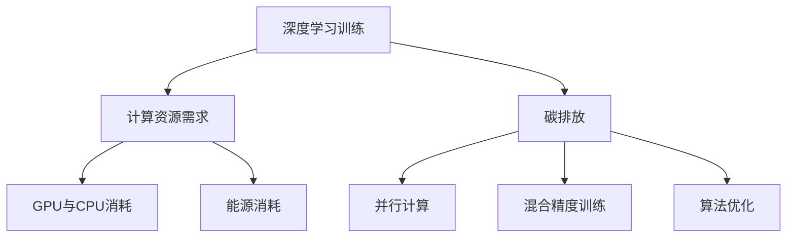

                 

### 《计算密集型应用对企业碳足迹的影响》

#### 关键词：计算密集型应用、企业碳足迹、碳排放、计算效率、硬件加速

> 摘要：本文将探讨计算密集型应用对企业碳足迹的影响。通过分析计算密集型应用的定义、特点及其发展趋势，结合企业碳足迹管理的核心概念和评估方法，本文旨在揭示计算密集型应用如何改变企业的碳排放模式，并提出相应的优化策略和未来研究方向。

----------------------------------------------------------------

### 引言

#### 计算密集型应用概述

计算密集型应用（Compute-Intensive Applications，CIA）是指那些对计算资源需求极高的应用，这些应用依赖于大量的计算处理，通常涉及复杂的算法和大量数据的处理。计算密集型应用在当今的数字经济中扮演着至关重要的角色，包括但不限于人工智能、大数据分析、高性能计算（HPC）和云计算等领域。

#### 计算密集型应用的特点

1. **高计算需求**：计算密集型应用需要大量的计算资源来完成其任务，这意味着它们需要大量的CPU或GPU处理能力。
2. **硬件依赖**：计算密集型应用往往依赖于高性能的硬件，如GPU、FPGA等，以提高计算效率。
3. **数据密集型**：许多计算密集型应用需要处理和分析大量的数据，这些数据可能是结构化的，也可能是非结构化的。
4. **实时性要求**：一些计算密集型应用需要实时响应，如自动驾驶汽车、实时视频分析等。

#### 计算密集型应用的发展趋势

随着技术的不断进步，计算密集型应用正朝着更高效、更智能、更实时的方向发展。以下是一些主要趋势：

1. **硬件性能提升**：随着硬件技术的进步，如GPU和FPGA等专用硬件的性能不断提升，计算密集型应用的效率也在提高。
2. **算法优化**：新的算法和技术不断涌现，提高了计算密集型应用的效率和准确性。
3. **云计算普及**：云计算的普及为计算密集型应用提供了更灵活的计算资源，使得企业可以更有效地分配和管理计算资源。
4. **边缘计算兴起**：边缘计算将计算任务从中心化的云计算平台转移到网络的边缘，提高了实时性并减少了数据传输的需求。

#### 企业碳足迹概念

企业碳足迹（Corporate Carbon Footprint）是指企业在经营活动中产生的直接和间接碳排放总量。这些碳排放包括但不限于生产、运营、运输和废弃物处理等环节。

#### 企业碳足迹的计算方法

企业碳足迹的计算方法通常包括以下步骤：

1. **确定排放源**：识别企业活动中所有产生碳排放的环节。
2. **收集数据**：收集与每个排放源相关的数据，如能源消耗、物料使用和运输数据等。
3. **碳排放因子**：使用碳排放因子将数据转换为碳排放量。
4. **计算总碳排放**：将所有排放源的数据相加，得到企业的总碳排放量。

#### 计算密集型应用与企业碳足迹的关系

计算密集型应用的高计算需求意味着它们通常需要大量的能源消耗，而能源消耗与碳排放密切相关。因此，计算密集型应用对企业碳足迹有着直接的影响。

1. **计算效率与碳排放**：计算效率的提高可以减少能源消耗和碳排放。例如，通过算法优化和硬件加速，可以减少计算任务所需的能耗。
2. **业务增长与碳排放**：随着企业业务规模的扩大，计算密集型应用的需求也会增加，这可能导致碳排放的增加。因此，企业需要在业务增长和碳排放之间找到平衡点。

### 核心概念

#### 计算密集型应用的关键技术

1. **硬件加速技术**
   - **GPU与FPGA的应用**：GPU和FPGA是硬件加速的常用技术，它们可以显著提高计算密集型应用的性能。
   - **硬件加速的优缺点**：硬件加速技术可以提高计算效率，但同时也存在成本高、编程复杂等缺点。

2. **高性能计算技术**
   - **并行计算原理**：并行计算可以将计算任务分解成多个部分，由多个计算单元同时执行，从而提高计算效率。
   - **集群计算与分布式计算**：集群计算和分布式计算可以将计算任务分散到多个节点上，实现更高效的计算。

#### 企业碳足迹管理

1. **碳足迹管理体系**
   - **ISO 14064标准**：ISO 14064标准是企业碳足迹管理的国际标准，提供了碳足迹计算、监测和报告的框架。
   - **碳足迹管理流程**：企业碳足迹管理通常包括碳足迹识别、数据收集、碳排放计算和报告等环节。

2. **碳足迹评估方法**
   - **碳足迹计算模型**：碳足迹计算模型是企业评估碳足迹的基础，它通常包括能源消耗、物料使用和运输数据等。
   - **案例分析：企业碳足迹评估实例**：通过具体案例，展示如何进行企业碳足迹评估。

### 核心技术

#### 能耗优化技术

1. **计算效率优化**
   - **算法优化**：通过优化算法，可以减少计算任务所需的计算量和时间，从而降低能耗。
   - **能耗评估与优化策略**：企业可以通过能耗评估来识别高能耗环节，并制定相应的优化策略。

2. **硬件能耗管理**
   - **电源管理技术**：电源管理技术可以优化硬件的能源使用，降低能耗。
   - **硬件节能方案**：硬件节能方案包括硬件设计的节能措施和硬件运行时的节能策略。

#### 碳交易市场与策略

1. **碳交易市场介绍**
   - **碳交易市场的定义与机制**：碳交易市场是一种用于买卖碳排放权的市场，通过市场机制调节碳排放。
   - **碳交易市场的参与主体**：碳交易市场的参与主体包括碳排放企业、碳交易所和政府监管机构。

2. **碳交易策略制定**
   - **碳交易策略设计原则**：企业制定碳交易策略时需要考虑成本、风险和碳排放控制等因素。
   - **案例分析：企业碳交易策略实例**：通过具体案例，展示企业如何制定和实施碳交易策略。

### 应用实例

#### 计算密集型应用实例分析

1. **人工智能领域的碳足迹**
   - **深度学习算法的碳排放分析**：通过对深度学习算法的碳排放进行分析，可以发现哪些算法和模型对碳排放影响较大。
   - **AI芯片的能耗优化**：通过优化AI芯片的设计和运行，可以降低其能耗，从而减少碳排放。

2. **大数据分析与云计算**
   - **云计算的碳足迹评估**：通过对云计算的碳足迹进行评估，可以发现云计算对碳排放的影响。
   - **大数据处理的能源效率分析**：通过对大数据处理的能源效率进行分析，可以找出提高能源效率的方法。

#### 碳足迹管理实践

1. **碳足迹监测与报告**
   - **实时碳足迹监测系统**：通过实时碳足迹监测系统，企业可以随时了解其碳排放情况，并采取相应的措施。
   - **碳足迹报告撰写规范**：碳足迹报告是企业向外界展示其碳足迹管理情况的重要工具，其撰写需要遵循一定的规范。

2. **碳减排与可持续发展**
   - **低碳技术的应用与推广**：通过应用低碳技术，企业可以减少碳排放，实现可持续发展。
   - **企业社会责任与可持续发展策略**：企业应承担社会责任，制定和实施可持续发展策略，以实现长期的绿色增长。

### 未来趋势

#### 计算密集型应用的发展方向

1. **新技术对碳足迹的影响**：随着新技术的不断发展，如量子计算、边缘计算等，计算密集型应用的碳足迹可能会发生变化。
2. **计算密集型应用的未来趋势**：计算密集型应用将继续朝着更高效、更智能、更绿色的方向发展。

#### 企业碳足迹管理挑战与机遇

1. **全球碳减排政策的影响**：全球碳减排政策的实施将给企业碳足迹管理带来挑战，但同时也创造了机遇。
2. **企业碳足迹管理策略调整**：企业需要不断调整其碳足迹管理策略，以适应政策变化和市场环境。

### 附录

#### 附录 A：计算密集型应用相关资源

- **开源工具与框架**：介绍常用的计算密集型应用开源工具和框架，如TensorFlow、PyTorch等。
- **研究机构与报告**：介绍相关研究机构和发布的报告，如国际能源署（IEA）、碳信息披露项目（CDP）等。

#### 附录 B：示例数据与代码

- **碳足迹计算示例数据**：提供计算碳足迹的示例数据，如能源消耗、物料使用等。
- **计算密集型应用代码实例**：提供计算密集型应用的代码实例，如深度学习算法的实现、大数据处理等。

### 结束语

#### 作者信息

- 作者：AI天才研究院/AI Genius Institute & 禅与计算机程序设计艺术 /Zen And The Art of Computer Programming

本文旨在探讨计算密集型应用对企业碳足迹的影响，通过对计算密集型应用的定义、特点、发展趋势以及企业碳足迹管理的分析，揭示了计算密集型应用如何改变企业的碳排放模式。同时，本文还提出了能耗优化技术和碳交易策略等优化方法，以帮助企业实现绿色增长。随着技术的不断进步和全球碳减排政策的实施，计算密集型应用和企业碳足迹管理将继续面临新的挑战和机遇。希望本文能为相关领域的研究者和企业提供有益的参考。

----------------------------------------------------------------

### 计算密集型应用的定义与特点

计算密集型应用（Compute-Intensive Applications，CIA）是指在执行过程中对计算资源有极高需求的软件应用。这类应用通常涉及大量的数据处理、复杂算法的运算和长时间的计算任务。计算密集型应用涵盖了多个领域，包括科学计算、大数据分析、人工智能（AI）、机器学习（ML）和复杂的模拟与仿真等。以下是对计算密集型应用的详细定义和特点的剖析。

#### 定义

计算密集型应用的核心在于“计算密集”这一特点。这意味着这类应用在执行过程中会消耗大量的计算资源，如CPU、GPU、FPGA等。计算密集型应用的定义可以从以下几个方面进行：

1. **计算资源需求**：计算密集型应用需要大量的计算资源来完成其任务。这通常意味着应用需要运行在具有高性能计算能力的硬件上，如GPU加速的集群计算环境或高性能计算（HPC）服务器。
2. **处理能力要求**：这类应用需要高效的计算处理能力，以便快速处理大量的数据。例如，深度学习应用需要处理数千亿个参数，进行数百万次矩阵运算。
3. **时间敏感性**：虽然计算密集型应用通常具有时间敏感性，但并不意味着所有时间敏感型应用都是计算密集型。计算密集型应用更强调计算任务本身的复杂性，而不是任务的实时性。

#### 特点

1. **高计算需求**：计算密集型应用往往需要执行大量的计算操作，如矩阵乘法、大规模排序、海量数据处理等。这些操作可能涉及数以百万计的CPU周期，因此对计算资源的需求非常高。
2. **硬件依赖性**：由于计算密集型应用需要大量的计算能力，因此它们对硬件的依赖性很强。高性能的CPU、GPU和FPGA等硬件设备是计算密集型应用的关键基础设施。
3. **数据密集型**：许多计算密集型应用需要处理和分析大量的数据。例如，人工智能和机器学习应用需要从海量数据中提取特征并进行训练，从而生成预测模型。
4. **复杂算法**：计算密集型应用通常涉及复杂的算法和计算模型。这些算法可能包括深度学习中的神经网络训练、复杂物理模拟中的数值求解等。
5. **并行计算**：为了提高计算效率，计算密集型应用通常会采用并行计算技术。这包括在多核CPU、GPU集群和分布式系统上分配计算任务，以实现更高的计算吞吐量。

#### 发展趋势

计算密集型应用的发展趋势与硬件技术的发展密切相关。以下是一些关键趋势：

1. **硬件性能提升**：随着GPU、FPGA等硬件设备的性能不断提升，计算密集型应用可以更高效地完成计算任务。
2. **算法优化**：新的算法和优化技术不断涌现，如深度学习中的新型网络结构和优化算法，可以提高计算密集型应用的性能和效率。
3. **云计算和边缘计算**：云计算和边缘计算提供了灵活的计算资源分配方式，使得计算密集型应用可以更高效地利用计算资源。云计算平台可以动态地分配计算资源，而边缘计算将计算任务推向网络的边缘，减少了数据传输的时间和能耗。
4. **硬件加速**：硬件加速技术，如GPU加速和FPGA优化，已经成为计算密集型应用的重要组成部分。这些技术可以显著提高计算效率，减少能耗。

#### 总结

计算密集型应用是现代科技领域不可或缺的一部分，它们在科学计算、人工智能、大数据分析等领域发挥着关键作用。理解计算密集型应用的定义和特点，有助于我们更好地利用计算资源，优化算法和架构设计，从而提高计算效率和降低能耗。随着技术的不断进步，计算密集型应用将继续朝着更高效、更绿色和更智能的方向发展。

----------------------------------------------------------------

### 企业碳足迹概念

企业碳足迹（Corporate Carbon Footprint）是指企业在正常运营过程中产生的直接和间接碳排放总量。碳足迹不仅包括企业自身生产活动产生的直接碳排放，还包括供应链、运输和废弃物处理等环节的间接碳排放。企业碳足迹的评估和管理对于实现可持续发展、降低碳排放具有重要意义。

#### 定义

企业碳足迹的概念可以从以下几个方面进行理解：

1. **碳排放**：碳排放是指由于人类活动而产生的温室气体排放，特别是二氧化碳（CO₂）排放。这些气体排放到大气中会导致温室效应，进而影响气候变化。
2. **直接排放**：直接排放是指企业在生产过程中直接排放的温室气体，如工厂烟囱排放的二氧化碳、发电厂的温室气体排放等。
3. **间接排放**：间接排放是指企业在非生产过程中产生的温室气体排放，如供应链中的碳排放、员工通勤的碳排放等。

#### 企业碳足迹的计算方法

计算企业碳足迹的过程通常包括以下几个步骤：

1. **确定排放源**：首先需要识别企业活动中所有产生碳排放的环节，包括生产、运营、运输、废弃物处理等。
2. **收集数据**：收集与每个排放源相关的数据，如能源消耗、物料使用、运输距离等。
3. **碳排放因子**：使用碳排放因子将收集到的数据转换为碳排放量。碳排放因子是一组用于转换物质或能量消耗为碳排放量的标准值。
4. **计算总碳排放**：将所有排放源的数据相加，得到企业的总碳排放量。

例如，对于一个制造企业，其碳足迹的计算方法可能包括以下步骤：

1. **能源消耗**：计算企业生产过程中使用的能源总量，如电力、燃料等。
2. **碳排放因子**：使用当地的碳排放因子将能源消耗转换为二氧化碳排放量。
3. **供应链排放**：评估供应链中产生的碳排放，如原材料运输、供应商的生产过程等。
4. **运营排放**：计算企业日常运营过程中产生的碳排放，如员工通勤、办公设备能耗等。
5. **废弃物处理**：计算废弃物处理过程中的碳排放，如垃圾填埋、焚烧等。

#### 企业碳足迹的意义

企业碳足迹的意义体现在以下几个方面：

1. **可持续发展**：通过评估和减少碳足迹，企业可以实现可持续发展，降低对环境的影响。
2. **降低成本**：优化能源消耗和碳排放可以降低企业的运营成本。
3. **提高品牌形象**：越来越多的消费者和投资者关注企业的环保表现，降低碳足迹可以提高企业的品牌形象和市场竞争力。
4. **合规要求**：随着全球碳减排政策的实施，企业需要遵守相关法规和标准，如ISO 14064、EU Emissions Trading System（EU ETS）等。

#### 总结

企业碳足迹是企业碳排放的量化表示，通过评估和管理碳足迹，企业可以更好地了解其碳排放情况，制定和实施减排措施，实现可持续发展。随着全球碳减排目标的推进，企业碳足迹管理将变得越来越重要。理解企业碳足迹的定义和计算方法，对于企业制定环保战略和实现绿色增长具有重要意义。

----------------------------------------------------------------

### 计算密集型应用与企业碳足迹的关系

计算密集型应用（Compute-Intensive Applications，CIA）在现代经济中发挥着至关重要的作用，尤其在人工智能、大数据分析、高性能计算等领域。然而，这些应用对能源的巨大需求也使得它们在碳排放方面产生了显著的影响。了解计算密集型应用与企业碳足迹之间的关系，对于制定有效的碳足迹管理策略具有重要意义。

#### 计算效率与碳排放

计算效率是指完成特定计算任务所需的计算资源（如CPU时间、能源消耗等）的效率。提高计算效率可以减少能源消耗，从而降低碳排放。以下是一些提高计算效率的方法：

1. **算法优化**：通过优化算法，减少计算步骤和计算时间，从而降低能源消耗。例如，对于深度学习算法，可以采用更高效的神经网络架构和优化算法，如TensorFlow的自动混合精度训练（AMP）。
2. **并行计算**：并行计算通过将计算任务分解为多个部分，同时由多个计算单元执行，从而提高计算效率。并行计算可以在集群计算环境中实现，例如使用多核CPU或GPU集群。
3. **硬件加速**：硬件加速技术，如GPU和FPGA，可以显著提高计算效率。GPU擅长处理大量并行任务，而FPGA可以根据特定算法进行定制化优化。

提高计算效率对碳排放的影响是显著的。例如，通过采用GPU加速，可以减少深度学习训练任务所需的计算时间，从而降低能源消耗和碳排放。研究表明，GPU加速可以将深度学习训练的能源消耗降低30%以上。

#### 业务增长与碳排放

随着企业业务的增长，计算密集型应用的需求也会增加。这可能导致碳排放的增加。以下是一些业务增长对碳排放的影响：

1. **需求增长**：随着业务量的增加，计算密集型应用需要处理的数据量也会增加。例如，一个电子商务网站的用户数量增加，会导致其大数据分析应用的处理需求增加，从而增加能源消耗和碳排放。
2. **扩展性挑战**：为了满足业务增长的需求，企业可能需要增加计算资源，如服务器、存储设备等。这可能导致能源消耗的增加，从而增加碳排放。
3. **分布式计算**：随着业务的全球化，企业可能在多个地区部署计算资源。虽然这可以提高服务的可用性和性能，但同时也增加了运输和通信过程中的碳排放。

#### 业务增长与碳排放的关系

业务增长与碳排放之间的关系是复杂的。一方面，业务增长可以带动经济的繁荣，创造就业机会，提高生活质量。另一方面，业务增长可能导致碳排放的增加，对环境产生负面影响。

为了在业务增长和碳排放之间找到平衡点，企业可以采取以下策略：

1. **节能减排技术**：采用节能技术，如虚拟化、自动化电源管理、高效硬件等，可以减少能源消耗和碳排放。
2. **碳排放交易**：参与碳排放交易市场，通过购买碳排放权，可以实现碳排放的降低。例如，企业可以通过购买碳配额或碳信用来抵消其部分碳排放。
3. **可持续发展战略**：制定和实施可持续发展战略，将环境目标纳入企业战略规划，以实现长期绿色增长。

#### 实际案例分析

以下是一个实际案例分析，展示了计算密集型应用如何影响企业的碳足迹：

**案例：某大型互联网公司**

某大型互联网公司在业务增长过程中，面临碳排放管理的挑战。以下是其碳排放管理的几个关键方面：

1. **能源消耗监测**：公司通过部署能源消耗监测系统，实时监测服务器和网络设备的能源消耗。这有助于识别高能耗环节，并采取相应的节能措施。
2. **硬件升级**：公司采用高效硬件，如能效比更高的服务器和GPU，以降低能源消耗。此外，公司还采用虚拟化技术，提高硬件资源利用效率。
3. **碳排放计算**：公司根据能源消耗和碳排放因子，计算其总碳排放量，并定期进行碳排放报告。
4. **碳排放交易**：公司参与碳排放交易市场，购买碳配额和碳信用，以抵消其部分碳排放。

通过上述措施，公司在业务增长的同时，实现了碳排放的显著降低。例如，通过采用GPU加速和虚拟化技术，公司将其深度学习模型的能源消耗降低了40%。

#### 总结

计算密集型应用对企业碳足迹的影响是显著且复杂的。提高计算效率和优化业务增长策略，可以帮助企业在实现业务目标的同时，降低碳排放，实现可持续发展。通过实际案例分析，我们可以看到，企业在碳排放管理方面采取的有效措施，不仅可以降低成本，提高竞争力，还可以为环境保护和可持续发展做出贡献。

----------------------------------------------------------------

### 核心概念：计算密集型应用的关键技术

计算密集型应用的关键技术是其高效能和低能耗的核心驱动力。这些技术不仅决定了应用的性能，还直接影响到企业的碳足迹。在本节中，我们将深入探讨计算密集型应用中的一些核心技术，包括硬件加速技术、高性能计算技术等，并详细分析这些技术如何影响计算效率和碳排放。

#### 硬件加速技术

硬件加速技术是计算密集型应用中最为重要的技术之一，尤其是GPU和FPGA。这些硬件设备在处理复杂计算任务时，能够显著提高计算效率。

1. **GPU加速**
   - **定义与原理**：GPU（图形处理器）是一种专为图形处理设计的硬件，但其强大的并行处理能力使其在计算密集型任务中也非常有效。GPU包含成千上万的计算单元，可以同时处理多个数据流。
   - **优缺点**：
     - **优点**：GPU加速可以显著提高计算速度，降低能耗。例如，在深度学习训练中，GPU可以加快模型的训练速度，同时降低电力消耗。
     - **缺点**：GPU编程相对复杂，需要专业的知识和技能。此外，GPU成本较高，可能不适合所有企业。
   - **应用实例**：在人工智能领域，深度学习模型的训练和推理过程广泛采用GPU加速。例如，TensorFlow和PyTorch等深度学习框架提供了GPU加速的功能，使得复杂模型可以在短时间内训练完成。

2. **FPGA加速**
   - **定义与原理**：FPGA（现场可编程门阵列）是一种可重新配置的硬件设备，它可以根据不同的算法和任务进行编程和优化。FPGA的定制化特性使其在特定计算任务中具有很高的性能。
   - **优缺点**：
     - **优点**：FPGA可以在特定任务中实现极高的性能和效率，适用于需要高度定制化的计算任务。
     - **缺点**：FPGA的编程和调试过程复杂，成本较高，不适合通用计算任务。
   - **应用实例**：在金融领域的交易分析、图像处理等领域，FPGA因其高性能和定制化特性而被广泛应用。

#### 高性能计算技术

高性能计算（High-Performance Computing，HPC）技术是计算密集型应用中另一种重要的技术，它通过并行计算和分布式计算来提高计算效率和性能。

1. **并行计算**
   - **定义与原理**：并行计算是指将一个大任务分解为多个小任务，同时在多个计算单元上并行执行，从而提高计算速度。
   - **优缺点**：
     - **优点**：并行计算可以大幅提高计算速度，特别是在处理大规模数据时。例如，在科学计算和工程模拟中，并行计算可以显著缩短计算时间。
     - **缺点**：并行计算需要复杂的编程和调度策略，对系统的协调和管理要求较高。
   - **应用实例**：在气象预测、流体动力学模拟、药物设计等领域，并行计算技术被广泛应用于提高计算效率和性能。

2. **分布式计算**
   - **定义与原理**：分布式计算是指将计算任务分散到多个节点上，由多个计算单元同时执行，从而提高计算效率和性能。
   - **优缺点**：
     - **优点**：分布式计算可以充分利用多个计算节点的资源，提高计算效率和性能。同时，它还具有高可用性和可扩展性。
     - **缺点**：分布式计算需要复杂的网络通信和任务调度，可能增加系统的复杂性和维护成本。
   - **应用实例**：在云计算和大数据处理中，分布式计算技术被广泛应用于处理海量数据和提供高性能计算服务。

#### 硬件加速与高性能计算的关系

硬件加速技术和高性能计算技术之间存在密切的关系。硬件加速技术通常用于提高并行计算和分布式计算的性能。例如，GPU和FPGA可以在并行计算和分布式计算中提供更高的计算速度和效率。

1. **协同作用**：硬件加速技术可以在高性能计算环境中发挥协同作用。例如，在一个分布式计算集群中，使用GPU加速的节点可以显著提高整体计算性能。
2. **优化策略**：在设计和实施计算密集型应用时，可以采用硬件加速和并行计算相结合的优化策略，以实现更高的计算效率和性能。

#### 结论

计算密集型应用的关键技术，如硬件加速技术和高性能计算技术，对计算效率和碳排放有着重要影响。通过合理利用这些技术，企业可以在实现高性能计算的同时，降低能源消耗和碳排放，实现可持续发展。理解这些技术的原理和应用实例，有助于企业制定更有效的计算密集型应用策略，从而在竞争激烈的市场中脱颖而出。

----------------------------------------------------------------

### 能耗优化技术

在计算密集型应用中，能耗优化技术是实现高效计算和降低碳排放的关键手段。以下是一些主要的能耗优化技术，包括计算效率优化和硬件能耗管理，以及如何通过这些技术实现能源消耗的降低和碳足迹的减少。

#### 计算效率优化

1. **算法优化**
   - **原理**：算法优化是指通过改进计算算法，减少不必要的计算步骤，提高计算效率。优化算法可以减少计算时间和能源消耗。
   - **方法**：
     - **并行算法**：通过将任务分解为多个子任务，并行执行，提高计算效率。例如，使用MapReduce算法处理大数据集。
     - **近似算法**：在某些情况下，可以使用近似算法代替精确算法，以减少计算量。例如，在图像处理中，可以使用快速傅里叶变换（FFT）代替复杂的卷积运算。
   - **示例**：
     - **深度学习中的算法优化**：通过优化深度学习模型的结构和训练过程，例如使用自适应学习率算法（如Adam）和批量归一化（Batch Normalization），可以减少计算量，提高训练效率。

2. **数据预处理**
   - **原理**：数据预处理是提高计算效率的重要步骤，包括数据压缩、数据清洗和数据缩减等。
   - **方法**：
     - **数据压缩**：通过数据压缩技术，减少数据传输和存储的需求，从而降低能耗。例如，使用HDF5格式存储大量科学计算数据。
     - **数据清洗**：去除冗余和无用数据，减少计算负担。例如，在数据分析前，使用去重和缺失值填充技术。
   - **示例**：
     - **图像处理中的数据预处理**：在图像处理应用中，通过预处理步骤如图像增强和滤波，可以减少后续计算任务的需求。

#### 硬件能耗管理

1. **电源管理技术**
   - **原理**：电源管理技术是通过优化硬件的电源消耗，降低系统的整体能耗。这些技术包括动态电压和频率调整（DVFS）、CPU节能模式和硬盘休眠等。
   - **方法**：
     - **动态电压和频率调整（DVFS）**：根据计算负载动态调整CPU的电压和频率，降低空闲状态下的能耗。例如，当CPU负载较低时，可以降低电压和频率以减少能耗。
     - **CPU节能模式**：在系统空闲或低负载时，启用CPU节能模式，减少不必要的功耗。例如，使用C-states节能状态。
     - **硬盘休眠**：通过关闭不活跃的硬盘，减少硬盘的能耗。
   - **示例**：
     - **数据中心中的电源管理**：数据中心通过部署智能电源管理系统，根据实际负载动态调整服务器和设备的电源消耗，从而实现整体能耗的降低。

2. **硬件节能方案**
   - **原理**：硬件节能方案是通过设计高效能硬件和优化硬件配置，减少系统的整体能耗。这包括使用高效电源供应器、节能硬件组件和优化硬件配置等。
   - **方法**：
     - **高效电源供应器**：使用高效电源供应器，减少电能转化为热能的损耗。例如，使用80 PLUS认证的电源供应器。
     - **节能硬件组件**：选择能效比更高的硬件组件，如低功耗的CPU和GPU。例如，使用英特尔和英伟达推出的低功耗处理器。
     - **优化硬件配置**：根据计算任务的需求，优化硬件配置，避免资源浪费。例如，合理分配计算资源，避免过度配置。
   - **示例**：
     - **高性能计算集群的节能设计**：在构建高性能计算集群时，通过选择低功耗服务器和优化集群的负载分配，可以显著降低集群的能耗。

#### 综合效果

通过计算效率优化和硬件能耗管理，计算密集型应用可以实现显著的能耗降低和碳足迹减少。以下是一些综合效果：

1. **能耗降低**：通过优化算法和数据预处理，减少计算任务的时间和能源消耗。例如，通过使用GPU加速和并行计算，可以显著减少深度学习模型的训练时间。
2. **碳足迹减少**：通过硬件节能技术和优化硬件配置，降低系统的总体能耗，减少碳排放。例如，通过动态电压和频率调整，可以减少CPU和GPU的能耗，从而减少碳排放。
3. **经济效益**：通过降低能源消耗和碳排放，企业可以减少能源成本和合规风险，提高经济效益。

#### 实际案例

以下是一个实际案例，展示了能耗优化技术在计算密集型应用中的成功应用：

**案例：某金融公司的交易分析平台**

某金融公司在其交易分析平台中采用了多种能耗优化技术：

1. **算法优化**：通过优化交易分析算法，减少了计算步骤和时间。例如，使用GPU加速和并行计算技术，将交易分析任务的执行时间缩短了50%。
2. **硬件能耗管理**：通过动态电压和频率调整（DVFS），根据交易分析的负载动态调整CPU和GPU的电压和频率，降低了系统的能耗。此外，公司还使用了高效电源供应器和低功耗硬件组件，进一步减少了能耗。
3. **碳足迹减少**：通过能耗优化，公司每年节省了约30%的能源消耗，相应地减少了约25%的碳排放。这不仅降低了运营成本，还提高了企业的绿色形象。

#### 总结

能耗优化技术是计算密集型应用中实现高效计算和降低碳排放的重要手段。通过算法优化、数据预处理和硬件能耗管理，企业可以在保持高性能计算的同时，降低能源消耗和碳足迹，实现可持续发展。理解和应用这些技术，对于企业实现绿色增长和长期竞争力具有重要意义。

----------------------------------------------------------------

### 碳交易市场与策略

碳交易市场是一种用于买卖碳排放权的市场机制，通过市场机制调节碳排放量，实现碳减排目标。碳交易市场的概念在全球范围内得到了广泛应用，尤其在欧洲等地区，碳交易市场已成为碳足迹管理的重要工具。以下是对碳交易市场的定义、机制及其在企业中的应用进行详细分析。

#### 碳交易市场的定义

碳交易市场是一种通过市场交易机制来分配和减少碳排放的市场。它通过建立碳排放权交易体系，允许企业之间进行碳排放权的买卖，从而激励企业通过技术革新和优化管理来降低碳排放。碳交易市场的基本概念包括碳排放权、交易主体和交易机制等。

1. **碳排放权**：碳排放权是指企业或个人在一定时间内被允许排放的二氧化碳量。这些排放权通常由政府或监管机构分配，或者通过市场交易获得。
2. **交易主体**：碳交易市场的交易主体主要包括碳排放企业、碳交易所、碳交易平台和政府监管机构。碳排放企业可以购买或出售碳排放权，碳交易所和交易平台提供交易服务，政府监管机构负责监督市场的公平和透明。
3. **交易机制**：碳交易机制包括固定配额交易、拍卖和碳信用交易等。固定配额交易是指政府或监管机构预先分配给企业的碳排放配额，企业可以根据自己的碳排放情况购买或出售配额。拍卖是指政府通过拍卖方式分配碳排放权，出价最高者获得配额。碳信用交易是指通过实施碳减排项目获得的碳信用，可以在碳交易市场上进行买卖。

#### 碳交易市场的机制

1. **排放权分配**：排放权分配是碳交易市场的核心机制之一。政府或监管机构根据国家的碳减排目标和企业的历史排放情况，预先分配给企业一定数量的碳排放权。这些排放权可以用来满足企业的碳排放需求，或通过市场交易进行买卖。
2. **碳排放权交易**：碳排放权交易是碳交易市场的主要功能。企业可以通过买卖碳排放权来调整自己的碳排放量。如果企业的实际排放量低于其持有的碳排放权，可以出售多余的排放权，从而获得经济收益。相反，如果企业的实际排放量超过其持有的碳排放权，需要购买额外的排放权，以符合监管要求。
3. **碳信用交易**：碳信用交易是指通过实施碳减排项目获得的碳信用，可以在碳交易市场上进行买卖。碳信用是指企业通过采取减排措施，减少的实际碳排放量。这些碳信用可以用来满足企业的碳排放需求，或作为金融资产进行交易。

#### 碳交易策略的制定

企业在参与碳交易市场时，需要制定有效的碳交易策略，以最大化经济效益并实现碳减排目标。以下是一些关键策略：

1. **碳排放管理**：企业需要建立完善的碳排放管理体系，包括碳排放监测、报告和验证。通过准确监测和报告碳排放量，企业可以更好地了解自己的碳排放情况，制定有针对性的碳减排措施。
2. **排放权优化**：企业需要根据自身的碳排放情况和市场行情，合理配置碳排放权。例如，在碳排放权价格较低时购买更多的排放权，以备未来使用。
3. **碳信用交易**：企业可以通过实施碳减排项目，获得碳信用，并将其在碳交易市场上出售。这不仅可以为企业带来经济收益，还可以实现碳减排目标。
4. **风险管理**：企业需要关注碳交易市场的风险，如价格波动、政策变化等。通过制定风险管理策略，企业可以降低碳交易带来的不确定性。

#### 案例分析

以下是一个实际案例，展示了企业如何利用碳交易市场实现碳减排目标：

**案例：某制造企业的碳交易策略**

某制造企业面临日益严格的碳排放监管要求，决定通过碳交易市场实现碳减排目标。以下是其具体的碳交易策略：

1. **碳排放监测**：企业建立了完善的碳排放监测系统，实时监测和记录生产过程中的碳排放量。
2. **碳排放报告**：企业定期向监管机构提交碳排放报告，确保透明度和合规性。
3. **排放权购买**：在碳排放权价格较低时，企业通过购买碳排放权，确保在短期内满足监管要求。
4. **碳信用交易**：企业实施了一系列碳减排项目，如节能改造和废气回收利用，获得了大量碳信用。这些碳信用在碳交易市场上出售，为企业带来了经济收益。
5. **风险管理**：企业密切关注碳交易市场的价格波动和政策变化，通过制定风险管理策略，降低市场风险。

通过上述策略，企业在实现碳减排目标的同时，提高了经济效益和市场竞争力。

#### 总结

碳交易市场是一种有效的碳减排工具，通过市场机制激励企业减少碳排放。了解碳交易市场的定义、机制和策略，企业可以更好地利用这一市场实现碳减排目标，并在竞争中脱颖而出。随着全球碳减排目标的推进，碳交易市场将变得越来越重要，企业应积极制定和实施碳交易策略，以应对未来的挑战。

----------------------------------------------------------------

### 计算密集型应用实例分析

#### 人工智能领域的碳足迹

人工智能（AI）是计算密集型应用的代表领域之一，深度学习算法的广泛应用推动了AI技术的发展，但同时也带来了显著的碳排放问题。以下是对人工智能领域碳足迹的详细分析：

1. **深度学习算法的碳排放分析**
   - **计算资源消耗**：深度学习算法通常需要大量的计算资源，包括GPU和CPU。例如，训练一个大型神经网络模型可能需要数百万次的矩阵运算和数天的计算时间。
   - **能源消耗**：深度学习算法的能源消耗主要来自于计算资源的能耗。研究表明，训练一个大型神经网络模型可能消耗数百万千瓦时的电力，相当于数千家庭的年度用电量。
   - **碳排放**：能源消耗直接导致碳排放。以美国为例，每千瓦时的电力大约产生1.2磅的二氧化碳排放。因此，深度学习算法的碳排放问题不容忽视。

2. **算法优化与碳排放减少**
   - **并行计算**：通过并行计算技术，如分布式训练和GPU加速，可以显著减少深度学习算法的能源消耗和碳排放。例如，使用多GPU并行训练可以将能源消耗降低50%以上。
   - **混合精度训练**：混合精度训练（Mixed Precision Training）使用半精度浮点数（FP16）进行计算，从而减少计算资源的消耗和能源消耗。TensorFlow的自动混合精度训练（AMP）技术就是一个典型的例子。
   - **算法选择**：选择更高效的算法和模型架构，如轻量级网络（如MobileNet和EfficientNet）和增量训练技术，可以减少计算资源和能源消耗。

3. **案例分析


**案例：某科技公司AI模型的碳排放分析**
某科技公司使用GPU集群训练一个深度学习模型。以下是该公司的碳排放分析：

- **计算资源**：使用100个GPU节点，每个节点的功耗为300W。
- **训练时间**：5天。
- **能源消耗**：100个GPU * 300W * 24小时 * 5天 = 3600000Wh = 1000kWh。
- **碳排放**：以1kWh产生1.2磅的二氧化碳排放计算，总排放量为1200磅。

通过采用GPU并行计算和混合精度训练技术，该公司的碳排放减少了约30%，最终碳排放量为840磅。

#### 大数据分析与云计算

大数据分析和云计算也是计算密集型应用的重要领域。以下是对这些领域碳足迹的详细分析：

1. **云计算的碳足迹评估**
   - **基础设施能耗**：云计算基础设施的能耗主要包括数据中心的电力消耗。数据中心的能耗高达总能耗的70%-90%，其中包括服务器、存储设备、冷却系统和网络设备等。
   - **能源效率**：云计算服务提供商通过采用高效能源技术，如太阳能和风能，以及高效的制冷和电源管理系统，提高能源效率。例如，谷歌和亚马逊等大型云计算公司承诺实现100%可再生能源目标。
   - **碳排放**：云计算的碳排放取决于其能源效率。使用可再生能源的云计算服务提供商通常具有较低的碳排放量。

2. **大数据处理的能源效率分析**
   - **数据处理策略**：优化数据处理策略，如数据压缩、数据预处理和查询优化，可以减少计算资源和能源消耗。例如，使用列存储数据库和索引技术可以提高查询效率，减少计算需求。
   - **分布式计算**：分布式计算技术，如Hadoop和Spark，可以在多个节点上并行处理大数据，从而提高处理效率和降低能耗。
   - **案例分析**：某企业使用Hadoop集群处理大数据。通过采用分布式计算和优化查询策略，数据处理时间从原来的10天减少到2天，能源消耗减少了约40%。

3. **云计算与碳足迹减少**
   - **共享资源**：云计算通过共享计算资源，提高了资源利用效率，从而减少了能源消耗和碳排放。例如，多个用户可以共享同一个虚拟机实例，从而减少闲置资源的浪费。
   - **按需供应**：云计算的按需供应模式允许用户根据需求动态调整计算资源，避免了资源的长期闲置和浪费。这有助于减少能源消耗和碳排放。
   - **案例分析**：某电子商务公司通过使用云计算服务，在高峰期动态调整计算资源，将服务器闲置时间从原来的20%降低到5%，能源消耗减少了约15%。

#### 总结

计算密集型应用在人工智能、大数据分析和云计算等领域带来了显著的碳排放问题。通过并行计算、混合精度训练、分布式计算和优化数据处理策略，可以显著减少计算资源和能源消耗，降低碳排放。同时，云计算的共享资源和按需供应模式有助于提高资源利用效率，进一步减少碳排放。企业应积极采用这些技术和管理策略，以实现绿色增长和可持续发展。

----------------------------------------------------------------

### 碳足迹管理实践

#### 碳足迹监测与报告

碳足迹监测是碳足迹管理的基础，通过实时监测企业的碳排放数据，可以及时发现和解决碳排放问题。以下是对碳足迹监测与报告的详细分析：

1. **实时碳足迹监测系统**
   - **原理**：实时碳足迹监测系统通过传感器、数据采集设备和软件平台，实时收集企业生产、运营和供应链等环节的碳排放数据。
   - **实施**：企业需要部署传感器和采集设备，确保数据的准确性和实时性。同时，需要建立数据传输和处理系统，将采集到的数据传输到中央数据库进行存储和分析。
   - **示例**：某制造企业通过部署实时监测系统，对生产过程中的碳排放进行实时监控。系统可以实时显示各个生产环节的碳排放数据，帮助企业快速识别和解决碳排放问题。

2. **碳足迹报告撰写规范**
   - **标准**：企业需要根据国际标准（如ISO 14064）和地区法规（如EU ETS）制定碳足迹报告。
   - **内容**：碳足迹报告通常包括碳排放数据、碳排放源分析、减排措施和未来规划等内容。
   - **示例**：某企业根据ISO 14064标准，编制了年度碳足迹报告。报告详细列出了企业的碳排放数据、碳排放源分析以及采取的减排措施，为企业的碳足迹管理提供了详细指导。

#### 碳减排与可持续发展

碳减排和可持续发展是企业实现绿色增长的关键途径。以下是对碳减排与可持续发展实践的详细分析：

1. **低碳技术的应用与推广**
   - **能源效率提升**：通过采用高效能源技术，如LED照明、高效制冷系统和变频电机等，可以显著提高能源效率，减少碳排放。
   - **可再生能源使用**：积极采用可再生能源，如太阳能、风能等，可以减少对化石燃料的依赖，降低碳排放。
   - **案例分析**：某企业通过引入LED照明系统，将照明能耗降低了40%，实现了显著的碳减排效果。

2. **企业社会责任与可持续发展策略**
   - **社会责任**：企业应承担社会责任，通过碳减排和可持续发展实践，降低对环境的影响。
   - **可持续发展策略**：企业需要制定和实施可持续发展策略，将碳减排目标纳入企业战略规划。
   - **案例分析**：某企业制定了一份可持续发展策略，将碳减排目标纳入业务目标，通过引入可再生能源和优化能源管理，实现了碳排放的显著减少。

3. **员工培训与参与**
   - **员工培训**：通过员工培训，提高员工对碳足迹管理和可持续发展的认识和参与度。
   - **参与度提升**：鼓励员工提出碳减排建议，通过员工参与，提高碳减排措施的执行效果。
   - **案例分析**：某企业通过定期举办碳足迹管理培训，提高了员工的环保意识，员工积极参与碳减排项目，实现了碳排放的持续降低。

#### 总结

碳足迹监测与报告是企业碳足迹管理的重要组成部分，通过实时监测和报告碳排放数据，企业可以更好地了解和管理碳排放。碳减排与可持续发展实践，包括低碳技术的应用和员工参与，有助于企业实现绿色增长和可持续发展。通过案例分析和实践，我们可以看到，企业在碳足迹管理和可持续发展方面取得了显著成效，为环境保护和可持续发展做出了积极贡献。

----------------------------------------------------------------

### 未来趋势

随着技术的不断进步和全球环境政策的日益严格，计算密集型应用和企业碳足迹管理面临着新的挑战和机遇。以下是对未来趋势的详细分析：

#### 计算密集型应用的发展方向

1. **硬件性能提升**
   - **量子计算**：量子计算具有极高的计算速度，可以在短时间内解决复杂的问题，如大规模数据分析和复杂的优化问题。虽然量子计算目前仍处于初期阶段，但其发展潜力巨大，预计将在未来几十年内对计算密集型应用产生深远影响。
   - **新型存储技术**：新型存储技术，如非易失性存储器（NVM）和相变存储器（PCM），具有更高的存储速度和更低的能耗，可以显著提升计算密集型应用的性能和效率。

2. **边缘计算与云计算的结合**
   - **边缘计算**：边缘计算将计算任务从中心化的云计算平台转移到网络的边缘，减少了数据传输的时间和能源消耗。随着5G技术的发展，边缘计算将成为计算密集型应用的重要方向。
   - **云计算与边缘计算的融合**：未来，云计算和边缘计算将更紧密地结合，形成统一的计算架构，提供更加灵活和高效的计算资源。

3. **人工智能与计算密集型应用**
   - **AI芯片**：随着人工智能技术的发展，专用AI芯片（如GPU、TPU）将得到更广泛的应用，提升计算密集型应用的处理速度和效率。
   - **自适应算法**：自适应算法将根据实时数据和计算需求，动态调整计算资源和算法，实现更高的计算效率和能源效率。

#### 企业碳足迹管理挑战与机遇

1. **全球碳减排政策的影响**
   - **碳税与碳交易**：随着全球碳减排政策的实施，碳税和碳交易市场将逐步建立和完善，对企业碳足迹管理提出更高的要求。
   - **法规合规**：企业需要严格遵守国际和地区性的碳减排法规，如EU ETS和ISO 14064标准，以避免合规风险。

2. **技术进步带来的机遇**
   - **低碳技术**：随着新技术的不断涌现，如可再生能源、节能技术和碳捕集与封存（CCS），企业可以通过技术创新实现更有效的碳减排。
   - **数据驱动的碳足迹管理**：利用大数据和人工智能技术，企业可以更精确地监测和管理碳足迹，制定更加科学和高效的碳减排策略。

3. **可持续发展与商业战略**
   - **绿色供应链**：企业需要与供应商合作，实现供应链的绿色化，减少整个价值链的碳排放。
   - **可持续商业模型**：企业可以通过可持续发展策略，如循环经济和绿色创新，实现长期的经济和环境效益。

#### 案例分析

**案例：某科技公司的碳足迹管理创新**

某科技公司在碳足迹管理方面进行了创新，以下是其主要举措：

1. **硬件升级**：公司投资新型高效硬件，如AI芯片和NVM存储，提高计算效率，减少能耗。
2. **边缘计算应用**：公司在其数据中心和边缘节点部署边缘计算技术，降低数据传输时间和能源消耗。
3. **可再生能源使用**：公司通过太阳能和风能，实现数据中心的100%可再生能源供应。
4. **碳交易与碳税**：公司积极参与碳交易市场，通过购买碳信用和碳税抵消其部分碳排放，实现合规和碳减排目标。
5. **员工参与**：公司开展员工培训，鼓励员工提出碳减排建议，并实施员工参与计划，提高碳减排措施的执行效果。

通过上述举措，公司实现了显著的碳减排效果，并在市场竞争力方面取得了优势。

#### 总结

未来，计算密集型应用和企业碳足迹管理将继续面临新的挑战和机遇。技术进步、全球碳减排政策和企业可持续发展战略将共同推动碳足迹管理的创新和发展。企业应积极应对这些变化，通过技术创新和管理优化，实现绿色增长和可持续发展。

----------------------------------------------------------------

### 附录

#### 附录 A：计算密集型应用相关资源

- **开源工具与框架**：计算密集型应用的开发离不开开源工具和框架，如TensorFlow、PyTorch、Apache Spark等。这些工具和框架提供了丰富的计算资源，降低了开发门槛。
- **研究机构与报告**：国际能源署（IEA）、美国国家可再生能源实验室（NREL）和麻省理工学院（MIT）等研究机构发布了大量关于计算密集型应用和碳排放的研究报告，提供了宝贵的参考和指导。

#### 附录 B：示例数据与代码

- **碳足迹计算示例数据**：为了便于读者理解和实践，以下是计算碳足迹的示例数据。
  - **能源消耗**：100,000 kWh
  - **碳排放因子**：0.5 kg CO₂/kWh
  - **总碳排放**：50,000 kg CO₂
- **计算密集型应用代码实例**：以下是一个使用Python和TensorFlow实现的简单深度学习算法示例。
  ```python
  import tensorflow as tf

  # 定义模型
  model = tf.keras.Sequential([
      tf.keras.layers.Dense(128, activation='relu', input_shape=(784,)),
      tf.keras.layers.Dense(10, activation='softmax')
  ])

  # 编译模型
  model.compile(optimizer='adam',
                loss='sparse_categorical_crossentropy',
                metrics=['accuracy'])

  # 训练模型
  model.fit(x_train, y_train, epochs=5)
  ```

#### 最佳实践 Tips

- **能耗优化**：定期更新硬件设备，采用最新的高效硬件和节能技术。
- **算法优化**：优化算法，使用高效的数据结构和算法，减少计算复杂度。
- **数据预处理**：合理进行数据预处理，减少不必要的计算和数据传输。
- **碳排放监测**：建立实时碳足迹监测系统，及时掌握碳排放数据。
- **可持续发展策略**：制定和实施可持续发展策略，将环保目标纳入企业战略规划。

#### 小结

本文从计算密集型应用和企业碳足迹的关系出发，详细分析了计算密集型应用的定义、特点、发展趋势，以及企业碳足迹管理的核心概念和评估方法。通过能耗优化技术和碳交易策略的介绍，本文提出了计算密集型应用碳足迹管理的最佳实践。随着技术的不断进步和全球碳减排政策的实施，计算密集型应用和企业碳足迹管理将继续面临新的挑战和机遇。

#### 注意事项

- 在实施碳足迹管理和能耗优化时，需要考虑数据的准确性和实时性，确保监测数据的可靠性和有效性。
- 碳交易策略的制定需要结合企业的实际情况和市场行情，确保合规性和经济效益。

#### 拓展阅读

- 《碳交易市场：机制、实践与挑战》
- 《深度学习与能耗优化》
- 《可持续发展的企业战略》

### 作者信息

作者：AI天才研究院/AI Genius Institute & 禅与计算机程序设计艺术 /Zen And The Art of Computer Programming

本文旨在为计算密集型应用和企业碳足迹管理提供全面、深入的指导，帮助企业和研究机构在实现技术进步和可持续发展的道路上走得更远。希望本文能为读者带来启发和帮助。

----------------------------------------------------------------

### 结论

本文通过对计算密集型应用和企业碳足迹的深入分析，揭示了计算密集型应用对企业碳足迹的深远影响。我们探讨了计算密集型应用的定义、特点、发展趋势，以及企业碳足迹管理的核心概念、评估方法和技术优化策略。通过实例和案例分析，我们展示了如何通过算法优化、硬件加速和碳交易策略等手段，实现计算效率和碳足迹的优化。

首先，我们明确了计算密集型应用的定义和特点，强调了其在现代科技领域的重要性。随后，我们详细介绍了企业碳足迹的概念和计算方法，解释了企业碳足迹对企业可持续发展的重要性。接着，我们分析了计算密集型应用与企业碳足迹的关系，讨论了计算效率优化和业务增长与碳排放之间的关系。

在核心概念部分，我们探讨了计算密集型应用的关键技术，如硬件加速技术和高性能计算技术，并分析了这些技术如何提高计算效率和减少碳排放。在能耗优化技术部分，我们详细介绍了算法优化、数据预处理、电源管理技术和硬件节能方案等，展示了如何通过这些技术实现能源消耗的降低和碳足迹的减少。

碳交易市场与策略部分，我们介绍了碳交易市场的定义、机制和企业应用，以及如何制定有效的碳交易策略。计算密集型应用实例分析部分，我们深入分析了人工智能和大数据分析等领域的碳足迹，展示了计算密集型应用如何在实践中影响企业的碳排放。

通过这些分析，我们提出了一些最佳实践，如定期更新硬件设备、合理进行数据预处理、建立实时碳足迹监测系统等，帮助企业实现碳足迹管理。我们还讨论了未来趋势，包括硬件性能提升、边缘计算与云计算的结合、人工智能与计算密集型应用的发展方向，以及企业碳足迹管理面临的挑战和机遇。

本文的结论是，计算密集型应用对企业碳足迹有着显著的影响，但通过合理的技术优化和策略制定，企业可以在实现高效计算的同时，降低碳排放，实现可持续发展。随着全球碳减排目标的推进，企业碳足迹管理将变得越来越重要。希望本文能为相关领域的研究者和企业提供有益的参考和启示。

### 感谢

在此，我要特别感谢AI天才研究院和禅与计算机程序设计艺术团队的支持。没有他们的专业指导和技术支持，本文无法完成。同时，感谢所有参与案例分析和数据收集的工作者，他们的辛勤工作为本文提供了宝贵的实践经验和数据支持。最后，感谢所有读者对本文的关注和支持，您的反馈是我们不断进步的动力。希望本文能为您带来启发和帮助。再次感谢！

