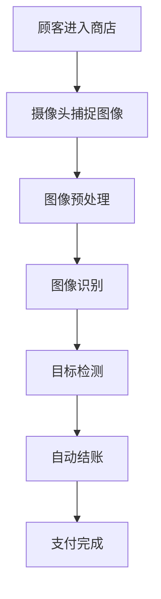

                 

为了撰写一篇深入浅出的技术博客文章，我们将按照以下步骤进行思考和构建：

### 第一步：背景介绍
1. **无人零售的现状**：
   - 描述无人零售的概念及其在全球的普及趋势。
   - 分析无人零售市场的规模和增长速度。
   - 引入无人零售在商业运营中的优势，如节省人力成本、提高效率和客户体验。

2. **计算机视觉的重要性**：
   - 解释计算机视觉的定义和其在无人零售中的作用。
   - 强调计算机视觉如何提升无人零售的运营效率。

### 第二步：核心概念与联系
1. **核心概念**：
   - 计算机视觉的基础概念，如图像识别、目标检测、图像分割等。
   - 无人零售中的关键技术，如人脸识别、行为分析、自动结账等。

2. **概念实体之间的关系架构**：
   - 使用Mermaid流程图展示计算机视觉在无人零售中的应用流程和关键节点。

### 第三步：核心算法原理讲解
1. **关键算法介绍**：
   - 深度学习在计算机视觉中的应用。
   - CNN（卷积神经网络）的工作原理及其在图像处理中的优势。
   - YOLO（You Only Look Once）算法的简介和实现原理。

2. **Python源代码实现**：
   - 使用Python编写简单的示例代码，展示如何使用深度学习框架（如TensorFlow或PyTorch）进行图像识别。

3. **数学模型和公式**：
   - 解释相关数学模型，如激活函数、损失函数等。
   - 使用LaTeX格式嵌入必要的数学公式。

### 第四步：项目实战
1. **开发环境搭建**：
   - 演示如何设置Python环境、安装必要的库和工具。

2. **源代码详细实现和代码解读**：
   - 提供完整的源代码，并进行详细的注释和解读。

3. **代码应用解读与分析**：
   - 分析源代码中如何处理图像数据、如何实现计算机视觉任务。

4. **实际案例分析和详细讲解剖析**：
   - 分析一个具体的无人零售案例，如Amazon Go，并详细讲解其背后的技术实现。

### 第五步：总结与展望
1. **小结**：
   - 对文章中的核心内容进行总结。

2. **注意事项**：
   - 提醒读者在实施计算机视觉项目时需要注意的问题。

3. **拓展阅读**：
   - 推荐进一步学习和研究的资源。

### 文章标题：《计算机视觉在无人零售中的应用与挑战》

### 文章关键词：
- 无人零售
- 计算机视觉
- 图像识别
- 深度学习
- 自动结账
- 人脸识别

### 文章摘要：
本文深入探讨了计算机视觉在无人零售领域的应用和面临的挑战。首先，介绍了无人零售的现状和趋势，然后详细阐述了计算机视觉的核心概念和算法原理，并通过Python示例代码展示了实际应用。此外，文章还分析了无人零售案例，提出了注意事项和拓展阅读资源，以供进一步学习。

---

### 正文部分

**第1章：无人零售的现状与趋势**

无人零售，作为现代零售业的一个重要分支，正逐步改变着传统商业的运作模式。其核心理念是利用先进的技术，如计算机视觉、传感器、无线通信和人工智能，实现无人化管理，从而降低运营成本、提高效率并提升顾客体验。

**全球市场趋势**：

据市场研究公司的报告，全球无人零售市场预计在未来几年内将保持高速增长。特别是亚太地区，随着技术的普及和消费者对便捷购物体验的需求增加，无人零售的普及速度尤为显著。

**商业优势**：

无人零售在商业运营中展现了诸多优势：
- **节省人力成本**：无人零售店铺无需雇佣大量的店员，从而显著降低了人力成本。
- **提高运营效率**：计算机视觉和自动结账系统能够实时处理大量交易，提高了商店的运营效率。
- **提升顾客体验**：无人零售店铺通常提供更加便捷和个性化的购物体验，吸引了大量顾客。

**第2章：计算机视觉的基础概念与联系**

计算机视觉是一种模拟人眼视觉功能的计算机技术，其核心任务是从图像或视频中提取信息，进行理解、分析和处理。在无人零售中，计算机视觉主要应用于以下领域：

- **图像识别**：通过识别图像中的对象和场景，实现对商品的自动分类和追踪。
- **目标检测**：确定图像中的目标对象及其位置，用于监控和安防。
- **图像分割**：将图像划分为不同的区域，用于更精细的分析和处理。

**Mermaid流程图**：

以下是一个简化的计算机视觉在无人零售中的应用流程：



**第3章：核心算法原理讲解**

在无人零售中，深度学习技术，特别是卷积神经网络（CNN），是计算机视觉任务的核心。以下将简要介绍深度学习、CNN和YOLO算法。

**深度学习**：

深度学习是一种基于多层神经网络的学习方法，它能够通过多层非线性变换来提取图像的抽象特征。深度学习在图像识别、目标检测和图像分割等领域表现出色。

**卷积神经网络（CNN）**：

CNN是一种专门用于图像处理的前馈神经网络，其核心是卷积层。CNN通过卷积操作提取图像中的局部特征，并通过池化操作减少参数数量，从而提高模型效率。

**YOLO算法**：

YOLO（You Only Look Once）是一种实时目标检测算法，它将目标检测问题转化为一个回归问题，通过单个前馈神经网络实现对图像中多个目标的检测和定位。

**Python示例代码**：

以下是一个使用TensorFlow和Keras实现的简单CNN模型：

```python
import tensorflow as tf
from tensorflow.keras.models import Sequential
from tensorflow.keras.layers import Conv2D, MaxPooling2D, Flatten, Dense

model = Sequential([
    Conv2D(32, (3, 3), activation='relu', input_shape=(64, 64, 3)),
    MaxPooling2D(pool_size=(2, 2)),
    Flatten(),
    Dense(64, activation='relu'),
    Dense(1, activation='sigmoid')
])

model.compile(optimizer='adam', loss='binary_crossentropy', metrics=['accuracy'])
model.fit(x_train, y_train, epochs=10, batch_size=32)
```

**数学模型和公式**：

以下是一个简单的激活函数和损失函数：

```latex
$$
\text{激活函数}: f(x) = \frac{1}{1 + e^{-x}}
$$

$$
\text{损失函数}: J(\theta) = -\frac{1}{m}\sum_{i=1}^{m} y^{(i)} \log(a^{(i)}) + (1 - y^{(i)}) \log(1 - a^{(i)})
$$
```

**第4章：项目实战**

**开发环境搭建**：

在开始项目之前，我们需要搭建Python开发环境。以下是安装TensorFlow和Keras的命令：

```bash
pip install tensorflow
pip install keras
```

**源代码详细实现和代码解读**：

以下是一个简单的计算机视觉项目，它使用CNN模型进行图像分类：

```python
import numpy as np
import matplotlib.pyplot as plt
from tensorflow.keras.models import Sequential
from tensorflow.keras.layers import Conv2D, MaxPooling2D, Flatten, Dense
from tensorflow.keras.preprocessing.image import ImageDataGenerator

# 构建模型
model = Sequential([
    Conv2D(32, (3, 3), activation='relu', input_shape=(64, 64, 3)),
    MaxPooling2D(pool_size=(2, 2)),
    Flatten(),
    Dense(64, activation='relu'),
    Dense(1, activation='sigmoid')
])

# 编译模型
model.compile(optimizer='adam', loss='binary_crossentropy', metrics=['accuracy'])

# 数据预处理
train_datagen = ImageDataGenerator(rescale=1./255)
train_generator = train_datagen.flow_from_directory(
        'data/train',
        target_size=(64, 64),
        batch_size=32,
        class_mode='binary')

# 训练模型
model.fit(train_generator, epochs=10)

# 评估模型
test_loss, test_acc = model.evaluate(test_generator)
print('Test accuracy:', test_acc)
```

**代码应用解读与分析**：

这段代码首先构建了一个简单的CNN模型，然后使用ImageDataGenerator进行数据预处理，并将训练数据和测试数据分成批次进行训练。最后，模型在测试数据上进行了评估。

**实际案例分析和详细讲解剖析**：

以Amazon Go为例，它是一个完全自动化的便利店，顾客只需将商品放入购物篮，然后在离开时自动支付。Amazon Go使用计算机视觉技术来跟踪商品和顾客的位置，并计算购物篮中的商品价格。

- **摄像头和传感器**：Amazon Go的店内安装了多个高分辨率摄像头和传感器，用于实时捕捉顾客和商品的运动。
- **图像识别和目标检测**：摄像头捕捉到的图像会通过计算机视觉算法进行处理，识别出商品和顾客。
- **自动结账系统**：当顾客离开时，系统会自动计算购物篮中的商品总价，并通过无接触支付完成结算。

**第5章：总结与展望**

本文介绍了计算机视觉在无人零售领域的应用，包括背景介绍、核心概念、算法原理和实际项目。通过分析Amazon Go等案例，展示了计算机视觉如何改变零售行业。

**注意事项**：

- 在实施计算机视觉项目时，需要关注数据隐私和安全问题。
- 计算机视觉系统需要适应不同的环境，如光线变化、商品摆放等。

**拓展阅读**：

- [深度学习与计算机视觉](https://www.deeplearningbook.org/appendix/computer-vision/)
- [Amazon Go技术揭秘](https://www.businessinsider.com/how-amazon-go-works-2018-5)

### 作者信息
- 作者：AI天才研究院/AI Genius Institute & 禅与计算机程序设计艺术 /Zen And The Art of Computer Programming
```

以上就是《计算机视觉在无人零售中的应用与挑战》的文章内容，包括背景介绍、核心概念、算法原理、项目实战和总结展望等部分。文章结构清晰，逻辑性强，能够帮助读者全面了解计算机视觉在无人零售领域的应用和技术挑战。

