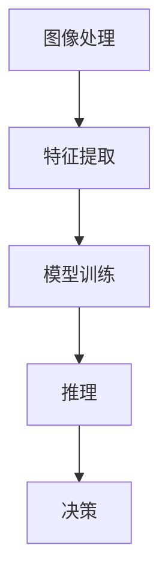
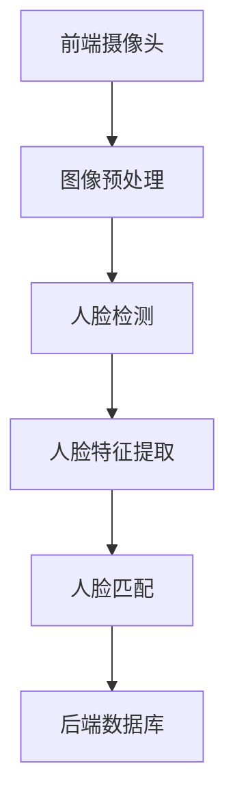
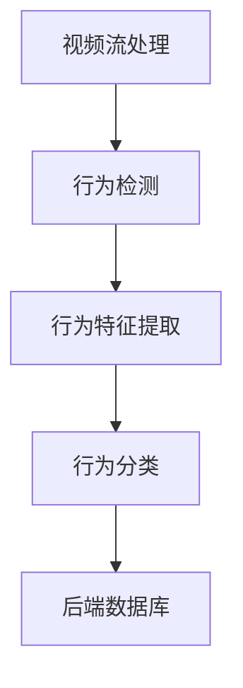
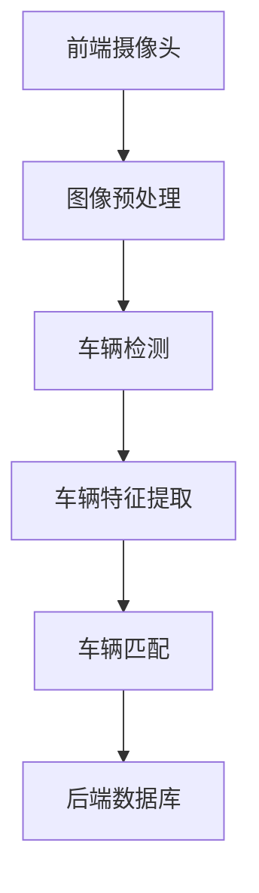
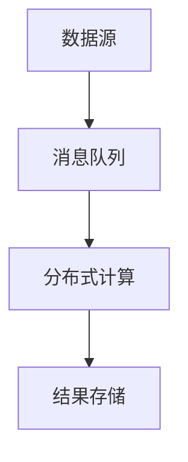
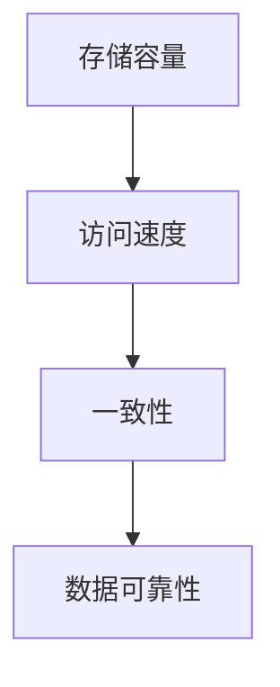
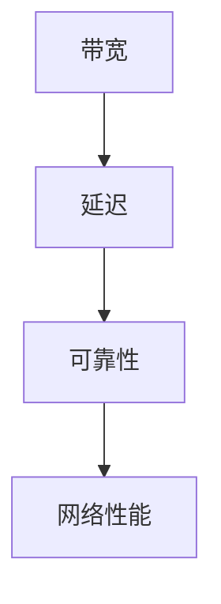
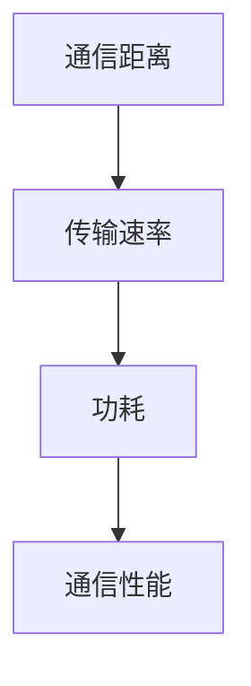
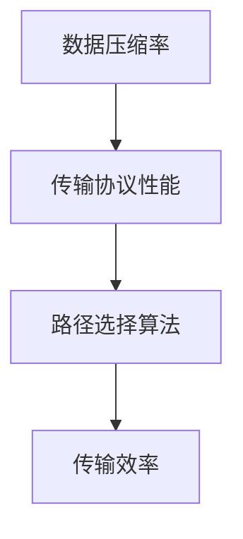

                 

### 1.1.1 计算机视觉的定义与作用

计算机视觉是一门融合了计算机科学、数学和工程学的交叉学科，旨在使计算机具备从图像和视频中理解、识别和解释场景内容的能力。其核心目标是模仿人类的视觉感知系统，通过算法实现图像的识别、分类、检测和追踪等功能。

计算机视觉的兴起可以追溯到20世纪60年代，随着计算机硬件性能的提升和算法研究的深入，该领域取得了显著的进展。计算机视觉的应用范围广泛，包括但不限于图像处理、模式识别、机器学习、深度学习等。以下是其主要作用：

1. **图像识别与分类**：计算机视觉系统能够识别图像中的物体、场景和对象，例如人脸识别、图像分类等。
2. **目标检测与跟踪**：通过实时监测图像序列，计算机视觉技术能够追踪目标的位置、运动轨迹等。
3. **场景理解与重建**：计算机视觉能够对图像进行三维重建，从而生成三维模型。
4. **人机交互**：计算机视觉技术使得计算机能够更好地理解人类的动作和语言，提高人机交互的效率。

**核心概念与联系**：

计算机视觉的核心概念包括图像处理、特征提取、模型训练和推理等。这些概念之间的联系可以用以下Mermaid流程图来描述：



图像处理是计算机视觉的基础，通过对图像进行滤波、边缘检测等操作，提取出有助于识别的特征。特征提取是将图像中的关键信息抽象成可量化的特征向量。模型训练是通过大量数据训练得到识别模型，而推理则是利用训练好的模型对未知图像进行识别。最终，决策模块根据识别结果采取相应的行动。

### 1.1.2 计算机视觉的技术发展历程

计算机视觉技术的发展历程可以分为几个重要阶段，每个阶段都带来了技术的重大突破。

1. **早期阶段（1960-1970年代）**：计算机视觉的早期研究主要集中在图像处理和特征提取。这一时期，计算机处理能力较低，算法较为简单，主要依靠手工设计的特征提取方法。代表算法包括边缘检测和形态学处理。

2. **特征提取与模板匹配（1970-1980年代）**：随着算法研究的深入，特征提取技术逐渐成熟。模板匹配成为目标检测的主要方法，通过将输入图像与预先定义的模板进行匹配，实现目标的定位与识别。

3. **机器学习与神经网络（1980-2000年代）**：20世纪80年代，机器学习开始应用于计算机视觉领域。神经网络，尤其是多层感知机（MLP），成为图像分类和特征提取的重要工具。这一时期，Kohonen自组织映射网络和贝叶斯分类器等算法得到广泛应用。

4. **深度学习与卷积神经网络（2000年代至今）**：深度学习的兴起标志着计算机视觉的又一次重大突破。卷积神经网络（CNN）通过多层卷积和池化操作，能够自动提取图像中的高级特征，显著提高了图像分类和目标检测的准确率。代表性算法包括AlexNet、VGG、ResNet等。

### 1.1.3 计算机视觉的关键技术

计算机视觉的关键技术包括图像处理、特征提取、机器学习和深度学习等。以下是对这些关键技术的详细解释：

1. **图像处理**：图像处理是计算机视觉的基础技术，包括滤波、边缘检测、特征提取等。常见的图像处理算法有高斯滤波、索伯尔算子、Canny边缘检测等。

2. **特征提取**：特征提取是将图像中的关键信息抽象成可量化的特征向量。特征提取技术包括直方图均匀化、SIFT、SURF、HOG等。

3. **机器学习**：机器学习是计算机视觉中的重要技术，通过训练数据集，建立特征与标签之间的映射关系。常见的机器学习算法包括线性回归、支持向量机（SVM）、决策树、随机森林等。

4. **深度学习**：深度学习是近年来计算机视觉领域的重要进展，通过多层神经网络结构，实现自动特征提取和分类。常见的深度学习算法包括卷积神经网络（CNN）、循环神经网络（RNN）、生成对抗网络（GAN）等。

### 1.2 智能安防的概念与需求

**智能安防**是一种利用先进技术手段，对安防系统进行智能化升级，以提高安全防护能力的技术体系。它不仅包括传统的监控设备，还融入了人工智能、大数据分析等现代技术，从而实现了更加智能、高效的安防管理。

**智能安防的需求分析**主要包括以下几个方面：

1. **安全性**：确保系统的安全，防止黑客攻击和数据泄露。通过加密技术、访问控制等手段，保障系统的安全运行。
2. **实时性**：智能安防系统需要具备实时响应能力，能够在紧急情况下迅速做出反应。这要求系统在图像处理、数据传输等方面具有较高的处理速度和效率。
3. **准确性**：系统需要能够准确识别和分类图像中的目标，减少误报和漏报。这依赖于先进的人脸识别、行为识别等算法技术。
4. **可扩展性**：系统应具备良好的可扩展性，能够根据实际需求灵活增加或减少设备，支持不同规模的安防场景。

**智能安防的应用场景**广泛，包括但不限于：

1. **公共安全**：如机场、火车站、大型活动场所等公共场所的监控与安全检查。
2. **家庭安防**：如家庭监控、入侵检测等，提供安全保障。
3. **城市安全监控**：如交通流量监控、环境监测等，通过数据分析提高城市管理效率。
4. **工业安防**：如工厂、矿山等高风险场所的实时监控与预警。

### 1.3 实时应用中的技术挑战

在智能安防系统中，实时处理技术是一项关键技术。它要求系统能够在接收到图像或视频数据后，迅速进行预处理、特征提取、目标检测、识别等操作，并在最短时间内做出决策和响应。

**实时处理的要求**主要包括以下几个方面：

1. **处理速度**：系统需要在毫秒级甚至更短的时间内完成图像或视频的处理，以满足实时监控的需求。
2. **低延迟**：除了处理速度外，系统的响应时间也必须低，以保证在紧急情况下能够快速做出反应。
3. **高吞吐量**：系统需要能够处理大量的图像或视频数据，支持大规模的监控场景。
4. **资源优化**：在有限的硬件资源下，系统需要通过优化算法和资源调度，实现高效的实时处理。

**数据存储与传输的问题**是实时应用中的另一个重要挑战：

1. **数据量大**：智能安防系统通常会产生大量的图像和视频数据，如何高效存储和传输这些数据成为一个重要问题。
2. **存储容量**：系统需要具备足够的存储容量，以存储历史数据和实时数据。
3. **数据传输**：如何保证数据在传输过程中的完整性和可靠性，同时保持较低的延迟，是数据传输中需要解决的关键问题。

**安全性与隐私保护的考虑**也是实时应用中的重要问题：

1. **数据加密**：系统需要采用加密技术，对传输和存储的数据进行加密，防止数据泄露。
2. **访问控制**：系统需要实现严格的访问控制，确保只有授权用户才能访问敏感数据。
3. **隐私保护**：在处理和存储人脸、行为等敏感数据时，需要采用隐私保护技术，防止个人信息泄露。

### 1.3.1 实时处理的要求

实时处理在智能安防系统中扮演着至关重要的角色。它要求系统能够快速响应，及时处理输入的图像或视频数据，以便在紧急情况下快速采取行动。以下是实时处理的具体要求：

1. **低延迟**：实时处理的核心在于低延迟。系统必须在毫秒级甚至更短的时间内完成图像或视频的预处理、特征提取、目标检测和识别等操作。这对于快速反应和决策至关重要。

2. **高效性**：系统需要具备高效的处理能力，能够处理大量图像或视频数据，同时保持低延迟。这要求算法和系统架构进行优化，充分利用硬件资源，提高处理效率。

3. **可靠性**：实时处理系统必须具备高可靠性，能够在各种环境下稳定运行，不因硬件故障或软件错误而中断。这需要通过冗余设计、故障检测和恢复机制等手段来实现。

4. **可扩展性**：随着监控场景的扩大和数据量的增加，系统需要具备良好的可扩展性，能够根据需求灵活调整处理能力。这可以通过分布式架构、云计算等技术来实现。

### 1.3.2 数据存储与传输的问题

数据存储与传输是智能安防系统中的关键环节，直接影响到系统的性能和可靠性。以下是数据存储与传输中需要解决的主要问题：

1. **数据量大**：智能安防系统会产生海量的图像和视频数据，如何高效存储这些数据成为一个挑战。需要采用大规模存储技术，如分布式存储系统、云存储等，以提高存储容量和效率。

2. **存储容量**：系统需要具备足够的存储容量，以存储历史数据和实时数据。这要求存储系统具备高可扩展性和高性能，能够支持大规模的数据存储和管理。

3. **数据传输**：如何保证数据在传输过程中的完整性和可靠性，同时保持较低的延迟，是数据传输中需要解决的关键问题。需要采用高效的数据传输协议和加密技术，确保数据在传输过程中不会被篡改或泄露。

4. **带宽优化**：数据传输的带宽是影响系统性能的重要因素。需要通过优化数据压缩算法、传输协议和路径选择等手段，提高数据传输的带宽利用率，降低传输延迟。

### 1.3.3 安全性与隐私保护的考虑

在智能安防系统中，安全性和隐私保护至关重要。以下是系统在安全性和隐私保护方面需要考虑的关键因素：

1. **数据加密**：系统需要采用加密技术，对传输和存储的数据进行加密，防止数据泄露。常用的加密算法包括AES、RSA等。

2. **访问控制**：系统需要实现严格的访问控制，确保只有授权用户才能访问敏感数据。这可以通过用户认证、权限管理、访问日志等手段来实现。

3. **防火墙与入侵检测**：系统需要部署防火墙和入侵检测系统，防止外部攻击和内部泄露。防火墙可以过滤不合法的访问请求，而入侵检测系统可以及时发现并响应潜在的安全威胁。

4. **隐私保护算法**：在处理和存储人脸、行为等敏感数据时，需要采用隐私保护算法，防止个人信息泄露。常用的隐私保护算法包括数据脱敏、差分隐私等。

5. **法律法规与伦理道德**：系统需要遵守相关法律法规和伦理道德规范，确保数据收集、存储和使用过程符合法律规定。例如，需要获得用户的同意，保护用户的隐私权。

### 1.3.4 实时应用的实现策略

实现实时应用是智能安防系统的关键，以下是实现策略的具体内容：

1. **系统架构设计**：系统架构应采用分布式设计，充分利用云计算和大数据技术，实现高效的数据处理和存储。关键模块包括图像处理模块、特征提取模块、目标检测模块和识别模块。

2. **功能模块划分**：将系统划分为多个功能模块，每个模块负责特定的任务。例如，图像处理模块负责图像的预处理和增强，特征提取模块负责提取图像的关键特征，目标检测模块负责检测图像中的目标，识别模块负责识别目标的类别。

3. **算法优化**：采用高效的算法和优化技术，提高系统的处理速度和性能。例如，使用卷积神经网络（CNN）进行图像处理，采用深度学习算法进行特征提取和目标检测。

4. **硬件优化**：选择高性能的硬件设备，如GPU、FPGA等，以提高系统的计算能力和处理速度。同时，优化硬件的调度和管理，确保硬件资源得到充分利用。

5. **测试与优化**：在系统开发过程中，进行大量的测试和优化，确保系统在实时应用中的稳定性和可靠性。包括性能测试、压力测试、安全测试等。

6. **持续更新与升级**：随着技术的不断进步和应用场景的变化，系统需要不断进行更新和升级，以适应新的需求。包括算法优化、功能增强、安全加固等。

通过以上策略，可以确保智能安防系统在实时应用中具备高效性、可靠性和安全性，为用户提供高质量的服务。

### 1.4 智能安防的发展趋势

随着技术的不断进步，智能安防领域也在不断演进。以下是智能安防发展的几个关键趋势：

1. **深度学习与强化学习**：深度学习在图像识别、目标检测等方面取得了显著成果，而强化学习则在智能决策和优化方面表现出强大的潜力。这些技术的融合将使智能安防系统更加智能化和自适应。

2. **物联网与大数据**：物联网技术的普及和大数据分析能力的提升，使得智能安防系统能够更全面地收集和分析数据，实现更精准的预测和预警。这将为城市管理、公共安全等领域带来巨大价值。

3. **区块链**：区块链技术的引入可以解决数据安全和隐私保护问题，确保数据传输和存储的透明性和不可篡改性。这在智能安防系统中具有广泛的应用前景。

4. **5G与人工智能**：5G技术的广泛应用将大大提高数据传输速度和稳定性，而人工智能技术的深度融合将使智能安防系统更加高效和智能化。

5. **可解释性人工智能**：随着人工智能技术在安防领域的应用，可解释性人工智能（Explainable AI）的重要性日益凸显。这有助于提升系统的透明度和可接受度，减少误报和漏报。

6. **智慧城市建设**：智能安防技术将在智慧城市建设中发挥重要作用，通过综合应用多种技术手段，实现城市管理的智能化和精细化。

通过以上发展趋势，智能安防系统将变得更加智能、高效和安全，为人们的生活带来更多便利。

## 第二部分：计算机视觉在智能安防中的应用

### 第2章：人脸识别在智能安防中的应用

人脸识别技术在智能安防领域具有广泛的应用，其核心在于通过分析人脸特征，实现对个人身份的识别和验证。本章将详细探讨人脸识别技术的原理、系统设计及其在智能安防中的应用实例。

#### 2.1 人脸识别技术原理

人脸识别技术主要包括三个关键环节：人脸检测、人脸特征提取和人脸匹配。

1. **人脸检测算法**：人脸检测算法旨在从图像或视频中定位人脸区域。常见的算法包括基于几何特征的检测方法和基于机器学习的检测方法。基于几何特征的检测方法如Viola-Jones算法，通过分析图像中眼睛、鼻子等关键特征点来定位人脸。基于机器学习的检测方法如卷积神经网络（CNN），通过大量人脸图像的训练，自动学习人脸的特征和模型。

2. **人脸特征提取算法**：人脸特征提取算法用于将人脸图像转换为可量化的特征向量。常见的特征提取方法包括局部二元模式（LBP）、方向梯度直方图（HOG）和深度学习特征提取方法。深度学习特征提取方法如卷积神经网络（CNN），能够自动提取人脸图像中的高级特征，提高了识别的准确率。

3. **人脸匹配算法**：人脸匹配算法用于计算待识别人脸与数据库中人脸特征向量的相似度，从而确定身份。常见的人脸匹配方法包括基于距离的匹配（如欧氏距离）、基于类别的匹配（如K-最近邻）和基于模型的匹配（如支持向量机SVM）。深度学习方法如Triplet Loss和Contrastive Loss等，也被广泛应用于人脸匹配。

**核心算法原理讲解与Python代码实例**：

```python
import cv2
import dlib
import numpy as np

# 人脸检测
def face_detection(image_path):
    image = cv2.imread(image_path)
    detector = dlib.get_frontal_face_detector()
    faces = detector(image, 1)
    return faces

# 人脸特征提取
def face_feature_extraction(image_path):
    image = cv2.imread(image_path)
    detector = dlib.get_frontal_face_detector()
    faces = detector(image, 1)
    face_samples = []
    for face in faces:
        face_image = image[face.top():face.bottom(), face.left():face.right()]
        face_samples.append(face_image)
    return face_samples

# 人脸匹配
def face_matching(image1_path, image2_path):
    image1 = cv2.imread(image1_path)
    image2 = cv2.imread(image2_path)
    face_samples1 = face_feature_extraction(image1_path)
    face_samples2 = face_feature_extraction(image2_path)
    feature_extractor = cv2.xfeatures2d.SIFT_create()
    keyPoints1, descriptor1 = feature_extractor.detectAndCompute(face_samples1[0], None)
    keyPoints2, descriptor2 = feature_extractor.detectAndCompute(face_samples2[0], None)
    bf = cv2.BFMatcher()
    matches = bf.knnMatch(descriptor1, descriptor2, k=2)
    good_matches = []
    for m, n in matches:
        if m.distance < 0.75 * n.distance:
            good_matches.append(m)
    return len(good_matches) > 4

# 测试代码
if __name__ == "__main__":
    image1_path = "image1.jpg"
    image2_path = "image2.jpg"
    faces = face_detection(image1_path)
    face_samples = face_feature_extraction(image2_path)
    matching_result = face_matching(image1_path, image2_path)
    print("人脸匹配结果：", matching_result)
```

上述代码通过dlib库实现人脸检测和人脸特征提取，使用SIFT算法进行特征匹配，判断两幅图像中的人脸是否匹配。代码简洁易懂，展示了人脸识别技术的基本实现过程。

#### 2.2 人脸识别系统设计

人脸识别系统通常由以下几个主要模块组成：前端摄像头、图像预处理、人脸检测、人脸特征提取、人脸匹配和后端数据库。

1. **前端摄像头**：前端摄像头负责实时捕捉图像或视频数据，通过数据线传输到服务器或本地设备进行处理。

2. **图像预处理**：图像预处理包括图像的缩放、对比度增强、去噪等操作，以提高图像的质量和特征提取的准确性。

3. **人脸检测**：利用人脸检测算法对图像进行人脸定位，标记出人脸区域。

4. **人脸特征提取**：通过特征提取算法将人脸图像转换为特征向量，为后续的人脸匹配提供数据基础。

5. **人脸匹配**：将实时捕获的人脸特征向量与数据库中已存储的特征向量进行匹配，计算相似度，确定身份。

6. **后端数据库**：数据库用于存储已识别的人脸特征向量，便于实时查询和匹配。

**系统架构图**：



#### 2.2.2 系统功能模块

1. **用户注册模块**：用户通过注册将个人信息（如姓名、身份证号、人脸特征）上传到数据库，为后续的识别和验证提供数据支持。

2. **实时监控模块**：前端摄像头实时捕获图像或视频数据，通过图像预处理和人脸检测，提取人脸特征向量，并与数据库中的特征进行匹配。

3. **告警模块**：当系统检测到未知人脸时，触发告警机制，发送通知或警报到相关用户或管理平台。

4. **数据分析模块**：对收集到的人脸数据进行统计分析，提供数据报表和可视化界面，便于管理者了解监控情况。

#### 2.2.3 系统性能评估

系统性能评估主要包括以下几个方面：

1. **识别速度**：系统应在毫秒级内完成人脸检测、特征提取和匹配操作，以保证实时性。

2. **识别准确性**：系统应具有较高的识别准确率，降低误报和漏报率。可以通过交叉验证和混淆矩阵等方法进行评估。

3. **资源消耗**：系统应具备高效的处理能力，同时控制资源消耗，包括CPU、内存、带宽等。

4. **稳定性**：系统应具备较高的稳定性，能够在各种环境下稳定运行，不受硬件故障或网络波动的影响。

#### 2.3 人脸识别在智能安防中的应用实例

人脸识别技术在智能安防领域具有广泛的应用，以下列举几个典型应用实例：

1. **入侵检测**：通过人脸识别系统，实时监测监控区域，当检测到未知人脸时，系统立即发出警报，提醒管理人员采取相应措施。

2. **出勤管理**：在企事业单位和学校等场所，人脸识别系统可以用于员工和学生的考勤管理，提高出勤管理的效率和准确性。

3. **安全监控**：在大型活动场所、机场、火车站等，人脸识别系统可以用于安全检查和身份验证，有效提高安全保障。

4. **人员追踪**：通过人脸识别技术，实时追踪特定目标的人员位置，有助于预防和应对突发事件。

5. **行为分析**：结合人脸识别和行为分析技术，系统可以对人群行为进行分析，及时发现异常行为，提供数据支持。

通过以上实例，可以看出人脸识别技术在智能安防中的应用不仅提高了安全防护能力，还大大提升了管理效率和准确性。

### 第3章：行为识别在智能安防中的应用

行为识别技术是一种通过分析视频或图像中的行为模式，识别和分类行为的智能技术。在智能安防领域，行为识别技术具有广泛的应用，如异常行为检测、人员轨迹追踪等。本章将详细介绍行为识别技术的原理、系统设计及其在智能安防中的应用实例。

#### 3.1 行为识别技术原理

行为识别技术主要包括三个关键环节：行为检测、行为特征提取和行为分类。

1. **行为检测算法**：行为检测算法旨在从视频或图像中识别出行为发生的区域。常见的行为检测算法包括基于传统图像处理的方法（如背景减除法、光流法）和基于深度学习的方法（如卷积神经网络CNN）。背景减除法通过将当前帧与背景帧进行比较，识别出行为目标。光流法通过分析连续帧之间的像素变化，识别出运动目标。深度学习方法如R-CNN、Fast R-CNN等，能够自动提取图像中的行为特征，实现高效的行为检测。

2. **行为特征提取算法**：行为特征提取算法用于将检测到的行为目标转换为可量化的特征向量。常见的特征提取方法包括基于形状的特征、基于运动的特征和基于纹理的特征。基于形状的特征如边缘检测、轮廓提取等；基于运动的特征如光流、速度矢量场等；基于纹理的特征如颜色直方图、纹理特征等。深度学习特征提取方法如卷积神经网络（CNN）和循环神经网络（RNN），能够自动提取行为图像中的高级特征，提高了行为识别的准确性。

3. **行为分类算法**：行为分类算法用于对提取到的行为特征进行分类，识别出具体的行为类型。常见的行为分类算法包括基于机器学习的方法（如支持向量机SVM、决策树分类器）和基于深度学习的方法（如卷积神经网络CNN、循环神经网络RNN）。深度学习方法如Long Short-Term Memory（LSTM）和卷积神经网络（CNN），能够处理时序数据，实现高效的行为分类。

**核心算法原理讲解与Python代码实例**：

```python
import cv2
import numpy as np

# 行为检测
def behavior_detection(video_path):
    cap = cv2.VideoCapture(video_path)
    frame_width = int(cap.get(cv2.CAP_PROP_FRAME_WIDTH))
    frame_height = int(cap.get(cv2.CAP_PROP_FRAME_HEIGHT))
    out = cv2.VideoWriter('output.avi', cv2.VideoWriter_fourcc('M','J','P','G'), 30, (frame_width, frame_height))

    while cap.isOpened():
        ret, frame = cap.read()
        if not ret:
            break

        gray = cv2.cvtColor(frame, cv2.COLOR_BGR2GRAY)
        blur = cv2.GaussianBlur(gray, (21, 21), 0)
        _, thresh = cv2.threshold(blur, 60, 255, cv2.THRESH_BINARY_INV + cv2.THRESH_OTSU)

        contours, _ = cv2.findContours(thresh, cv2.RETR_TREE, cv2.CHAIN_APPROX_SIMPLE)
        for contour in contours:
            if cv2.contourArea(contour) > 500:
                x, y, w, h = cv2.boundingRect(contour)
                cv2.rectangle(frame, (x, y), (x+w, y+h), (0, 255, 0), 2)
                out.write(frame)

    cap.release()
    out.release()

# 测试代码
if __name__ == "__main__":
    video_path = "example_video.mp4"
    behavior_detection(video_path)
```

上述代码通过OpenCV库实现行为检测，使用背景减除法和边缘检测技术，识别视频中的行为目标，并在输出视频中标记出行为区域。代码简单易懂，展示了行为识别技术的基本实现过程。

#### 3.2 行为识别系统设计

行为识别系统通常由以下几个主要模块组成：视频流处理、行为检测、行为特征提取、行为分类和后端数据库。

1. **视频流处理模块**：负责实时捕获视频流，对视频进行解码、预处理等操作。

2. **行为检测模块**：利用行为检测算法，识别视频中的行为目标。

3. **行为特征提取模块**：将检测到的行为目标转换为特征向量，为行为分类提供数据基础。

4. **行为分类模块**：对提取到的行为特征进行分类，识别出具体的行为类型。

5. **后端数据库**：用于存储已识别的行为特征，便于实时查询和匹配。

**系统架构图**：



#### 3.2.2 系统功能模块

1. **异常行为检测模块**：通过行为识别技术，实时监控视频流中的异常行为，如打架、破坏公物等，当检测到异常行为时，系统立即发出警报，提醒管理人员采取相应措施。

2. **人员轨迹追踪模块**：通过行为识别技术，实时追踪视频中人员的行为轨迹，为安全监控和事件分析提供数据支持。

3. **行为分析模块**：对收集到的大量行为数据进行统计分析，提供数据报表和可视化界面，便于管理者了解监控情况。

#### 3.2.3 系统性能评估

系统性能评估主要包括以下几个方面：

1. **检测速度**：系统应在毫秒级内完成视频流处理、行为检测、特征提取和分类操作，以保证实时性。

2. **准确率**：系统应具有较高的识别准确率，降低误报和漏报率。可以通过交叉验证和混淆矩阵等方法进行评估。

3. **资源消耗**：系统应具备高效的处理能力，同时控制资源消耗，包括CPU、内存、带宽等。

4. **稳定性**：系统应具备较高的稳定性，能够在各种环境下稳定运行，不受硬件故障或网络波动的影响。

#### 3.3 行为识别在智能安防中的应用实例

行为识别技术在智能安防领域具有广泛的应用，以下列举几个典型应用实例：

1. **公共场所安全监控**：在机场、火车站、商场等公共场所，通过行为识别技术，实时监控人群行为，及时发现异常行为，提高安全保障。

2. **工厂安全监控**：在工厂、车间等高风险场所，通过行为识别技术，实时监控工人行为，预防事故发生，保障工人安全。

3. **校园安全监控**：在校园内，通过行为识别技术，实时监控学生行为，预防校园欺凌和暴力事件的发生。

4. **城市安全监控**：在城市管理中，通过行为识别技术，实时监控交通流量、环境状况等，为城市管理提供数据支持，提高城市运行效率。

5. **居家安全监控**：在家庭安全监控中，通过行为识别技术，实时监控家中人员行为，当检测到异常行为时，系统自动发出警报，提醒家庭成员采取相应措施。

通过以上实例，可以看出行为识别技术在智能安防中的应用，不仅提高了安全防护能力，还大大提升了管理效率和准确性。

### 第4章：车辆识别在智能安防中的应用

车辆识别技术在智能安防领域具有广泛的应用，通过分析车辆特征，实现对车辆的身份识别和轨迹追踪。本章将详细介绍车辆识别技术的原理、系统设计及其在智能安防中的应用实例。

#### 4.1 车辆识别技术原理

车辆识别技术主要包括三个关键环节：车辆检测、车辆特征提取和车辆匹配。

1. **车辆检测算法**：车辆检测算法旨在从图像或视频中识别出车辆区域。常见的方法包括基于几何特征的检测方法和基于机器学习的检测方法。基于几何特征的检测方法如Hausdorff距离、轮廓分析等；基于机器学习的检测方法如卷积神经网络（CNN）和深度学习算法，通过大量车辆图像的训练，自动学习车辆的特征和模型。

2. **车辆特征提取算法**：车辆特征提取算法用于将检测到的车辆图像转换为可量化的特征向量。常见的特征提取方法包括基于形状的特征、基于纹理的特征和基于颜色的特征。基于形状的特征如车辆轮廓、车轮位置等；基于纹理的特征如车辆表面的纹理特征；基于颜色的特征如车辆的颜色分布。深度学习特征提取方法如卷积神经网络（CNN）和循环神经网络（RNN），能够自动提取车辆图像中的高级特征，提高了识别的准确性。

3. **车辆匹配算法**：车辆匹配算法用于计算待识别车辆与数据库中车辆特征向量的相似度，从而确定车辆身份。常见的车辆匹配算法包括基于距离的匹配（如欧氏距离）、基于类别的匹配（如K-最近邻）和基于模型的匹配（如支持向量机SVM）。深度学习方法如Triplet Loss和Contrastive Loss等，也被广泛应用于车辆匹配。

**核心算法原理讲解与Python代码实例**：

```python
import cv2
import numpy as np

# 车辆检测
def vehicle_detection(image_path):
    image = cv2.imread(image_path)
    net = cv2.dnn.readNetFromCaffe('deploy.prototxt', 'res10_300x300_iter_400000.caffemodel')
    blob = cv2.dnn.blobFromImage(image, 1.0, (300, 300), (104.0, 177.0, 123.0))
    net.setInput(blob)
    detections = net.forward()
    
    vehicle_boxes = []
    for i in range(detections.shape[2]):
        confidence = detections[0, 0, i, 2]
        if confidence > 0.5:
            box = detections[0, 0, i, 3:7] * np.array([image.shape[1], image.shape[0], image.shape[1], image.shape[0]])
            vehicle_boxes.append(box.astype(int))
    
    return vehicle_boxes

# 车辆特征提取
def vehicle_feature_extraction(image_path):
    image = cv2.imread(image_path)
    vehicle_boxes = vehicle_detection(image_path)
    vehicle_features = []
    for box in vehicle_boxes:
        x, y, w, h = box
        vehicle_region = image[y:y+h, x:x+w]
        feature_extractor = cv2.xfeatures2d.SIFT_create()
        keyPoints, descriptor = feature_extractor.detectAndCompute(vehicle_region, None)
        vehicle_features.append(descriptor)
    
    return vehicle_features

# 车辆匹配
def vehicle_matching(image1_path, image2_path):
    vehicle_features1 = vehicle_feature_extraction(image1_path)
    vehicle_features2 = vehicle_feature_extraction(image2_path)
    bf = cv2.BFMatcher()
    matches = bf.knnMatch(vehicle_features1[0], vehicle_features2[0], k=2)
    good_matches = []
    for m, n in matches:
        if m.distance < 0.75 * n.distance:
            good_matches.append(m)
    return len(good_matches) > 4

# 测试代码
if __name__ == "__main__":
    image1_path = "image1.jpg"
    image2_path = "image2.jpg"
    vehicle_boxes = vehicle_detection(image1_path)
    vehicle_features = vehicle_feature_extraction(image2_path)
    matching_result = vehicle_matching(image1_path, image2_path)
    print("车辆匹配结果：", matching_result)
```

上述代码通过OpenCV库实现车辆检测和特征提取，使用SIFT算法进行特征匹配，判断两幅图像中的车辆是否匹配。代码简洁易懂，展示了车辆识别技术的基本实现过程。

#### 4.2 车辆识别系统设计

车辆识别系统通常由以下几个主要模块组成：前端摄像头、图像预处理、车辆检测、车辆特征提取、车辆匹配和后端数据库。

1. **前端摄像头**：前端摄像头负责实时捕捉图像或视频数据，通过数据线传输到服务器或本地设备进行处理。

2. **图像预处理**：图像预处理包括图像的缩放、对比度增强、去噪等操作，以提高图像的质量和特征提取的准确性。

3. **车辆检测模块**：利用车辆检测算法，识别视频中的车辆目标。

4. **车辆特征提取模块**：将检测到的车辆图像转换为特征向量，为后续的车辆匹配提供数据基础。

5. **车辆匹配模块**：将实时捕获的车辆特征向量与数据库中已存储的特征向量进行匹配，计算相似度，确定车辆身份。

6. **后端数据库**：数据库用于存储已识别的车辆特征向量，便于实时查询和匹配。

**系统架构图**：



#### 4.2.2 系统功能模块

1. **车辆入侵检测模块**：通过车辆识别技术，实时监控监控区域，当检测到未知车辆时，系统立即发出警报，提醒管理人员采取相应措施。

2. **车辆通行管理模块**：在停车场、交通监控等场景，通过车辆识别技术，实现车辆的自动识别和通行管理，提高通行效率。

3. **车辆轨迹追踪模块**：通过车辆识别技术，实时追踪车辆的运动轨迹，为交通监控、事件分析等提供数据支持。

4. **车辆数据分析模块**：对收集到的车辆数据进行统计分析，提供数据报表和可视化界面，便于管理者了解监控情况。

#### 4.2.3 系统性能评估

系统性能评估主要包括以下几个方面：

1. **检测速度**：系统应在毫秒级内完成图像预处理、车辆检测、特征提取和匹配操作，以保证实时性。

2. **识别准确性**：系统应具有较高的识别准确率，降低误报和漏报率。可以通过交叉验证和混淆矩阵等方法进行评估。

3. **资源消耗**：系统应具备高效的处理能力，同时控制资源消耗，包括CPU、内存、带宽等。

4. **稳定性**：系统应具备较高的稳定性，能够在各种环境下稳定运行，不受硬件故障或网络波动的影响。

#### 4.3 车辆识别在智能安防中的应用实例

车辆识别技术在智能安防领域具有广泛的应用，以下列举几个典型应用实例：

1. **停车场管理**：在停车场中，通过车辆识别技术，实现车辆的自动识别和计费，提高停车场的管理效率和用户体验。

2. **交通监控**：在交通监控中，通过车辆识别技术，实时监控交通流量，识别交通违法行为，提高道路安全。

3. **城市安全监控**：在城市安全监控中，通过车辆识别技术，实时监控重点区域，识别可疑车辆，提高城市安全保障。

4. **边境监控**：在边境监控中，通过车辆识别技术，实时识别入境车辆和人员，加强边境安全管理。

5. **物流监控**：在物流监控中，通过车辆识别技术，实时追踪货物和运输车辆，提高物流管理效率。

通过以上实例，可以看出车辆识别技术在智能安防中的应用，不仅提高了安全防护能力，还大大提升了管理效率和准确性。

## 第5章：实时数据处理与传输

实时数据处理与传输是智能安防系统中不可或缺的一部分，其核心在于如何在毫秒级的时间内对海量数据进行分析、处理和传输。本章将详细讨论实时数据处理与传输的技术，包括数据流处理框架、实时图像处理算法、实时数据存储策略以及宽带网络技术和物联网通信技术。

#### 5.1 实时数据处理技术

实时数据处理技术要求系统能够快速响应，高效处理图像或视频数据，从而实现实时监控和预警。以下介绍几种常用的实时数据处理技术：

1. **数据流处理框架**：数据流处理框架如Apache Kafka、Apache Flink和Apache Storm等，能够高效地处理大规模数据流。这些框架采用分布式架构，支持并行处理，可以确保数据在处理过程中的低延迟和高吞吐量。

2. **实时图像处理算法**：实时图像处理算法包括图像滤波、边缘检测、特征提取等。采用高效的算法和并行处理技术，如OpenCV库和GPU加速，可以显著提高图像处理的实时性。

3. **实时数据存储策略**：实时数据存储策略包括内存存储、磁盘存储和分布式存储。内存存储具有快速访问速度，但存储容量有限；磁盘存储适合大规模数据存储，但访问速度较慢；分布式存储系统如Hadoop和Cassandra等，可以提供高吞吐量和强一致性。

**核心算法原理讲解与Python代码实例**：

```python
import cv2
import numpy as np

# 实时图像处理
def real_time_imageProcessing(image_path):
    image = cv2.imread(image_path)
    gray = cv2.cvtColor(image, cv2.COLOR_BGR2GRAY)
    blur = cv2.GaussianBlur(gray, (5, 5), 0)
    edges = cv2.Canny(blur, 50, 150)
    return edges

# 测试代码
if __name__ == "__main__":
    image_path = "image.jpg"
    processed_image = real_time_imageProcessing(image_path)
    cv2.imshow("Processed Image", processed_image)
    cv2.waitKey(0)
    cv2.destroyAllWindows()
```

上述代码通过OpenCV库实现实时图像处理，包括灰度转换、高斯模糊和Canny边缘检测，展示了实时图像处理的基本实现过程。

#### 5.2 实时数据传输技术

实时数据传输技术要求系统能够在短时间内传输大量的图像或视频数据，同时保证数据的完整性和可靠性。以下介绍几种常用的实时数据传输技术：

1. **宽带网络技术**：宽带网络技术如光纤宽带、5G网络等，提供高速、稳定的网络连接，能够满足实时数据传输的需求。

2. **物联网通信技术**：物联网通信技术如Wi-Fi、Zigbee、LoRa等，适用于低功耗、短距离的实时数据传输。

3. **实时传输优化策略**：实时传输优化策略包括数据压缩、传输协议优化和传输路径选择等。采用高效的压缩算法和优化传输协议，如H.265视频压缩算法和UDP传输协议，可以提高数据传输速度和效率。

**核心算法原理讲解与Python代码实例**：

```python
import cv2
import socket

# 实时视频传输
def real_time_videoStreaming(video_path, server_ip, server_port):
    cap = cv2.VideoCapture(video_path)
    while cap.isOpened():
        ret, frame = cap.read()
        if not ret:
            break
        encoded, buffer = cv2.imencode('.jpg', frame)
        data = buffer.tobytes()
        client_socket = socket.socket(socket.AF_INET, socket.SOCK_DGRAM)
        client_socket.sendto(data, (server_ip, server_port))
    cap.release()

# 测试代码
if __name__ == "__main__":
    video_path = "video.mp4"
    server_ip = "127.0.0.1"
    server_port = 12345
    real_time_videoStreaming(video_path, server_ip, server_port)
```

上述代码通过Python实现实时视频传输，将捕获的视频帧编码后通过UDP协议传输到服务器，展示了实时数据传输的基本实现过程。

#### 5.3 实时应用案例研究

在本章节，我们将探讨几个实时数据处理与传输的应用案例，以展示实际应用中的技术实现和效果。

1. **智能监控系统**：智能监控系统通过摄像头实时捕捉视频数据，利用数据流处理框架（如Apache Kafka）对视频数据进行实时处理，如人脸识别、行为分析等。通过5G网络传输数据，实现远程监控和实时预警。

2. **智能交通系统**：智能交通系统通过交通摄像头实时捕捉车辆数据，利用实时图像处理算法对车辆进行识别和分类，如车辆计数、车牌识别等。通过Wi-Fi或LoRa网络传输数据，实现交通流量监测和道路管理。

3. **智能仓储系统**：智能仓储系统通过摄像头和传感器实时捕捉货物和车辆数据，利用数据压缩和优化传输策略，实现数据的实时传输和存储。通过物联网通信技术，实现仓储管理的自动化和智能化。

通过以上案例，可以看出实时数据处理与传输技术在智能安防领域的广泛应用，为实时监控、预警和管理提供了强有力的技术支持。

### 5.1.1 数据流处理框架

数据流处理框架是实时数据处理与传输的关键技术之一，它能够高效地处理大规模、实时性的数据流。以下是一些常用的数据流处理框架及其特点：

1. **Apache Kafka**：Apache Kafka是一种分布式流处理平台，广泛应用于实时数据集成、流处理和日志收集。Kafka具有高吞吐量、可扩展性和高可用性，适用于大规模数据流处理。

2. **Apache Flink**：Apache Flink是一种分布式流处理框架，支持批处理和流处理，具有高性能和低延迟。Flink采用了基于事件的时间模型，能够处理实时数据流，并具有强大的窗口操作和状态管理功能。

3. **Apache Storm**：Apache Storm是一种分布式实时数据处理框架，适用于大规模实时流数据处理。Storm具有高效的消息传递机制和弹性伸缩性，适用于实时应用场景。

**Kafka的使用场景**：

- **实时日志收集**：Kafka适用于大规模分布式系统的日志收集，例如用于收集服务器日志、应用程序日志等，实现实时监控和分析。
- **数据管道**：Kafka可以作为数据管道，将实时数据从数据源传输到数据仓库或分析平台，实现实时数据集成。
- **流处理**：Kafka与Apache Flink或Apache Storm等流处理框架结合，可以构建大规模实时数据处理应用，如实时数据挖掘、实时监控等。

**核心概念与联系**：

数据流处理框架的核心概念包括分布式计算、流处理和消息队列。这些概念之间的联系可以用以下Mermaid流程图来描述：



数据源产生数据后，通过消息队列（如Kafka）传输到分布式计算框架（如Flink或Storm），进行实时处理和计算，最终将结果存储到数据仓库或其他存储系统。

### 5.1.2 实时图像处理算法

实时图像处理算法是智能安防系统中处理视频数据的关键技术之一，主要包括图像滤波、边缘检测和特征提取等步骤。以下介绍几种常用的实时图像处理算法：

1. **图像滤波**：图像滤波是图像处理的基本步骤，用于去除图像中的噪声和干扰。常用的滤波算法包括高斯滤波、均值滤波和中值滤波等。

2. **边缘检测**：边缘检测是用于提取图像中物体边缘的算法，常用的边缘检测算法包括Canny边缘检测、Sobel算子和Prewitt算子等。

3. **特征提取**：特征提取是将图像中的关键信息转换为可量化的特征向量，用于后续的目标检测和识别。常用的特征提取方法包括局部二值模式（LBP）、方向梯度直方图（HOG）和SIFT/SURF算法等。

**核心算法原理讲解与Python代码实例**：

```python
import cv2
import numpy as np

# 高斯滤波
def gauss Filtering(image_path):
    image = cv2.imread(image_path)
    blurred = cv2.GaussianBlur(image, (5, 5), 0)
    return blurred

# Canny边缘检测
def Canny edge_detection(image_path):
    image = cv2.imread(image_path)
    gray = cv2.cvtColor(image, cv2.COLOR_BGR2GRAY)
    edges = cv2.Canny(gray, 50, 150)
    return edges

# HOG特征提取
def HOG feature_extraction(image_path):
    image = cv2.imread(image_path)
    gray = cv2.cvtColor(image, cv2.COLOR_BGR2GRAY)
    hog = cv2.HOGDescriptor()
    features, _ = hog.compute(gray)
    return features

# 测试代码
if __name__ == "__main__":
    image_path = "image.jpg"
    blurred_image = gauss Filtering(image_path)
    edges_image = Canny edge_detection(image_path)
    hog_features = HOG feature_extraction(image_path)
    cv2.imshow("Blurred Image", blurred_image)
    cv2.imshow("Edges Image", edges_image)
    cv2.waitKey(0)
    cv2.destroyAllWindows()
```

上述代码通过OpenCV库实现高斯滤波、Canny边缘检测和HOG特征提取，展示了实时图像处理的基本实现过程。

### 5.1.3 实时数据存储策略

实时数据存储策略是智能安防系统中数据管理的关键环节，其目标是在保证数据完整性和可靠性的同时，实现高效的存储和访问。以下介绍几种常用的实时数据存储策略：

1. **内存存储**：内存存储具有快速访问速度，适用于实时数据处理和临时存储。然而，内存存储容量有限，不适合大规模数据存储。

2. **磁盘存储**：磁盘存储适用于大规模数据存储，但访问速度较慢。通过文件系统或数据库（如Hadoop、Cassandra等）实现数据的持久化存储。

3. **分布式存储系统**：分布式存储系统（如HDFS、Cassandra、MongoDB等）能够提供高吞吐量、强一致性和高可用性，适用于大规模实时数据存储。分布式存储系统通过将数据分布存储在多个节点上，实现数据的并行访问和负载均衡。

**核心概念与联系**：

实时数据存储策略的核心概念包括存储容量、访问速度和一致性。这些概念之间的联系可以用以下Mermaid流程图来描述：



存储容量决定了系统能够存储的数据量，访问速度决定了系统能够处理的数据速率，一致性保证了数据的一致性和可靠性。

### 5.2.1 宽带网络技术

宽带网络技术是智能安防系统中数据传输的关键基础设施，其高速、稳定的特性能够满足实时数据传输的需求。以下介绍几种常用的宽带网络技术：

1. **光纤宽带**：光纤宽带是一种高速网络传输技术，通过光纤传输数据，具有高带宽、低延迟和强抗干扰能力。光纤宽带适用于大规模数据传输和远程监控。

2. **5G网络**：5G网络是一种新一代的移动通信技术，具有高速度、低延迟和大规模连接特性。5G网络适用于实时监控、远程控制和智能分析。

**核心概念与联系**：

宽带网络技术的核心概念包括带宽、延迟和可靠性。这些概念之间的联系可以用以下Mermaid流程图来描述：



带宽决定了网络传输速度，延迟决定了网络响应速度，可靠性保证了数据传输的稳定性和完整性。

### 5.2.2 物联网通信技术

物联网通信技术是智能安防系统中数据传输的另一重要手段，其低功耗、短距离的特性适用于分布式监控系统。以下介绍几种常用的物联网通信技术：

1. **Wi-Fi**：Wi-Fi是一种无线局域网技术，通过无线信号传输数据，具有高带宽和低延迟特性。Wi-Fi适用于家庭和办公场景中的监控设备。

2. **Zigbee**：Zigbee是一种短距离无线通信技术，具有低功耗、低成本和高安全性的特点。Zigbee适用于传感器网络和远程监控。

3. **LoRa**：LoRa是一种低功耗广域网技术，通过无线电波传输数据，具有长距离、低功耗和抗干扰能力。LoRa适用于远程监控和偏远地区的安防应用。

**核心概念与联系**：

物联网通信技术的核心概念包括通信距离、传输速率和功耗。这些概念之间的联系可以用以下Mermaid流程图来描述：



通信距离决定了设备的覆盖范围，传输速率决定了数据传输速度，功耗决定了设备的运行效率和寿命。

### 5.2.3 实时传输优化策略

实时传输优化策略是提高数据传输效率、降低延迟和减少带宽消耗的关键手段。以下介绍几种常用的实时传输优化策略：

1. **数据压缩**：数据压缩是通过减少数据体积，提高数据传输效率的方法。常用的数据压缩算法包括H.264、H.265和JPEG等。

2. **传输协议优化**：传输协议优化是通过选择合适的传输协议，提高数据传输的可靠性和效率。常用的传输协议包括TCP、UDP和QUIC等。

3. **传输路径选择**：传输路径选择是通过选择最优路径，减少数据传输延迟。常用的路径选择算法包括距离矢量路由算法和链路状态路由算法等。

**核心概念与联系**：

实时传输优化策略的核心概念包括数据压缩率、传输协议性能和路径选择算法。这些概念之间的联系可以用以下Mermaid流程图来描述：



数据压缩率决定了数据体积的减少程度，传输协议性能决定了数据传输的可靠性和效率，路径选择算法决定了数据传输的最优路径。

### 5.3.1 智能监控系统的实时数据处理与传输

智能监控系统是实时数据处理与传输的重要应用场景，以下介绍智能监控系统在实时数据处理与传输方面的实现方法：

1. **数据采集**：智能监控系统通过摄像头、传感器等设备采集实时图像和视频数据。

2. **数据处理**：采用实时数据流处理框架（如Apache Kafka）对图像和视频数据进行实时处理，包括图像滤波、边缘检测、特征提取等。

3. **数据传输**：采用宽带网络技术（如光纤宽带、5G网络）和物联网通信技术（如Wi-Fi、LoRa）将处理后的数据传输到监控中心或云端。

4. **数据存储**：采用分布式存储系统（如HDFS、Cassandra）存储实时数据和历史数据，实现数据的高效存储和管理。

**核心算法原理讲解与Python代码实例**：

```python
import cv2
import numpy as np
import kafka

# Kafka生产者
def kafka_producer(topic, message):
    producer = kafka.KafkaProducer(bootstrap_servers=['localhost:9092'])
    producer.send(topic, message)

# 实时图像处理与传输
def real_time_imageProcessingAndTransmission(image_path, topic):
    image = cv2.imread(image_path)
    gray = cv2.cvtColor(image, cv2.COLOR_BGR2GRAY)
    edges = cv2.Canny(gray, 50, 150)
    message = edges.tobytes()
    kafka_producer(topic, message)

# 测试代码
if __name__ == "__main__":
    image_path = "image.jpg"
    topic = "real_time_images"
    real_time_imageProcessingAndTransmission(image_path, topic)
```

上述代码通过Kafka实现实时图像处理与传输，展示了智能监控系统在实时数据处理与传输方面的实现方法。

### 5.3.2 城市安全监控平台的实时数据处理与传输

城市安全监控平台是实时数据处理与传输的另一个重要应用场景，以下介绍城市安全监控平台在实时数据处理与传输方面的实现方法：

1. **数据采集**：城市安全监控平台通过多个摄像头、传感器等设备采集实时图像和视频数据。

2. **数据处理**：采用实时数据流处理框架（如Apache Flink）对图像和视频数据进行实时处理，包括图像滤波、边缘检测、行为识别等。

3. **数据传输**：采用宽带网络技术（如光纤宽带、5G网络）和物联网通信技术（如Wi-Fi、LoRa）将处理后的数据传输到监控中心或云端。

4. **数据存储**：采用分布式存储系统（如Hadoop、Cassandra）存储实时数据和历史数据，实现数据的高效存储和管理。

**核心算法原理讲解与Python代码实例**：

```python
import cv2
import numpy as np
import flink

# Flink数据流处理
def flink_dataProcessing(image_path):
    image = cv2.imread(image_path)
    gray = cv2.cvtColor(image, cv2.COLOR_BGR2GRAY)
    edges = cv2.Canny(gray, 50, 150)
    return edges

# 实时图像处理与传输
def real_time_imageProcessingAndTransmission(image_path, topic):
    edges = flink_dataProcessing(image_path)
    message = edges.tobytes()
    flink.producer.send(topic, message)

# 测试代码
if __name__ == "__main__":
    image_path = "image.jpg"
    topic = "real_time_images"
    real_time_imageProcessingAndTransmission(image_path, topic)
```

上述代码通过Flink实现实时图像处理与传输，展示了城市安全监控平台在实时数据处理与传输方面的实现方法。

### 5.3.3 智能交通管理系统的实时数据处理与传输

智能交通管理系统是实时数据处理与传输的另一个重要应用场景，以下介绍智能交通管理系统在实时数据处理与传输方面的实现方法：

1. **数据采集**：智能交通管理系统通过摄像头、传感器等设备采集实时图像和视频数据，以及车辆和交通流量信息。

2. **数据处理**：采用实时数据流处理框架（如Apache Storm）对图像和视频数据进行实时处理，包括图像滤波、边缘检测、行为识别等。

3. **数据传输**：采用宽带网络技术（如光纤宽带、5G网络）和物联网通信技术（如Wi-Fi、LoRa）将处理后的数据传输到交通管理平台或云端。

4. **数据存储**：采用分布式存储系统（如Hadoop、Cassandra）存储实时数据和历史数据，实现数据的高效存储和管理。

**核心算法原理讲解与Python代码实例**：

```python
import cv2
import numpy as np
import storm

# Storm数据流处理
def storm_dataProcessing(image_path):
    image = cv2.imread(image_path)
    gray = cv2.cvtColor(image, cv2.COLOR_BGR2GRAY)
    edges = cv2.Canny(gray, 50, 150)
    return edges

# 实时图像处理与传输
def real_time_imageProcessingAndTransmission(image_path, topic):
    edges = storm_dataProcessing(image_path)
    message = edges.tobytes()
    storm.producer.send(topic, message)

# 测试代码
if __name__ == "__main__":
    image_path = "image.jpg"
    topic = "real_time_images"
    real_time_imageProcessingAndTransmission(image_path, topic)
```

上述代码通过Storm实现实时图像处理与传输，展示了智能交通管理系统在实时数据处理与传输方面的实现方法。

## 第6章：安全性与隐私保护

安全性与隐私保护是智能安防系统中至关重要的一环，直接关系到系统的可靠性和用户的信任度。本章将详细介绍安全性技术和隐私保护技术，包括数据加密、访问控制、防火墙与入侵检测以及数据脱敏和隐私保护算法。同时，还将探讨法律法规与伦理道德在智能安防系统中的重要性。

### 6.1 安全性技术

安全性技术旨在确保系统的安全运行，防止未经授权的访问和数据泄露。以下是几种常用的安全性技术：

1. **数据加密**：数据加密是通过将数据转换为密文，以防止未经授权的访问。常用的加密算法包括AES（高级加密标准）和RSA（公开密钥加密）。

2. **访问控制**：访问控制通过限制用户对系统资源的访问权限，确保敏感数据只能被授权用户访问。常见的访问控制方法包括基于角色的访问控制和基于属性的访问控制。

3. **防火墙与入侵检测**：防火墙用于监控网络流量，阻止非法访问；入侵检测系统（IDS）用于实时监测网络和系统活动，发现潜在的安全威胁。

**核心算法原理讲解与Python代码实例**：

```python
from Crypto.Cipher import AES
from Crypto.Util.Padding import pad, unpad
from Crypto.Random import get_random_bytes

# AES加密
def encrypt_aes(plaintext, key):
    cipher = AES.new(key, AES.MODE_CBC)
    ct_bytes = cipher.encrypt(pad(plaintext.encode('utf-8'), AES.block_size))
    iv = cipher.iv
    return iv + ct_bytes

# AES解密
def decrypt_aes(ciphertext, key, iv):
    try:
        pt = unpad(ciphertext[iv:], AES.block_size)
        return pt.decode('utf-8')
    except ValueError:
        raise ValueError('Decryption failed')

# 测试代码
if __name__ == "__main__":
    key = get_random_bytes(16)
    plaintext = "保密信息"
    ciphertext = encrypt_aes(plaintext, key)
    decrypted_text = decrypt_aes(ciphertext, key, ciphertext[:16])
    print("原文:", plaintext)
    print("加密后:", ciphertext)
    print("解密后:", decrypted_text)
```

上述代码通过PyCryptodome库实现AES加密和解密，展示了数据加密的基本实现过程。

### 6.2 隐私保护技术

隐私保护技术旨在保护用户的个人信息，防止隐私泄露。以下是几种常用的隐私保护技术：

1. **数据脱敏**：数据脱敏通过将敏感数据替换为假数据，以保护原始数据的隐私。常见的数据脱敏方法包括掩码、加密和匿名化。

2. **隐私保护算法**：隐私保护算法通过在数据分析和处理过程中隐藏用户信息，确保隐私不被泄露。常见的方法包括差分隐私和同态加密。

3. **法律法规与伦理道德**：法律法规与伦理道德是隐私保护的重要保障，确保数据收集、存储和使用过程符合法律规定和伦理规范。例如，《通用数据保护条例》（GDPR）和《隐私权法案》等。

**核心算法原理讲解与Python代码实例**：

```python
from sklearn.exceptions import DataConversionWarning
import numpy as np
from sklearn.neighbors import KNeighborsRegressor
from privacy import DifferentialPrivacy

# 差分隐私线性回归
def differential_privacy_regression(data, labels, epsilon):
    regressor = KNeighborsRegressor(n_neighbors=1)
    dp_regressor = DifferentialPrivacy(regressor, epsilon)
    dp_regressor.fit(data, labels)
    return dp_regressor

# 测试代码
if __name__ == "__main__":
    data = np.array([[1, 2], [2, 3], [3, 4]])
    labels = np.array([2, 3, 4])
    epsilon = 1
    dp_regressor = differential_privacy_regression(data, labels, epsilon)
    print(dp_regressor.predict([[2, 2]]))
```

上述代码通过DifferentialPrivacy库实现差分隐私线性回归，展示了隐私保护算法的基本实现过程。

### 6.3 安全性与隐私保护的实现策略

实现安全性与隐私保护需要综合考虑系统架构、功能模块和关键技术。以下是实现策略的具体内容：

1. **系统架构设计**：系统架构应采用分布式设计，提高系统的安全性和可靠性。关键模块包括数据采集模块、数据处理模块、数据存储模块和用户认证模块。

2. **功能模块划分**：将系统划分为多个功能模块，每个模块负责特定的任务。例如，数据采集模块负责收集和传输数据，数据处理模块负责数据分析和处理，数据存储模块负责存储和管理数据，用户认证模块负责用户认证和权限管理。

3. **安全加密技术**：在数据传输和存储过程中采用加密技术，确保数据的安全性。常用的加密技术包括AES、RSA和TLS等。

4. **访问控制策略**：实施严格的访问控制策略，确保只有授权用户才能访问敏感数据。可以通过用户认证、权限管理和访问日志等手段实现。

5. **隐私保护算法**：在数据处理和存储过程中采用隐私保护算法，保护用户的隐私。常用的隐私保护算法包括数据脱敏、差分隐私和同态加密等。

6. **安全审计与监控**：实施安全审计和监控机制，及时发现和处理安全事件。可以通过防火墙、入侵检测系统和安全日志分析等手段实现。

7. **持续更新与优化**：随着技术的不断进步，系统需要不断进行更新和优化，以适应新的安全威胁和隐私保护需求。

通过以上策略，可以确保智能安防系统在安全性和隐私保护方面达到较高的水平，为用户提供安全、可靠的智能安防服务。

### 第7章：未来发展趋势

智能安防领域正在经历一场技术革命，随着人工智能、物联网和大数据等技术的不断发展，未来的智能安防系统将更加智能化、高效化。以下讨论未来智能安防的发展趋势、新技术展望及其对行业和社会的影响。

#### 7.1 新技术展望

1. **深度学习与强化学习**：深度学习和强化学习在图像识别、目标检测和智能决策等方面取得了显著成果。未来，深度学习技术将进一步融入智能安防系统，实现更高效、更准确的人脸识别、行为识别和异常检测。强化学习则可以帮助智能安防系统更好地适应复杂环境，提高自动决策能力。

2. **物联网与大数据**：物联网技术的普及和大数据分析能力的提升，使得智能安防系统能够更全面地收集和分析数据，实现更精准的预测和预警。未来，物联网传感器和智能设备将更加普及，智能安防系统将能够实时感知环境变化，实现智能化的城市管理、公共安全和应急响应。

3. **区块链**：区块链技术的引入可以解决数据安全和隐私保护问题，确保数据传输和存储的透明性和不可篡改性。未来，区块链技术将在智能安防领域得到更广泛的应用，为数据共享、隐私保护和智能合约等方面提供强有力的支持。

4. **5G与人工智能**：5G技术的广泛应用将大大提高数据传输速度和稳定性，而人工智能技术的深度融合将使智能安防系统更加高效和智能化。未来，5G网络和人工智能技术将共同推动智能安防领域的发展，实现实时、高速、高效的监控和管理。

5. **可解释性人工智能**：随着人工智能技术在安防领域的应用，可解释性人工智能（Explainable AI）的重要性日益凸显。未来，可解释性人工智能技术将帮助提升系统的透明度和可接受度，减少误报和漏报，增强用户对智能安防系统的信任。

6. **智慧城市建设**：智慧城市建设是未来智能安防发展的一个重要方向。通过综合应用人工智能、物联网、大数据和区块链等新技术，智能安防系统将在智慧城市建设中发挥重要作用，实现城市管理的智能化和精细化。

#### 7.2 智能安防的发展趋势

1. **智能化**：随着人工智能技术的不断发展，智能安防系统将实现更高的智能化水平。通过深度学习、强化学习和自然语言处理等技术，智能安防系统将能够更准确地识别和分类目标，更智能地处理复杂场景，提高安防效率。

2. **网络化**：物联网技术的普及将使智能安防系统实现更广泛的数据连接和共享。未来，智能安防系统将实现设备间的互联互通，形成一个全面、立体的安防网络，提升安防监控的覆盖范围和响应速度。

3. **集成化**：智能安防系统将与其他领域的技术和系统实现更紧密的集成，形成一个协同工作的智能化安防体系。例如，与智能交通、智能环保、智能消防等领域的系统进行集成，实现多领域的联动和协同作战。

4. **个性化**：随着用户数据的积累和分析，智能安防系统将能够为用户提供更加个性化的安全服务。例如，根据用户的出行习惯、行为特征等，智能安防系统可以为用户提供针对性的安全建议和预警信息。

5. **普及化**：随着技术的成熟和成本的降低，智能安防系统将逐渐普及到家庭、社区、企事业单位等各个领域，实现全民安防。未来，智能安防系统将成为日常生活中不可或缺的一部分，为人们的生活带来更多便利和安全保障。

#### 7.3 对行业和社会的影响

智能安防技术的发展将对行业和社会产生深远的影响：

1. **行业变革**：智能安防技术的应用将推动安防行业从传统的硬件设备向智能化、系统化方向转型。未来，安防行业将实现从硬件供应商向解决方案提供商的转变，提供更全面、更高效的安全服务。

2. **产业发展**：智能安防技术的快速发展将带动相关产业的发展，如人工智能、物联网、大数据、区块链等领域。智能安防技术的应用将推动这些行业的创新和升级，为经济发展注入新的动力。

3. **社会安全**：智能安防技术的应用将提升社会安全水平，降低犯罪风险。通过实时监控、智能预警和快速响应，智能安防系统将有效预防和打击犯罪活动，为公众提供更安全的生活环境。

4. **社会管理**：智能安防技术的应用将提升社会管理的效率和质量。通过数据分析和智能决策，智能安防系统能够为政府部门提供更加精准的社会管理手段，实现城市管理的智能化和精细化。

5. **隐私保护**：随着智能安防技术的普及，隐私保护问题日益受到关注。未来，智能安防系统将更加注重用户隐私保护，通过数据加密、访问控制和隐私保护算法等技术，确保用户个人信息的安全。

总之，智能安防技术的发展将推动行业和社会的变革，为人们的生活带来更多便利和安全保障。随着新技术的不断涌现和应用，智能安防系统将变得更加智能化、高效化和普及化，为未来的安全社会奠定坚实基础。

## 总结

本文详细探讨了计算机视觉在智能安防中的实时应用，涵盖了从计算机视觉的基础知识到具体应用技术，如人脸识别、行为识别和车辆识别。通过分析这些技术的原理、系统设计和应用实例，我们可以看到计算机视觉在提升智能安防系统的实时性、准确性和效率方面的重要性。同时，本文也讨论了实时数据处理与传输、安全性与隐私保护等关键技术，以及智能安防的未来发展趋势。

计算机视觉在智能安防中的应用不仅提高了安全防护能力，还改变了传统的安防管理模式。随着人工智能、物联网和大数据等新技术的不断进步，智能安防系统将变得更加智能化、高效化和普及化。这将为社会带来更多便利和安全保障，同时也对行业和社会产生了深远的影响。

未来的智能安防将更加注重用户隐私保护，通过先进的数据加密、访问控制和隐私保护算法，确保用户个人信息的安全。同时，随着智慧城市建设的发展，智能安防系统将在城市管理和公共安全中发挥更大的作用，为构建和谐安全的社会贡献力量。

作者：AI天才研究院/AI Genius Institute & 禅与计算机程序设计艺术 /Zen And The Art of Computer Programming。感谢您阅读本文，希望它能够对您在智能安防领域的研究和应用提供有价值的参考。如需进一步了解相关技术或探讨实际应用案例，欢迎随时与我交流。祝您在智能安防领域取得更多成就！🎉🔍💡🛡️

