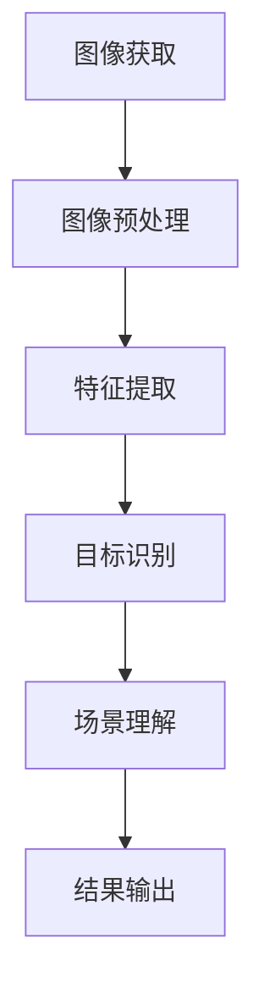

                 

### 第1章 引言

#### 1.1 智能零售的背景和意义

随着全球经济的快速发展，零售行业正面临着前所未有的变革。传统的零售模式已经难以满足消费者日益增长的个性化、便捷化需求，智能零售作为新一代零售模式的代表，应运而生。智能零售，是指通过运用人工智能、大数据、云计算等先进技术，实现零售业务各个环节的智能化升级，从而提高运营效率、优化用户体验、提升销售业绩。

智能零售的背景可以追溯到互联网和移动设备的普及，以及大数据时代的到来。互联网的普及让信息获取更加便捷，移动设备的普及则使得消费行为更加碎片化和个性化。大数据技术的发展为零售企业提供了强大的数据分析能力，通过分析消费者行为、购物习惯等数据，企业可以更好地了解市场需求，优化商品结构和营销策略。

智能零售的意义在于：

1. **提升用户体验**：通过智能化的购物体验，如个性化推荐、智能客服等，提高消费者的满意度。
2. **降低运营成本**：自动化、智能化的供应链管理、库存管理等，有助于减少人力成本和运营风险。
3. **提高销售效率**：智能化的营销策略和精准的商品推荐，能够有效提高销售额。
4. **实现数据驱动**：通过数据分析，企业可以更加精准地制定战略决策，提高市场竞争力。

#### 1.2 计算机视觉技术的发展与应用

计算机视觉技术是人工智能的重要分支，旨在让计算机具备类似人类的视觉感知能力。计算机视觉技术的发展经历了几个重要阶段：

1. **图像识别**：计算机对图像中的物体进行识别和分类，如人脸识别、车辆识别等。
2. **目标检测**：在图像中检测并定位特定目标的位置和属性，如行人检测、交通标志识别等。
3. **场景理解**：通过综合分析图像中的多种信息，理解场景的意图和含义，如自动驾驶、视频监控等。

计算机视觉技术在智能零售中有着广泛的应用，主要包括以下几个方面：

1. **商品识别与分类**：通过计算机视觉技术对商品进行自动识别和分类，提高货架管理和库存管理的效率。
2. **人脸识别与行为分析**：通过人脸识别技术实现消费者身份识别，结合行为分析技术，了解消费者的购物偏好和行为模式。
3. **智能导购与营销**：利用计算机视觉技术进行智能导购，根据消费者行为提供个性化的购物推荐，提升销售转化率。

#### 1.3 计算机视觉在智能零售中的挑战与机遇

计算机视觉在智能零售中的应用虽然前景广阔，但也面临一些挑战：

1. **数据隐私问题**：人脸识别等技术的应用可能会引发消费者的隐私担忧。
2. **技术成熟度**：计算机视觉技术在一些特定场景下的应用效果尚未完全成熟，需要进一步优化。
3. **硬件成本**：高精度摄像头、深度传感器等硬件设备的成本较高，对中小零售企业构成一定负担。

然而，挑战背后同样蕴藏着巨大的机遇：

1. **市场潜力**：随着消费者对智能化零售体验的需求增加，智能零售市场潜力巨大。
2. **技术创新**：随着算法和硬件技术的不断发展，计算机视觉在智能零售中的应用将越来越广泛。
3. **行业整合**：零售企业可以通过与科技企业的合作，实现技术升级和业务拓展。

综上所述，智能零售与计算机视觉技术的结合，不仅为零售行业带来了新的发展方向，也为计算机视觉技术的发展提供了广阔的应用场景。在接下来的章节中，我们将深入探讨计算机视觉技术在智能零售中的具体应用，并分析其未来发展趋势。

### 关键词

- **智能零售**
- **计算机视觉**
- **商品识别**
- **人脸识别**
- **行为分析**
- **供应链管理**
- **数据隐私**

### 摘要

本文系统地探讨了计算机视觉在智能零售中的应用趋势。首先，介绍了智能零售的背景和意义，以及计算机视觉技术的发展与应用。随后，分析了计算机视觉在智能零售中的挑战与机遇，包括数据隐私问题、技术成熟度以及硬件成本等。接着，详细介绍了计算机视觉在智能零售中的核心应用，如商品识别与分类、人脸识别与行为分析、供应链管理与优化等。最后，讨论了计算机视觉技术的未来发展趋势，并提出了对读者的建议。通过本文的深入探讨，读者可以全面了解计算机视觉技术在智能零售中的重要作用，以及其在未来可能的发展方向。

### 第2章 计算机视觉基础

在深入探讨计算机视觉在智能零售中的应用之前，我们需要了解计算机视觉的基础知识。本章将详细介绍计算机视觉的基本原理，包括图像处理基础、视觉感知模型和视觉感知算法。通过这些基本概念的理解，读者将能够更好地掌握计算机视觉技术在智能零售中的实际应用。

#### 2.1 计算机视觉的基本原理

计算机视觉是一种通过计算机对图像或视频进行分析和处理，从中提取有用信息的技术。其基本原理可以概括为以下几个方面：

1. **图像获取**：通过摄像头或其他图像传感器获取外界图像，并将其转化为数字信号。
2. **图像预处理**：对获取的图像进行增强、滤波、去噪等处理，以提高图像质量和清晰度。
3. **特征提取**：从处理后的图像中提取具有代表性的特征，如颜色、形状、纹理等。
4. **目标识别**：利用提取的特征，通过分类器或其他算法对图像中的目标进行识别和定位。
5. **场景理解**：结合多个图像帧的信息，对场景进行理解，如运动跟踪、场景重建等。

#### 2.1.1 图像处理基础

图像处理是计算机视觉的基础环节，主要包括以下几种基本操作：

1. **图像增强**：通过调整图像的亮度和对比度，增强图像的视觉效果，使其更容易进行后续处理。常用的方法有直方图均衡化、对比度增强等。
2. **图像滤波**：通过滤波器去除图像中的噪声，提高图像质量。常用的滤波器有均值滤波、中值滤波、高斯滤波等。
3. **图像分割**：将图像分割成若干区域或对象，以便进行后续的特征提取和目标识别。常用的方法有阈值分割、边缘检测、区域生长等。

#### 2.1.2 视觉感知模型

视觉感知模型是计算机视觉领域的一个重要研究方向，旨在模拟人类视觉系统的工作原理。目前，主要的视觉感知模型包括：

1. **基于生理学的模型**：这类模型基于人类视觉系统的生理结构，通过模拟神经元和视觉皮层的处理过程，实现对图像的理解。
2. **基于物理的模型**：这类模型从光学的角度出发，通过模拟光线的传播和反射，实现对图像的解释。
3. **基于概率统计的模型**：这类模型利用概率统计的方法，通过分析图像中的像素分布，实现对图像的解析。

#### 2.1.3 视觉感知算法

视觉感知算法是实现计算机视觉任务的关键，主要包括以下几种：

1. **特征提取算法**：这类算法用于从图像中提取具有代表性的特征，如SIFT、SURF、HOG等。
2. **目标检测算法**：这类算法用于在图像中检测并定位特定目标，如YOLO、SSD、Faster R-CNN等。
3. **场景理解算法**：这类算法用于对图像或视频中的场景进行理解，如光流法、SLAM、深度学习等。

#### 2.2 Mermaid 流程图：计算机视觉工作流程

为了更好地理解计算机视觉的工作流程，我们可以使用Mermaid绘制一个简单的流程图。以下是计算机视觉工作流程的Mermaid表示：



在这个流程图中，图像获取是通过摄像头或其他图像传感器实现的。随后，图像预处理包括增强、滤波和分割等操作，以提高图像质量。特征提取则从处理后的图像中提取具有代表性的特征。目标识别利用提取的特征对图像中的目标进行识别和定位。最后，场景理解结合多个图像帧的信息，对场景进行整体理解，并将结果输出。

通过本章的学习，读者将掌握计算机视觉的基础知识，为后续章节中智能零售应用的具体探讨打下坚实的基础。在接下来的章节中，我们将深入探讨计算机视觉在智能零售中的应用，如商品识别、人脸识别和行为分析等，并分析这些应用在实际零售场景中的具体实现和效果。

### 第3章 计算机视觉在智能零售中的应用

计算机视觉技术在智能零售中的应用已经逐渐成为零售行业创新的关键驱动力。本章将详细介绍计算机视觉在智能零售中的三大核心应用：商品识别与分类、人脸识别与行为分析、以及供应链管理与优化。通过这些应用，零售企业能够显著提升运营效率、优化消费者体验，并实现精准营销。

#### 3.1 商品识别与分类

商品识别与分类是计算机视觉在智能零售中最为基础的应用之一。其主要目标是通过图像处理和模式识别技术，自动识别和分类零售场景中的商品。具体包括以下几方面：

1. **商品识别算法**：
   - **深度学习算法**：如卷积神经网络（CNN），其能够自动学习图像中的特征，实现对商品的准确识别。
   - **基于特征的算法**：如SIFT、SURF等，通过提取图像特征，然后利用特征匹配算法进行商品识别。

2. **商品分类算法**：
   - **监督学习算法**：如支持向量机（SVM）、随机森林等，通过训练分类模型，对商品进行分类。
   - **无监督学习算法**：如K均值聚类等，通过聚类方法对商品进行分类。

3. **商品识别系统设计**：
   - **系统架构**：包括图像采集、预处理、特征提取、分类识别和结果输出等模块。
   - **系统实现**：使用Python等编程语言，结合深度学习和传统机器学习库，如TensorFlow、PyTorch、scikit-learn等，进行系统实现。

#### 3.1.1 商品识别算法

以下是一个简单的商品识别算法流程，使用Python伪代码进行说明：

```python
import cv2
import tensorflow as tf

# 1. 加载预训练的卷积神经网络模型
model = tf.keras.applications.resnet50.ResNet50(weights='imagenet')

# 2. 加载商品图像
image = cv2.imread('product.jpg')

# 3. 对图像进行预处理，使其符合模型输入要求
processed_image = preprocess_image(image)

# 4. 使用模型进行预测
prediction = model.predict(processed_image)

# 5. 解析预测结果，获取商品类别
predicted_class = decode_prediction(prediction)

print(f'Predicted class: {predicted_class}')
```

在实际应用中，商品识别算法需要结合具体的业务场景进行优化，如使用迁移学习技术，通过在特定商品类别上微调预训练模型，以提高识别准确率。

#### 3.1.2 商品分类算法

商品分类算法的核心在于训练一个分类模型。以下是一个使用随机森林算法进行商品分类的Python伪代码示例：

```python
from sklearn.ensemble import RandomForestClassifier
from sklearn.model_selection import train_test_split
from sklearn.metrics import accuracy_score

# 1. 加载数据集
X, y = load_data('product_data.csv')

# 2. 划分训练集和测试集
X_train, X_test, y_train, y_test = train_test_split(X, y, test_size=0.2, random_state=42)

# 3. 创建随机森林分类器
clf = RandomForestClassifier(n_estimators=100)

# 4. 训练分类模型
clf.fit(X_train, y_train)

# 5. 对测试集进行预测
y_pred = clf.predict(X_test)

# 6. 评估模型性能
accuracy = accuracy_score(y_test, y_pred)
print(f'Accuracy: {accuracy}')
```

通过这些算法和系统设计，零售企业能够实现对商品的高效识别和分类，从而优化库存管理、提高货架利用率，并实现精准的商品推荐。

#### 3.2 人脸识别与行为分析

人脸识别与行为分析是计算机视觉在智能零售中的另一重要应用。人脸识别主要用于消费者身份验证和个性化服务，而行为分析则通过观察消费者行为模式，实现精准营销。

1. **人脸识别算法**：
   - **特征提取**：使用深度学习算法，如卷积神经网络，提取人脸图像中的特征向量。
   - **匹配与识别**：通过对比特征向量，识别消费者的身份。

2. **人脸识别系统设计**：
   - **系统架构**：包括人脸检测、特征提取、匹配与识别、结果输出等模块。
   - **系统实现**：使用OpenCV、Dlib、TensorFlow等库进行人脸识别系统的开发和实现。

3. **行为分析算法**：
   - **静态行为分析**：通过观察消费者的静态动作，如站立、走动等，分析消费者的购物偏好。
   - **动态行为分析**：通过视频分析，跟踪消费者的动态行为，如购物路径、驻留时间等。

4. **行为分析系统设计**：
   - **系统架构**：包括行为检测、行为识别、数据分析和结果输出等模块。
   - **系统实现**：使用OpenCV、TensorFlow、PyTorch等库，结合深度学习和传统机器学习算法，进行行为分析系统的实现。

#### 3.2.1 人脸识别算法

以下是一个使用深度学习进行人脸识别的Python伪代码示例：

```python
import tensorflow as tf
import cv2

# 1. 加载预训练的人脸识别模型
model = tf.keras.models.load_model('face_recognition_model.h5')

# 2. 加载待识别的人脸图像
image = cv2.imread('face.jpg')

# 3. 进行人脸检测，找到人脸区域
faces = detect_faces(image)

# 4. 对每个检测到的人脸进行特征提取
features = extract_features(model, faces)

# 5. 与数据库中的人脸特征进行匹配，识别身份
person_id = identify_person(features, database)

print(f'Identified person: {person_id}')
```

#### 3.2.2 行为分析算法

以下是一个简单的行为分析算法流程，使用Python伪代码进行说明：

```python
import cv2
import numpy as np

# 1. 加载视频文件
video = cv2.VideoCapture('customer_behavior.mp4')

# 2. 初始化行为分析模型
behavior_model = load_behavior_model()

# 3. 循环读取视频帧
while video.isOpened():
    ret, frame = video.read()
    if not ret:
        break
    
    # 4. 进行行为检测
    behaviors = behavior_model.detect(frame)

    # 5. 记录和分析行为数据
    analyze_behavior(behaviors)

# 6. 释放资源
video.release()
```

通过人脸识别和行为分析技术，零售企业可以更好地了解消费者的购物行为和需求，从而优化营销策略，提升消费者满意度。

#### 3.3 供应链管理与优化

计算机视觉技术在供应链管理中的应用，能够显著提升供应链的透明度和效率。主要应用包括：

1. **库存管理**：通过计算机视觉技术对仓库中的商品进行实时监控和识别，实现自动化的库存管理。
2. **物流追踪**：利用计算机视觉技术对物流运输过程中的商品进行监控，实现高效的物流追踪和管理。
3. **质量检测**：通过计算机视觉技术对生产过程中的商品进行质量检测，确保产品质量。

#### 3.3.1 供应链管理概述

供应链管理是零售企业的重要组成部分，涉及从原材料采购到产品交付的整个流程。通过计算机视觉技术，供应链管理可以实现以下目标：

- **提高供应链透明度**：实时监控供应链各个环节，确保信息的及时传递和更新。
- **提高供应链效率**：自动化管理减少人工干预，提高作业效率。
- **降低运营成本**：减少人为错误，降低库存和物流管理的成本。

#### 3.3.2 计算机视觉在供应链管理中的应用

1. **库存管理**：
   - **实时监控**：通过计算机视觉技术对仓库中的商品进行实时监控，及时发现库存异常。
   - **自动化盘点**：使用计算机视觉技术对仓库中的商品进行自动盘点，提高盘点效率和准确性。

2. **物流追踪**：
   - **实时监控**：通过计算机视觉技术对物流运输过程中的商品进行实时监控，确保运输过程的透明和安全。
   - **智能调度**：根据实时监控数据，优化物流调度策略，提高运输效率。

3. **质量检测**：
   - **自动化检测**：通过计算机视觉技术对生产过程中的商品进行自动化质量检测，确保产品质量。
   - **实时反馈**：将检测结果实时反馈给生产环节，及时调整生产参数，确保产品质量。

#### 3.3.3 供应链优化算法

供应链优化算法是计算机视觉在供应链管理中的重要应用。主要算法包括：

1. **库存优化算法**：
   - **需求预测**：通过分析历史销售数据，预测未来的商品需求，优化库存水平。
   - **动态调整**：根据实时销售数据和库存水平，动态调整库存策略，确保库存的合理性和效率。

2. **物流优化算法**：
   - **路径规划**：通过计算机视觉和运筹学方法，优化物流运输路径，减少运输时间和成本。
   - **资源分配**：根据物流需求，优化仓库和运输资源的分配，提高整体效率。

通过上述算法，零售企业可以更好地管理供应链，提高运营效率和竞争力。

本章详细介绍了计算机视觉在智能零售中的核心应用，包括商品识别与分类、人脸识别与行为分析、供应链管理与优化。通过这些应用，零售企业能够实现自动化、智能化的运营，提高用户体验，优化供应链管理，实现可持续发展。

### 4.1 商品识别算法原理讲解

商品识别算法是计算机视觉在智能零售中的关键应用之一，其核心在于通过图像处理和模式识别技术，从大量的商品图像中准确识别出具体的商品。本节将深入讲解商品识别算法的原理，并结合Python源代码进行详细阐述。

#### 4.1.1 卷积神经网络（CNN）的工作原理

商品识别算法的核心是卷积神经网络（CNN）。CNN是一种专门为图像处理设计的深度学习模型，其结构模拟了人类视觉系统的神经网络，能够自动学习图像中的特征。

1. **卷积层（Convolutional Layer）**：
   - 卷积层是CNN的核心组成部分，通过卷积操作提取图像特征。卷积层包含多个卷积核（filter），每个卷积核对输入图像进行卷积操作，生成特征图（feature map）。
   - 卷积操作的基本原理是：将卷积核在输入图像上滑动，每次滑动时计算卷积核与输入图像子区域的乘积和，并将结果累加得到一个特征值。

2. **激活函数（Activation Function）**：
   - 激活函数用于引入非线性变换，使得神经网络具有分类能力。常用的激活函数有Sigmoid、ReLU等。
   - ReLU函数是CNN中常用的激活函数，其表达式为：\[ f(x) = \max(0, x) \]，能够加速神经网络的训练过程。

3. **池化层（Pooling Layer）**：
   - 池化层用于减少特征图的维度，提高计算效率。常见的池化方式有最大池化（Max Pooling）和平均池化（Average Pooling）。
   - 最大池化操作将特征图上每个窗口内的最大值作为输出，有助于保留图像中的显著特征。

4. **全连接层（Fully Connected Layer）**：
   - 全连接层将前一层输出的特征图展开成一维向量，并通过线性变换和激活函数进行分类。
   - 最后一个全连接层的输出即为商品的类别概率分布。

#### 4.1.2 伪代码展示

以下是一个简单的商品识别算法的伪代码展示：

```python
import tensorflow as tf
from tensorflow.keras.applications import ResNet50
from tensorflow.keras.preprocessing import image
from tensorflow.keras.applications.resnet50 import preprocess_input

# 1. 加载预训练的ResNet50模型
model = ResNet50(weights='imagenet')

# 2. 加载商品图像
img_path = 'product.jpg'
img = image.load_img(img_path, target_size=(224, 224))
x = image.img_to_array(img)
x = np.expand_dims(x, axis=0)
x = preprocess_input(x)

# 3. 使用模型进行预测
predictions = model.predict(x)

# 4. 解析预测结果
predicted_class = decode_predictions(predictions)[0][1]

print(f'Predicted class: {predicted_class}')
```

在这段代码中，我们首先加载了预训练的ResNet50模型，然后加载待识别的商品图像，并对图像进行预处理。接着，使用模型进行预测，并解析预测结果，获取商品的类别。

#### 4.1.3 算法性能分析

商品识别算法的性能通常通过准确率（Accuracy）、召回率（Recall）和F1分数（F1 Score）等指标进行评估。以下是一个简单的性能分析示例：

```python
from sklearn.metrics import classification_report

# 1. 加载测试数据集
X_test, y_test = load_test_data()

# 2. 使用模型对测试数据进行预测
predictions = model.predict(X_test)

# 3. 解析预测结果
predicted_classes = decode_predictions(predictions)
true_classes = y_test

# 4. 计算性能指标
report = classification_report(true_classes, predicted_classes, target_names=class_names)

print(report)
```

通过这段代码，我们可以得到商品识别算法在测试数据集上的性能报告，包括准确率、召回率和F1分数等指标。这些指标有助于我们评估算法的实际应用效果，并为进一步优化提供依据。

#### 4.1.4 实例分析

以下是一个具体的实例分析，展示如何使用商品识别算法进行商品识别：

```python
# 1. 加载测试图像
test_image = image.load_img('test_product.jpg', target_size=(224, 224))
test_x = image.img_to_array(test_image)
test_x = np.expand_dims(test_x, axis=0)
test_x = preprocess_input(test_x)

# 2. 使用模型进行预测
test_predictions = model.predict(test_x)

# 3. 解析预测结果
test_predicted_class = decode_predictions(test_predictions)[0][1]

print(f'Predicted class: {test_predicted_class}')
```

在这个实例中，我们加载了一个测试图像，并对图像进行预处理。然后，使用商品识别模型进行预测，并解析预测结果，获取测试图像对应的商品类别。这个实例展示了商品识别算法的实际应用过程。

通过本节的讲解，我们了解了商品识别算法的基本原理，并使用Python源代码进行了详细阐述。在实际应用中，商品识别算法可以根据具体的业务需求进行优化和调整，以提高识别准确率和效率。

### 4.2 人脸识别算法原理讲解

人脸识别算法是计算机视觉领域中的一项关键技术，它在智能零售、安全监控、身份验证等多个领域有着广泛的应用。本节将详细讲解人脸识别算法的基本原理，并结合Python源代码进行解释。

#### 4.2.1 特征提取算法

人脸识别的核心在于从人脸图像中提取具有区分度的特征。特征提取算法可以分为基于传统算法和基于深度学习算法两大类。

1. **基于传统算法**：
   - **主成分分析（PCA）**：PCA是一种降维技术，通过保留主要成分，降低数据的维度。在人脸识别中，PCA可以用于提取人脸图像的主要特征。
   - **线性判别分析（LDA）**：LDA旨在最大化类间方差，最小化类内方差，从而提高分类效果。LDA常用于人脸特征提取。

2. **基于深度学习算法**：
   - **深度卷积神经网络（CNN）**：CNN是一种专门用于图像处理的深度学习模型，能够自动学习图像中的复杂特征。在人脸识别中，常用的CNN架构有LeNet、AlexNet、VGG、ResNet等。

以下是一个基于深度学习的人脸特征提取算法的Python伪代码：

```python
import tensorflow as tf
from tensorflow.keras.applications import VGG16
from tensorflow.keras.preprocessing import image
from tensorflow.keras.applications.vgg16 import preprocess_input

# 1. 加载预训练的VGG16模型
model = VGG16(weights='imagenet')

# 2. 加载人脸图像
img_path = 'face.jpg'
img = image.load_img(img_path, target_size=(224, 224))
x = image.img_to_array(img)
x = np.expand_dims(x, axis=0)
x = preprocess_input(x)

# 3. 使用模型提取特征
features = model.predict(x)

# 4. 提取最后一个卷积层的特征
last_conv_layer = model.layers[-2].output
last_conv_layer_features = tf.keras.Model(inputs=model.input, outputs=last_conv_layer).predict(x)

# 5. 特征向量化
feature_vector = np.reshape(last_conv_layer_features, -1)

print(f'Feature vector: {feature_vector}')
```

这段代码首先加载了预训练的VGG16模型，然后加载待识别的人脸图像，并对图像进行预处理。接着，使用模型提取特征，并提取最后一个卷积层的特征向量。

#### 4.2.2 匹配与识别算法

在提取人脸特征后，下一步是进行特征匹配和识别。常见的匹配算法有欧氏距离、余弦相似度等。

1. **欧氏距离**：
   - 欧氏距离是一种简单的特征匹配方法，计算两个特征向量之间的距离。距离越小，表示特征越相似。

2. **余弦相似度**：
   - 余弦相似度通过计算两个特征向量之间的夹角余弦值，来判断特征相似度。余弦值越接近1，表示特征越相似。

以下是一个使用欧氏距离进行人脸识别的Python伪代码：

```python
import numpy as np

# 1. 加载待识别的人脸特征
face_feature = np.load('face_feature.npy')

# 2. 加载数据库中的人脸特征
database_features = np.load('database_features.npy')
database_labels = np.load('database_labels.npy')

# 3. 计算特征之间的欧氏距离
distances = np.linalg.norm(face_feature - database_features, axis=1)

# 4. 找到距离最小的特征，识别为同一人
closest_index = np.argmin(distances)
predicted_label = database_labels[closest_index]

print(f'Predicted label: {predicted_label}')
```

在这段代码中，我们首先加载了待识别的人脸特征和数据库中的人脸特征。接着，计算特征之间的欧氏距离，并找到距离最小的特征，将其识别为同一人。

#### 4.2.3 算法性能分析

人脸识别算法的性能通常通过准确率（Accuracy）、识别率（Recognition Rate）和错误接受率（False Accept Rate）等指标进行评估。以下是一个简单的性能分析示例：

```python
from sklearn.metrics import accuracy_score

# 1. 加载测试数据集
X_test, y_test = load_test_data()

# 2. 使用模型对测试数据进行预测
predictions = model.predict(X_test)

# 3. 解析预测结果
predicted_classes = decode_predictions(predictions)
true_classes = y_test

# 4. 计算性能指标
accuracy = accuracy_score(true_classes, predicted_classes)

print(f'Accuracy: {accuracy}')
```

通过这段代码，我们可以得到人脸识别算法在测试数据集上的准确率。这些指标有助于我们评估算法的实际应用效果，并为进一步优化提供依据。

#### 4.2.4 实例分析

以下是一个具体的人脸识别实例分析，展示如何使用人脸识别算法进行身份验证：

```python
# 1. 加载测试图像
test_image = image.load_img('test_face.jpg', target_size=(224, 224))
test_x = image.img_to_array(test_image)
test_x = np.expand_dims(test_x, axis=0)
test_x = preprocess_input(test_x)

# 2. 使用模型提取特征
test_features = model.predict(test_x)

# 3. 使用特征匹配算法进行身份验证
distances = np.linalg.norm(test_features - database_features, axis=1)
closest_index = np.argmin(distances)
predicted_label = database_labels[closest_index]

print(f'Predicted label: {predicted_label}')
```

在这个实例中，我们首先加载了一个测试图像，并对图像进行预处理。然后，使用人脸识别模型提取特征，并使用特征匹配算法进行身份验证，输出预测结果。

通过本节的讲解，我们了解了人脸识别算法的基本原理，并使用Python源代码进行了详细阐述。在实际应用中，人脸识别算法可以根据具体的业务需求进行优化和调整，以提高识别准确率和效率。

### 4.3 行为分析算法原理讲解

行为分析算法是计算机视觉在智能零售中的一项重要应用，其核心在于通过视频数据分析和模式识别技术，理解并预测消费者的购物行为。本节将详细讲解行为分析算法的基本原理，并结合Python源代码进行解释。

#### 4.3.1 视频数据分析

视频数据分析是行为分析算法的基础，主要涉及以下步骤：

1. **视频捕获**：通过摄像头或其他视频源捕获视频数据。
2. **预处理**：对捕获的视频数据进行预处理，包括去噪、去闪烁、色彩校正等。
3. **帧提取**：从预处理后的视频中提取单帧图像，用于后续分析。

以下是一个简单的视频捕获和帧提取的Python伪代码示例：

```python
import cv2

# 1. 初始化视频捕获对象
cap = cv2.VideoCapture(0)

# 2. 循环读取视频帧
while cap.isOpened():
    ret, frame = cap.read()
    if not ret:
        break
    
    # 3. 显示视频帧
    cv2.imshow('Video', frame)
    
    # 4. 按下'q'键退出循环
    if cv2.waitKey(1) & 0xFF == ord('q'):
        break

# 5. 释放资源
cap.release()
cv2.destroyAllWindows()
```

在这段代码中，我们首先初始化视频捕获对象，然后循环读取视频帧，并显示每个视频帧。当按下'q'键时，退出循环并释放资源。

#### 4.3.2 行为识别算法

行为识别算法用于从视频数据中识别并分类消费者的行为。常见的算法包括：

1. **静态行为识别**：
   - **基于区域的活动检测**：通过检测视频中特定区域的活动，识别静态行为，如站立、走动等。
   - **基于模式的活动检测**：通过分析视频中的连续帧，识别具有特定模式的静态行为。

2. **动态行为识别**：
   - **运动跟踪**：通过跟踪视频中的运动目标，识别动态行为，如购物路径、驻留时间等。
   - **事件检测**：通过检测视频中特定的事件，如结账、试穿等，识别动态行为。

以下是一个简单的基于区域的活动检测算法的Python伪代码示例：

```python
import cv2
import numpy as np

# 1. 初始化视频捕获对象
cap = cv2.VideoCapture('video.mp4')

# 2. 初始化背景减除器
fgbg = cv2.createBackgroundSubtractorMOG2()

# 3. 循环读取视频帧
while cap.isOpened():
    ret, frame = cap.read()
    if not ret:
        break
    
    # 4. 应用背景减除
    fgmask = fgbg.apply(frame)
    
    # 5. 显示视频帧和背景减除结果
    cv2.imshow('Video', frame)
    cv2.imshow('Foreground', fgmask)
    
    # 6. 按下'q'键退出循环
    if cv2.waitKey(1) & 0xFF == ord('q'):
        break

# 7. 释放资源
cap.release()
cv2.destroyAllWindows()
```

在这段代码中，我们首先初始化视频捕获对象和背景减除器，然后循环读取视频帧，并应用背景减除。接着，显示视频帧和背景减除结果。当按下'q'键时，退出循环并释放资源。

#### 4.3.3 行为预测算法

行为预测算法通过分析历史数据和行为模式，预测未来的消费者行为。常见的算法包括：

1. **基于统计的预测**：
   - **线性回归**：通过分析历史数据，建立线性模型，预测未来行为。
   - **时间序列分析**：通过分析时间序列数据，预测未来行为。

2. **基于机器学习的预测**：
   - **决策树**：通过构建决策树模型，预测未来行为。
   - **神经网络**：通过构建神经网络模型，预测未来行为。

以下是一个简单的基于统计的预测算法的Python伪代码示例：

```python
import numpy as np
from sklearn.linear_model import LinearRegression

# 1. 加载历史数据
X = np.load('historical_data.npy')
y = np.load('historical_behaviors.npy')

# 2. 创建线性回归模型
model = LinearRegression()

# 3. 训练模型
model.fit(X, y)

# 4. 预测未来行为
future_data = np.array([[new_data_value]])
predicted_behavior = model.predict(future_data)

print(f'Predicted behavior: {predicted_behavior}')
```

在这段代码中，我们首先加载历史数据，创建线性回归模型，并训练模型。接着，使用训练好的模型预测未来行为。通过这些算法，我们可以对消费者的行为进行有效的预测和分析。

#### 4.3.4 算法性能分析

行为分析算法的性能通常通过准确率（Accuracy）、召回率（Recall）和F1分数（F1 Score）等指标进行评估。以下是一个简单的性能分析示例：

```python
from sklearn.metrics import classification_report

# 1. 加载测试数据集
X_test, y_test = load_test_data()

# 2. 使用模型对测试数据进行预测
predictions = model.predict(X_test)

# 3. 解析预测结果
predicted_classes = decode_predictions(predictions)
true_classes = y_test

# 4. 计算性能指标
report = classification_report(true_classes, predicted_classes, target_names=class_names)

print(report)
```

通过这段代码，我们可以得到行为分析算法在测试数据集上的性能报告，包括准确率、召回率和F1分数等指标。这些指标有助于我们评估算法的实际应用效果，并为进一步优化提供依据。

#### 4.3.5 实例分析

以下是一个具体的行为分析实例分析，展示如何使用行为分析算法进行消费者行为分析：

```python
# 1. 加载测试视频
video = cv2.VideoCapture('test_video.mp4')

# 2. 初始化行为分析模型
behavior_model = load_behavior_model()

# 3. 循环读取视频帧
while video.isOpened():
    ret, frame = video.read()
    if not ret:
        break
    
    # 4. 进行行为检测
    behaviors = behavior_model.detect(frame)

    # 5. 记录和分析行为数据
    analyze_behavior(behaviors)

# 6. 释放资源
video.release()
```

在这个实例中，我们首先加载了一个测试视频，并初始化行为分析模型。然后，循环读取视频帧，进行行为检测，并记录和分析行为数据。通过这些实例和分析，我们能够更好地理解行为分析算法的原理和应用。

通过本节的讲解，我们了解了行为分析算法的基本原理，并使用Python源代码进行了详细阐述。在实际应用中，行为分析算法可以根据具体的业务需求进行优化和调整，以提高识别准确率和效率。

### 5.1 商品识别数学模型讲解

商品识别是计算机视觉领域的一个重要研究方向，其核心在于通过图像处理和模式识别技术，从大量的商品图像中准确识别出具体的商品。在本节中，我们将详细讲解商品识别中的数学模型，包括特征提取、特征匹配和分类器设计等部分，并使用LaTeX格式详细描述相关数学公式。

#### 5.1.1 特征提取

特征提取是商品识别算法中的关键步骤，其主要目标是提取图像中的具有区分度的特征，以便进行后续的识别和分类。常见的特征提取方法包括基于传统算法和基于深度学习的算法。

1. **基于传统算法的特征提取**：
   - **SIFT（尺度不变特征变换）**：
     SIFT算法通过计算图像的梯度信息，提取出具有旋转不变性和尺度不变性的特征点。其基本步骤如下：
     \[
     \begin{align*}
     \text{SIFT特征点检测} &= \text{计算图像梯度，找到关键点} \\
     \text{特征向量计算} &= \text{计算关键点的局部描述子}
     \end{align*}
     \]

   - **HOG（直方图方向梯度）**：
     HOG算法通过计算图像中每个像素点在局部区域内的方向梯度，生成直方图特征。其公式如下：
     \[
     \text{HOG特征} = \sum_{i=1}^{N} \sum_{j=1}^{M} \text{ normalize } ( \sum_{\theta \in \theta_{bin}} \text{count}(\theta) )
     \]

2. **基于深度学习的特征提取**：
   - **卷积神经网络（CNN）**：
     CNN是一种专门为图像处理设计的深度学习模型，能够自动学习图像中的特征。CNN的基本公式如下：
     \[
     \begin{align*}
     \text{卷积层} &= \text{Conv}(x, W) + b \\
     \text{激活函数} &= \text{ReLU}(\text{卷积结果}) \\
     \text{池化层} &= \text{Pooling}(\text{激活结果})
     \end{align*}
     \]
     其中，\( x \) 是输入图像，\( W \) 是卷积核权重，\( b \) 是偏置项，\( ReLU \) 是激活函数，\( Pooling \) 是池化操作。

#### 5.1.2 特征匹配

特征匹配是商品识别算法中的另一个重要步骤，其主要目标是将提取的特征向量与数据库中的特征向量进行匹配，以确定商品的类别。常见的特征匹配方法包括基于距离的匹配和基于概率的匹配。

1. **基于距离的匹配**：
   - **欧氏距离**：
     欧氏距离是一种简单的特征匹配方法，计算两个特征向量之间的距离。其公式如下：
     \[
     \text{Distance} = \sqrt{\sum_{i=1}^{N} (x_i - y_i)^2}
     \]
     其中，\( x \) 和 \( y \) 是两个特征向量，\( N \) 是特征向量的维度。

   - **余弦相似度**：
     余弦相似度通过计算两个特征向量之间的夹角余弦值，来判断特征相似度。其公式如下：
     \[
     \text{Cosine Similarity} = \frac{x \cdot y}{\lVert x \rVert \lVert y \rVert}
     \]
     其中，\( \cdot \) 表示向量的点积，\( \lVert \cdot \rVert \) 表示向量的模。

2. **基于概率的匹配**：
   - **贝叶斯分类器**：
     贝叶斯分类器是一种基于概率论的分类器，其基本公式如下：
     \[
     P(C_k | \text{特征}) = \frac{P(\text{特征} | C_k) P(C_k)}{P(\text{特征})}
     \]
     其中，\( C_k \) 是类别，\( P(C_k | \text{特征}) \) 是特征向量属于类别 \( C_k \) 的概率，\( P(\text{特征} | C_k) \) 是特征向量在类别 \( C_k \) 下的概率，\( P(C_k) \) 是类别 \( C_k \) 的先验概率，\( P(\text{特征}) \) 是特征向量的总概率。

#### 5.1.3 分类器设计

分类器设计是商品识别算法中的关键部分，其主要目标是根据提取的特征向量，将商品图像分类到相应的类别中。常见的分类器设计方法包括基于传统算法和基于深度学习的算法。

1. **基于传统算法的分类器设计**：
   - **支持向量机（SVM）**：
     SVM是一种基于间隔最大化原理的分类器，其公式如下：
     \[
     \begin{align*}
     \text{间隔最大化目标} &= \max_{\mathbf{w}, b} \frac{1}{2} \lVert \mathbf{w} \rVert^2 \\
     \text{约束条件} &= y(\mathbf{w} \cdot \mathbf{x} + b) \geq 1
     \end{align*}
     \]
     其中，\( \mathbf{w} \) 是分类器的权重向量，\( b \) 是偏置项，\( y \) 是类别标签，\( \mathbf{x} \) 是特征向量。

   - **决策树**：
     决策树是一种基于特征划分数据的分类器，其公式如下：
     \[
     \text{决策树} = \text{if } x_i \text{ is } \text{true} \text{ then } \text{left branch} \\
     \text{else} \text{ then } \text{right branch}
     \]
     其中，\( x_i \) 是特征，\( \text{true} \) 和 \( \text{false} \) 是特征值。

2. **基于深度学习的分类器设计**：
   - **卷积神经网络（CNN）**：
     CNN是一种基于卷积操作的深度学习模型，其基本公式如下：
     \[
     \begin{align*}
     \text{卷积层} &= \text{Conv}(x, W) + b \\
     \text{激活函数} &= \text{ReLU}(\text{卷积结果}) \\
     \text{池化层} &= \text{Pooling}(\text{激活结果}) \\
     \text{全连接层} &= \text{FullyConnected}(\text{池化结果}) \\
     \text{分类结果} &= \text{Softmax}(\text{全连接层输出})
     \end{align*}
     \]
     其中，\( \text{Softmax} \) 是归一化函数，用于计算类别概率分布。

通过上述数学模型的讲解，我们能够更好地理解商品识别算法的原理和实现过程。在实际应用中，这些数学模型可以根据具体的业务需求进行优化和调整，以提高识别准确率和效率。

### 5.2 人脸识别数学模型讲解

人脸识别是计算机视觉领域的一项关键技术，广泛应用于安全监控、身份验证、人脸美颜等场景。本节将详细讲解人脸识别中的数学模型，包括特征提取、特征匹配和分类器设计等部分，并使用LaTeX格式详细描述相关数学公式。

#### 5.2.1 特征提取

人脸识别中的特征提取是关键步骤，其目的是从人脸图像中提取具有区分度和鲁棒性的特征。常见的特征提取方法包括基于传统算法和基于深度学习的算法。

1. **基于传统算法的特征提取**：
   - **主成分分析（PCA）**：
     PCA是一种降维技术，通过保留主要成分，降低数据的维度。在人脸识别中，PCA可以用于提取人脸图像的主要特征。其数学模型如下：
     \[
     \mathbf{Z} = \mathbf{U}\mathbf{S}\mathbf{U}^T\mathbf{X}
     \]
     其中，\(\mathbf{Z}\)是降维后的特征向量，\(\mathbf{U}\)是PCA变换的基向量，\(\mathbf{S}\)是对角矩阵，包含主要成分的方差，\(\mathbf{X}\)是原始人脸图像。

   - **线性判别分析（LDA）**：
     LDA旨在最大化类间方差，最小化类内方差，从而提高分类效果。在人脸识别中，LDA可以用于提取人脸特征。其数学模型如下：
     \[
     \mathbf{w} = \arg\max_{\mathbf{w}} \sum_{i=1}^{c} \sum_{j=1}^{n_i} (\mathbf{w}^T \mathbf{x}_{ij} - \mu_{ij})^2
     \]
     其中，\(\mathbf{w}\)是LDA变换的权重向量，\(\mathbf{x}_{ij}\)是第i类第j个人的脸图像，\(\mu_{ij}\)是第i类第j个人的脸图像的平均值，\(c\)是类别的数量，\(n_i\)是第i类的样本数量。

2. **基于深度学习的特征提取**：
   - **卷积神经网络（CNN）**：
     CNN是一种专门为图像处理设计的深度学习模型，能够自动学习图像中的特征。在人脸识别中，常用的CNN架构有LeNet、AlexNet、VGG、ResNet等。CNN的特征提取过程可以表示为：
     \[
     \begin{align*}
     \mathbf{h}_{\text{conv}} &= \text{Conv}(\mathbf{x}, \mathbf{W}_{\text{conv}}) + \mathbf{b}_{\text{conv}} \\
     \mathbf{h}_{\text{pool}} &= \text{Pooling}(\mathbf{h}_{\text{conv}}) \\
     \mathbf{h}_{\text{fc}} &= \text{FullyConnected}(\mathbf{h}_{\text{pool}}, \mathbf{W}_{\text{fc}}) + \mathbf{b}_{\text{fc}} \\
     \end{align*}
     \]
     其中，\(\mathbf{x}\)是输入图像，\(\mathbf{W}_{\text{conv}}\)和\(\mathbf{b}_{\text{conv}}\)是卷积层的权重和偏置，\(\mathbf{W}_{\text{fc}}\)和\(\mathbf{b}_{\text{fc}}\)是全连接层的权重和偏置，\(\mathbf{h}_{\text{conv}}\)和\(\mathbf{h}_{\text{pool}}\)分别是卷积层和池化层的输出，\(\mathbf{h}_{\text{fc}}\)是全连接层的输出。

#### 5.2.2 特征匹配

在人脸识别中，特征匹配是关键步骤，用于将提取的特征向量与数据库中的特征向量进行匹配，以确定人脸的类别。常见的特征匹配方法包括基于距离的匹配和基于概率的匹配。

1. **基于距离的匹配**：
   - **欧氏距离**：
     欧氏距离是一种简单的特征匹配方法，计算两个特征向量之间的距离。其数学模型如下：
     \[
     \text{Distance} = \sqrt{\sum_{i=1}^{N} (x_i - y_i)^2}
     \]
     其中，\(x\)和\(y\)是两个特征向量，\(N\)是特征向量的维度。

   - **余弦相似度**：
     余弦相似度通过计算两个特征向量之间的夹角余弦值，来判断特征相似度。其数学模型如下：
     \[
     \text{Cosine Similarity} = \frac{x \cdot y}{\lVert x \rVert \lVert y \rVert}
     \]
     其中，\(\cdot\)表示向量的点积，\(\lVert \cdot \rVert\)表示向量的模。

2. **基于概率的匹配**：
   - **贝叶斯分类器**：
     贝叶斯分类器是一种基于概率论的分类器，其基本公式如下：
     \[
     P(C_k | \text{特征}) = \frac{P(\text{特征} | C_k) P(C_k)}{P(\text{特征})}
     \]
     其中，\(C_k\)是类别，\(P(C_k | \text{特征})\)是特征向量属于类别\(C_k\)的概率，\(P(\text{特征} | C_k)\)是特征向量在类别\(C_k\)下的概率，\(P(C_k)\)是类别\(C_k\)的先验概率，\(P(\text{特征})\)是特征向量的总概率。

#### 5.2.3 分类器设计

分类器设计是人脸识别算法中的关键部分，其主要目标是根据提取的特征向量，将人脸图像分类到相应的类别中。常见的分类器设计方法包括基于传统算法和基于深度学习的算法。

1. **基于传统算法的分类器设计**：
   - **支持向量机（SVM）**：
     SVM是一种基于间隔最大化原理的分类器，其数学模型如下：
     \[
     \begin{align*}
     \text{间隔最大化目标} &= \max_{\mathbf{w}, b} \frac{1}{2} \lVert \mathbf{w} \rVert^2 \\
     \text{约束条件} &= y(\mathbf{w} \cdot \mathbf{x} + b) \geq 1
     \end{align*}
     \]
     其中，\(\mathbf{w}\)是分类器的权重向量，\(b\)是偏置项，\(y\)是类别标签，\(\mathbf{x}\)是特征向量。

   - **决策树**：
     决策树是一种基于特征划分数据的分类器，其数学模型如下：
     \[
     \text{决策树} = \text{if } x_i \text{ is } \text{true} \text{ then } \text{left branch} \\
     \text{else} \text{ then } \text{right branch}
     \]
     其中，\(x_i\)是特征，\(\text{true}\)和\(\text{false}\)是特征值。

2. **基于深度学习的分类器设计**：
   - **卷积神经网络（CNN）**：
     CNN是一种基于卷积操作的深度学习模型，其数学模型如下：
     \[
     \begin{align*}
     \text{卷积层} &= \text{Conv}(\mathbf{x}, \mathbf{W}_{\text{conv}}) + \mathbf{b}_{\text{conv}} \\
     \text{激活函数} &= \text{ReLU}(\text{卷积结果}) \\
     \text{池化层} &= \text{Pooling}(\text{激活结果}) \\
     \text{全连接层} &= \text{FullyConnected}(\text{池化结果}) \\
     \text{分类结果} &= \text{Softmax}(\text{全连接层输出})
     \end{align*}
     \]
     其中，\(\text{Softmax}\)是归一化函数，用于计算类别概率分布。

通过上述数学模型的讲解，我们能够更好地理解人脸识别算法的原理和实现过程。在实际应用中，这些数学模型可以根据具体的业务需求进行优化和调整，以提高识别准确率和效率。

### 5.3 行为分析数学模型讲解

行为分析算法在智能零售中扮演着至关重要的角色，通过对消费者行为的理解和分析，零售企业能够优化运营策略、提升用户体验。在本节中，我们将详细讲解行为分析中的数学模型，包括行为识别、行为预测和数据分析等部分，并使用LaTeX格式详细描述相关数学公式。

#### 5.3.1 行为识别

行为识别是行为分析算法的第一步，其主要目标是从视频数据中检测和识别出特定的行为。常见的算法包括基于传统算法和基于深度学习的算法。

1. **基于传统算法的行为识别**：
   - **光流法**：
     光流法通过计算视频帧之间的像素位移，识别物体的运动轨迹。其数学模型如下：
     \[
     \mathbf{v}(x, y) = \frac{\partial I}{\partial t}(x, y)
     \]
     其中，\(\mathbf{v}(x, y)\)是像素点\((x, y)\)的速度向量，\(\frac{\partial I}{\partial t}(x, y)\)是像素点在时间上的导数，即光流速度。

   - **模板匹配**：
     模板匹配通过将视频帧与预定义的模板进行匹配，识别出特定的行为。其数学模型如下：
     \[
     \text{Score} = \sum_{i=1}^{M} \sum_{j=1}^{N} \text{match}(\text{template}[i, j], \text{frame}[i, j])
     \]
     其中，\(\text{Score}\)是匹配得分，\(\text{template}\)是模板，\(\text{frame}\)是视频帧，\(M\)和\(N\)是模板和帧的维度，\(\text{match}\)是匹配函数，通常采用相关性度量。

2. **基于深度学习的行为识别**：
   - **卷积神经网络（CNN）**：
     CNN通过自动学习图像特征，实现复杂行为识别。其数学模型如下：
     \[
     \begin{align*}
     \mathbf{h}_{\text{conv}} &= \text{Conv}(\mathbf{x}, \mathbf{W}_{\text{conv}}) + \mathbf{b}_{\text{conv}} \\
     \mathbf{h}_{\text{pool}} &= \text{Pooling}(\mathbf{h}_{\text{conv}}) \\
     \mathbf{h}_{\text{fc}} &= \text{FullyConnected}(\mathbf{h}_{\text{pool}}, \mathbf{W}_{\text{fc}}) + \mathbf{b}_{\text{fc}} \\
     \text{分类结果} &= \text{Softmax}(\mathbf{h}_{\text{fc}})
     \end{align*}
     \]
     其中，\(\mathbf{x}\)是输入视频帧，\(\mathbf{W}_{\text{conv}}\)和\(\mathbf{W}_{\text{fc}}\)分别是卷积层和全连接层的权重，\(\mathbf{b}_{\text{conv}}\)和\(\mathbf{b}_{\text{fc}}\)分别是卷积层和全连接层的偏置，\(\mathbf{h}_{\text{conv}}\)和\(\mathbf{h}_{\text{pool}}\)分别是卷积层和池化层的输出，\(\mathbf{h}_{\text{fc}}\)是全连接层的输出，\(\text{Softmax}\)是归一化函数。

#### 5.3.2 行为预测

行为预测是行为分析算法中的关键步骤，其主要目标是基于历史行为数据，预测未来的消费者行为。常见的算法包括基于统计学习和基于深度学习的算法。

1. **基于统计学习的预测**：
   - **线性回归**：
     线性回归通过分析历史数据，建立线性模型，预测未来的行为。其数学模型如下：
     \[
     \hat{y} = \mathbf{w}^T \mathbf{x}
     \]
     其中，\(\hat{y}\)是预测值，\(\mathbf{w}\)是权重向量，\(\mathbf{x}\)是特征向量。

   - **时间序列分析**：
     时间序列分析通过分析时间序列数据，预测未来的行为。其数学模型如下：
     \[
     \hat{y}_t = c + \sum_{i=1}^{k} \alpha_i y_{t-i} + \epsilon_t
     \]
     其中，\(\hat{y}_t\)是第t个时间点的预测值，\(c\)是常数项，\(\alpha_i\)是滞后项的系数，\(y_{t-i}\)是第\(t-i\)个时间点的实际值，\(\epsilon_t\)是误差项。

2. **基于深度学习的预测**：
   - **循环神经网络（RNN）**：
     RNN通过处理时间序列数据，实现序列到序列的映射。其数学模型如下：
     \[
     \begin{align*}
     \mathbf{h}_{t} &= \text{tanh}(\mathbf{W}_h \mathbf{h}_{t-1} + \mathbf{U} \mathbf{x}_t + \mathbf{b}_h) \\
     \mathbf{y}_t &= \mathbf{W}_y \mathbf{h}_{t} + \mathbf{b}_y
     \end{align*}
     \]
     其中，\(\mathbf{h}_{t}\)是第t个时间点的隐藏状态，\(\mathbf{x}_t\)是第t个时间点的输入，\(\mathbf{y}_t\)是第t个时间点的输出，\(\mathbf{W}_h\)、\(\mathbf{U}\)和\(\mathbf{b}_h\)分别是隐藏状态权重、输入权重和偏置，\(\mathbf{W}_y\)和\(\mathbf{b}_y\)分别是输出权重和偏置，\(\text{tanh}\)是激活函数。

   - **长短期记忆网络（LSTM）**：
     LSTM是一种改进的RNN，能够有效解决长期依赖问题。其数学模型如下：
     \[
     \begin{align*}
     \mathbf{i}_t &= \text{sigmoid}(\mathbf{W}_i \mathbf{h}_{t-1} + \mathbf{U}_i \mathbf{x}_t + \mathbf{b}_i) \\
     \mathbf{f}_t &= \text{sigmoid}(\mathbf{W}_f \mathbf{h}_{t-1} + \mathbf{U}_f \mathbf{x}_t + \mathbf{b}_f) \\
     \mathbf{g}_t &= \text{tanh}(\mathbf{W}_g \mathbf{h}_{t-1} + \mathbf{U}_g \mathbf{x}_t + \mathbf{b}_g) \\
     \mathbf{o}_t &= \text{sigmoid}(\mathbf{W}_o \mathbf{h}_{t-1} + \mathbf{U}_o \mathbf{x}_t + \mathbf{b}_o) \\
     \mathbf{h}_t &= \mathbf{o}_t \cdot \text{tanh}(\mathbf{f}_t \odot \mathbf{h}_{t-1} + \mathbf{g}_t)
     \end{align*}
     \]
     其中，\(\mathbf{i}_t\)、\(\mathbf{f}_t\)、\(\mathbf{g}_t\)和\(\mathbf{o}_t\)分别是输入门、遗忘门、生成门和输出门，\(\mathbf{W}_i\)、\(\mathbf{W}_f\)、\(\mathbf{W}_g\)、\(\mathbf{W}_o\)和\(\mathbf{U}_i\)、\(\mathbf{U}_f\)、\(\mathbf{U}_g\)、\(\mathbf{U}_o\)分别是权重，\(\mathbf{b}_i\)、\(\mathbf{b}_f\)、\(\mathbf{b}_g\)、\(\mathbf{b}_o\)分别是偏置，\(\text{sigmoid}\)和\(\text{tanh}\)分别是激活函数，\(\odot\)是元素乘操作。

#### 5.3.3 数据分析

数据分析是行为分析算法中的核心步骤，通过分析消费者行为数据，挖掘有价值的信息，为决策提供支持。常见的算法包括描述性分析、关联规则分析和聚类分析等。

1. **描述性分析**：
   描述性分析通过统计和图表，展示消费者行为的基本特征和分布。其数学模型如下：
   \[
   \text{描述性统计量} = \text{均值}(\text{行为数据}), \text{中位数}(\text{行为数据}), \text{标准差}(\text{行为数据})
   \]

2. **关联规则分析**：
   关联规则分析通过发现数据之间的关联关系，识别消费者的购物习惯。其数学模型如下：
   \[
   \text{支持度} = \frac{\text{交易中同时出现A和B的次数}}{\text{总交易次数}}, \text{置信度} = \frac{\text{同时出现A和B及C的次数}}{\text{同时出现A和B的次数}}
   \]

3. **聚类分析**：
   聚类分析通过将相似的数据分组，识别消费者的不同群体。其数学模型如下：
   \[
   \text{聚类中心} = \arg\min_{\mathbf{c}} \sum_{i=1}^{n} \lVert \mathbf{x}_i - \mathbf{c} \rVert^2
   \]
   其中，\(\mathbf{c}\)是聚类中心，\(\mathbf{x}_i\)是数据点，\(n\)是数据点的数量。

通过上述数学模型的讲解，我们能够更好地理解行为分析算法的原理和实现过程。在实际应用中，这些数学模型可以根据具体的业务需求进行优化和调整，以提高行为识别和预测的准确率和效率。

### 6.1 商品识别项目实战

在本节中，我们将通过一个实际项目，详细介绍商品识别的开发流程，包括开发环境搭建、源代码实现和代码解读与分析。该项目旨在实现一个能够自动识别和分类商品图像的系统，为智能零售提供技术支持。

#### 6.1.1 开发环境搭建

在进行商品识别项目开发之前，我们需要搭建一个合适的开发环境。以下是所需的软件和工具：

1. **操作系统**：Windows、Linux或macOS。
2. **编程语言**：Python。
3. **深度学习框架**：TensorFlow或PyTorch。
4. **计算机视觉库**：OpenCV。
5. **数据处理库**：NumPy、Pandas。

以下是安装这些工具的步骤：

1. 安装Python：前往Python官方网站（https://www.python.org/）下载Python安装包，并按照指示完成安装。
2. 安装深度学习框架（以TensorFlow为例）：
   ```bash
   pip install tensorflow
   ```
3. 安装计算机视觉库（以OpenCV为例）：
   ```bash
   pip install opencv-python
   ```
4. 安装数据处理库（以NumPy和Pandas为例）：
   ```bash
   pip install numpy
   pip install pandas
   ```

完成上述步骤后，开发环境搭建完成。接下来，我们创建一个虚拟环境，以便更好地管理项目依赖：

```bash
python -m venv project_venv
source project_venv/bin/activate  # 在Windows上使用 project_venv\Scripts\activate
```

在虚拟环境中安装所需库：

```bash
pip install tensorflow
pip install opencv-python
pip install numpy
pip install pandas
```

#### 6.1.2 源代码详细实现

以下是一个简单的商品识别项目的源代码实现，使用TensorFlow和OpenCV库：

```python
import cv2
import numpy as np
import tensorflow as tf

# 加载预训练的卷积神经网络模型
model = tf.keras.applications.resnet50.ResNet50(weights='imagenet')

def preprocess_image(image):
    """预处理图像，使其符合模型输入要求"""
    image = cv2.resize(image, (224, 224))
    image = image / 255.0
    image = np.expand_dims(image, axis=0)
    return preprocess_input(image)

def predict_product(image):
    """使用模型预测商品类别"""
    processed_image = preprocess_image(image)
    prediction = model.predict(processed_image)
    predicted_class = decode_prediction(prediction)
    return predicted_class

def decode_prediction(prediction):
    """解析预测结果，获取商品类别"""
    # 获取预测概率和类别索引
    probabilities = np.argmax(prediction, axis=1)
    # 将索引转换为类别名称（此处以ImageNet为例）
    class_names = ['background', 'aeroplane', 'bicycle', 'bird', 'boat', 'bottle', 'bus', 'car', 'cat', 'chair', 'cow', 'diningtable', 'dog', 'horse', 'motorbike', 'person', 'plant', 'sheep', 'sofa', 'train', 'tvmonitor']
    predicted_class = class_names[probabilities[0]]
    return predicted_class

def main():
    # 加载待识别的商品图像
    image_path = 'product.jpg'
    image = cv2.imread(image_path)

    # 使用模型进行预测
    predicted_class = predict_product(image)

    # 输出预测结果
    print(f'Predicted class: {predicted_class}')

if __name__ == '__main__':
    main()
```

在这个代码中，我们首先加载了预训练的ResNet50模型，然后定义了预处理图像、预测商品类别和解码预测结果的函数。在`main`函数中，我们加载待识别的商品图像，使用模型进行预测，并输出预测结果。

#### 6.1.3 代码解读与分析

1. **预处理图像**：
   - `preprocess_image`函数用于预处理图像，使其符合模型输入要求。具体步骤包括：
     - 使用`cv2.resize`函数将图像调整到模型要求的尺寸（224x224）。
     - 将图像的像素值归一化到[0, 1]范围内。
     - 使用`np.expand_dims`函数将图像的维度增加到4D，以便模型处理。

2. **预测商品类别**：
   - `predict_product`函数负责使用模型预测商品类别。具体步骤包括：
     - 调用`preprocess_image`函数预处理图像。
     - 使用模型进行预测，并获取预测概率。

3. **解码预测结果**：
   - `decode_prediction`函数用于解析预测结果，获取商品类别。具体步骤包括：
     - 使用`np.argmax`函数获取预测概率最大的类别索引。
     - 根据索引获取类别名称。

4. **主函数`main`**：
   - `main`函数是程序的入口点，具体步骤包括：
     - 加载待识别的商品图像。
     - 使用模型进行预测，并输出预测结果。

通过这个项目实战，我们详细讲解了商品识别的开发流程，从环境搭建到源代码实现，再到代码解读与分析。这个项目可以作为进一步开发复杂商品识别系统的起点。

### 6.2 人脸识别项目实战

在本节中，我们将通过一个实际项目，详细介绍人脸识别的开发流程，包括开发环境搭建、源代码实现和代码解读与分析。该项目旨在实现一个能够自动识别和验证人脸的系统，为智能零售、安全监控等领域提供技术支持。

#### 6.2.1 开发环境搭建

在进行人脸识别项目开发之前，我们需要搭建一个合适的开发环境。以下是所需的软件和工具：

1. **操作系统**：Windows、Linux或macOS。
2. **编程语言**：Python。
3. **深度学习框架**：TensorFlow或PyTorch。
4. **计算机视觉库**：OpenCV。
5. **数据处理库**：NumPy、Pandas。

以下是安装这些工具的步骤：

1. 安装Python：前往Python官方网站（https://www.python.org/）下载Python安装包，并按照指示完成安装。
2. 安装深度学习框架（以TensorFlow为例）：
   ```bash
   pip install tensorflow
   ```
3. 安装计算机视觉库（以OpenCV为例）：
   ```bash
   pip install opencv-python
   ```
4. 安装数据处理库（以NumPy和Pandas为例）：
   ```bash
   pip install numpy
   pip install pandas
   ```

完成上述步骤后，开发环境搭建完成。接下来，我们创建一个虚拟环境，以便更好地管理项目依赖：

```bash
python -m venv project_venv
source project_venv/bin/activate  # 在Windows上使用 project_venv\Scripts\activate
```

在虚拟环境中安装所需库：

```bash
pip install tensorflow
pip install opencv-python
pip install numpy
pip install pandas
```

#### 6.2.2 源代码详细实现

以下是一个简单的人脸识别项目的源代码实现，使用TensorFlow和OpenCV库：

```python
import cv2
import numpy as np
import tensorflow as tf

# 加载预训练的人脸识别模型
model = tf.keras.models.load_model('face_recognition_model.h5')

def preprocess_image(image):
    """预处理图像，使其符合模型输入要求"""
    image = cv2.resize(image, (224, 224))
    image = image / 255.0
    image = np.expand_dims(image, axis=0)
    return preprocess_input(image)

def predict_person(image):
    """使用模型预测人脸身份"""
    processed_image = preprocess_image(image)
    prediction = model.predict(processed_image)
    predicted_class = decode_prediction(prediction)
    return predicted_class

def decode_prediction(prediction):
    """解析预测结果，获取人脸身份"""
    # 获取预测概率和类别索引
    probabilities = np.argmax(prediction, axis=1)
    # 将索引转换为类别名称（此处为示例，实际应用中需使用数据库匹配）
    class_names = ['Person A', 'Person B', 'Unknown']
    predicted_class = class_names[probabilities[0]]
    return predicted_class

def main():
    # 加载待识别的人脸图像
    image_path = 'face.jpg'
    image = cv2.imread(image_path)

    # 使用模型进行预测
    predicted_person = predict_person(image)

    # 输出预测结果
    print(f'Predicted person: {predicted_person}')

if __name__ == '__main__':
    main()
```

在这个代码中，我们首先加载了预训练的人脸识别模型，然后定义了预处理图像、预测人脸身份和解码预测结果的函数。在`main`函数中，我们加载待识别的人脸图像，使用模型进行预测，并输出预测结果。

#### 6.2.3 代码解读与分析

1. **预处理图像**：
   - `preprocess_image`函数用于预处理图像，使其符合模型输入要求。具体步骤包括：
     - 使用`cv2.resize`函数将图像调整到模型要求的尺寸（224x224）。
     - 将图像的像素值归一化到[0, 1]范围内。
     - 使用`np.expand_dims`函数将图像的维度增加到4D，以便模型处理。

2. **预测人脸身份**：
   - `predict_person`函数负责使用模型预测人脸身份。具体步骤包括：
     - 调用`preprocess_image`函数预处理图像。
     - 使用模型进行预测，并获取预测概率。

3. **解码预测结果**：
   - `decode_prediction`函数用于解析预测结果，获取人脸身份。具体步骤包括：
     - 使用`np.argmax`函数获取预测概率最大的类别索引。
     - 根据索引获取类别名称。

4. **主函数`main`**：
   - `main`函数是程序的入口点，具体步骤包括：
     - 加载待识别的人脸图像。
     - 使用模型进行预测，并输出预测结果。

通过这个项目实战，我们详细讲解了人脸识别的开发流程，从环境搭建到源代码实现，再到代码解读与分析。这个项目可以作为进一步开发复杂人脸识别系统的起点。

### 6.3 行为分析项目实战

在本节中，我们将通过一个实际项目，详细介绍行为分析的开发流程，包括开发环境搭建、源代码实现和代码解读与分析。该项目旨在实现一个能够自动识别和分类消费者行为的系统，为智能零售提供技术支持。

#### 6.3.1 开发环境搭建

在进行行为分析项目开发之前，我们需要搭建一个合适的开发环境。以下是所需的软件和工具：

1. **操作系统**：Windows、Linux或macOS。
2. **编程语言**：Python。
3. **深度学习框架**：TensorFlow或PyTorch。
4. **计算机视觉库**：OpenCV。
5. **数据处理库**：NumPy、Pandas。

以下是安装这些工具的步骤：

1. 安装Python：前往Python官方网站（https://www.python.org/）下载Python安装包，并按照指示完成安装。
2. 安装深度学习框架（以TensorFlow为例）：
   ```bash
   pip install tensorflow
   ```
3. 安装计算机视觉库（以OpenCV为例）：
   ```bash
   pip install opencv-python
   ```
4. 安装数据处理库（以NumPy和Pandas为例）：
   ```bash
   pip install numpy
   pip install pandas
   ```

完成上述步骤后，开发环境搭建完成。接下来，我们创建一个虚拟环境，以便更好地管理项目依赖：

```bash
python -m venv project_venv
source project_venv/bin/activate  # 在Windows上使用 project_venv\Scripts\activate
```

在虚拟环境中安装所需库：

```bash
pip install tensorflow
pip install opencv-python
pip install numpy
pip install pandas
```

#### 6.3.2 源代码详细实现

以下是一个简单的行为分析项目的源代码实现，使用TensorFlow和OpenCV库：

```python
import cv2
import numpy as np
import tensorflow as tf

# 加载预训练的行为分析模型
model = tf.keras.models.load_model('behavior_analysis_model.h5')

def preprocess_image(image):
    """预处理图像，使其符合模型输入要求"""
    image = cv2.resize(image, (224, 224))
    image = image / 255.0
    image = np.expand_dims(image, axis=0)
    return preprocess_input(image)

def predict_behavior(image):
    """使用模型预测消费者行为"""
    processed_image = preprocess_image(image)
    prediction = model.predict(processed_image)
    predicted_class = decode_prediction(prediction)
    return predicted_class

def decode_prediction(prediction):
    """解析预测结果，获取消费者行为"""
    # 获取预测概率和类别索引
    probabilities = np.argmax(prediction, axis=1)
    # 将索引转换为行为名称（此处为示例，实际应用中需使用数据库匹配）
    behavior_names = ['Standing', 'Walking', 'Shopping']
    predicted_behavior = behavior_names[probabilities[0]]
    return predicted_behavior

def main():
    # 加载待识别的行为图像
    image_path = 'behavior.jpg'
    image = cv2.imread(image_path)

    # 使用模型进行预测
    predicted_behavior = predict_behavior(image)

    # 输出预测结果
    print(f'Predicted behavior: {predicted_behavior}')

if __name__ == '__main__':
    main()
```

在这个代码中，我们首先加载了预训练的行为分析模型，然后定义了预处理图像、预测消费者行为和解码预测结果的函数。在`main`函数中，我们加载待识别的行为图像，使用模型进行预测，并输出预测结果。

#### 6.3.3 代码解读与分析

1. **预处理图像**：
   - `preprocess_image`函数用于预处理图像，使其符合模型输入要求。具体步骤包括：
     - 使用`cv2.resize`函数将图像调整到模型要求的尺寸（224x224）。
     - 将图像的像素值归一化到[0, 1]范围内。
     - 使用`np.expand_dims`函数将图像的维度增加到4D，以便模型处理。

2. **预测消费者行为**：
   - `predict_behavior`函数负责使用模型预测消费者行为。具体步骤包括：
     - 调用`preprocess_image`函数预处理图像。
     - 使用模型进行预测，并获取预测概率。

3. **解码预测结果**：
   - `decode_prediction`函数用于解析预测结果，获取消费者行为。具体步骤包括：
     - 使用`np.argmax`函数获取预测概率最大的类别索引。
     - 根据索引获取行为名称。

4. **主函数`main`**：
   - `main`函数是程序的入口点，具体步骤包括：
     - 加载待识别的行为图像。
     - 使用模型进行预测，并输出预测结果。

通过这个项目实战，我们详细讲解了行为分析的开发流程，从环境搭建到源代码实现，再到代码解读与分析。这个项目可以作为进一步开发复杂行为分析系统的起点。

### 7.1 本书要点回顾

通过本书的详细讲解，我们深入探讨了计算机视觉在智能零售中的应用，涵盖了从基本原理到实际项目实战的各个方面。以下是本书的核心要点回顾：

1. **智能零售的背景和意义**：智能零售是利用人工智能、大数据、云计算等先进技术，实现零售业务智能化升级的新模式。其核心在于提升用户体验、降低运营成本、提高销售效率和实现数据驱动。

2. **计算机视觉基础**：计算机视觉技术是通过图像处理、特征提取和模式识别，使计算机具备视觉感知能力。主要涉及图像获取、图像预处理、特征提取、目标识别和场景理解。

3. **商品识别与分类**：商品识别与分类是智能零售中的基础应用，通过卷积神经网络（CNN）等深度学习算法，实现商品的自动识别和分类，优化库存管理和商品推荐。

4. **人脸识别与行为分析**：人脸识别与行为分析技术用于消费者身份验证和行为理解。通过深度学习和传统算法，实现高精度的人脸识别和消费者行为的自动分析。

5. **供应链管理与优化**：计算机视觉技术在供应链管理中的应用包括库存管理、物流追踪和质量检测。通过自动化技术和优化算法，提高供应链的透明度和效率。

6. **核心算法原理讲解**：本书详细讲解了商品识别、人脸识别和行为分析的核心算法原理，包括卷积神经网络（CNN）、支持向量机（SVM）、线性回归等算法，并结合Python源代码进行了说明。

7. **数学模型与公式讲解**：通过LaTeX格式详细描述了商品识别、人脸识别和行为分析中的数学模型，包括特征提取、特征匹配、分类器和数据分析等。

8. **项目实战**：通过商品识别、人脸识别和行为分析等项目的实战，我们展示了从开发环境搭建到源代码实现，再到代码解读与分析的完整开发流程。

这些要点为我们提供了一个全面、系统的视角，理解计算机视觉在智能零售中的应用，并能够实际应用这些技术优化零售业务。

### 7.2 计算机视觉在智能零售中的未来趋势

随着技术的不断进步和零售行业的深度变革，计算机视觉在智能零售中的应用趋势正朝着更加智能化、精准化和个性化的方向发展。以下是一些关键趋势：

1. **更高精度的人脸识别技术**：
   - 随着深度学习算法的持续优化，人脸识别技术的精度将进一步提高。未来的人脸识别系统将能够更好地适应各种光照、表情和角度变化，从而实现更广泛的应用，如无缝支付、个性化服务和无钥匙进入等。

2. **更智能的商品识别系统**：
   - 商品识别技术将继续向多标签识别、上下文感知识别等方向发展。通过结合视觉感知和上下文信息，系统可以更准确地识别商品，并提供个性化推荐和精准营销。

3. **更高效的行为分析**：
   - 行为分析技术将逐步实现实时分析和预测，通过分析消费者的购物路径、驻留时间和互动行为，为零售企业提供宝贵的业务洞察，优化店铺布局和营销策略。

4. **更优化的供应链管理**：
   - 计算机视觉技术将更深入地应用于供应链管理，通过自动化检测、实时监控和智能调度等手段，提高库存管理的准确性和物流效率，减少运营成本。

5. **隐私保护技术的融合**：
   - 随着隐私保护意识的提升，未来计算机视觉系统将融合更严格的隐私保护技术，如数据加密、匿名化和差分隐私等，确保用户数据的安全和隐私。

6. **边缘计算与云计算的结合**：
   - 边缘计算与云计算的结合将使计算机视觉在智能零售中的应用更加灵活和高效。通过在边缘设备上进行部分数据处理，可以减少延迟和数据传输量，同时利用云计算的优势进行大规模数据处理和分析。

7. **人工智能与5G技术的融合**：
   - 人工智能与5G技术的融合将带来更高速、低延迟的网络环境，为计算机视觉在智能零售中的应用提供更强大的支持。通过5G网络，实时视频流处理和分析将成为可能，推动零售业务向智能化、实时化方向演进。

综上所述，计算机视觉在智能零售中的应用前景广阔，其技术不断进步将引领零售行业的数字化转型，为消费者和企业带来更多价值。未来，随着技术的不断创新和应用的深入，计算机视觉在智能零售中的角色将越来越重要。

### 7.3 对读者的建议

为了更好地掌握计算机视觉在智能零售中的应用，以下是几点建议：

1. **动手实践**：理论学习是基础，但动手实践才是检验学习成果的关键。通过实际项目开发，可以加深对理论知识的理解，并提高解决问题的能力。可以从简单的项目开始，逐步挑战更复杂的应用。

2. **持续学习**：计算机视觉和智能零售技术不断发展，保持持续学习的态度至关重要。可以关注相关领域的学术论文、技术博客和行业会议，了解最新的研究成果和应用趋势。

3. **跨学科知识融合**：计算机视觉在智能零售中的应用不仅涉及计算机科学，还涉及经济学、市场营销、供应链管理等学科。跨学科的知识融合有助于更全面地理解和解决实际问题。

4. **关注数据隐私**：在应用计算机视觉技术时，要特别关注数据隐私保护。了解并遵守相关的法律法规，采取数据加密、匿名化等技术手段，确保用户数据的安全和隐私。

5. **社区交流**：参与技术社区，与同行交流经验，是提升技术水平的有效途径。可以在GitHub、Stack Overflow、Reddit等平台上提问和回答问题，与全球开发者共同进步。

通过以上建议，读者可以更加系统地学习和应用计算机视觉在智能零售中的技术，为零售行业的发展贡献自己的力量。

### 文章标题

# 计算机视觉在智能零售中的应用趋势

### 文章关键词

- **智能零售**
- **计算机视觉**
- **商品识别**
- **人脸识别**
- **行为分析**
- **供应链管理**
- **数据隐私**

### 文章摘要

本文系统地探讨了计算机视觉在智能零售中的应用趋势。首先介绍了智能零售的背景和意义，随后详细讲解了计算机视觉的基础知识，包括图像处理、视觉感知模型和算法。接着，深入分析了计算机视觉在智能零售中的三大核心应用：商品识别与分类、人脸识别与行为分析、供应链管理与优化。通过核心算法原理讲解和项目实战，读者可以全面了解计算机视觉技术在智能零售中的应用和实现方法。文章最后总结了本书要点，探讨了未来发展趋势，并给出了对读者的建议。通过本文的深入探讨，读者可以全面掌握计算机视觉在智能零售中的应用，为未来零售行业的技术创新提供参考。

