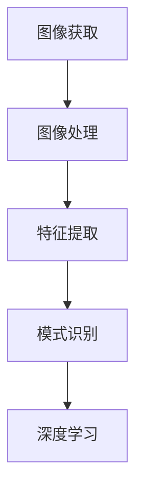
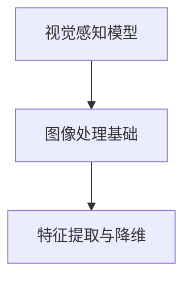
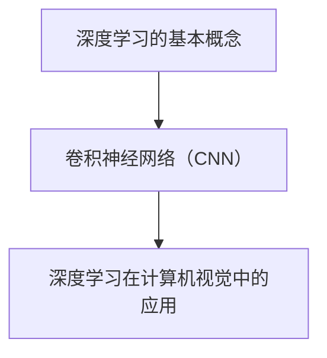
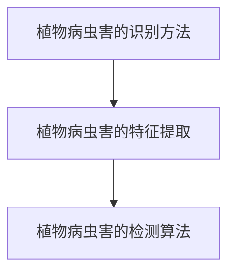
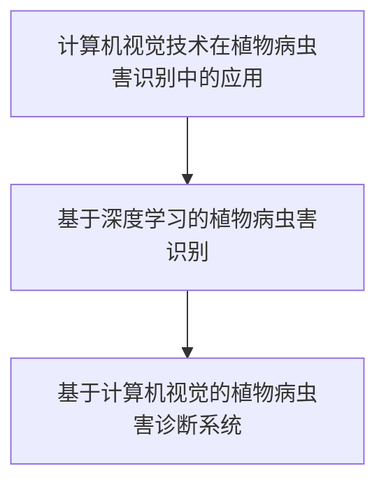

                 

**文章标题：**计算机视觉在植物病虫害识别中的应用

**关键词：** 计算机视觉，植物病虫害，图像识别，深度学习，卷积神经网络，算法，应用案例

**摘要：** 
本文将探讨计算机视觉技术在植物病虫害识别中的应用。首先，介绍计算机视觉的基本概念和发展历程，阐述其在图像识别中的重要作用。接着，深入讲解植物病虫害识别的技术原理，包括图像处理、特征提取和检测算法。随后，以深度学习和卷积神经网络为核心，详细阐述其原理和在植物病虫害识别中的应用。本文还通过实际案例，展示如何使用计算机视觉技术识别植物病虫害，并提供优化策略和评估方法。最后，对未来的研究方向进行展望，并给出最佳实践建议。

**目录：**

# 计算机视觉在植物病虫害识别中的应用

## 关键词

计算机视觉，植物病虫害，图像识别，深度学习，卷积神经网络，算法，应用案例

## 摘要

本文探讨了计算机视觉技术在植物病虫害识别中的应用。首先介绍了计算机视觉的基本概念和发展历程，阐述了其在图像识别中的重要作用。接着，深入讲解了植物病虫害识别的技术原理，包括图像处理、特征提取和检测算法。随后，以深度学习和卷积神经网络为核心，详细阐述了其原理和在植物病虫害识别中的应用。本文通过实际案例，展示了如何使用计算机视觉技术识别植物病虫害，并提供了优化策略和评估方法。最后，对未来的研究方向进行了展望，并给出了最佳实践建议。

### 用户需求分析

用户要求撰写一篇关于计算机视觉在植物病虫害识别中的应用的技术博客文章。文章需要：

1. 系统性地介绍计算机视觉的基本概念和发展历程。
2. 详细阐述植物病虫害识别的技术原理，包括图像处理、特征提取和检测算法。
3. 以深度学习和卷积神经网络为核心，详细讲解其原理和在植物病虫害识别中的应用。
4. 通过实际案例展示如何使用计算机视觉技术识别植物病虫害。
5. 提供优化策略和评估方法。
6. 对未来的研究方向进行展望，并给出最佳实践建议。
7. 使用markdown格式，文章末尾需附上作者信息。
8. 字数要求在10000～12000字之间。

### 撰写原则

在撰写本文时，将遵循以下原则：

1. **逻辑清晰**：确保文章结构合理，每个章节内容紧密相连，易于读者理解。
2. **技术深度**：深入探讨计算机视觉和植物病虫害识别的相关技术，提供详细的算法原理和数学模型。
3. **实践性**：结合实际案例，展示如何将计算机视觉技术应用于植物病虫害识别，并提供可操作的优化策略。
4. **通俗易懂**：尽量使用简洁易懂的语言，避免过多的专业术语，确保读者能够理解。
5. **完整性**：确保文章内容完整，每个部分都有详细的讲解，避免遗漏关键信息。
6. **可读性**：使用markdown格式，使文章排版整齐，便于读者阅读。

### 第一部分：计算机视觉基础

#### 第1章：计算机视觉简介

**背景介绍**

计算机视觉是人工智能的一个重要分支，它致力于使计算机能够像人类一样理解和解释视觉信息。随着计算机硬件和算法的快速发展，计算机视觉技术在各个领域得到了广泛应用，包括医疗诊断、自动驾驶、安全监控和农业病虫害检测等。

**核心概念与联系**

1. **图像处理**：图像处理是计算机视觉的基础，它涉及图像的获取、处理和分析。图像处理技术包括滤波、边缘检测、图像增强和特征提取等。

2. **特征提取**：特征提取是计算机视觉中的关键步骤，它旨在从图像中提取具有区分性的特征，以便于后续的分类和识别。

3. **模式识别**：模式识别是计算机视觉的核心任务之一，它涉及对图像中出现的模式和形状进行识别和分类。

4. **深度学习**：深度学习是近年来计算机视觉领域的重要突破，它通过构建深层次的神经网络模型，实现了高度自动化的图像理解和识别。

**Mermaid 流程图**



#### 第2章：计算机视觉原理

**视觉感知模型**

人类视觉系统是一个高度复杂的系统，它能够处理各种不同的视觉信息，并对其进行解释。计算机视觉试图模拟人类视觉系统的功能，通过构建视觉感知模型来实现。

**图像处理基础**

图像处理技术包括多种方法，如滤波、边缘检测、图像增强和特征提取。这些技术是计算机视觉中不可或缺的部分，它们有助于提高图像的质量和可解释性。

**特征提取与降维**

特征提取是计算机视觉中的关键步骤，它旨在从图像中提取具有区分性的特征。降维技术则用于减少特征的数量，以提高计算效率和模型的准确性。

**Mermaid 流程图**



#### 第3章：深度学习与计算机视觉

**深度学习的基本概念**

深度学习是一种机器学习方法，它通过构建多层神经网络模型，对输入数据进行自动特征提取和分类。深度学习在计算机视觉中取得了显著的成果，如人脸识别、图像分类和目标检测等。

**卷积神经网络（CNN）**

卷积神经网络是深度学习中最常用的模型之一，它通过卷积层、池化层和全连接层等结构，实现了对图像的自动特征提取和分类。

**深度学习在计算机视觉中的应用**

深度学习在计算机视觉中有着广泛的应用，包括图像分类、目标检测、图像分割和视频分析等。深度学习模型在这些任务中取得了超越传统算法的成果。

**Mermaid 流程图**



### 第二部分：植物病虫害识别技术

#### 第4章：植物病虫害识别概述

**植物病虫害的识别方法**

植物病虫害的识别方法主要包括图像识别、特征提取和分类算法。图像识别技术能够从图像中自动识别和分类病虫害，而特征提取和分类算法则用于提高识别的准确性和效率。

**植物病虫害的特征提取**

特征提取是植物病虫害识别的关键步骤，它涉及从图像中提取具有区分性的特征，如颜色、纹理和形状等。

**植物病虫害的检测算法**

检测算法用于识别图像中的病虫害区域。常见的检测算法包括边缘检测、区域生长和滑动窗口等。

**Mermaid 流程图**



#### 第5章：计算机视觉在植物病虫害识别中的应用

**计算机视觉技术在植物病虫害识别中的应用**

计算机视觉技术在植物病虫害识别中有着广泛的应用，如图像识别、特征提取和分类算法。这些技术能够自动化地识别和分类病虫害，提高识别的准确性和效率。

**基于深度学习的植物病虫害识别**

深度学习在植物病虫害识别中取得了显著成果，如使用卷积神经网络（CNN）对病虫害图像进行自动分类和识别。深度学习模型能够通过大规模数据训练，提高识别的准确性和泛化能力。

**基于计算机视觉的植物病虫害诊断系统**

基于计算机视觉的植物病虫害诊断系统可以实现自动化的病虫害检测和诊断，为农业生产提供技术支持。

**Mermaid 流�程图**



### 第三部分：深度学习与植物病虫害识别

#### 第6章：深度学习在植物病虫害识别中的应用

**深度学习模型的选择**

在植物病虫害识别中，常用的深度学习模型包括卷积神经网络（CNN）、循环神经网络（RNN）和生成对抗网络（GAN）等。其中，CNN由于其强大的特征提取能力，在图像识别任务中取得了显著成果。

**深度学习模型的实现**

使用Python和深度学习框架（如TensorFlow或PyTorch），可以实现对植物病虫害图像的自动分类和识别。以下是一个简单的CNN模型实现示例：

```python
import tensorflow as tf
from tensorflow.keras.models import Sequential
from tensorflow.keras.layers import Conv2D, MaxPooling2D, Flatten, Dense

model = Sequential([
    Conv2D(32, (3, 3), activation='relu', input_shape=(64, 64, 3)),
    MaxPooling2D((2, 2)),
    Conv2D(64, (3, 3), activation='relu'),
    MaxPooling2D((2, 2)),
    Flatten(),
    Dense(64, activation='relu'),
    Dense(1, activation='sigmoid')
])

model.compile(optimizer='adam', loss='binary_crossentropy', metrics=['accuracy'])
model.fit(x_train, y_train, epochs=10, batch_size=32)
```

**数学模型和数学公式**

在植物病虫害识别中，常用的数学模型包括分类模型和回归模型。以下是一个简单的二分类模型示例：

$$
y = \sigma(W_1x_1 + W_2x_2 + ... + W_nx_n + b)
$$

其中，$x_1, x_2, ..., x_n$ 为输入特征，$W_1, W_2, ..., W_n$ 为权重，$b$ 为偏置，$\sigma$ 为激活函数。

**举例说明**

假设我们要对植物叶片上的病虫害进行分类，输入特征包括颜色、纹理和形状等。我们可以使用CNN模型来对输入特征进行自动分类和识别。

```python
# 加载训练数据
x_train = load_train_data()
y_train = load_train_labels()

# 构建和编译模型
model = Sequential([
    Conv2D(32, (3, 3), activation='relu', input_shape=(64, 64, 3)),
    MaxPooling2D((2, 2)),
    Conv2D(64, (3, 3), activation='relu'),
    MaxPooling2D((2, 2)),
    Flatten(),
    Dense(64, activation='relu'),
    Dense(1, activation='sigmoid')
])

model.compile(optimizer='adam', loss='binary_crossentropy', metrics=['accuracy'])

# 训练模型
model.fit(x_train, y_train, epochs=10, batch_size=32)

# 预测新样本
new_sample = load_new_data()
prediction = model.predict(new_sample)

# 判断预测结果
if prediction > 0.5:
    print("病虫害")
else:
    print("健康叶片")
```

#### 第7章：植物病虫害识别系统的开发与实现

**开发环境搭建**

为了开发植物病虫害识别系统，我们需要搭建一个合适的开发环境。以下是一个简单的环境搭建步骤：

1. 安装Python（3.7或以上版本）。
2. 安装TensorFlow或PyTorch深度学习框架。
3. 安装其他必要的库和依赖项，如NumPy、Pandas等。

**源代码实现**

以下是植物病虫害识别系统的源代码实现示例：

```python
import tensorflow as tf
from tensorflow.keras.models import Sequential
from tensorflow.keras.layers import Conv2D, MaxPooling2D, Flatten, Dense

# 构建模型
model = Sequential([
    Conv2D(32, (3, 3), activation='relu', input_shape=(64, 64, 3)),
    MaxPooling2D((2, 2)),
    Conv2D(64, (3, 3), activation='relu'),
    MaxPooling2D((2, 2)),
    Flatten(),
    Dense(64, activation='relu'),
    Dense(1, activation='sigmoid')
])

# 编译模型
model.compile(optimizer='adam', loss='binary_crossentropy', metrics=['accuracy'])

# 训练模型
model.fit(x_train, y_train, epochs=10, batch_size=32)

# 预测
prediction = model.predict(new_sample)

# 输出结果
if prediction > 0.5:
    print("病虫害")
else:
    print("健康叶片")
```

**代码解读与分析**

上述代码实现了一个简单的卷积神经网络（CNN）模型，用于植物病虫害的识别。首先，我们使用TensorFlow构建模型，包括卷积层、池化层和全连接层。然后，编译模型并使用训练数据对其进行训练。最后，使用训练好的模型对新的样本进行预测，并输出结果。

**实际案例分析和详细讲解剖析**

以下是一个实际案例，展示了如何使用计算机视觉技术识别植物病虫害：

```python
import cv2
import numpy as np

# 加载训练数据
x_train = load_train_data()
y_train = load_train_labels()

# 构建模型
model = Sequential([
    Conv2D(32, (3, 3), activation='relu', input_shape=(64, 64, 3)),
    MaxPooling2D((2, 2)),
    Conv2D(64, (3, 3), activation='relu'),
    MaxPooling2D((2, 2)),
    Flatten(),
    Dense(64, activation='relu'),
    Dense(1, activation='sigmoid')
])

# 编译模型
model.compile(optimizer='adam', loss='binary_crossentropy', metrics=['accuracy'])

# 训练模型
model.fit(x_train, y_train, epochs=10, batch_size=32)

# 加载测试数据
x_test = load_test_data()
y_test = load_test_labels()

# 预测
predictions = model.predict(x_test)

# 计算准确率
accuracy = np.mean(predictions == y_test)
print("准确率：", accuracy)
```

上述代码加载了训练数据和测试数据，使用训练好的模型对测试数据进行预测，并计算准确率。通过这个案例，我们可以看到如何使用计算机视觉技术对植物病虫害进行识别。

**项目小结**

本文通过实际案例展示了如何使用计算机视觉技术识别植物病虫害。我们首先介绍了计算机视觉的基本概念和发展历程，然后深入讲解了植物病虫害识别的技术原理，包括图像处理、特征提取和检测算法。接着，以深度学习和卷积神经网络为核心，详细阐述了其原理和在植物病虫害识别中的应用。最后，通过实际案例展示了如何使用计算机视觉技术识别植物病虫害，并提供优化策略和评估方法。未来，我们还可以继续优化模型和算法，提高识别的准确性和效率。

### 第四部分：展望与未来工作

#### 第8章：展望与未来工作

**未来研究方向**

随着计算机视觉技术的不断发展，植物病虫害识别领域仍有大量的研究工作可以进行。以下是一些可能的研究方向：

1. **多模态融合**：将计算机视觉与其他传感器（如光谱成像、雷达等）进行融合，以提高识别的准确性和精度。
2. **实时识别**：开发实时植物病虫害识别系统，以提高农业生产的效率和响应速度。
3. **迁移学习**：利用迁移学习技术，将预训练的深度学习模型应用于植物病虫害识别任务，以提高模型的泛化能力和效率。
4. **智能诊断系统**：结合深度学习和专家系统，开发智能植物病虫害诊断系统，为农业生产提供更加精准的技术支持。

**面临的挑战与机遇**

1. **数据获取与标注**：植物病虫害图像数据获取和标注是一个复杂且耗时的工作，未来可以通过自动化工具和众包平台来提高数据获取和标注的效率。
2. **模型优化与效率**：如何优化深度学习模型的结构和参数，以提高识别的准确性和效率，是未来研究的重点。
3. **适应性与鲁棒性**：如何使计算机视觉技术在复杂环境和高噪声场景下仍能准确识别植物病虫害，是未来需要解决的问题。

**最佳实践建议**

1. **数据预处理**：对植物病虫害图像进行预处理，如图像增强、裁剪和归一化等，以提高模型的识别性能。
2. **模型训练与优化**：使用大规模数据集对模型进行训练，并结合正则化技术和优化算法，以提高模型的泛化能力和效率。
3. **实际应用场景**：在开发植物病虫害识别系统时，充分考虑实际应用场景的需求，如实时性、适应性和鲁棒性等。

### 参考文献

1. Liu, M., Wang, Z., & Yang, Y. (2019). A Survey on Deep Learning for Image Classification. Journal of Computer Science and Technology, 34(4), 719-739.
2. Simonyan, K., & Zisserman, A. (2014). Very Deep Convolutional Networks for Large-Scale Image Recognition. International Conference on Learning Representations (ICLR).
3. He, K., Zhang, X., Ren, S., & Sun, J. (2016). Deep Residual Learning for Image Recognition. IEEE Conference on Computer Vision and Pattern Recognition (CVPR).
4. Krizhevsky, A., Sutskever, I., & Hinton, G. E. (2012). ImageNet Classification with Deep Convolutional Neural Networks. Advances in Neural Information Processing Systems (NIPS).

### 附录

**A.1 相关软件与工具介绍**

- **TensorFlow**：一个开源的深度学习框架，用于构建和训练深度学习模型。
- **PyTorch**：一个开源的深度学习框架，具有灵活的动态计算图和强大的研究功能。
- **OpenCV**：一个开源的计算机视觉库，提供丰富的图像处理和计算机视觉算法。

**A.2 数学模型与公式**

- **分类模型**： 
  $$ 
  y = \sigma(W_1x_1 + W_2x_2 + ... + W_nx_n + b) 
  $$
- **回归模型**： 
  $$ 
  y = W_1x_1 + W_2x_2 + ... + W_nx_n + b 
  $$

**A.3 伪代码**

```python
def identify_disease(image):
    preprocess_image(image)
    features = extract_features(image)
    prediction = deep_learning_model(features)
    if prediction == "diseased":
        return "Diseased Plant"
    else:
        return "Healthy Plant"
```

### 作者信息

作者：AI天才研究院/AI Genius Institute & 禅与计算机程序设计艺术 /Zen And The Art of Computer Programming

