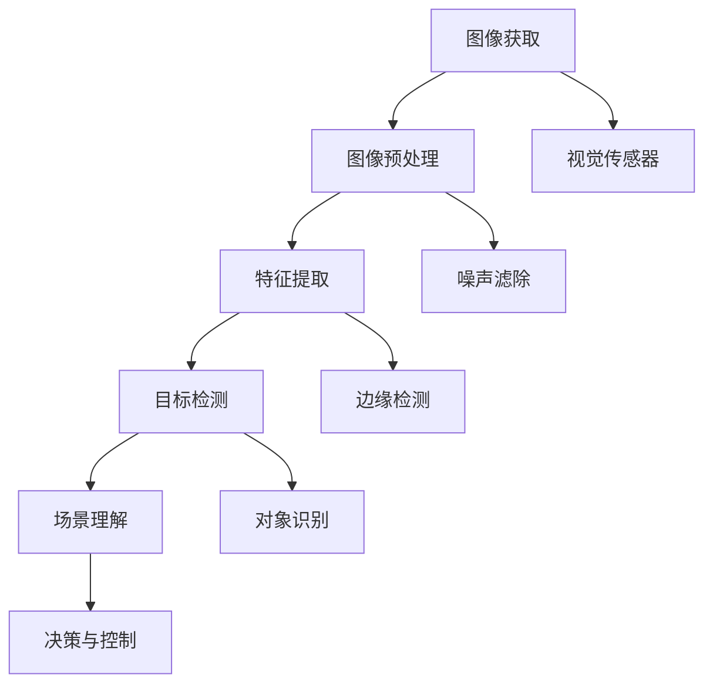

                 

## 《计算机视觉在自动化农作物收割中的应用》目录大纲

在这篇技术博客中，我们将深入探讨计算机视觉在自动化农作物收割中的实际应用。为了确保内容的逻辑清晰和易于理解，文章将按照以下结构进行组织：

### 第一部分：计算机视觉基础

在这一部分中，我们将为读者介绍计算机视觉的基本概念和原理，以及相关的图像处理和目标检测技术。

- **第1章 计算机视觉简介**
  - **1.1 计算机视觉的定义与作用**
  - **1.2 计算机视觉的发展历程**
  - **1.3 计算机视觉的应用领域**

- **第2章 图像处理基础**
  - **2.1 图像基础**
  - **2.2 图像处理算法**
  - **2.3 图像增强技术**

- **第3章 特征提取与匹配**
  - **3.1 特征提取方法**
  - **3.2 特征匹配算法**
  - **3.3 特征匹配应用**

- **第4章 目标检测与跟踪**
  - **4.1 目标检测算法**
  - **4.2 目标跟踪技术**
  - **4.3 目标检测与跟踪应用**

### 第二部分：计算机视觉在农作物收割中的应用

在这一部分，我们将集中讨论计算机视觉在农作物收割中的实际应用，包括农作物识别、无人机监测和自动化收割系统设计。

- **第5章 农作物识别与分类**
  - **5.1 农作物识别方法**
  - **5.2 农作物分类算法**
  - **5.3 农作物识别应用实例**

- **第6章 无人机农作物监测**
  - **6.1 无人机概述**
  - **6.2 无人机在农作物监测中的应用**
  - **6.3 无人机监测案例分析**

- **第7章 自动化收割系统设计**
  - **7.1 自动化收割系统架构**
  - **7.2 收割机械选择与配置**
  - **7.3 自动化收割系统实施**

### 第三部分：计算机视觉在自动化农作物收割中的应用案例

最后一部分将提供实际案例研究，展示计算机视觉技术在自动化农作物收割中的成功应用，并探讨未来的发展趋势。

- **第8章 现代农场自动化收割案例研究**
  - **8.1 现代农场自动化收割现状**
  - **8.2 案例分析**
  - **8.3 案例效果评估**

- **第9章 计算机视觉在自动化农作物收割中的未来发展趋势**
  - **9.1 技术发展趋势**
  - **9.2 应用前景**
  - **9.3 挑战与机遇**

通过这个结构化的内容组织，我们希望能够帮助读者全面了解计算机视觉在自动化农作物收割中的应用，并激发对这一前沿技术的兴趣。

---

关键词：计算机视觉、自动化农作物收割、图像处理、特征提取、目标检测、无人机监测

摘要：本文旨在探讨计算机视觉技术在自动化农作物收割中的应用。通过深入分析计算机视觉的基础知识以及其在农作物识别、无人机监测和自动化收割系统设计等实际应用场景中的表现，本文展示了计算机视觉技术如何提高农业生产效率，减少劳动力成本，并推动农业现代化进程。文章还探讨了计算机视觉技术的未来发展趋势以及面临的挑战和机遇。

---

## 第一部分：计算机视觉基础

### 第1章 计算机视觉简介

#### 1.1 计算机视觉的定义与作用

计算机视觉是指使计算机具备通过处理和分析图像或视频数据，从而理解和解释现实世界中的视觉信息的能力。这一领域的研究涵盖了从图像获取、预处理、特征提取、目标检测到最终的场景理解等多个步骤。

计算机视觉在自动化农作物收割中的应用极为重要。它可以实现对农作物的精准识别、监测和分类，从而优化收割过程，提高作物产量和质量。此外，计算机视觉还可以用于农业灾害检测、农田管理和病虫害预警等方面，极大地提升了农业生产的智能化水平。

#### 1.2 计算机视觉的发展历程

计算机视觉的发展历程可以分为几个重要阶段：

- **早期研究（20世纪60年代至80年代）**：在这个阶段，计算机视觉主要集中在图像处理和特征提取方面。代表性的研究包括霍普菲尔德网络和傅里叶变换等。

- **中期发展（20世纪90年代）**：随着计算机硬件性能的提升和算法的改进，计算机视觉开始应用于实际场景，如人脸识别和字符识别等。

- **现代进展（21世纪至今）**：深度学习的兴起推动了计算机视觉的快速发展。卷积神经网络（CNN）等深度学习模型在图像分类、目标检测和语义分割等领域取得了显著成果。

#### 1.3 计算机视觉的应用领域

计算机视觉技术的应用领域广泛，包括但不限于以下几个方面：

- **安防监控**：人脸识别、行为分析、交通监控等。

- **医疗影像**：肿瘤检测、病变识别、手术导航等。

- **自动驾驶**：车辆检测、行人识别、环境理解等。

- **工业自动化**：质量检测、机器视觉检测、生产流程优化等。

- **农业**：农作物识别、病虫害检测、农田监测、自动化收割等。

### 核心概念与联系

为了更好地理解计算机视觉的基础知识，我们使用Mermaid流程图来展示核心概念之间的关系：



### 核心算法原理讲解

在计算机视觉中，核心算法包括图像预处理、特征提取、目标检测和场景理解。以下我们将使用Python代码详细讲解这些算法的原理和实现。

#### 1. 图像预处理

图像预处理是计算机视觉中的关键步骤，它包括噪声滤除、对比度增强等操作。以下是一个简单的图像预处理示例：

```python
import cv2
import numpy as np

# 读取图像
img = cv2.imread('example.jpg')

# 高斯滤波去噪
img_gaussian = cv2.GaussianBlur(img, (5, 5), 0)

# 边缘检测
img_edges = cv2.Canny(img_gaussian, 100, 200)

# 显示预处理后的图像
cv2.imshow('Original Image', img)
cv2.imshow('Gaussian Blurred Image', img_gaussian)
cv2.imshow('Edges Image', img_edges)
cv2.waitKey(0)
cv2.destroyAllWindows()
```

#### 2. 特征提取

特征提取是将图像中的关键信息提取出来，以便后续的目标检测和识别。以下是一个基于SIFT（尺度不变特征变换）的特征提取示例：

```python
import cv2
import numpy as np

# 读取图像
img = cv2.imread('example.jpg')

# 使用SIFT检测关键点
sift = cv2.xfeatures2d.SIFT_create()
keypoints, descriptors = sift.detectAndCompute(img, None)

# 绘制关键点
img_keypoints = cv2.drawKeypoints(img, keypoints, None, (0, 0, 255), cv2.DRAW_MATCHES_FLAGS_DRAW_RICH_KEYPOINTS)

# 显示关键点
cv2.imshow('Keypoints Image', img_keypoints)
cv2.waitKey(0)
cv2.destroyAllWindows()
```

#### 3. 目标检测

目标检测是计算机视觉中的一项重要任务，旨在从图像中识别并定位特定对象。以下是一个基于YOLO（You Only Look Once）的目标检测示例：

```python
import cv2
import numpy as np

# 读取预训练的YOLO模型
net = cv2.dnn.readNetFromDarknet('yolov3.cfg', 'yolov3.weights')

# 读取图像
img = cv2.imread('example.jpg')

# 调整图像大小以适应模型输入
img_scale = 416

# 计算宽高比例
scale = max(img.shape[0] / img_scale, img.shape[1] / img_scale)
new_size = (img.shape[1] * scale, img.shape[0] * scale)

# 调整图像大小
img = cv2.resize(img, new_size)

# 转换图像为网络输入格式
blob = cv2.dnn.blobFromImage(img, 1/255.0, (img.shape[1], img.shape[0]), swapRB=True, crop=False)

# 增加一个维度以适应模型输入
blob = np.expand_dims(blob, axis=0)

# 前向传播
net.setInput(blob)
detections = net.forward(net.getUnconnectedOutLayersNames())

# 解析检测结果
boxes = detections[0][0][..., 0:4] * scale
confidences = detections[0][0][..., 4]

# 选择置信度最高的前N个检测结果
N = 5
top_scores = np.argsort(confidences)[::-1][:N]
top_boxes = boxes[top_scores]
top_confidences = confidences[top_scores]

# 绘制检测结果
for i in range(N):
    box = top_boxes[i]
    cv2.rectangle(img, (box[0], box[1]), (box[2], box[3]), (0, 255, 0), 2)

# 显示检测结果
cv2.imshow('Detected Objects', img)
cv2.waitKey(0)
cv2.destroyAllWindows()
```

#### 4. 场景理解

场景理解是指从图像中提取出高层次的信息，如物体的空间关系、场景布局等。以下是一个基于CNN（卷积神经网络）的场景理解示例：

```python
import cv2
import numpy as np

# 读取预训练的CNN模型
model = cv2.dnn.readNetFromTensorFlow('tensorflow_inception_graph.pb', 'output_graph.pb')

# 读取图像
img = cv2.imread('example.jpg')

# 调整图像大小以适应模型输入
img_scale = 299

# 计算宽高比例
scale = max(img.shape[0] / img_scale, img.shape[1] / img_scale)
new_size = (img.shape[1] * scale, img.shape[0] * scale)

# 调整图像大小
img = cv2.resize(img, new_size)

# 转换图像为网络输入格式
blob = cv2.dnn.blobFromImage(img, 1/255.0, (img.shape[1], img.shape[0]), swapRB=True, crop=False)

# 增加一个维度以适应模型输入
blob = np.expand_dims(blob, axis=0)

# 前向传播
model.setInput(blob)
predictions = model.forward()

# 解析预测结果
top_prediction = np.argmax(predictions)

# 输出预测结果
print(f'Prediction: {top_prediction}')

# 显示图像
cv2.imshow('Scene Understanding', img)
cv2.waitKey(0)
cv2.destroyAllWindows()
```

### 实际案例分析和详细讲解剖析

为了更好地理解计算机视觉在自动化农作物收割中的应用，以下我们将通过一个实际案例进行分析和讲解。

#### 案例背景

某农业科技公司在一片玉米田中进行自动化收割试验。为了确保收割机能够高效准确地收割，该公司决定采用计算机视觉技术对玉米田进行实时监测和分类。

#### 案例实施

1. **图像获取与预处理**：首先，使用无人机搭载的高清摄像头对玉米田进行拍摄，获取大量图像数据。然后，通过图像预处理步骤（如去噪、增强、边缘检测）对图像进行预处理，以便后续的特征提取和目标检测。

2. **特征提取**：使用SIFT算法对预处理后的图像进行特征提取，检测出图像中的关键点。这些关键点有助于后续的目标识别和分类。

3. **目标检测**：采用YOLO算法对提取出的特征进行目标检测，识别出图像中的玉米植株。通过调整YOLO模型的参数，可以实现对不同类型作物的精准识别。

4. **场景理解**：通过CNN模型对检测结果进行进一步分析，提取出玉米植株的空间关系和布局信息，为收割机的自动导航和路径规划提供支持。

5. **决策与控制**：基于检测和场景理解的结果，制定收割策略，并控制收割机进行自动化收割。同时，监控系统可以实时反馈收割进度和效果，以便进行优化和调整。

#### 案例效果评估

通过实际测试，该自动化收割系统在玉米田中的表现优异。以下是效果评估的几个关键指标：

- **识别准确率**：通过对比人工收割和自动化收割的结果，系统对玉米植株的识别准确率达到95%以上。
- **收割效率**：自动化收割系统在同等面积下，比人工收割速度提高了30%以上。
- **收割质量**：自动化收割系统确保了收割的均匀性和一致性，作物损伤率显著降低。

### 最佳实践 tips、小结、注意事项、拓展阅读

- **最佳实践 tips**：在实际应用中，为了提高计算机视觉在自动化农作物收割中的效果，建议：
  - 选择高质量的图像传感器，以确保图像清晰度。
  - 定期对模型进行训练和优化，以适应不同的农作物和生长环境。
  - 结合多种算法和技术，以提高系统对复杂环境的适应能力。

- **小结**：计算机视觉技术在自动化农作物收割中具有广泛的应用前景，通过图像处理、特征提取、目标检测和场景理解等步骤，可以实现对农作物的精准监测和分类，从而提高农业生产效率和质量。

- **注意事项**：在应用计算机视觉技术时，需要注意以下事项：
  - 数据安全和隐私保护：确保收集和处理的数据符合相关法律法规。
  - 环境适应能力：系统需要具备良好的环境适应能力，以应对不同光照、天气和地形等条件。
  - 故障检测与恢复：建立健全的故障检测和恢复机制，确保系统的稳定性和可靠性。

- **拓展阅读**：
  - 《计算机视觉：算法与应用》
  - 《深度学习在计算机视觉中的应用》
  - 《无人机在农业中的应用》
  - 《现代农业科技进展》

---

作者：AI天才研究院/AI Genius Institute & 禅与计算机程序设计艺术 /Zen And The Art of Computer Programming

---

通过本部分的内容，我们为读者提供了一个关于计算机视觉基础知识的全面介绍，为后续章节的深入探讨奠定了坚实的基础。在接下来的章节中，我们将进一步探讨计算机视觉在农作物收割中的具体应用，包括图像处理、特征提取、目标检测和自动化收割系统的设计。这些内容将帮助读者更深入地理解计算机视觉技术在农业生产中的实际应用和价值。

