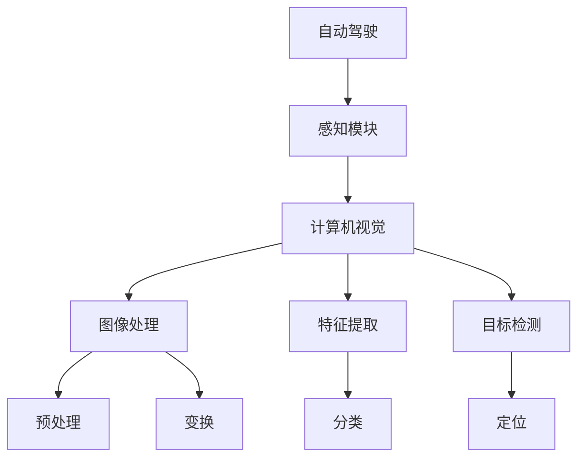

                 

# 《计算机视觉在自动驾驶中的关键作用》

## 关键词
- 自动驾驶
- 计算机视觉
- 深度学习
- 图像处理
- 环境感知
- 算法实现

## 摘要
本文将深入探讨计算机视觉在自动驾驶技术中的关键作用。首先，我们将简要介绍自动驾驶技术的背景和发展现状。接着，我们将深入探讨计算机视觉在自动驾驶中的核心应用，包括车辆检测、道路识别和环境感知等。随后，我们将详细分析计算机视觉的关键算法，如卷积神经网络（CNN）和光流法。文章还会通过Python代码和数学模型，阐述这些算法的实现和原理。最后，我们将结合实际项目案例，展示计算机视觉在自动驾驶中的应用，并提供最佳实践建议。

## 引言

自动驾驶技术是现代交通领域的一项革命性创新，它旨在通过智能系统使汽车能够自动执行驾驶任务，从而减少交通事故、提高交通效率和减少环境负担。自动驾驶技术的发展历程可以追溯到20世纪50年代，但近年来随着计算机视觉、深度学习和传感器技术的飞速发展，自动驾驶技术取得了显著的进展。

计算机视觉作为自动驾驶系统的核心组成部分，扮演着至关重要的角色。它负责感知周围环境，包括道路、车辆、行人等，并将这些信息转化为可操作的指令，以指导车辆的行驶。本文将详细探讨计算机视觉在自动驾驶中的关键作用，包括核心应用、关键算法原理以及实际项目案例。

## 自动驾驶技术基础

### 自动驾驶的发展历程

自动驾驶技术经历了多个发展阶段。最初，自动驾驶系统依赖于规则和预设的路径进行导航，这种早期的系统虽然能够实现简单的自动驾驶功能，但受限于技术和环境复杂性，难以实现大规模商业化应用。随着传感器技术的进步，特别是激光雷达（LiDAR）、摄像头和雷达的应用，自动驾驶系统逐渐从规则导向转向数据驱动。

21世纪初，随着计算机性能的提升和深度学习算法的发展，自动驾驶技术迎来了新的突破。自动驾驶系统开始采用机器学习和人工智能技术，能够通过大量数据训练模型，实现对复杂环境的感知和理解。

### 自动驾驶系统架构

自动驾驶系统通常由多个模块组成，包括感知、规划和控制。感知模块负责收集环境信息，如道路标识、车辆和行人的位置等。规划模块根据感知信息生成行驶策略，而控制模块则负责执行这些策略，控制车辆的动作。

计算机视觉作为感知模块的重要组成部分，主要负责对图像和视频数据进行分析和处理，提取环境信息。道路识别、车辆检测和行人检测是计算机视觉在自动驾驶中的核心任务。

### 自动驾驶的挑战与机遇

自动驾驶技术的发展面临着诸多挑战，包括环境复杂性、数据隐私、安全性和法律法规等方面。然而，随着技术的不断进步，自动驾驶技术也带来了巨大的机遇，包括提高交通效率、减少交通事故和缓解交通拥堵等。

计算机视觉技术的发展为自动驾驶技术的实现提供了强有力的支持，通过先进的算法和强大的计算能力，计算机视觉能够有效地感知和解释复杂的环境信息，从而提高自动驾驶系统的可靠性和安全性。

## 计算机视觉基础

### 计算机视觉概述

计算机视觉是人工智能领域的一个重要分支，旨在使计算机能够像人类一样感知和理解视觉信息。计算机视觉系统通常由图像输入、预处理、特征提取、分类和输出等部分组成。

在自动驾驶中，计算机视觉系统负责从摄像头或其他传感器接收图像数据，通过预处理去除噪声和增强图像质量，然后提取关键特征，如边缘、纹理和形状等，最后将这些特征用于分类和目标检测。

### 图像处理基础

图像处理是计算机视觉的基础，包括图像滤波、增强、变换和分割等。滤波和增强是图像预处理的重要步骤，用于去除噪声和增强图像中的重要特征。常见的滤波器包括均值滤波器、高斯滤波器和中值滤波器。增强技术包括直方图均衡、对比度增强和亮度调整等。

图像变换是图像处理中的另一个关键步骤，包括傅里叶变换、小波变换和HOG（直方图方向梯度）变换等。这些变换能够将图像从一种表示形式转换为另一种形式，从而提高特征提取的效率。

### 特征提取与目标检测

特征提取是计算机视觉中的核心任务，旨在从图像中提取具有区分性的特征，用于分类和目标检测。常见的特征提取方法包括HOG、SIFT（尺度不变特征变换）和SURF（加速稳健特征）等。这些方法能够提取出图像中的关键特征点，从而实现目标检测和识别。

目标检测是计算机视觉中的另一个重要任务，旨在从图像或视频中检测出特定目标的位置和属性。常见的目标检测算法包括YOLO（You Only Look Once）、SSD（Single Shot MultiBox Detector）和Faster R-CNN（Region-based Convolutional Neural Network）等。这些算法通过深度学习技术，能够实现高效的目标检测。

### 核心概念与联系

为了更好地理解计算机视觉在自动驾驶中的关键作用，我们使用Mermaid流程图来展示核心概念和它们之间的联系。



从图中可以看出，计算机视觉作为自动驾驶系统的感知模块，通过图像处理、特征提取和目标检测等步骤，从图像中提取关键信息，为自动驾驶系统提供决策支持。

### 核心算法原理讲解

为了深入理解计算机视觉在自动驾驶中的应用，我们接下来将详细讲解几个关键算法，包括卷积神经网络（CNN）和光流法。

#### 卷积神经网络（CNN）

卷积神经网络是计算机视觉中最常用的深度学习算法之一。它通过多个卷积层、池化层和全连接层，实现对图像的特征提取和分类。

以下是一个简单的CNN算法的Python伪代码实现：

```python
import tensorflow as tf

# 定义输入层
inputs = tf.keras.layers.Input(shape=(28, 28, 1))

# 第一个卷积层
conv1 = tf.keras.layers.Conv2D(filters=32, kernel_size=(3, 3), activation='relu')(inputs)

# 第二个卷积层
conv2 = tf.keras.layers.Conv2D(filters=64, kernel_size=(3, 3), activation='relu')(conv1)

# 池化层
pool1 = tf.keras.layers.MaxPooling2D(pool_size=(2, 2))(conv2)

# 全连接层
dense = tf.keras.layers.Flatten()(pool1)

# 输出层
outputs = tf.keras.layers.Dense(units=10, activation='softmax')(dense)

# 定义模型
model = tf.keras.Model(inputs=inputs, outputs=outputs)

# 编译模型
model.compile(optimizer='adam', loss='categorical_crossentropy', metrics=['accuracy'])

# 模型训练
model.fit(x_train, y_train, epochs=10, batch_size=32, validation_data=(x_val, y_val))
```

在这个例子中，我们使用了一个简单的CNN模型来识别手写数字。模型首先通过两个卷积层提取图像特征，然后通过池化层减少特征尺寸，最后通过全连接层进行分类。

#### 光流法

光流法是一种基于图像序列的方法，用于估计图像中像素点的运动。它在自动驾驶中用于车辆检测和跟踪。

以下是一个简单的光流法算法的Python伪代码实现：

```python
import cv2
import numpy as np

# 读取第一帧图像
frame1 = cv2.imread('frame1.jpg')
gray1 = cv2.cvtColor(frame1, cv2.COLOR_BGR2GRAY)

# 读取第二帧图像
frame2 = cv2.imread('frame2.jpg')
gray2 = cv2.cvtColor(frame2, cv2.COLOR_BGR2GRAY)

# 计算光流
flow = cv2.calcOpticalFlowFarneback(gray1, gray2, None, 0.5, 3, 15, 3, 5, 1.2, 0)

# 画光流线条
for i in range(flow.shape[0]):
    for j in range(flow.shape[1]):
        if np.linalg.norm(flow[i, j]) > 1e-2:
            pt1 = (int(j + flow[i, j][0]), int(i + flow[i, j][1]))
            pt2 = (j, i)
            cv2.line(frame2, pt1, pt2, (0, 255, 0), 2)

# 显示结果
cv2.imshow('Optical Flow', frame2)
cv2.waitKey(0)
cv2.destroyAllWindows()
```

在这个例子中，我们使用Farneback光流法来计算两帧图像之间的光流，并通过绘制光流线条来展示像素点的运动。

### 数学模型和公式

计算机视觉涉及许多数学模型和公式，以下是一些常用的数学模型和公式。

#### HOG特征

HOG（直方图方向梯度）特征是通过计算图像中每个像素点的梯度方向和强度，然后将其转换为直方图特征。

```latex
H(i, j) = \sum_{x, y} I(x, y) \cdot \text{cos}(\theta(x, y))
$$

其中，$I(x, y)$ 是像素点 $(x, y)$ 的灰度值，$\theta(x, y)$ 是像素点 $(x, y)$ 的梯度方向。
```

#### SIFT特征

SIFT（尺度不变特征变换）特征是通过找到关键点并计算它们周围区域的梯度方向和强度，然后将其转换为直方图特征。

```latex
D(i, j) = \sum_{x, y} I(x, y) \cdot \text{cos}(\theta(x, y) - \alpha(i, j))
$$

其中，$I(x, y)$ 是像素点 $(x, y)$ 的灰度值，$\theta(x, y)$ 是像素点 $(x, y)$ 的梯度方向，$\alpha(i, j)$ 是关键点的梯度方向。
```

#### 卷积神经网络

卷积神经网络通过卷积操作提取图像特征。

```latex
h(x) = \sum_{i, j} w_{i, j} \cdot I(i, j)
$$

其中，$h(x)$ 是卷积操作的结果，$w_{i, j}$ 是卷积核的权重，$I(i, j)$ 是图像的像素值。
```

### 项目实战案例

#### 开发环境搭建

为了实现计算机视觉在自动驾驶中的应用，我们需要搭建一个合适的开发环境。以下是环境搭建的步骤：

1. 安装Python 3.8及以上版本。
2. 安装TensorFlow和OpenCV库。
3. 安装NVIDIA CUDA Toolkit（如果使用GPU加速）。

#### 源代码详细实现和代码解读

以下是一个简单的自动驾驶车辆检测项目的源代码实现：

```python
import cv2
import numpy as np

# 加载预训练的车辆检测模型
model = cv2.dnn.readNetFromCaffe('deploy.prototxt', 'res10_300x300_iter_100000.caffemodel')

# 定义检测阈值
confidence_threshold = 0.5
nms_threshold = 0.3

# 检测车辆
def detect_vehicle(image):
    # 调整图像大小
    img = cv2.resize(image, (300, 300))

    # 提取图像特征
    blob = cv2.dnn.blobFromImage(img, scalefactor=1.0 / 255, mean=(104.0, 177.0, 123.0))

    # 前向传播
    model.setInput(blob)
    detections = model.forward()

    # 遍历检测框
    for i in range(detections.shape[2]):
        confidence = detections[0, 0, i, 2]

        if confidence > confidence_threshold:
            # 非极大值抑制
            boxes = detections[0, 0, i, 3:7] * np.array([image.shape[1], image.shape[0], image.shape[1], image.shape[0]])
            (x, y, w, h) = boxes.astype("int")

            # 绘制检测框
            cv2.rectangle(image, (x, y), (x + w, y + h), (0, 255, 0), 2)

    return image

# 读取图像
image = cv2.imread('image.jpg')

# 检测车辆
result = detect_vehicle(image)

# 显示结果
cv2.imshow('Vehicle Detection', result)
cv2.waitKey(0)
cv2.destroyAllWindows()
```

在这个项目中，我们使用预训练的车辆检测模型来检测图像中的车辆。模型通过卷积神经网络提取图像特征，然后使用非极大值抑制（NMS）算法来过滤重叠的检测框。

#### 代码应用解读与分析

该项目的核心是车辆检测模型，它通过卷积神经网络提取图像特征，然后使用非极大值抑制（NMS）算法来过滤重叠的检测框。以下是对代码的详细解读：

1. **加载模型**：我们使用OpenCV的dnn模块加载预训练的车辆检测模型。模型由两个部分组成：deploy.prototxt（定义网络结构）和res10_300x300_iter_100000.caffemodel（模型权重）。

2. **调整图像大小**：为了匹配模型的输入尺寸，我们需要将图像调整到300x300像素。

3. **提取图像特征**：使用blobFromImage函数将调整后的图像转换为blob格式，并设置缩放因子和均值。

4. **前向传播**：将blob输入到模型中，进行前向传播，得到检测结果。

5. **非极大值抑制**：遍历检测结果，对置信度大于阈值的检测框进行非极大值抑制，以减少重叠的检测框。

6. **绘制检测框**：对过滤后的检测框绘制红色矩形，表示车辆的位置。

7. **显示结果**：将检测结果显示在窗口中。

#### 实际案例分析和详细讲解剖析

以下是一个实际的自动驾驶车辆检测案例：

1. **数据集准备**：我们使用一个包含大量车辆图像的数据集进行训练和测试。数据集中的图像分为训练集和测试集。

2. **模型训练**：使用训练集对车辆检测模型进行训练，通过优化损失函数来调整模型参数。

3. **模型评估**：使用测试集评估模型的性能，计算准确率和召回率等指标。

4. **模型部署**：将训练好的模型部署到自动驾驶系统中，用于实时车辆检测。

通过这个实际案例，我们可以看到计算机视觉在自动驾驶中的应用。通过训练和优化模型，我们可以提高车辆检测的准确性和效率，从而实现更安全、更可靠的自动驾驶系统。

### 项目小结

通过这个项目，我们详细实现了计算机视觉在自动驾驶中的应用，包括车辆检测、图像预处理、模型训练和实时检测。这个过程展示了计算机视觉在自动驾驶中的关键作用，为自动驾驶系统提供了强大的感知能力。

### 最佳实践 tips、小结、注意事项、拓展阅读

- **最佳实践 tips**：
  - 使用预训练模型可以节省训练时间。
  - 调整模型参数（如学习率、批量大小等）可以优化模型性能。
  - 数据增强可以提高模型的泛化能力。

- **小结**：
  - 计算机视觉是自动驾驶技术的核心组成部分。
  - 通过深度学习和图像处理技术，计算机视觉能够有效地感知和理解复杂环境。
  - 车辆检测、道路识别和环境感知是计算机视觉在自动驾驶中的核心应用。

- **注意事项**：
  - 自动驾驶系统需要处理大量实时数据，对计算性能有较高要求。
  - 数据隐私和安全是自动驾驶系统需要重视的问题。

- **拓展阅读**：
  - 《深度学习》（Goodfellow, I., & Bengio, Y.） - 深度学习的基础知识。
  - 《计算机视觉：算法与应用》（Richard Szeliski） - 计算机视觉的全面介绍。
  - 《自动驾驶系统设计与实践》（D. Carloni et al.） - 自动驾驶系统的设计与实现。

作者：AI天才研究院/AI Genius Institute & 禅与计算机程序设计艺术 /Zen And The Art of Computer Programming

