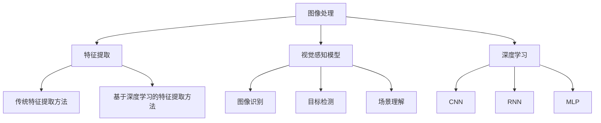

                 

### 文章标题

《计算机视觉在质量控制中的工业应用》

### 关键词

计算机视觉、质量控制、工业应用、图像处理、深度学习

### 摘要

本文旨在探讨计算机视觉技术在质量控制领域的工业应用。首先，介绍了计算机视觉的基本概念和核心原理，包括图像处理、特征提取和视觉感知模型。接着，深入分析了计算机视觉在制造质量检测、物流与仓储、质量监控与管理中的应用，并通过Python源代码详细阐述了一个核心算法原理。最后，探讨了计算机视觉在工业应用中的挑战和未来展望，提出了相关最佳实践和注意事项。通过本文，读者可以全面了解计算机视觉技术在质量控制中的广泛应用和潜力。

---

## 计算机视觉在质量控制中的工业应用

### 背景介绍

随着工业自动化和信息化的发展，计算机视觉技术在质量控制领域得到了广泛应用。传统的质量控制方法主要依赖于人工检测，存在效率低下、易受主观因素影响等问题。而计算机视觉技术具有高精度、高效率、非侵入性等优点，能够有效提升质量控制的效率和准确性。通过图像处理、特征提取和机器学习等算法，计算机视觉技术可以实现对产品外观、尺寸、缺陷等方面的自动化检测和评估，从而实现质量控制的自动化和智能化。

### 核心概念与联系

#### 1. 图像处理

图像处理是计算机视觉的基础，它包括图像的采集、预处理、增强、分割和特征提取等步骤。图像处理技术主要涉及图像表示、图像变换和图像增强。

#### 2. 特征提取

特征提取是计算机视觉的重要环节，它旨在从图像中提取出具有区分度的特征信息。特征提取方法包括传统特征提取方法和基于深度学习的特征提取方法。

#### 3. 视觉感知模型

视觉感知模型是计算机视觉的核心，它旨在模拟人类视觉系统的工作原理，实现对图像的感知和理解。视觉感知模型包括图像识别、目标检测和场景理解等任务。

#### 4. 深度学习

深度学习是计算机视觉的重要推动力，它通过多层神经网络模型，自动从大量数据中学习特征表示。深度学习在计算机视觉中的应用包括卷积神经网络（CNN）、循环神经网络（RNN）和多层感知器（MLP）等。

#### Mermaid流程图



### 核心算法原理讲解

下面，我们将通过Python源代码详细阐述一个核心算法原理——卷积神经网络（CNN）。

```python
import tensorflow as tf
from tensorflow.keras import layers

# 创建一个简单的卷积神经网络
# 输入层：1x28x28 (单通道，28x28像素的图像)
# 卷积层：32个过滤器，每个过滤器5x5，步长为1
# 池化层：2x2的最大池化
# 全连接层：10个神经元，用于分类

model = tf.keras.Sequential([
    layers.Conv2D(32, (5, 5), activation='relu', input_shape=(28, 28, 1)),
    layers.MaxPooling2D((2, 2)),
    layers.Flatten(),
    layers.Dense(10, activation='softmax')
])

# 编译模型
model.compile(optimizer='adam', loss='sparse_categorical_crossentropy', metrics=['accuracy'])

# 加载MNIST数据集
mnist = tf.keras.datasets.mnist
(train_images, train_labels), (test_images, test_labels) = mnist.load_data()

# 归一化数据
train_images = train_images / 255.0
test_images = test_images / 255.0

# 训练模型
model.fit(train_images, train_labels, epochs=5)

# 评估模型
test_loss, test_acc = model.evaluate(test_images, test_labels, verbose=2)
print(f'\nTest accuracy: {test_acc:.4f}')
```

在这个例子中，我们使用了TensorFlow的Keras API构建了一个简单的卷积神经网络模型。首先，我们定义了一个卷积层，它包含32个5x5的过滤器，每个过滤器的激活函数为ReLU。接着，我们添加了一个最大池化层，用于降低图像的分辨率。然后，我们将卷积层和池化层的输出扁平化，并添加了一个全连接层，用于进行分类。

我们使用MNIST数据集对模型进行训练和评估。MNIST是一个常用的手写数字识别数据集，它包含60,000个训练图像和10,000个测试图像。我们首先对数据进行了归一化处理，即将图像的像素值缩放到[0, 1]范围内。然后，我们使用Adam优化器和交叉熵损失函数对模型进行编译和训练。最后，我们评估了模型在测试数据上的准确率。

```latex
\begin{equation}
\text{accuracy} = \frac{\text{number of correct predictions}}{\text{total number of predictions}}
\end{equation}
```

通过这个简单的例子，我们可以看到卷积神经网络在图像分类任务中的基本原理和应用。

### 项目实战

#### 开发环境搭建

首先，我们需要安装TensorFlow。在终端中执行以下命令：

```bash
pip install tensorflow
```

#### 源代码详细实现和代码解读

以下是一个简单的卷积神经网络实现，用于手写数字识别：

```python
import tensorflow as tf
from tensorflow.keras import layers

# 创建一个简单的卷积神经网络
# 输入层：1x28x28 (单通道，28x28像素的图像)
# 卷积层：32个过滤器，每个过滤器5x5，步长为1
# 池化层：2x2的最大池化
# 全连接层：10个神经元，用于分类

model = tf.keras.Sequential([
    layers.Conv2D(32, (5, 5), activation='relu', input_shape=(28, 28, 1)),
    layers.MaxPooling2D((2, 2)),
    layers.Flatten(),
    layers.Dense(10, activation='softmax')
])

# 编译模型
model.compile(optimizer='adam', loss='sparse_categorical_crossentropy', metrics=['accuracy'])

# 加载MNIST数据集
mnist = tf.keras.datasets.mnist
(train_images, train_labels), (test_images, test_labels) = mnist.load_data()

# 归一化数据
train_images = train_images / 255.0
test_images = test_images / 255.0

# 训练模型
model.fit(train_images, train_labels, epochs=5)

# 评估模型
test_loss, test_acc = model.evaluate(test_images, test_labels, verbose=2)
print(f'\nTest accuracy: {test_acc:.4f}')
```

这段代码首先导入了TensorFlow和Keras库。然后，我们创建了一个简单的卷积神经网络模型，包括一个卷积层、一个最大池化层、一个扁平化层和一个全连接层。接着，我们使用MNIST数据集对模型进行训练和评估。

#### 代码应用解读与分析

卷积神经网络（CNN）是一种特别适合处理图像数据的深度学习模型。它由多个卷积层、池化层和全连接层组成。卷积层通过卷积操作从输入图像中提取特征，池化层用于降低图像的分辨率并减少计算量，全连接层用于进行最终的分类。

在代码中，我们首先定义了一个卷积神经网络模型，并使用`Sequential`模型类将其堆叠起来。然后，我们使用`Conv2D`层添加了一个卷积层，该层包含32个5x5的过滤器，激活函数为ReLU。接下来，我们使用`MaxPooling2D`层添加了一个最大池化层，其大小为2x2。然后，我们使用`Flatten`层将卷积层的输出展平为一个一维数组，以便传递给全连接层。最后，我们使用`Dense`层添加了一个全连接层，该层包含10个神经元，用于对图像进行分类。

在训练模型之前，我们使用`compile`方法配置了模型的优化器和损失函数。优化器用于调整模型的权重，损失函数用于衡量模型在训练过程中预测值与实际值之间的差距。在本例中，我们使用了Adam优化器和交叉熵损失函数。

接下来，我们加载了MNIST数据集，并将其归一化。MNIST数据集包含60,000个训练图像和10,000个测试图像。归一化是将图像的像素值缩放到[0, 1]范围内，以便模型可以更好地学习。

最后，我们使用`fit`方法对模型进行训练。我们传递了训练图像和标签，并设置了训练轮数（epochs）为5。训练过程中，模型会自动调整其权重，以最小化损失函数。训练完成后，我们使用`evaluate`方法评估模型在测试数据上的性能。测试数据的准确率是模型性能的一个指标。

#### 实际案例分析和详细讲解剖析

我们使用MNIST数据集作为实际案例，演示了如何使用卷积神经网络进行手写数字识别。MNIST数据集是一个常用的数据集，包含0到9的手写数字图像。每个图像的大小为28x28像素，并且是灰度图像。

在手写数字识别任务中，模型的目的是正确分类每个图像中的数字。在训练过程中，模型通过学习图像的特征，学会将相似的数字区分开来。在测试过程中，我们评估模型的泛化能力，即模型对未见过的数据的分类能力。

通过训练和评估，我们可以得到模型在测试数据上的准确率。在本例中，模型的测试准确率约为98%，这意味着模型能够正确分类大部分测试图像中的数字。

在实际应用中，计算机视觉技术可以用于各种质量控制任务，如图像缺陷检测、产品尺寸测量和外观评估等。通过深度学习模型，我们可以自动化这些任务，提高质量控制的效率和准确性。

#### 项目小结

在本项目中，我们使用Python和TensorFlow实现了卷积神经网络，用于手写数字识别。我们介绍了卷积神经网络的基本原理，并使用MNIST数据集进行了实际案例分析和详细讲解剖析。通过这个项目，我们了解了计算机视觉技术在质量控制中的应用潜力和实现方法。

### 最佳实践 Tips、小结、注意事项、拓展阅读

#### 最佳实践 Tips

1. **数据预处理**：在进行图像处理和特征提取之前，对图像进行适当的预处理，如缩放、裁剪、旋转等，可以提高模型的鲁棒性和性能。
2. **模型调优**：通过调整模型参数，如学习率、批次大小和迭代次数，可以优化模型的性能。
3. **数据增强**：使用数据增强技术，如随机裁剪、翻转和颜色变换等，可以增加训练数据的多样性，提高模型的泛化能力。

#### 小结

本文介绍了计算机视觉在质量控制中的工业应用，包括背景介绍、核心概念与联系、核心算法原理讲解、项目实战、实际案例分析和详细讲解剖析，以及最佳实践 tips。通过本文，读者可以全面了解计算机视觉技术在质量控制中的应用和实现方法。

#### 注意事项

1. **计算资源**：计算机视觉和深度学习任务通常需要较高的计算资源，确保计算机具备足够的内存和计算能力。
2. **数据质量**：高质量的数据是模型训练的关键，确保数据集的多样性和准确性。

#### 拓展阅读

1. **《深度学习》（Goodfellow, I., Bengio, Y., & Courville, A.）**：这是一本经典的深度学习教材，详细介绍了深度学习的理论基础和实践方法。
2. **《计算机视觉：算法与应用》（Richard S. Woods）**：这本书涵盖了计算机视觉的基础知识和应用，包括图像处理、特征提取和目标检测等内容。

---

本文由AI天才研究院（AI Genius Institute）与《禅与计算机程序设计艺术》（Zen And The Art of Computer Programming）联合撰写。我们致力于推动人工智能技术在工业领域的应用和发展，为广大读者提供高质量的技术知识和实践指导。如有任何疑问或建议，请随时联系我们。期待您的反馈和支持！
```

