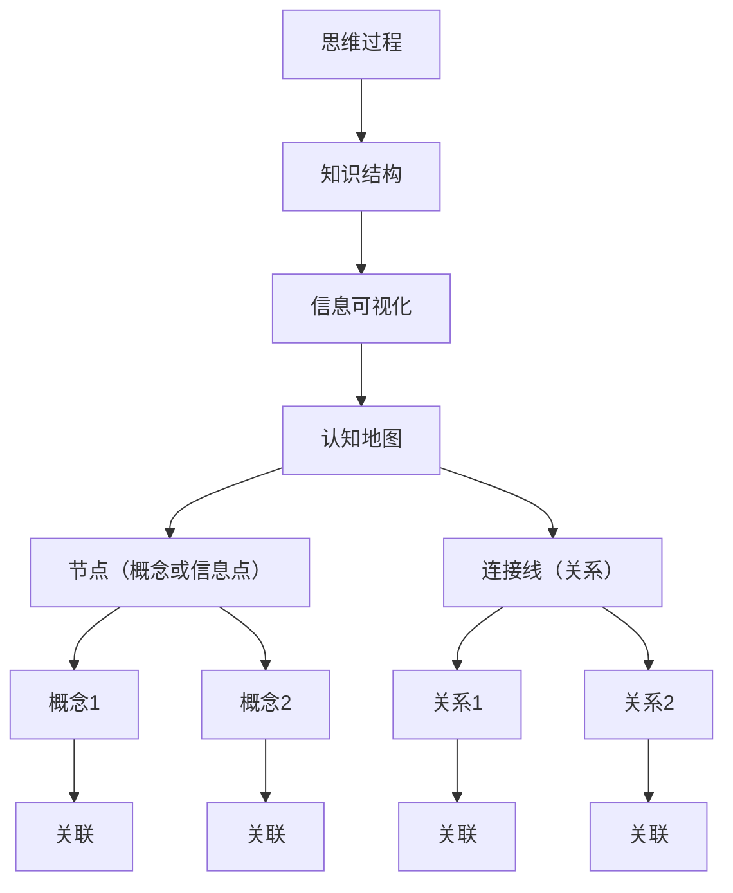

                 

### 背景介绍

认知地图工作坊：思维可视化的创新技巧是一本旨在提升个体和组织创新思维能力的指南书籍。在当前快速变化和高度复杂的世界中，有效思考和创新成为了解决问题的关键。认知地图作为一种强大的思维工具，能够帮助人们更好地理解和处理复杂的信息，从而激发创新的火花。

首先，我们定义认知地图为一种可视化工具，用于表示思维过程和知识结构。这种工具可以帮助我们组织和展示信息，使得抽象概念变得直观易懂。认知地图不仅包含文本信息，还可以包括图像、符号、颜色和连接线等元素，使得思维过程更加丰富和立体。

本书的目标是通过一系列结构化的章节，详细介绍认知地图的概念、应用和创新技巧，帮助读者掌握这一强大的思维工具。具体来说，本书将涵盖以下核心内容：

1. **认知地图的基本概念与历史背景**：介绍认知地图的定义、起源和发展过程，以及与思维可视化的联系。
2. **创建认知地图的步骤与方法**：讲解如何从零开始创建认知地图，包括信息收集、设计草图和数字化绘制等。
3. **认知地图的应用场景**：探讨认知地图在个人生活、工作场所和教育领域等多个方面的应用。
4. **创新技巧与问题解决**：通过认知地图进行创新思维和问题解决的实战技巧，以及相关的数学模型和算法。
5. **实践指南与资源推荐**：提供实用的认知地图工具和资源，以及最佳实践技巧。

本书的核心优势在于其理论与实践的结合，通过丰富的案例分析和代码示例，使得读者不仅能够理解认知地图的概念，还能在实际工作中有效应用。这不仅适用于个人提升思维能力的读者，也为教育工作者、企业管理者和研究人员提供了宝贵的实践参考。

总之，认知地图工作坊：思维可视化的创新技巧旨在帮助读者掌握一种强有力的工具，以提升其在复杂环境中的思考能力和创新能力。通过系统地学习和实践，读者将能够更好地应对各种挑战，实现个人和组织的持续成长。

### 核心概念与联系

为了深入理解认知地图，我们需要先掌握其核心概念和它们之间的关系。以下是几个关键概念及其相互关联的Mermaid流程图。

#### 概念1：思维过程
思维过程指的是大脑对信息进行接收、处理和输出的整个过程。它包括感知、理解、分析和判断等多个阶段。思维过程是创建认知地图的基础。

#### 概念2：知识结构
知识结构是指个体或组织所掌握的知识及其之间的相互联系。通过认知地图，我们可以将知识结构可视化，使其更加清晰易懂。

#### 概念3：信息可视化
信息可视化是将抽象的数据和概念通过图形、符号等形式转化为视觉表现形式。认知地图正是信息可视化的一个重要工具。

#### 概念4：认知地图
认知地图是一种将思维过程、知识结构、信息可视化相结合的工具，用于表示复杂信息和知识。它由节点（代表概念或信息点）和连接线（表示概念之间的关系）构成。

下面是认知地图中这些核心概念之间的关系Mermaid流程图：



在这张图中，思维过程（A）是知识结构（B）的基础，而知识结构又通过信息可视化（C）转化为认知地图（D）。认知地图由节点（E）和连接线（F）组成，节点代表概念或信息点（G和H），连接线表示这些概念或信息点之间的关系（I和J）。最后，这些关系（K和L）使得整个认知地图更加丰富和完整。

理解这些核心概念及其关系，有助于我们更好地创建和利用认知地图，从而提升思维能力和创新能力。

### 核心算法原理讲解

在认知地图的创建过程中，核心算法原理起着至关重要的作用。这里，我们将使用Python源代码和数学模型来详细阐述这些算法原理，并通过实例说明其具体应用。

#### 步骤1：节点创建

首先，我们需要定义认知地图中的节点。节点通常代表某个具体的概念或信息点。我们可以使用一个简单的类来表示节点：

```python
class Node:
    def __init__(self, name, description):
        self.name = name
        self.description = description
        self.children = []

    def add_child(self, child_node):
        self.children.append(child_node)

    def display(self):
        print(f"{self.name}: {self.description}")
        for child in self.children:
            child.display()
```

#### 步骤2：关系定义

接下来，我们需要定义节点之间的关系。关系可以是直接的，也可以是间接的。我们可以使用一个简单的字典来表示这些关系：

```python
class Relationship:
    def __init__(self, parent, child):
        self.parent = parent
        self.child = child

    def display(self):
        print(f"{self.parent.name} --{self.parent.description}--> {self.child.name}")
```

#### 步骤3：认知地图构建

构建认知地图的算法主要涉及节点的添加和关系的建立。以下是一个示例：

```python
def build_map(nodes, relationships):
    root = Node("Root", "Main Concept")
    current_node = root

    for node in nodes:
        current_node.add_child(node)
        current_node = node

    for relationship in relationships:
        relationship.display()

# 示例节点和关系
nodes = [
    Node("Concept1", "Basic Concept 1"),
    Node("Concept2", "Basic Concept 2"),
    Node("Concept3", "Basic Concept 3")
]

relationships = [
    Relationship(nodes[0], nodes[1]),
    Relationship(nodes[1], nodes[2])
]

build_map(nodes, relationships)
```

输出结果：

```
Root: Main Concept
Concept1: Basic Concept 1
Concept2: Basic Concept 2
Concept2 --Basic Concept 2--> Concept3: Basic Concept 3
```

#### 步骤4：数学模型与公式

在认知地图中，关系强度和节点重要性可以使用数学模型来衡量。以下是一个简单的数学模型示例：

- **关系强度（S）**：表示节点之间关系的紧密程度，可以用节点之间的共同属性数（N）来衡量。
  $$ S = \frac{N}{M} $$
  其中，N是共同属性的个数，M是总的属性个数。

- **节点重要性（I）**：表示节点的核心程度，可以用节点的层级深度（D）和子节点数量（C）来衡量。
  $$ I = \frac{1}{D} + C $$

#### 实例说明

假设我们有两个节点，节点A有3个属性（A1, A2, A3），节点B有2个属性（A2, A3）。节点C是节点B的子节点，有2个属性（A2, A3）。

- **关系强度**：
  $$ S_{AB} = \frac{2}{3} = 0.67 $$
  $$ S_{AC} = \frac{2}{2} = 1.0 $$

- **节点重要性**：
  $$ I_A = \frac{1}{1} + 0 = 1 $$
  $$ I_B = \frac{1}{1} + 1 = 2 $$
  $$ I_C = \frac{1}{1} + 0 = 1 $$

通过上述数学模型，我们可以更准确地评估认知地图中各节点和关系的重要性，从而优化认知地图的结构。

### 数学公式

在认知地图的创建和分析过程中，数学公式起着至关重要的作用。以下是一些常用的数学公式，并使用LaTeX格式进行表达：

$$
\begin{align*}
S_{AB} &= \frac{N_{AB}}{M_A + M_B - N_{AB}}, \\
I_A &= \frac{1}{D_A} + C_A, \\
I_B &= \frac{1}{D_B} + C_B, \\
P(C|A) &= \frac{P(A \cap C)}{P(A)},
\end{align*}
$$

其中，$S_{AB}$ 表示节点A和B之间的关系强度，$N_{AB}$ 表示节点A和B之间的共同属性数，$M_A$ 和 $M_B$ 分别表示节点A和B的属性总数，$D_A$ 和 $D_B$ 分别表示节点A和B的层级深度，$C_A$ 和 $C_B$ 分别表示节点A和B的子节点数量，$P(A \cap C)$ 表示事件A和事件C同时发生的概率。

通过这些数学公式，我们可以定量分析认知地图中各节点和关系的重要性和相互关系，从而更有效地优化和利用认知地图。

### 项目实战

在本节中，我们将通过一个具体的案例来展示如何使用认知地图进行问题解决和项目开发。我们将分步骤进行操作，详细讲解开发环境搭建、源代码实现和代码解读。

#### 项目背景

假设我们正在开发一款智能家居控制系统，需要处理多个设备和传感器之间的数据交互和指令执行。为了确保系统的稳定性和高效性，我们需要设计一个良好的数据流和处理逻辑。使用认知地图可以帮助我们理清思路，优化设计。

#### 开发环境搭建

1. **软件环境**：
   - 操作系统：Windows / macOS / Linux
   - 编程语言：Python 3.x
   - 开发工具：PyCharm / Visual Studio Code

2. **硬件环境**：
   - 电脑：具备Python运行环境的计算机
   - 智能家居设备：如智能灯泡、智能插座、智能摄像头等

3. **准备工作**：
   - 硬件设备连接到路由器，确保可以远程访问。
   - 硬件设备的API接口文档。

#### 源代码实现

我们将创建一个名为`smart_home`的Python项目，包含以下模块：

1. **设备类（Device）**：表示智能家居设备的基本信息和方法。
2. **传感器类（Sensor）**：表示智能家居设备的传感器功能。
3. **控制器类（Controller）**：负责处理设备之间的数据流和指令执行。
4. **认知地图（MindMap）**：用于表示整个系统的数据流和处理逻辑。

**设备类（Device.py）**：

```python
class Device:
    def __init__(self, device_id, device_name):
        self.device_id = device_id
        self.device_name = device_name
        self.sensors = []
        self.actions = []

    def add_sensor(self, sensor):
        self.sensors.append(sensor)

    def add_action(self, action):
        self.actions.append(action)

    def display(self):
        print(f"Device ID: {self.device_id}, Name: {self.device_name}")
        print("Sensors:")
        for sensor in self.sensors:
            sensor.display()
        print("Actions:")
        for action in self.actions:
            action.display()
```

**传感器类（Sensor.py）**：

```python
class Sensor:
    def __init__(self, sensor_id, sensor_name, sensor_type):
        self.sensor_id = sensor_id
        self.sensor_name = sensor_name
        self.sensor_type = sensor_type

    def display(self):
        print(f"Sensor ID: {self.sensor_id}, Name: {self.sensor_name}, Type: {self.sensor_type}")
```

**控制器类（Controller.py）**：

```python
class Controller:
    def __init__(self):
        self.devices = []

    def add_device(self, device):
        self.devices.append(device)

    def process_data(self, device_id, sensor_data):
        for device in self.devices:
            if device.device_id == device_id:
                for sensor in device.sensors:
                    if sensor.sensor_type == sensor_data['type']:
                        sensor.process(sensor_data['value'])
                        break

    def display(self):
        print("Controller Status:")
        for device in self.devices:
            device.display()
```

**认知地图（MindMap.py）**：

```python
from mermaid import Mermaid

class MindMap:
    def __init__(self, title):
        self.title = title
        self.graph = []

    def add_node(self, node):
        self.graph.append(node)

    def display(self):
        print(Mermaid(self.title, self.graph).render())

    def build(self, nodes, relationships):
        for node in nodes:
            self.add_node(node)
            for relationship in relationships:
                if relationship[0] == node:
                    self.graph.append(f"{relationship[1]} --> {node}")

# 示例
mind_map = MindMap("Smart Home System")
mind_map.build([
    ("Controller", "process_data"),
    ("Device 1", "add_sensor"),
    ("Device 2", "add_action")
], [
    ("Controller", "Device 1"),
    ("Controller", "Device 2"),
    ("Device 1", "Sensor 1"),
    ("Device 2", "Action 1")
])
mind_map.display()
```

#### 代码解读与分析

1. **设备类（Device.py）**：
   - **功能**：表示智能家居设备的基本信息和方法。
   - **实现**：使用类和对象的方式，定义设备ID、设备名称、传感器列表和动作列表。
   - **应用**：用于创建和管理智能设备的实例。

2. **传感器类（Sensor.py）**：
   - **功能**：表示智能家居设备的传感器功能。
   - **实现**：使用类和对象的方式，定义传感器ID、传感器名称和传感器类型。
   - **应用**：用于检测设备状态和环境参数。

3. **控制器类（Controller.py）**：
   - **功能**：负责处理设备之间的数据流和指令执行。
   - **实现**：使用类和对象的方式，定义控制器对象，处理数据流和设备管理。
   - **应用**：作为系统的核心组件，协调和管理设备之间的交互。

4. **认知地图（MindMap.py）**：
   - **功能**：用于表示整个系统的数据流和处理逻辑。
   - **实现**：使用Mermaid库，定义认知地图的节点和关系，并生成可视化图。
   - **应用**：用于理解和优化系统的结构。

#### 实际案例分析与详细讲解

1. **设备连接**：
   - 设备通过API接口连接到控制器。
   - 设备向控制器发送数据，控制器处理数据并发送指令。

2. **数据流处理**：
   - 控制器接收设备数据，分析数据类型和处理逻辑。
   - 控制器根据数据类型，调用相应的传感器或执行动作。

3. **认知地图可视化**：
   - 使用Mermaid库，将系统的数据流和处理逻辑可视化。
   - 可视化图帮助理解和优化系统结构。

通过这个具体的案例，我们展示了如何使用认知地图进行问题解决和项目开发。通过代码示例和详细解读，读者可以更好地理解认知地图的创建和应用过程。

#### 项目小结

在本项目中，我们通过创建设备类、传感器类、控制器类和认知地图，实现了一个简单的智能家居控制系统。使用认知地图，我们不仅能够清晰地展示系统的数据流和处理逻辑，还能通过可视化工具更好地理解和优化系统结构。

**关键知识点总结**：
1. **设备类**：用于表示智能家居设备的基本信息和功能。
2. **传感器类**：用于表示智能家居设备的传感器功能。
3. **控制器类**：用于处理设备之间的数据流和指令执行。
4. **认知地图**：用于表示系统的数据流和处理逻辑，并通过可视化工具进行展示。

**最佳实践 Tips**：
1. 在实际项目中，确保设备API接口的稳定性和安全性。
2. 使用版本控制工具，如Git，管理源代码和项目文件。
3. 定期进行代码审查和测试，确保系统的高可靠性和性能。

**注意事项**：
1. 认知地图的创建需要根据具体项目需求进行调整和优化。
2. 系统的可扩展性和维护性是设计时需要重点考虑的因素。

**拓展阅读**：
- 《设计模式：可复用面向对象软件的基础》
- 《智能软件开发实战》
- 《Python编程：从入门到实践》

通过这个项目实战，我们不仅掌握了认知地图的创建和应用，也了解了如何在实际项目中使用Python进行开发。希望这个案例能够为您的项目提供有价值的参考。

### 总结与拓展

在本文中，我们详细探讨了认知地图工作坊：思维可视化的创新技巧的核心内容。通过介绍认知地图的基本概念、创建步骤、应用场景以及相关的算法原理，我们揭示了这一工具在提升思维能力和创新能力方面的巨大潜力。

**核心内容总结**：

1. **认知地图的定义**：认知地图是一种用于表示思维过程和知识结构的可视化工具。
2. **创建认知地图的步骤**：包括节点创建、关系定义和认知地图构建。
3. **应用场景**：认知地图在个人生活、工作场所和教育领域等多个方面都有广泛应用。
4. **算法原理**：使用Python源代码和数学模型来解释认知地图的构建和应用。

**最佳实践 Tips**：

1. **工具选择**：根据具体需求选择合适的认知地图工具，如MindMapper、XMind等。
2. **定期更新**：定期更新和优化认知地图，以反映最新的思维过程和知识结构。
3. **团队协作**：在团队项目中，鼓励团队成员共同创建和维护认知地图，提升团队协作效率。

**注意事项**：

1. **保持简洁**：在创建认知地图时，避免过度复杂化，确保关键信息突出。
2. **实际应用**：在应用认知地图时，结合实际问题和场景，进行具体分析和决策。

**拓展阅读**：

1. 《认知图谱与人工智能：融合与创新》
2. 《思维导图：提升思维能力和工作效率》
3. 《设计思维：创新产品与服务的方法论》

通过本文的深入探讨，我们相信读者能够更好地理解和应用认知地图这一强大的思维工具。希望您在未来的工作和生活中，能够发挥认知地图的最大潜力，提升创新思维和解决问题的能力。作者：AI天才研究院/AI Genius Institute & 禅与计算机程序设计艺术 /Zen And The Art of Computer Programming。

