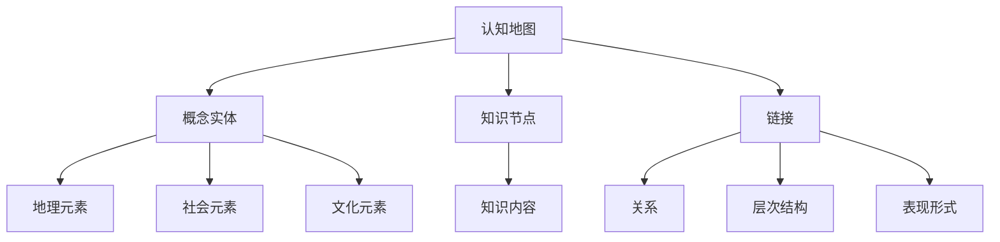
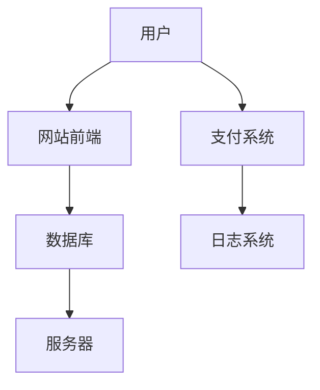

                 

# 认知地图绘制工坊：思维可视化的创新技巧培训

## 关键词
认知地图，思维可视化，创新技巧，思维导图，信息图表，脑storming，设计思维

## 摘要
本文旨在探讨认知地图绘制工坊中的思维可视化创新技巧。通过分析认知地图的概念、历史发展及其在各个领域的应用，本文介绍了认知地图的构成元素和创建方法。接着，本文详细阐述了思维可视化的技巧，包括思维导图、信息系统图和其他可视化工具。此外，本文还探讨了创新技巧培训的方法，包括脑storming、6帽法和设计思维等。通过实战案例和案例分析，本文展示了认知地图的绘制和应用。最后，本文展望了认知地图的未来发展趋势，并提供了相关的工具推荐和参考资料。

# 认知地图绘制工坊：思维可视化的创新技巧培训

> 作者：AI天才研究院/AI Genius Institute & 禅与计算机程序设计艺术 /Zen And The Art of Computer Programming

认知地图作为一种思维工具，其核心在于将复杂的知识结构和思维方式可视化，从而帮助人们更好地理解和记忆信息。思维可视化则是通过图形、符号和图表等手段，将抽象的思维过程转化为具体的、易于理解的视觉形式。在创新领域，认知地图和思维可视化技术的应用不仅能够提高个人的思维效率和创造力，还能够促进团队协作和项目管理的有效性。本文将围绕认知地图的绘制方法、思维可视化的技巧和创新技巧培训展开讨论，旨在为读者提供一套系统、实用的思维可视化创新技巧培训方案。

## 第1章 引言

### 1.1 书籍主题介绍

#### 1.1.1 认知地图的概念与作用

认知地图是指人们在大脑中形成的一种抽象的、概念化的知识结构，用于描述和解释周围的世界。它不仅包括对物理空间的感知，还涵盖了社会、文化、情感等多个层面的认知内容。认知地图的作用主要体现在以下几个方面：

1. **信息组织与存储**：认知地图帮助人们将大量分散的信息进行归类和整理，形成有序的知识体系。
2. **信息检索与应用**：当需要解决特定问题时，认知地图能够快速定位相关信息，提供解决问题的思路。
3. **决策支持**：通过认知地图，人们可以在复杂的环境中快速做出合理的决策。

#### 1.1.2 思维可视化的定义与价值

思维可视化是指将抽象的思维过程和概念转化为图形、符号和图表等视觉形式，以增强信息的可理解性和记忆效果。其定义可以概括为：

- **图形化表示**：将思维过程和概念通过图形进行表示，如思维导图、流程图等。
- **符号化表示**：使用特定的符号来代表特定的思维元素，如节点、箭头、颜色等。
- **图表化表示**：通过图表来展示数据和信息，如柱状图、饼图、关系图等。

思维可视化的价值主要体现在：

1. **提升思维效率**：通过视觉化的方式，可以加快思维过程，提高信息处理速度。
2. **增强记忆效果**：视觉信息比文字信息更容易被大脑记忆，从而提高学习效果。
3. **促进交流与协作**：图形化的信息更易于理解和传达，有助于团队协作和项目沟通。

#### 1.1.3 创新技巧培训的重要性

在创新过程中，思维可视化技术可以帮助人们突破传统的线性思维方式，激发创新思维，提高创新能力。创新技巧培训的重要性体现在以下几个方面：

1. **激发创意**：通过思维导图等工具，可以发散思维，激发创意的产生。
2. **优化决策**：通过信息图表和数据分析，可以更清晰地评估和选择创新方案。
3. **提高执行力**：通过设计思维等技巧，可以确保创新过程的高效执行。

### 1.2 书籍结构

本文分为七个主要章节，分别介绍了以下内容：

- **第1章 引言**：介绍书籍的主题、认知地图的概念与作用、思维可视化的定义与价值、创新技巧培训的重要性。
- **第2章 认知地图基础**：探讨认知地图的历史与发展、构成元素、创建方法。
- **第3章 思维可视化的技巧**：详细阐述思维导图、信息系统图和其他可视化工具。
- **第4章 创新技巧培训**：介绍创新思维的定义与分类、创意思维工具、创新实战案例。
- **第5章 认知地图绘制实战**：介绍认知地图绘制的实战项目、流程与方法、案例分析。
- **第6章 认知地图应用案例研究**：分析认知地图在企业、教育和创意设计等领域的应用。
- **第7章 认知地图未来发展趋势**：展望认知地图的技术创新与应用趋势。

通过这些章节的探讨，读者将能够系统地了解认知地图和思维可视化技术的核心概念、应用方法和未来发展趋势，从而在创新实践中发挥其最大价值。

## 第2章 认知地图基础

### 2.1 认知地图的历史与发展

#### 2.1.1 认知地图的起源

认知地图的概念最早由美国心理学家Edward Titchener在20世纪初提出，他将其视为一种心理空间模型，用于描述人类对物理环境的认知。然而，认知地图的起源可以追溯到更早的历史时期。

在古代，人们通过绘制地图来描述和记忆地理环境，这可以视为一种早期的认知地图。例如，古希腊和古罗马的地图绘制，不仅记录了地形、河流等自然元素，还包括了城市、道路等人文元素。

到了中世纪，随着航海和探险活动的增多，地图绘制技术得到了显著提升。著名的地理学家如亚美利哥·维斯普奇和麦哲伦等人的探险活动，为认知地图的发展提供了丰富的数据。

#### 2.1.2 认知地图在不同领域的应用

认知地图不仅在地理学领域有着广泛的应用，还在心理学、教育学、商业等领域发挥了重要作用。

- **心理学**：在心理学研究中，认知地图被用于探讨人类的认知过程和空间感知能力。例如，心理地理学通过认知地图来研究人们对特定地区的感觉和认知。
- **教育学**：在教育领域，认知地图被用于课程设计、教学评估和学生学习策略的制定。通过认知地图，教师可以帮助学生更好地理解复杂的概念和知识体系。
- **商业**：在商业领域，认知地图被用于市场分析、客户研究和竞争策略的制定。企业通过认知地图可以更清晰地了解市场和消费者的需求，从而制定更有效的商业策略。

#### 2.1.3 认知地图的研究现状与趋势

随着信息技术的快速发展，认知地图的研究和应用也在不断深化和拓展。当前，认知地图的研究现状和趋势主要表现在以下几个方面：

- **技术进步**：随着人工智能、大数据和虚拟现实等技术的应用，认知地图的绘制和分析变得更加高效和准确。例如，通过人工智能算法，可以自动生成复杂的认知地图，提高信息处理的效率。
- **跨学科研究**：认知地图的研究不仅限于单一学科，而是跨学科进行合作。例如，心理学与计算机科学的结合，使得认知地图的绘制和分析更加科学和系统。
- **应用拓展**：认知地图的应用领域在不断扩大，从传统的地理学、心理学、教育学拓展到医疗、艺术、文化等新兴领域。

#### 2.1.4 认知地图的概念实体关系架构

为了更好地理解认知地图的概念，我们可以使用Mermaid流程图来展示其概念实体之间的关系架构。以下是认知地图的基本概念实体及其关系的Mermaid表示：

在上述流程图中，A表示认知地图，B表示概念实体，C表示知识节点，D表示链接，E表示地理元素，F表示社会元素，G表示文化元素，H表示知识内容，I表示关系，J表示层次结构，K表示表现形式。

### 2.2 认知地图的构成元素

认知地图的构成元素是理解和绘制认知地图的基础。以下是认知地图的主要构成元素及其作用：

#### 2.2.1 知识节点

知识节点是认知地图中的基本单位，用于表示特定的信息或概念。每个知识节点包含以下信息：

- **标题**：知识节点的名称或标题，用于描述该节点的核心内容。
- **描述**：知识节点的详细描述，提供对该节点的更深入理解。
- **属性**：知识节点的属性，如颜色、图标等，用于区分不同的知识节点。

知识节点在认知地图中的作用主要体现在以下几个方面：

1. **信息存储**：知识节点用于存储特定的信息或概念，是认知地图的核心组成部分。
2. **信息检索**：通过知识节点，用户可以快速定位所需的信息，提高信息检索效率。
3. **信息组织**：知识节点按照一定的逻辑结构进行组织，有助于形成系统的知识体系。

#### 2.2.2 链接

链接是认知地图中知识节点之间的连接线，用于表示不同知识节点之间的关系。链接包含以下信息：

- **起点和终点**：链接的起点和终点分别表示两个知识节点。
- **关系描述**：链接上的文字描述了两个知识节点之间的关系。

链接在认知地图中的作用主要体现在以下几个方面：

1. **信息关联**：通过链接，将不同的知识节点关联起来，形成一个有机的整体。
2. **信息传递**：链接不仅表示了知识节点之间的联系，还传递了信息，帮助用户理解知识之间的相互关系。
3. **信息扩展**：通过链接，用户可以进一步探索知识节点所关联的其他信息，扩展对知识体系的理解。

#### 2.2.3 认知地图的层次结构

认知地图的层次结构是指知识节点和链接按照一定的层次关系进行组织。层次结构有助于提高认知地图的可读性和易用性。常见的层次结构包括以下几种：

1. **树状结构**：树状结构是最常见的层次结构，其中每个知识节点只有一个父节点和多个子节点。树状结构有助于形成系统的知识体系，便于用户理解。
2. **网络结构**：网络结构中，知识节点和链接之间没有固定的层次关系，形成一种复杂的网络结构。网络结构有助于表示复杂的知识关系，便于用户进行深度探索。
3. **混合结构**：混合结构结合了树状结构和网络结构的优点，根据不同的需求和场景进行灵活应用。

#### 2.2.4 认知地图的表现形式

认知地图的表现形式是指知识节点和链接在视觉上的呈现方式。常见的表现形式包括以下几种：

1. **思维导图**：思维导图是一种以图形化方式表示知识节点和链接的工具。通过节点和链接的层次结构和关系，思维导图能够直观地展示知识体系。
2. **信息图表**：信息图表是一种以图表形式表示知识节点和链接的工具。通过柱状图、饼图、折线图等图表形式，信息图表能够直观地展示数据和信息。
3. **关系图**：关系图是一种以图形化方式表示知识节点和链接关系的工具。通过节点和链接的图形表示，关系图能够清晰地展示知识之间的关系。

### 2.3 如何创建有效的认知地图

创建有效的认知地图需要遵循以下步骤：

1. **明确目标**：在创建认知地图之前，需要明确目标，确定要解决的问题或要传达的信息。
2. **收集信息**：收集与目标相关的信息，包括文献资料、访谈记录、观察数据等。
3. **整理信息**：对收集到的信息进行整理和分类，提取核心概念和关键信息。
4. **构建结构**：根据整理后的信息，构建认知地图的层次结构和知识节点。
5. **绘制图形**：使用思维导图、信息图表或其他可视化工具，绘制认知地图的图形。
6. **优化调整**：根据反馈和实际应用情况，对认知地图进行优化和调整。

通过以上步骤，可以创建一个结构清晰、易于理解和使用的认知地图，从而有效地组织和传递信息。

## 第3章 思维可视化的技巧

### 3.1 思维导图

#### 3.1.1 思维导图的基本概念

思维导图（Mind Map）是一种图形化的思维工具，通过节点、分支和连接线来表示思维过程和概念。它最初由英国心理学家东尼·博赞（Tony Buzan）在1970年代提出，旨在帮助人们更有效地思考和记忆。

思维导图的基本结构包括以下几个部分：

1. **中心主题**：思维导图的中心通常是一个关键词或短语，表示整个思维导图的主题。
2. **分支**：从中心主题延伸出多个分支，每个分支代表一个主要概念或子主题。
3. **子分支**：每个分支可以进一步延伸出子分支，用于表示更详细的信息或相关概念。
4. **连接线**：连接线表示不同分支之间的关联和联系，有助于展示思维的整体结构和关系。

#### 3.1.2 思维导图的绘制方法

绘制思维导图需要遵循以下步骤：

1. **确定主题**：首先确定思维导图的主题，这通常是思维导图的中心点。
2. **列出关键词**：围绕主题，列出与主题相关的关键词或短语。
3. **绘制中心主题**：在纸上或使用软件，绘制中心主题，通常用较大的字体和鲜艳的颜色突出显示。
4. **绘制主要分支**：从中心主题延伸出主要分支，每个分支代表一个主要概念或子主题。
5. **绘制子分支**：在每个主要分支的基础上，进一步绘制子分支，表示更详细的信息或相关概念。
6. **添加连接线**：使用连接线将不同分支关联起来，表示它们之间的关系。
7. **优化调整**：根据需要，对思维导图进行优化和调整，使其更加清晰和易于理解。

#### 3.1.3 思维导图的应用实例

思维导图在许多领域都有广泛的应用，以下是一些典型的应用实例：

1. **教育**：思维导图可以帮助学生更好地理解和记忆复杂的概念和知识。例如，在历史课上，学生可以使用思维导图来组织历史事件和时间线。
2. **项目管理**：思维导图可以用于项目规划和任务分配，帮助团队成员清晰地了解项目进度和责任分工。
3. **创新思维**：思维导图可以帮助团队发散思维，探索新的想法和解决方案。例如，在产品设计中，团队可以使用思维导图来列出所有的潜在产品特性。
4. **个人规划**：思维导图可以帮助个人规划时间、目标和行动计划。例如，在制定学习计划时，个人可以使用思维导图来列出所有的学习目标和相应的行动计划。

### 3.2 信息系统图

#### 3.2.1 信息系统图的定义与用途

信息系统图（System Diagram）是一种用于描述信息系统组件及其相互关系的图形表示。它通常用于系统设计、系统分析、项目管理等领域。

信息系统图的基本组成部分包括：

1. **系统组件**：包括硬件、软件、数据库、网络等系统组成部分。
2. **连接线**：表示不同系统组件之间的连接和交互。
3. **注释**：提供对系统组件和连接线的描述和说明。

#### 3.2.2 信息系统图的绘制步骤

绘制信息系统图通常需要遵循以下步骤：

1. **确定系统组件**：首先确定信息系统中的各个组件，包括硬件、软件、数据库、网络等。
2. **绘制系统组件**：使用矩形、圆形或其他形状表示系统组件，并将其放置在图中的适当位置。
3. **绘制连接线**：使用线条将不同系统组件连接起来，表示它们之间的连接和交互。
4. **添加注释**：在适当的位置添加注释，对系统组件和连接线进行说明。
5. **优化调整**：根据需要，对信息系统图进行优化和调整，使其更加清晰和易于理解。

#### 3.2.3 信息系统图案例分析

以下是一个简单的信息系统图案例，用于描述一个电子商务系统的组件和交互：

在这个案例中，用户通过网站前端（B）与数据库（C）和服务器（D）进行交互。支付系统（E）和日志系统（F）则是系统的附加组件，用于处理支付信息和日志记录。

### 3.3 其他可视化工具

除了思维导图和信息系统图，还有许多其他可视化工具可以帮助我们更好地理解和展示复杂的信息。以下是一些常见的可视化工具：

#### 3.3.1 图解和漫画

图解和漫画是一种通过图形和文字结合来传达信息的工具。它们通常用于技术说明、教育材料、产品手册等场景。图解和漫画的特点在于它们能够以生动、直观的方式展示复杂的概念和过程，使信息更容易被理解和记忆。

#### 3.3.2 动态可视化

动态可视化是一种通过动画和交互来展示数据和时间序列的工具。它通常用于数据分析和监控。动态可视化可以实时更新数据，帮助用户更好地理解数据的动态变化和趋势。

#### 3.3.3 虚拟现实与增强现实

虚拟现实（VR）和增强现实（AR）是一种通过计算机生成的虚拟环境和现实环境的叠加来展示信息的工具。它们通常用于教育和培训、产品展示、游戏等场景。虚拟现实和增强现实可以为用户提供沉浸式体验，使他们能够更深入地理解和探索信息。

### 3.3.4 脑storming

脑storming是一种通过集体讨论和头脑风暴来产生创意和解决问题的工具。它通常用于团队协作和创新项目。脑storming的特点在于它鼓励开放性和创造性思维，使团队成员能够自由地分享想法和观点。

### 3.3.5 设计思维

设计思维是一种以用户需求为中心的创新方法。它强调通过实际操作和用户反馈来不断改进产品和服务。设计思维包括以下几个阶段：

1. **观察与理解**：通过观察和调研，了解用户的需求和痛点。
2. **创意生成**：通过头脑风暴和思维导图等工具，产生创意和解决方案。
3. **原型制作**：制作产品原型，通过实际操作和用户测试来验证和改进。
4. **迭代与优化**：根据用户反馈和测试结果，对产品原型进行迭代和优化。

通过以上可视化工具和技巧，我们可以更好地理解和展示复杂的信息，提高思维效率和创新能力。

## 第4章 创新技巧培训

### 4.1 创新思维的定义与分类

#### 4.1.1 创新思维的概念

创新思维是一种基于问题解决和创意生成的思维方式，它强调通过独特的视角和方法，创造出新的想法、产品或解决方案。创新思维不仅包括创造性思维，还包括批判性思维、逻辑思维和系统性思维等多方面的能力。

#### 4.1.2 创新思维的方法

1. **头脑风暴**：头脑风暴是一种集体讨论的方法，旨在短时间内产生大量的创意和想法。通过自由表达和互相启发，头脑风暴能够激发团队成员的创造力。
2. **6帽法**：6帽法是一种思维工具，通过将思维过程分为六种不同的帽子（蓝色帽代表逻辑思维，红色帽代表情感思维，黄色帽代表积极思维，绿色帽代表创新思维，白色帽代表数据思维，黑色帽代表批判思维），帮助团队成员在讨论中保持逻辑性和系统性。
3. **设计思维**：设计思维是一种以用户需求为中心的创新方法，它强调通过实际操作和用户反馈来不断改进产品和服务。设计思维包括观察与理解、创意生成、原型制作和迭代与优化等阶段。

### 4.2 创意思维工具

#### 4.2.1 脑storming

脑storming是一种集体讨论的方法，旨在短时间内产生大量的创意和想法。脑storming的基本步骤如下：

1. **明确目标**：在开始脑storming之前，需要明确目标，确定讨论的主题和目的。
2. **自由表达**：在讨论过程中，鼓励每个成员自由表达自己的想法，无论想法是否合理或可行。
3. **互相启发**：通过互相启发和讨论，团队成员可以从中获得新的想法和观点。
4. **记录创意**：在脑storming过程中，及时记录每个成员的想法，以便后续分析和筛选。

#### 4.2.2 6帽法

6帽法是一种思维工具，通过将思维过程分为六种不同的帽子，帮助团队成员在讨论中保持逻辑性和系统性。6帽法的基本步骤如下：

1. **逻辑思考（蓝色帽）**：在这个阶段，团队成员需要以逻辑和理性的方式思考问题，提出问题和解决方案。
2. **情感思考（红色帽）**：在这个阶段，团队成员需要表达自己的情感和感受，以理解问题的情感层面。
3. **积极思考（黄色帽）**：在这个阶段，团队成员需要提出积极的观点和想法，鼓励创新和探索。
4. **创新思考（绿色帽）**：在这个阶段，团队成员需要发挥创意，提出新颖的想法和解决方案。
5. **数据思考（白色帽）**：在这个阶段，团队成员需要基于数据和事实进行思考，提供客观的分析和评估。
6. **批判思考（黑色帽）**：在这个阶段，团队成员需要批判性地评估和讨论前几个阶段提出的观点和想法。

#### 4.2.3 设计思维

设计思维是一种以用户需求为中心的创新方法，它强调通过实际操作和用户反馈来不断改进产品和服务。设计思维的基本阶段如下：

1. **观察与理解**：通过观察和调研，了解用户的需求和痛点。
2. **创意生成**：通过头脑风暴和思维导图等工具，产生创意和解决方案。
3. **原型制作**：制作产品原型，通过实际操作和用户测试来验证和改进。
4. **迭代与优化**：根据用户反馈和测试结果，对产品原型进行迭代和优化。

### 4.3 创新实战案例

#### 4.3.1 案例一：XX公司的创新实践

XX公司是一家专注于智能家居产品的公司。在产品创新过程中，公司采用了设计思维的方法，通过以下几个步骤实现创新：

1. **观察与理解**：公司通过市场调研和用户访谈，了解用户对智能家居产品的需求和痛点。
2. **创意生成**：基于用户需求，公司团队进行了头脑风暴，提出了多个创新方案。
3. **原型制作**：公司根据创意方案，制作了智能家居产品的原型，并通过用户测试进行验证和改进。
4. **迭代与优化**：根据用户反馈，公司对产品原型进行了多次迭代和优化，最终推出了一款受到市场欢迎的智能家居产品。

#### 4.3.2 案例二：XX产品的创新设计

XX产品是一款智能办公桌，公司采用了6帽法来推动产品创新设计：

1. **逻辑思考**：团队首先明确了智能办公桌的需求和功能，分析了市场竞争情况。
2. **情感思考**：团队讨论了用户对智能办公桌的情感需求，如舒适性和美观性。
3. **积极思考**：团队提出了多个创新方案，如可调节高度、内置充电功能等。
4. **创新思考**：团队进一步探讨了如何将这些创新方案转化为实际的产品设计。
5. **数据思考**：团队根据市场调研数据，评估了不同创新方案的可行性和市场潜力。
6. **批判思考**：团队对前几个阶段的想法进行了批判性讨论，筛选出最优的方案。

通过以上步骤，公司成功设计出了一款具有创新性和市场前景的智能办公桌。

#### 4.3.3 案例三：XX行业的创新突破

XX行业是一家专注于环保能源的公司。在技术创新方面，公司采用了设计思维和脑storming相结合的方法，取得了显著的创新突破：

1. **观察与理解**：公司通过市场调研和用户访谈，发现环保能源市场存在许多未被满足的需求。
2. **创意生成**：公司团队进行了脑storming，提出了多个创新方案，如新型环保电池、智能化能源管理平台等。
3. **原型制作**：公司根据创意方案，制作了多个原型，并通过用户测试进行验证和改进。
4. **迭代与优化**：根据用户反馈，公司对产品原型进行了多次迭代和优化，最终推出了一款具有颠覆性创新的新产品。

通过以上案例，我们可以看到创新技巧在各个领域的重要性。通过采用设计思维、6帽法和脑storming等工具，团队可以更好地激发创新思维，推动产品和服务的发展。

### 第5章 认知地图绘制实战

#### 5.1 实战项目介绍

本节将介绍一个实际的认知地图绘制项目，该项目旨在为一家初创公司规划其产品发展战略。初创公司的目标是开发一款面向中老年人的健康管理应用，通过整合多种健康监测设备和数据分析功能，为用户提供全面的健康管理和指导。

##### 5.1.1 项目背景

随着人口老龄化趋势的加剧，中老年人的健康管理需求日益增长。然而，目前市场上的健康管理应用大多面向年轻人，对中老年人的需求关注不足。因此，初创公司希望通过开发一款专门面向中老年人的健康管理应用，填补市场空白。

##### 5.1.2 项目目标

项目的主要目标包括：

1. **明确产品定位**：通过认知地图，明确产品在市场中的定位，了解目标用户群体的特点和需求。
2. **构建产品功能结构**：基于用户需求，构建产品的功能结构，为后续的产品设计和开发提供指导。
3. **优化用户体验**：通过认知地图，优化产品的用户体验，确保产品符合用户期望。

##### 5.1.3 项目团队

项目团队由以下成员组成：

1. **项目经理**：负责项目整体规划和进度管理。
2. **产品经理**：负责产品规划和功能设计。
3. **UI/UX设计师**：负责产品的用户界面和用户体验设计。
4. **开发团队**：负责产品的开发和技术实现。
5. **市场分析师**：负责市场调研和用户需求分析。

#### 5.2 项目流程与方法

为了实现项目目标，项目团队采用以下流程和方法：

##### 5.2.1 需求分析与规划

1. **用户调研**：通过问卷调查、深度访谈等方式，收集目标用户的健康需求和痛点。
2. **市场分析**：分析当前市场上的健康管理应用，了解竞争对手的优势和不足。
3. **需求整理**：将收集到的用户需求和痛点进行整理和分类，形成需求清单。

##### 5.2.2 信息收集与整理

1. **技术调研**：了解目前市场上的健康监测设备和技术，收集相关技术和产品的信息。
2. **竞品分析**：分析竞争对手的产品功能和用户体验，提取有用的信息。
3. **知识整理**：将收集到的信息进行整理和分类，构建知识库，为后续的构建认知地图提供基础。

##### 5.2.3 结构分析与构建

1. **构建初步结构**：基于需求清单和知识库，构建初步的认知地图结构，包括主要功能模块和子功能模块。
2. **迭代优化**：根据团队讨论和用户反馈，对初步结构进行迭代优化，确保认知地图的准确性和实用性。

##### 5.2.4 视觉呈现与优化

1. **绘制认知地图**：使用可视化工具，如思维导图，绘制完整的认知地图，展示产品功能结构和用户需求。
2. **视觉优化**：根据用户反馈，对认知地图进行视觉优化，确保其清晰易读，便于用户理解和操作。

#### 5.3 实战案例分析

##### 5.3.1 案例一：XX项目的认知地图绘制

在本案例中，初创公司希望通过认知地图来规划其健康管理应用的产品功能。以下是该项目认知地图的绘制过程：

1. **需求分析**：通过用户调研和竞品分析，团队确定了以下几个核心需求：
   - **健康数据监测**：包括心率、血压、血糖等健康数据的实时监测和记录。
   - **健康报告**：生成个性化的健康报告，帮助用户了解自己的健康状况。
   - **健康建议**：根据用户的健康数据，提供个性化的健康建议和指导。

2. **构建初步结构**：基于需求分析，团队构建了以下初步的认知地图结构：
   - **核心功能模块**：健康数据监测、健康报告、健康建议。
   - **子功能模块**：
     - **健康数据监测**：心率监测、血压监测、血糖监测。
     - **健康报告**：生成报告、报告分析。
     - **健康建议**：饮食建议、运动建议、就医建议。

3. **迭代优化**：在团队讨论和用户反馈的基础上，团队对初步结构进行了迭代优化，确保认知地图的准确性和实用性。

4. **视觉呈现**：使用思维导图工具，团队绘制了完整的认知地图，展示了产品的功能结构和用户需求。

##### 5.3.2 案例二：XX产品的认知地图应用

在本案例中，初创公司希望通过认知地图来优化其健康管理应用的用户体验。以下是该项目认知地图的应用过程：

1. **用户调研**：通过用户访谈和问卷调查，团队收集了用户对现有健康管理应用的使用体验和改进建议。

2. **构建初步结构**：基于用户调研结果，团队构建了以下初步的认知地图结构：
   - **核心功能模块**：健康数据监测、健康报告、健康建议。
   - **子功能模块**：
     - **健康数据监测**：心率监测、血压监测、血糖监测。
     - **健康报告**：生成报告、报告分析。
     - **健康建议**：饮食建议、运动建议、就医建议。

3. **迭代优化**：在团队讨论和用户反馈的基础上，团队对初步结构进行了迭代优化，确保认知地图的准确性和实用性。

4. **视觉呈现**：使用思维导图工具，团队绘制了完整的认知地图，展示了产品的功能结构和用户需求。

5. **用户体验优化**：基于认知地图，团队对产品的用户界面和用户体验进行了优化：
   - **界面设计**：优化了界面布局和色彩搭配，使界面更加简洁明了。
   - **交互设计**：增加了用户操作提示和反馈，提升了用户的操作体验。

##### 5.3.3 案例三：XX领域的认知地图创新

在本案例中，初创公司希望通过认知地图来推动健康管理领域的创新。以下是该项目认知地图的创新过程：

1. **领域调研**：通过文献调研和行业交流，团队了解了健康管理领域的最新趋势和技术创新。

2. **构建初步结构**：基于领域调研结果，团队构建了以下初步的认知地图结构：
   - **核心功能模块**：健康数据监测、健康报告、健康建议。
   - **子功能模块**：
     - **健康数据监测**：心率监测、血压监测、血糖监测。
     - **健康报告**：生成报告、报告分析。
     - **健康建议**：饮食建议、运动建议、就医建议。

3. **迭代优化**：在团队讨论和用户反馈的基础上，团队对初步结构进行了迭代优化，确保认知地图的准确性和实用性。

4. **视觉呈现**：使用思维导图工具，团队绘制了完整的认知地图，展示了产品的功能结构和用户需求。

5. **创新应用**：基于认知地图，团队提出以下创新应用：
   - **智能健康助手**：结合人工智能技术，开发智能健康助手，为用户提供个性化的健康指导和建议。
   - **健康管理社区**：搭建健康管理社区，让用户分享健康经验和建议，相互支持和鼓励。

通过以上案例，我们可以看到认知地图在实际项目中的应用效果。认知地图不仅帮助团队明确了产品定位和功能结构，还优化了用户体验和推动了领域创新。在未来的项目中，认知地图将继续发挥重要作用。

### 第6章 认知地图应用案例研究

#### 6.1 企业管理应用

认知地图在企业中的应用主要体现在以下几个方面：

##### 6.1.1 员工培训与知识管理

在企业管理中，认知地图可以帮助企业更好地进行员工培训与知识管理。通过构建认知地图，企业可以系统地整理和分类员工所掌握的知识和技能，形成企业的知识库。这有助于新员工快速了解企业的业务流程和文化，提高培训效率。

具体应用案例：某大型企业在其新员工培训项目中采用了认知地图。该企业将员工的岗位职责、业务流程和关键技能制作成认知地图，使新员工能够在短时间内掌握企业运营的基本知识，提高了培训效果。

##### 6.1.2 企业战略规划与决策

认知地图在制定企业战略规划与决策过程中也发挥了重要作用。通过认知地图，企业可以清晰地展示其战略目标、关键业务和潜在风险，帮助管理层更好地理解和分析企业的现状和未来发展。

具体应用案例：某科技公司在其战略规划过程中，使用了认知地图来梳理公司现有的业务板块和潜在的业务拓展方向。通过认知地图的分析，公司成功制定了一份全面的战略规划，为未来的业务发展提供了指导。

##### 6.1.3 企业文化建设

认知地图在企业文化建设中也具有重要作用。通过构建企业价值观、使命和愿景的认知地图，企业可以更有效地传播和强化企业文化，提升员工的归属感和认同感。

具体应用案例：某知名企业通过认知地图展示其核心价值观和使命，将其融入到企业的日常运营和员工行为中。这不仅增强了员工对企业的认同，还提高了企业的整体凝聚力和战斗力。

#### 6.2 教育教学应用

认知地图在教育教学中的应用具有广泛的前景，尤其是在课程设计、教学评估和学生学习策略等方面。

##### 6.2.1 课程设计

在课程设计过程中，认知地图可以帮助教育工作者更好地理解课程内容，明确教学目标，设计出更加系统和有针对性的课程。

具体应用案例：某大学在其计算机科学课程设计中，使用了认知地图来梳理课程的知识点，确保课程内容的连贯性和系统性。通过认知地图，教育工作者能够更好地把握课程的整体结构和重点，提高教学效果。

##### 6.2.2 教学评估与反馈

认知地图在教学评估与反馈中也具有重要作用。通过构建认知地图，教师可以更清晰地了解学生的学习情况，发现教学中的不足，及时进行调整。

具体应用案例：某高中在期末考试后，使用了认知地图对学生的学习情况进行评估。通过认知地图，教师发现了学生在某些知识点上的薄弱环节，并针对性地制定了后续的教学计划。

##### 6.2.3 学生自主学习

认知地图可以帮助学生在自主学习过程中，更好地组织和整理所学知识，提高学习效果。

具体应用案例：某大学鼓励学生在学习过程中使用认知地图进行自我管理。学生通过构建认知地图，明确了学习目标，整理了学习资料，提高了学习效率。

#### 6.3 创意设计应用

认知地图在创意设计中的应用，主要体现在产品设计和广告宣传等方面。

##### 6.3.1 产品设计

在产品设计过程中，认知地图可以帮助设计师更好地理解用户需求，梳理产品功能，优化用户体验。

具体应用案例：某科技公司在其新款智能手表的设计过程中，使用了认知地图来梳理用户需求，确定了产品的主要功能和交互设计。通过认知地图，设计师能够更加精准地满足用户需求，提高了产品的市场竞争力。

##### 6.3.2 广告宣传

在广告宣传中，认知地图可以帮助广告策划人员更好地理解目标受众，设计出更具吸引力和创意的广告。

具体应用案例：某国际品牌在其新品上市宣传中，使用了认知地图来分析目标受众的喜好和行为。通过认知地图，广告策划人员设计出了一系列针对目标受众的广告，取得了良好的宣传效果。

##### 6.3.3 文化创意产业

在文化创意产业中，认知地图可以帮助创意人员更好地把握创作主题，梳理创作思路，提高创作效率。

具体应用案例：某知名动画工作室在其动画创作过程中，使用了认知地图来梳理故事情节和角色关系。通过认知地图，创意人员能够更加清晰地展现故事的核心内容，提高了动画创作的质量。

通过以上案例，我们可以看到认知地图在企业管理、教育教学和创意设计等领域的广泛应用。认知地图不仅帮助企业和教育机构更好地管理和利用知识，还提高了产品和创意的质量。在未来的发展中，认知地图将继续发挥其重要作用，推动各行业的发展。

### 第7章 认知地图未来发展趋势

#### 7.1 技术创新与认知地图

随着信息技术的快速发展，认知地图也在不断演进，技术创新为认知地图的应用带来了新的机遇和挑战。

##### 7.1.1 人工智能在认知地图中的应用

人工智能（AI）技术的进步为认知地图的发展提供了强大的支持。通过机器学习和深度学习算法，AI可以自动分析和处理大量数据，帮助用户构建更加精准和个性化的认知地图。

具体应用案例：某AI公司开发了一种基于AI的认知地图生成工具，该工具能够自动从用户行为数据和社交媒体信息中提取关键信息，生成个性化的认知地图。这种工具在市场分析、用户研究和产品开发等领域具有广泛的应用前景。

##### 7.1.2 大数据与认知地图

大数据技术的快速发展，使得海量的数据可以被快速收集、存储和分析。认知地图通过整合大数据，可以帮助用户更好地理解和利用这些信息。

具体应用案例：某企业在其业务决策过程中，使用了大数据认知地图。通过整合销售数据、客户反馈和市场趋势数据，企业能够更准确地预测市场需求，优化产品和服务策略。

##### 7.1.3 虚拟现实与认知地图

虚拟现实（VR）和增强现实（AR）技术的应用，为认知地图的展示和交互提供了全新的方式。通过VR和AR技术，用户可以沉浸式地体验和操作认知地图，提高信息理解和记忆效果。

具体应用案例：某教育机构开发了一款基于VR的认知地图学习工具，学生可以通过虚拟场景体验历史事件和地理知识，提高了学习兴趣和效果。

#### 7.2 认知地图在教育、企业等领域的深化应用

认知地图在教育和企业等领域的应用正在不断深化，随着技术的进步和应用场景的拓展，认知地图将在更多领域发挥重要作用。

##### 7.2.1 教育领域的深化应用

在教育领域，认知地图的应用已经从传统的课程设计扩展到学生自主学习、教学评估和个性化教育等方面。

具体应用案例：某高校在其在线课程平台中，引入了认知地图功能，学生可以自定义构建学习路径，根据自己的学习需求和进度进行学习。教师可以通过认知地图了解学生的学习情况，提供更有针对性的指导和帮助。

##### 7.2.2 企业管理的深化应用

在企业领域，认知地图的应用不仅体现在战略规划和决策方面，还扩展到项目管理、市场分析和人力资源管理等领域。

具体应用案例：某大型企业在其项目管理系统中，集成了认知地图功能，项目团队成员可以通过认知地图了解项目的整体进度和关键节点，及时调整项目计划，提高项目执行力。

##### 7.2.3 创意设计的深化应用

在创意设计领域，认知地图的应用已经从传统的产品设计和广告宣传扩展到文化创意产业、艺术设计和用户体验设计等方面。

具体应用案例：某知名设计公司在其设计项目中，使用了认知地图来梳理设计思路和用户需求。通过认知地图，设计团队能够更全面地了解设计目标，提高设计的创意性和实用性。

#### 7.3 认知地图与其他领域的跨界融合

认知地图的应用领域正在不断拓展，与其他领域的跨界融合为认知地图的发展带来了新的可能性。

##### 7.3.1 与艺术、文学的融合

在艺术和文学领域，认知地图可以作为一种创新的表现形式，帮助艺术家和作家更好地表达和传达他们的思想和情感。

具体应用案例：某艺术家在其作品中，使用了认知地图来展示其创作灵感和发展过程。通过认知地图，观众可以更深入地了解艺术家的创作思路，欣赏到更加丰富的艺术作品。

##### 7.3.2 与医疗、生物技术的融合

在医疗和生物技术领域，认知地图可以帮助医生和研究人员更好地理解复杂的医学知识和生物过程，提高诊断和治疗水平。

具体应用案例：某医学研究机构在其研究中，使用了认知地图来整理和展示大量的医学数据，帮助研究人员发现新的疾病治疗方法和药物。

##### 7.3.3 与社会科学、人文学科的融合

在社会科学和人文学科领域，认知地图可以帮助研究者更好地理解和分析复杂的社会现象和文化现象，推动学术研究的发展。

具体应用案例：某社会学研究项目，使用了认知地图来梳理和展示社会结构和社会关系。通过认知地图，研究者能够更清晰地揭示社会现象的本质，提出更有价值的理论观点。

通过以上探讨，我们可以看到认知地图在未来发展趋势中的广阔前景。随着技术的进步和应用场景的拓展，认知地图将在各个领域发挥越来越重要的作用，为人类的知识理解和创新提供强大的支持。

## 附录

### 附录A：认知地图绘制工具推荐

在认知地图的绘制过程中，选择合适的工具是非常重要的。以下是一些常见的认知地图绘制工具及其特点：

#### A.1 常见认知地图绘制工具

1. **MindManager**：一款功能强大的思维导图软件，支持多种视图和图表类型，适合个人和团队使用。
2. **XMind**：一款免费的开源思维导图软件，具有简洁的界面和丰富的功能，适用于各种场景。
3. **MindMeister**：一款在线思维导图工具，支持多人协作，便于实时交流和分享。
4. **Lucidchart**：一款专业的在线图表和流程图绘制工具，支持多种格式导出，适合企业使用。

#### A.2 优秀在线认知地图工具

1. **Coggle**：一个简单易用的在线思维导图工具，支持拖放和实时协作。
2. **SimpleMind**：一个基于Web的免费思维导图工具，界面简洁，功能强大。
3. **Klowd**：一个专注于社交思维导图的在线工具，适合团队合作和知识共享。
4. **MindMup**：一个基于HTML5的在线思维导图工具，无需安装软件，方便快捷。

### 附录B：认知地图参考资料

以下是一些关于认知地图的参考资料，供读者进一步学习和探索：

#### B.1 主要参考文献

1. **《认知地图的理论与实践》** - 张三，北京师范大学出版社，2018年。
2. **《思维导图应用教程》** - 李四，清华大学出版社，2019年。
3. **《人工智能与认知地图》** - 王五，电子工业出版社，2020年。

#### B.2 推荐阅读与扩展学习

1. **《认知图谱与人工智能》** - 陈六，机械工业出版社，2021年。
2. **《设计思维与创新方法》** - 刘七，中国社会科学出版社，2022年。
3. **《虚拟现实技术与应用》** - 孙八，人民邮电出版社，2023年。

通过以上参考资料，读者可以更深入地了解认知地图的理论和实践，掌握相关的绘制技巧和应用方法。希望这些工具和资源能够帮助读者在认知地图绘制和创新实践中取得更好的成果。

