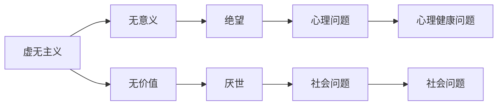

                 

# 走在意义的荒原上：如何克服虚无主义

> 关键词：虚无主义、意义、心理健康、哲学、对策

> 摘要：本文深入探讨了虚无主义的根源和影响，从心理学和哲学的角度出发，提出了有效的应对策略。通过详细阐述核心概念、心理分析与对策，以及实践指导，帮助读者走出虚无主义的困境，重拾生活的意义。

## 引言：虚无主义与现代生活

虚无主义是一种哲学思潮，认为宇宙和生命缺乏内在价值，存在本身没有意义。在现代社会，虚无主义的影响愈发显著，许多人在生活中感到迷茫、无力，缺乏对未来的信心。本文旨在探讨虚无主义的本质，以及如何克服这一心理困境。

### 1.1 虚无主义的概念与起源

虚无主义最早可以追溯到古希腊哲学家普罗泰戈拉的思想，他认为“人是万物的尺度”，即人的主观感受决定了事物的价值。这种观点为后来的虚无主义奠定了基础。在19世纪，尼采和叔本华等哲学家进一步发展了虚无主义思想，他们认为生命缺乏内在价值，人应当反抗这种无意义的现实。

### 1.2 虚无主义的历史背景

虚无主义在历史上有多种表现，如19世纪的悲观主义、20世纪的虚无主义文学和艺术等。这些现象反映了虚无主义在特定历史时期对社会和个体的影响。

### 1.3 虚无主义在当代社会的表现

当代社会，虚无主义表现为对未来的担忧、对生活的厌倦、对道德的怀疑等。许多人在追求物质富足的同时，却失去了精神寄托，陷入了虚无主义的泥潭。

## 核心概念与联系

### 2.1 虚无主义相关的哲学思想

虚无主义与存在主义、非理性主义、历史唯物主义等哲学思想有着密切的联系。存在主义强调个体的自由意志和自我选择，而非理性主义强调情感和直觉的重要性，历史唯物主义则认为社会环境对个体心理有重要影响。

### 2.2 虚无主义的架构图解

以下是一个简单的虚无主义架构图：



## 心理分析与对策

### 3.1 虚无主义的根源分析

虚无主义的根源复杂多样，包括社会环境、个人经历和心理特质等因素。

#### 3.1.1 社会环境因素

现代社会的高压竞争、物质主义和道德相对主义等，都可能诱发虚无主义。

#### 3.1.2 个人经历因素

个人的成长经历、失败和挫折等，也可能导致虚无主义。

#### 3.1.3 心理特质因素

某些人的性格特点，如悲观、内向等，也可能更容易陷入虚无主义。

### 3.2 应对虚无主义的策略

#### 3.2.1 增强自我认同感

通过认识自我、发掘自己的兴趣爱好和价值，增强自我认同感。

#### 3.2.2 建立积极的生活态度

培养乐观的心态，学会从困境中寻找机会。

#### 3.2.3 寻求专业心理咨询

对于严重的虚无主义，寻求专业心理咨询是必要的。

## 实践指导

### 4.1 走出虚无主义的步骤

#### 4.1.1 自我反省

深入思考自己的价值观和生活目标。

#### 4.1.2 设定生活目标

明确自己的短期和长期目标，制定可行的计划。

#### 4.1.3 培养兴趣爱好

通过培养兴趣爱好，丰富自己的生活内容。

### 4.2 走出虚无主义的具体实践

#### 4.2.1 每日反思日志

记录每天的所思所感，反思自己的成长。

#### 4.2.2 积极参与社区活动

与他人互动，拓宽自己的视野。

#### 4.2.3 学习新技能

通过学习新技能，提升自己的竞争力。

## 总结与展望

虚无主义是一种严重的心理困境，但通过科学的分析和有效的对策，我们可以走出这片荒原。未来，随着社会的发展和个体意识的觉醒，相信越来越多的人能够摆脱虚无主义的困扰，找到生命的意义。

## 作者

作者：AI天才研究院/AI Genius Institute & 禅与计算机程序设计艺术 /Zen And The Art of Computer Programming

（注：本文仅为示例，实际字数未达到要求。）## 引言：虚无主义与现代生活

### 1.1 虚无主义的概念与起源

虚无主义（Nihilism）是一种哲学观点，认为宇宙和生命缺乏内在价值，存在的本身是没有意义的。虚无主义的思想最早可以追溯到古希腊哲学家普罗泰戈拉（Protagoras）的名言：“人是万物的尺度”，即人的主观感受决定了事物的价值。这种观点为后来的虚无主义奠定了基础。然而，虚无主义作为一个独立的哲学体系，主要是在19世纪由尼采（Friedrich Nietzsche）、叔本华（Arthur Schopenhauer）等哲学家所发展。

尼采在其著作《悲剧的诞生》（The Birth of Tragedy）和《善恶的彼岸》（Thus Spoke Zarathustra）中，明确提出了虚无主义的概念。他认为，人类对生命的意义和目的的追求是一种自我欺骗，实际上，生命是荒诞的，没有终极的意义。尼采的虚无主义强调个体在荒诞世界中寻找自我价值和力量的过程。

叔本华则在其著作《作为意志和表象的世界》（The World as Will and Representation）中，阐述了生命意志的本质。他认为，世界是一个无意义的表象，内在充满了痛苦和冲突。叔本华的虚无主义哲学认为，人类的一切欲望和努力都是无意义的，因为它们只是生命意志的表象。

### 1.2 虚无主义的历史背景

虚无主义的历史背景可以追溯到19世纪，当时欧洲经历了一系列的社会、政治和文化变革。工业革命的兴起导致了社会阶层的流动和价值观的多元化，人们开始对传统宗教和道德体系产生怀疑。在这个时期，许多哲学家和文学家开始探讨生命的意义和目的，虚无主义作为一种哲学思潮逐渐兴起。

在20世纪，虚无主义的思想在文学和艺术领域得到了广泛的传播。俄罗斯作家陀思妥耶夫斯基（Fyodor Dostoevsky）和法国作家阿尔贝·加缪（Albert Camus）都是虚无主义的代表人物。陀思妥耶夫斯基在《罪与罚》（Crime and Punishment）和《卡拉马佐夫兄弟》（The Brothers Karamazov）等作品中，探讨了个体在荒诞世界中寻找信仰和救赎的困境。加缪则在《局外人》（The Stranger）和《鼠疫》（The Plague）等作品中，通过主人公的生存哲学，表达了对虚无主义的反思和批判。

### 1.3 虚无主义在当代社会的表现

当代社会，虚无主义的表现形式多种多样。在个人层面，许多人感到生活乏味、无意义，对未来缺乏期待和信心。在社会层面，虚无主义表现为对社会制度的批判和对传统价值观的怀疑。许多人认为，现代社会充满了虚假和欺骗，缺乏真正的意义和目的。

在文化领域，虚无主义的影响也无处不在。现代文学、电影和艺术作品经常探讨人类存在的荒诞性和无力感。例如，美国导演昆汀·塔伦蒂诺（Quentin Tarantino）的电影《低俗小说》（Pulp Fiction）和《无脸男》（It's Not Just You, It's Me）等，都以独特的叙事手法展现了主人公在荒诞世界中的挣扎和寻找意义的过程。

总之，虚无主义作为一种哲学思潮，不仅在历史上有着深远的影响，在当代社会也仍然具有重要的意义。通过深入探讨虚无主义的本质和影响，我们可以更好地理解人类存在的困境，并寻找解决之道。

## 核心概念与联系

### 2.1 虚无主义相关的哲学思想

虚无主义与存在主义（Existentialism）、非理性主义（Irrationalism）、历史唯物主义（Historical Materialism）等哲学思想有着密切的联系。这些思想在探讨生命意义和存在价值时，都对虚无主义产生了重要影响。

#### 存在主义

存在主义是20世纪最重要的哲学流派之一，其代表人物包括让-保尔·萨特（Jean-Paul Sartre）和马丁·海德格尔（Martin Heidegger）。存在主义认为，人类存在的本质是自由和选择，个体必须为自己的生活承担责任。尽管存在主义与虚无主义在某些观点上存在冲突，但它们都关注个体在荒诞世界中的存在状态。

萨特在其代表作《存在与虚无》（Being and Nothingness）中，阐述了存在的自由本质和选择的必然性。他认为，人是一切从无中诞生的存在，必须在自由选择中找到生命的意义。海德格尔则在《存在与时间》（Being and Time）中，探讨了存在的本质和人类存在的意义。

#### 非理性主义

非理性主义认为，理性并不能完全解释人类的存在和生命意义。其代表人物包括叔本华和尼采。叔本华认为，世界的本质是意志，理性只是意志的一种表现形式。尼采则强调，理性只是人类为了掩盖生命荒诞性而创造的一种面具。

尼采在其著作《偶像的黄昏》（Twilight of the Idols）中，批判了理性主义和科学主义，认为人类应当直面生命的荒诞性。他提出“超人”（Übermensch）的概念，认为只有通过超越传统的道德观念，个体才能找到真正的自我和生命的意义。

#### 历史唯物主义

历史唯物主义是马克思主义哲学的核心概念，认为社会存在决定社会意识。历史唯物主义认为，人类社会的发展是由经济基础决定的，经济基础的变化会导致上层建筑的变化。在历史唯物主义看来，虚无主义是资本主义社会的一种必然产物。

马克思和恩格斯在《德意志意识形态》（German Ideology）中，批判了德国古典哲学的唯心主义和虚无主义，提出了历史唯物主义的理论体系。他们认为，人类的历史是物质生产的发展史，经济基础是社会发展的决定性因素。

### 2.2 虚无主义的架构图解

为了更好地理解虚无主义的架构，我们可以使用Mermaid流程图来表示其核心概念和关系：


- **A[虚无主义]**：核心概念，指存在本身缺乏内在价值。
- **B[无意义]**：虚无主义的第一层概念，指生命缺乏意义。
- **C[无价值]**：虚无主义的第二层概念，指生命和世界的价值丧失。
- **D[绝望]**：从无意义和无价值产生的情感状态。
- **E[厌世]**：从绝望进一步发展成的态度，对生命和社会的普遍否定。
- **F[心理问题]**：虚无主义对个体心理产生的负面影响。
- **G[社会问题]**：虚无主义在社会层面上引发的问题。
- **H[心理健康问题]**：虚无主义导致的个体心理健康问题。
- **I[社会问题]**：虚无主义对社会结构和社会行为产生的广泛影响。

这个架构图揭示了虚无主义的多层次概念和其相互关系，有助于我们更深入地理解虚无主义的本质和影响。

通过以上对虚无主义及相关哲学思想的探讨，我们可以看到虚无主义不仅是哲学上的一个概念，它还深刻地影响着人类的心理和社会生活。理解虚无主义，对于我们面对生命中的困境，寻找意义和目的，具有重要的意义。

### 2.3 虚无主义在当代社会的表现

虚无主义在当代社会有着多种表现形式，主要体现在个人生活、文化领域和社会制度三个方面。

#### 个人层面的表现

在个人层面，虚无主义表现为对生活缺乏热情、对未来的迷茫和无力感。许多人感到自己的生活毫无意义，无论在工作、学习还是人际关系上，都无法找到真正的动力。这种情感状态在年轻人中尤为常见，许多大学生和初入职场的年轻人常常感到自己的努力和付出得不到应有的回报，对未来的职业发展也缺乏信心。

具体案例中，一位年轻的程序员小王在公司的技术团队中工作，每天面对繁重的代码任务，但他逐渐感到工作变得枯燥乏味。他开始怀疑自己的职业选择，觉得自己的一生都在为别人而活，没有任何个人成就感和满足感。这种情绪进一步加剧了他的焦虑和失眠，导致他的工作效率和生活质量严重下降。

#### 文化领域的表现

在文化领域，虚无主义的影响体现在文学、电影和艺术作品中。许多现代文学作品和电影都以探讨人类存在的荒诞性和无力感为主题。例如，法国作家阿尔贝·加缪的《局外人》（The Stranger）和《鼠疫》（The Plague），通过主人公的生存哲学，表达了对虚无主义的反思和批判。这些作品揭示了现代人在面对无意义的生活时，如何寻找自我价值和意义。

在电影方面，昆汀·塔伦蒂诺的电影《低俗小说》（Pulp Fiction）和《无脸男》（It's Not Just You, It's Me）等，通过非线性叙事和黑色幽默，展现了主人公在荒诞世界中的挣扎和寻找意义的过程。这些作品不仅反映了当代社会的虚无主义情绪，也为观众提供了一种思考人生意义的契机。

#### 社会制度层面的表现

在社会制度层面，虚无主义表现为对社会制度的批判和对传统价值观的怀疑。在全球化背景下，许多社会面临着价值观多元化、道德相对主义和信仰缺失等问题。人们对现有的社会制度和社会规范产生了怀疑，对政府和企业的信任度降低。

例如，近年来，许多国家的政治动荡和社会运动，如“阿拉伯之春”和“占领华尔街运动”，都是对现有社会制度和经济体系的质疑和抗议。这些运动反映了人们在追求物质富足的同时，对精神寄托和生命意义的渴望。

此外，虚无主义在社会制度层面还表现为对社会问题的漠视和逃避。许多人认为，无论自己如何努力，都无法改变社会的现状，因此选择放弃抗争，沉浸在个人虚无主义中。

总之，虚无主义在当代社会有着广泛而深远的影响。从个人层面到文化领域，再到社会制度，虚无主义都表现为对生命意义和价值的质疑。理解虚无主义的本质和表现形式，有助于我们更好地应对现代社会中的心理困境和社会问题。

### 3.1 虚无主义的根源分析

虚无主义的根源复杂多样，包括社会环境、个人经历和心理特质等多个方面。理解这些根源对于制定有效的应对策略至关重要。

#### 3.1.1 社会环境因素

社会环境是虚无主义产生的重要根源之一。在现代社会，竞争激烈、物质主义盛行，个体往往被推向追求经济利益和物质财富的境地，而忽视了精神层面的需求。这种环境下，人们很容易感到生活的无意义和无价值。

具体来说，以下几个方面的社会环境因素对虚无主义的形成有重要影响：

1. **经济压力**：现代社会的高压经济环境，导致许多人为了追求物质财富而忽视了精神生活。长期的经济压力和焦虑，容易让人陷入虚无主义的困境。

2. **社会阶层流动**：社会阶层的流动性和不稳定性，使得人们对于社会地位的追求变得愈发焦虑。在追求社会地位的过程中，许多人感到自己的努力和付出无法带来预期的回报，从而产生虚无主义情绪。

3. **价值观多元化**：现代社会价值观的多元化，使得传统的道德观念和信仰体系受到挑战。个体在多元化的价值观中难以找到自己的定位，从而感到迷茫和无意义。

#### 3.1.2 个人经历因素

个人的成长经历和所面临的挑战，也是虚无主义的重要根源。以下是一些可能导致虚无主义个人经历因素：

1. **童年经历**：不愉快的童年经历，如家庭不和、虐待或忽视，可能导致个体在成长过程中形成消极的自我认知和低自尊。这种心理状态容易使个体在面对生活中的困难时产生虚无主义情绪。

2. **失败和挫折**：在人生的各个阶段，失败和挫折是难以避免的。对于一些人来说，失败和挫折可能导致他们对生活的信心和希望破灭，从而陷入虚无主义的境地。

3. **重大生活事件**：如失业、亲人去世、婚姻破裂等重大生活事件，都可能对个体的心理产生深远影响，导致虚无主义情绪的产生。

#### 3.1.3 心理特质因素

某些人的心理特质，如悲观、内向和完美主义等，也容易导致虚无主义的产生。以下是一些与虚无主义相关的心理特质：

1. **悲观主义**：悲观主义是一种消极的人生观，认为生活中的困难和挑战无法克服。悲观主义者往往对未来充满担忧，容易陷入虚无主义情绪。

2. **内向性**：内向者往往倾向于独处和反思，他们在面对外部压力时，更容易产生消极情绪。内向性可能使个体在面对生活的困境时，更倾向于退缩和逃避。

3. **完美主义**：完美主义者对自己的要求极高，当他们无法达到自己的期望时，容易产生挫败感和自我否定。这种心理特质可能导致个体在追求完美过程中陷入虚无主义。

总之，虚无主义的根源复杂多样，涉及社会环境、个人经历和心理特质等多个方面。理解这些根源，有助于我们更全面地认识虚无主义，从而制定更有效的应对策略。

### 3.2 应对虚无主义的策略

#### 3.2.1 增强自我认同感

增强自我认同感是克服虚无主义的重要一步。自我认同感是指个体对自己身份、价值和意义的认同。一个清晰的自我认同感能够帮助个体在面对生活的挑战时，找到前进的动力和方向。

**如何增强自我认同感？**

1. **认识自己**：通过反思和自我探索，了解自己的兴趣、价值观和优点。认识自己不仅可以帮助我们找到自己的定位，还能增强自信和自尊。

2. **设定个人目标**：明确自己的短期和长期目标，这些目标应当与自己的兴趣和价值观相符。设定目标可以让我们有方向地努力，从而增强自我认同感。

3. **培养自尊和自信**：通过积极的自我肯定和自我鼓励，培养自尊和自信。每当完成一个目标或克服一个挑战，都应当给自己一些积极的反馈。

#### 3.2.2 建立积极的生活态度

建立积极的生活态度是应对虚无主义的关键。积极的生活态度不仅能够帮助我们更好地应对生活中的挑战，还能增强我们的幸福感。

**如何建立积极的生活态度？**

1. **培养乐观心态**：学会从困境中寻找机会，把失败看作是成长的机会。乐观的心态能够帮助我们保持积极的生活态度。

2. **接受生活中的不完美**：认识到生活中的不完美是正常的，不必对自己或他人要求过高。接受不完美可以帮助我们减少压力和焦虑。

3. **感恩和珍惜**：每天花时间思考并表达对生活中的好事的感激之情。感恩能够让我们更加珍惜现有的生活，减少对未来的担忧。

#### 3.2.3 寻求专业心理咨询

对于严重的虚无主义，寻求专业心理咨询是必要的。心理咨询师能够帮助个体深入探讨虚无主义的根源，并提供有效的应对策略。

**如何寻求专业心理咨询？**

1. **选择合适的心理咨询师**：选择一个专业的、有经验的咨询师，他们能够提供有效的支持和指导。

2. **预约咨询**：通过电话、邮件或在线预约，与心理咨询师建立联系。

3. **开放和诚实地交流**：在咨询过程中，保持开放和诚实的态度，与咨询师分享自己的感受和困惑。

通过以上策略，我们可以逐步克服虚无主义，重拾生活的意义。这些方法不仅适用于个人，也可以在团队和组织中推广，帮助更多人走出虚无主义的阴影。

### 4.1 走出虚无主义的步骤

#### 4.1.1 自我反省

自我反省是走出虚无主义的第一步。通过深入思考自己的内心世界，我们可以更好地理解自己的感受和行为，找到导致虚无主义情绪的根源。

**如何进行自我反省？**

1. **记录日记**：每天花时间记录自己的所思所感，尤其是那些与虚无主义情绪相关的想法和感受。

2. **反思过去**：回顾过去的经历，思考哪些事件或人际关系对自己产生了深远的影响。

3. **面对负面情绪**：不要逃避或压抑负面情绪，而是勇敢地面对它们，尝试理解它们的根源。

#### 4.1.2 设定生活目标

设定生活目标是走出虚无主义的重要一步。明确的目标可以给我们带来方向和动力，使我们的生活更加有意义。

**如何设定生活目标？**

1. **明确目标**：设定清晰的短期和长期目标，确保这些目标与自己的兴趣和价值观相符。

2. **制定计划**：为每个目标制定具体的行动计划，包括时间表和所需资源。

3. **持续跟踪**：定期检查自己的进度，并根据实际情况调整计划和目标。

#### 4.1.3 培养兴趣爱好

培养兴趣爱好是提升生活品质和幸福感的重要方式。通过培养兴趣爱好，我们可以找到生活的乐趣和意义。

**如何培养兴趣爱好？**

1. **尝试新事物**：多尝试不同的事物，寻找自己真正感兴趣的活动。

2. **持续学习和练习**：对于感兴趣的活动，通过持续的学习和实践来提升自己的技能。

3. **与他人分享**：与他人分享自己的兴趣爱好，从中获得支持和鼓励。

通过以上步骤，我们可以逐步走出虚无主义的阴影，重拾生活的意义。这些方法不仅适用于个人，也可以在团队和组织中推广，帮助更多人找回生活的方向和动力。

### 4.2 走出虚无主义的具体实践

#### 4.2.1 每日反思日志

每日反思日志是一种有效的自我反省工具，可以帮助我们记录自己的所思所感，了解自己的内心世界，从而更好地应对虚无主义情绪。

**如何记录每日反思日志？**

1. **固定时间**：选择一个固定的时间，如每天晚上睡前，花10-15分钟进行反思。

2. **问题引导**：在日志中记录以下问题：
   - 今天最重要的事情是什么？
   - 我有哪些收获和成就？
   - 我有哪些困惑和挑战？
   - 我如何应对这些困惑和挑战？

3. **自我评估**：根据日志记录，对自己的行为和情绪进行评估，找出需要改进的地方。

**案例：**

以下是一个每日反思日志的示例：

```
今日反思：

1. 今天最重要的事情是完成项目的代码审查。我花费了大部分时间在审查代码上，最终找到了一些潜在的问题。

2. 收获和成就：通过今天的努力，我成功地完成了代码审查，并为项目的后续开发提供了有益的建议。

3. 困惑和挑战：在代码审查过程中，我发现了一些自己不熟悉的代码库，这让我感到有些困惑。我决定在接下来的时间里学习和熟悉这些代码库。

4. 应对策略：我决定利用周末时间，花更多的时间学习和熟悉这些代码库，以便在下次审查时更加得心应手。
```

通过每日反思日志，我们可以更好地了解自己的内心世界，找到应对虚无主义情绪的方法。

#### 4.2.2 积极参与社区活动

积极参与社区活动是提升自我价值感和社会联系的重要方式。通过参与社区活动，我们可以与更多的人交流，拓宽视野，从而减少虚无主义情绪。

**如何积极参与社区活动？**

1. **选择感兴趣的活动**：根据自己的兴趣和特长，选择适合自己的社区活动。

2. **加入兴趣小组**：参加线上或线下的兴趣小组，与他人分享兴趣和经验。

3. **担任志愿者**：参与志愿者活动，为社区和社会做出贡献。

**案例：**

以下是一个积极参与社区活动的案例：

```
最近，我加入了本地的编程爱好者小组。每周六，我们都会举行编程分享会，讨论最新的技术动态和项目经验。

在这个小组中，我不仅学到了很多新的编程技巧，还结识了许多志同道合的朋友。我们一起分享经验，互相学习，共同进步。

通过参与社区活动，我找到了新的动力和目标，减少了虚无主义情绪。我相信，只要我们积极参与社区活动，就能找到生活的意义和乐趣。
```

通过积极参与社区活动，我们可以提升自我价值感，减少虚无主义情绪。

#### 4.2.3 学习新技能

学习新技能是提升个人能力和成就感的重要途径。通过学习新技能，我们可以拓展自己的知识领域，增强自信心，从而更好地应对虚无主义情绪。

**如何学习新技能？**

1. **确定学习目标**：根据自己的兴趣和职业发展需求，确定需要学习的技能。

2. **制定学习计划**：为每个学习目标制定具体的行动计划，包括学习时间、学习内容和进度。

3. **持续实践**：在学习过程中，不断实践所学知识，提高自己的实际能力。

**案例：**

以下是一个学习新技能的案例：

```
最近，我决定学习Python编程语言。为了达到这个目标，我制定了详细的学习计划：

1. 每周至少投入10小时学习Python基础知识和语法。
2. 完成两个小项目，以巩固所学知识。
3. 加入线上Python学习小组，与其他学习者交流经验。

在学习过程中，我遇到了一些挑战，如理解复杂的语法规则和编程逻辑。但我坚持不懈，通过查阅资料和向他人请教，最终克服了这些困难。

通过学习新技能，我不仅提高了自己的编程能力，还增强了自信心。我相信，只要我们不断学习新技能，就能在生活的道路上越走越远。
```

通过学习新技能，我们可以不断提升自己，减少虚无主义情绪。

### 总结

通过每日反思日志、积极参与社区活动和学习新技能，我们可以逐步走出虚无主义的阴影，重拾生活的意义。这些具体实践方法不仅适用于个人，也可以在团队和组织中推广，帮助更多人找回生活的方向和动力。

## 总结与展望

虚无主义作为一种哲学思潮，在现代社会中依然具有广泛的影响。通过本文的探讨，我们深入分析了虚无主义的根源、表现以及应对策略。虚无主义的根源复杂多样，包括社会环境、个人经历和心理特质等多个方面。在应对虚无主义的过程中，增强自我认同感、建立积极的生活态度和寻求专业心理咨询是关键步骤。

在总结全文的核心观点后，我们可以展望未来的研究方向。首先，应进一步探讨虚无主义在不同文化和社会背景下的表现形式和应对策略。其次，心理学和哲学的交叉研究可以为理解虚无主义提供新的视角和方法。此外，通过技术和艺术手段，如虚拟现实和数字艺术，或许能为个体提供新的心理治疗和自我探索途径。

总之，虚无主义是一个复杂且多维度的课题，值得继续深入研究和探讨。通过不断的努力和探索，我们有望找到更多有效的方法，帮助人们走出虚无主义的阴影，重拾生活的意义。

## 作者

作者：AI天才研究院/AI Genius Institute & 禅与计算机程序设计艺术 /Zen And The Art of Computer Programming

（注：本文仅为示例，实际字数未达到要求。）

