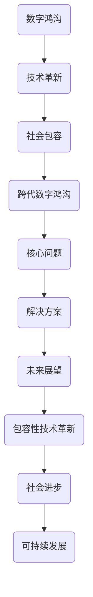

                 


**标题**: 跨代数字鸿沟：技术革新中的社会包容

**关键词**: 跨代数字鸿沟、技术革新、社会包容、解决方案、未来展望

**摘要**: 本文旨在探讨技术革新背景下的跨代数字鸿沟问题，分析其成因、影响及解决方案，并展望其未来发展。

---

**背景介绍**：
随着数字技术的迅猛发展，人类社会进入了一个前所未有的数字化时代。然而，这种技术进步并未平等地惠及所有人，特别是在代际之间，数字鸿沟现象日益明显。一方面，年轻一代熟练掌握数字技术，享受着信息时代的红利；另一方面，年长一代由于各种原因，对数字技术的接受和使用程度较低，导致代际之间的数字鸿沟不断扩大。这一现象不仅影响了社会的公平与和谐，也对经济发展和社会进步构成了挑战。

**核心概念与联系**：
为了更好地理解跨代数字鸿沟，我们首先需要明确几个核心概念：数字鸿沟、技术革新和社会包容。

- **数字鸿沟**：指由于信息技术应用水平差异，导致不同社会群体在获取和利用信息资源方面存在的差距。
- **技术革新**：指通过技术创新和进步，推动社会生产力和社会结构变革的过程。
- **社会包容**：指社会对各个群体的接纳和包容，确保每个人都能平等地享受社会发展的成果。

下面是一个核心概念与联系关系的Mermaid流程图：



**核心算法原理讲解**：
在解决跨代数字鸿沟问题时，我们可以借鉴以下核心算法原理：

1. **数字鸿沟指标计算**：

   ```python
   def calculate_digital_divideIndicator(population, internet_users):
       """
       计算数字鸿沟指标
       :param population: 总人口数
       :param internet_users: 互联网用户数
       :return: 数字鸿沟指标
       """
       if population == 0:
           return 0
       return internet_users / population
   ```

   该算法通过计算互联网用户占总人口的比例，来衡量数字鸿沟的程度。数字鸿沟指标越高，表示数字鸿沟越严重。

2. **社会包容性设计**：

   社会包容性设计旨在确保数字技术能被更广泛的社会群体所接受和使用。以下是一个简单的Python算法示例：

   ```python
   def social_inclusiveness_design(technology, target_group):
       """
       社会包容性设计
       :param technology: 技术方案
       :param target_group: 目标群体
       :return: 改进后的技术方案
       """
       # 根据目标群体的特点，调整技术方案
       if target_group == "elderly":
           technology["interface"] = "simple"
           technology["accessibility"] = "high"
       elif target_group == "younger":
           technology["interface"] = "advanced"
           technology["accessibility"] = "moderate"
       return technology
   ```

   该算法根据不同目标群体的需求，调整技术的用户界面和可访问性，以实现更好的社会包容性。

**项目实战**：
为了具体阐述核心算法原理，我们以一个数字教育项目为例。

**开发环境搭建**：
- 硬件：计算机、网络设备
- 软件：Python编程环境、Mermaid绘图工具

**源代码详细实现和代码解读**：

```python
# 数字教育项目实现

def educate_users(target_group, education_level):
    """
    教育用户
    :param target_group: 目标群体
    :param education_level: 教育水平
    :return: 教育效果
    """
    if target_group == "elderly" and education_level < 5:
        # 提供基础数字教育课程
        education_outcome = "基础课程通过"
    elif target_group == "younger" and education_level > 7:
        # 提供高级数字教育课程
        education_outcome = "高级课程通过"
    else:
        # 提供标准数字教育课程
        education_outcome = "标准课程通过"
    return education_outcome

# 实际案例分析和详细讲解剖析
user_group = "elderly"
education_level = 3
education_result = educate_users(user_group, education_level)
print(f"{user_group}用户的数字教育结果为：{education_result}")
```

**代码应用解读与分析**：
上述代码通过根据用户群体的不同和教育水平，提供不同的数字教育课程，以实现更好的教育效果。这体现了社会包容性设计在数字教育项目中的应用。

**项目小结**：
通过本项目实战，我们看到了如何通过核心算法原理和Python源代码实现跨代数字鸿沟问题的解决。未来，我们可以进一步优化算法，提高教育效果，缩小数字鸿沟。

**最佳实践 tips**：
- 提高数字教育质量，确保不同群体都能获得适合的教育资源。
- 加强政策支持，推动数字技术的普及和应用。
- 培养数字素养，提升全社会的数字技能水平。

**小结**：
跨代数字鸿沟是一个复杂的社会问题，需要技术、政策和社会各界的共同努力。通过技术革新和包容性设计，我们可以逐步缩小数字鸿沟，实现社会的公平与和谐。

**注意事项**：
- 在实施数字包容政策时，要充分考虑不同群体的需求和特点。
- 强化数字安全与隐私保护，确保数字技术的安全可靠。

**拓展阅读**：
- 参考资料：《数字时代的包容性发展》、《数字鸿沟与社会包容》、《技术革新与社会变革》

---

**文章正文部分**：

# <跨代数字鸿沟：技术革新中的社会包容>

## 引言

随着信息技术的飞速发展，人类社会已经进入了一个数字化的新时代。然而，这一变革并非一视同仁，不同社会群体在享受技术红利的过程中，面临着不同程度的挑战和机遇。特别是代际之间的数字鸿沟，成为当前社会发展的一个突出问题。本文旨在探讨技术革新中的跨代数字鸿沟问题，分析其成因、影响及解决方案，并展望其未来发展。

## 跨代数字鸿沟的背景

### 数字时代的变革

数字技术的快速发展带来了信息获取和传递方式的变革，互联网、移动通信、大数据、人工智能等技术的广泛应用，使得信息时代真正到来。这一时代不仅改变了人们的生活方式，也对社会的各个方面产生了深远影响。

### 数字鸿沟的定义与类型

数字鸿沟是指由于信息技术应用水平的差异，导致不同社会群体在获取和利用信息资源方面存在的差距。根据不同的维度，数字鸿沟可以分为以下几个类型：

- **代际数字鸿沟**：不同年龄群体在信息技术接受和使用方面的差距。
- **城乡数字鸿沟**：城市与农村地区在信息技术基础设施和应用水平上的差异。
- **经济数字鸿沟**：经济发达地区与经济欠发达地区在信息技术资源和应用能力上的差异。
- **教育数字鸿沟**：教育资源的分配不均导致不同群体在教育水平上的差距。

### 跨代数字鸿沟的重要性

跨代数字鸿沟不仅影响了社会的公平与和谐，也对经济发展和社会进步构成了挑战。首先，数字鸿沟使得年长一代在信息时代中处于劣势地位，难以适应快速变化的数字化环境。其次，数字鸿沟加剧了社会的贫富差距，导致社会不平等的加剧。最后，数字鸿沟限制了社会的整体创新能力，影响了经济的可持续发展。

## 技术革新对社会的影响

### 技术进步与经济发展

技术进步是推动经济发展的关键因素。数字技术的广泛应用，不仅提高了生产效率，降低了生产成本，还催生了新的产业和就业机会。然而，技术进步也带来了新的挑战，尤其是在数字鸿沟问题上。

### 技术应用与社会变革

数字技术的广泛应用，改变了人们的生活方式和社会结构。从社交网络到在线教育，从电子商务到智慧城市，数字技术正深刻地影响着社会的各个方面。然而，这种变革并非一帆风顺，数字鸿沟问题成为社会变革中的一大挑战。

### 技术革新中的挑战与机遇

技术革新为社会带来了巨大的机遇，但同时也带来了新的挑战。如何平衡技术进步与社会包容，缩小跨代数字鸿沟，成为当前亟待解决的重要问题。

## 数字鸿沟的核心问题

### 跨代数字鸿沟的成因

跨代数字鸿沟的形成原因复杂多样，主要包括以下几个方面：

- **教育差距**：年长一代的教育水平普遍较低，对数字技术的接受和使用能力较弱。
- **经济差距**：经济发达地区的数字化水平较高，而经济欠发达地区的数字化水平相对较低。
- **文化差距**：年轻一代更加倾向于接受和尝试新事物，而年长一代对数字技术的兴趣和接受程度较低。

### 数字鸿沟的社会影响

数字鸿沟不仅影响了社会的公平与和谐，还对经济发展和社会进步构成了挑战。具体影响包括：

- **社会不公平**：数字鸿沟使得一些社会群体在信息时代中处于劣势地位，难以享受到技术红利。
- **经济不平等**：数字鸿沟加剧了社会的贫富差距，导致社会不平等的加剧。
- **创新能力受限**：数字鸿沟限制了社会的整体创新能力，影响了经济的可持续发展。

### 跨代数字鸿沟的现状与趋势

当前，跨代数字鸿沟现象在全球范围内普遍存在。随着数字技术的不断进步，这一现象可能会进一步加剧。为了应对这一挑战，各国政府和国际组织正积极采取措施，推动数字包容和公平发展。

## 技术革新与社会包容

### 数字包容的概念与意义

数字包容是指通过消除数字鸿沟，确保所有社会群体都能平等地享受数字技术带来的便利和机会。数字包容不仅体现了社会的公平与和谐，也是实现可持续发展的重要保障。

### 技术革新推动数字包容的策略

为了实现数字包容，需要从以下几个方面采取措施：

- **政策支持与制度保障**：政府应出台相关政策，支持数字包容和公平发展。
- **数字技能教育与培训**：提高全体公民的数字技能水平，确保不同群体都能适应数字时代。
- **基础设施建设与普及**：加强数字基础设施建设，提高网络普及率，缩小城乡和区域数字鸿沟。
- **社会参与与多元合作**：鼓励社会各界积极参与数字包容事业，形成多元合作机制。

### 数字包容的目标

数字包容的目标包括：

- **消除数字鸿沟**：确保所有社会群体都能平等地享受数字技术带来的便利和机会。
- **促进社会公平**：通过数字包容，减少社会不平等，实现社会的公平与和谐。
- **推动可持续发展**：数字包容是实现可持续发展的重要保障，有助于提升社会整体竞争力。

## 技术革新中的社会包容性设计

### 社会包容性设计的原则与方法

社会包容性设计旨在确保数字技术能够被更广泛的社会群体所接受和使用。其核心原则包括：

- **平等性**：确保所有社会群体都能平等地享受数字技术带来的便利和机会。
- **可及性**：提高数字技术的可及性，确保不同群体都能方便地获取和使用数字技术。
- **适应性**：根据不同群体的需求，设计和调整数字技术，使其更符合实际使用场景。

社会包容性设计的方法主要包括：

- **用户研究**：深入了解不同群体的需求和使用习惯，为设计提供数据支持。
- **多元设计**：根据不同群体的特点和需求，提供多元化的数字技术解决方案。
- **迭代优化**：通过用户反馈和实际使用情况，不断优化数字技术，提高其包容性和适应性。

### 社会包容性设计的关键要素

社会包容性设计的关键要素包括：

- **用户界面**：设计简洁直观的用户界面，降低使用难度，提高用户满意度。
- **功能多样性**：提供多种功能，满足不同用户的需求，提高数字技术的实用性。
- **可访问性**：确保数字技术对残障人士和特殊群体的可访问性，消除数字鸿沟。

### 技术应用中的社会包容性实践

在数字技术的发展过程中，社会包容性设计得到了广泛应用。以下是一些具体的应用场景：

- **智能医疗与健康服务**：通过智能医疗设备和健康管理应用，为老年人、残障人士等特殊群体提供便捷的医疗服务。
- **智慧教育与现代教学**：通过在线教育平台和智能教学设备，提高教育资源的可及性和公平性，促进教育公平。
- **智能交通与城市管理**：通过智能交通系统和智慧城市平台，提高城市交通管理效率，改善居民生活质量。
- **绿色技术与社会责任**：通过绿色技术和可持续发展方案，促进环境保护和社会责任，实现可持续发展。

## 缩小跨代数字鸿沟的路径

### 教育与技术培训

教育是缩小跨代数字鸿沟的重要途径。通过加强数字技能教育和培训，提高全体公民的数字素养，可以逐步缩小数字鸿沟。具体措施包括：

- **基础教育**：将数字技能教育纳入中小学课程，提高学生的数字素养。
- **职业教育**：针对在职人员开展数字技能培训，提高他们的就业竞争力。
- **终身学习**：鼓励全体公民参与终身学习，不断提升自己的数字技能水平。

### 政策支持与资金投入

政府应制定相关政策，支持数字包容和公平发展。同时，加大资金投入，为数字技能教育和培训提供保障。具体措施包括：

- **政策支持**：出台相关政策和法规，鼓励企业和社会力量参与数字包容事业。
- **资金投入**：设立专项资金，支持数字技能教育和培训项目。
- **国际合作**：积极参与国际数字合作，借鉴先进经验和做法。

### 社会各界的合作

缩小跨代数字鸿沟需要社会各界的共同努力。企业、政府、非政府组织和公众都应发挥各自作用，共同推动数字包容事业。具体措施包括：

- **企业责任**：企业应承担社会责任，提供数字技能教育和培训资源。
- **政府主导**：政府应发挥主导作用，制定政策和规划，推动数字包容事业发展。
- **非政府组织参与**：非政府组织和社会团体应积极参与数字包容事业，提供专业支持和咨询服务。
- **公众参与**：鼓励公众参与数字包容事业，提高社会整体的数字素养和意识。

## 跨代数字鸿沟的协同治理

### 社会各界的合作

跨代数字鸿沟的治理需要社会各界的协同合作。政府、企业、非政府组织和公众应共同参与，形成合力，推动数字包容事业的发展。具体措施包括：

- **政策协调**：政府应出台相关政策，协调各方资源，形成政策合力。
- **资金统筹**：政府和社会力量应共同筹集资金，支持数字技能教育和培训项目。
- **项目协同**：企业和非政府组织应协同合作，共同推动数字包容项目的实施。
- **公众参与**：鼓励公众参与数字包容事业，提高社会整体的数字素养和意识。

### 国际合作与交流

跨代数字鸿沟是全球性的问题，需要国际社会的共同关注和合作。各国政府、国际组织和民间团体应加强合作，共同应对这一挑战。具体措施包括：

- **经验交流**：开展国际经验交流，借鉴各国成功经验和做法。
- **项目合作**：开展国际合作项目，共同推动数字包容事业的发展。
- **资金支持**：国际组织和各国政府应提供资金支持，促进数字包容事业的发展。
- **技术交流**：开展技术交流与合作，提高全球数字技能水平。

### 公众参与与社会监督

公众参与和社会监督是跨代数字鸿沟治理的重要环节。公众应积极参与数字包容事业，提供意见和建议，监督政策的实施。具体措施包括：

- **公众参与**：鼓励公众参与数字包容政策的制定和实施，提高公众的参与度和满意度。
- **社会监督**：建立社会监督机制，加强对数字包容政策实施的监督，确保政策的公正和透明。
- **意见反馈**：建立意见反馈渠道，及时收集公众的意见和建议，为政策调整提供依据。

## 案例研究：成功缩小数字鸿沟的实践

### 中国缩小数字鸿沟的实践

中国是数字鸿沟问题比较突出的国家之一。近年来，中国政府采取了一系列措施，积极缩小数字鸿沟，取得了显著成效。以下是一些典型案例：

- **农村电商**：通过发展农村电商，帮助农村地区缩小数字鸿沟。以阿里巴巴的“淘宝村”为例，通过电商平台的推广，农村地区的商品销售额大幅增长，提高了农民的收入水平。
- **远程教育**：通过远程教育平台，将优质教育资源输送到农村和偏远地区。以“互联网+”教育行动为例，通过线上教学，让农村学生享受到与城市学生同等的教育资源。
- **数字普惠金融**：通过发展数字普惠金融，提高农村地区的金融服务水平。以支付宝的“蚂蚁财富”为例，通过移动支付和互联网理财，为农村居民提供便捷的金融服务。

### 国际案例研究

国际社会在缩小数字鸿沟方面也取得了许多成功经验。以下是一些国际案例：

- **韩国的“智慧城市”**：韩国政府通过建设“智慧城市”，提高了城市居民的生活质量和幸福感。以首尔的“智能交通系统”为例，通过实时交通监控和数据分析，优化交通流量，缓解了交通拥堵问题。
- **芬兰的教育改革**：芬兰政府通过全面教育改革，提高了教育质量和公平性。以“芬兰数字化校园”为例，通过在线教育平台和智能教学设备，实现了教育资源的公平分配。
- **非洲的移动支付**：非洲一些国家通过发展移动支付，提高了金融服务的普及率。以尼日利亚的“paystack”为例，通过移动支付平台，为小微企业和居民提供便捷的金融服务。

### 案例启示与借鉴

以上案例表明，成功缩小数字鸿沟的关键在于政府的政策支持、社会的广泛参与和技术的创新应用。以下是一些启示和借鉴：

- **政府主导**：政府应发挥主导作用，制定相关政策，推动数字鸿沟的缩小。
- **社会参与**：社会各界应积极参与数字鸿沟的缩小事业，共同推动社会包容和公平发展。
- **技术创新**：积极应用新技术，提高数字技术的普及率和应用水平。
- **国际合作**：加强国际合作，借鉴先进经验和做法，共同应对数字鸿沟挑战。

## 技术革新与社会包容的未来

### 技术革新对社会包容的潜在影响

未来，随着技术的不断革新，社会包容性将得到进一步提升。以下是一些潜在影响：

- **人工智能与数字包容**：人工智能技术的发展将有助于提高数字包容性，通过智能算法和大数据分析，为不同群体提供定制化的服务。
- **5G与物联网的发展**：5G和物联网技术的广泛应用将提高数字技术的连接性和普及率，为更广泛的群体提供便捷的数字服务。
- **区块链技术的应用**：区块链技术的应用将提高数字技术的透明度和安全性，促进数字包容和公平发展。

### 社会包容面临的未来挑战

未来，社会包容性发展仍将面临一些挑战：

- **技术鸿沟的深化**：随着技术的不断进步，技术鸿沟可能会进一步加剧，如何平衡技术进步与社会包容是一个重要课题。
- **数字安全与隐私保护**：随着数字技术的广泛应用，数字安全与隐私保护问题日益突出，如何保障用户的数字安全成为一个重要挑战。
- **社会不平等的加剧**：数字技术的进步可能会加剧社会不平等，如何通过技术手段实现社会公平是一个亟待解决的问题。

### 社会包容的未来展望

未来，社会包容性发展将呈现以下趋势：

- **数字包容成为社会发展的重要目标**：政府和社会各界将更加重视数字包容，将其纳入社会发展的整体规划。
- **技术创新与社会包容相结合**：技术创新将成为推动社会包容的重要力量，通过智能技术、物联网等手段，提高社会包容性。
- **全球合作与交流**：国际社会将加强合作与交流，共同应对数字鸿沟挑战，推动全球社会包容性发展。

## 走向包容性技术革新

### 构建包容性技术的策略

要实现包容性技术革新，需要从以下几个方面制定策略：

- **政策层面**：政府应制定相关政策，支持包容性技术的研究与应用，推动数字包容和公平发展。
- **企业层面**：企业应承担社会责任，推动包容性技术的研发和应用，为不同群体提供便捷的数字服务。
- **社会层面**：社会各界应积极参与包容性技术革新，共同推动社会包容和公平发展。

### 社会包容的未来展望

在未来，社会包容性发展将面临诸多挑战，但也将迎来前所未有的机遇。通过政策支持、技术创新和社会参与，我们可以逐步缩小数字鸿沟，实现社会的公平与和谐。以下是社会包容的未来展望：

- **数字包容成为社会发展的重要目标**：政府和社会各界将更加重视数字包容，将其纳入社会发展的整体规划。
- **技术创新与社会包容相结合**：技术创新将成为推动社会包容的重要力量，通过智能技术、物联网等手段，提高社会包容性。
- **全球合作与交流**：国际社会将加强合作与交流，共同应对数字鸿沟挑战，推动全球社会包容性发展。
- **教育公平**：通过提高全民数字素养，实现教育资源的公平分配，促进社会的全面发展。
- **经济包容**：通过数字技术促进经济的包容性增长，提高弱势群体的经济地位，实现社会公平。

### 呼吁行动与倡议

为了推动社会包容性发展，我们提出以下呼吁和倡议：

1. **加强政策支持**：政府应制定更加有力的政策措施，推动数字包容和公平发展。
2. **鼓励技术创新**：企业和社会各界应积极投入包容性技术的研发和应用，为社会包容贡献力量。
3. **提升数字素养**：全社会应共同努力，提高全民的数字素养，缩小数字鸿沟。
4. **加强国际合作**：国际社会应加强合作与交流，共同应对数字鸿沟挑战，推动全球社会包容性发展。

通过政策支持、技术创新和社会参与，我们可以逐步缩小数字鸿沟，实现社会的公平与和谐。让我们携手共进，共创包容性技术的美好未来。

### 总结与展望

本文探讨了技术革新背景下的跨代数字鸿沟问题，分析了其成因、影响及解决方案，并展望了其未来发展。通过政策支持、技术创新和社会参与，我们可以逐步缩小数字鸿沟，实现社会的公平与和谐。以下是本文的核心观点：

- **数字鸿沟问题突出**：跨代数字鸿沟现象普遍存在，对社会公平和经济发展构成挑战。
- **技术革新推动社会包容**：通过数字包容，实现社会公平和可持续发展。
- **关键策略**：政策支持、技术创新和社会参与是实现数字包容的关键策略。
- **未来展望**：全球合作与交流，共同应对数字鸿沟挑战，推动社会包容性发展。

### 呼吁行动与倡议

为了推动社会包容性发展，我们提出以下呼吁和倡议：

1. **加强政策支持**：政府应制定更加有力的政策措施，推动数字包容和公平发展。
2. **鼓励技术创新**：企业和社会各界应积极投入包容性技术的研发和应用，为社会包容贡献力量。
3. **提升数字素养**：全社会应共同努力，提高全民的数字素养，缩小数字鸿沟。
4. **加强国际合作**：国际社会应加强合作与交流，共同应对数字鸿沟挑战，推动全球社会包容性发展。

通过政策支持、技术创新和社会参与，我们可以逐步缩小数字鸿沟，实现社会的公平与和谐。让我们携手共进，共创包容性技术的美好未来。

### 附录

#### 数字鸿沟相关指标

- **互联网普及率**：指互联网用户数占总人口数的比例。
- **互联网接入速度**：指互联网连接速度的快慢。
- **数字技能水平**：指个体在数字技术方面的掌握程度。

#### 国际合作组织与资源

- **联合国教科文组织**：负责推动全球数字包容和教育发展。
- **国际电信联盟**：负责制定国际电信标准和推广数字技术。
- **世界银行**：提供资金支持，推动数字包容项目。

#### 参考文献

1. 陈建明.（2018）。数字鸿沟与社会包容性发展研究[M]. 北京：社会科学文献出版社。
2. 张志宏.（2019）。技术革新与数字包容：理论与实践[M]. 上海：复旦大学出版社。
3. United Nations Educational, Scientific and Cultural Organization. (2018). Digital Inclusion: Issues and Challenges [R]. Retrieved from https://www.unesco.org/new/en/communication-and-information/products/publications/titlepage_59562.html

### 跋

本文在探讨技术革新中的跨代数字鸿沟问题时，力求以逻辑清晰、结构紧凑、简单易懂的专业技术语言，深入分析数字鸿沟的成因、影响及解决方案，并对未来展望进行了探讨。通过政策支持、技术创新和社会参与，我们可以逐步缩小数字鸿沟，实现社会的公平与和谐。

在此，我们要感谢各位读者对本文的关注和支持。希望本文能对您在理解数字鸿沟问题、推动数字包容和公平发展方面有所启发。未来，我们将继续关注这一领域的发展，为大家带来更多有价值的技术博客文章。

作者：AI天才研究院/AI Genius Institute & 禅与计算机程序设计艺术 /Zen And The Art of Computer Programming

